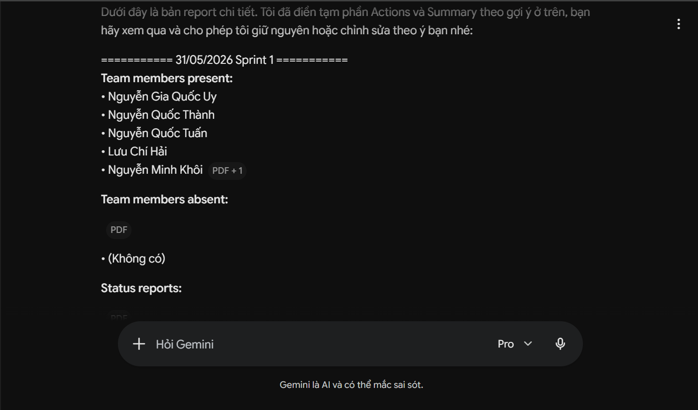
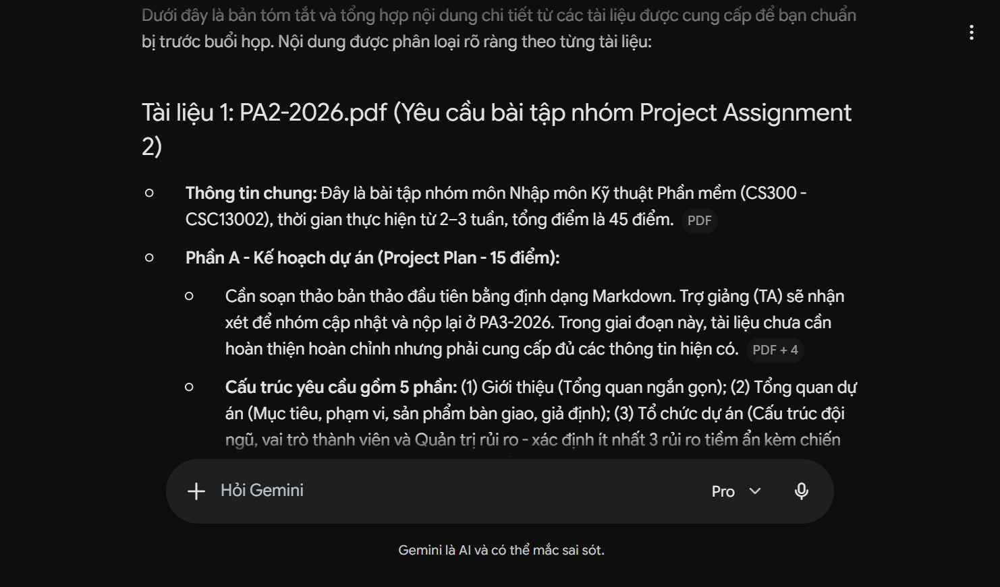
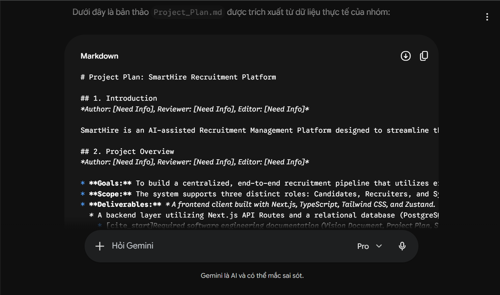
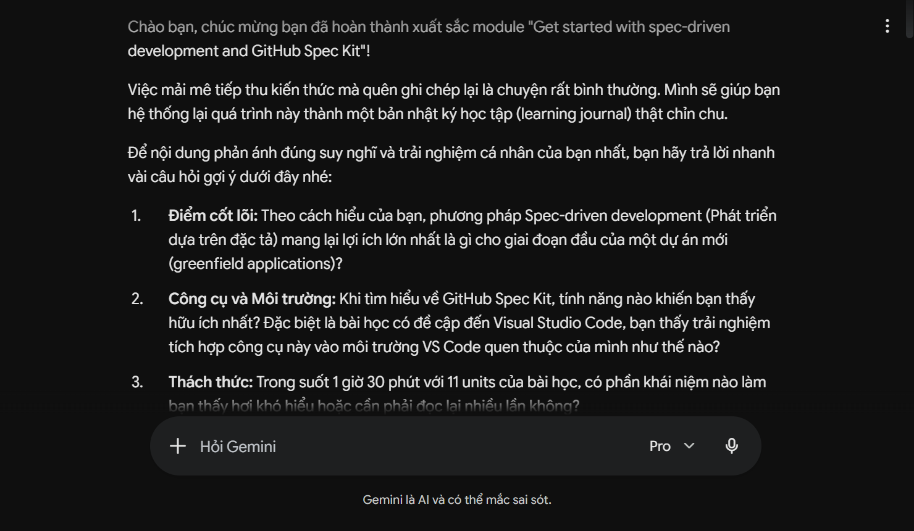

# AI Usage Report For PA2

*Performed by: Lưu Chí Hải | Reviewed by: Nguyễn Gia Quốc Uy | Edited by: Lưu Chí Hải*

**Student Name:** Lưu Chí Hải   
**Student ID:** 24127030    
**Group:** 09
**Class:** 24C11    
**Course/Project:** Software Engineering

---

**Use Case 1:**
- **Tool name, version, and platform:** Gemini (Google) 3.1 Pro Standard, Web Platform
- **Access time (date and hour):** 06/06/2026 02:00 pm
- **Prompts used:** "Giúp tôi viết weekly scrum meeting report dựa vào format trong 'Weekly Reports.pdf' và các tiêu chí chấm điểm trong 'PA1-2026.pdf'. Dưới đây là những nội dung cần thiết: ... (provided raw meeting details and Notion task screenshot)"
- **Purpose of use:** To generate a complete, correctly formatted Markdown report for the first weekly Scrum meeting that complies with all grading requirements in one step.
- **Which content was generated by AI:** The structured Markdown document, professional English translation of the status updates, and the placement of authorship tags and task screenshots.
- **Which content was done independently and how the student edited or validated it:** I gathered the meeting notes, took the task board screenshot, and provided the strict grading rubrics. I reviewed the final AI-generated Markdown to ensure no team member's status was hallucinated and that all PDF requirements were strictly met. From the second scrum meeting report on, I just use that framework again and again without AI's help.
- **Screenshots or chat history:** 

**Use Case 2:**
- **Tool name, version, and platform:** Gemini (Google) 3.1 Pro Standard, Web Platform
- **Access time (date and hour):** 10/06/2026, 09:00 pm
- **Prompts used:** "Tóm tắt, tổng hợp nội dung trong các tài liệu này, liệt kê nội dung theo từng tài liệu theo định dạng như sau: Tài liệu A:...(submitted with 4 project documents)"
- **Purpose of use:** I provided sources for AI so that I can read them in Vietnamese (which is faster than in English), summarize the contents before the team meeting.
- **Which content was generated by AI:** Detailed summaries of the four documents, including assignment constraints for PA2-2026.pdf, structural guidelines from rup_vision_sp.docx, real-world examples from rup_vision_sp-example.docx, and RUP-based metrics from rup_sdpln_sp.dot.doc.
- **Which content was done independently and how the student edited or validated it:** Read the files in both English and Vietnamese to prepare for the meeting. 
- **Screenshots or chat history:** 

**Use Case 3:**
- **Tool name, version, and platform:** Gemini (Google) 3.1 Pro Standard, Web Platform
- **Access time (date and hour):** 8/6/2026, 09:00 am
- **Prompts used:** "Bạn là một chuyên gia về document trong công nghệ phần mềm. Dựa vào hướng dẫn trong file PA2-2026.pdf, giúp tôi viết bản thảo, khung cho Project_Plan.md, sử dụng tất cả thông tin trong các file tôi gửi bạn, nếu không biết hoặc thiếu thông tin nào, hãy hỏi tôi và chỉ thêm thông tin mới, không có trong các file tôi gửi khi có sự chấp nhận của tôi. Tuyệt đối không được ảo tưởng hay bịa ra thông tin mới. (provided the AI with 3 files: Useful Information for Project SE.doc, Reference Function.doc, and PA2-2026.pdf)"
- **Purpose of use:** To draft the initial structure and content of the Project_Plan.md document by synthesizing provided project files (Useful Information for Project SE.doc, Reference Function.doc) and strictly adhering to the formatting and criteria in the PA2-2026.pdf rubric.
- **Which content was generated by AI:** The foundational Markdown structure of the project plan, including pre-filled sections for the Introduction, Project Overview, and Team Organization based on the provided documents.
- **Which content was done independently and how the student edited or validated it:** I provided the raw source documents alongside the grading criteria. I reviewed the generated text to ensure it accurately reflected the team's actual project scope and assigned roles. Furthermore, I manually added missing specific information and rewrote some sections to better align with the team's actual context.
- **Screenshots or chat history:** 

**Use Case 4:**

- **Tool name, version, and platform:** Gemini (Google) 3.1 Pro Standard, Web Platform
- **Access time (date and hour):** 16/06/2026 09:00 am
- **Prompts used:** "tôi đã học github spectkit rồi nhưng lại quên lưu nhật ký học (ảnh trên chứng minh là tôi đã học rồi). Giúp tôi viết nhật ký học, có thể hỏi tôi những câu hỏi cần thiết để hỗ trợ viết. (sent with a image has the proof that I have completed Microsoft's Github Spec Kit course)".
- **Purpose of use:** "To generate a structured outline and provide guiding questions to help me reconstruct my learning journal for the Github Spec Kit, strictly based on the knowledge I acquired from completing the course."
- **Which content was generated by AI:** The initial structural layout and a clarifying questionnaire designed to help extract key insights.
- **Which content was done independently and how the student edited or validated it:** I completed the Microsoft course (proven by the attached screenshot). I completed the file based on the framework written by my team members, the knowledge in my head, and by answering the AI's guiding questions to write the content myself.
- **Screenshots or chat history:** 

