# AI Usage Report For PA2

**Student Name:** Nguyễn Minh Khôi 
**Student ID:** 24127066  
**Group:** 09   
**Class:** 24C11   
**Course/Project:** Software Engineering 

**Use Case 1:**
- **Tool name, version, and platform:** NotebookLM
- **Access time (date and hour):**  8:20 PM, 10/6/2026
- **Prompts used:** "summarize all the information about the project in this proposal, so that i can understand what the team is going to build and i can write a product overview"
- **Purpose of use:** Use to clarify the features and tech stack in the project proposal
- **Which content was generated by AI:** A summarized information about all important things mentioned in the proposal, including technical architecture, developing environment and web work flow.
- **Which content was done independently and how the student edited or validated it:** I have done the proposal analysis and reading independently and compared  the AI generated content to what i have learnt. I just use the content that created by AI to double check my understanding of the overall project.
- **Screenshots or chat history:** 
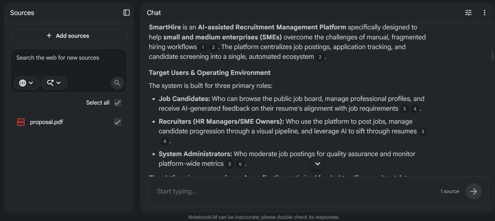

**Use Case 2:**
- **Tool name, version, and platform:** Google Gemini 3.5 Flash
- **Access time (date and hour):**  7:13 PM, 14/6/2026
- **Prompts used:** "tell me what i and my team need to do and submit, base on this PA2 "
- **Purpose of use:** Use to clarify the assignment in PA2
- **Which content was generated by AI:** A detailed list of activities that need to be completed, a formatting rules for all documents
- **Which content was done independently and how the student edited or validated it:** I have done the reading and analyzing the PA2. I just use the content that created by AI to double check my understanding of the assignment.
- **Screenshots or chat history:** 
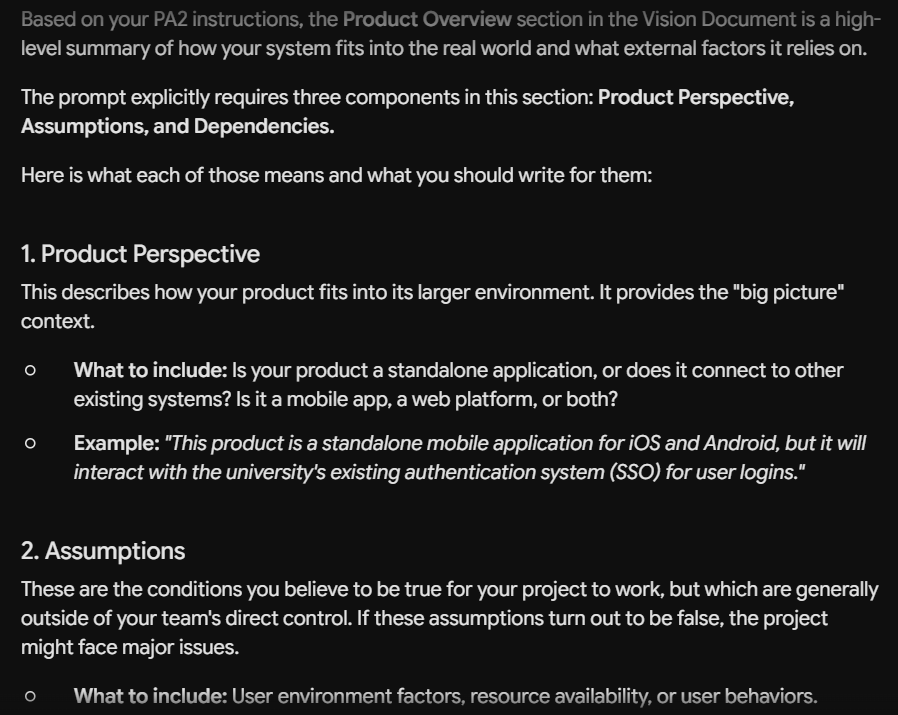

**Use Case 3:**
- **Tool name, version, and platform:**Google Gemini 3.5 Flash
- **Access time (date and hour):**  8:54 PM, 14/6/2026
- **Prompts used:** "Based on my PA2 instructions, in the Vision Document, what is the product overview section, what does it contain"
- **Purpose of use:** Study the stucture and purpose of the Vision Document.
- **Which content was generated by AI:** A detailed information on three components in this section: Product Perspective, Assumptions, and Dependencies.
- **Which content was done independently and how the student edited or validated it:**  The student validated the generated information based on the provided references and study materials of the practical lecturer.
- **Screenshots or chat history:** 
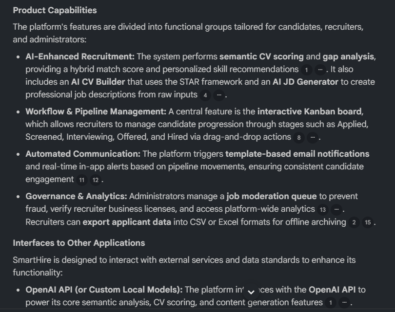

**Use Case 4:**
- **Tool name, version, and platform:** NotebookLM
- **Access time (date and hour):**  9:33 PM, 15/6/2026
- **Prompts used:** "provide a high level view of the product capabilities, interfaces to other application, and system configurations"
- **Purpose of use:** Explaining in more detail the interaction between the web and others API, analyzing carefully the System Configurations.
- **Which content was generated by AI:** A detailed explanation of the product capabilities and Interfaces to Other Applications.
- **Which content was done independently and how the student edited or validated it:** The student independently read and study the core feature and workflow of the web base on the project proposal .
- **Screenshots or chat history:** 
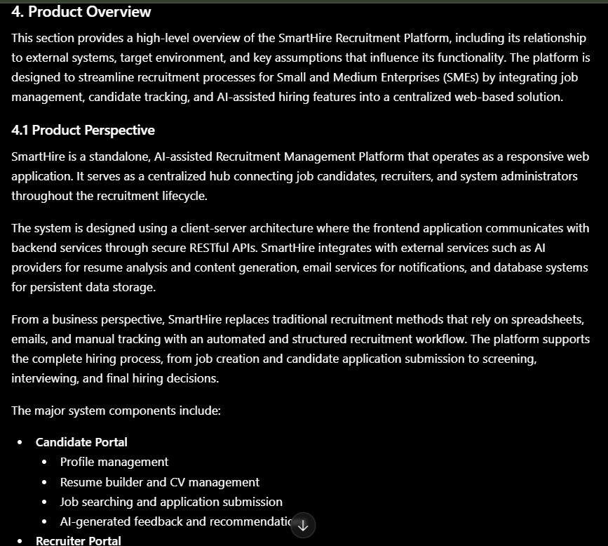

**Use Case 5:**
- **Tool name, version, and platform:**  Gemini
- **Access time (date and hour):**  7:33 AM, 17/6/2026
- **Prompts used:** "base on the project proposal, write for me the Product overview section, with the structure as follow: 4. Product Overview, 4.1 Product Perspective, 4.2 Assumptions and Dependencies, the overall product ecosystem should be represented as a graph using mermaid syntax"
- **Purpose of use:** Use AI to craft a draft version of the Product overview in the vision document.
- **Which content was generated by AI:** A detailed report for the Product overview section.
- **Which content was done independently and how the student edited or validated it:** The student have read the proposal document and listed out all contents that need to be included in the report section. Additional information provided by AI is also verified by student.
- **Screenshots or chat history:** 
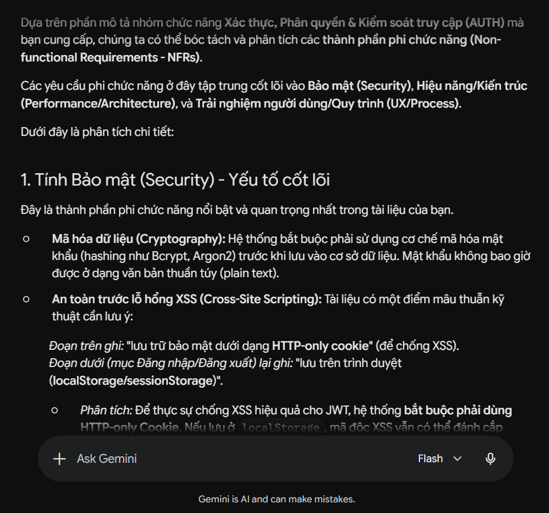

**Use Case 6:**
- **Tool name, version, and platform:**  Gemini
- **Access time (date and hour):**  3:33 PM, 27/6/2026
- **Prompts used:** "base on the Reference Function document, analyze all non-functional requirements of the AUTHENTICATION, AUTHORIZATION & ACCESS CONTROL (AUTH) feature group."
- **Purpose of use:** Use AI to explore non-functional requirements when handling user security and role-based access control.
- **Which content was generated by AI:** The detailed analysis of non-functional requirements for the "AUTH" feature groups, including the structured bullet points, recommendations, and technical callouts.
- **Which content was done independently and how the student edited or validated it:** The student have read the proposal document and Reference Function document to validate the completeness of the analysis.
- **Screenshots or chat history:** 
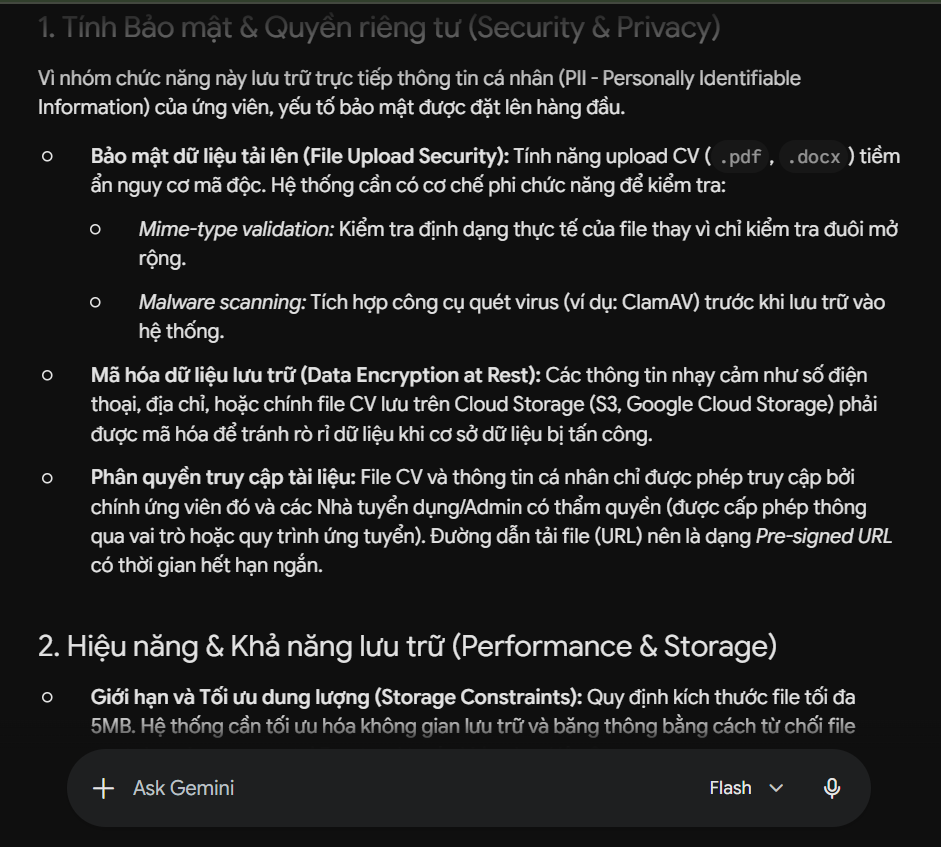

**Use Case 7:**
- **Tool name, version, and platform:**  Gemini
- **Access time (date and hour):**  4:03 PM, 27/6/2026
- **Prompts used:** "base on the Reference Function document, analyze all non-functional requirements of the CANDIDATE PROFILE MANAGEMENT feature group."
- **Purpose of use:** Use AI to explore non-functional requirements when handling file management, and data structuring for profile management.
- **Which content was generated by AI:** The detailed analysis of non-functional requirements  for the "CANDIDATE PROFILE MANAGEMENT" feature groups, including the structured bullet points, recommendations, and technical callouts..
- **Which content was done independently and how the student edited or validated it:** The student have read the proposal document and Reference Function document to validate the completeness of the analysis.
- **Screenshots or chat history:** 
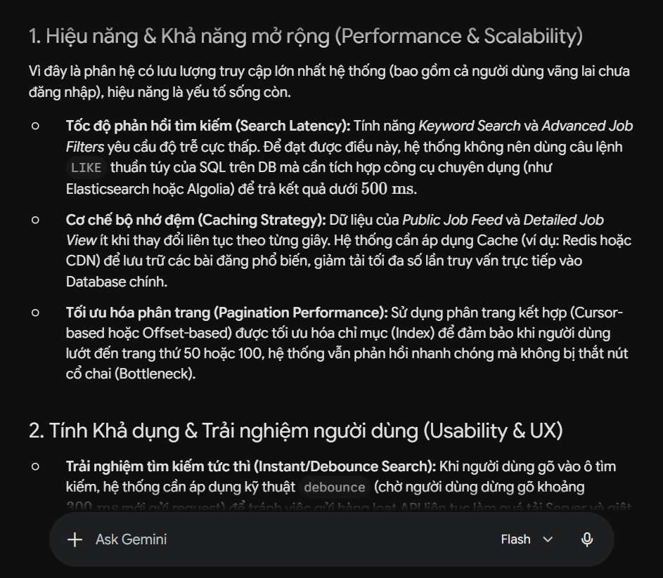

**Use Case 8:**
- **Tool name, version, and platform:**  Gemini
- **Access time (date and hour):**  4:33 PM, 27/6/2026
- **Prompts used:** "base on the Reference Function document, analyze all non-functional requirements of the JOB BOARD & ADVANCED SEARCH feature group."
- **Purpose of use:** Use AI to explore non-functional requirements when handling high-traffic search modules, data caching, indexing strategies, and public access optimization.
- **Which content was generated by AI:** The detailed analysis of non-functional requirements  for the "JOB BOARD & ADVANCED SEARCH" feature groups, including the structured bullet points, recommendations, and technical callouts.
- **Which content was done independently and how the student edited or validated it:** The student have read the proposal document and Reference Function document to validate the completeness of the analysis.
- **Screenshots or chat history:** 
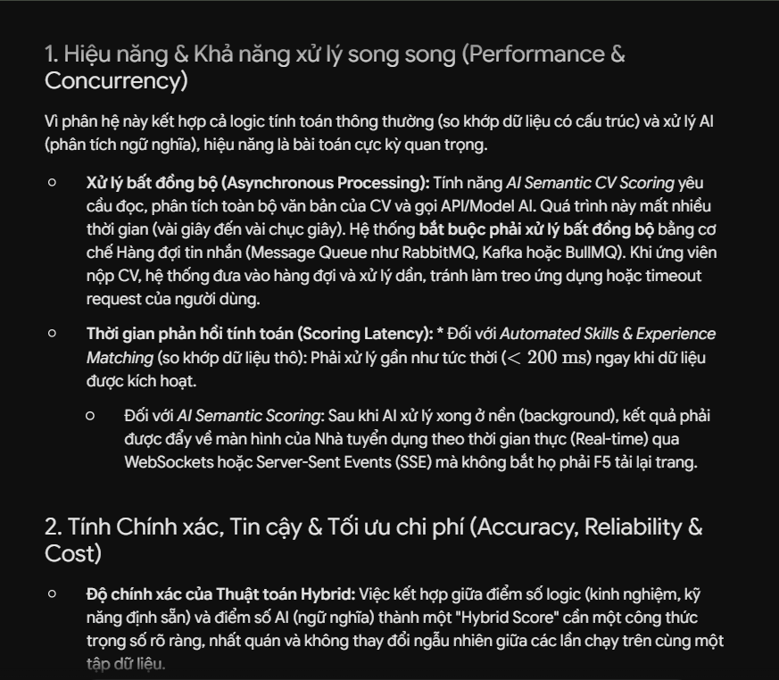

**Use Case 9:**
- **Tool name, version, and platform:**  Gemini
- **Access time (date and hour):**  4:41 PM, 27/6/2026
- **Prompts used:** "base on the Reference Function document, analyze all non-functional requirements of the APPLICANT SIFTING & HYBRID SCORING ENGINE feature group."
- **Purpose of use:**Use AI to explore complex non-functional requirements regarding asynchronous background processing, heavy computing, AI cost optimization, and real-time data streaming.
- **Which content was generated by AI:** The technical breakdown of non-functional constraints for the "APPLICANT SIFTING & HYBRID SCORING ENGINE" feature groups.
- **Which content was done independently and how the student edited or validated it:** The student have read the proposal document and Reference Function document to validate the completeness of the analysis.
- **Screenshots or chat history:** 
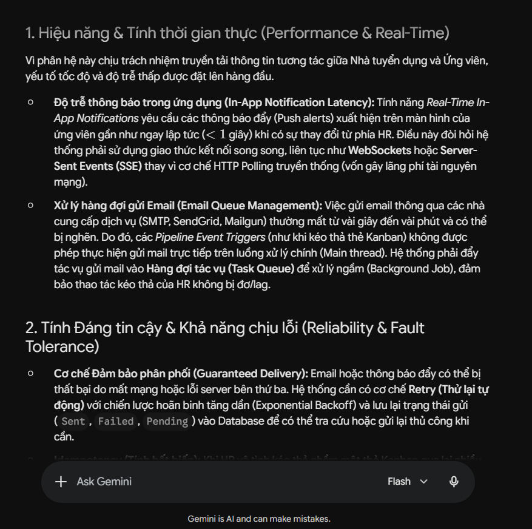

**Use Case 10:**
- **Tool name, version, and platform:**  Gemini
- **Access time (date and hour):**  5:04 PM, 27/6/2026
- **Prompts used:** "base on the Reference Function document, analyze all non-functional requirements of the AUTOMATED NOTIFICATION & IN-APP ALERTS feature group."
- **Purpose of use:**Use AI to explore non-functional requirements focused on real-time data communication (WebSockets/SSE), background task queuing for email distribution, and fault tolerance systems.
- **Which content was generated by AI:** The comprehensive breakdown of non-functional requirements for the "AUTOMATED NOTIFICATION & IN-APP ALERTS" module, detailing Performance/Real-Time, Reliability/Fault Tolerance, and Usability/Data Management constraints.
- **Which content was done independently and how the student edited or validated it:** The student have read the proposal document and Reference Function document to validate the completeness of the analysis.
- **Screenshots or chat history:** 
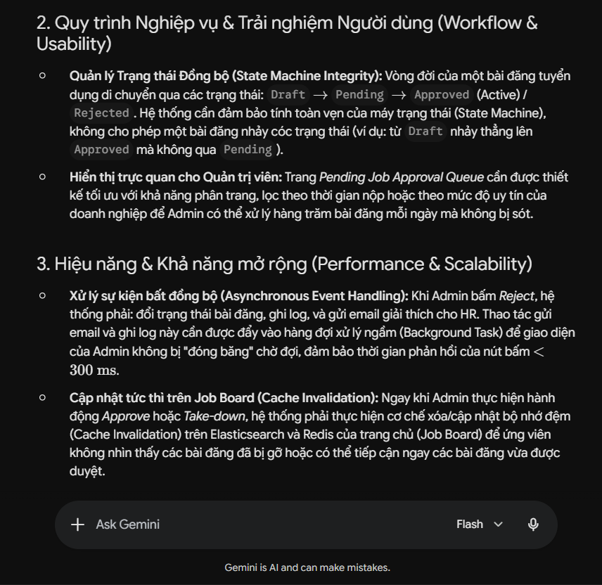

**Use Case 11:**
- **Tool name, version, and platform:**  GPT-5.2 instant
- **Access time (date and hour):**  7:44 PM, 27/6/2026
- **Prompts used:** "base on 10 feature in the Reference Function document, provide a draft for non-functional requirements section."
- **Purpose of use:**Use AI to sumarize and generate a draft for non-functional requirements report.
- **Which content was generated by AI:** A detailed report for the non-functional requirements.
- **Which content was done independently and how the student edited or validated it:** The student have read the proposal document and Reference Function document to validate the completeness of the report, plus read the generated script to make sure the contents stay within the scope of the group project.
- **Screenshots or chat history:** 
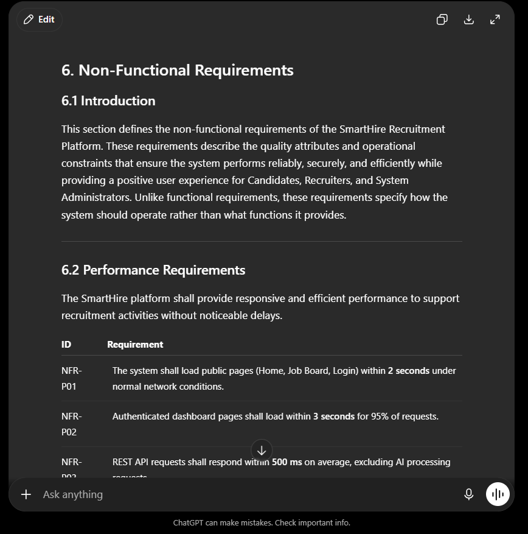
