# AI Usage Report For PA2

**Student Name:** Nguyễn Quốc Thành <br>
**Student ID:** 24127542  
**Group:** 09  
**Class:** 24C11  
**Course/Project:** Software Engineering

## AI Usage Notes

I used Vietnamese to prompt in many Use Case so that I may write in Vietnamese in the following Use Case Prompt and Output.

## Table of contents

1. [Task 1 - Existing App Survey (Linkedin)](#task-1---existing-app-survey-linkedin)
   - [Use Case 1: Identify LinkedIn API endpoints](#use-case-1)
   - [Use Case 2: Identify LinkedIn inefficiencies](#use-case-2)
   - [Use Case 3: Structure UI/UX analysis report](#use-case-3)
2. [Task 2 - Vision Doc (Stakeholder & User Description)](#task-2---vision-doc-stakeholder--user-description)
   - [Use Case 1: Understand stakeholders](#use-case-1-1)
   - [Use Case 2: Draft Stakeholder & User descriptions](#use-case-2-1)
   - [Use Case 3: Evaluate Stakeholder.md quality](#use-case-3-1)
3. [Task 3 - Learning Spec Kit](#task-3---learning-spec-kit)
   - [Use Case 1: Overview of Spec Kit](#use-case-1-2)
4. [Task 4 - Draw a workflow important](#task-4---draw-a-work-flow-important)
   - [Use Case 1: Evaluate important flows](#use-case-1-3)
   - [Use Case 2: Define auth flow constraints](#use-case-2-2)
   - [Use Case 3: Assess workflow completeness](#use-case-3-2)
   - [Use Case 4: Real-world processing examples](#use-case-4)
5. [Task 5 - Write the AI usage report](#task-5---write-the-ai-usage-report)
6. [Task 6 - Convert Spec Kit training MD to PDF](#task-6---convert-spec-kit-training-md-to-pdf)

## Task 1 - Existing App Survey (Linkedin)

### Use Case 1:

- **Tool name, version, and platform:** context.dev
- **Access time (date and hour):** 8:12 PM, 1/6/2026
- **Prompts used:** No prompt was used
- **Purpose of use:** To identify relevant LinkedIn API endpoints to be used for the PA2 implementation.
- **Which content was generated by AI:** A markdown file included structure of linkedin website (APIs)
- **Which content was done independently and how the student edited or validated it:** Manually accessed the link provided by the AI to verify the extracted API structure.
- **Screenshots or chat history:**
  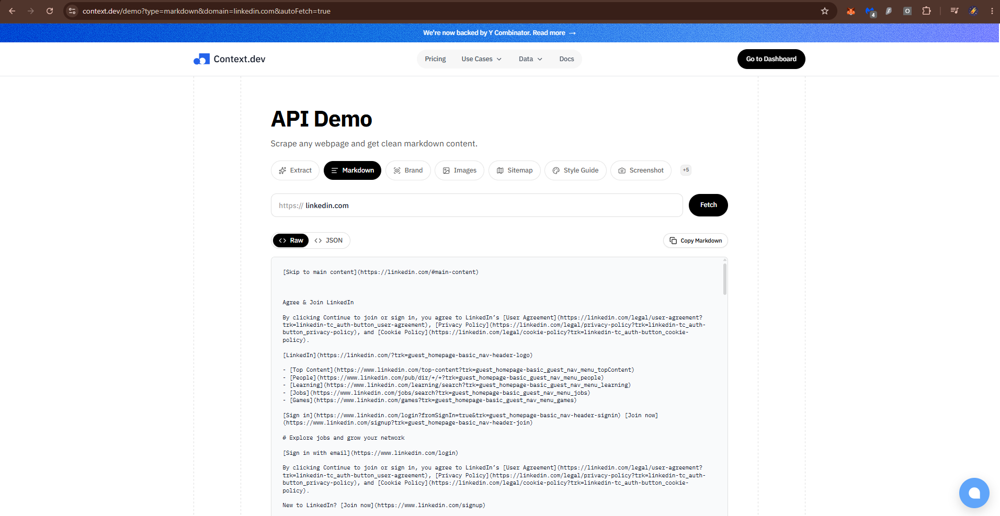

### Use Case 2:

- **Tool name, version, and platform:** Claude code, Sonnet 4.6 (Weak)
- **Access time (date and hour):** 8:20 PM, 1/6/2026
- **Prompts used:** `file APIs from context.dev` + "Tôi đang có đồ án nhóm là chọn ứng dụng linked in tìm ra sự bất cập của source hiện tại về tính năng, giao diện,... chưa cho trải nghiệm tốt với users, bạn hãy gợi ý cho tôi tìm ra các điểm tôi có thể build thêm vào dự án để đạt điểm tối đa với giảng viên"
- **Purpose of use:** Identify the current inefficiencies of the LinkedIn website to serve as a basis for developing a smart hire project.
- **Which content was generated by AI:** Problem about UI, Features, UX/Accessibility of website linkedin.
- **Which content was done independently and how the student edited or validated it:** Access the website and start using it to test whether the AI's statements are realistic.
- **Screenshots or chat history:**
  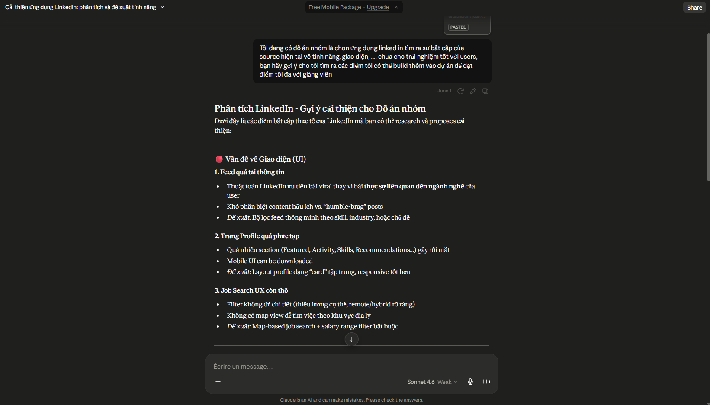

### Use Case 3:

- **Tool name, version, and platform:** ChatGPT Plus, GPT-5.5 (medium)
- **Access time (date and hour):** 11:05 PM, 2/6/2026
- **Prompts used:**
  "1. Tổng quan nền tảng (giới thiệu ngắn, số liệu key) 2. Design System & Visual Language 3. Phân tích UI từng màn hình 4. Accessibility & Responsive 5. Performance UX 6. Tính năng chính 7. AI & Premium 8. SEO & Discoverability 9. Điểm mạnh & Điểm yếu 10. Phân tích cạnh tranh 11. Cơ hội cải thiện 12. Kết luận
  Tôi muốn tạo một report theo format này, những gì tôi còn thiếu là gì?"
- **Purpose of use:** To receive AI-assisted guidance on structuring a comprehensive UI/UX analysis report. The student used Claude to identify gaps in their proposed 12-section report outline before proceeding to write the full document.
- **Which content was generated by AI:** ChatGPT generated a checklist of missing elements and suggested additions to each section — including recommendations on what data points, frameworks (e.g., WCAG criteria, heuristic evaluation), and visual evidence to include per section. The AI also proposed supplementary sub-sections the student had not originally planned for.
- **Which content was done independently and how the student edited or validated it:** The student independently defined the 12-section structure and selected the platform to analyze. After receiving GPT's suggestions, the student manually reviewed each recommended addition against their own observations of the platform's UI, accepted only those that were verifiable through direct inspection, and discarded suggestions that were too generic or not applicable to the specific platform under analysis.
- **Screenshots or chat history:**
  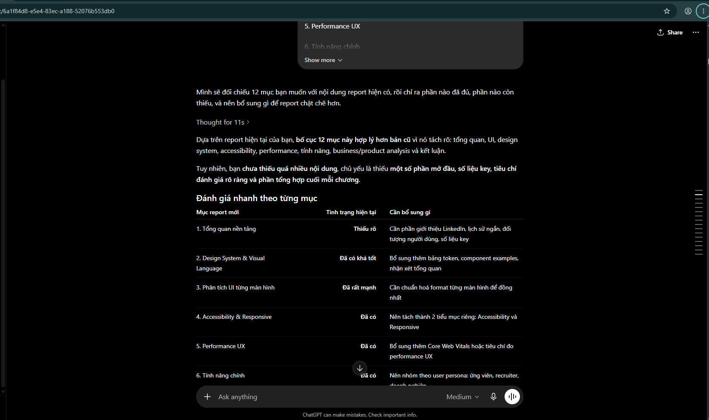

## Task 2 - Vision Doc (Stakeholder & User Description)

### Use Case 1:

- **Tool name, version, and platform:** Gemini Pro 3.5 flash
- **Access time (date and hour):** 10:15 PM, 10/6/2026
- **Prompts used:** "hiểu tất tần tật về stackholder trong dự án"
- **Purpose of use:** I want to understand what a stakeholder is in a project, their roles, and the factors that influence them.
- **Which content was generated by AI:** What is stakeholder?, Classification Stakeholder, Why does it important?
- **Which content was done independently and how the student edited or validated it:** I use Google to check information provided by the AI ​​that seems questionable to me.
- **Screenshots or chat history:**
  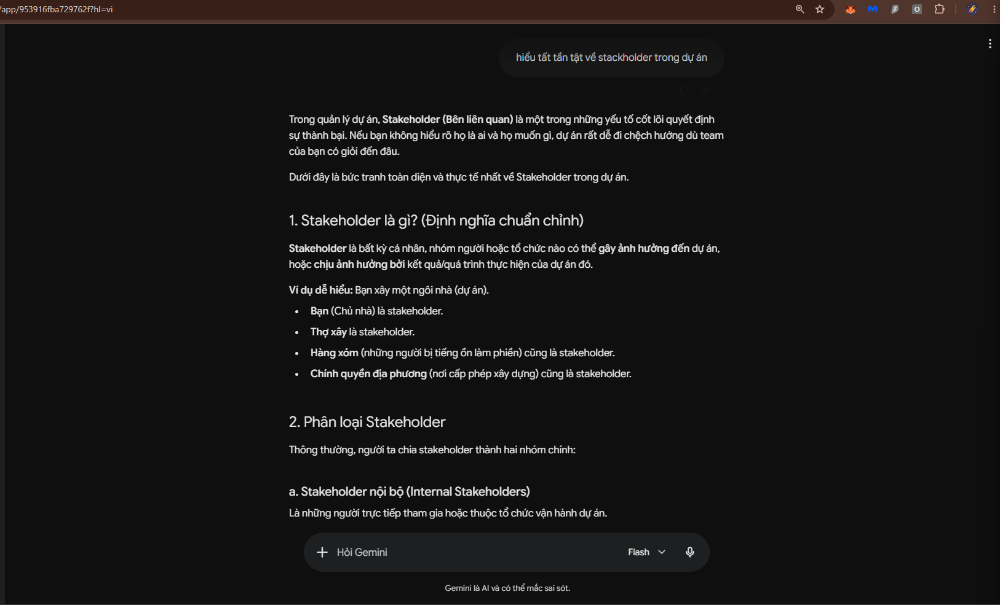

### Use Case 2:

- **Tool name, version, and platform:** ChatGPT Plus, GPT-5.5 (medium)
- **Access time (date and hour):** 10:45 PM, 10/6/2026
- **Prompts used:**

```
Stakeholder and User Description:
Tóm tắt các bên liên quan (Stakeholder summary)
Tóm tắt người dùng (User summary)
Môi trường sử dụng của người dùng (User environment)
Tóm tắt các nhu cầu chính của stakeholder hoặc người dùng Các giải pháp thay thế và đối thủ cạnh tranh
```

- **Purpose of use:** Using AI to assist in drafting Stakeholder and User descriptions in software requirements specifications (SRS), including sections on: stakeholder summary, users, usage environment, key needs, and alternatives.
- **Which content was generated by AI:** The AI ​​generates suggested content for each item in the Stakeholder and User Description section, including a list of stakeholders, user descriptions, usage environments, key needs, and competitors.
- **Which content was done independently and how the student edited or validated it:** After receiving the AI ​​results, I read them, compared them with the project's reality, corrected any inaccurate or inappropriate information, and integrated them into the team's SRS document.
- **Screenshots or chat history:**
  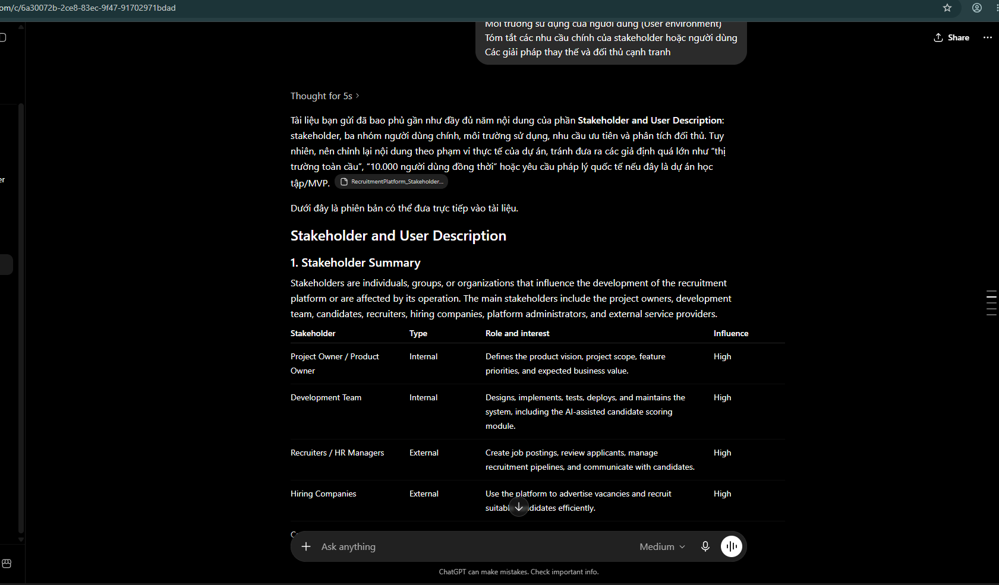

### Use Case 3:

- **Tool name, version, and platform:** ChatGPT Plus, GPT-5.5 (medium)
- **Access time (date and hour):** 00:10 AM, 11/6/2026
- **Prompts used:** `Stakeholder.md` + "Đánh giá code md này đã đạt tiêu chuẩn chưa?"
- **Purpose of use:** AI's overall assessment, strengths and weaknesses can be identified for improvement.
- **Which content was generated by AI:** Overall score, strengths, weaknesses, and suggestions for improvement.
- **Which content was done independently and how the student edited or validated it:** After the AI ​​evaluation, I reviewed each proposal, accepting changes that were appropriate for the project context.
- **Screenshots or chat history:**
  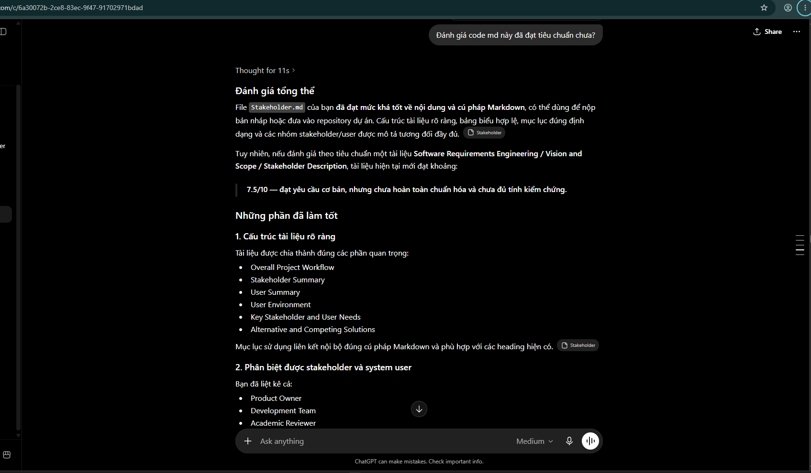

## Task 3 - Learning Spec Kit

### Use Case 1:

- **Tool name, version, and platform:** Claude code, Sonnet 4.6 (Weak)
- **Access time (date and hour):** 10:00 PM, 20/6/2026
- **Prompts used:** "https://github.com/github/spec-kit#-what-is-spec-driven-development
  Giải thích cho tôi tất tần tật về speckit"
- **Purpose of use:** AI gave me an overview of the spec kit before I started learning through YouTube videos.
- **Which content was generated by AI:** Concepts, initialization process, usage steps, and explanation of important commands.
- **Which content was done independently and how the student edited or validated it:** Read and understand how it works, then watch the video to verify that knowledge.
- **Screenshots or chat history:**
  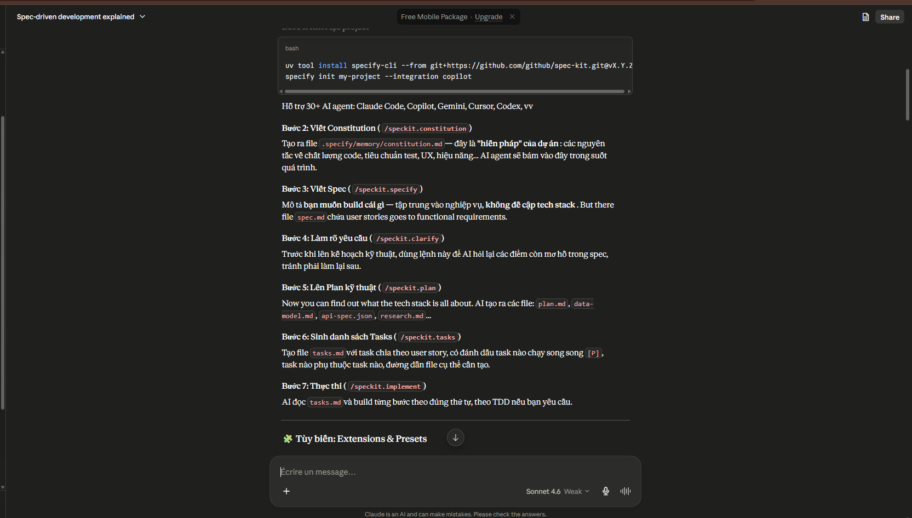

## Task 4 - Draw a work flow important

### Use Case 1:

- **Tool name, version, and platform:** Notion Business model Claude Opus 4.8
- **Access time (date and hour):** 10:05 PM, 26/6/2026
- **Prompts used:** "cái nào bạn dự kiến là quan trọng thứ 2 của dự án này đâu? Quản lý người dùng và xác minh nhà tuyển dụng thì sao, hoặc là luồng đăng nhập auth, tại vì tôi đang tìm luồng quan trọng nhất của dự án chứ không phải đặc biệt hơn so với linkedin"
- **Purpose of use:** I asked the AI ​​to evaluate the flow I consider important, since I had previously shown it the website's 12 basic flows.
- **Which content was generated by AI:** Overall ranking of streams.
- **Which content was done independently and how the student edited or validated it:** Self-evaluate based on your own thinking from various practical perspectives.
- **Screenshots or chat history:**
  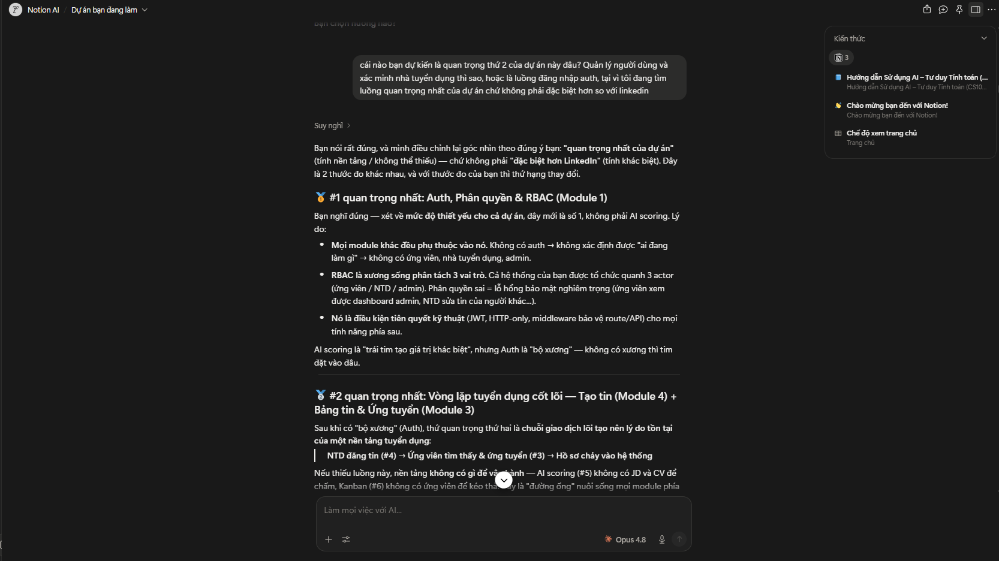

### Use Case 2:

- **Tool name, version, and platform:** Notion Business model Claude Opus 4.8
- **Access time (date and hour):** 00:00 AM, 27/6/2026
- **Prompts used:**

```
- Tôi muốn người dùng sau khi tạo tài khoản muốn lên nhà tuyển dụng thì phải đăng ký sau, chứ không được phép đăng ký nhà tuyển dụng trong giao diện đăng nhập hoặc là giao diện đăng ký tài khoản
- Về phía đăng ký tài khoản admin thì cơ chế như bạn nói là tạo qua seed/script hoặc super-admin tạo. thì tôi đang nhận định là tốt
- Về cơ chế sinh token thì tôi muốn bạn sử dụng Refresh Token Rotate với access token sẽ sống trong 15 phút, và mỗi Refresh token sống trong 3 ngày.
- Cơ chế đổi mật khẩu sẽ đăng xuất toàn bộ tài khoản đã đăng nhập tài khoản với thông tin cũ trước đó như bạn nói  thu hồi tất cả session cũ (bắt đăng nhập lại)
- Thêm phần 2FA code qua google authentication để tăng mức độ bảo mật khi đăng nhập nếu người dùng đã thêm 2FA. (16 ký tự)
- Hiện tại tôi chưa cần cũng cấp gợi ý về cách tổ chức code cũng như là cơ sở dữ liệu
```

- **Purpose of use:** Provide the AI ​​with all necessary information as well as the relevant constraints.
- **Which content was generated by AI:** The AI ​​has been modified to align with the new workflow based on my additional requirements.
- **Which content was done independently and how the student edited or validated it:** Read the information provided by the AI ​​and determine the accuracy of the content.
- **Screenshots or chat history:**
  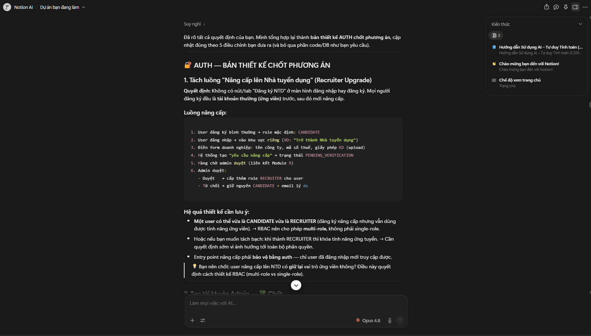

### Use Case 3:

- **Tool name, version, and platform:** Claude Sonnet 4.6 (Weak)
- **Access time (date and hour):** 1:00 AM, 27/6/2026
- **Prompts used:** `workflow.md` + "Luồng này đã đủ chi tiết cho dự án của tôi chưa?"
- **Purpose of use:** Assess whether my current workflow is adequate for a real-world project.
- **Which content was generated by AI:** AI highlights strengths and areas for improvement.
- **Which content was done independently and how the student edited or validated it:** I review the AI's suggestions and select the ones I find relevant to the project.
- **Screenshots or chat history:**
  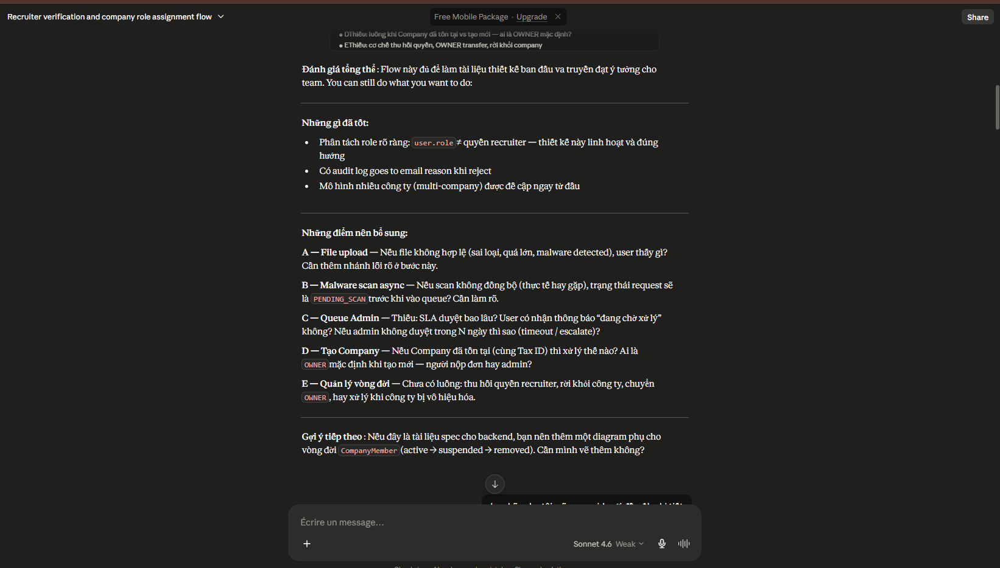

### Use Case 4:

- **Tool name, version, and platform:** Claude Sonnet 4.6 (Weak)
- **Access time (date and hour):** 2:30 AM, 27/6/2026
- **Prompts used:** "các trường hợp nó sẽ xử lý, ví dụ"
- **Purpose of use:** Provide real-world examples of scenarios involving processing flows.
- **Which content was generated by AI:** 6 real-world cases, the primary operating mechanism, and key design elements.
- **Which content was done independently and how the student edited or validated it:** I review the AI's suggestions and run a test for each case to verify if the processing flow is correct.
- **Screenshots or chat history:**
  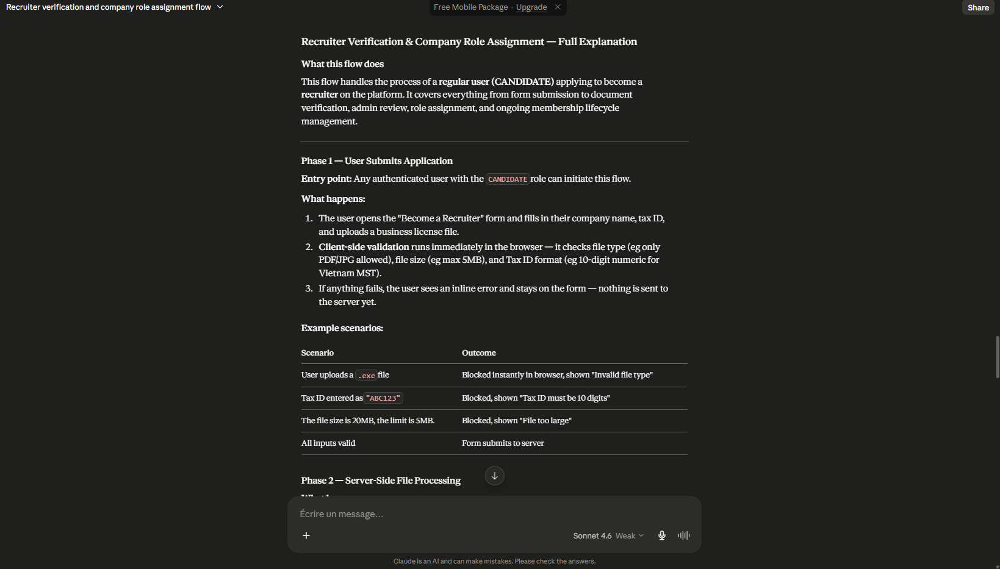

## Task 5 - Write the AI usage report

- No AI tools were used to generate the content of this report. Google Translate was used solely as a translation aid to support writing in a non-native language.

## Task 6 - Convert Spec Kit training MD to PDF

- A VS Code extension (Markdown PDF) was used to convert the Spec Kit training document from Markdown (.md) format to PDF. No AI tools were involved in this process.
- **Screenshots**
  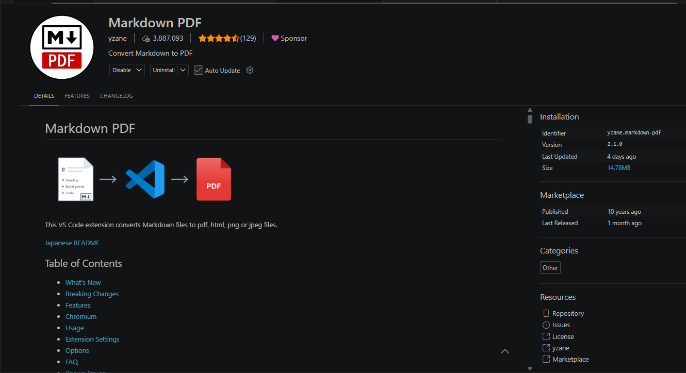
