# AI Usage Report For PA2

**Student Name:** Nguyễn Quốc Thành <br>
**Student ID:** 24127542  
**Group:** 09  
**Class:** 24C11  
**Course/Project:** Software Engineering

## AI Usage Notes

I used Vietnamese to prompt in many Use Case so that I may write in Vietnamese in the following Use Case Prompt and Output.

## Table of contents

1. [Task 1 - Existing App Survey (Linkedin)](#task-1---existing-app-survey-linkedin)
   - [Use Case 1: Identify LinkedIn API endpoints](#use-case-1)
   - [Use Case 2: Identify LinkedIn inefficiencies](#use-case-2)
   - [Use Case 3: Structure UI/UX analysis report](#use-case-3)
2. [Task 2 - Vision Doc (Stakeholder & User Description)](#task-2---vision-doc-stakeholder--user-description)
   - [Use Case 1: Understand stakeholders](#use-case-1-1)
   - [Use Case 2: Draft Stakeholder & User descriptions](#use-case-2-1)
   - [Use Case 3: Evaluate Stakeholder.md quality](#use-case-3-1)
3. [Task 3 - Learning Spec Kit](#task-3---learning-spec-kit)
   - [Use Case 1: Overview of Spec Kit](#use-case-1-2)
4. [Task 4 - Draw a workflow important](#task-4---draw-a-work-flow-important)
   - [Use Case 1: Evaluate important flows](#use-case-1-3)
   - [Use Case 2: Define auth flow constraints](#use-case-2-2)
   - [Use Case 3: Assess workflow completeness](#use-case-3-2)
   - [Use Case 4: Real-world processing examples](#use-case-4)
5. [Task 6 - Convert Spec Kit training MD to PDF](#task-6---convert-spec-kit-training-md-to-pdf)
6. [Task 7 - Functional "Identity - Authentication - Account Recovery"](#task-7---functional-identity---authentication---account-recovery)

## Task 1 - Existing App Survey (Linkedin)

### Use Case 1:

- **Tool name, version, and platform:** context.dev
- **Access time (date and hour):** 8:12 PM, 1/6/2026
- **Prompts used:** No prompt was used
- **Purpose of use:** To identify relevant LinkedIn API endpoints to be used for the PA2 implementation.
- **Which content was generated by AI:** A markdown file included structure of linkedin website (APIs)
- **Which content was done independently and how the student edited or validated it:** Manually accessed the link provided by the AI to verify the extracted API structure.
- **Screenshots or chat history:**
  

### Use Case 2:

- **Tool name, version, and platform:** Claude code, Sonnet 4.6 (Weak)
- **Access time (date and hour):** 8:20 PM, 1/6/2026
- **Prompts used:** `file APIs from context.dev` + "Tôi đang có đồ án nhóm là chọn ứng dụng linked in tìm ra sự bất cập của source hiện tại về tính năng, giao diện,... chưa cho trải nghiệm tốt với users, bạn hãy gợi ý cho tôi tìm ra các điểm tôi có thể build thêm vào dự án để đạt điểm tối đa với giảng viên"
- **Purpose of use:** Identify the current inefficiencies of the LinkedIn website to serve as a basis for developing a smart hire project.
- **Which content was generated by AI:** Problem about UI, Features, UX/Accessibility of website linkedin.
- **Which content was done independently and how the student edited or validated it:** Access the website and start using it to test whether the AI's statements are realistic.
- **Screenshots or chat history:**
  

### Use Case 3:

- **Tool name, version, and platform:** ChatGPT Plus, GPT-5.5 (medium)
- **Access time (date and hour):** 11:05 PM, 2/6/2026
- **Prompts used:**
  "1. Tổng quan nền tảng (giới thiệu ngắn, số liệu key) 2. Design System & Visual Language 3. Phân tích UI từng màn hình 4. Accessibility & Responsive 5. Performance UX 6. Tính năng chính 7. AI & Premium 8. SEO & Discoverability 9. Điểm mạnh & Điểm yếu 10. Phân tích cạnh tranh 11. Cơ hội cải thiện 12. Kết luận
  Tôi muốn tạo một report theo format này, những gì tôi còn thiếu là gì?"
- **Purpose of use:** To receive AI-assisted guidance on structuring a comprehensive UI/UX analysis report. The student used Claude to identify gaps in their proposed 12-section report outline before proceeding to write the full document.
- **Which content was generated by AI:** ChatGPT generated a checklist of missing elements and suggested additions to each section — including recommendations on what data points, frameworks (e.g., WCAG criteria, heuristic evaluation), and visual evidence to include per section. The AI also proposed supplementary sub-sections the student had not originally planned for.
- **Which content was done independently and how the student edited or validated it:** The student independently defined the 12-section structure and selected the platform to analyze. After receiving GPT's suggestions, the student manually reviewed each recommended addition against their own observations of the platform's UI, accepted only those that were verifiable through direct inspection, and discarded suggestions that were too generic or not applicable to the specific platform under analysis.
- **Screenshots or chat history:**
  

## Task 2 - Vision Doc (Stakeholder & User Description)

### Use Case 1:

- **Tool name, version, and platform:** Gemini Pro 3.5 flash
- **Access time (date and hour):** 10:15 PM, 10/6/2026
- **Prompts used:** "hiểu tất tần tật về stackholder trong dự án"
- **Purpose of use:** I want to understand what a stakeholder is in a project, their roles, and the factors that influence them.
- **Which content was generated by AI:** What is stakeholder?, Classification Stakeholder, Why does it important?
- **Which content was done independently and how the student edited or validated it:** I use Google to check information provided by the AI ​​that seems questionable to me.
- **Screenshots or chat history:**
  

### Use Case 2:

- **Tool name, version, and platform:** ChatGPT Plus, GPT-5.5 (medium)
- **Access time (date and hour):** 10:45 PM, 10/6/2026
- **Prompts used:**

```
Stakeholder and User Description:
Tóm tắt các bên liên quan (Stakeholder summary)
Tóm tắt người dùng (User summary)
Môi trường sử dụng của người dùng (User environment)
Tóm tắt các nhu cầu chính của stakeholder hoặc người dùng Các giải pháp thay thế và đối thủ cạnh tranh
```

- **Purpose of use:** Using AI to assist in drafting Stakeholder and User descriptions in software requirements specifications (SRS), including sections on: stakeholder summary, users, usage environment, key needs, and alternatives.
- **Which content was generated by AI:** The AI ​​generates suggested content for each item in the Stakeholder and User Description section, including a list of stakeholders, user descriptions, usage environments, key needs, and competitors.
- **Which content was done independently and how the student edited or validated it:** After receiving the AI ​​results, I read them, compared them with the project's reality, corrected any inaccurate or inappropriate information, and integrated them into the team's SRS document.
- **Screenshots or chat history:**
  

### Use Case 3:

- **Tool name, version, and platform:** ChatGPT Plus, GPT-5.5 (medium)
- **Access time (date and hour):** 00:10 AM, 11/6/2026
- **Prompts used:** `Stakeholder.md` + "Đánh giá code md này đã đạt tiêu chuẩn chưa?"
- **Purpose of use:** AI's overall assessment, strengths and weaknesses can be identified for improvement.
- **Which content was generated by AI:** Overall score, strengths, weaknesses, and suggestions for improvement.
- **Which content was done independently and how the student edited or validated it:** After the AI ​​evaluation, I reviewed each proposal, accepting changes that were appropriate for the project context.
- **Screenshots or chat history:**
  

## Task 3 - Learning Spec Kit

### Use Case 1:

- **Tool name, version, and platform:** Claude code, Sonnet 4.6 (Weak)
- **Access time (date and hour):** 10:00 PM, 20/6/2026
- **Prompts used:** "https://github.com/github/spec-kit#-what-is-spec-driven-development
  Giải thích cho tôi tất tần tật về speckit"
- **Purpose of use:** AI gave me an overview of the spec kit before I started learning through YouTube videos.
- **Which content was generated by AI:** Concepts, initialization process, usage steps, and explanation of important commands.
- **Which content was done independently and how the student edited or validated it:** Read and understand how it works, then watch the video to verify that knowledge.
- **Screenshots or chat history:**
  

## Task 4 - Draw a work flow important

### Use Case 1:

- **Tool name, version, and platform:** Notion Business model Claude Opus 4.8
- **Access time (date and hour):** 10:05 PM, 26/6/2026
- **Prompts used:** "cái nào bạn dự kiến là quan trọng thứ 2 của dự án này đâu? Quản lý người dùng và xác minh nhà tuyển dụng thì sao, hoặc là luồng đăng nhập auth, tại vì tôi đang tìm luồng quan trọng nhất của dự án chứ không phải đặc biệt hơn so với linkedin"
- **Purpose of use:** I asked the AI ​​to evaluate the flow I consider important, since I had previously shown it the website's 12 basic flows.
- **Which content was generated by AI:** Overall ranking of streams.
- **Which content was done independently and how the student edited or validated it:** Self-evaluate based on your own thinking from various practical perspectives.
- **Screenshots or chat history:**
  

### Use Case 2:

- **Tool name, version, and platform:** Notion Business model Claude Opus 4.8
- **Access time (date and hour):** 00:00 AM, 27/6/2026
- **Prompts used:**

```
- Tôi muốn người dùng sau khi tạo tài khoản muốn lên nhà tuyển dụng thì phải đăng ký sau, chứ không được phép đăng ký nhà tuyển dụng trong giao diện đăng nhập hoặc là giao diện đăng ký tài khoản
- Về phía đăng ký tài khoản admin thì cơ chế như bạn nói là tạo qua seed/script hoặc super-admin tạo. thì tôi đang nhận định là tốt
- Về cơ chế sinh token thì tôi muốn bạn sử dụng Refresh Token Rotate với access token sẽ sống trong 15 phút, và mỗi Refresh token sống trong 3 ngày.
- Cơ chế đổi mật khẩu sẽ đăng xuất toàn bộ tài khoản đã đăng nhập tài khoản với thông tin cũ trước đó như bạn nói  thu hồi tất cả session cũ (bắt đăng nhập lại)
- Thêm phần 2FA code qua google authentication để tăng mức độ bảo mật khi đăng nhập nếu người dùng đã thêm 2FA. (16 ký tự)
- Hiện tại tôi chưa cần cũng cấp gợi ý về cách tổ chức code cũng như là cơ sở dữ liệu
```

- **Purpose of use:** Provide the AI ​​with all necessary information as well as the relevant constraints.
- **Which content was generated by AI:** The AI ​​has been modified to align with the new workflow based on my additional requirements.
- **Which content was done independently and how the student edited or validated it:** Read the information provided by the AI ​​and determine the accuracy of the content.
- **Screenshots or chat history:**
  

### Use Case 3:

- **Tool name, version, and platform:** Claude Sonnet 4.6 (Weak)
- **Access time (date and hour):** 1:00 AM, 27/6/2026
- **Prompts used:** `workflow.md` + "Luồng này đã đủ chi tiết cho dự án của tôi chưa?"
- **Purpose of use:** Assess whether my current workflow is adequate for a real-world project.
- **Which content was generated by AI:** AI highlights strengths and areas for improvement.
- **Which content was done independently and how the student edited or validated it:** I review the AI's suggestions and select the ones I find relevant to the project.
- **Screenshots or chat history:**
  

### Use Case 4:

- **Tool name, version, and platform:** Claude Sonnet 4.6 (Weak)
- **Access time (date and hour):** 2:30 AM, 27/6/2026
- **Prompts used:** "các trường hợp nó sẽ xử lý, ví dụ"
- **Purpose of use:** Provide real-world examples of scenarios involving processing flows.
- **Which content was generated by AI:** 6 real-world cases, the primary operating mechanism, and key design elements.
- **Which content was done independently and how the student edited or validated it:** I review the AI's suggestions and run a test for each case to verify if the processing flow is correct.
- **Screenshots or chat history:**
  

## Task 6 - Convert Spec Kit training MD to PDF

- A VS Code extension (Markdown PDF) was used to convert the Spec Kit training document from Markdown (.md) format to PDF. No AI tools were involved in this process.
- **Screenshots**
  

## Task 7 - Functional "Identity - Authentication - Account Recovery"

### Use Case 1:

- **Tool name, version, and platform:** ChatGPT 5.5 Sol high.
- **Access time (date and hour):** 11:24AM, 20/07/2026
- **Prompts used:** "I want to build the first functional it include, register (create an account), login, auth via 2fa code in google authentication, the feature send code to user via email, reset password link, verify email link I use postgreSQL, python, next.js, CSS by tailwind, use some what is the exactly prompt, can you give me I also want to create the website so smooth with some modules such as: Sonner, shadcn/ui, Motion, Lenis, Lucide React, TanStack Query Can you give me the evaluation and give me the best technology for this project about function register (create an account), login, auth via 2fa code in google authentication, the feature send code to user via email, reset password link, verify email link"
- **Purpose of use:**
  - To identify a suitable technology stack for the Identity, Authentication, and Account Recovery functional group.
  - The AI was used to evaluate tools and libraries for registration, login, email verification, 2FA, and password recovery.
  - It also helped suggest a secure and practical development approach for the SmartHire project.
  - The recommendations were used as references before creating the project specifications and implementation plan.
- **Which content was generated by AI:**
  - The AI recommended using Next.js, Python, PostgreSQL, and Tailwind CSS for the system.
  - It proposed workflows for user registration, login, email verification, and password reset.
  - It suggested implementing two-factor authentication using Google Authenticator and TOTP codes.
  - It provided recommendations for password hashing, token expiration, session management, and API security.
  - It also evaluated supporting libraries such as shadcn/ui, Sonner, Motion, Lucide React, and TanStack Query.
  - The AI-generated content was used as technical guidance for planning and developing the functional group.
- **Which content was done independently and how the student edited or validated it:**
  - The student reviewed the AI recommendations and selected technologies suitable for the project requirements.
  - The authentication workflows and system architecture were adjusted to match the SmartHire project structure.
  - The student independently implemented the database, APIs, user interfaces, and authentication logic.
  - The final features were validated through documentation review and functional testing.
- **Screenshots or chat history:**
  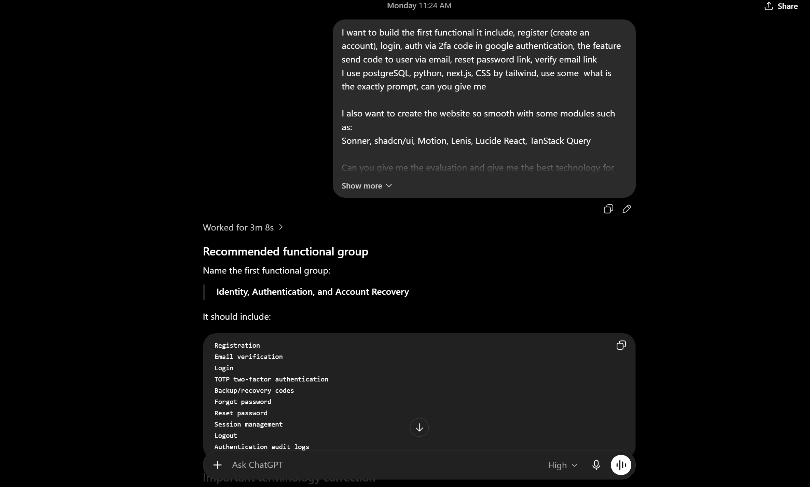
  This table was analyzed and evaluated by AI:
  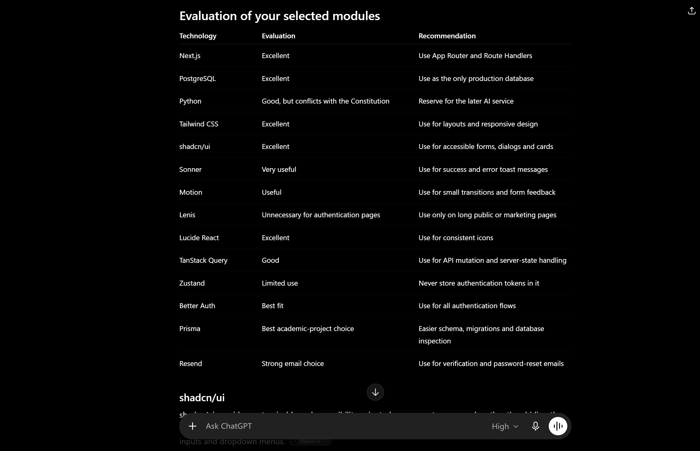
  The prompt `/speckit-specify` was generated by AI:
  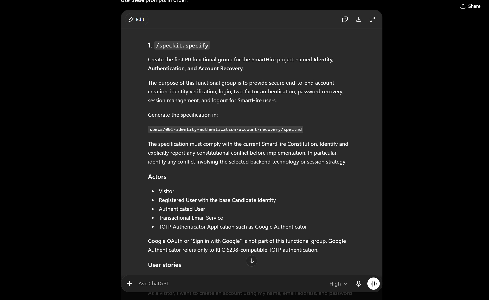

### Use Case 2:

- **Tool name, version, and platform:** Codex 5.6 Sol Low
- **Access time (date and hour):** 11:47 AM, 20/7/2026
- **Prompts used:** Prompt in <u><image>T7_U1.2.png</image></u> + `/speckit-specify`
- **Purpose of use:**
  - To generate a detailed specification for the Identity, Authentication, and Account Recovery functional group.
  - Codex was used with the /speckit-specify command to convert the feature requirements into a structured specification.
  - The generated specification provided a foundation for the later planning, task breakdown, and implementation stages.
- **Which content was generated by AI:**
  - Codex generated the initial spec.md file following the Spec Kit workflow.
  - It defined the functional scope for registration, login, email verification, 2FA, and password recovery.
  - It created user stories, functional requirements, acceptance criteria, and success conditions.
  - It also identified important authentication scenarios, validation rules, and possible edge cases.
  - The generated specification was used as the main reference for the next Spec Kit stages.
- **Which content was done independently and how the student edited or validated it:**
  - The student reviewed the generated specification and checked it against the SmartHire project requirements.
  - Missing or unclear requirements were edited to match the selected technology stack and intended user flows.
  - The student validated the specification by checking its feasibility, consistency, and completeness before continuing to the planning stage.
  - Use AI to perform comparative analysis based on the constitution and provide a choice for the next prompt `/speckit-clarify`.
- **Screenshots or chat history:**
  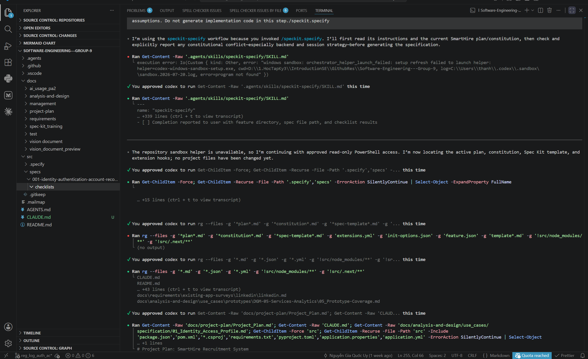
  The prompt `/speckit-clarify` was generated by AI:
  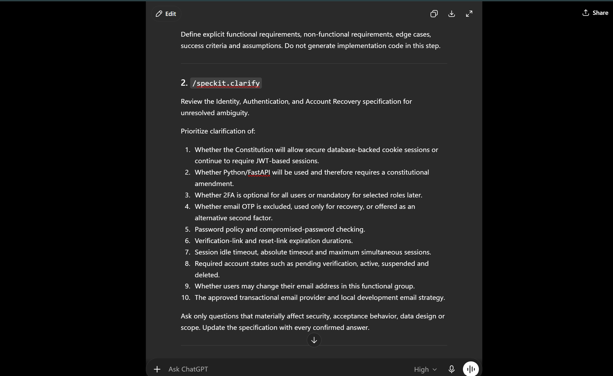
  AI proccessing with command `/speckit-clarify`:
  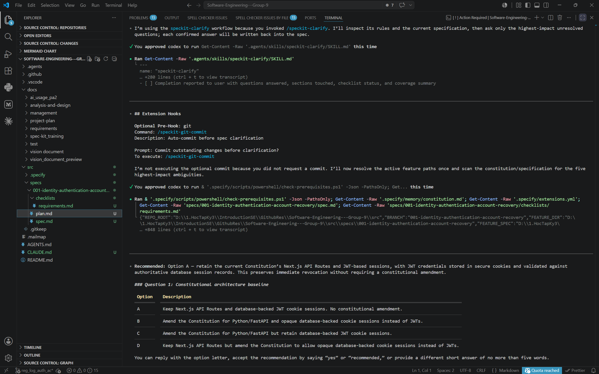

### Use Case 3:

- **Tool name, version, and platform:** GPT 5.5 Sol High & Codex 5.5 Sol Low
- **Access time (date and hour):** 12:30AM, 20/07/2026
- **Prompts used:** "Bảng thống kê được AI đưa ra sau khi chạy lệnh `/speckit-clarify` để nhờ AI đánh giá tiến độ hiện tại có khớp trên constitution không, và có thể chạy được lệnh `/speckit-plan` hay chưa"
- **Purpose of use:**
  - To evaluate the completeness and consistency of the current feature specification.
  - The AI was used to check whether the clarified requirements complied with the project constitution.
  - It also helped determine whether any issues remained before proceeding to the planning stage.
- **Which content was generated by AI:**
  - The AI generated a summary table showing the current clarification status.
  - It evaluated the specification against the principles defined in the project constitution.
  - It identified completed requirements, unclear points, possible conflicts, and missing information.
  - It also assessed the readiness of the specification for the planning stage.
  - Finally, it recommended whether the /speckit-plan command could be executed.
- **Which content was done independently and how the student edited or validated it:**
  - The student reviewed the AI-generated evaluation and compared it with the specification and constitution files.
  - Any unclear or inconsistent requirements were corrected before continuing.
  - The student manually verified that the required clarification questions had been resolved.
  - After validation, the student decided whether the project was ready to proceed with /speckit-plan.
- **Screenshots or chat history:**
  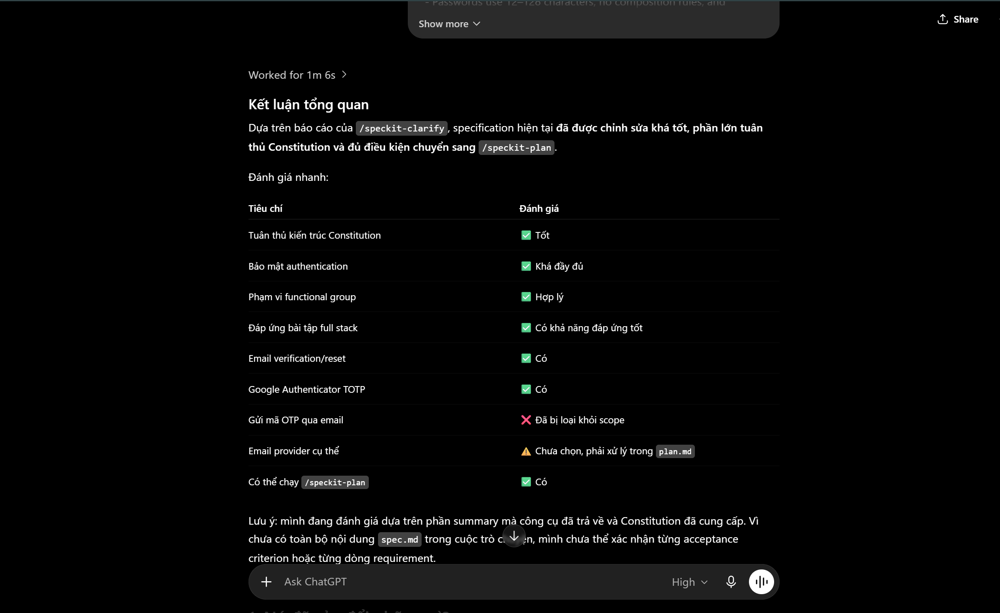
  AI proccessing with command `/speckit-plan`
  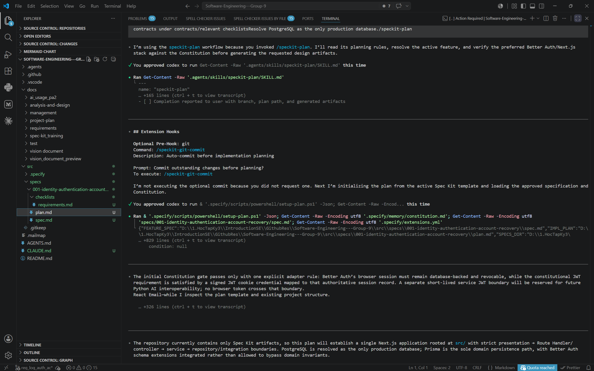

### Use Case 4:

- **Tool name, version, and platform:** GPT 5.5 Sol High
- **Access time (date and hour):** 1:00PM, 20/07/2026
- **Prompts used:** "The report from codex after run `/speckit-tasks`" + "Đã đủ đáp ứng để implement chưa"
- **Purpose of use:**
  - To evaluate the task list generated by the /speckit-tasks command.
  - The AI was used to check whether the tasks covered the frontend, backend, database, security, and testing requirements.
  - It also helped determine whether the project was ready to proceed with the implementation stage.
- **Which content was generated by AI:**
  - The AI generated an evaluation of the task breakdown created by Codex.
  - It checked the task order, dependencies, completeness, and alignment with the specification and implementation plan.
  - It identified whether the authentication features were sufficiently divided into implementable tasks.
  - It also highlighted missing, unclear, or potentially conflicting tasks.
  - Finally, the AI suggested run `/speckit-analyze` before run `/speckit-implement`
- **Which content was done independently and how the student edited or validated it:**
  - The student compared the generated tasks with the spec.md, plan.md, and project constitution.
  - Missing or unclear tasks were reviewed and adjusted to match the required authentication workflows.
  - The student manually checked task dependencies and confirmed that frontend, backend, and database work were covered.
- **Screenshots or chat history:**<br>
  AI evaluated:
  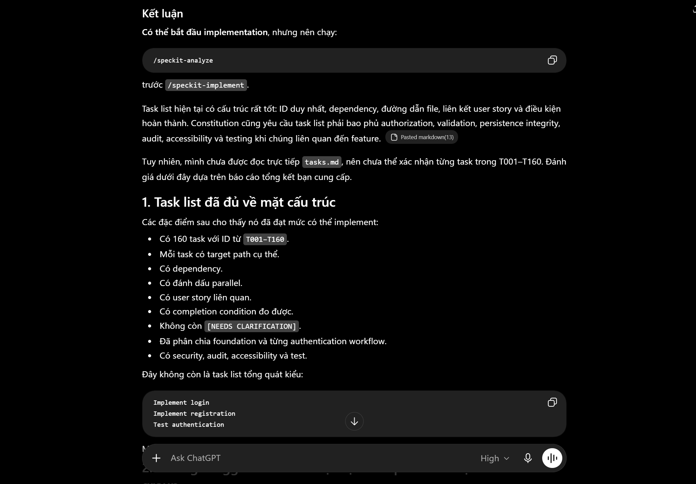
  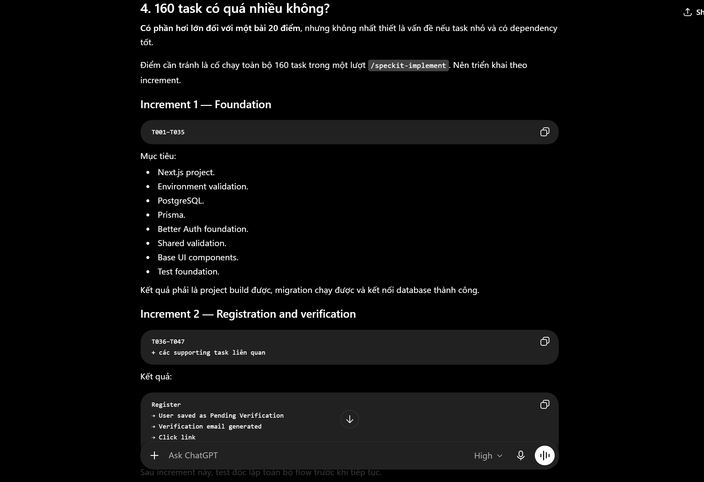
  The prompt was generated by GPT:
  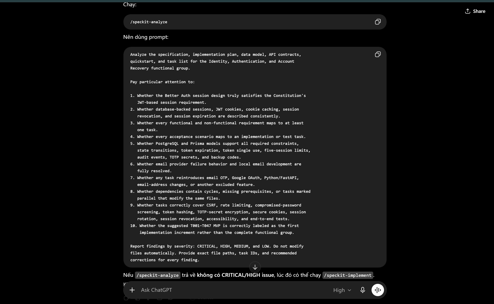
  AI processing with command `/speckit-analyze`:
  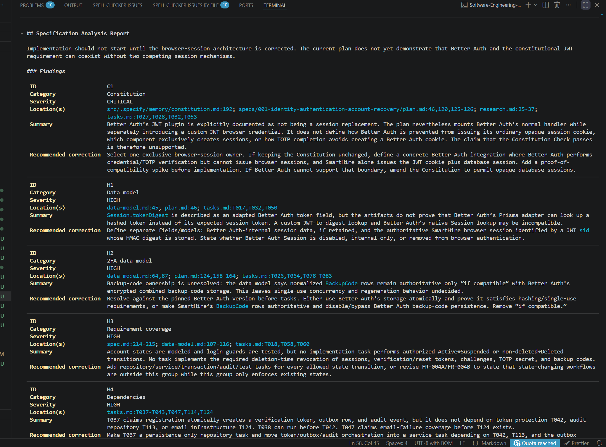

### Use Case 5:

- **Tool name, version, and platform:** GPT 5.5 Sol High
- **Access time (date and hour):** 1:30PM, 20/07/2026
- **Prompts used:** `Problem in Codex chat`
- **Purpose of use:**
  - To identify the technical issues that caused Codex to stop unexpectedly during implementation.
  - The AI was used to analyze the error messages, project structure, and authentication configuration.
  - It also helped suggest appropriate fixes so the implementation process could continue.
- **Which content was generated by AI:**
  - The AI identified a conflict between Better Auth and JWT because both were managing authentication sessions.
  - It explained that only one session-management approach should be used consistently.
  - It detected that the project was mixing Next.js API Routes with Route Handlers.
  - It recommended using the correct routing structure based on the selected Next.js architecture.
  - The AI also found that the repository did not contain a .gitignore file.
  - It suggested adding appropriate rules to exclude dependencies, environment files, build files, and generated artifacts.
- **Which content was done independently and how the student edited or validated it:**
  - The student reviewed each identified issue directly in the source code and project folders.
  - The authentication configuration and API structure were adjusted based on the project architecture.
  - A .gitignore file was created and checked to ensure unnecessary and sensitive files were excluded.
  - The student reran the project and Codex workflow to confirm that the errors were resolved.
- **Screenshots or chat history:**
  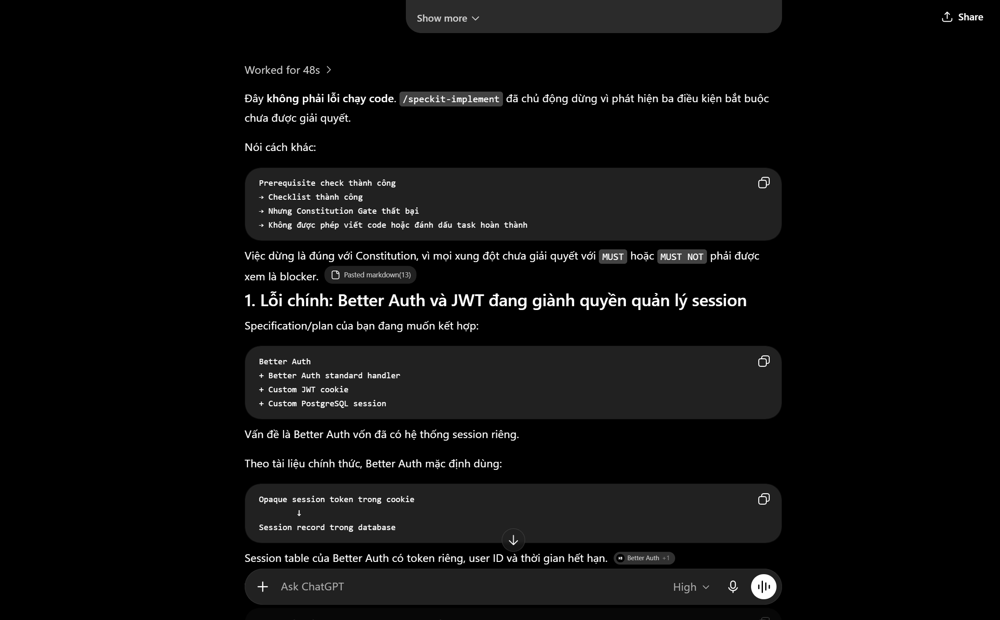
  AI recommend modify the constitution or hold on constitution and then build new tool support (JWT, refresht rotation, session table, ..)
  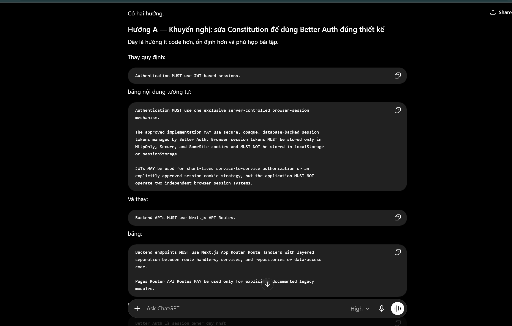
  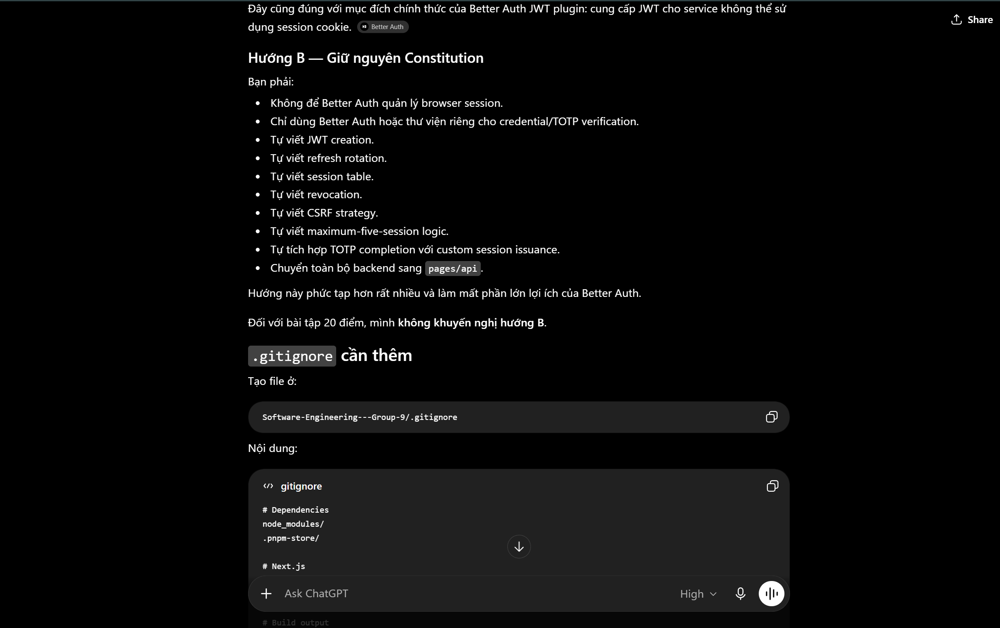

### Use Case 6:

- **Tool name, version, and platform:** GPT 5.5 Sol Hight
- **Access time (date and hour):** 2:00PM, 20/07/2026
- **Prompts used:** "constitution hiện tại nó đủ tốt hay không, tại vì tôi không muốn sửa constitution cứ mỗi khi làm một task"
- **Purpose of use:**
  - To evaluate whether the current project constitution was complete, consistent, and reusable across different functional groups.
  - The AI was used to identify overly specific rules, missing principles, and possible conflicts.
  - It also helped determine whether the constitution could guide future development without frequent modification.
- **Which content was generated by AI:**
  - The AI evaluated the structure, principles, technical standards, and development rules defined in the constitution.
  - It identified which rules were suitable for the whole project and which were too specific to one feature.
  - It suggested improvements for security, code quality, testing, database management, and Spec Kit compliance.
  - It also explained which requirements should remain in the constitution and which should be moved to feature specifications.
  - Finally, it assessed whether the constitution was stable enough for future tasks.
- **Which content was done independently and how the student edited or validated it:**
  - The student compared the AI evaluation with the existing constitution and project requirements.
  - Only general and reusable development principles were retained in the constitution.
  - Feature-specific requirements were placed in the relevant specification and planning files.
  - The student reviewed the final constitution before using it for later Spec Kit workflows.

- **Screenshots or chat history:**
  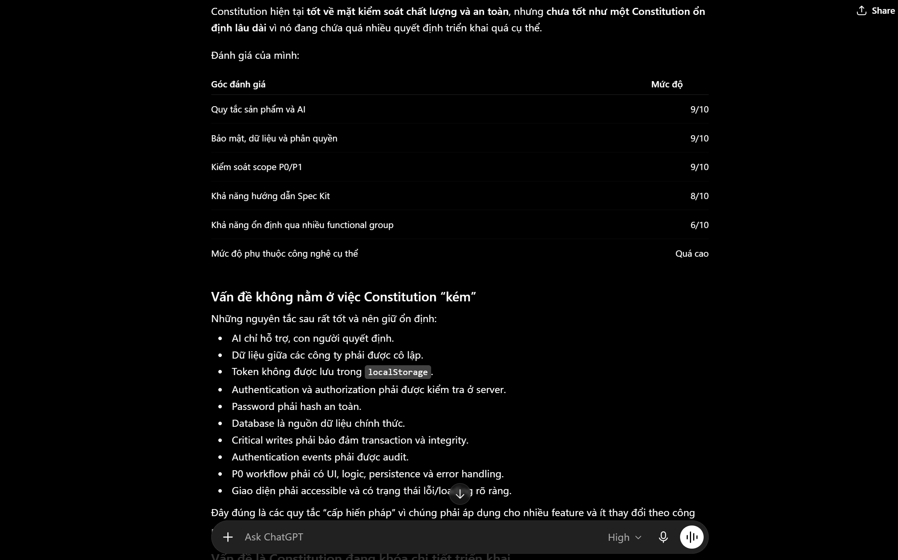
  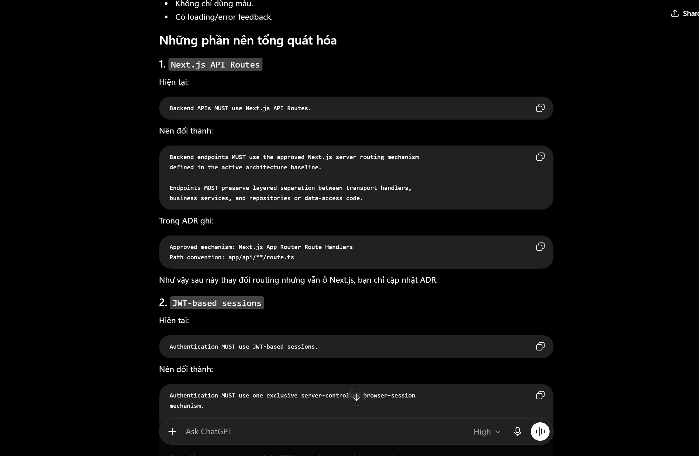
  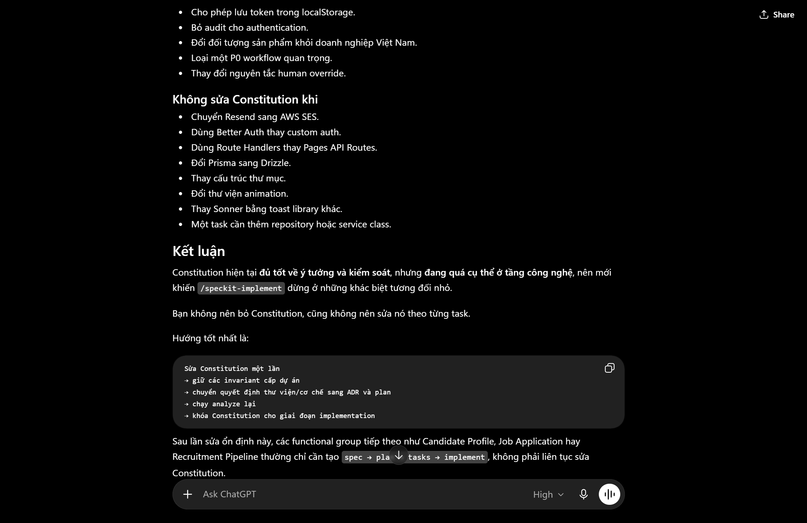

### Use Case 7:

- **Tool name, version, and platform:** GPT 5.5 Sol High
- **Access time (date and hour):** 7:15PM, 20/07/2026
- **Prompts used:** `Report was generated by AI` + "nó đã làm được những gì, ổn chứ, và tôi sẽ phải làm gì tiếp theo để done tổng 160 tasks?"
- **Purpose of use:**
  - To evaluate the implementation progress based on the report generated by Codex.
  - The AI was used to identify which tasks had been completed and whether the current results were acceptable.
  - It also helped determine the next steps required to complete all 160 tasks.
- **Which content was generated by AI:**
  - The AI summarized the features, files, and tasks that had already been completed.
  - It evaluated the current implementation against the specification, plan, and task list.
  - It identified incomplete tasks, technical issues, missing tests, and remaining dependencies.
  - It grouped the remaining work into appropriate implementation phases.
  - It also suggested a recommended order for completing the frontend, backend, database, security, and testing tasks.
  - Finally, it provided an assessment of the project’s overall progress and readiness.
- **Which content was done independently and how the student edited or validated it:**
  - The student compared the AI report with the source code and the 160 tasks listed in tasks.md.
  - Completed tasks were manually checked and marked based on actual implementation results.
  - The student reviewed the remaining tasks, corrected inaccurate assessments, and prioritized the next development steps.
  - The project was then built and tested to verify that the completed features worked correctly.
- **Screenshots or chat history:**
  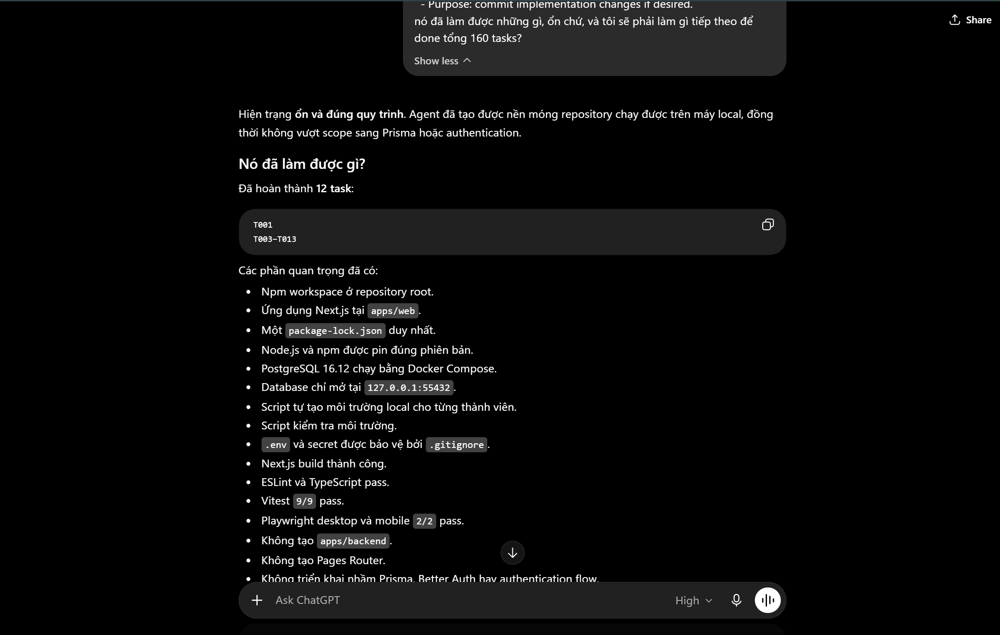
  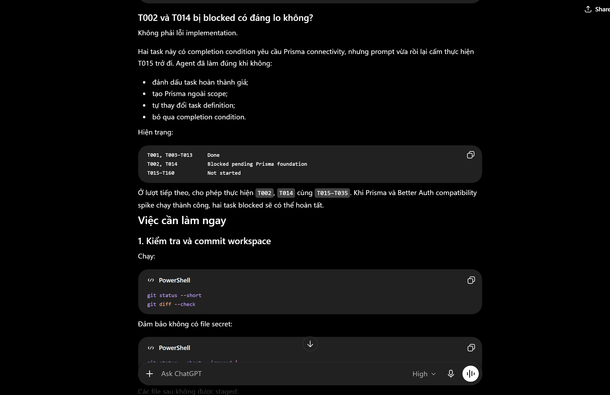
  The next prompt for command `/speckit-implement` was generated by AI
  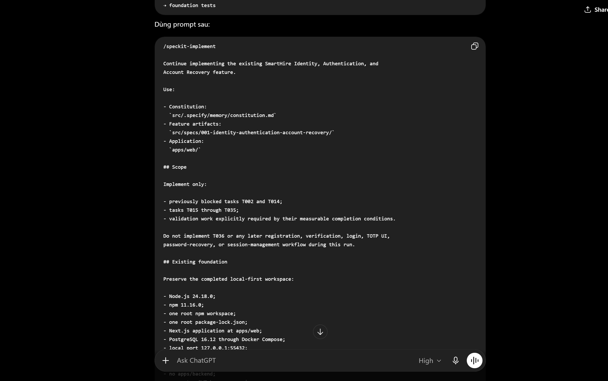

### Use Case 8:

- **Tool name, version, and platform:** GPT 5.5 Sol High & Claude 4.8 Opus
- **Access time (date and hour):** 10:00AM, 21/07/2026
- **Prompts used:** `Report was generated by AI`
- **Purpose of use:**
  - To review the implementation report and evaluate the current completion status of the functional group.
  - GPT and Claude were used to cross-check the completed features, remaining tasks, and possible technical issues.
  - The comparison helped improve the accuracy of the evaluation before final testing and submission.
- **Which content was generated by AI:**
  - The AI tools summarized the features and tasks completed during the implementation process.
  - They evaluated the source code against the specification, implementation plan, and tasks.md file.
  - They identified incomplete functions, missing validations, security concerns, and potential code-quality issues.
  - The tools also suggested improvements for the frontend, backend, database, authentication, and testing workflows.
  - Differences between the two AI evaluations were compared to create a more reliable project assessment.
- **Which content was done independently and how the student edited or validated it:**
  - The student compared both AI reports with the actual source code and project documents.
  - Each reported issue was manually checked, and inaccurate or unnecessary suggestions were removed.
  - The student implemented the appropriate corrections and tested the main authentication and account-recovery flows.
  - The final completion status was determined based on actual test results rather than only the AI reports.
- **Screenshots or chat history:**
  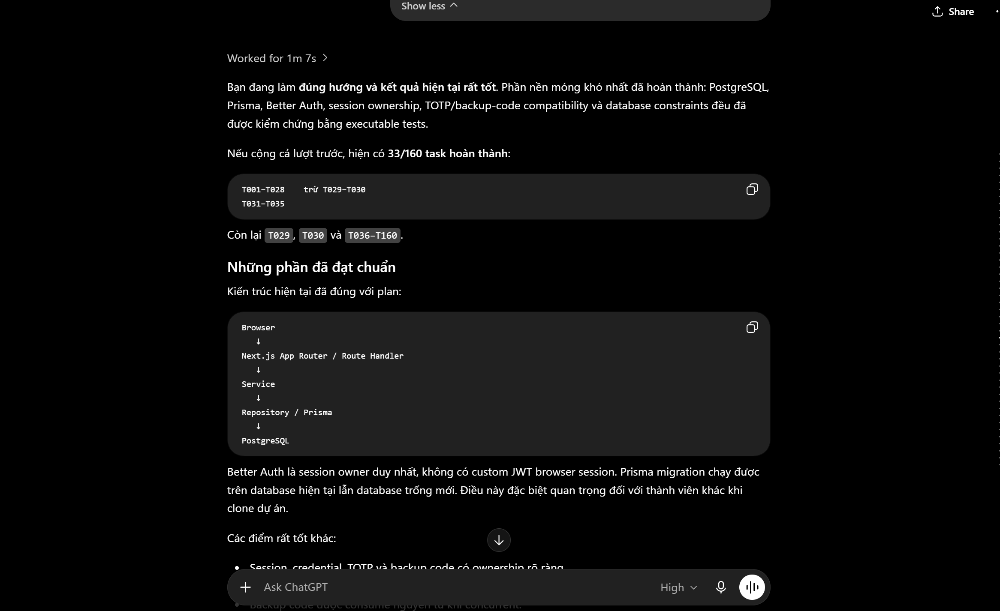
  Claude code built TOTP feature:
  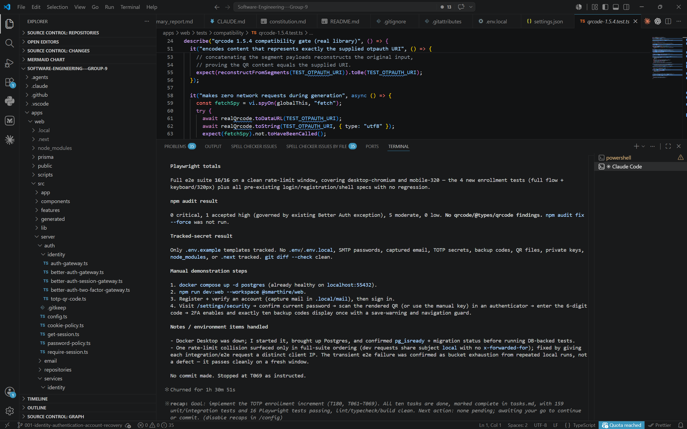
  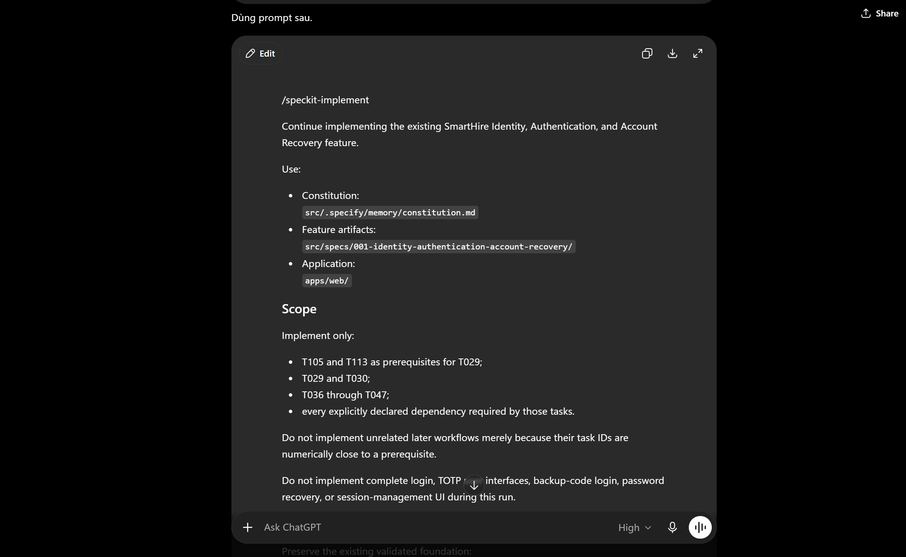

### Use Case 9:

- **Tool name, version, and platform:** GPT 5.5 Sol High
- **Access time (date and hour):** 12:00AM, 21/07/2026
- **Prompts used:**
  "ý tui là gửi thông qua SMTP đó bro SMTP_HOST=smtp.gmail.com SMTP_PORT=123 SMTP_USERNAME=tha SMTP_PASSWORD= SMTP_FROM="TDS Store <th**\***m>" SMTP_USE_TLS=true"
- **Purpose of use:**
  - To implement the email-verification feature using a personal Gmail account through SMTP.
  - The AI was used to configure the SMTP environment variables and explain the email-sending workflow.
  - It also helped identify the correct security settings for sending verification links to customers.
- **Which content was generated by AI:**
  - The AI suggested the SMTP configuration and environment-variable structure.
  - It explained how to connect the backend to Gmail SMTP and send verification emails.
  - It provided guidance for generating verification links and email content.
  - It also recommended using a Gmail App Password instead of the normal account password.
  - The AI identified suitable SMTP ports and TLS settings and suggested error-handling practices.
- **Which content was done independently and how the student edited or validated it:**
  - The student created the Gmail App Password and added the SMTP credentials to the local .env file.
  - The generated configuration was adjusted to match the project’s backend structure and verification workflow.
  - Test accounts were registered to confirm that verification emails were received and the links worked correctly.
  - Sensitive credentials were excluded from the source code and Git repository.
- **Screenshots or chat history:**
  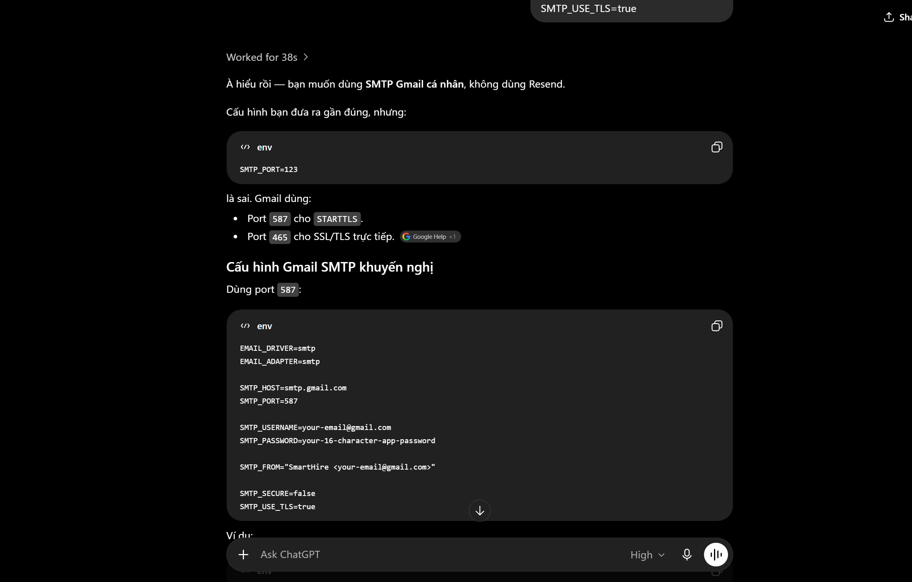
  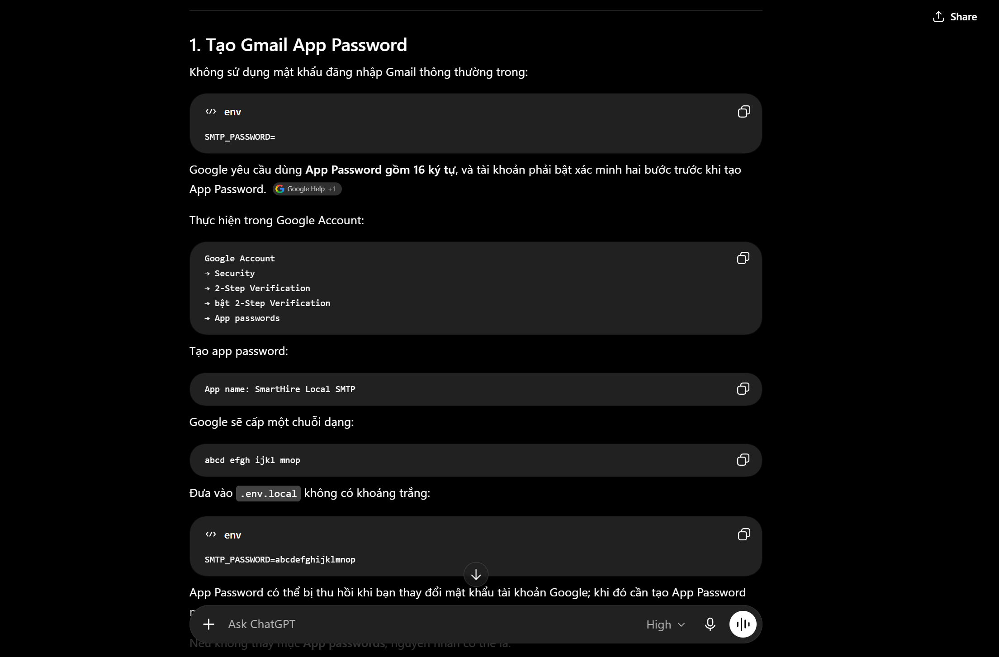
  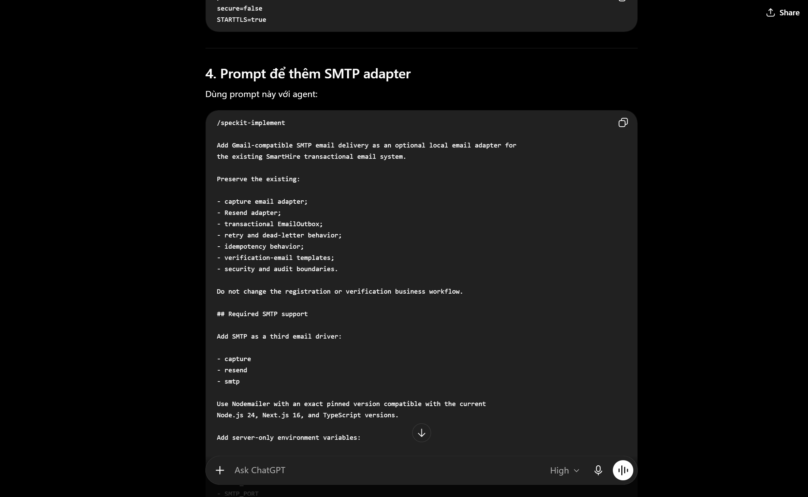

### Use Case 10:

- **Tool name, version, and platform:** GPT 5.5 Sol High
- **Access time (date and hour):** 8:00PM, 22/07/2026
- **Prompts used:**
  “Codex encountered errors while applying code changes, including file patch, sandbox, and helper-related errors. Analyze the causes and suggest how to continue the implementation safely.”
- **Purpose of use:**
  - To identify why Codex could not apply the generated code changes to the project files.
  - The AI was used to analyze file patch, sandbox permission, path, and helper-tool errors.
  - It also helped determine a safe method to continue the implementation without damaging existing code.
- **Which content was generated by AI:**
  - The AI explained the possible causes of the patch application failure.
  - It identified issues involving incorrect file paths, mismatched file content, sandbox restrictions, and unavailable helper commands.
  - It suggested checking the project directory and applying smaller code patches instead of one large patch.
  - It also recommended manually applying changes when automatic patching failed.
  - The AI provided steps to verify that no existing source code was overwritten or corrupted.
- **Which content was done independently and how the student edited or validated it:**
  - The student checked the affected files and compared them with the code generated by Codex.
  - Failed changes were manually applied or divided into smaller patches.
  - The student reviewed the modified code to remove duplicated or conflicting content.
  - The project was rebuilt and tested to confirm that the changes were applied correctly.
- **Screenshots or chat history:**
  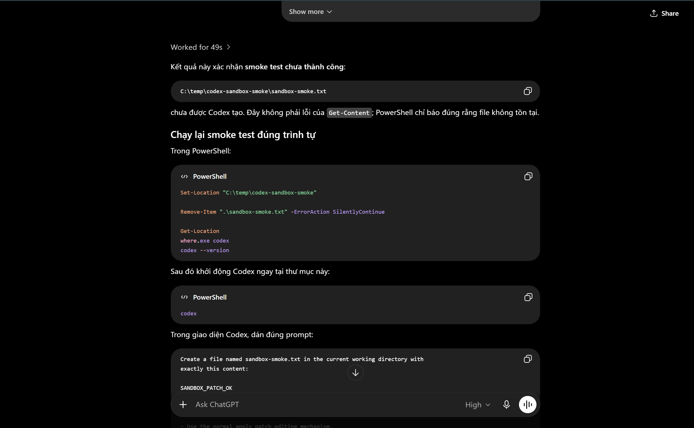
  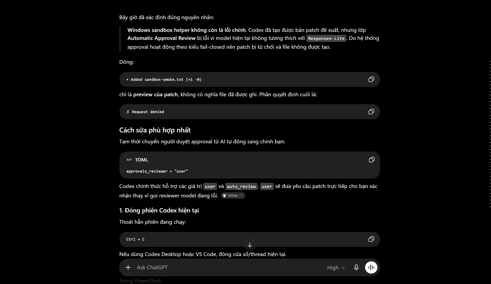
