# AI Usage Report For PA2

**Student Name:** Nguyễn Gia Quốc Uy  
**Student ID:** 24127261  
**Group:** 09   
**Class:** 24C11   
**Course/Project:** Software Engineering 

---
## AI Usage Notes
I used Vietnamese to prompt in many Use Case so that I may write in Vietnamese in the following Use Case Prompt and Output.

**Use Case 1:**
- **Tool name, version, and platform:** Antigravity, Google Gemini 3.5 Flash, Antigravity application
- **Access time (date and hour):**  8:12 PM, 7/6/2026
- **Prompts used:** "Hãy tổng hợp các thông tin, yêu cầu cụ thể cho tôi về PA2 này"
- **Purpose of use:** Use to clarify the assignment and requirements of PA2
- **Which content was generated by AI:** A detailed Information about all things required in PA2 but in Vietnamese
- **Which content was done independently and how the student edited or validated it:** I have done the requirement analysis and requirement specification independently and edited the AI generated content to fit my needs. I just use the content that created by AI to double check my understanding of the assignment.
- **Screenshots or chat history:** 
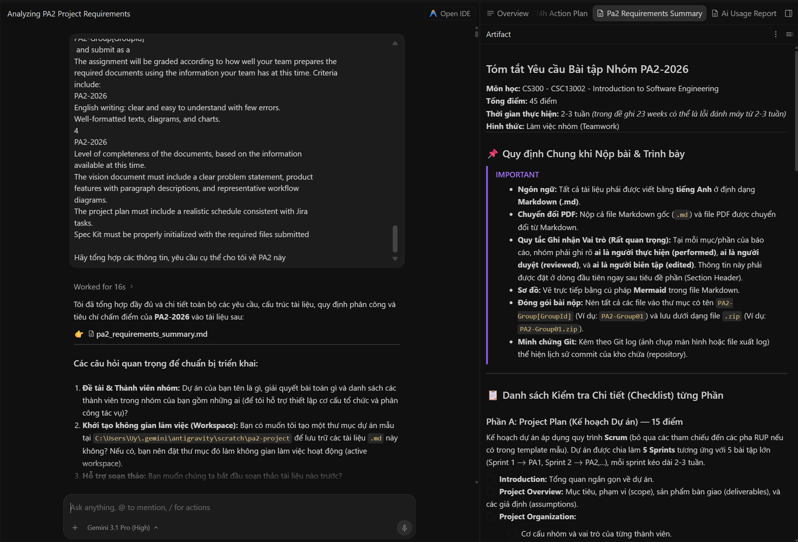

**Use Case 2:**
- **Tool name, version, and platform:** Antigravity, Google Gemini 3.5 Flash, Antigravity Agent Application
- **Access time (date and hour):**  7:10 PM, 8/6/2026
- **Prompts used:** "Hãy mô tả chi tiết hơn giúp tôi về nội dung, yêu cầu của phần Vision Document"
- **Purpose of use:** Use to clarify the assignment and requirements of Vision Document
- **Which content was generated by AI:** A detailed Information about all things required in Vision Document in Vietnamese, and in a easily understandable way.
- **Which content was done independently and how the student edited or validated it:** I have done the requirement analysis and requirement specification independently and edited the AI generated content to fit my needs. I just use the content that created by AI to double check my understanding of the assignment.
- **Screenshots or chat history:** 
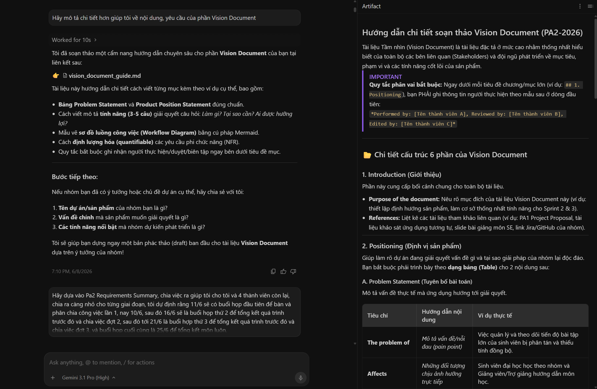

**Use Case 3:**
- **Tool name, version, and platform:** Antigravity, Google Gemini 3.5 Flash, Antigravity Agent Application
- **Access time (date and hour):**  8:54 PM, 10/6/2026
- **Prompts used:** "Hãy dựa vào Pa2 Requirements Summary, chia việc ra giúp tôi cho tôi và 4 thành viên còn lại, chia ra càng nhỏ cho từng giai đoạn, tôi dự định rằng 11/6 sẽ có buổi họp đầu tiên để bàn và phân chia công việc lần 1, nay 10/6, sau đó 16/6 sẽ là buổi họp thứ 2 để tổng kết quá trình trước đó và chia việc đợt 2, sau đó tới 21/6 là buổi hợp thứ 3 để tổng kết quá trình trước đó và chia việc đợt 3, và buổi họp cuối cùng là 25/6 để tổng kết môn luôn. Phân chia công việc cụ thể, chi tiết dễ hiểu, dễ tiếp cận cho 4 thành viên từng giai đoạn. Tôi dự định đảm nhận phần Spec-kit còn lại hãy chia cho thật hiệu quả"
- **Purpose of use:** Task allocation for 5 members in 3 phases.
- **Which content was generated by AI:** A detailed task allocation information for 5 members in 3 phases, who was responsible for what part and in what phase, in the form of table. With a estimated time to complete the task.
- **Which content was done independently and how the student edited or validated it:**  The student validated the generated task allocation against the actual team members' skills and later independently adjusted the workload (e.g., redistributing Mermaid tasks and Project Plan sections) during team meetings.
- **Screenshots or chat history:** 
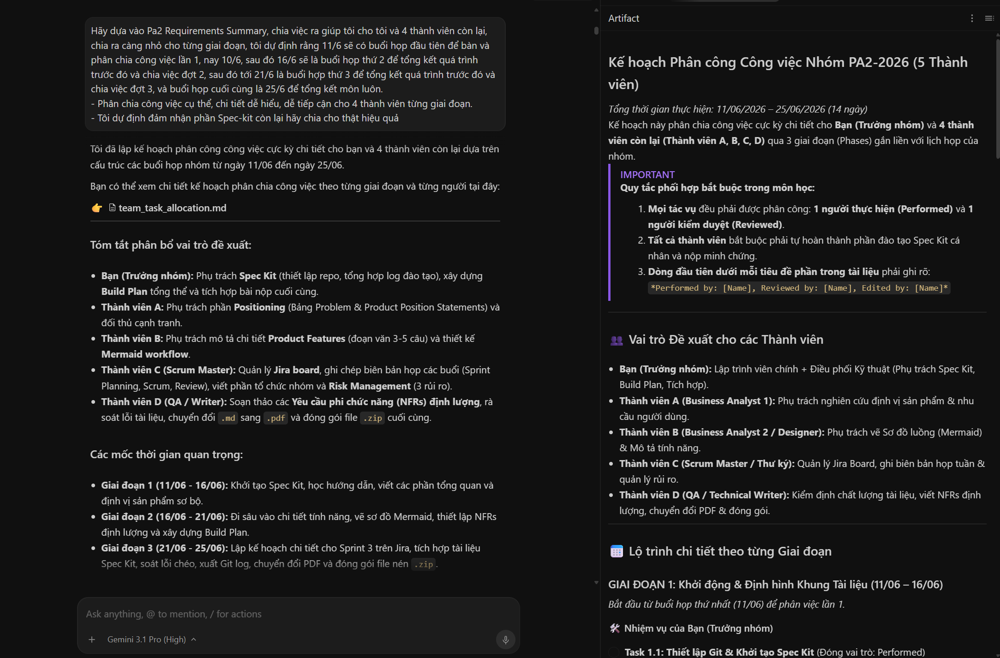

**Use Case 4:**
- **Tool name, version, and platform:** Antigravity, Google Gemini 3.5 Flash, Antigravity Agent Application
- **Access time (date and hour):**  10:33 PM, 9/6/2026
- **Prompts used:** "Dựa vào phần những gì bạn tạo, giải thích tôi thêm về phần Project Plan xem chi tiết cụ thể là như thế nào, tôi chưa hiểu lắm"
- **Purpose of use:** Explaining and clarifying the Project Plan section.
- **Which content was generated by AI:** A detailed explanation of the Project Plan section.
- **Which content was done independently and how the student edited or validated it:** The student independently understood and validated the generated explanation of the Project Plan section.
- **Screenshots or chat history:** 
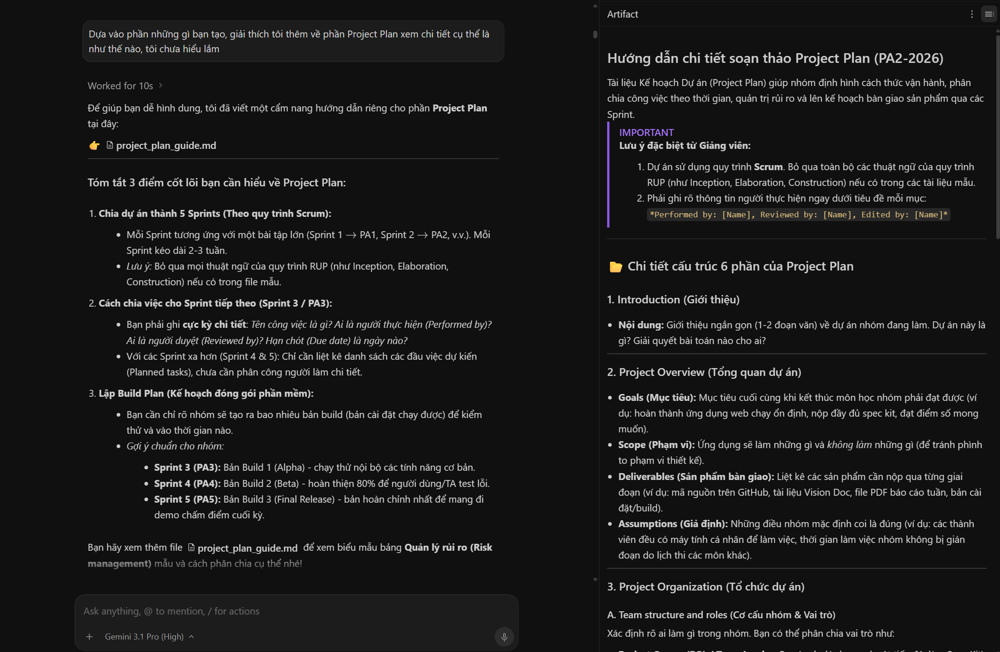

**Use Case 5:**
- **Tool name, version, and platform:** Antigravity, Google Gemini 3.5 Flash, Antigravity Agent Application
- **Access time (date and hour):**  11:33 AM, 9/6/2026
- **Prompts used:** "Tôi vừa mới init xong spec kit cho đồ án môn SE của tôi lần này, tôi chọn là agy, nhưng trong ide của antigravity lại không có các lệnh như /plan hay là /specify này kia là như nào"
- **Purpose of use:** Asking the AI about the commands of spec kit and the reason why in Antigravity IDE did not have the command /plan or /specify like other IDE.
- **Which content was generated by AI:** A detailed explanation of the commands of spec kit and the reason why in Antigravity IDE did not have the command /plan or /specify like other IDE. Provide in Vietnamese.
- **Which content was done independently and how the student edited or validated it:** The student independently understood and validated the generated explanation of the commands of spec kit and the reason why in Antigravity IDE did not have the command /plan or /specify like other IDE.
- **Screenshots or chat history:** 
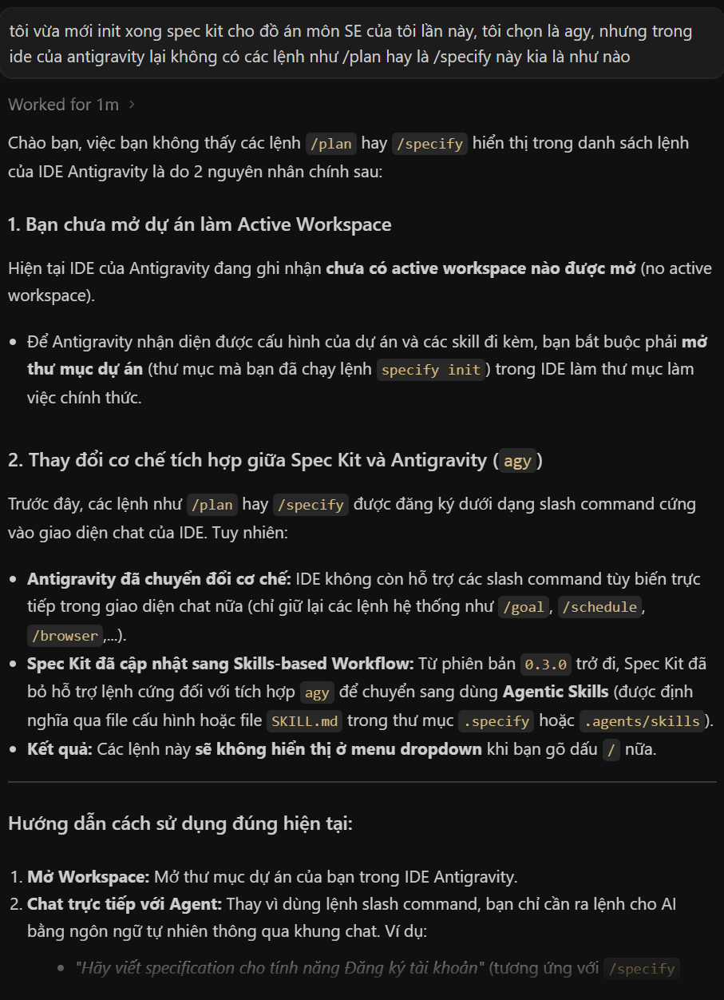

**Use Case 6:**
- **Tool name, version, and platform:** Antigravity, Google Gemini 3.5 Flash, Antigravity Agent Application
- **Access time (date and hour):**  10:50 PM, 9/6/2026
- **Prompts used:** "Giải thích cho tôi về ý nghĩa thật sự của các file constitution, plan, specify, tasks, implement, clarify, analyze, đồng thời cho tôi workflow chi tiết"
- **Purpose of use:** Explaining and clarifying the meaning of the files constitution, plan, specify, tasks, implement, clarify, analyze in the spec kit. Provide in Vietnamese.
- **Which content was generated by AI:** A detailed explanation of the meaning of the files constitution, plan, specify, tasks, implement, clarify, analyze in the spec kit. Provide in Vietnamese.
- **Which content was done independently and how the student edited or validated it:** The student independently understood and validated the generated explanation of the meaning of the files constitution, plan, specify, tasks, implement, clarify, analyze in the spec kit. Later, the student used this information to write the Constitution file for their project.
- **Screenshots or chat history:** 
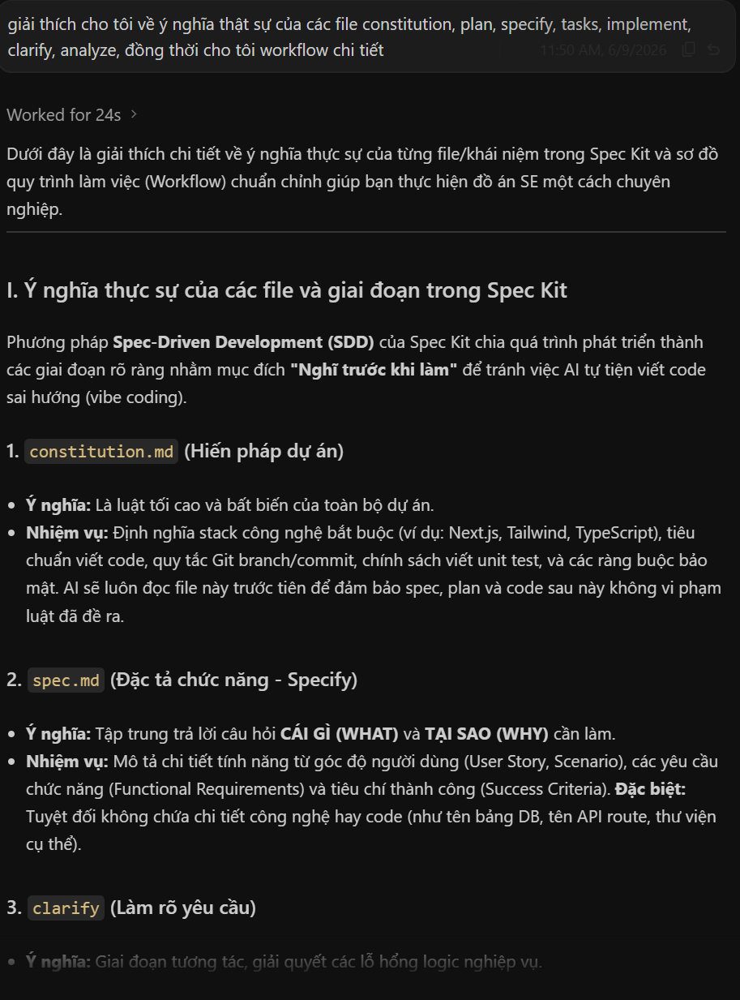

**Use Case 7:**
- **Tool name, version, and platform:** Antigravity, Google Gemini 3.5 Flash, Antigravity Agent Application
- **Access time (date and hour):**  12:40 AM, 12/6/2026
- **Prompts used:** "User Stories, Các p1 p2 p3 được ưu tiên trong spec là như thế nào có thể giải thích chi tiết và đưa ví dụ cho tôi được không"
- **Purpose of use:** Explaining, clarifying and giving some examples of the meaning of the User Stories and priority levels in the spec kit. Provide in Vietnamese.
- **Which content was generated by AI:** A detailed explanation of the meaning of the User Stories and priority levels in the spec kit. Provide in Vietnamese.
- **Which content was done independently and how the student edited or validated it:** The student independently understood and validated the generated explanation of the meaning of the User Stories and priority levels in the spec kit. Later, the student used this information to write the User Stories and priority levels in the spec kit for their project.
- **Screenshots or chat history:** 
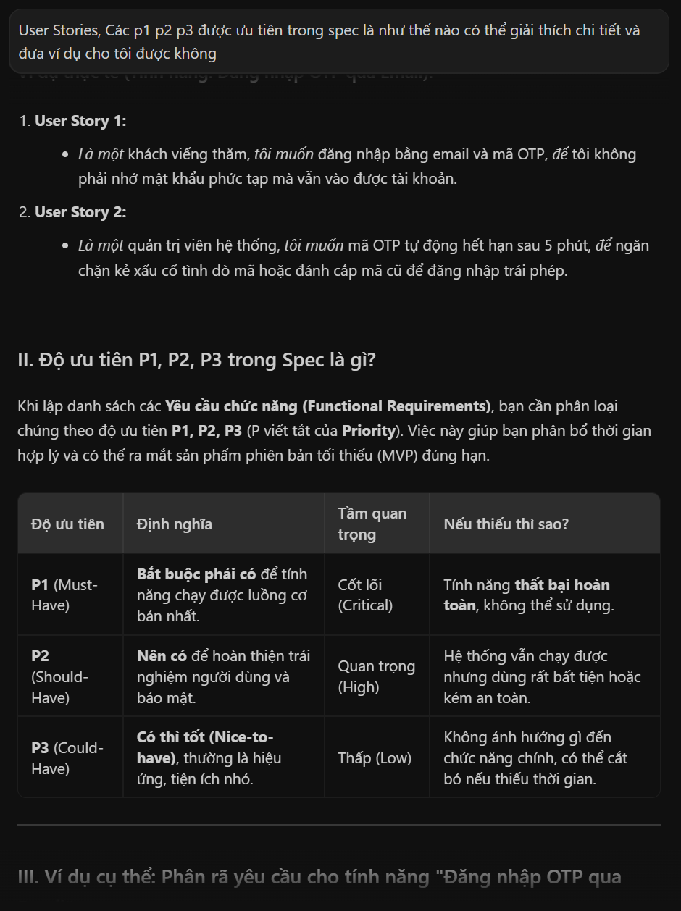

**Use Case 8:**
- **Tool name, version, and platform:** Antigravity, Google Gemini 3.5 Flash, Antigravity Agent Application
- **Access time (date and hour):**  1:12 AM, 12/6/2026
- **Prompts used:** "Vậy phần Functional Requirment trong spec thì sao"
- **Purpose of use:** Explaining the meaning of Functional Requirements in Spec Kit
- **Which content was generated by AI:** A general explanation of what a Functional Requirement is in the Spec Kit workflow, with generic examples
- **Which content was done independently and how the student edited or validated it:** The student independently understood and validated the general explanation. The student then wrote the project's own Functional Requirements based on the team's already-finalized feature decisions (Vision Document); AI was not used to generate the final Functional Requirement content for the project itself.
- **Screenshots or chat history:**  
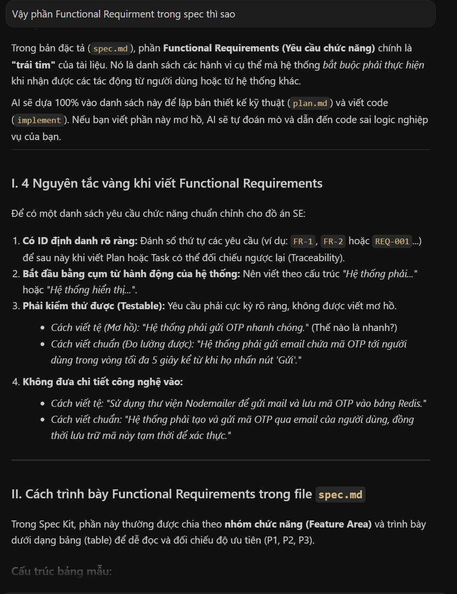

**Use Case 9:**
- **Tool name, version, and platform:** Antigravity, Google Gemini 3.5 Flash, Antigravity Agent Application
- **Access time (date and hour):**  1:34 AM, 12/6/2026
- **Prompts used:** "Vậy nếu như đồ án tôi có 10 nhóm chức năng chính, thì spec này sẽ siêu dài luôn đúng không với mỗi nhóm là 1 đống thứ như nãy giờ nói"
- **Purpose of use:** Clarifying about the size of the spec kit if the project has many main functions.
- **Which content was generated by AI:** A detailed explanation about the size of the spec kit if the project has many main functions.
- **Which content was done independently and how the student edited or validated it:** The student independently understood and validated the generated explanation about the size of the spec kit if the project has many main functions. Understand the structure of spec kit and how spec kit can be expanded if the project has many main functions.
- **Screenshots or chat history:** 
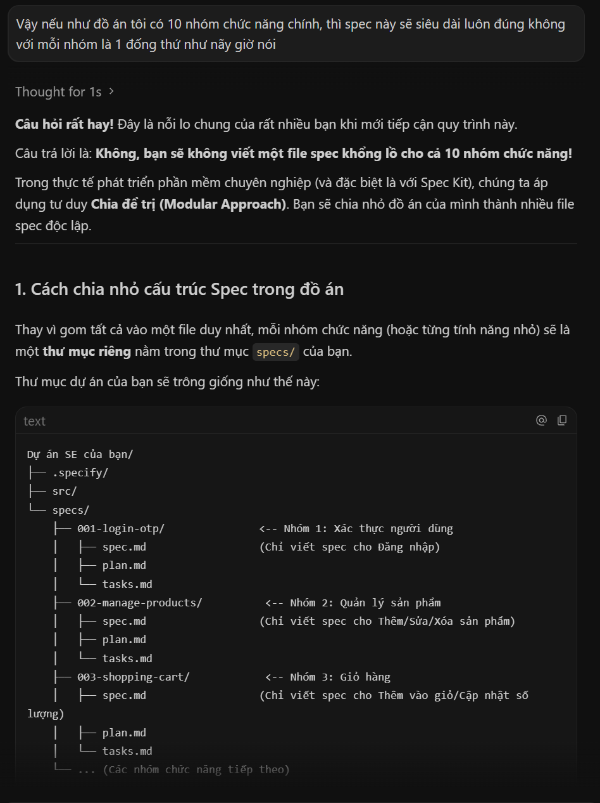

**Use Case 10:**
- **Tool name, version, and platform:** Antigravity, Google Gemini 3.5 Flash, Antigravity Agent Application
- **Access time (date and hour):**  4:00 PM, 16/6/2026
- **Prompts used:** "Nếu tôi chọn AI agents ban đầu lúc cái spec-kit thì các thành viên trong team của tôi khi clone về máy có thể sử dụng được các command này kia không, hoặc là nếu tôi mở v
scode cái project đó thì có thể dùng được trên đó hay không?"
- **Purpose of use:** Use to understand can my team-mate use the command if they use different IDE and clone the project. Provide in Vietnamese.
- **Which content was generated by AI:** AI answered that my team-mate can use the command if they use different IDE and clone the project. Provide in Vietnamese.
- **Which content was done independently and how the student edited or validated it:** The student independently understood and validated the generated explanation about can my team-mate use the command if they use different IDE and clone the project. The answer is true. So the student used this information to build up the team member workflow.
- **Screenshots or chat history:** 
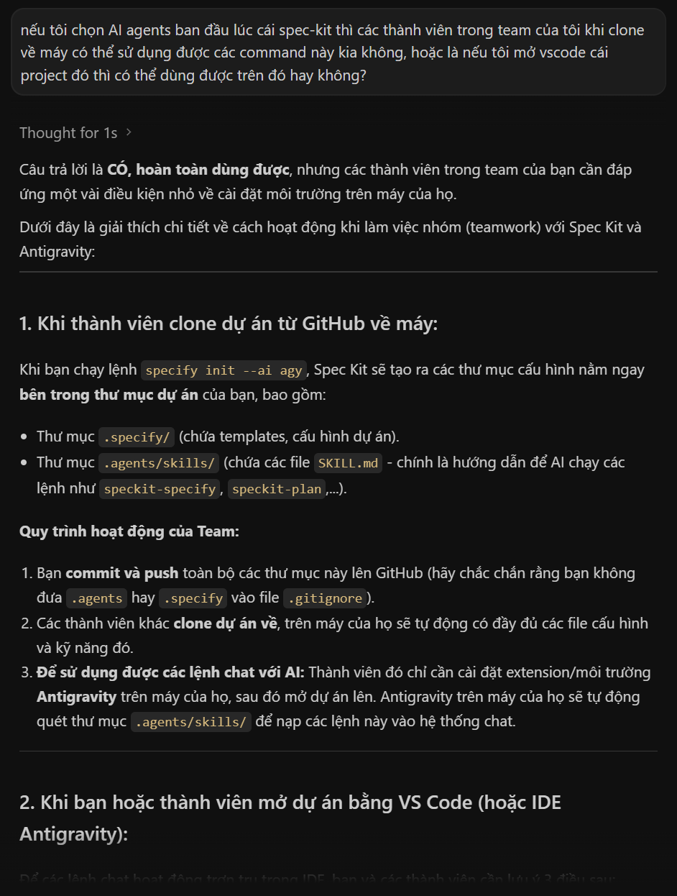

**Use Case 11:**
- **Tool name, version, and platform:** Antigravity, Google Gemini 3.5 Flash, Antigravity Agent Application
- **Access time (date and hour):**  4:08 PM, 16/6/2026
- **Prompts used:** "vậy có nghĩa là các thay đổi về cách hiểu của AI chỉ nằm ở 2 thư mục tương ứng là .agents của agy và .github của copilot thôi đúng không? còn file .specify thì sẽ giống nhau à?"
- **Purpose of use:** Clarifying about the understanding of AI agents in different directories. Provide in Vietnamese.
- **Which content was generated by AI:** A detailed explanation of the understanding of AI agents in different directories. Provide in Vietnamese.
- **Which content was done independently and how the student edited or validated it:** I have created 3 agent file for 3 AI tools that my group use (Cursor, Antigravity and Copilot). I ask AI to make sure that the specify folder in 3 agents are the same. It is just different between those agents folder (Cursor and Antigravity folder is similar) and this is the result.
- **Screenshots or chat history:** 
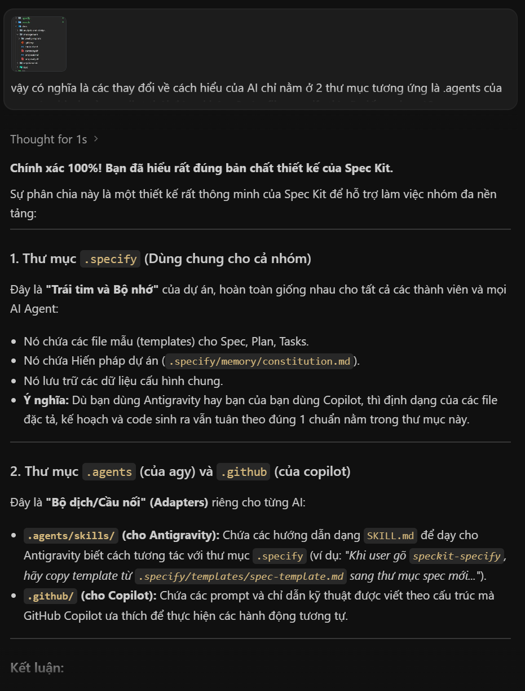

**Use Case 12:**
- **Tool name, version, and platform:** Antigravity, Google Gemini 3.5 Flash, Antigravity Agent Application
- **Access time (date and hour):**  6:54 AM, 18/6/2026
- **Prompts used:** "vậy có nghĩa là nếu tôi push này lên github của nhóm tôi thì các thành viên khác khi pull về chỉ cần speckit integration switch vào đúng ide của họ là có thể dùng được như bình thường đúng k?"
- **Purpose of use:** Clarifying about the understanding of AI agents in different directories. Provide in Vietnamese.
- **Which content was generated by AI:** Confirmation and explanation that team members only need to switch the Spec Kit integration to their own IDE after pulling.
- **Which content was done independently and how the student edited or validated it:** I have created 3 agent file for 3 AI tools that my group use (Cursor, Antigravity and Copilot). I ask AI to make sure that the specify folder in 3 agents are the same. It is just different between those agents folder (Cursor and Antigravity folder is similar) and this is the result.
- **Screenshots or chat history:** 
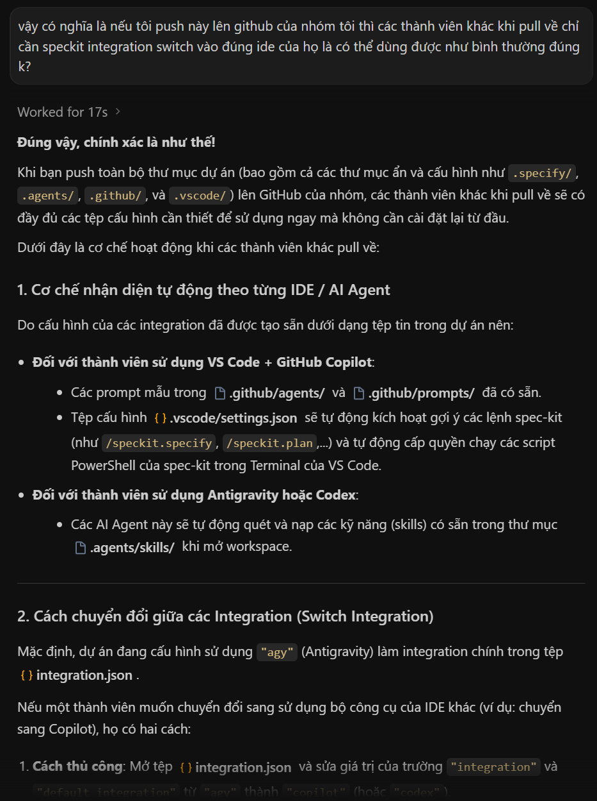

**Use Case 13:**
- **Tool name, version, and platform:** Claude, Claude Sonnet 4.6, Anthropic, claude.ai
- **Access time (date and hour):**  ~9:00 PM, 20/6/2026
- **Prompts used:** "Kì này tôi có đồ án môn học của học phần nhập môn SE với tên đề tài là SmartHire, một ứng dụng thông minh hỗ trợ tìm kiếm việc làm với 3 vai trò chính là ứng viên, nhà tuyển dụng và admin. Tôi đã soạn ra được 12 nhóm tính năng chính và có một vài tính năng chi tiết được đề xuất ra và đang chờ lấy ý kiến của nhóm tôi, bạn có thể nào đánh giá tổng quan về phần tôi đã soạn, xem những thiếu sót, điểm mạnh điểm yếu của tôi, góp ý cho tôi về những phần nên sửa, thêm chi tiết nhiều hơn nữa cho thật hay, thật thú vị nhưng không quá phức tạp vì đồ án khá nặng về docs và tôi còn nhiều môn học khác nữa."
- **Purpose of use:** Get critical feedback on the feature draft before sharing it with the team
- **Which content was generated by AI:** A critique identifying a duplicated sub-feature across two groups, unverified assumptions (e.g., custom-trained AI model vs. API, the 30/70 scoring split), and an overall scope concern that 12 feature groups exceed typical team capacity; also produced a P0/P1/P2 priority table with a suggested MVP demo path
- **Which content was done independently and how the student edited or validated it:** The student reviewed each point against the team's real constraints and brought the relevant points to the team for discussion; no AI-written text was copied into the feature document — the document's content remained the team's own wording.
- **Screenshots or chat history:** 
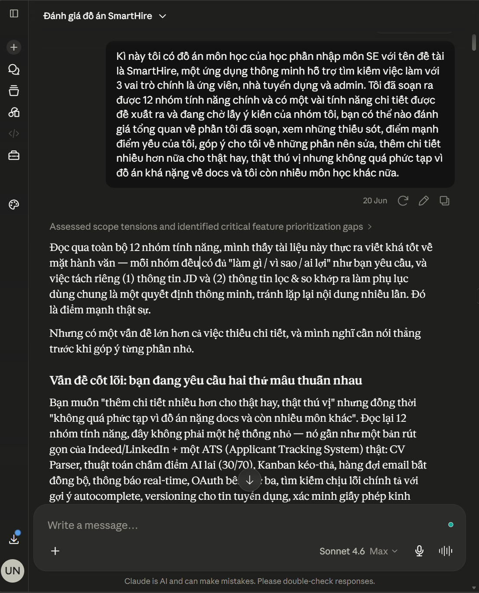

**Use Case 14:**
- **Tool name, version, and platform:** Claude, Claude Sonnet 4.6, Anthropic, claude.ai
- **Access time (date and hour):**  ~10:00 AM, 24/6/2026
- **Prompts used:** "Hãy liệt kê các task nhóm tôi cần thực hiện trong thời gian sắp tới"
- **Purpose of use:** Build a consolidated task list ahead of the meeting, and check the AI Usage Report itself for compliance gaps before submission.
- **Which content was generated by AI:** A consolidated task list grouped by urgency and by team member; a review of this report identifying that Claude's own usage had not been declared, that one earlier entry's wording risked implying AI had generated final Functional Requirement content, and several minor formatting/ordering fixes
- **Which content was done independently and how the student edited or validated it:** The student is using the task list as a planning aid to confirm with the team at the meeting rather than as a final assignment of work; the corrections to this report (including this section) were reviewed and applied by the student.
- **Screenshots or chat history:** 
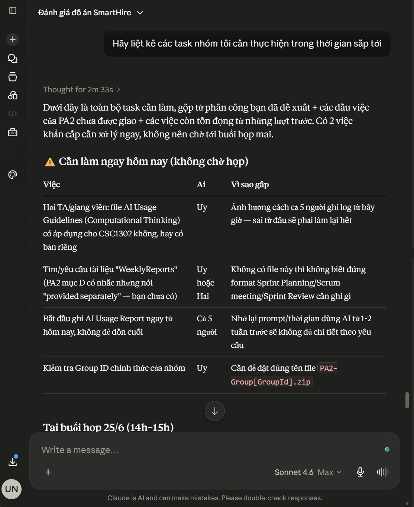

