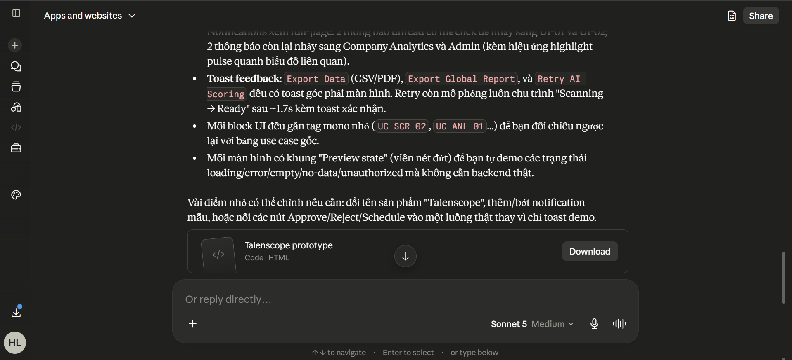
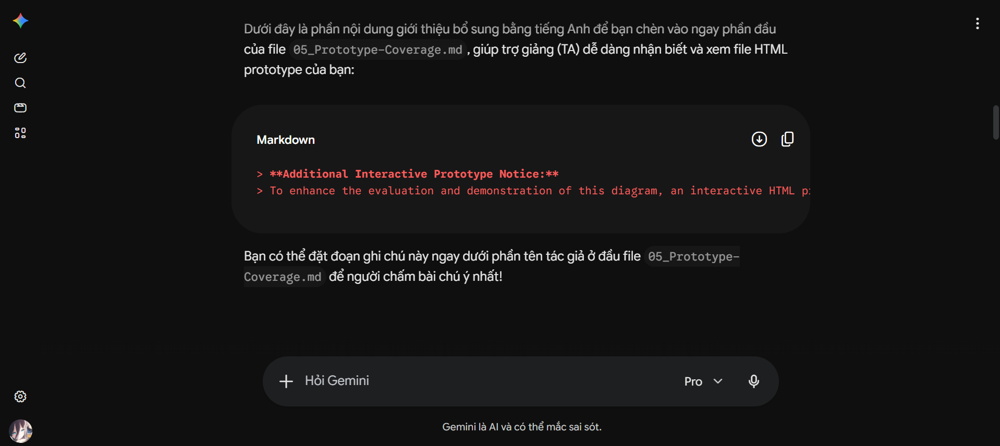
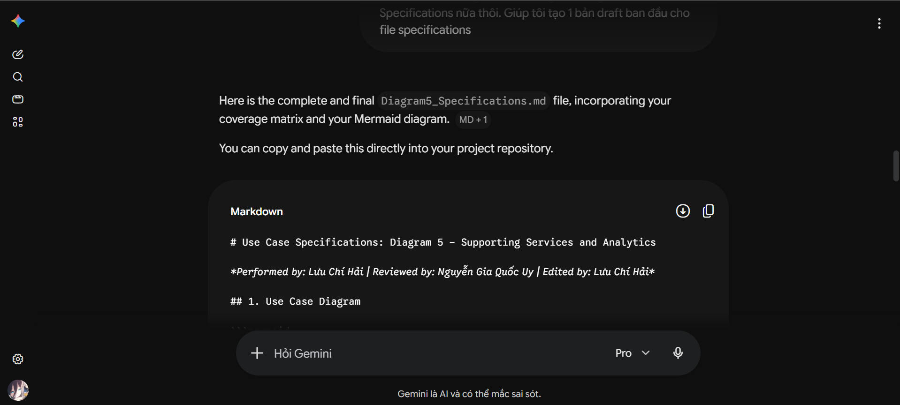
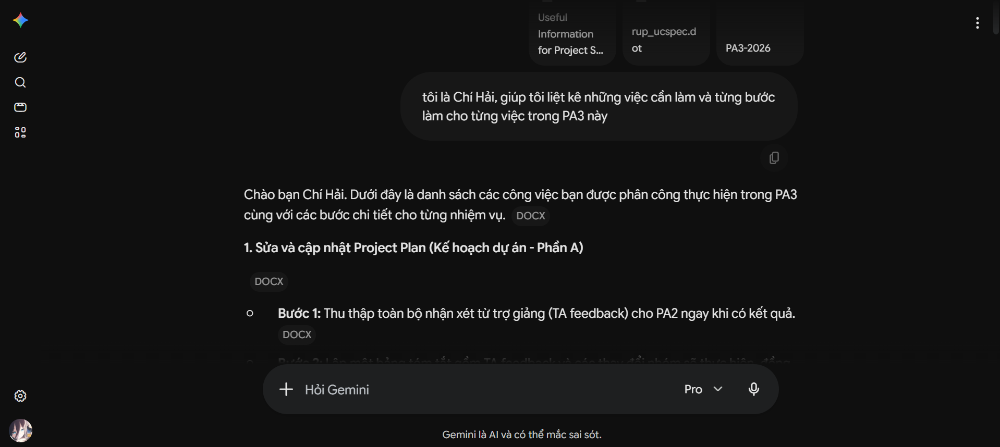
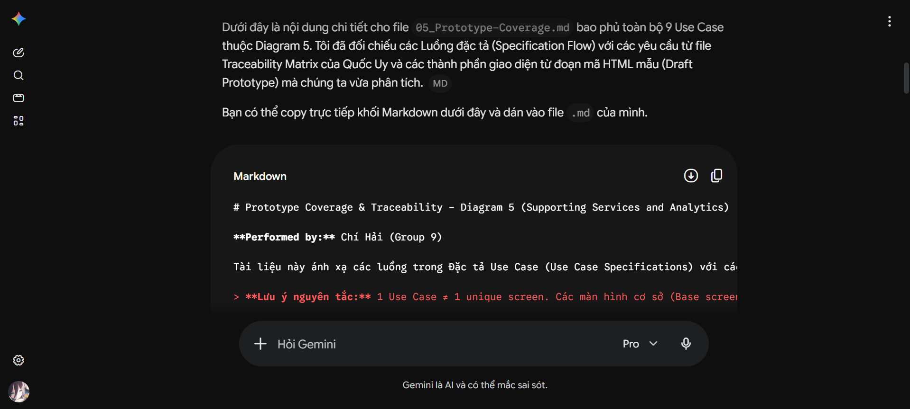
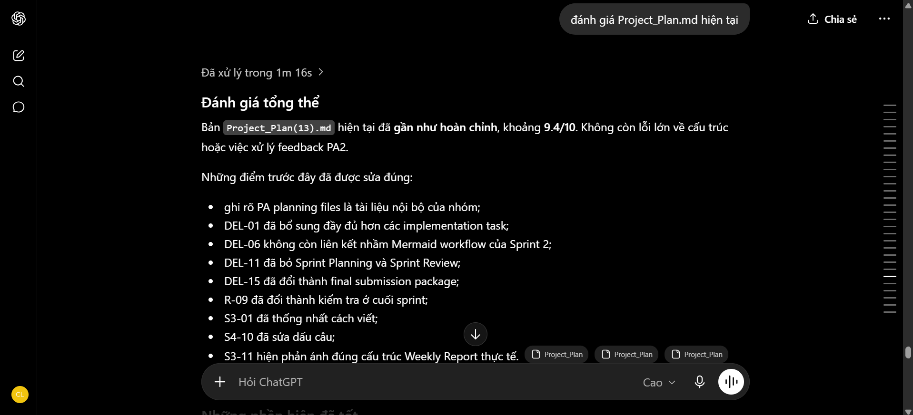
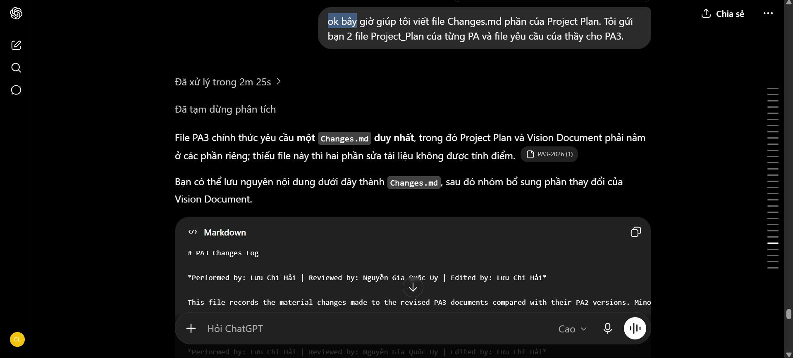
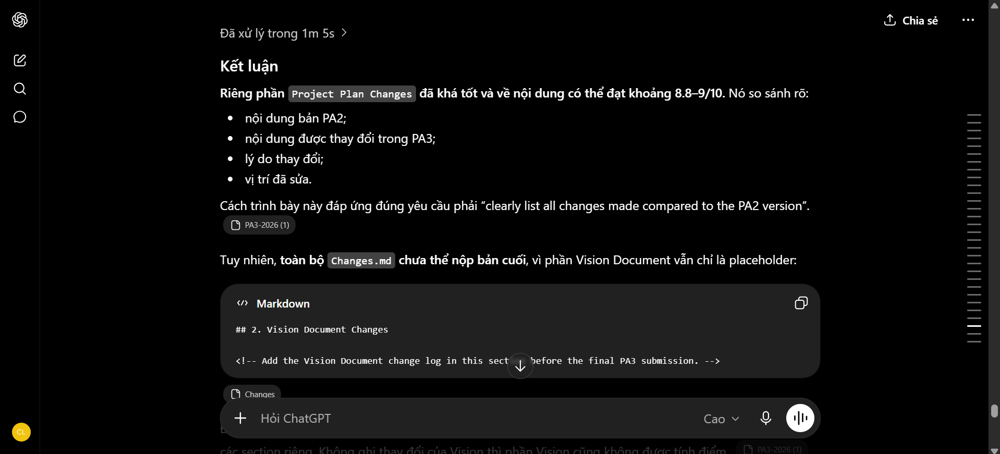

# AI Usage Report for PA3

**Student Name:** Lưu Chí Hải
**Student ID:** [Điền MSSV của bạn]
**Group:** 09
**Class:** [Điền lớp của bạn]
**Course/Project:** Software Engineering — SmartHire
**Reporting period:** 12/07/2026–25/07/2026

---

## AI Usage Notes

I used Vietnamese for most prompts because it allowed me to ask detailed follow-up questions and verify my understanding quickly. The PA3 deliverables generated from these discussions were written in English.

The AI was used as a planning, explanation, drafting, review, and prototyping assistant. It was used strictly as a support tool, not as a full replacement for human learning and research. I reviewed the responses against the PA3 assignment, the team's approved SmartHire scope, the repository, and feedback from team members.

The ChatGPT conversation contains more prompts than those documented in this report because it was originally shared with me by Nguyễn Quốc Thành, who is responsible for revising the Vision Document, after his ChatGPT session suggested that several Vision-related points should also be reflected in the Project Plan; therefore, this report includes only the important prompts directly related to my Project Plan and Project Plan `Changes.md` work.

---

## Use Case 1 — UI/UX Rapid Prototyping for Diagram 5

* **Tool name, version, and platform:** Claude Sonnet 5

* **Access time (date and hour):** July 23, 2026

* **Prompts used:** *"Act as a frontend UI/UX expert. Write a single-file interactive HTML prototype using modern CSS and Vanilla JS for SmartHire Diagram 5 (Supporting Services and Analytics). Include functional views for candidate screening (UC-SCR-01, 02, 04), notifications (UC-NOT-01, 02, 03), and analytics (UC-ANL-01, 02, 03) with clickable states like loading, error, empty state, and permission denial."*

* **Purpose of use:** To generate an interactive HTML/CSS prototype to simulate all use cases in Diagram 5 with mock data, interactive role-switching, and dynamic preview states.

* **Which content was generated by AI:** The AI generated the single-file HTML prototype containing the base screens and CSS/JS logic for state toggling.

* **Which content was done independently and how the student edited or validated it:** I verified the visual consistency with the project's requirements. I also manually fixed an AI contextual hallucination where it incorrectly labeled an Admin Dashboard chart as `UC-SCR-01` instead of `UC-ANL-02` based on the team's traceability matrix.

* **Screenshots or chat history:**

---

## Use Case 2 — Structuring Documentation and Professional Copywriting

* **Tool name, version, and platform:** Gemini 3.1 Pro

* **Access time (date and hour):** July 23, 2026

* **Prompts used:** *"tôi nghĩ mình nên ghi chú trong file 05_Prototype-Coverage.md là đã thêm Hai-Protoype.html vào để giảng viên dễ nhận biết. Giúp tôi viết thêm dòng giới thiệu file đó"*

* **Purpose of use:** To write a professional English notice to inform the Teaching Assistant about the interactive HTML prototype and to format a summary table for Diagram 5.

* **Which content was generated by AI:** The AI suggested the English notice text and formatted the "Diagram 5 Scope" Markdown table.

* **Which content was done independently and how the student edited or validated it:** I modified the exact directory paths and file names to match the actual submission structure of the group, and I verified that the formatting adhered to the team's Markdown standards.

* **Screenshots or chat history:**

---

## Use Case 3 — Drafting Diagram 5 Use-Case Specifications

* **Tool name, version, and platform:** Gemini 3.1 Pro

* **Access time (date and hour):** July 25, 2026

* **Prompts used:** *"tôi có 1 file coverage, 1 file vẽ diagram rồi, giờ cần file Specifications nữa thôi. Giúp tôi tạo 1 bản draft ban đầu cho file specifications"*

* **Purpose of use:** To compile and structure the final Markdown template for the Diagram 5 Use Case Specifications, combining the Traceability Summary, textual flows, prototype mappings, and Mermaid diagram.

* **Which content was generated by AI:** The AI generated the complete Markdown structure, ensuring basic and alternative flows were clearly separated and integrated with the provided Mermaid code.

* **Which content was done independently and how the student edited or validated it:** I manually provided the verified coverage matrix and the base Mermaid diagram. I mapped the correct screenshot filenames (e.g., `UI_01_Scanning_State.png`) to their respective flows and checked the generated flows against the team's actual business rules to ensure strict alignment.

* **Screenshots or chat history:**

---

## Use Case 4 — Personal Task Breakdown and Step-by-Step Planning for PA3

* **Tool name, version, and platform:** Gemini 3.1 Pro
* **Access time (date and hour):** July 24, 2026
* **Prompts used:** *"tôi là Chí Hải, giúp tôi liệt kê những việc cần làm và từng bước làm cho từng việc trong PA3 này"*
* **Purpose of use:** To get a personalized, step-by-step breakdown of the specific tasks assigned to me for the PA3 submission.
* **Which content was generated by AI:** The AI provided a detailed checklist and a step-by-step execution plan tailored to my assigned domain (Diagram 5 - Supporting Services and Analytics).
* **Which content was done independently and how the student edited or validated it:** I cross-referenced the AI's suggested task list with the group's official work breakdown structure and the master Traceability Matrix. I adjusted the timelines and priorities to align with the actual progress of the HTML prototype and documentation.
* **Screenshots or chat history:**

---

## Use Case 5 — Generating Prototype Coverage and Traceability Matrix

* **Tool name, version, and platform:** Gemini 3.1 Pro
* **Access time (date and hour):** July 24, 2026
* **Prompts used:** *"Giúp tôi tạo nội dung cho file `05_Prototype-Coverage.md` bao phủ 9 Use Case của Diagram 5. Hãy đối chiếu các luồng đặc tả (Specification Flow) với các yêu cầu từ file Traceability Matrix của Quốc Uy và các thành phần giao diện từ đoạn mã HTML mẫu (Draft Prototype) mà chúng ta vừa tạo."*
* **Purpose of use:** To systematically map the specified textual flows of Diagram 5 to their corresponding UI states from the interactive HTML prototype.
* **Which content was generated by AI:** The AI generated the complete Markdown code block for the `05_Prototype-Coverage.md` file, formatting the Coverage Matrix table and accurately matching the Use Case IDs with the UI screenshots and states.
* **Which content was done independently and how the student edited or validated it:** I verified that the AI-generated mapping strictly adhered to the "Traceability Validation Rules". I manually checked that every base screen and alternative flow state listed in the table corresponded perfectly to the actual screenshots captured from the HTML prototype.
* **Screenshots or chat history:**

---

## Use Case 6 — Reviewing and Revising the PA3 Project Plan

* **Tool name, version, and platform:** ChatGPT — GPT-5.6 Thinking — Web

* **Access time (date and hour):** July 25, 2026

* **Prompts used:** *"đánh giá Project_Plan.md hiện tại"*

* **Purpose of use:** To review successive versions of the PA3 Project Plan, identify inconsistencies, and verify whether the document addressed the PA2 feedback and the current PA3 planning requirements.

* **Which content was generated by AI:** The AI produced structured reviews of the Project Plan and identified issues related to project constraints, deliverables, risk management, sprint schedules, task ownership, reviewer assignments, acceptance criteria, build planning, Vision alignment, and deliverable-to-task traceability. It also proposed targeted Markdown replacements for individual rows and sections instead of rewriting unrelated content.

* **Which content was done independently and how the student edited or validated it:** I compared every suggested revision against the PA2 Project Plan, the revised PA3 Project Plan, the official PA3 assignment, the team’s internal planning files, the Notion task tracker, and information confirmed by the group leader. I rejected unsupported suggestions, including treating internal team instructions as official lecturer requirements and adding a reviewer-assignment rule that did not actually exist. Repeated review prompts for later Project Plan versions were consolidated into this single use case.

* **Screenshots or chat history:**

---

## Use Case 7 — Drafting the Project Plan Section of `Changes.md`

* **Tool name, version, and platform:** ChatGPT — GPT-5.6 Thinking — Web

* **Access time (date and hour):** July 25, 2026

* **Prompts used:** *"ok bây giờ giúp tôi viết file Changes.md phần của Project Plan. Tôi gửi bạn 2 file Project_Plan của từng PA và file yêu cầu của thầy cho PA3."*

* **Purpose of use:** To compare the PA2 and PA3 versions of the Project Plan and create a structured change log that satisfies the PA3 requirement for documenting all material revisions.

* **Which content was generated by AI:** The AI compared `Project_Plan_PA2.md` with `Project_Plan_PA3.md` and drafted the Project Plan section of `Changes.md`. It created change IDs and described the PA2 content, the corresponding PA3 revision, the reason for the change, and the revised location. The generated entries covered the Introduction, goals, scope, constraints, assumptions and dependencies, deliverables, organization, review rules, risk register, sprint schedules, Build Plan, Definition of Done, Vision alignment, feedback traceability, Revision History, and document formatting.

* **Which content was done independently and how the student edited or validated it:** I verified each change entry against both Project Plan files and the official PA3 assignment. I removed or rewrote statements that were unclear or could not be supported by the source files. I also confirmed that Lưu Chí Hải was recorded as the editor of the PA3 Project Plan and revised the metadata-related change entry to distinguish the PA2 and PA3 versions accurately. Only changes belonging to the Project Plan were retained; Vision Document changes were excluded from this use case.

* **Screenshots or chat history:**

---

## Use Case 8 — Reviewing the Project Plan Change Log for Submission

* **Tool name, version, and platform:** ChatGPT — GPT-5.6 Thinking — Web

* **Access time (date and hour):** July 25, 2026

* **Prompts used:** *"Changes.md này có thể nộp được chưa? Đánh giá nó ở phần Project Plan"*

* **Purpose of use:** To review the Project Plan section of `Changes.md` for accuracy, completeness, traceability, clarity, and submission readiness.

* **Which content was generated by AI:** The AI evaluated whether the change log clearly compared the PA2 and PA3 versions, explained the reasons for revisions, and identified the revised locations. It identified unclear wording in the document-metadata entry, recommended more precise wording for the formatting entry, and warned that the five-column table might become difficult to read when converted to a portrait PDF.

* **Which content was done independently and how the student edited or validated it:** I checked the review comments against the actual PA2 and PA3 Project Plan files. I retained the structured change table but revised ambiguous wording, especially the entry describing the editor change from Nguyễn Gia Quốc Uy in PA2 to Lưu Chí Hải in PA3. I also reviewed the generated PDF layout to ensure that the table remained readable and that no Project Plan change was presented without supporting evidence.

* **Screenshots or chat history:**

---