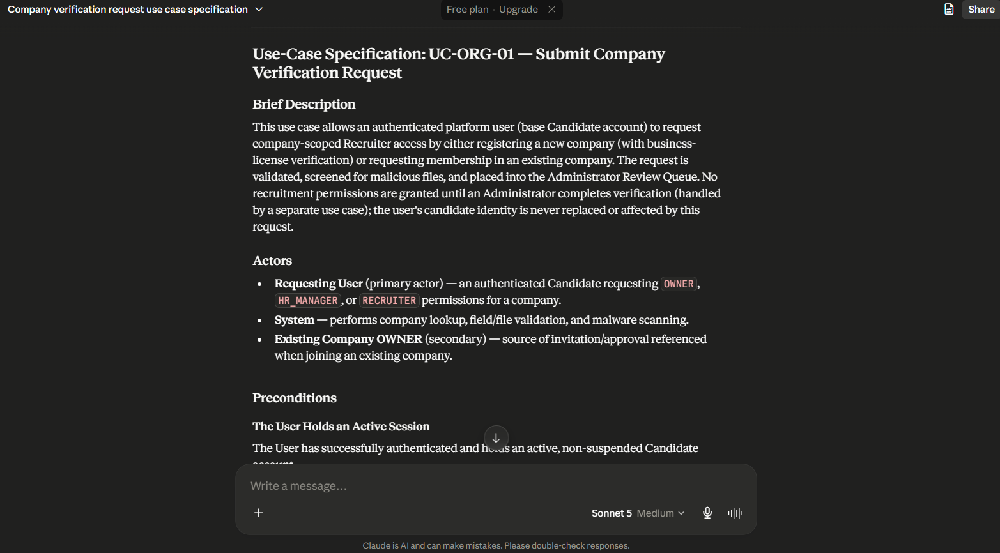
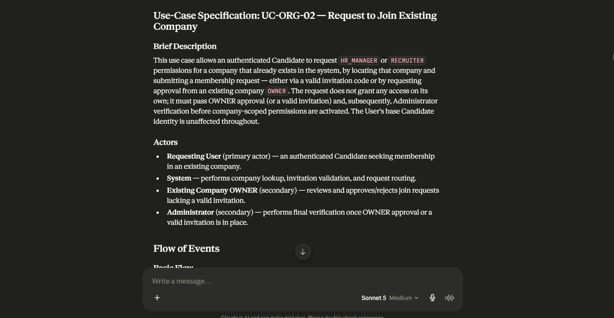
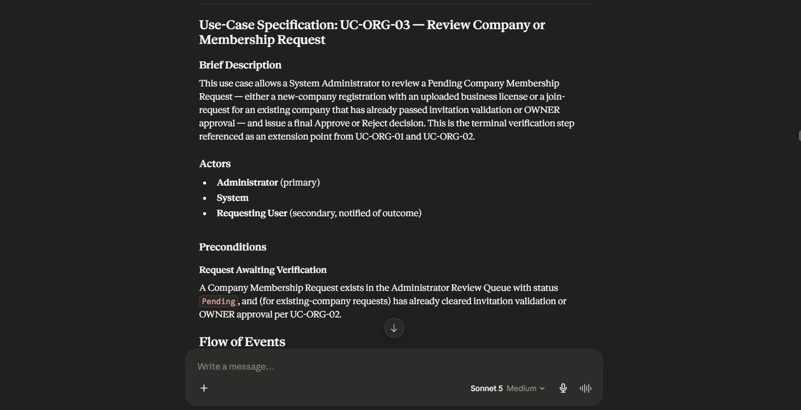
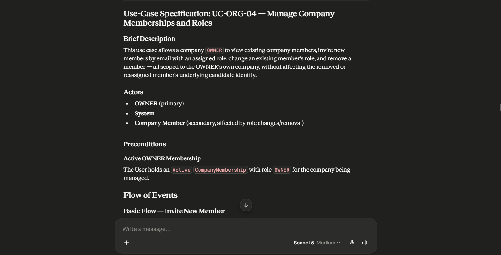
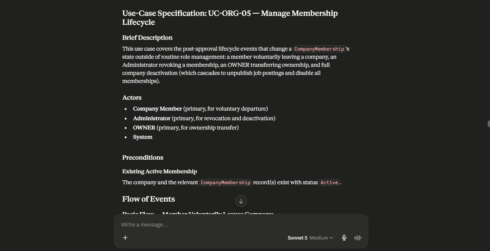
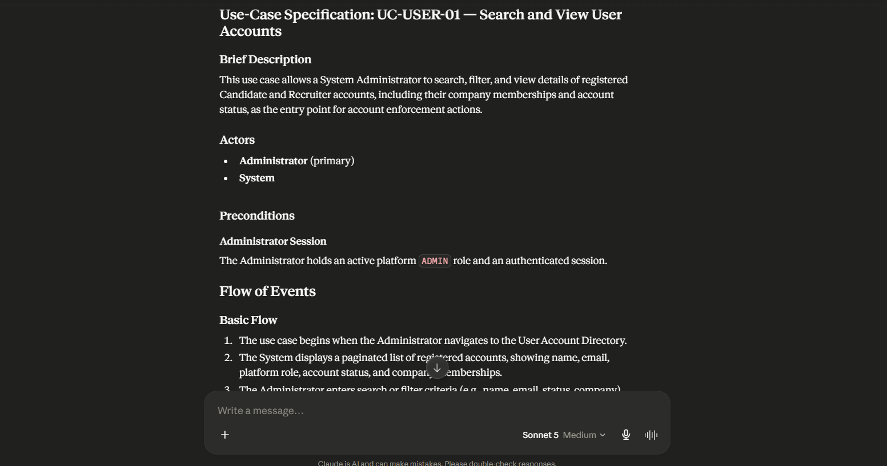
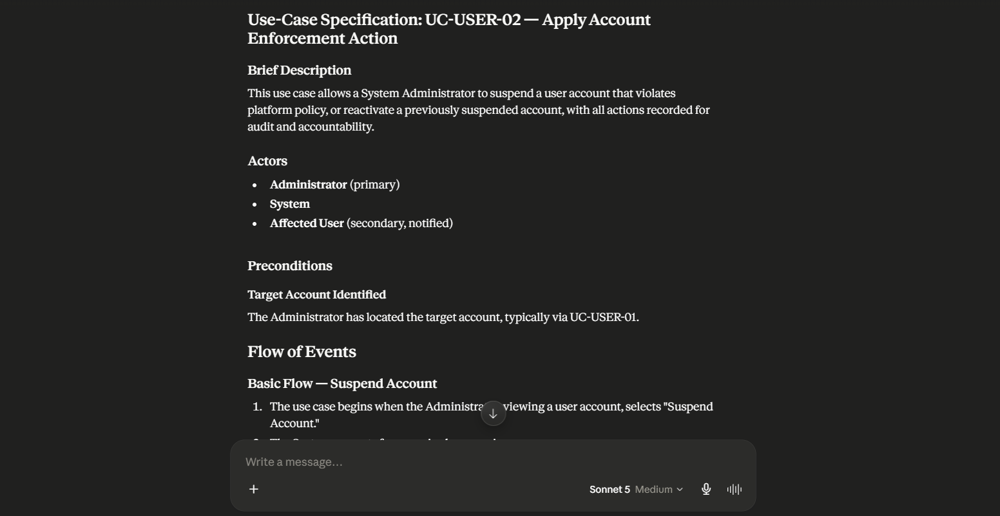
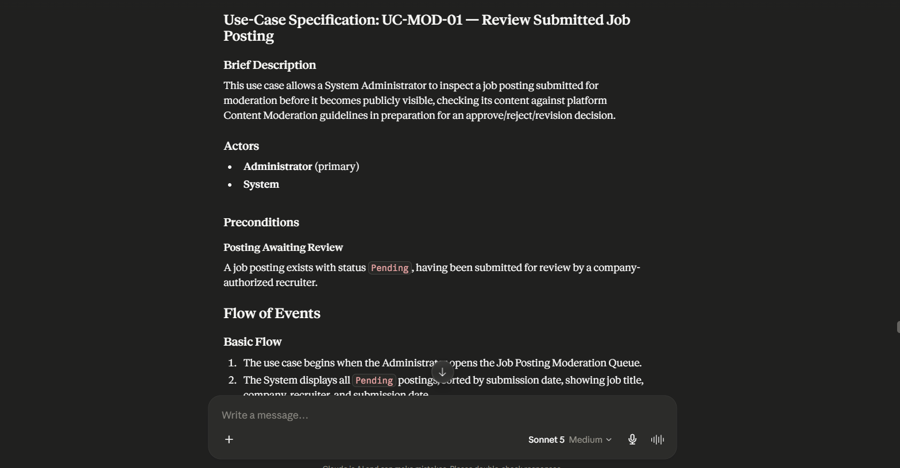
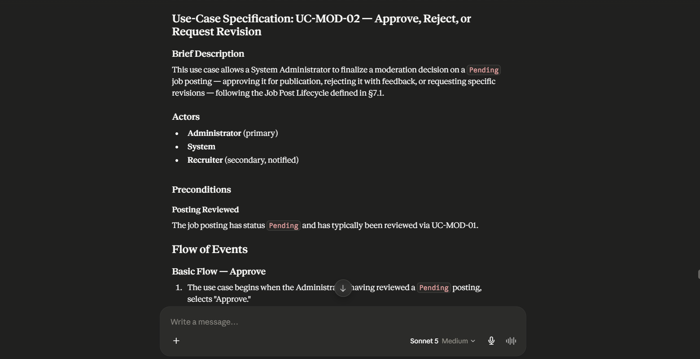
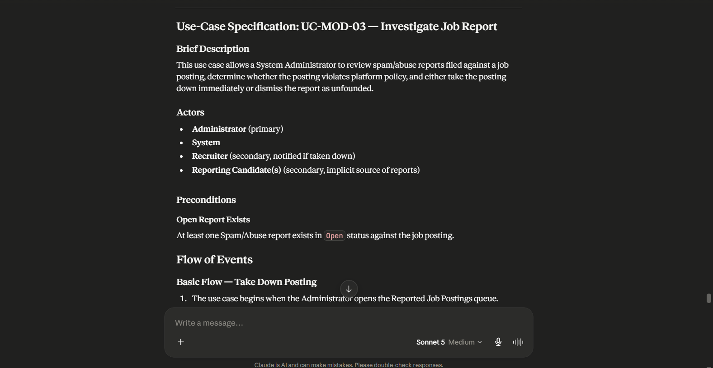

# AI Usage Report For PA3

**Student Name:** Nguyễn Minh Khôi 
**Student ID:** 24127066  
**Group:** 09   
**Class:** 24C11   
**Course/Project:** Software Engineering 

**Use Case 1:**
- **Tool name, version, and platform:** Claude (Claude Sonnet 5), web/chat interface (claude.ai)
- **Access time (date and hour):** 7:20 PM, 24/07/2026
- **Prompts used:** "Base strictly on vision document and proposal document of this project, and use the Specification format i provided, provide me with this use case specification: UC-ORG-01: Submit Company Verification Request"
- **Purpose of use:** To generate a first draft of the UC-ORG-01 use case specification in the required RUP-style format, grounded in the team's approved Proposal and Vision documents, to accelerate SRS documentation.
- **Which content was generated by AI:** Full draft text of UC-ORG-01 — Brief Description, Basic Flow, Alternative Flows (A1 Existing Company Found, A2 Invalid Document, A3 Cancel), Exception Flow E1, Special Requirements, Preconditions, Postconditions, and Extension Point, based on the company-membership workflow described in Vision Document.
- **Which content was done independently and how the student edited or validated it:** Reviewed each flow step against vision document and authorization rules for accuracy, renamed/reordered steps to match team terminology, corrected any details not aligned with the actual company-membership model, and cross-checked field names (Tax ID, OWNER, etc.) against the Vision Document glossary.
- **Screenshots or chat history:**  
  

---

**Use Case 2:**
- **Tool name, version, and platform:** Claude (Claude Sonnet 5), web/chat interface (claude.ai)
- **Access time (date and hour):** 7:35 PM, 24/07/2026
- **Prompts used:** "UC-ORG-02: Request to Join Existing Company"
- **Purpose of use:** To generate the "join existing company" branch as its own standalone use case (separated out from UC-ORG-01), covering the invitation-code and OWNER-approval paths described in vision document.
- **Which content was generated by AI:** Full draft text of UC-ORG-02 — Brief Description, Basic Flow (search → select company → role/invitation submission), Alternative Flows (A1 No Match, A2 No Invitation/Owner Approval Path, A3 Cancel), Exception Flows (E1 Owner Rejects, E2 Invalid/Expired Invitation), Special Requirements, Preconditions, Postconditions, and Extension Points referencing an Owner-review sub-use-case and the shared Admin verification use case.
- **Which content was done independently and how the student edited or validated it:** Verified the invitation-vs-OWNER-approval logic matches vision document's authorization safeguard, decided whether "Owner Review of Membership Request" needs its own UC ID or stays folded into UC-ORG-02, adjusted notification-timing requirement to match final NFR numbering.
- **Screenshots or chat history:**  
  

---

**Use Case 3:**
- **Tool name, version, and platform:** Claude (Claude Sonnet 5), web/chat interface (claude.ai)
- **Access time (date and hour):** 7:50 PM, 24/07/2026
- **Prompts used:** "Write for the remain usecases: UC-ORG-03 Review Company or Membership Request; UC-ORG-04 Manage Company Memberships and Roles; UC-ORG-05 Manage Membership Lifecycle; UC-USER-01 Search and View User Accounts; UC-USER-02 Apply Account Enforcement Action; UC-MOD-01 Review Submitted Job Posting; UC-MOD-02 Approve, Reject, or Request Revision; UC-MOD-03 Investigate Job Report"
- **Purpose of use:** To generate the Administrator-side verification decision use case (UC-ORG-03), the terminal step referenced as an extension point from UC-ORG-01 and UC-ORG-02.
- **Which content was generated by AI:** Full draft text of UC-ORG-03 — Brief Description, Basic Flow (Approve path), Alternative Flow A1 (Reject), Exception Flow E1 (Suspicious Submission → link to UC-USER-02), Special Requirements, Preconditions, Postconditions.
- **Which content was done independently and how the student edited or validated it:** Confirmed the record-creation logic (Company + OWNER membership vs. membership-only) matches the actual data model, verified consistency with vision document audit-logging requirements.
- **Screenshots or chat history:**  
  

---

**Use Case 4:**
- **Tool name, version, and platform:** Claude (Claude Sonnet 5), web/chat interface (claude.ai)
- **Access time (date and hour):** 7:50 PM, 24/07/2026
- **Prompts used:** (same batch prompt as Use Case 3 — "Write for the remain usecases: ...")
- **Purpose of use:** To generate the OWNER-facing use case for day-to-day team management (inviting members, changing roles, removing members) within a company.
- **Which content was generated by AI:** Full draft text of UC-ORG-04 — Brief Description, Basic Flow (Invite Member), Alternative Flows A1 (Change Role) and A2 (Remove Member), Special Requirements, Postconditions.
- **Which content was done independently and how the student edited or validated it:** Checked that this use case doesn't overlap/conflict with UC-ORG-05's ownership-transfer logic, verified invitation code generation matches actual auth design.
- **Screenshots or chat history:**  
  

---

**Use Case 5:**
- **Tool name, version, and platform:** Claude (Claude Sonnet 5), web/chat interface (claude.ai)
- **Access time (date and hour):** 7:50 PM, 24/07/2026
- **Prompts used:** (same batch prompt as Use Case 3)
- **Purpose of use:** To generate the membership lifecycle use case covering voluntary departure, Admin revocation, ownership transfer, and company deactivation, per §7.1 and the post-approval lifecycle described in §5.4.2.
- **Which content was generated by AI:** Full draft text of UC-ORG-05 — Brief Description, Basic Flow (Leave Company), Alternative Flows A1 (Admin Revokes), A2 (Ownership Transfer), A3 (Company Deactivation), Exception Flow E1 (Sole Owner Cannot Leave), Special Requirements, Postconditions.
- **Which content was done independently and how the student edited or validated it:** Validated the cascading deactivation logic against the Job Post Lifecycle diagram in §7.1, confirmed the "sole owner" edge case is actually enforced in the design.
- **Screenshots or chat history:**  
  

---

**Use Case 6:**
- **Tool name, version, and platform:** Claude (Claude Sonnet 5), web/chat interface (claude.ai)
- **Access time (date and hour):** 7:50 PM, 24/07/2026
- **Prompts used:** (same batch prompt as Use Case 3)
- **Purpose of use:** To generate the read-only Administrator use case for searching and inspecting user accounts, as the entry point into account enforcement actions (NEED16).
- **Which content was generated by AI:** Full draft text of UC-USER-01 — Brief Description, Basic Flow (search/filter/view), Alternative Flow A1 (No Results), Special Requirements, Postconditions, Extension Point to UC-USER-02.
- **Which content was done independently and how the student edited or validated it:** Confirmed the displayed fields (audit history, memberships) match what the User Account Directory is actually specified to show.
- **Screenshots or chat history:**  
  

---

**Use Case 7:**
- **Tool name, version, and platform:** Claude (Claude Sonnet 5), web/chat interface (claude.ai)
- **Access time (date and hour):** 7:50 PM, 24/07/2026
- **Prompts used:** (same batch prompt as Use Case 3)
- **Purpose of use:** To generate the Administrator enforcement use case (suspend/reactivate accounts), fulfilling NEED16 and the account-suspension audit requirement in §6.13.
- **Which content was generated by AI:** Full draft text of UC-USER-02 — Brief Description, Basic Flow (Suspend), Alternative Flow A1 (Reactivate), Exception Flow E1 (Self-Suspension Blocked), Special Requirements, Postconditions.
- **Which content was done independently and how the student edited or validated it:** Verified the immediate JWT-session-invalidation requirement matches the actual auth implementation approach in vision document.
- **Screenshots or chat history:**  
  

---

**Use Case 8:**
- **Tool name, version, and platform:** Claude (Claude Sonnet 5), web/chat interface (claude.ai)
- **Access time (date and hour):** 7:50 PM, 24/07/2026
- **Prompts used:** (same batch prompt as Use Case 3)
- **Purpose of use:** To generate the Administrator use case for inspecting a job posting queued for moderation.
- **Which content was generated by AI:** Full draft text of UC-MOD-01 — Brief Description, Basic Flow, Alternative Flow A1 (Flag for Escalated Review), Special Requirements, Postconditions, Extension Point to UC-MOD-02.
- **Which content was done independently and how the student edited or validated it:** Decided whether the "escalated review" flow is actually part of the design or should be removed if not planned.
- **Screenshots or chat history:**  
  

---

**Use Case 9:**
- **Tool name, version, and platform:** Claude (Claude Sonnet 5), web/chat interface (claude.ai)
- **Access time (date and hour):** 7:50 PM, 24/07/2026
- **Prompts used:** (same batch prompt as Use Case 3)
- **Purpose of use:** To generate the moderation decision use case (approve/reject/revision), aligned strictly with the Job Post Lifecycle state diagram in §7.1.
- **Which content was generated by AI:** Full draft text of UC-MOD-02 — Brief Description, Basic Flow (Approve), Alternative Flows A1 (Reject) and A2 (Request Revision), Special Requirements, Postconditions.
- **Which content was done independently and how the student edited or validated it:** Cross-checked the Draft↔Pending↔Active↔Closed transitions against the actual diagram to confirm "Reject" and "Request Revision" both correctly return the post to Draft.
- **Screenshots or chat history:**  
  

---

**Use Case 10:**
- **Tool name, version, and platform:** Claude (Claude Sonnet 5), web/chat interface (claude.ai)
- **Access time (date and hour):** 7:50 PM, 24/07/2026
- **Prompts used:** (same batch prompt as Use Case 3)
- **Purpose of use:** To generate the Administrator use case for investigating candidate-submitted spam/abuse reports against job postings (§4.8 "Spam/Abuse Report Management").
- **Which content was generated by AI:** Full draft text of UC-MOD-03 — Brief Description, Basic Flow (Take Down Posting), Alternative Flow A1 (Dismiss Report), Alternative Flow A2 (Escalate to Account Enforcement), Special Requirements, Postconditions, Extension Point to UC-USER-02.
- **Which content was done independently and how the student edited or validated it:** Confirmed report status values (Open/Resolved/Resolved–Dismissed) match the actual data model, verified the takedown-notification requirement.
- **Screenshots or chat history:**  
  

