# AI Usage Report

# Student Information

**Student Name:** Ngô Quốc Tuấn  
**Student ID:** 24127581  
**Group:** 09   
**Class:** 24C11   
**Course/Project:** Software Engineering   
**Review:** Nguyễn Gia Quốc Uy

---

# Notes

- The Prompts used in this report are written in Vietnamese, as this was the language used during the actual interaction with the AI tool. All other sections (Purpose of use, content descriptions, validation notes) are written in English to comply with the report format required for this course.
- Prompts were kept in their original Vietnamese form (rather than translated) to preserve the exact wording used when interacting with the AI tool, ensuring the record accurately reflects the actual usage.
- Use Cases are listed in chronological order of actual usage. Use Cases 1–8 correspond to the preliminary, use-case-by-use-case exploration (Diagram 3 – Recruiter Operations) that was carried out *before* the formal diagram and specification were produced. Use Cases 9–12 correspond to the later stage, where the diagram, traceability document, interactive prototype, and formal Use Case Specification were generated based on the understanding built in Use Cases 1–8.

---

# Summary Table

| # | Use Case (Prompt Purpose) | Output Type | Access Time |
|---|---|---|---|
| 1 | Preliminary analysis – UC-POST-01 (Create and Manage Job Draft) | Actor/Flow/Exception/Relationship notes | 23/07/2026 - 11:00 p.m|
| 2 | Preliminary analysis – UC-POST-02 (Preview and Submit Job Posting) | Actor/Flow/Exception/Relationship notes | 23/07/2026 11:10 p.m|
| 3 | Preliminary analysis – UC-POST-03 (Manage Job-Posting Lifecycle) | Actor/Flow/Exception/Relationship notes | 23/07/2026 11:15 p.m|
| 4 | Preliminary analysis – UC-POST-04 (View Company Job Postings) | Actor/Flow/Exception/Relationship notes | 23/07/2026 11:25 p.m|
| 5 | Preliminary analysis – UC-SCR-03 (Review and Rank Applicants) | Actor/Flow/Exception/Relationship notes | 23/07/2026 11:40 p.m |
| 6 | Preliminary analysis – UC-PIPE-01 (View Recruitment Pipeline Kanban Board) | Actor/Flow/Exception/Relationship notes | 23/07/2026 11:50 p.m|
| 7 | Preliminary analysis – UC-PIPE-02 (Update Candidate Recruitment Stage) | Actor/Flow/Ex/Relationship notes | 23/07/2026 00:01 a.m|
| 8 | Preliminary analysis – UC-PIPE-03 (View Application Stage History) | Actor/Flow/Exception/Relationship notes | 23/07/2026 00:15 a.m|
| 9 | UML Use Case Diagram (Diagram 3) | PlantUML code + Actor-UC table | 24/07/2026 - 00:40 a.m |
| 10 | Prototype Coverage & Traceability document | Markdown document | 24/07/2026 - 01:00 a.m |
| 11 | Interactive HTML Prototype | Single-file HTML/CSS/JS | 24/07/2026 - 01:25 a.m |
| 12 | Use Case Specification (formal) | Markdown specification tables | 24/07/2026 - 02:00 a.m |

> Note: Use Cases 1–8 were run the day before the diagram/specification work (see individual entries below); exact timestamps were not recorded for these preliminary exploration prompts, so the date is listed as 23/07/2026 based on the project timeline. If exact timestamps are available from chat history, they should be filled in before final submission.

---

**Use Case 1:**
- **Tool name, version, and platform:** Claude (Anthropic), Claude Sonnet 5, Web Platform (claude.ai)
- **Access time (date and hour):** 23/07/2026
- **Prompts used:** "Bạn là Business Analyst. Tôi đang tìm hiểu sơ bộ 1 use case cho hệ thống SmartHire (nền tảng tuyển dụng), Diagram 3 - Recruiter Operations, trước khi viết đặc tả chính thức. Use Case: UC-POST-01: Create and Manage Job Draft... (kèm actor chính, bối cảnh ngắn, yêu cầu trả lời ngắn gọn 4 ý: actor tham gia, flow chính, ngoại lệ đáng chú ý, khả năng include/extend với 8 UC còn lại trong danh sách)"
- **Purpose of use:** To do a preliminary (pre-specification) exploration of UC-POST-01 (Create and Manage Job Draft) — identifying actors, main flow, exception scenarios, and possible include/extend relationships with the other 7 use cases in Diagram 3, before writing the formal specification.
- **Which content was generated by AI:** The actor list (primary and possible secondary actors), the draft main flow steps, the list of exception scenarios, and the preliminary include/extend relationship table against the other 8 use cases, along with open questions to clarify before the formal specification.
- **Which content was done independently and how the student edited or validated it:** I defined the exact use case name, actor, and short context based on the team's actual requirements. I reviewed the AI's relationship guesses (which were explicitly flagged as inferred from UC naming only) against the real system design, and used the "next steps" questions raised by the AI to guide follow-up clarification with the team before finalizing the relationships.
- **Screenshots or chat history:**
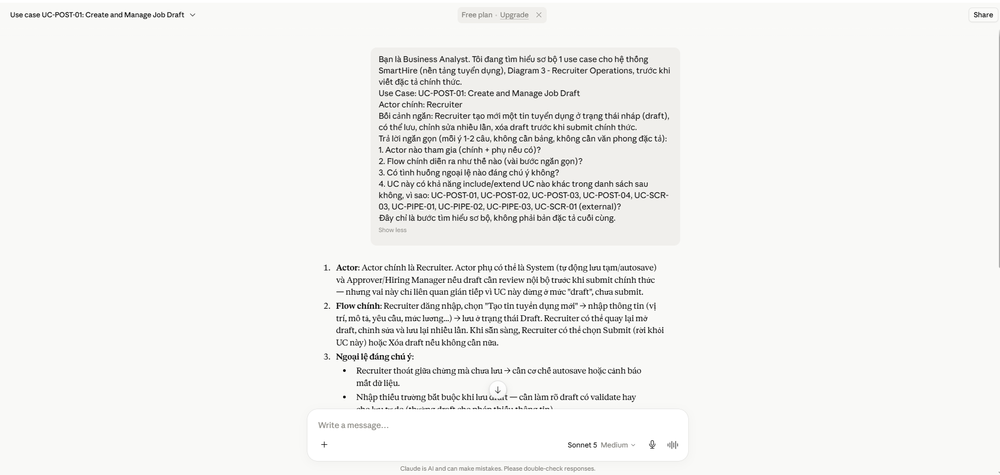

**Use Case 2:**
- **Tool name, version, and platform:** Claude (Anthropic), Claude Sonnet 5, Web Platform (claude.ai)
- **Access time (date and hour):** 23/07/2026
- **Prompts used:** "Bạn là Business Analyst. Tôi đang tìm hiểu sơ bộ 1 use case cho hệ thống SmartHire (nền tảng tuyển dụng), Diagram 3 - Recruiter Operations, trước khi viết đặc tả chính thức. Use Case: UC-POST-02: Preview and Submit Job Posting... (kèm actor chính, bối cảnh ngắn, yêu cầu trả lời 4 ý tương tự UC-POST-01)"
- **Purpose of use:** To do a preliminary exploration of UC-POST-02 (Preview and Submit Job Posting) — actors, main flow, exception scenarios, and its relationship to UC-POST-01 and the other use cases, particularly whether submitting a job posting includes a call to the external UC-SCR-01.
- **Which content was generated by AI:** The actor analysis (including open questions about an approval actor and a possible publishing service), the draft flow from draft selection to submission, a list of exception scenarios (concurrency, expired draft, permission, duplicate submit), and a relationship table with reasoning for each of the 8 related use cases.
- **Which content was done independently and how the student edited or validated it:** I supplied the exact use case scope and its dependency on UC-POST-01. I evaluated the AI's flagged uncertainties (e.g., whether UC-SCR-01 represents a publishing service or a content moderation service) against the team's actual system design, and used these open questions to clarify the real relationship before it was carried into the formal specification.
- **Screenshots or chat history:**
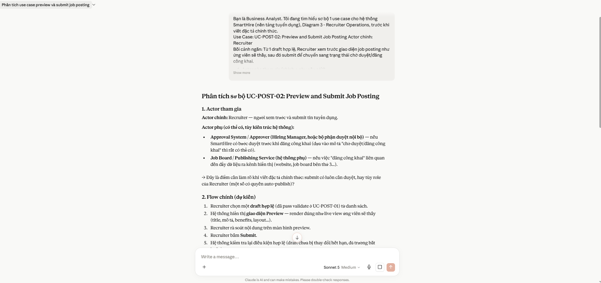
**Use Case 3:**
- **Tool name, version, and platform:** Claude (Anthropic), Claude Sonnet 5, Web Platform (claude.ai)
- **Access time (date and hour):** 23/07/2026
- **Prompts used:** "Bạn là Business Analyst. Tôi đang tìm hiểu sơ bộ 1 use case cho hệ thống SmartHire (nền tảng tuyển dụng), Diagram 3 - Recruiter Operations, trước khi viết đặc tả chính thức. Use Case: UC-POST-03: Manage Job-Posting Lifecycle... (kèm actor chính Recruiter, có thể kèm HR Manager, bối cảnh về vòng đời Active → Paused → Closed → Archived/Reopen)"
- **Purpose of use:** To do a preliminary exploration of UC-POST-03 (Manage Job-Posting Lifecycle) — actors, the state-transition-based main flow, exception scenarios tied to lifecycle changes, and its relationship with the Pipeline (UC-PIPE) group of use cases.
- **Which content was generated by AI:** The actor analysis (Recruiter as primary, HR Manager and a System/Scheduler as possible secondary actors), the state-dependent main flow, a list of lifecycle-related exception scenarios (closing with active candidates, reopening archived jobs, concurrency), and a relationship table with the AI's confidence level for each candidate relationship.
- **Which content was done independently and how the student edited or validated it:** I provided the exact lifecycle states and actor context from the project's requirements. I reviewed the AI's assumption-based relationship guesses (explicitly marked as inferred from naming, not confirmed content) and cross-checked the "high probability" Pipeline relationships against the team's actual pipeline design before accepting them.
- **Screenshots or chat history:**
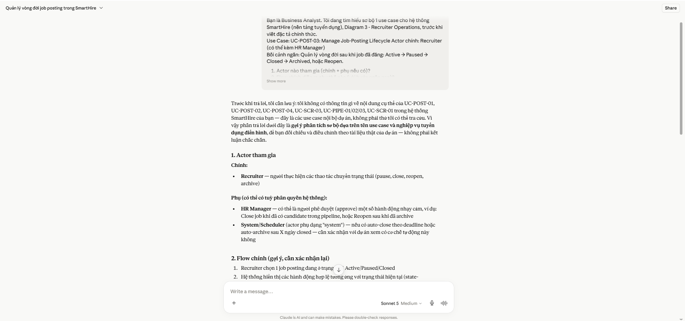

**Use Case 4:**
- **Tool name, version, and platform:** Claude (Anthropic), Claude Sonnet 5, Web Platform (claude.ai)
- **Access time (date and hour):** 23/07/2026
- **Prompts used:** "Bạn là Business Analyst. Tôi đang tìm hiểu sơ bộ 1 use case cho hệ thống SmartHire (nền tảng tuyển dụng), Diagram 3 - Recruiter Operations, trước khi viết đặc tả chính thức. Use Case: UC-POST-04: View Company Job Postings... (kèm 3 actor chính: Recruiter, HR Manager, Company Owner, bối cảnh xem danh sách job posting có filter/search/sort)"
- **Purpose of use:** To do a preliminary exploration of UC-POST-04 (View Company Job Postings) — clarifying the multi-actor scope (Recruiter, HR Manager, Company Owner), the search/filter/sort flow, and whether it holds an include/extend relationship with the other use cases or is simply a navigation entry point.
- **Which content was generated by AI:** The multi-actor analysis flagging the data-visibility-scope question as a business rule rather than a simple exception, the draft browse/filter/search flow, a list of exception scenarios (empty results, large datasets, invalid filter combinations), and a relationship table distinguishing "navigation link" from true UML include/extend relationships.
- **Which content was done independently and how the student edited or validated it:** I defined the three primary actors and the filter/search/sort scope based on the real requirements. I evaluated the AI's key finding — that data visibility differs by actor role — against the team's actual permission model, and used this to decide whether to split the specification into per-actor alternate flows.
- **Screenshots or chat history:**
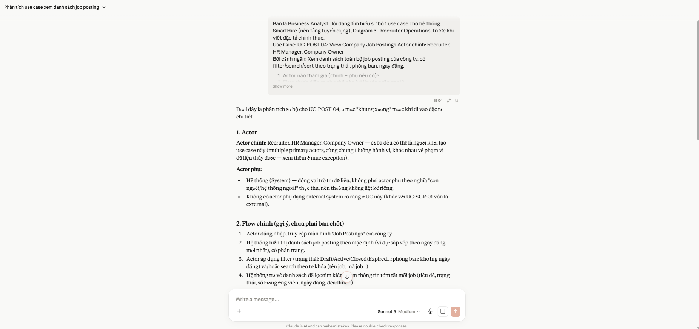

**Use Case 5:**
- **Tool name, version, and platform:** Claude (Anthropic), Claude Sonnet 5, Web Platform (claude.ai)
- **Access time (date and hour):** 23/07/2026
- **Prompts used:** "Bạn là Business Analyst. Tôi đang tìm hiểu sơ bộ 1 use case cho hệ thống SmartHire (nền tảng tuyển dụng), Diagram 3 - Recruiter Operations, trước khi viết đặc tả chính thức. Use Case: UC-SCR-03: Review and Rank Applicants... (kèm actor chính Recruiter, actor phụ System/AI Service, bối cảnh chấm điểm/xếp hạng ứng viên bằng AI và điều chỉnh thủ công)"
- **Purpose of use:** To do a preliminary exploration of UC-SCR-03 (Review and Rank Applicants) — clarifying the role of the AI/System secondary actor, the scoring-then-manual-adjustment flow, and whether this use case includes the external UC-SCR-01 as a mandatory scoring step.
- **Which content was generated by AI:** The actor analysis (flagging the open question of whether the AI Service is a true external actor or an internal module), the draft flow from candidate list retrieval through AI scoring to manual rank adjustment, a list of exception scenarios (AI timeout, unreadable CVs, abnormal scores, concurrent edits), and a relationship table concluding that an include relationship with UC-SCR-01 was the most likely candidate.
- **Which content was done independently and how the student edited or validated it:** I supplied the actor roles and scoring/ranking context from the actual project design. I reviewed the AI's proposed include relationship with UC-SCR-01 and its proposed extend relationships with the UC-PIPE group, checking each against the team's intended architecture before carrying them into the formal use case diagram.
- **Screenshots or chat history:**
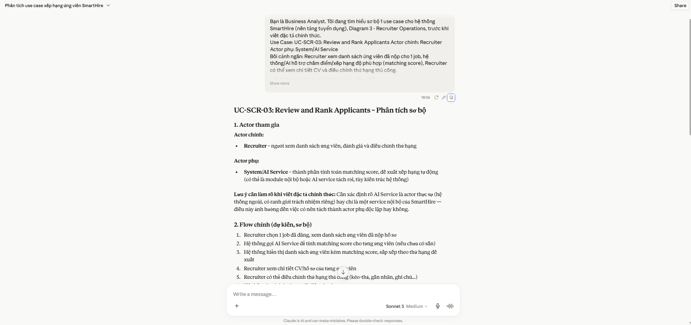

**Use Case 6:**
- **Tool name, version, and platform:** Claude (Anthropic), Claude Sonnet 5, Web Platform (claude.ai)
- **Access time (date and hour):** 23/07/2026
- **Prompts used:** "Bạn là Business Analyst. Tôi đang tìm hiểu sơ bộ 1 use case cho hệ thống SmartHire (nền tảng tuyển dụng), Diagram 3 - Recruiter Operations, trước khi viết đặc tả chính thức. Use Case: UC-PIPE-01: View Recruitment Pipeline Kanban Board... (kèm actor chính Recruiter, bối cảnh xem ứng viên dưới dạng bảng Kanban theo stage tuyển dụng)"
- **Purpose of use:** To do a preliminary exploration of UC-PIPE-01 (View Recruitment Pipeline Kanban Board) — actors, the Kanban rendering flow, exception scenarios, and its relationship with the other two Pipeline use cases (UC-PIPE-02, UC-PIPE-03) and UC-SCR-03.
- **Which content was generated by AI:** The actor analysis (Recruiter as primary; System and a possible Hiring Manager as secondary), the draft flow for retrieving and grouping candidates by stage, a list of exception scenarios (empty board, closed job access, large candidate volume, real-time sync issues), and a relationship table proposing that UC-PIPE-01 is a standalone "view/query" use case that UC-PIPE-02/03 likely extend rather than include.
- **Which content was done independently and how the student edited or validated it:** I provided the exact Kanban board scope and stage list from the project's actual pipeline design. I reviewed the AI's reasoning that UC-PIPE-01 should remain a self-contained view use case and validated this against how the team's interactive prototype was actually structured before finalizing the relationship.
- **Screenshots or chat history:**
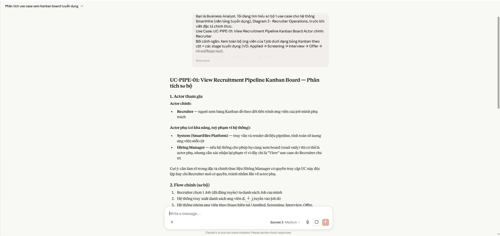

**Use Case 7:**
- **Tool name, version, and platform:** Claude (Anthropic), Claude Sonnet 5, Web Platform (claude.ai)
- **Access time (date and hour):** 23/07/2026
- **Prompts used:** "Bạn là Business Analyst. Tôi đang tìm hiểu sơ bộ 1 use case cho hệ thống SmartHire (nền tảng tuyển dụng), Diagram 3 - Recruiter Operations, trước khi viết đặc tả chính thức. Use Case: UC-PIPE-02: Update Candidate Recruitment Stage... (kèm actor chính Recruiter, bối cảnh kéo-thả hoặc chọn dropdown để chuyển ứng viên sang stage kế tiếp hoặc reject)"
- **Purpose of use:** To do a preliminary exploration of UC-PIPE-02 (Update Candidate Recruitment Stage) — actors, the drag-and-drop/dropdown stage-transition flow, exception scenarios (rejection reason, race conditions, invalid transitions), and its relationship with UC-PIPE-01 and UC-PIPE-03.
- **Which content was generated by AI:** The actor analysis (Recruiter as primary; System, HR Manager, and Candidate as possible secondary actors for logging/notification), the draft drag-and-drop/dropdown flow with validation and history logging, a list of exception scenarios (rejection reason handling, failed drag, race conditions, precondition checks, undo), and a relationship table evaluating each of the 8 related use cases.
- **Which content was done independently and how the student edited or validated it:** I defined the exact stage-transition mechanics (drag-and-drop or dropdown) and actor scope based on the real prototype behavior. I reviewed the AI's flagged open questions — particularly whether "Reject Candidate" should be a separate use case or an alternate flow, and whether notification is mandatory (include) or conditional (extend) — and resolved them according to the team's actual design before finalizing the specification.
- **Screenshots or chat history:**
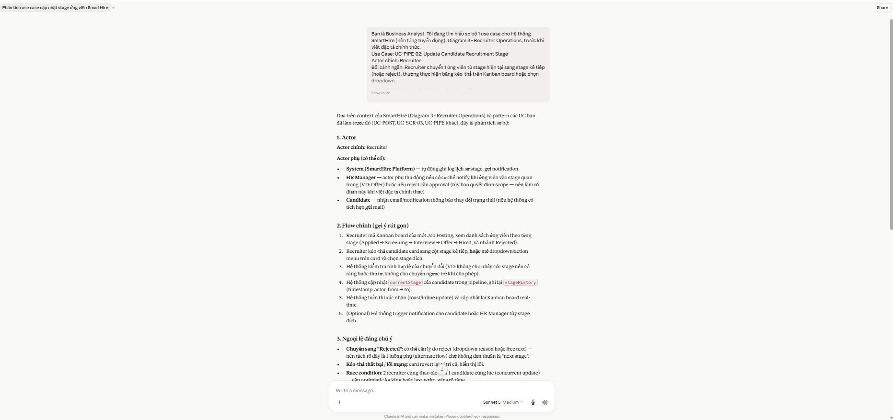

**Use Case 8:**
- **Tool name, version, and platform:** Claude (Anthropic), Claude Sonnet 5, Web Platform (claude.ai)
- **Access time (date and hour):** 23/07/2026
- **Prompts used:** "Bạn là Business Analyst. Tôi đang tìm hiểu sơ bộ 1 use case cho hệ thống SmartHire (nền tảng tuyển dụng), Diagram 3 - Recruiter Operations, trước khi viết đặc tả chính thức. Use Case: UC-PIPE-03: View Application Stage History... (kèm actor chính Recruiter, bối cảnh xem lại lịch sử chuyển stage của 1 ứng viên: ai đổi, thời gian, ghi chú)"
- **Purpose of use:** To do a preliminary exploration of UC-PIPE-03 (View Application Stage History) — actors, the read-only history-viewing flow, exception scenarios (empty history, deleted accounts, private notes), and its relationship with UC-PIPE-02 as a likely extend point.
- **Which content was generated by AI:** The actor analysis (Recruiter as primary; HR Manager/Company Owner as possible secondary viewers; System as a read-only data source), the draft flow for retrieving and displaying chronological stage-change records, a list of exception scenarios (no history yet, archived candidates, private notes, large history volume, deleted accounts), and a relationship table concluding that UC-PIPE-03 most likely extends UC-PIPE-02.
- **Which content was done independently and how the student edited or validated it:** I supplied the exact history data fields (old/new stage, actor, timestamp, notes) required by the project. I reviewed the AI's proposed extend relationship with UC-PIPE-02 and its list of open questions (permission scope, pagination) and used them to finalize the access-control and pagination rules actually implemented in the prototype.
- **Screenshots or chat history:**
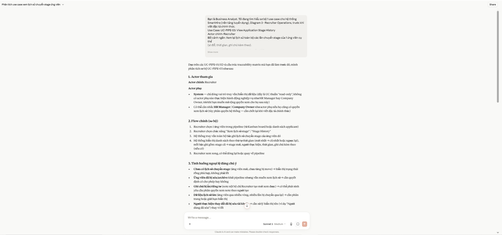

---

**Use Case 9:**
- **Tool name, version, and platform:** Claude (Anthropic), Claude Sonnet 5, Web Platform (claude.ai)
- **Access time (date and hour):** 24/07/2026 - 00:40 a.m
- **Prompts used:** "Bạn là một chuyên gia phân tích thiết kế hệ thống (System Analyst). Hãy vẽ một Use Case Diagram theo chuẩn UML dựa trên thông tin sau: Diagram 3 - Recruiter Operations, actor Recruiter, danh sách use case UC-POST-01 đến UC-PIPE-03... (kèm yêu cầu xác định actor, thể hiện quan hệ include/extend, bảng mô tả Actor-Use Case-Mô tả, output PlantUML)"
- **Purpose of use:** To generate the UML Use Case Diagram (in PlantUML syntax) for Diagram 3 - Recruiter Operations, including actor identification and include/extend relationships between the 8 use cases.
- **Which content was generated by AI:** The full PlantUML diagram code, the identified actor(s), the include/extend relationship arrows between use cases, and the accompanying Actor-Use Case-Description table.
- **Which content was done independently and how the student edited or validated it:** I provided the diagram name and full use case list from the project's actual requirements, drawing on the relationships clarified in the preliminary exploration (Use Cases 1–8). I reviewed the AI-suggested include/extend relationships and actor assignments against the real system logic, and corrected any relationship that did not match the team's intended design before including it in the report.
- **Screenshots or chat history:**
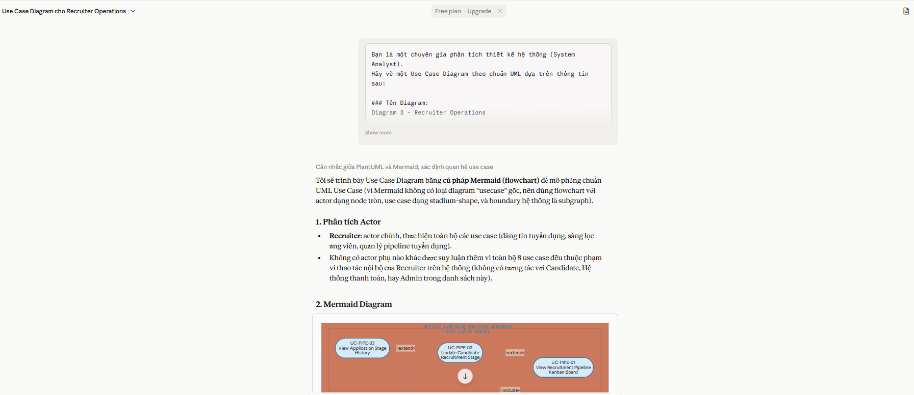

**Use Case 10:**
- **Tool name, version, and platform:** Claude (Anthropic), Claude Sonnet 5, Web Platform (claude.ai)
- **Access time (date and hour):** 24/07/2026 -1:00 a.m
- **Prompts used:** "Bạn là một Business Analyst / QA đang lập tài liệu 'Prototype Coverage & Traceability' cho một đồ án Software Engineering... (kèm danh sách domain, danh sách use case với quan hệ extend/include, use case tham chiếu ngoài UC-SCR-01, quy trình đặt tên file ảnh prototype, và cấu trúc file Markdown bắt buộc: Student Information, Principle Note, Legend, Diagram Scope, Use Case Description, Coverage Matrix, Traceability Summary)"
- **Purpose of use:** To draft the "Prototype Coverage & Traceability" Markdown document for Diagram 3, mapping each Basic/Alternative Flow step of the 8 use cases to prototype screen filenames and identifying reusable base screens.
- **Which content was generated by AI:** The document skeleton (all required sections), the Coverage Matrix rows mapping flow steps to prototype filenames, and the Traceability Summary table.
- **Which content was done independently and how the student edited or validated it:** I supplied the exact domain list, use case relationships, and external reference (UC-SCR-01). I checked that every mapped screen filename actually matches a real screen in the interactive prototype, and corrected filenames/reuse notes where they were inconsistent.
- **Screenshots or chat history:**
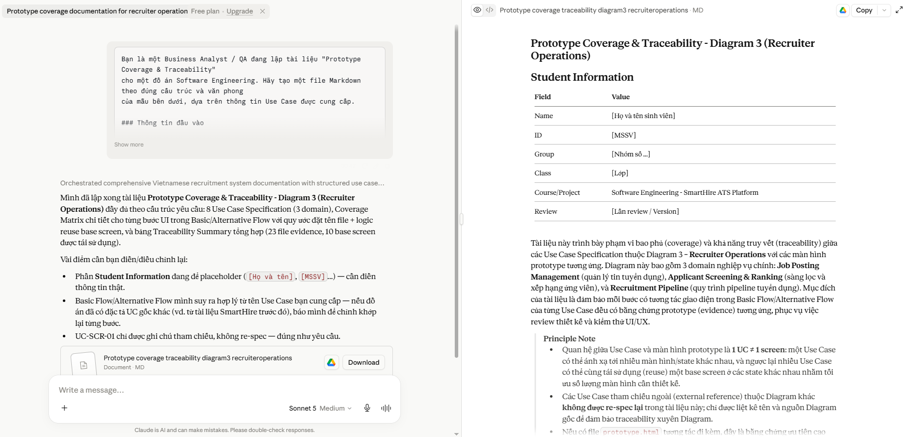

**Use Case 11:**
- **Tool name, version, and platform:** Claude (Anthropic), Claude Sonnet 5, Web Platform (claude.ai)
- **Access time (date and hour):** 24/07/2026 - 01:25 a.m
- **Prompts used:** "Bạn là một Frontend/UX Prototyper. Hãy tạo một file HTML DUY NHẤT (single-file, không dùng framework, chỉ HTML + CSS + Vanilla JS thuần) đóng vai trò là bản INTERACTIVE PROTOTYPE minh họa các Use Case bên dưới... (sản phẩm SmartHire — Recruitment Prototype, Diagram 3 - Recruiter Operations, 3 role, 3 tab: Job Postings, Screening & Ranking, Recruitment Pipeline, kèm mock data cụ thể cho job posting và candidate)"
- **Purpose of use:** To generate a single-file, framework-free interactive HTML prototype demonstrating all 8 use cases in Diagram 3 for demo and traceability purposes.
- **Which content was generated by AI:** The complete HTML/CSS/vanilla JS prototype markup, styling, tab structure, and the mock data (job postings, candidates, stage history).
- **Which content was done independently and how the student edited or validated it:** I specified the exact roles, tabs, use case mapping, and mock data requirements. I manually tested every use case flow in the browser (create/edit job draft, ranking badge colors, pipeline stage updates, stage history) to confirm the prototype behaves as specified before using it as evidence.
- **Screenshots or chat history:**
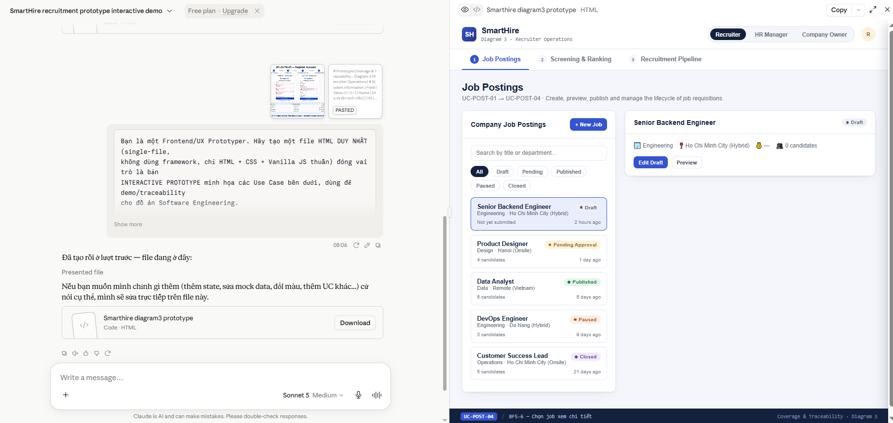

**Use Case 12:**
- **Tool name, version, and platform:** Claude (Anthropic), Claude Sonnet 5, Web Platform (claude.ai)
- **Access time (date and hour):** 24/07/2026 - 02:00 a.m
- **Prompts used:** "Bạn là một Business Analyst đang lập tài liệu 'Use Case Specification' chuẩn cho một đồ án Software Engineering... (kèm actor hierarchy: Company Member > Recruiter/HR Manager/Company Owner, System/AI Service, đầy đủ 8 use case với quan hệ extend/include, use case tham chiếu ngoài UC-SCR-01, đường dẫn prototype)"
- **Purpose of use:** To draft the full Use Case Specification document (Actors, Relationships, Description, Precondition, Basic Flow, Alternative Flow, Postcondition) for all 8 use cases in Diagram 3.
- **Which content was generated by AI:** The complete specification tables and flow descriptions (Basic Flow, Alternative Flow, pre/postconditions) for each of the 8 use cases.
- **Which content was done independently and how the student edited or validated it:** I provided the actor hierarchy and exact use case relationships. I cross-checked each flow description against the actual system requirements and the interactive prototype (Use Case 11), and rewrote steps that did not match the intended behavior.
- **Screenshots or chat history:**
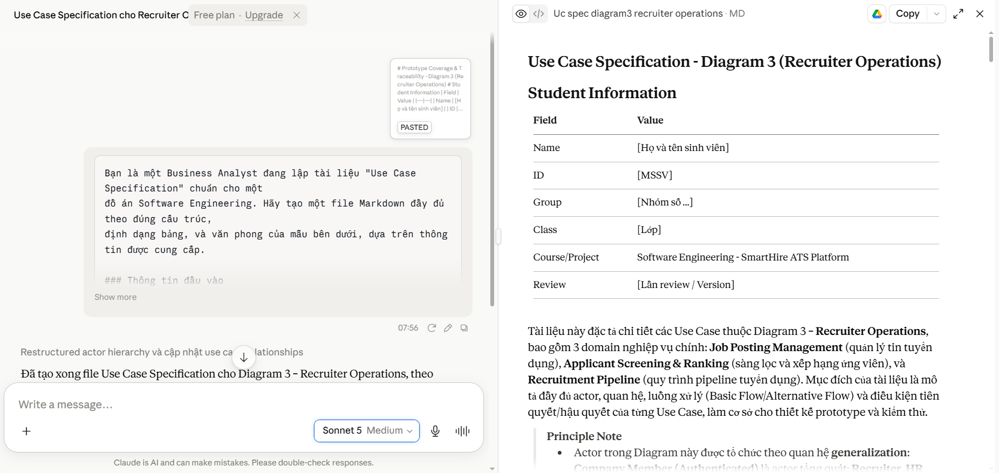

---

# Reflection

Across this workflow, AI assistance was used in two distinct stages. In the first stage (Use Cases 1–8), Claude was used as a preliminary analysis partner: for each of the 8 use cases in Diagram 3, I asked focused questions about actors, main flow, exceptions, and include/extend relationships, one use case at a time. This step-by-step approach was intentional — by exploring each use case individually before drawing the full diagram, I was able to catch and correct relationship assumptions early (the AI consistently flagged its own relationship guesses as inferred from use case naming rather than confirmed content, which prompted me to verify each one against the team's actual design instead of accepting it directly).

In the second stage (Use Cases 9–12), the understanding built during the preliminary exploration was used as direct input to generate the formal deliverables: the UML diagram, the traceability document, the interactive prototype, and the full Use Case Specification. Because the relationships and edge cases had already been clarified in the first stage, this second stage required comparatively less back-and-forth correction, though every generated artifact was still cross-checked against the team's actual requirements and, where relevant, tested directly in the working prototype before being accepted into the final report.

Overall, AI tools accelerated the drafting of structured documentation (tables, PlantUML syntax, boilerplate Markdown sections, HTML/CSS/JS scaffolding) but did not replace the analytical judgment required to define correct actors, business rules, and use case relationships — all AI-generated relationship claims and flow details were independently validated against the project's real requirements before being finalized.