# AI Usage Report for PA3

**Student Name:** Nguyễn Gia Quốc Uy  
**Student ID:** 24127261  
**Group:** 09  
**Class:** 24C11  
**Course/Project:** Software Engineering — SmartHire  
**Reporting period:** 12/07/2026–25/07/2026  

---

## AI Usage Notes

I used Vietnamese for most prompts because it allowed me to ask detailed follow-up questions and verify my understanding quickly. The PA3 deliverables generated from these discussions were written in English.

The AI was used as a planning, explanation, drafting, review, and prototyping assistant. It did not make final project decisions independently. I reviewed the responses against the PA3 assignment, the team's approved SmartHire scope, the repository, the use-case catalog, and feedback from team members. Where the AI proposed alternatives, I selected or revised them before they were used in project documents.

The access dates below are based on the PA3 working period and Codex task history. Exact hours were not recorded manually for every interaction and should be completed from the corresponding screenshot metadata if required by the course.

---

## Use Case 1 — Understanding PA3 and Planning the Two-Week Work Period

- **Tool name, version, and platform:** OpenAI Codex, GPT-5 family, Codex desktop application
- **Access time (date and hour):** 12/07/2026; 11:59PM
- **Prompts used:** “File PA3 cho từ ngày 13 đến ngày 26 tháng 7 sắp tới của nhóm 9 chúng tôi, hãy giải thích chi tiết từng công việc mà nhóm tôi phải làm, đồng thời phân chia cụ thể các task, subtask kèm theo giai đoạn cụ thể, thời gian thực hiện cụ thể trong suốt 2 tuần này giúp tôi.”
- **Purpose of use:** Understand the complete PA3 requirements and prepare an initial two-week execution plan for Group 09.
- **Which content was generated by AI:** The AI summarized the required PA3 sections, including the revised Project Plan, revised Vision Document, Mermaid use-case diagrams, detailed use-case specifications, prototype evidence, one Spec-Kit implementation, weekly reports, AI usage reports, Git evidence, PDF conversion, and final ZIP structure. It also proposed phases, milestones, task dependencies, and review deadlines.
- **Which content was done independently and how the student edited or validated it:** I compared the summary with the original PA3 PDF and used it as a checklist rather than treating it as the official assignment. I confirmed the team membership, available time, individual strengths, actual progress, and final deadlines. I later adjusted the allocations during group discussions and retained responsibility for final integration and document consistency.
- **Screenshots or chat history:**

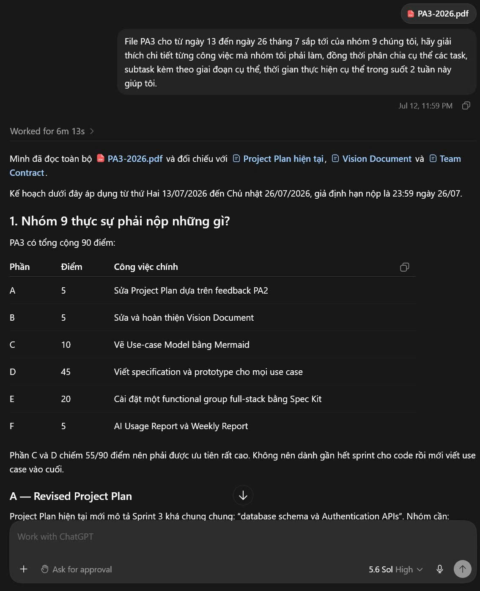

---

## Use Case 2 — Understanding Traceability and Drafting Functional Requirements

- **Tool name, version, and platform:** OpenAI Codex, GPT-5 family, Codex desktop application
- **Access time (date and hour):** 12/07/2026; 12:15AM
- **Prompts used:** “traceability matrix là gì?” and “Vậy giúp tôi viết ra đây danh sách functional requirements và traceability matrix, đầy đủ cụ thể nhất.”
- **Purpose of use:** Learn how a Requirements Traceability Matrix works and create a first structured mapping between SmartHire requirements and project artifacts.
- **Which content was generated by AI:** The AI explained traceability in simple terms and proposed functional-requirement identifiers, descriptions, actors, related use cases, priorities, specifications, prototypes, tests, and implementation evidence. It also explained how the matrix could reveal missing or duplicated coverage.
- **Which content was done independently and how the student edited or validated it:** I treated the generated list as a draft. I compared it with the team's previously approved SmartHire feature groups and removed or renamed items that did not match the agreed scope. I maintained consistent use-case identifiers and ensured that the final matrix referred to actual repository artifacts instead of hypothetical files.
- **Screenshots or chat history:**

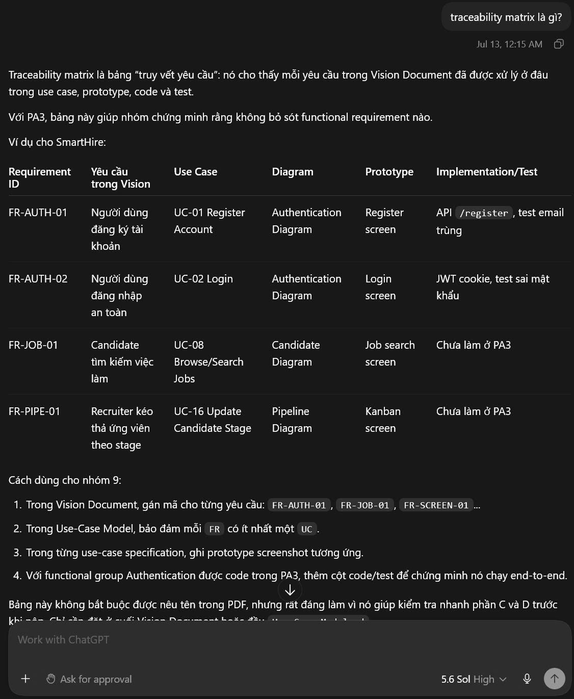

---

## Use Case 3 — Clarifying PA3 Sections C and D

- **Tool name, version, and platform:** OpenAI Codex, GPT-5 family, Codex desktop application
- **Access time (date and hour):** 13/07/2026; 12:32AM
- **Prompts used:** “Dựa trên những gì bạn đã tạo và file PA3, hãy chỉ dẫn tôi những việc cần làm với phần C và D.”
- **Purpose of use:** Clarify the expected difference between the use-case model in Section C and the textual use-case specifications with prototypes in Section D.
- **Which content was generated by AI:** The AI explained that Section C should provide Mermaid use-case diagrams covering all functional requirements, while Section D should provide a complete specification for every use case, including actors, description, preconditions, Basic Flow, Alternative Flows, postconditions, special requirements, extension points, and prototype screenshots. It proposed naming, review, and traceability conventions.
- **Which content was done independently and how the student edited or validated it:** I verified these instructions against PA3 and the provided use-case specification template. I decided to organize the project into five diagrams and required each diagram owner to maintain matching IDs across diagrams, specifications, prototype coverage, and the traceability matrix.
- **Screenshots or chat history:**

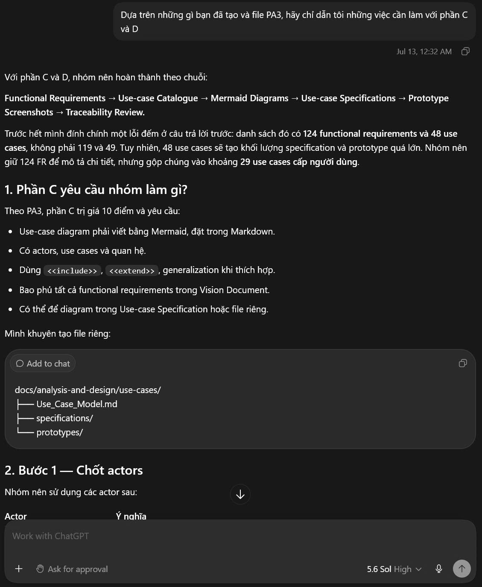

---

## Use Case 4 — Evaluating Parallel Work and Team Responsibility Allocation

- **Tool name, version, and platform:** OpenAI Codex, GPT-5 family, Codex desktop application
- **Access time (date and hour):** 16–19/07/2026; 10:26AM
- **Prompts used:** “Các phần trong PA3 có bắt buộc phải thực hiện tuần tự không?” and a follow-up describing the proposed assignment of DGM-01–05, prototype drafts, final UI integration, and Spec-Kit implementation.
- **Purpose of use:** Determine which PA3 activities could run in parallel and evaluate whether the initial workload distribution was realistic.
- **Which content was generated by AI:** The AI explained that diagram modeling, use-case specifications, prototype briefs, and implementation could proceed in parallel after the use-case catalog and critical business rules were stabilized. It identified that assigning 21 use cases plus integration work to one person was risky and suggested a more balanced distribution and rolling review process.
- **Which content was done independently and how the student edited or validated it:** I used this analysis as a workload-risk review. The final allocation remained a team decision based on each member's ability and current progress. I retained final responsibility for DGM-01, DGM-02, document integration, and UI consistency while delegating other diagrams and implementation work to the assigned members.
- **Screenshots or chat history:**

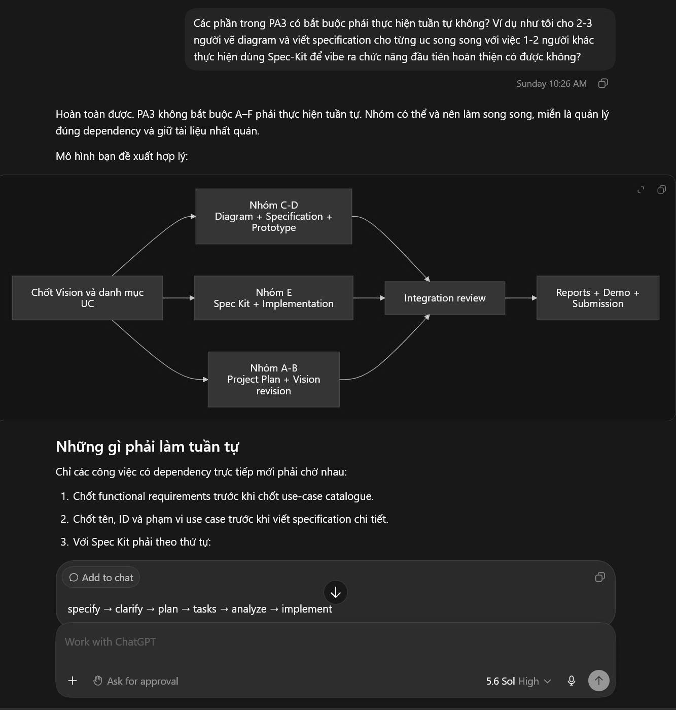

---

## Use Case 5 — Developing the Prototype Strategy

- **Tool name, version, and platform:** OpenAI Codex, GPT-5 family, Codex desktop application and OpenAI image generation
- **Access time (date and hour):** 16–19/07/2026; 10:40AM
- **Prompts used:** Questions including “Prototype trong mỗi diagram nên được làm như thế nào?”, “Nhưng thời lượng ngắn ngủi này làm sao có thể vẽ được UI hoàn thiện cho từng UC được?”, “Tạo thử ví dụ cho tôi được không?”, and “Thế mọi người phải tạo ra tổng cộng 48 cái prototype tương ứng với 48 UC à?”
- **Purpose of use:** Find a feasible prototype approach that satisfied PA3 without producing 48 unrelated screen designs.
- **Which content was generated by AI:** The AI explained the difference between a use case, a unique screen, and a reusable screen state. It proposed canonical screen families, shared loading/error/access states, grouped Alternative Flow states, prototype coverage tables, and per-domain flow maps. It also generated example registration prototype boards to demonstrate one base form with validation, duplicate-email, and verification-pending states.
- **Which content was done independently and how the student edited or validated it:** I decided that domain owners would prepare prototype drafts and required UI content, while I would consolidate the final visual system. I reviewed the generated examples, selected the useful structure, maintained consistent SmartHire branding, and ensured that screenshots were mapped to specification flows rather than counted as one unrelated design per use case.
- **Screenshots or chat history:**

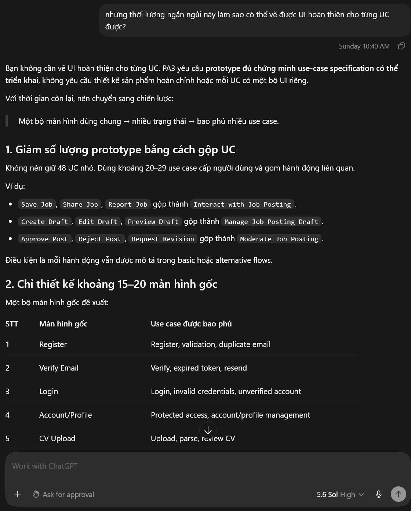

---

## Use Case 6 — Validating the Candidate and Company-Scoped Role Model

- **Tool name, version, and platform:** OpenAI Codex, GPT-5 family, Codex desktop application
- **Access time (date and hour):** 18–19/07/2026; 5:25PM
- **Prompts used:** “Các Use Case đã đảm bảo về phần ban đầu đăng nhập là user bình thường tính năng như candidate rồi sau đó nâng cấp role dựa trên việc nộp các thông tin liên quan đến doanh nghiệp này kia chưa?”
- **Purpose of use:** Validate whether the use-case catalog correctly represented the transition from a standard candidate account to company-scoped recruiter permissions.
- **Which content was generated by AI:** The AI proposed that Candidate should remain a capability of the underlying standard account and that recruiter permissions should be added through an approved company membership instead of replacing the Candidate role. It distinguished platform administration from company roles and proposed Owner, HR Manager, and Recruiter memberships with active company context and resource-ownership checks.
- **Which content was done independently and how the student edited or validated it:** I used the response to clarify the team's intended authorization model and updated use-case descriptions accordingly. I retained the requirement that company verification and membership approval must occur before company-scoped permissions are granted. Final role names and permissions were reviewed against the team's Vision Document and other diagrams.
- **Screenshots or chat history:**

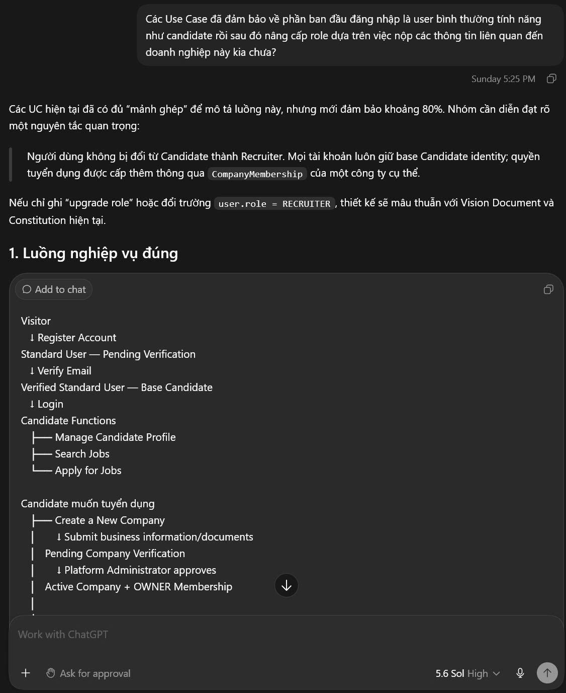

---

## Use Case 7 — Producing the Detailed PA3 Task Schedule

- **Tool name, version, and platform:** OpenAI Codex, GPT-5 family, Codex desktop application
- **Access time (date and hour):** 19/07/2026; 5:34PM
- **Prompts used:** “Hãy phân công cụ thể các task thật chi tiết cho từng thành viên trong nhóm kèm với duration và deadline cụ thể cho đến 00h00 ngày 26/7.”
- **Purpose of use:** Produce an actionable final-week schedule with named responsibilities, durations, integration points, and deadlines.
- **Which content was generated by AI:** The AI proposed detailed tasks for Nguyễn Gia Quốc Uy, Nguyễn Quốc Thành, Ngô Quốc Tuấn, Nguyễn Minh Khôi, and Lưu Chí Hải. It included diagram, specification, prototype, implementation, testing, report, evidence, PDF, video, ZIP, and submission milestones, with a document freeze and final quality-control period before the deadline.
- **Which content was done independently and how the student edited or validated it:** I compared the proposed durations with actual progress and team availability. I communicated assignments through the team's normal coordination process and adjusted dates when artifacts were delivered earlier or later. Jira and Git history, rather than the AI response, remained the authoritative evidence of performed work.
- **Screenshots or chat history:**

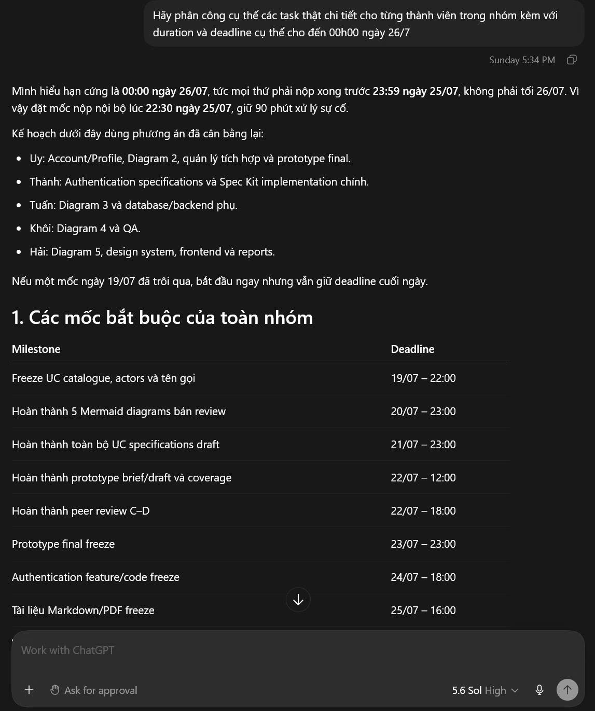

---

## Use Case 8 — Designing the Prototype Coverage and Submission Structure

- **Tool name, version, and platform:** OpenAI Codex, GPT-5 family, Codex desktop application
- **Access time (date and hour):** 19/07/2026; 6:40PM
- **Prompts used:** Questions about the PA3 folder structure, why prototypes should be organized by diagram instead of only by use case, and whether each DGM folder could contain a `Prototype-Coverage.md` file.
- **Purpose of use:** Establish a maintainable file structure and traceable prototype-evidence convention.
- **Which content was generated by AI:** The AI proposed a hybrid structure with one domain folder, shared canonical screens, individual use-case evidence folders, flow maps, and a domain-level Prototype Coverage table. It explained that the domain coverage table should not replace screenshots placed beside the relevant flow in each specification.
- **Which content was done independently and how the student edited or validated it:** I applied the structure to the repository and renamed assets to match the final use-case IDs. I reviewed paths and references so that Markdown and exported PDF versions could locate the screenshots. I chose which states were shared and which required use-case-specific evidence based on the actual prototype content.
- **Screenshots or chat history:**

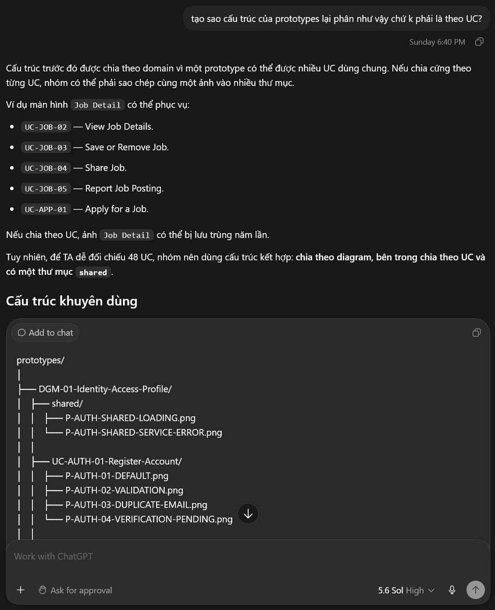

---

## Use Case 9 — Drafting and Revising DGM-01

- **Tool name, version, and platform:** OpenAI Codex, GPT-5 family, Codex desktop application
- **Access time (date and hour):** 20/07/2026; 10:36AM
- **Prompts used:** “Viết mermaid cho tôi về Diagram 1, tuân thủ quy tắc đặt tên cho các actors và có bảng tổng kết sau diagram, viết hoàn chỉnh trên md hết,” followed by requests to revise the diagram to match the preferred visual layout.
- **Purpose of use:** Create the Mermaid source and supporting documentation for DGM-01 — Identity, Access, and Profile.
- **Which content was generated by AI:** The AI drafted Mermaid code for 12 use cases, actor associations, actor specialization, `include` and `extend` relationships, system boundaries, styling, actor summaries, use-case summaries, relationship summaries, coverage tables, modeling notes, and traceability notes.
- **Which content was done independently and how the student edited or validated it:** I provided and finalized the use-case catalog, requested visual revisions, selected the preferred actor names, rendered the diagram, and checked whether the relationships matched the textual specifications. I also reviewed the distinction between Visitor, Authenticated User, Candidate, Email Delivery Service, and CV Parsing Service. AI-proposed UML relationships were not accepted without checking their business meaning.
- **Screenshots or chat history:**

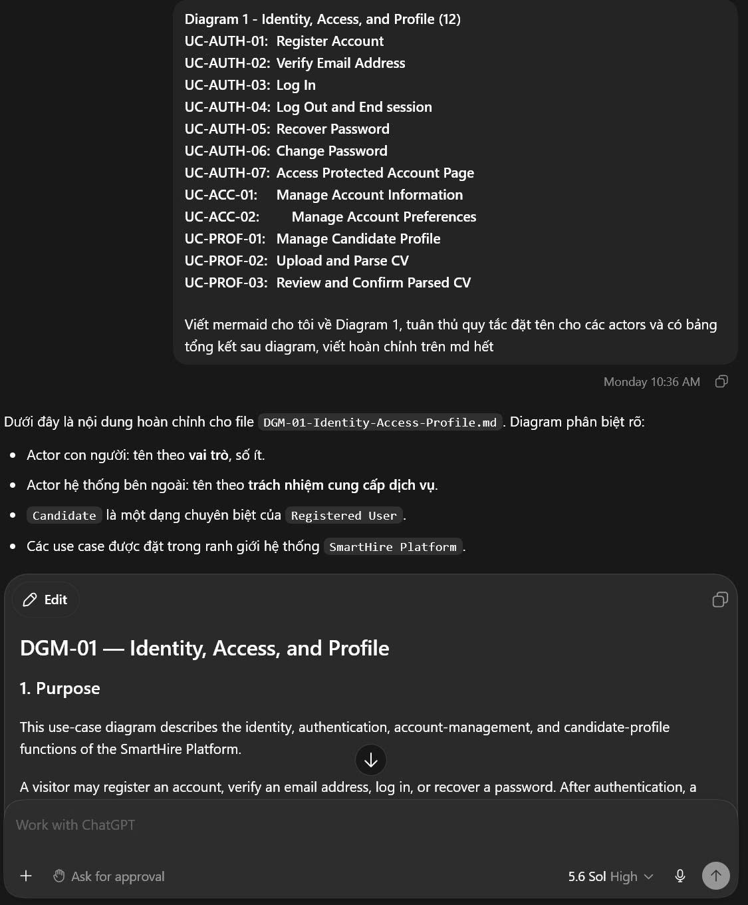

---

## Use Case 10 — Drafting DGM-01 Use-Case Specifications

- **Tool name, version, and platform:** OpenAI Codex, GPT-5 family, Codex desktop application
- **Access time (date and hour):** 20–23/07/2026; 10:46PM
- **Prompts used:** The official use-case specification template followed by “Đề xuất cho tôi một bản specification về Diagram 1 đã tạo bên trên.”
- **Purpose of use:** Produce a comprehensive first draft for all 12 DGM-01 use-case specifications.
- **Which content was generated by AI:** The AI drafted use-case information, descriptions, triggers, Preconditions, Basic Flows, Alternative and Exception Flows, Postconditions, Special Requirements, Extension Points, and Prototype Coverage for authentication, account management, candidate profile, CV upload, parsing, review, and confirmation.
- **Which content was done independently and how the student edited or validated it:** I checked the generated flows against the team's actual business rules, prototype states, authentication specification, and Mermaid diagram. I corrected naming and relationship inconsistencies, aligned password and abuse-control policies, and reviewed whether each user-visible alternative had prototype evidence. The final repository document was edited and maintained by me rather than being submitted as an unchecked chat response.
- **Screenshots or chat history:**

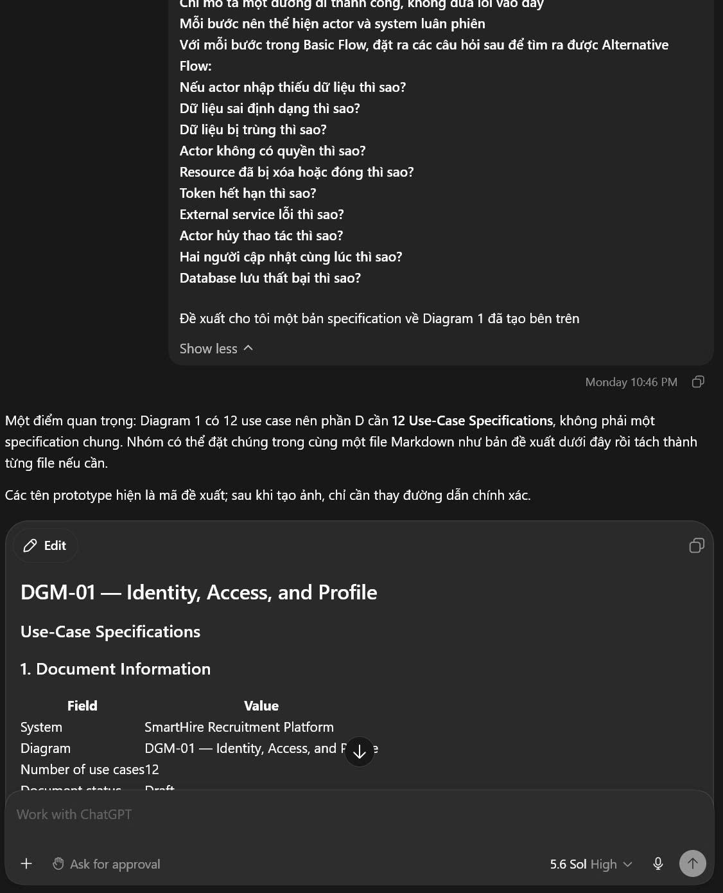

---

## Use Case 11 — Reviewing the Figma Prototype System

- **Tool name, version, and platform:** OpenAI Codex, GPT-5 family, Codex desktop application with Figma inspection integration
- **Access time (date and hour):** 23/07/2026; 3:20PM
- **Prompts used:** The SmartHire Figma link followed by “Tôi nên làm gì với những prototype này?” and a follow-up asking which images should be stored in each DGM-01 use-case folder.
- **Purpose of use:** Review the completed prototype organization and decide how to export and map the frames into PA3 documentation.
- **Which content was generated by AI:** The AI inspected the live Figma file and identified the Authentication, Account Settings, Candidate Profile and CV, Shared Screens, and Flow Map sections. It reported no blocking layout issues in the inspected root frames and proposed canonical screen-family names, export conventions, grouped state images, per-use-case evidence filenames, and coverage mappings.
- **Which content was done independently and how the student edited or validated it:** I created, curated, and organized the final SmartHire Figma content, reviewed the proposed export list, and decided which frames would be used in the submission. I remained responsible for exporting images, checking readability, placing them beside the correct specification flows, and reconciling the password-policy mismatch identified during the review.
- **Screenshots or chat history:**

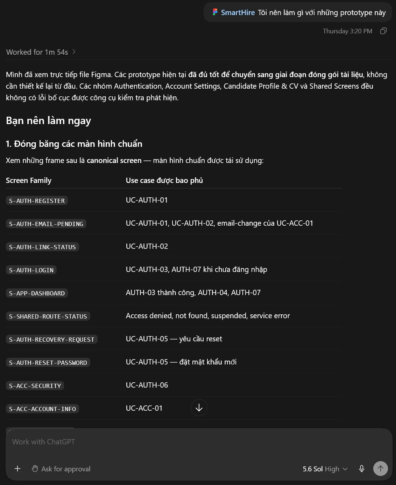

---

## Summary of AI Contributions

| Area | AI contribution | Student responsibility and validation |
|---|---|---|
| PA3 interpretation | Summarized requirements and deliverables | Compared with the official PA3 PDF and corrected scope |
| Planning | Proposed schedules, dependencies, and allocations | Confirmed work with members and maintained Jira/Git evidence |
| Requirements | Explained traceability and drafted mappings | Finalized IDs, scope, priorities, and artifact references |
| Use-case modeling | Drafted Mermaid code and relationship tables | Finalized actors, use cases, semantics, and rendered output |
| Specifications | Drafted Basic, Alternative, and Exception Flows | Checked business rules, consistency, feasibility, and coverage |
| Prototypes | Proposed reusable families and example states | Curated final UI, Figma organization, exports, and evidence placement |
| Spec-Kit | Explained workflow and reviewed authentication scope | Selected technology decisions and implemented/tested through the team |
| Quality review | Identified inconsistencies and missing evidence | Applied accepted corrections and rejected unsuitable suggestions |

## Validation and Limitations

1. AI responses can contain incorrect assumptions or UML relationship directions. All `include`, `extend`, actor-generalization, and cross-diagram relationships were reviewed before use.

2. AI-generated security thresholds were treated as explicit project assumptions, not authoritative security standards. The chosen values had to remain consistent across the specification, implementation, tests, and prototype messages.

3. AI-generated prototype suggestions did not replace manual review of usability, terminology, consistency, and traceability.

4. AI-generated text was edited to match the team's approved SmartHire terminology and actual repository structure.

5. Git commits, Jira records, meeting reports, implementation tests, and exported documents remain the authoritative evidence of team work.