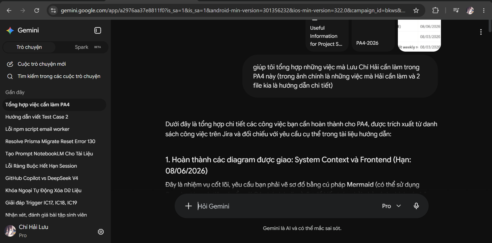
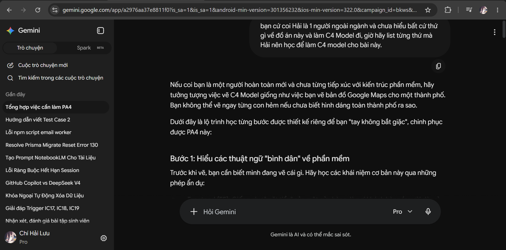
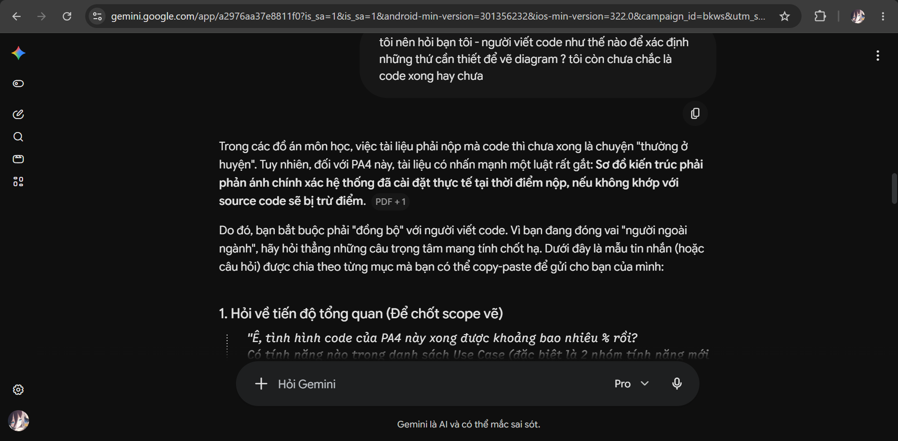
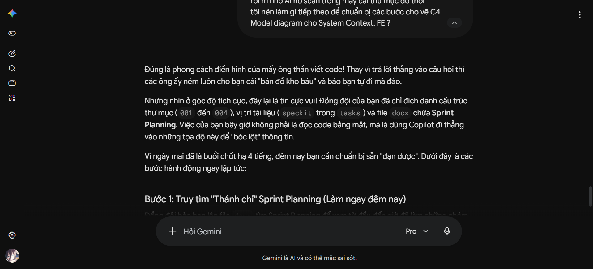
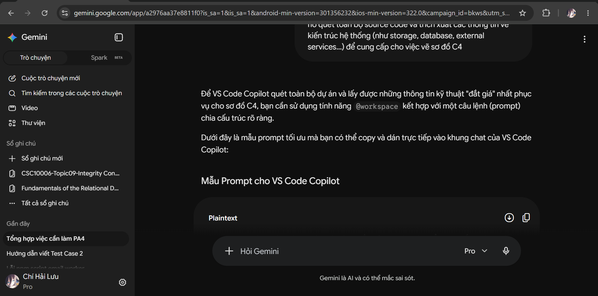
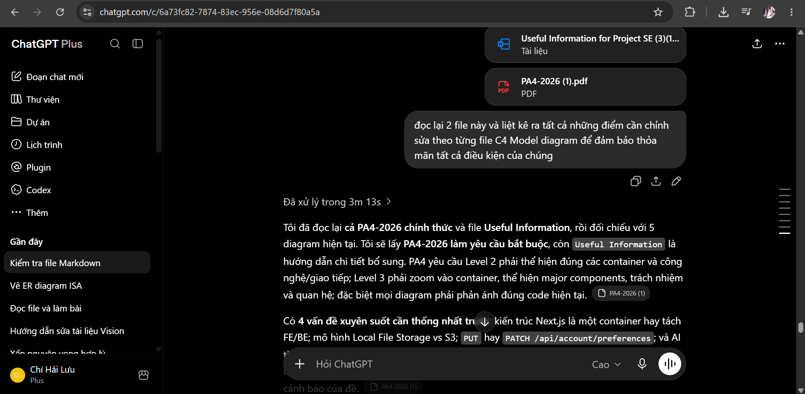
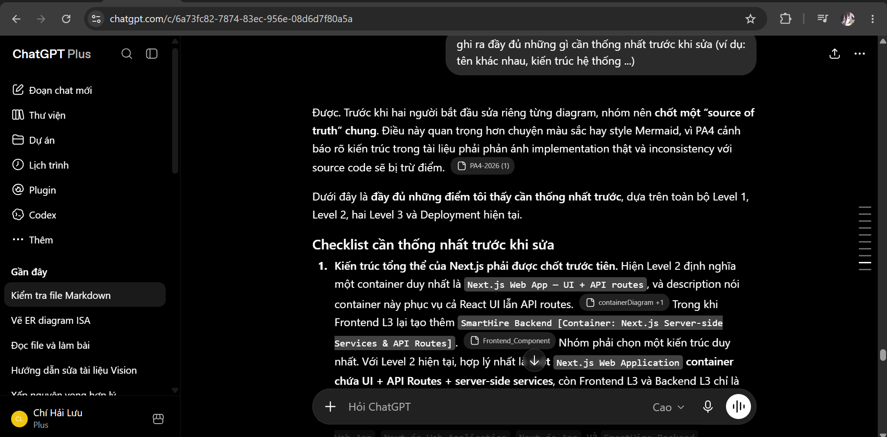
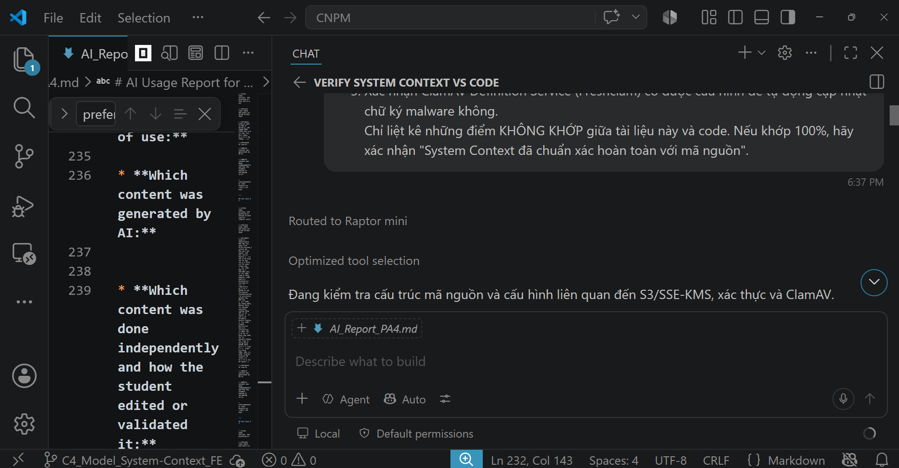

# AI Usage Report for PA4

*Performed by: Lưu Chí Hải | Reviewed by: Nguyễn Gia Quốc Uy | Edited by: Lưu Chí Hải*

**Student Name:** Lưu Chí Hải
**Student ID:** 24127030
**Group:** 09
**Class:** 24C11
**Course/Project:** Software Engineering — SmartHire
**Reporting period:** 25/07/2026 - 08/08/2026

---

## AI Usage Notes

* I used Vietnamese for most prompts because it allowed me to ask detailed follow-up questions and verify my understanding quickly. The PA4 deliverables generated from these discussions were written in English.

* The AI was used as a planning, explanation, drafting, review, and prototyping assistant. It was used strictly as a support tool, not as a full replacement for human learning and research. I reviewed the responses against the PA4 assignment, the team's approved SmartHire scope, the repository, and feedback from team members.

---

## Use Case 1 — Task analysis and extraction

* **Tool name, version, and platform:** Gemini 3.1 Pro

* **Access time (date and hour):** 20:00 30/07/2026

* **Prompts used:** *giúp tôi tổng hợp những việc mà Lưu Chí Hải cần làm trong PA4 này (trong ảnh chính là những việc mà Hải cần làm và 2 file kia là hướng dẫn chi tiết)*

* **Purpose of use:** To synthesize and extract specific assigned tasks for the PA4 milestone from provided images and instruction documents.
* **Which content was generated by AI:** A categorized, bulleted to-do list outlining the exact responsibilities and deliverables required for my role in the PA4 C4 model assignment.
* **Which content was done independently and how the student edited or validated it:** I gathered and provided the source images and assignment files. I verified the generated list against the actual PA4 requirements and cross-checked it with the team's internal task delegation to ensure no requirements were missed.
* **Screenshots or chat history:** 

---

## Use Case 2 — Building a C4 Model learning roadmap

* **Tool name, version, and platform:** Gemini 3.1 Pro

* **Access time (date and hour):** 19:00 31/07/2026

* **Prompts used:** *bạn cứ coi Hải là 1 người ngoài ngành và chưa hiểu bất cứ thứ gì về đồ án này và làm C4 Model đi, giờ hãy list từng thứ mà Hải nên học để làm C4 model cho bài này.*

* **Purpose of use:** To generate a customized, beginner-friendly learning roadmap to quickly understand C4 modeling concepts and apply them to the project.
* **Which content was generated by AI:** A step-by-step study guide breaking down C4 abstractions (Context, Container, Component), basic Mermaid.js syntax, and foundational Next.js architecture concepts.
* **Which content was done independently and how the student edited or validated it:** I assessed my own knowledge gaps and requested the learning path. I independently studied the suggested concepts, read external C4 documentation, and practiced Mermaid syntax before applying it to the actual project diagrams.
* **Screenshots or chat history:** 

---

## Use Case 3 — Drafting communication questions for the Developer

* **Tool name, version, and platform:** Gemini 3.1 Pro

* **Access time (date and hour):** 14:00 03/08/2026

* **Prompts used:** *tôi nên hỏi bạn tôi - người viết code như thế nào để xác định những thứ cần thiết để vẽ diagram ? tôi còn chưa chắc là code xong hay chưa*

* **Purpose of use:** To draft clear, technically accurate questions to ask the backend developer in order to gather precise system architecture details for the diagrams.
* **Which content was generated by AI:** Drafted communication templates targeting specific architectural components (storage solutions, external APIs, authentication mechanisms) necessary for building accurate C4 Level 1 and 2 diagrams.
* **Which content was done independently and how the student edited or validated it:** I identified the critical need for architectural synchronization with the dev team. I adapted the AI-generated questions to match our team's communication style and sent them to my teammates via our chat channel.
* **Screenshots or chat history:** 

---

## Use Case 4 — Planning architectural data extraction

* **Tool name, version, and platform:** Gemini 3.1 Pro

* **Access time (date and hour):** 20:00 05/08/2026

* **Prompts used:** *tôi từng có hỏi "Ông chốt cho tôi tiến độ code để tôi cắm Copilot vào quét vẽ C4 Model nhé. Cho tôi xin list các Component FE chính đã code xong. Với lại phần kết nối bên ngoài (Email, Storage, AI) là mình đang xài API của những bên nào vậy? Tính năng nào trong Use Case mà tạch thì báo liền để tôi xóa khỏi bản vẽ, luật PA4 là vẽ ảo không khớp code bị trừ điểm đó." Và dưới đây là tất cả những câu trả lời trong đoạn chat mà tôi nhận được từ 2 người gửi... tôi nên làm gì tiếp theo để chuẩn bị các bước cho vẽ C4 Model diagram cho System Context, FE ?*

* **Purpose of use:** To determine the next actionable steps for diagramming after receiving generalized feedback from teammates regarding the source code and documentation structure.
* **Which content was generated by AI:** Strategic advice on how to map the project's specification documents (sprint planning docs) to the specific codebase directories (001 to 004) to extract evidence-based architectural data.
* **Which content was done independently and how the student edited or validated it:** I facilitated the communication with the development team and gathered their responses. I manually cross-referenced the provided specification documents with the repository's directory structure to locate the implemented features before proceeding.
* **Screenshots or chat history:** 

---

## Use Case 5 — Designing source code scanning prompt for Copilot

* **Tool name, version, and platform:** Gemini 3.1 Pro

* **Access time (date and hour):** 19:00 06/08/2026

* **Prompts used:** *Hãy hướng dẫn tôi cách tạo prompt cho VS Code Copilot để nó quét toàn bộ source code và trích xuất các thông tin về kiến trúc hệ thống (như storage, database, external services...) để cung cấp cho việc vẽ sơ đồ C4*

* **Purpose of use:** To engineer an advanced `@workspace` prompt for VS Code Copilot to accurately extract architectural implementation details directly from the codebase.
* **Which content was generated by AI:** A structured prompt template optimized for Copilot, instructing it to scan for core frameworks, databases, external systems, and authentication mechanisms, while requiring code file citations.
* **Which content was done independently and how the student edited or validated it:** I recognized the necessity of AI-assisted code scanning to ensure diagram accuracy. I took the generated prompt, executed it locally in my VS Code environment, and analyzed Copilot's raw output.
* **Screenshots or chat history:** 

---

## Use Case 6 — Evaluating and reviewing C4 diagrams

* **Tool name, version, and platform:** Chat GPT-5.6 Sol

* **Access time (date and hour):** 15:00 07/08/2026

* **Prompts used:** *đọc lại 2 file này và liệt kê ra tất cả những điểm cần chỉnh sửa theo từng file C4 Model diagram để đảm bảo thỏa mãn tất cả điều kiện của chúng*

* **Purpose of use:** To perform a peer-review of the drafted C4 Model markdown files, identifying structural inconsistencies or errors against C4 standards.
* **Which content was generated by AI:** A comprehensive list of structural and architectural corrections needed for the C4 diagrams, pointing out boundary issues and actor definitions that did not align with the codebase.
* **Which content was done independently and how the student edited or validated it:** I drafted the initial C4 diagrams independently. I evaluated the AI's review notes and cross-checked them against the developer's reference file to ensure the corrections were valid before applying them.
* **Screenshots or chat history:** 

---

## Use Case 7 — Compiling the alignment checklist for the team

* **Tool name, version, and platform:** Chat GPT-5.6 Sol

* **Access time (date and hour):** 16:20 07/08/2026

* **Prompts used:** *ghi ra đầy đủ những gì cần thống nhất trước khi sửa (ví dụ: tên khác nhau, kiến trúc hệ thống ...)*

* **Purpose of use:** To create a concise checklist of architectural decisions and naming conventions that required alignment with the development team before finalizing the diagrams.
* **Which content was generated by AI:** A consolidated list of discrepancies (e.g., S3 storage vs Local filesystem, JWT vs Opaque sessions) derived from the draft diagrams that required team consensus.
* **Which content was done independently and how the student edited or validated it:** I utilized this checklist to facilitate a final discussion with the lead developer. I manually confirmed crucial details, such as verifying that AWS S3 was implemented only as an adapter and not provisioned, ensuring the diagram adhered to the "evidence-only" rule.
* **Screenshots or chat history:** 

---

## Use Case 8 — Automated verification of System Context against Source Code

* **Tool name, version, and platform:** VSCode Github Copilot (Raptor mini)

* **Access time (date and hour):** 18:00 07/08/2026

* **Prompts used:** *@workspace Hãy đọc nội dung file #file:System_Context.md. Hãy quét mã nguồn, thư mục infra/deploy và các cấu hình hiện tại để đối chiếu 3 điểm cực kỳ quan trọng sau: 1. Xác nhận AWS S3 và SSE-KMS... 2. Xác nhận hệ thống dùng Better Auth... 3. Xác nhận ClamAV Definition Service...*

* **Purpose of use:** To perform a strict, final verification of the `System_Context.md` diagram against the actual codebase using Copilot's deep workspace scanning capability.
* **Which content was generated by AI:** Copilot scanned the code and provided a verification report confirming that the exact implementation details (Better Auth opaque sessions, S3 adapter presence without infrastructure, Freshclam config) perfectly matched the assertions in the markdown file.
* **Which content was done independently and how the student edited or validated it:** I executed the prompt in my local IDE. I reviewed Copilot's findings, ensured no hallucinated AWS infrastructure was present in its report, and validated that the diagram was a 100% match with the source code.
* **Screenshots or chat history:** 

---

## Use Case 9 — Automated verification of Frontend Component against Source Code

* **Tool name, version, and platform:** VSCode Github Copilot (Raptor mini)

* **Access time (date and hour):** 18:10 07/08/2026

* **Prompts used:** *@workspace Hãy đọc nội dung file #file:Frontend_Component.md. Hãy rà soát thư mục web/src/frontend/ và web/src/app/api/ để xác minh: 1. Endpoint preferences thực sự được định nghĩa là PUT... hay PATCH? 2. Trong Frontend, component Job Discovery UI có thực sự gọi JobDiscoveryService.search(...) ở server-side...*

* **Purpose of use:** To verify the accuracy of API endpoints, HTTP methods, and server-side service calls documented in the `Frontend_Component.md` file against the actual Next.js routing implementation.
* **Which content was generated by AI:** Copilot scanned the routing and frontend directories, verifying the Server Component behaviors and API endpoints.
* **Which content was done independently and how the student edited or validated it:** I executed the scan locally. When Copilot provided a potentially confusing alert regarding the `PATCH` vs `PUT` method, I manually verified my markdown file to confirm I had already correctly documented it as `PUT`. I successfully overrode the AI's contextual confusion and validated the final accuracy of the document.
* **Screenshots or chat history:** 