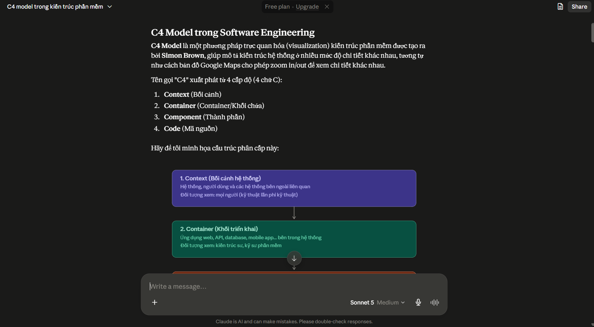
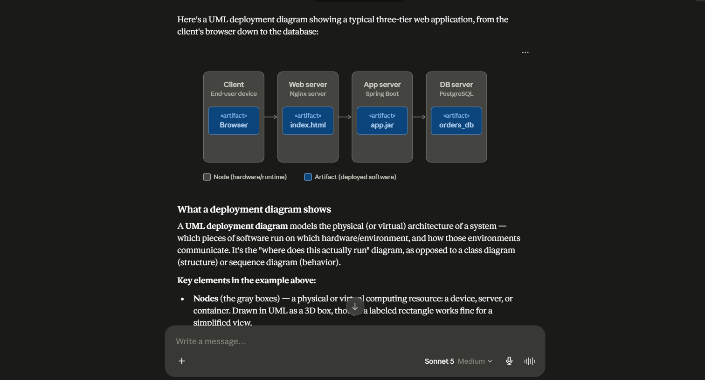
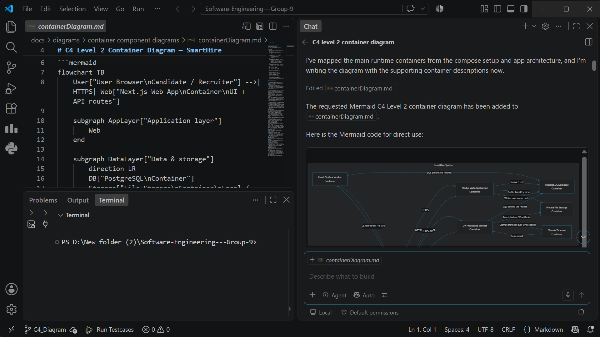
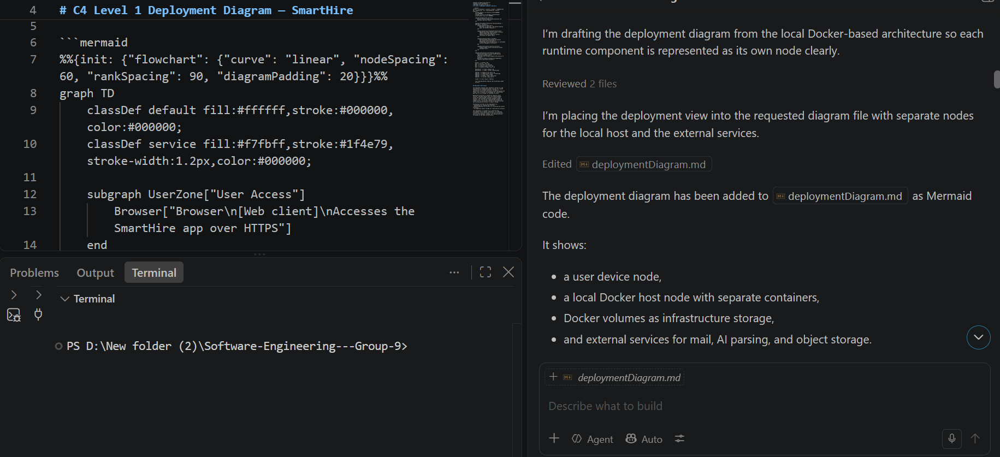
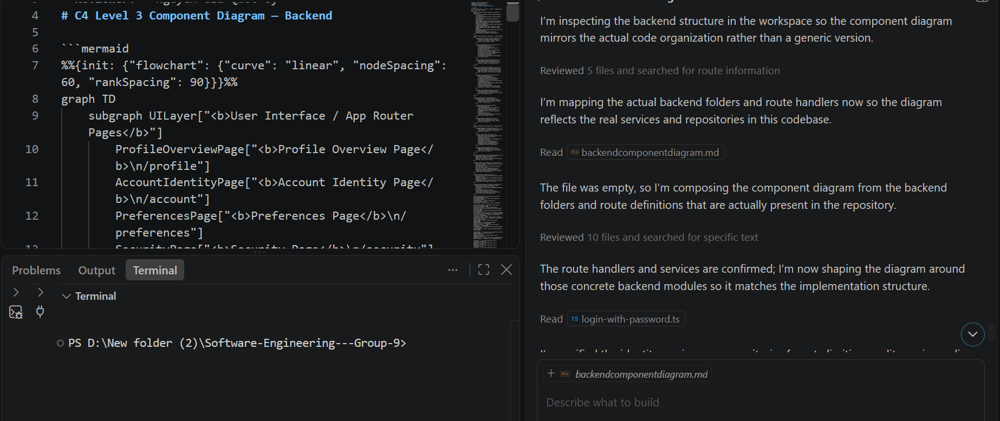

# AI Usage Report For PA4

**Student Name:** Nguyễn Minh Khôi 
**Student ID:** 24127066  
**Group:** 09   
**Class:** 24C11   
**Course/Project:** Software Engineering 

**Use Case 1:**
- **Tool name, version, and platform:** Claude (Claude Sonnet 5), web/chat interface (claude.ai)
- **Access time (date and hour):** 8:00 PM, 03/08/2026
- **Prompts used:** "What is the C4 model in software engineering? Provide a detailed explanation."
- **Purpose of use:** To learn what C4 model is and how can i apply it in my project.
- **Which content was generated by AI:** An indept explanation about C4 diagram, who created it, how many levels of diagram are there and what are the purposes for each diagram.
- **Screenshots or chat history:**  
  

**Use Case 2:**
- **Tool name, version, and platform:** Claude (Claude Sonnet 5), web/chat interface (claude.ai)
- **Access time (date and hour):** 8:30 PM, 03/08/2026
- **Prompts used:** "give me example diagrams of  Container Diagram, Backend Component Diagram,  Deployment Diagram ."
- **Purpose of use:** To learn what each diagrams contain, what needs to be included and what are the rules when drawing those diagrams.
- **Which content was generated by AI:** C4 diagrams for an example system.
- **Screenshots or chat history:**  
  

  **Use Case 3:**
- **Tool name, version, and platform:** Copilot
- **Access time (date and hour):** 9:30 PM, 03/08/2026
- **Prompts used:** "Generate a C4 Model Level 2 (Container) Diagram for the current software project in this repository, exactly matching the visual style, clarity, and detail level of C4 diagram"
- **Purpose of use:** To generate a C4 Model Level 2 (Container) diagram for the current software project and use it as a reference for architecture documentation.
- **Which content was generated by AI:** A draft C4 container diagram showing the main containers, their interactions, and the overall software architecture structure based on the repository context.
- **Which content was done independently and how the student edited or validated it:** I reviewed the AI-generated diagram against the actual repository structure and project requirements. I adjusted the container names, removed irrelevant elements, verified the interaction flow, and refined the labels to make the diagram more accurate and clearer.
- **Screenshots or chat history:**  
  

  **Use Case 4:**
- **Tool name, version, and platform:** Copilot
- **Access time (date and hour):** 10:40 PM, 03/08/2026
- **Prompts used:** "Please consider the entire system and draw me a C4 Deployment diagram shows: Physical node or cloud node, Container running on each node, Communication protocol between nodes, Infrastructure or cloud service, If the entire system runs locally, each container must still be represented as a separate logical node. Return mermaid code"
- **Purpose of use:** To generate a deployment-level view of the system architecture and understand how the containers would be distributed across nodes or infrastructure.
- **Which content was generated by AI:** A Mermaid-based deployment diagram showing the deployment structure, nodes, containers, and communication paths between them.
- **Which content was done independently and how the student edited or validated it:** I checked the generated diagram against the actual deployment assumptions of the project, adjusted the node and container labels, and ensured the architecture representation matched the system context and technical constraints.
- **Screenshots or chat history:**  
  

  **Use Case 5:**
- **Tool name, version, and platform:** Copilot
- **Access time (date and hour):** 7:40 PM, 05/08/2026
- **Prompts used:** "Create a C4 Level 3 Component Diagram for the backend of my system, drawn in Mermaid. SCOPE: Show the internal component structure of the backend container only. Follow this layered flow: Route Handler → Service → Repository → PostgreSQL / File Storage. Focus only on major, architecturally significant components — do not diagram every"
- **Purpose of use:** To create a detailed component-level view of the backend architecture and better understand the internal structure of the system.
- **Which content was generated by AI:** A Mermaid component diagram illustrating the backend container’s main components, their responsibilities, and the flow between route handlers, services, repositories, and data storage.
- **Which content was done independently and how the student edited or validated it:** I reviewed the generated component diagram to ensure it reflected the real backend design, simplified overly detailed parts, and corrected the naming and layering so the diagram was clearer and more accurate.
- **Screenshots or chat history:**  
  