# AI Usage Report For PA4

**Student Name:** Nguyễn Quốc Thành <br>
**Student ID:** 24127542  
**Group:** 09  
**Class:** 24C11  
**Course/Project:** Software Engineering

## AI Usage Notes

I used Vietnamese to prompt in many Use Case so that I may write in Vietnamese in the following Use Case Prompt and Output.

## Table of Contents

- [Use Case 1](#use-case-1)
- [Use Case 2](#use-case-2)
- [Use Case 3](#use-case-3)
- [Use Case 4](#use-case-4)
- [Use Case 5](#use-case-5)
- [Use Case 6](#use-case-6)
- [Use Case 7](#use-case-7)
- [Use Case 8](#use-case-8)
- [Use Case 9](#use-case-9)
- [Use Case 10](#use-case-10)

### Use Case 1:

- **Tool name, version, and platform:** ChatGPT 5.5 Sol Max.
- **Access time (date and hour):** 2:00AM, 31/07/2026
- **Prompts used:**

```
Candidate Profile Management
    Các Use Case bao phủ nhóm tính năng:
        - UC-PROF-01 — Manage Candidate Profile (Must)
        - UC-PROF-02 — Upload and Parse CV (Cân nhắc) (Should)
        - UC-PROF-03 — Review and Confirm Parsed CV (Cân nhắc) (Should)
        - UC-ACC-01 — Manage Account Information (Must)
        - UC-ACC-02 — Manage Account Preferences (Must)
        - UC-AUTH-06 — Change Password (Must)
        - UC-AUTH-07 — Access Protected Account Page (Đã có)
    Hiện tại tôi đang muốn build theo speckit nhóm tính năng thứ 2 thì bạn gợi ý tôi sẽ build như thế nào, chưa động đến code
```

- **Purpose of use:** To receive advice on architecture and structural analysis to organize a specific set of use cases (Candidate Profile Management) using the "speckit" method before writing code.
- **Which content was generated by AI:** The proposal suggests dividing the use cases into two separate features to manage complexity (Feature 002 for Profile & Account Management and Feature 004 for CV Import), a suggested folder naming convention (002-candidate-profile-account-management), and detailed step-by-step implementation logic (vertical analysis) for each component.
- **Which content was done independently and how the student edited or validated it:**
  Students independently defined the initial project requirements, scope, and list of use cases. They validated the AI-provided structural advice by applying it and creating the corresponding directory structure in their project repository.
- **Screenshots or chat history:**
  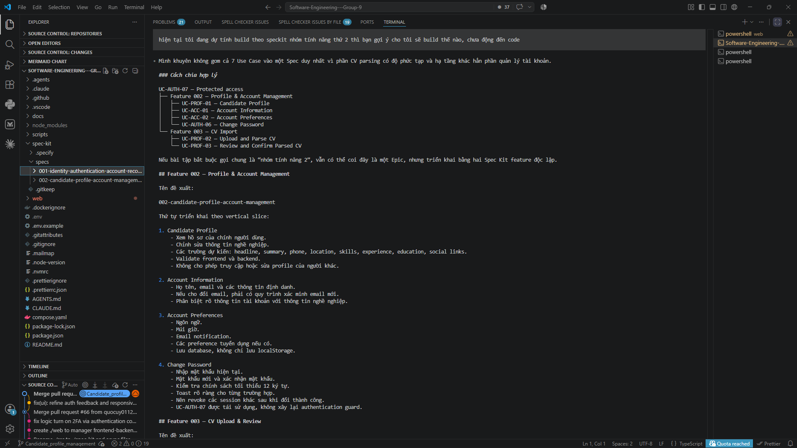

### Use Case 2:

- **Tool name, version, and platform:** Claude Sonnet 5
- **Access time (date and hour):** 2:39AM, 31/07/2026
- **Prompts used:** "hướng tới như này ổn không?" + `result generated by AI`
- **Purpose of use:** To review, validate, and gather constructive feedback on the architectural approach and implementation plan generated in the previous use case before proceeding to write the detailed technical specifications.
- **Which content was generated by AI:**
  The proposed plan review highlights its strengths (such as the logical separation between Feature 002 and 004, vertical partitioning, and security issues like CSRF attacks) and provides a list of necessary additions or exceptions that need clarification before specific regulations are implemented (such as email change verification logic, session revocation during password changes, and Account Preferences schema definition).
- **Which content was done independently and how the student edited or validated it:**
  Students independently cross-checked the architectural drawings using a second AI tool that acted as a reviewer. Students evaluated this critical feedback to refine the project's structural specifications and address exceptions before beginning the programming or modeling phase.
- **Screenshots or chat history:**
  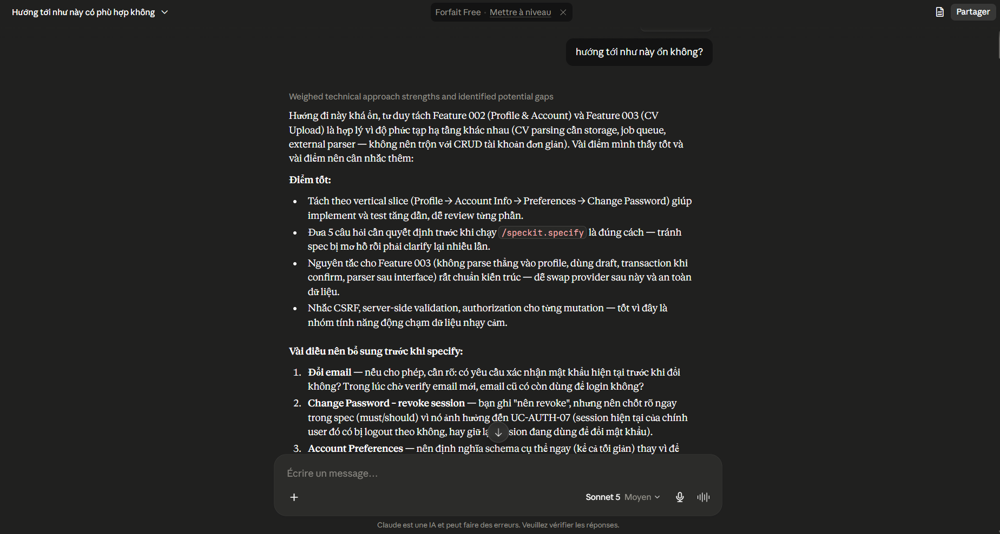

### Use Case 3:

- **Tool name, version, and platform:** ChatGPT 5.5 Sol Max.
- **Access time (date and hour):** 2:50AM, 31/07/2026
- **Prompts used:** `The prompt was generated by Claude to do /speckit-specify'
- **Purpose of use:**
  - Create the file `spec.md.`
- **Which content was generated by AI:**
  - File `./spec.md` + `./checklist/`
- **Which content was done independently and how the student edited or validated it:**
  - Defined the feature scope and business requirements independently
    (which use cases belong to Feature 002, which are deferred to
    Feature 004) before drafting the prompt.
  - Made the key architectural decisions used as input to the prompt:
    relational tables vs. JSON storage for experience/education/skills,
    whether email change is in scope, and session revocation behavior
    after password change.
  - Reviewed the AI-generated `spec.md` against these decisions to
    confirm no requirement was misrepresented or silently altered by
    the AI during generation.
  - Verified that out-of-scope items (CV upload and parsing) were
    correctly excluded from the generated spec, as instructed in the
    prompt.
  - Reviewed the generated `checklist/` items for completeness and
    confirmed they matched the intended acceptance criteria before
    proceeding to `/speckit.clarify`.
- **Screenshots or chat history:**
  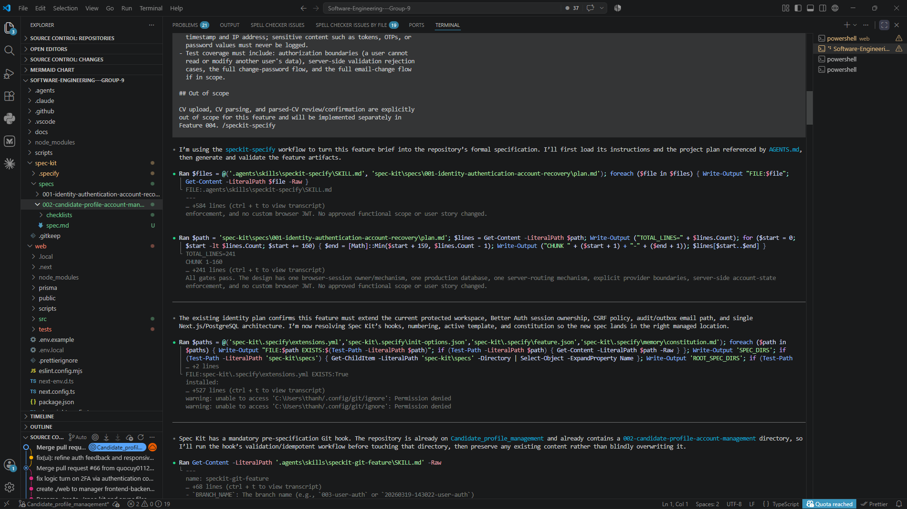
  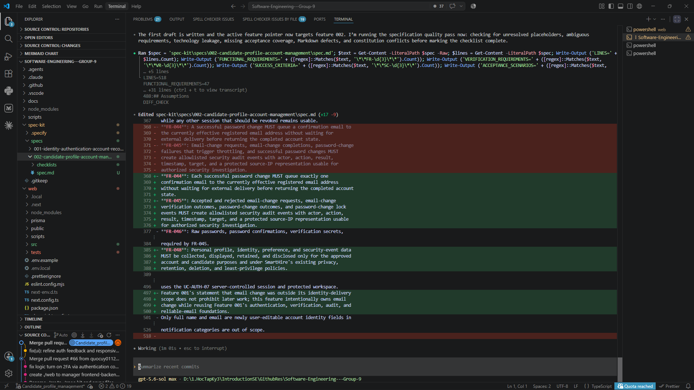
  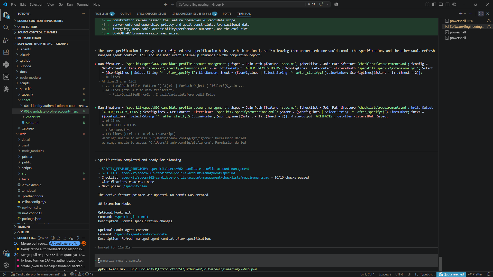

### Use Case 4:

- **Tool name, version, and platform:** ChatGPT 5.5 Sol Max.
- **Access time (date and hour):** 3:59AM, 31/07/2026
- **Prompts used:** `Do continue /speckit-plan`
- **Purpose of use:**
  - Generate the implementation plan (`plan.md`) for Feature 002
    (Profile & Account Management) based on the approved `spec.md`,
    translating business requirements into technical architecture,
    data model, and API contract decisions.
- **Which content was generated by AI:**
  - File `./plan.md`, including the technology stack breakdown,
    data model design (relational tables for experience/education,
    account identity, preferences, and password-change tracking),
    the API contract structure, and the implementation phase
    ordering.
- **Which content was done independently and how the student edited or validated it:**
  - Provided the technical context input to the plan (existing
    framework, database, ORM, authentication mechanism, and email
    service already used by the project) so the AI plan matched the
    project's actual stack instead of introducing a new one.
  - Specified that the data model must anticipate Feature 004 (CV
    upload/parsing), which will later write into the same profile
    tables, to avoid a breaking schema change afterward.
  - Reviewed the generated `plan.md` for consistency with the
    decisions already made in `spec.md` (session revocation
    behavior, email verification flow, month-precision dates) and
    confirmed no contradiction was introduced during generation.
  - Verified that existing project conventions (folder structure,
    component patterns, API route organization) were followed rather
    than a new pattern being introduced.
- **Screenshots or chat history:**
  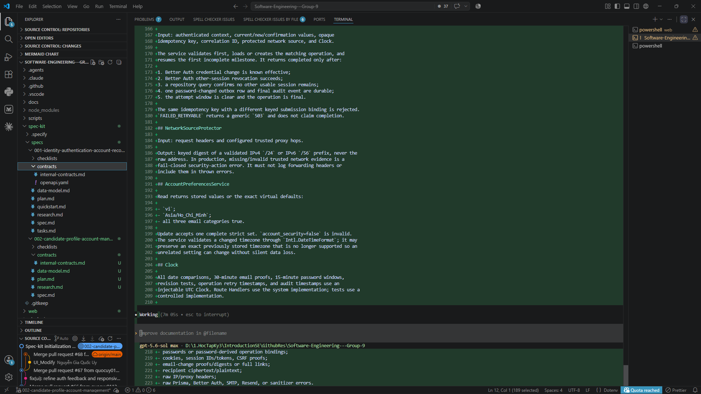
  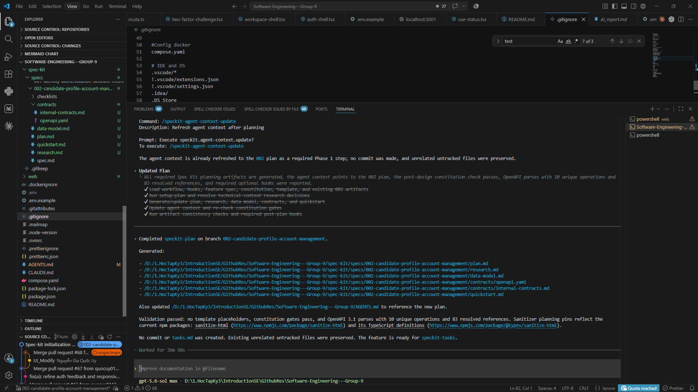

### Use Case 5:

- **Tool name, version, and platform:** Claude Sonnet 5
- **Access time (date and hour):** 3:43AM, 31/07/2026
- **Prompts used:** prompt cho /speckit-tasks
- **Purpose of use:**
  - Generate the task breakdown (`tasks.md`) for Feature 002 based on
    the approved `plan.md`, converting the technical plan into
    discrete, implementable, and individually testable tasks.
- **Which content was generated by AI:**
  - File `./tasks.md`, including task ordering, task descriptions,
    acceptance criteria per task, and grouping by user story/vertical
    slice.
- **Which content was done independently and how the student edited or validated it:**
  - Specified the task ordering constraints given to the AI: database
    schema/migration tasks for Candidate Profile must come before
    dependent API and UI tasks, since Feature 004 depends on this
    schema later.
  - Required tasks to be grouped by vertical slice (Candidate Profile
    → Account Information → Account Preferences → Change Password)
    rather than by horizontal layer, so each slice is independently
    testable and deployable.
  - Required security-sensitive work (password change, email
    verification, session revocation, rate limiting) to be split into
    small, individually reviewable tasks instead of one large task.
  - Reviewed the generated `tasks.md` to confirm the task order
    actually respected the schema-before-API-before-UI dependency,
    and checked that no security-sensitive task was left oversized or
    merged with unrelated work.
  - Verified that CV upload/parsing tasks were correctly excluded,
    since that scope belongs to Feature 004.
- **Screenshots or chat history:**
  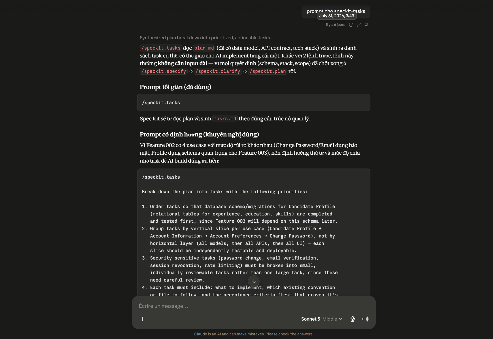

### Use Case 6:

- **Tool name, version, and platform:** ChatGPT 5.5 Sol Max.
- **Access time (date and hour):** 4:11AM, 31/07/2026
- **Prompts used:** `speckit-tasks`
- **Purpose of use:**
  - Continue/finalize the task breakdown (`tasks.md`) for Feature 002
    after the initial generation, ensuring the full task list was
    completed and consistent with the approved `plan.md`.
- **Which content was generated by AI:**
  - Remaining sections of `./tasks.md` not covered in the previous
    generation pass, including any additional tasks required to
    complete full coverage of the plan's phases.
- **Which content was done independently and how the student edited or validated it:**
  - Verified that the completed `tasks.md` matched the task ordering
    and grouping constraints established earlier (schema before API
    before UI, vertical-slice grouping, small security-sensitive
    tasks), and that no task from the initial pass was duplicated or
    lost when generation continued.
  - Cross-checked total task count and coverage against the plan's
    phases to confirm nothing was silently dropped between the two
    generation passes.
- **Screenshots or chat history:**
  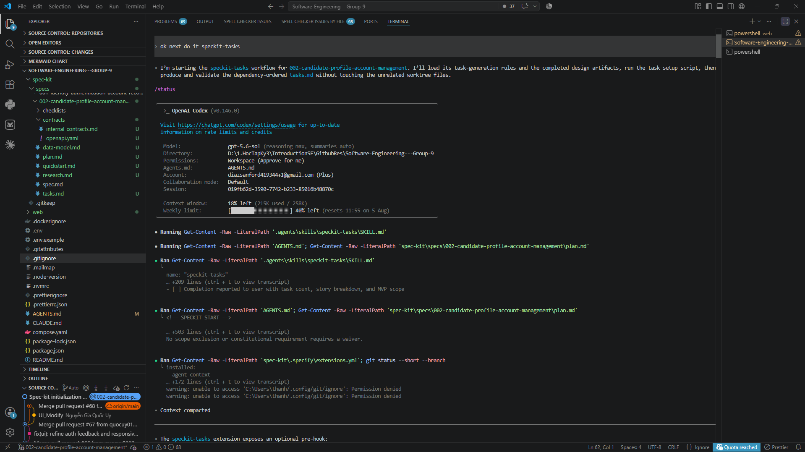
  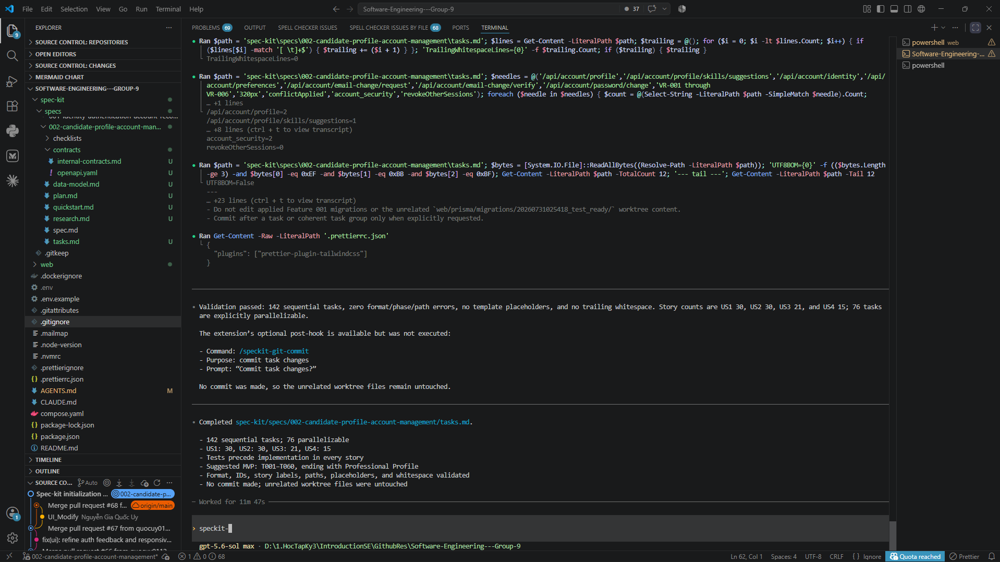

### Use Case 7:

- **Tool name, version, and platform:** ChatGPT 5.5 Sol Max.
- **Access time (date and hour):** 11:11AM, 31/07/2026
- **Prompts used:** Continue speckit-analyze
- **Purpose of use:**
  - Cross-check `spec.md`, `plan.md`, `tasks.md`, and
    `contracts/openapi.yaml` for Feature 002 to detect coverage gaps,
    contradictions, ordering issues, and ambiguities before starting
    implementation.
- **Which content was generated by AI:**
  - The Specification Analysis Report, including 12 findings (4 HIGH,
    7 MEDIUM, 1 LOW), the requirement/task coverage summary (58
    requirements, 100% nominal coverage, 6 partially covered), the
    constitution alignment check, and the recommended remediation
    actions for each finding. No repository files were modified by
    this step — it was read-only analysis.
- **Which content was done independently and how the student edited or validated it:**
  - Reviewed each of the 12 findings individually to confirm they
    were genuine issues (e.g. missing `Cache-Control: no-store` on
    sensitive endpoints, incomplete sanitizer dependency gate
    ordering, missing browser-level XSS coverage for identity
    fields) rather than false positives.
  - Prioritized the findings by severity, deciding that all 4 HIGH
    findings must be resolved before `/speckit.implement`, while
    the LOW finding (missing entity in spec's key-entities list) was
    treated as optional.
  - Drafted a consolidated remediation prompt covering all 12
    findings with exact file/line references, to be executed by an
    AI coding agent, and required `/speckit.analyze` to be rerun
    afterward to confirm the fixes before allowing implementation to
    proceed.
- **Screenshots or chat history:**
  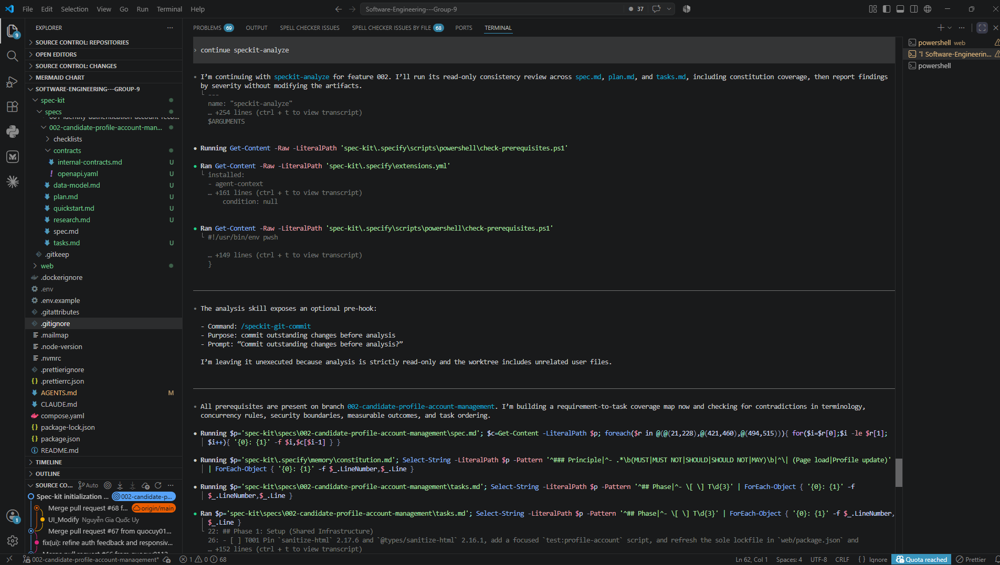
  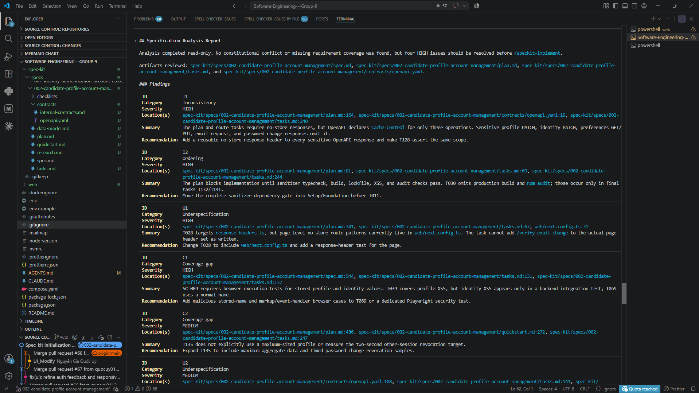

### Use Case 8:

- **Tool name, version, and platform:** Claude Sonnet 5
- **Access time (date and hour):** 11:23AM, 31/07/2026
- **Prompts used:** `Risk problem generated by AI` + Cho tôi một prompt chính xác tất cả các risk này để có thể thực hiện implement.
- **Purpose of use:**
  - Consolidate all 12 findings from the `/speckit.analyze` report
    (4 HIGH, 7 MEDIUM, 1 LOW) into a single, precise remediation
    prompt that an AI coding agent could execute directly against the
    repository, so every risk is fixed before `/speckit.implement`
    runs.
- **Which content was generated by AI:**
  - A structured remediation prompt covering all 12 findings (I1, I2,
    U1, C1, C2, U2, C3, I3, I4, A1, A2, U3), each with its exact file
    and line reference, the required fix, and an explicit instruction
    not to run `/speckit.implement` until fixes are applied and
    `/speckit.analyze` is rerun to confirm resolution.
- **Which content was done independently and how the student edited or validated it:**
  - Reviewed the analysis report and decided the fix order: all 4
    HIGH findings first (blocking), then MEDIUM findings, with the
    single LOW finding treated as optional.
  - Verified that the remediation prompt preserved the exact
    file/line locations from the original report so the coding agent
    could locate each issue precisely, instead of relying on vague
    descriptions.
  - Flagged that two of the findings (A1 — phone number grammar, A2 —
    success-criteria metric definition) require editing `spec.md`
    itself, not just code or tasks, and planned to re-read those two
    spec sections after the fix to confirm no new inconsistency was
    introduced elsewhere in the spec.
  - Set the explicit stopping condition in the prompt (summarize
    changes, then halt for a re-run of `/speckit.analyze`) rather than
    letting the agent proceed straight to implementation.
- **Screenshots or chat history:**
  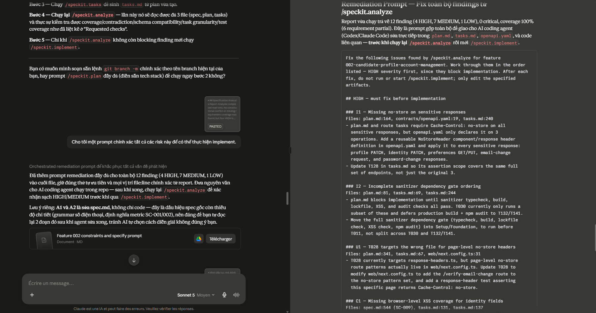

### Use Case 9:

- **Tool name, version, and platform:** ChatGPT 5.5 Sol Max.
- **Access time (date and hour):** 12:00AM, 31/07/2026
- **Prompts used:** `Prompt was generated by Claude AI`
- **Purpose of use:**
  - Execute the remediation prompt (generated in Use Case 8) against
    the repository to fix all HIGH and MEDIUM severity findings
    reported by `/speckit.analyze` for Feature 002, before rerunning
    the analysis and proceeding to `/speckit.implement`.
- **Which content was generated by AI:**
  - Edits to `plan.md`, `tasks.md`, `contracts/openapi.yaml`,
    `web/next.config.ts`, and `spec.md` addressing the HIGH findings
    (I1 — missing `no-store` on sensitive responses, I2 — incomplete
    sanitizer dependency gate ordering, U1 — wrong file targeted for
    page-level `no-store` headers, C1 — missing browser-level XSS
    coverage for identity fields) and the MEDIUM findings (C2, U2,
    C3, I3, I4, A1, A2) listed in the remediation prompt.
- **Which content was done independently and how the student edited or validated it:**
  - Reviewed each file change against the original finding it was
    meant to resolve, confirming the fix matched the required
    remediation described in the analysis report rather than a
    partial or unrelated change.
  - Specifically re-read the two spec.md edits (A1 — phone number
    format grammar, A2 — success-criteria metric definitions) to
    confirm they did not conflict with other parts of the spec that
    referenced the same requirements.
  - Confirmed the AI stopped after applying the fixes and did not
    proceed to `/speckit.implement`, as instructed in the prompt, so
    that `/speckit.analyze` could be rerun to verify the findings
    were actually resolved.
- **Screenshots or chat history:**
  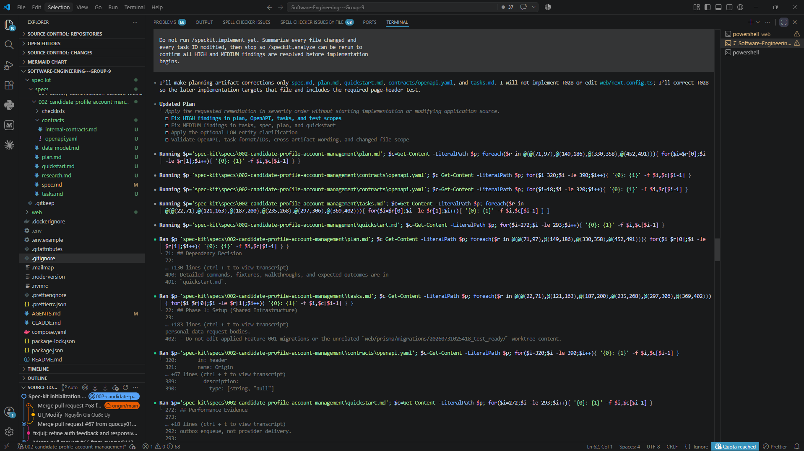
