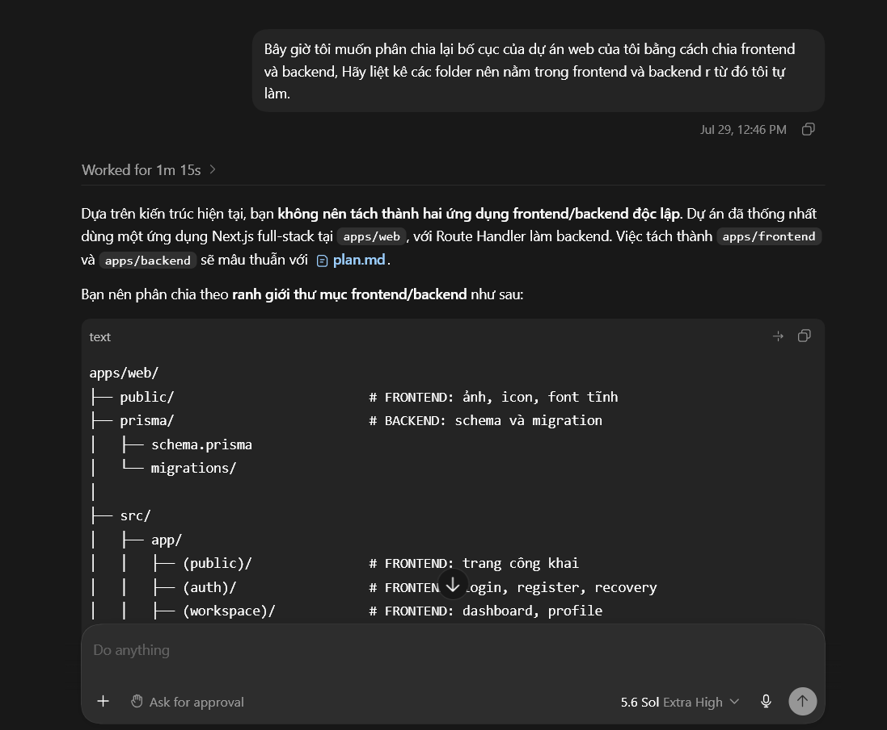
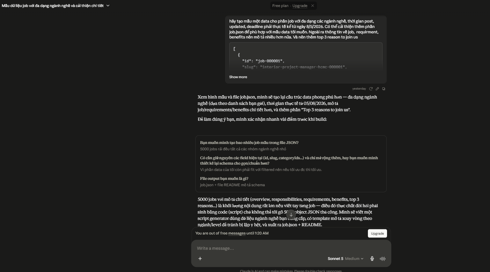
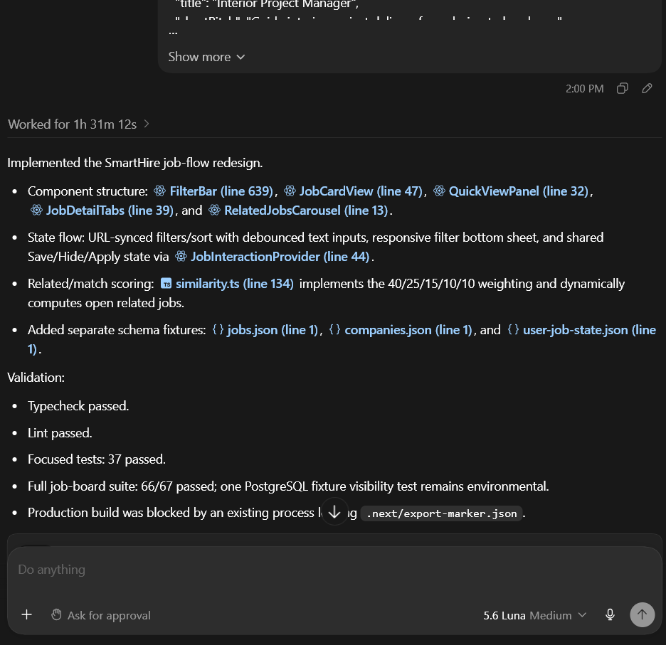
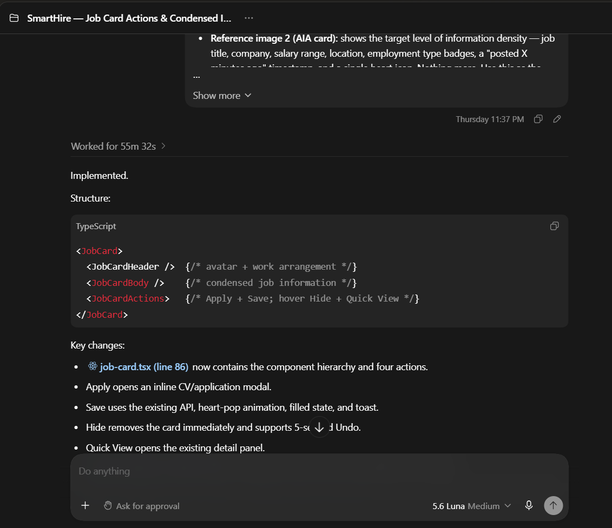
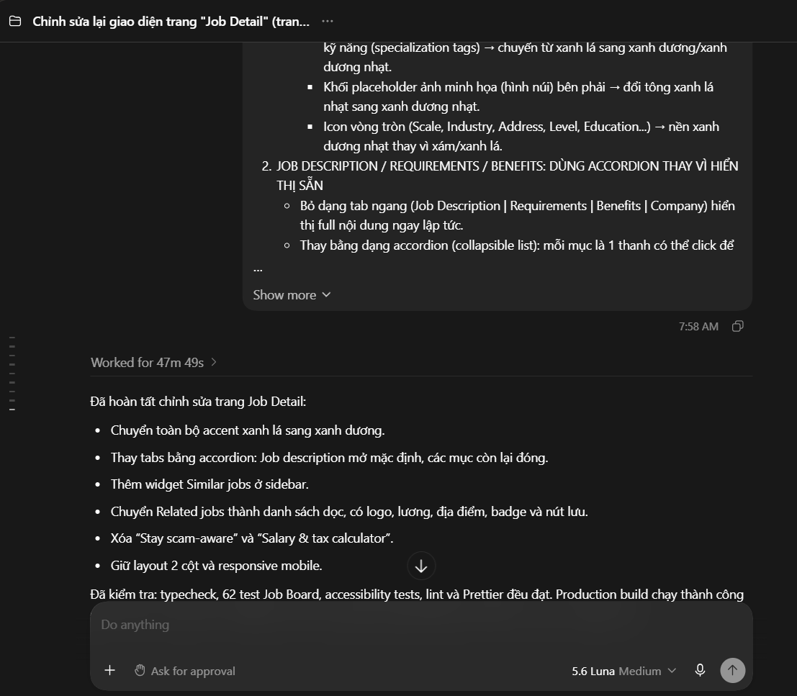
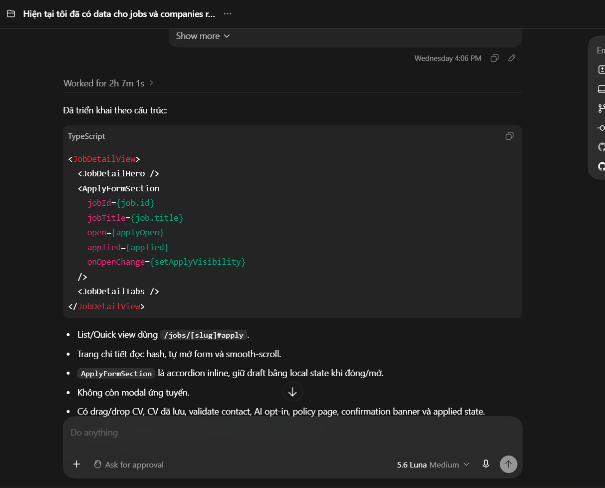
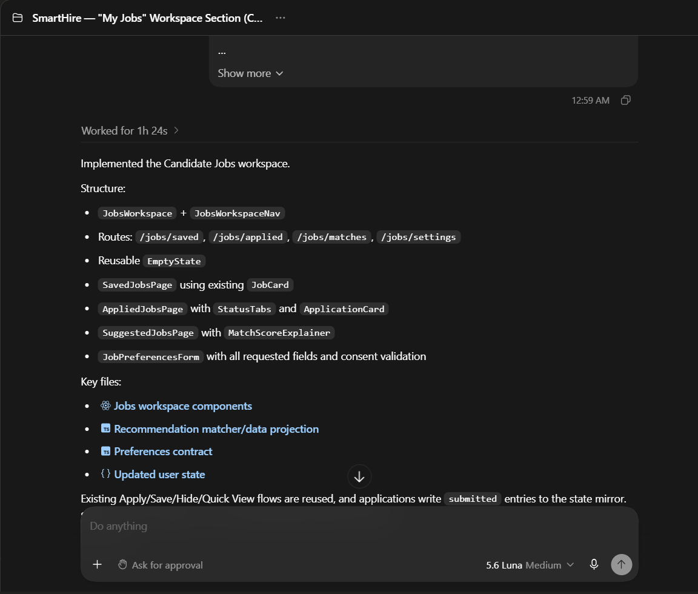

# AI Usage Report

# Student Information

**Student Name:** Ngô Quốc Tuấn  
**Student ID:** 24127581  
**Group:** 09   
**Class:** 24C11   
**Course/Project:** Software Engineering   
**Review:** Nguyễn Gia Quốc Uy

---

# Notes

- The Prompts used in this report are written in Vietnamese, as this was the language used during the actual interaction with the AI tool. All other sections (Purpose of use, content descriptions, validation notes) are written in English to comply with the report format required for this course.
- Prompts were kept in their original Vietnamese/English form (rather than translated) to preserve the exact wording used when interacting with the AI tool, ensuring the record accurately reflects the actual usage.
- Use Cases are listed in chronological order of actual usage. Use Case 1 corresponds to the initial project-structure planning step; Use Case 2 corresponds to sample data generation; Use Cases 3–7 correspond to the UI/UX redesign work for the Job Listing flow, built progressively on top of the data schema established in Use Case 2.
- Exact access timestamps were not recorded for these sessions; the placeholders below (`[hh:mm]`) should be filled in from the actual chat history before final submission.

---

# Summary Table

| # | Use Case (Prompt Purpose) | Output Type | Access Time |
|---|---|---|---|
| 1 | Frontend/Backend folder structure planning | Folder structure recommendation | 29/07/2026 – 12:46 pm |
| 2 | Job sample data generation (jobs.json / companies.json) | JSON schema + sample data | 04/08/2026 – 10:00 pm |
| 3 | Job Listing flow redesign (outline) | Component structure + JSX/Tailwind code | 05/08/2026 – 02:00 am |
| 4 | Job Card — 4 actions redesign | Component structure + JSX/Tailwind code | 06/08/2026 - 11:37 pm |
| 5 | Job Detail page redesign | UI redesign (accordion, color, layout) | 06/08/2026 - 07:58 am |
| 6 | Apply Form (inline, non-modal) redesign | Component structure + JSX/Tailwind code | 05/08/2026 – 04:06 pm |
| 7 | Job Management (Candidate Workspace) build-out | Component/route structure + JSX/Tailwind code | 06/08/2026 - 12:59 am |

---

**Use Case 1:**
- **Tool name, version, and platform:** ChatGPT, GPT-5.6 (Sol Extra High), Web Platform
- **Access time (date and hour):** 29/07/2026 – 12:46 pm
- **Prompts used:** "Bây giờ tôi muốn phân chia lại bố cục của dự án web của tôi bằng cách chia frontend và backend, Hãy liệt kê các folder nên nằm trong frontend và backend r từ đó tôi tự làm."
- **Purpose of use:** To get a preliminary recommendation on how to restructure the SmartHire web project into separate frontend and backend folders, as a planning reference before doing the actual reorganization manually.
- **Which content was generated by AI:** A proposed folder-by-folder breakdown indicating which directories should belong to the frontend layer and which should belong to the backend layer.
- **Which content was done independently and how the student edited or validated it:** I evaluated the proposed structure against the project's existing codebase and actual dependencies (e.g., which modules were shared or coupled), and manually carried out the folder reorganization myself rather than letting the AI perform any file operations — the AI's output was used purely as a planning reference.
- **Screenshots or chat history:**

**Use Case 2:**
- **Tool name, version, and platform:** Claude (Anthropic), Claude Sonnet 5, Web Platform (claude.ai)
- **Access time (date and hour):** 05/08/2026 – 11h00 pm
- **Prompts used:** "hãy tạo mẫu một data cho phần job với đa dạng các ngành nghề, thời gian post, updated, deadline phải thực tế kể từ ngày 8/5/2026. Có thể cải thiện thêm phần job.json để phù hợp với mẫu data tôi muốn. Ngoài ra thông tin về job, requirment, benefits nên mô tả nhiều hơn nữa. Và nên thêm top 3 reason to join us. Database tạo khoảng 5000 jobs và các companies phải có dữ liệu để đối chiếu với job" (kèm mẫu JSON `job-000001` minh hoạ cấu trúc mong muốn).
- **Purpose of use:** To generate a sample data schema and representative entries for the job-posting dataset (`jobs.json`), cross-referenced with a companies dataset, to be used as demo/development data for the platform, with realistic posting/update/deadline dates anchored from 8/5/2026.
- **Which content was generated by AI:** An improved `jobs.json` schema (including richer `description.requirements`, `description.benefits`, and a new `topReasonsToJoin` field), and the pattern for generating a ~5,000-entry dataset with matching `companies.json` records referenced via `companyId`.
- **Which content was done independently and how the student edited or validated it:** I authored the original schema draft and the exact business fields required (salary structure, experience labels, status, stats). I reviewed the AI-proposed schema additions for consistency with the rest of the system (e.g., that `companyId` values actually resolved against `companies.json`) before accepting the expanded structure as the project's data foundation.
- **Screenshots or chat history:**

**Use Case 3:**
- **Tool name, version, and platform:** ChatGPT, GPT-5.6 (Luna Max), Web Platform
- **Access time (date and hour):** 05/08/2026 – 02:00 am 
- **Prompts used:** "I need to redesign the entire Job Listing flow for SmartHire (Next.js/React + Tailwind). Reference TopCV's UX spirit but DO NOT copy its UI — reimagine the layout, icons, and interactions. Keep the current design system (primary blue color, border-radius, font, input/button/card styles already used on the Jobs page)." (kèm đầy đủ 7 phần: Data Schema, Filters auto-apply, Sort decoupled, Filter/Sort bar layout, 4 actions on Job Card, Quick View Panel, Job Detail page, Related Jobs computed dynamically).
- **Purpose of use:** To redesign the full Job Listing flow — filters, sorting, job card actions, quick view panel, job detail layout, and a dynamically computed related-jobs/match-score engine — while explicitly avoiding a direct UI copy of the reference platform (TopCV) and preserving the existing SmartHire design system.
- **Which content was generated by AI:** The proposed component structure (`FilterBar`, `SortDropdown`, `JobCard`, `QuickViewPanel`, `JobDetailPage`, `RelatedJobsCarousel`), the state-flow design (URL-synced filters, decoupled sort state, debounce logic, global saved/hidden/applied state), the similarity-scoring function design for `relatedJobs`/`matchScore`, and the corresponding JSX/Tailwind code.
- **Which content was done independently and how the student edited or validated it:** I defined the exact data schema (`jobs.json`, `user-job-state.json`), the auto-apply filter behavior, the sort options, and the scoring weights (category 40%, skills 25%, location 15%, salary 10%, experience 10%). I reviewed the generated component structure and code against the existing design system and manually verified that filter/sort state stayed in sync across the job list, quick view, and detail page before integrating it.
- **Screenshots or chat history:**

**Use Case 4:**
- **Tool name, version, and platform:** ChatGPT, GPT-5.6 (Luna Max), Web Platform
- **Access time (date and hour):** 06/08/2026 - 11:37 pm
- **Prompts used:** "Update the job card component (Next.js/React + Tailwind) to support 4 actions and a more condensed info display, reading/writing to `user-job-state.json` (§0.2). Keep the existing design system (primary blue, border-radius, fonts, spacing already in use)." (kèm quy tắc hiển thị: Apply now + Save luôn hiện; Hide + Quick view chỉ hiện khi hover; danh sách thông tin tối đa hiển thị trên card).
- **Purpose of use:** To update the `JobCard` component so it exposes four distinct actions (Apply, Save, Hide, Quick view) with a clear always-visible vs. hover-only distinction, and to reduce the amount of information shown per card for a cleaner resting state.
- **Which content was generated by AI:** The proposed sub-component breakdown (`JobCardHeader`, `JobCardBody`, `JobCardActions`), the hover-reveal interaction logic for Hide/Quick view, the toast/undo behavior for the Hide action, and the corresponding JSX/Tailwind code.
- **Which content was done independently and how the student edited or validated it:** I specified the exact action set, which actions must always be visible vs. hover-only, and the precise field list allowed on a condensed card. I manually tested the hover interactions and the 5-second Undo toast in the browser to confirm the behavior matched the requirement before accepting the component.
- **Screenshots or chat history:**

**Use Case 5:**
- **Tool name, version, and platform:** ChatGPT, GPT-5.6 (Luna Max), Web Platform
- **Access time (date and hour):** 06/08/2026 - 07:58 am
- **Prompts used:** "Chỉnh sửa lại giao diện trang 'Job Detail' (trang xem chi tiết tin tuyển dụng) theo các yêu cầu sau: 1. Màu sắc chủ đạo (đổi từ xanh lá sang xanh dương)... 2. Job Description/Requirements/Benefits: dùng accordion thay vì hiển thị sẵn... 3. Cột phải: thêm 'Similar jobs'... 4. Related jobs cuối trang: chuyển thành danh sách dọc dài... 5. Xóa Stay scam-aware và Salary & tax calculator."
- **Purpose of use:** To restyle the Job Detail page's accent color from green to blue, convert the description/requirements/benefits sections from tabs to an accordion, add a "Similar jobs" widget to the sidebar, convert the bottom related-jobs carousel into a vertical list, and remove two widgets no longer needed (scam-warning banner, salary/tax calculator).
- **Which content was generated by AI:** The updated color-token mapping for all blue-accent elements, the accordion component logic (default-open Job Description, chevron rotation), the new "Similar jobs" sidebar widget, and the restructured vertical related-jobs list markup.
- **Which content was done independently and how the student edited or validated it:** I specified the exact elements requiring the color change, which sections must default open/closed in the accordion, and which two widgets to remove entirely. I visually reviewed the rendered page against the reference images provided to confirm the color and layout changes matched before merging.
- **Screenshots or chat history:**

**Use Case 6:**
- **Tool name, version, and platform:** ChatGPT, GPT-5.6 (Luna Max), Web Platform
- **Access time (date and hour):** 05/08/2026 – 04:06 pm
- **Prompts used:** "Currently I already have data for jobs and companies. Additionally, please fix the following issue: Update the behavior of the 'Apply Now' button on SmartHire (replacing the modal approach mentioned previously)..." (kèm đầy đủ hành vi khi bấm Apply Now từ list/quick view và từ detail page, nội dung form: CV upload, contact info, AI CV analysis consent checkbox, footer CTAs, dữ liệu ghi vào `appliedJobs`).
- **Purpose of use:** To replace the previous modal-based apply flow with an inline, expandable Application Form embedded directly in the Job Detail page, including CV upload, contact info auto-fill, an opt-in AI CV-matching consent checkbox, and extended `appliedJobs` data recording.
- **Which content was generated by AI:** The proposed `ApplyFormSection` component design (expand/collapse via local state or URL hash for deep-linking), the field-level validation logic, the AI-consent checkbox behavior (optional, with an inline match-score result on submit), and the corresponding JSX/Tailwind code.
- **Which content was done independently and how the student edited or validated it:** I defined the exact expand/collapse behavior for both entry points (job list vs. already on detail page), the required fields, the non-blocking nature of the AI-consent checkbox, and the extended `appliedJobs` schema (`cvFileRef`, `contactSnapshot`, `aiAnalysisConsent`, `aiMatchScore`). I manually tested the submission flow end-to-end (including validation errors and the confirmation banner) before accepting the implementation.
- **Screenshots or chat history:**

**Use Case 7:**
- **Tool name, version, and platform:** ChatGPT, GPT-5.6 (Luna Max), Web Platform
- **Access time (date and hour):** 06/08/2026 - 12:59 am
- **Prompts used:** "Build out the Jobs section of the Candidate Workspace (Next.js/React + Tailwind) — the sidebar already has Dashboard, Jobs, Profile... Under Jobs, add 4 sub-tabs/sub-pages: 1. Saved Jobs 2. Applied Jobs 3. Suggested Jobs / Matches 4. Job Recommendation Settings." (kèm cấu trúc dữ liệu thực tế `jobs.json`, `companies.json`, `user-job-state.json`, field mới `jobPreferences`, yêu cầu chi tiết cho từng sub-tab và empty state).
- **Purpose of use:** To build the four Jobs sub-tabs of the Candidate Workspace (Saved, Applied, Suggested/Matched, Recommendation Settings), including a new `jobPreferences` field used to drive the job-matching logic and a settings form to edit it.
- **Which content was generated by AI:** The proposed route/component structure (`JobsWorkspace`, `SavedJobsPage`, `AppliedJobsPage` with `StatusTabs`/`ApplicationCard`, `SuggestedJobsPage` with `MatchScoreExplainer`, `JobPreferencesForm`, reusable `EmptyState`), the matching-score logic for Suggested Jobs, and the corresponding JSX/Tailwind code.
- **Which content was done independently and how the student edited or validated it:** I defined the exact `jobPreferences` schema, the application-status enum (acknowledging that real employer-side status updates were out of scope for this stage), and the matching criteria/weights for Suggested Jobs. I reviewed each sub-tab's empty state and data joins (`jobId` → `jobs.json`, `companyId` → `companies.json`) against the actual dataset before accepting the components.
- **Screenshots or chat history:**

---

# Reflection

Across this workflow, AI assistance was used in two distinct stages. In the first stage (Use Cases 1–2), AI tools were used to plan the project's foundational structure: a recommended frontend/backend folder split, and a data schema together with a large sample dataset (`jobs.json`, `companies.json`) that would underpin everything built afterward. In the second stage (Use Cases 3–7), the established data schema was used as direct input to progressively redesign the Job Listing experience — from the overall flow and filtering/sorting logic, to the job card's action set, to the detail page's visual and structural changes, to the inline application flow, and finally to the candidate-side job-management workspace.

Each prompt built on decisions clarified in the previous one (e.g., the `user-job-state.json` schema introduced in Use Case 3 was reused and extended in Use Cases 4, 6, and 7), which kept the AI-generated components consistent with one another across the flow. At the same time, every generated component structure, state-flow design, and piece of business logic was reviewed against the project's actual requirements — verifying data joins between `jobs.json`, `companies.json`, and `user-job-state.json`, testing interactive behaviors (hover-only actions, undo toasts, inline form expand/collapse) directly in the browser, and explicitly scoping out functionality that depended on features not yet built (e.g., a real employer-side status pipeline in Use Case 7) rather than letting the AI assume it existed.

Overall, AI tools accelerated the drafting of component structures, state-management logic, and boilerplate JSX/Tailwind code, but did not replace the analytical judgment required to define the correct data schema, business rules, and user-interaction behavior — all AI-generated design decisions were independently validated against the project's real requirements before being finalized.