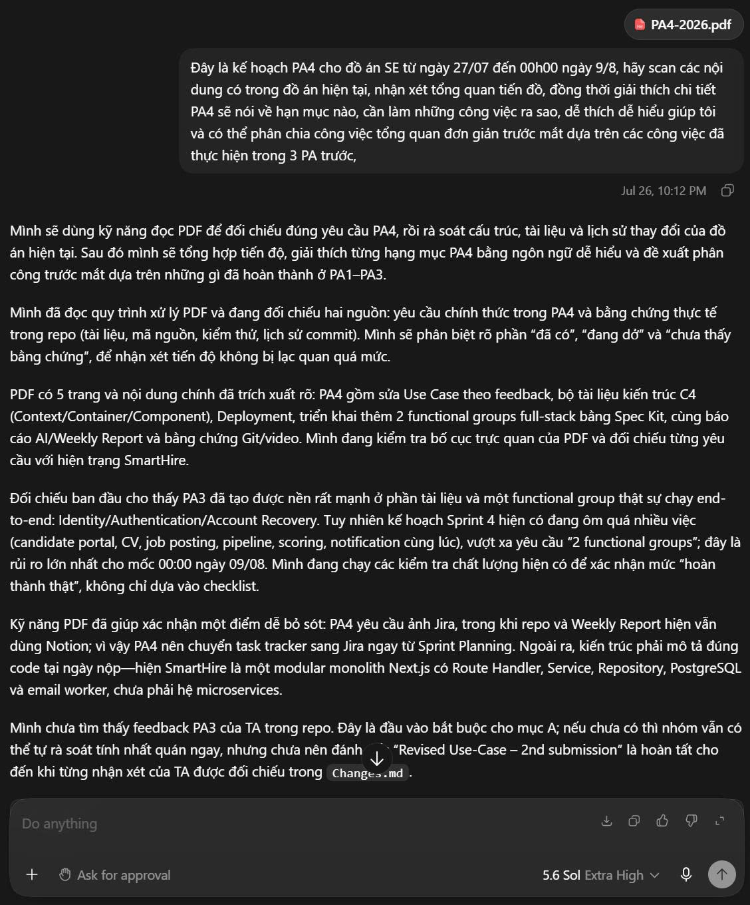
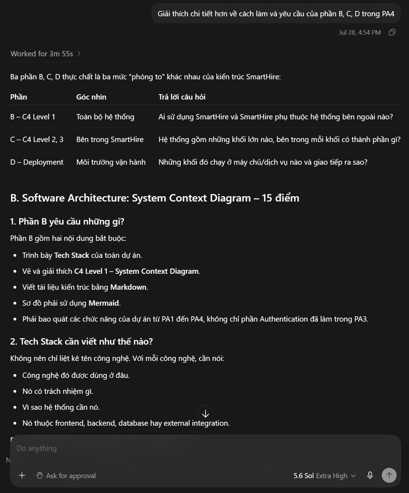
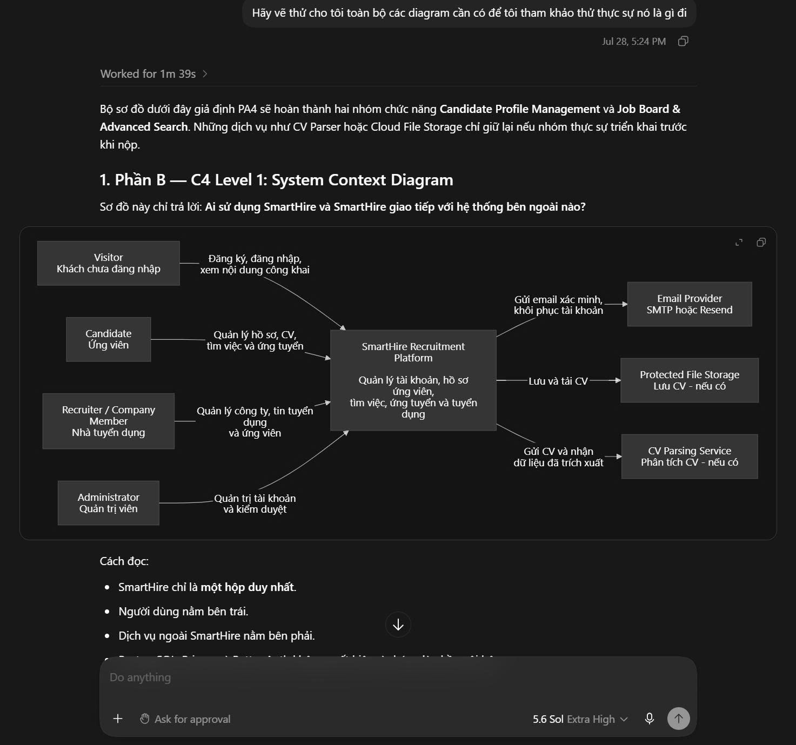
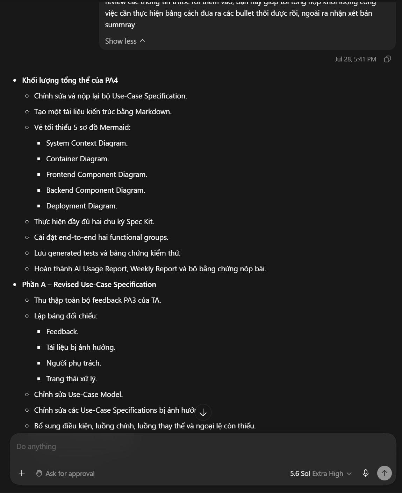
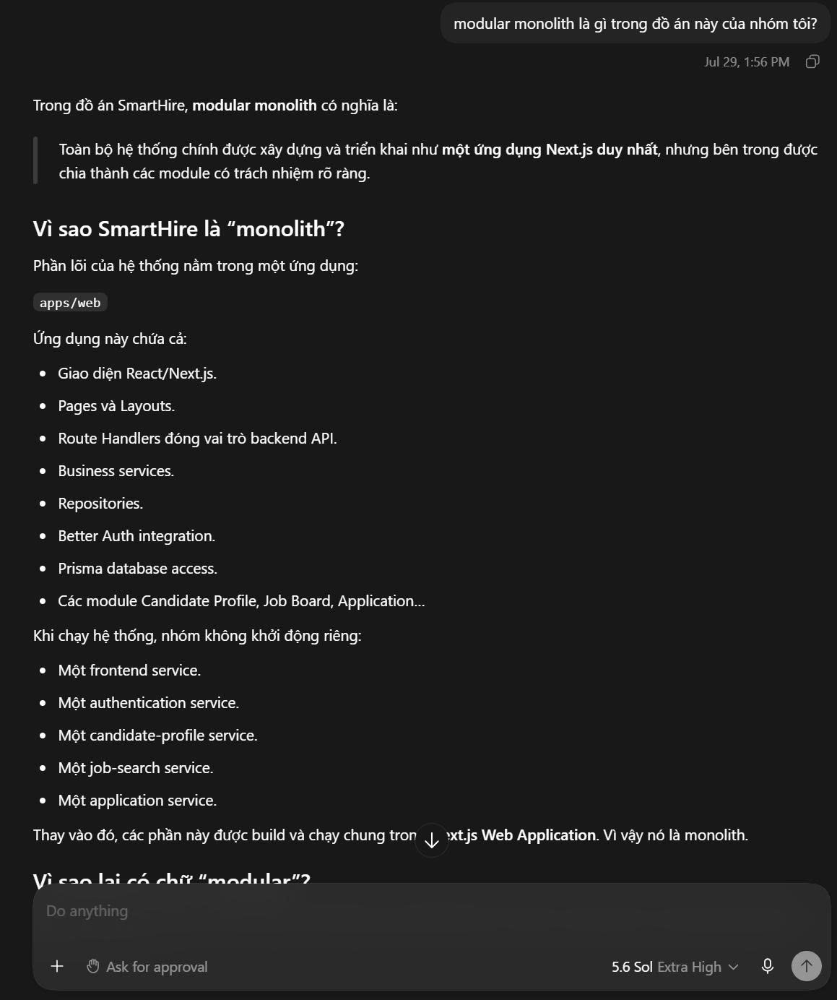
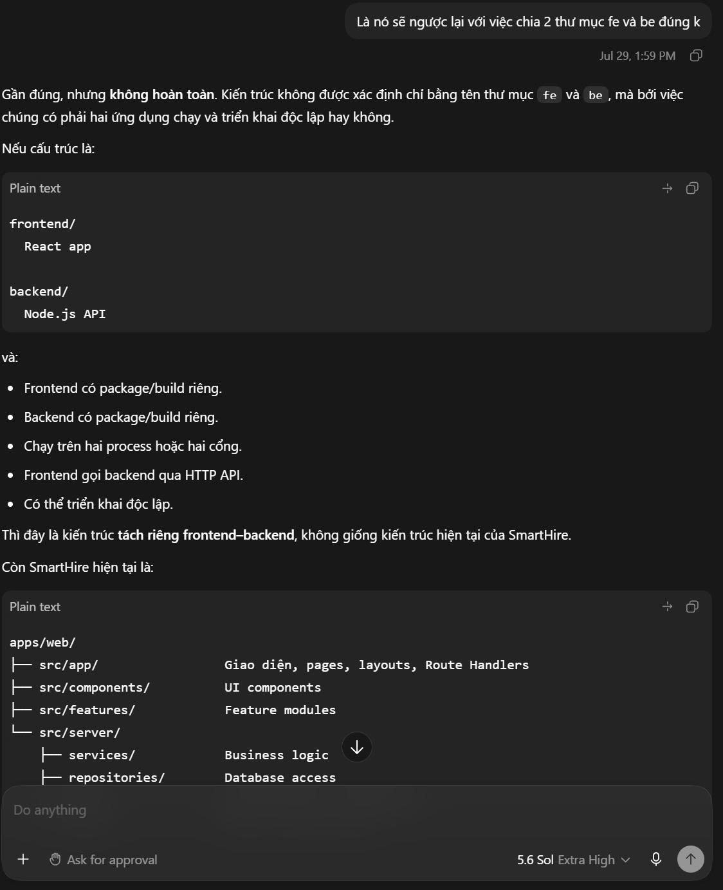
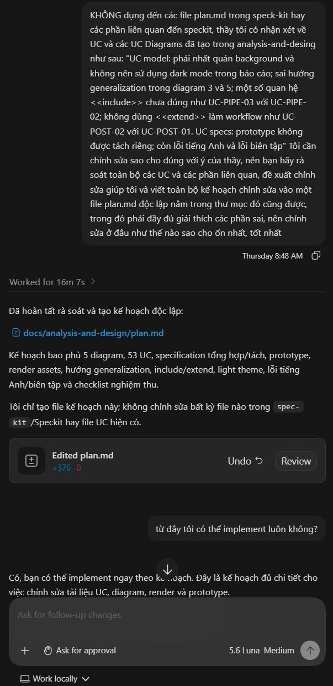
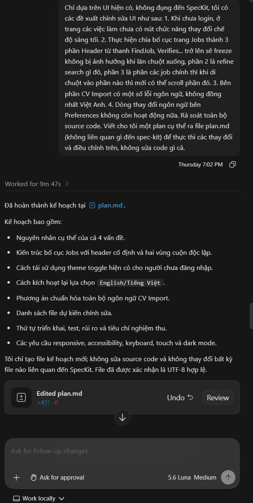
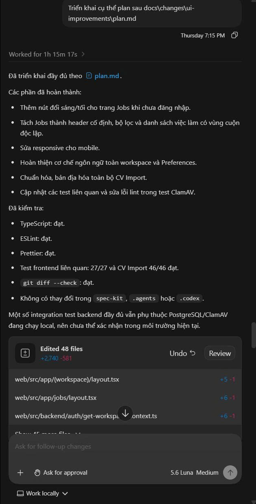
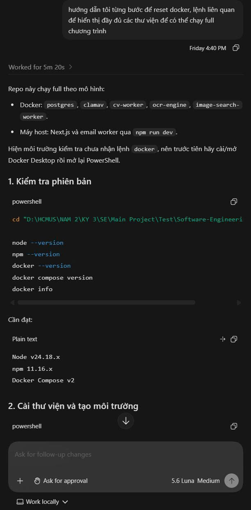

# AI Usage Report for PA4

**Student Name:** Nguyễn Gia Quốc Uy  
**Student ID:** 24127261  
**Group:** 09  
**Class:** 24C11  
**Course/Project:** Software Engineering — SmartHire  
**Reporting Period:** 26/07/2026–08/08/2026  

---

## AI Usage Notes

I primarily used Vietnamese in my prompts because it allowed me to describe project context, ask follow-up questions, and verify my understanding efficiently. The official PA4 architecture deliverables were prepared in English.

The AI was used as a planning, explanation, architecture-research, document-drafting, review, and quality-assurance assistant. It was not treated as an authoritative source and did not independently make final project, architecture, or task-allocation decisions.

I reviewed AI responses against:

- The official PA4 assignment.
- The existing SmartHire repository.
- Implemented dependencies and infrastructure configurations.
- The PA1–PA3 requirements and use-case documents.
- The actual PA4 functional groups.
- Team discussions and task assignments.
- C4 and UML modeling conventions.
- Git changes, rendered diagrams, tests, and supporting evidence.

During the initial planning activities, I explicitly requested that the AI not implement or modify source code. Its role was limited to analysis, planning, explanation, and document preparation. Later documentation-related changes were reviewed against repository evidence before being accepted.

The prompts recorded below are concise representations of the corresponding conversations. Exact hours and screenshots should be added from the original Codex task history if required for submission.

---

## Use Case 1 - Analyzing the PA4 Requirements and Current Project Progress

- **Tool name, version, and platform:** OpenAI Codex, GPT-5 family, Codex desktop application
- **Access time:** 26/07/2026; 10:12PM
- **Prompt used:** “Đây là kế hoạch PA4 cho đồ án SE từ ngày 27/07 đến 00h00 ngày 9/8, hãy scan các nội dung có trong đồ án hiện tại, nhận xét tổng quan tiến đồ, đồng thời giải thích chi tiết PA4 sẽ nói về hạn mục nào, cần làm những công việc ra sao, dễ thích dễ hiểu giúp tôi và có thể phân chia công việc tổng quan đơn giản trước mắt dựa trên các công việc đã thực hiện trong 3 PA trước.”
- **Purpose of use:** Understand the official PA4 requirements, compare them with the existing SmartHire project, and identify the remaining workload.
- **AI-generated content:** The AI analyzed the PA4 assignment, summarized the six graded sections, inspected the existing project structure, explained the expected deliverables, and identified dependencies between the revised use cases, architecture documentation, functional-group implementation, reports, and submission evidence.
- **Student contribution and validation:** I supplied the PA4 assignment and project context, restricted the task to analysis rather than implementation, reviewed the results, and selected only the items relevant to the team’s actual progress and deadline.
- **Evidence:** Add a screenshot from the corresponding Codex conversation.

---

## Use Case 2 - Understanding Sections B, C, and D of PA4

- **Tool name, version, and platform:** OpenAI Codex, GPT-5 family, Codex desktop application
- **Access time:** 28/07/2026; 4:54:PM
- **Prompt used:** “Giải thích chi tiết hơn về cách làm và yêu cầu của phần B, C, D trong PA4.”
- **Purpose of use:** Understand the expected content, abstraction level, written explanations, and grading risks of the architecture deliverables.
- **AI-generated content:** The AI explained:
  - The Technology Stack documentation.
  - C4 Level 1 — System Context Diagram.
  - C4 Level 2 — Container Diagram.
  - C4 Level 3 — Frontend and Backend Component Diagrams.
  - The Deployment Diagram.
  - Required responsibilities, technologies, relationships, protocols, and written descriptions.
  - Common mistakes such as including internal classes in Level 1 or documenting unimplemented external systems.
- **Student contribution and validation:** I compared the explanation with the PA4 assignment and the current SmartHire repository. I retained the requirement that every diagram must reflect the actual implementation at submission time.
- **Evidence:** Add a screenshot from the corresponding Codex conversation.

---

## Use Case 3 - Producing Reference C4 and Deployment Diagrams

- **Tool name, version, and platform:** OpenAI Codex, GPT-5 family, Codex desktop application
- **Access time:** 28/07/2026; 5:24PM
- **Prompt used:** “Hãy vẽ thử cho tôi toàn bộ các diagram cần có để tôi tham khảo thử thực sự nó là gì.”
- **Purpose of use:** Obtain concrete visual examples of the required PA4 diagrams before the team created the final evidence-based versions.
- **AI-generated content:** The AI produced reference Mermaid diagrams for:
  - System Context.
  - Container.
  - Frontend Component.
  - Backend Component.
  - Email Worker Component.
  - Deployment.
- **Student contribution and validation:** I treated these diagrams as learning references rather than final project artifacts. I required the final team diagrams to remove optional systems that were not implemented and to use names, protocols, containers, and components verified from the source code.
- **Evidence:** Add screenshots of the generated reference diagrams.

---

## Use Case 4 - Reviewing the PA4 Work Breakdown and Team Schedule

- **Tool name, version, and platform:** OpenAI Codex, GPT-5 family, Codex desktop application
- **Access time:** 28/07/2026; 5:41:PM
- **Prompts used:** “Đây là những gì tôi đã summary lại cho nhóm tôi, phần nào trống là tôi sẽ tự self-review các thông tin trước rồi thêm vào, bạn hãy giúp tôi tổng hợp khối lượng công việc cần thực hiện bằng cách đưa ra các bullet thôi được rồi, ngoài ra nhận xét bản summray”
- **Purpose of use:** Review the feasibility, task dependencies, ownership, and timeline of the team’s PA4 plan.
- **AI-generated content:** The AI:
  - Grouped the workload into PA4 sections A–F.
  - Distinguished tasks that could start early from tasks that depended on completed implementation.
  - Identified the two functional groups as the critical path.
  - Recommended completing 100% of Must-have end-to-end flows and removing Optional scope if necessary.
  - Suggested phased ownership for Uy, Thành, Tuấn, Khôi, and Hải.
  - Identified risks in postponing AI reports, `Changes.md`, video recording, and submission packaging.
- **Student contribution and validation:** I repeatedly revised the plan based on actual team capacity and retained final decision-making authority. I assigned Thành and Tuấn to the main functional-group implementation, Khôi and Hải to architecture preparation and diagrams, Hải to weekly evidence, and myself to coordination, integration, use-case review, Tech Stack, `Changes.md`, and final submission.
- **Evidence:** Add screenshots showing the original plan, AI review, and revised plan.

---

## Use Case 5 - Clarifying the Modular-Monolith Architecture

- **Tool name, version, and platform:** OpenAI Codex, GPT-5 family, Codex desktop application
- **Access time:** 29/07/2026; 1:56-59PM
- **Prompts used:**
  - “Modular monolith là gì trong đồ án này của nhóm tôi?”
  - “Nó có ngược lại với việc chia hai thư mục frontend và backend không?”
- **Purpose of use:** Understand how the SmartHire codebase should be represented in the Container and Component Diagrams.
- **AI-generated content:** The AI explained that SmartHire’s core was organized as one deployable application with internal modules and layers. It clarified that directory structure alone does not determine architecture: frontend and backend code may be separated internally while still belonging to one modular monolith.
- **Student contribution and validation:** I checked the explanation against the repository organization and used it to avoid incorrectly documenting Candidate Profile, Job Discovery, or Authentication as independently deployed microservices.
- **Evidence:** Add a screenshot from the corresponding Codex conversation.

---

## Use Case 6 - Auditing the Use-Case Model and Documentation Consistency

- **Tool name, version, and platform:** OpenAI Codex, GPT-5 family, Codex desktop application
- **Access time:** 06/08/2026; 8:48AM
- **Prompt used:** “KHÔNG đụng đến các file plan.md trong speck-kit hay các phần liên quan đến speckit, thầy tôi có nhận xét về UC và các UC Diagrams đã tạo trong analysis-and-desing như sau: "UC model: phải nhất quán background và không nên sử dụng dark mode trong báo cáo; sai hướng generalization trong diagram 3 và 5; một số quan hệ <<include>> chưa đúng như UC-PIPE-03 với UC-PIPE-02; không dùng <<extend>> làm workflow như UC-POST-02 với UC-POST-01. UC specs: prototype không được tách riêng; còn lỗi tiếng Anh và lỗi biên tập" Tôi cần chỉnh sửa sao cho đúng với ý của thầy, nên bạn hãy rà soát toàn bộ các UC và các phần liên quan, đề xuất chỉnh sửa giúp tôi và viết toàn bộ kế hoạch chỉnh sửa vào một file plan.md độc lập nằm trong thư mục đó cũng được, trong đó phải đầy đủ giải thích các phần sai, nên chỉnh sửa ở đâu như thế nào sao cho ổn nhất, tốt nhất”
- **Purpose of use:** Identify inconsistencies in the revised PA4 use-case submission and its relationship with earlier PA artifacts.
- **AI-generated content:** The AI helped identify:
  - Mixed diagram themes.
  - Incorrect actor-generalization directions.
  - Workflow-like misuse of `include` and `extend`.
  - Inconsistent actor and use-case names.
  - Duplicated or unsynchronized specifications.
  - Missing or misplaced prototype evidence.
  - Editorial and link inconsistencies.
- **Student contribution and validation:** I reviewed every proposed issue against the Markdown sources, rendered diagrams, lecturer feedback, prototype links, and intended business meaning. I decided which relationships should be removed or retained and limited the correction scope to approved documentation changes.
- **Evidence:** Add screenshots of the review findings and corrected diagrams.

---

## Use Case 7 — Planning UI Improvements from the Existing Application

- **Tool name, version, and platform:** OpenAI Codex, GPT-5 family, Codex desktop application
- **Access time:** 06/08/2026; 7:02PM
- **Prompt used:** “Chỉ dựa trên UI hiện có, không đụng đến SpecKit, tôi có các đề xuất chỉnh sửa UI như sau: 1. Khi chưa login, ở trang các việc làm chưa có nút chức năng thay đổi chế độ sáng tối. 2. Thực hiện chia bố cục trang Jobs thành 3 phần Header từ thanh FindJob, Verifies... trở lên sẽ freeze không bị ảnh hưởng khi lăn chuột xuống, phần 2 là refine search gì đó, phần 3 là phần các job chính thì khi di chuột vào phần nào thì mới có thể scroll phần đó. 3. Bên phần CV Import có một số lỗi ngôn ngữ, không đồng nhất Việt Anh. 4. Dòng thay đổi ngôn ngữ bên Preferences không còn hoạt động nữa. Rà soát toàn bộ source code. Viết cho tôi một plan cụ thể ra file plan.md (không liên quan gì đến spec-kit) để thực thi các thay đổi và điều chỉnh trên, không sửa code gì cả.”

- **Purpose of use:** Audit the existing UI implementation and prepare an implementation-ready plan for four UI issues without modifying application source code or any SpecKit artifact.

- **AI-generated content:** The AI inspected the existing theme system, Jobs layout and scroll behavior, CV Import presentation strings, Preferences locale flow, related tests, and workspace structure. It documented the suspected causes, proposed a scoped UI and locale design, listed the expected files, defined implementation phases, testing steps, risks, responsive and accessibility requirements, and acceptance criteria. The plan was saved to `docs/changes/ui-improvements/plan.md`.

- **Student contribution and validation:** I defined the four UI requirements and explicitly restricted the task to the existing UI. I also required that SpecKit files and folders remain untouched and that no source code be modified during the planning phase. I reviewed the proposed file scope, implementation order, responsive behavior, accessibility requirements, and acceptance criteria. I verified that the plan was UTF-8 encoded and independent from SpecKit. No application source code was changed during this interaction.

- **Evidence:** Add a screenshot from the corresponding Codex conversation and the created `plan.md` review.

---

## Use Case 8 — Implementing and Verifying the Approved UI Plan

- **Tool name, version, and platform:** OpenAI Codex, GPT-5 family, Codex desktop application
- **Access time:** 06/08/2026; 7:15PM
- **Prompt used:** “Triển khai cụ thể plan sau docs\changes\ui-improvements\plan.md”

- **Purpose of use:** Implement the approved UI-only plan and verify that the four requested improvements worked without modifying SpecKit or unrelated project scope.

- **AI-generated content:** The AI implemented the approved changes across the existing application UI and related tests, including:

  - Adding a light/dark theme toggle to the public Jobs header for unauthenticated users.
  - Splitting the Jobs page into a fixed header area, a Refine Search pane, and an independently scrollable job-results pane.
  - Adding responsive behavior for mobile and smaller screen sizes.
  - Restoring workspace locale propagation and enabling the English/Tiếng Việt selection in Preferences.
  - Replacing scattered CV Import strings and raw technical status labels with consistent localized presentation content and formatters.
  - Updating related frontend tests and fixing the reported lint issue in the ClamAV test.

- **Student contribution and validation:** I authorized implementation only after reviewing the separate UI plan. I checked that the changes remained within the existing application UI and related test scope. I verified that no SpecKit file or folder was modified. The reported verification results were successful for TypeScript, ESLint, Prettier, and `git diff --check`. The related frontend tests passed with 27/27 tests, and the CV Import tests passed with 46/46 tests. Full backend integration tests remained dependent on PostgreSQL and ClamAV being available locally.

- **Evidence:** Add screenshots of the implementation diff, test results, and final UI states from the corresponding Codex conversation.

## Use Case 9 — Resetting Docker and Verifying the Full Local Runtime

- **Tool name, version, and platform:** OpenAI Codex, GPT-5 family, Codex desktop application
- **Access time:** 07/08/2026; 4:40PM

- **Prompt used:** “Hướng dẫn tôi từng bước để reset Docker, các lệnh liên quan để hiển thị đầy đủ các thư viện để có thể chạy full chương trình.”

- **Purpose of use:** Understand how to reset the project-local Docker environment, recreate the local database, inspect all project dependencies and services, and run the complete SmartHire development environment.

- **Which content was generated by AI:** The AI explained the local runtime architecture, including PostgreSQL, ClamAV, CV Worker, OCR Engine, Image Search Worker, the Next.js application, and the email worker. It provided commands to:

  - Check Node.js, npm, Docker, and Docker Compose versions.
  - Install dependencies with `npm ci`.
  - Initialize environment files with `npm run env:init`.
  - Reset the local PostgreSQL database using `npm run db:reset`.
  - Validate the environment using `npm run env:check`.
  - Start the complete development environment using `npm run dev`.
  - Display installed workspace libraries using `npm ls --depth=0 --workspaces` and `npm ls --all --workspaces`.
  - Inspect Docker services, images, containers, and logs.
  - Display Python packages inside the OCR container using `pip freeze`.
  - Diagnose PostgreSQL, ClamAV, OCR, CV Worker, and Image Search Worker failures.

- **Which content was done independently and how the student edited or validated it:** I requested a project-specific procedure for resetting Docker and running the full SmartHire application. I reviewed the proposed commands against the repository's `package.json`, `compose.yaml`, `README.md`, and local development scripts. I distinguished the project-local database reset from global Docker cleanup and retained the warning that `docker system prune -a --volumes` should not be used unless all Docker data on the machine is intentionally disposable. No source code or SpecKit file was modified during this interaction.

- **Screenshots or chat history:** Add a screenshot of the Codex conversation showing the Docker reset, dependency inspection, and full-runtime commands.

## AI Contribution

Throughout PA4, AI supported the project in the following areas:

| Area | AI Contribution | Student Responsibility and Validation |
|---|---|---|
| PA4 requirement analysis | Summarized the PA4 deliverables, grading sections, dependencies, and remaining workload based on the current project state. | Compared the analysis with the official PA4 assignment and selected only tasks relevant to the team's actual progress. |
| Architecture learning | Explained the C4 Model, including System Context, Container, Component, and Deployment Diagrams. | Verified the explanation against the repository and ensured that the final architecture reflected the implemented system. |
| Reference diagrams | Generated sample Mermaid diagrams for the required architecture views. | Used them only as learning references and removed unsupported systems, containers, and components from the final diagrams. |
| Task planning | Reviewed the PA4 workload, task dependencies, critical path, team responsibilities, and submission risks. | Adjusted the proposed schedule according to team capacity, deadlines, and actual member assignments. |
| Modular-monolith analysis | Explained how SmartHire could remain a modular monolith even though frontend and backend code were organized in separate directories. | Verified the interpretation against the repository and avoided incorrectly documenting internal modules as independently deployed microservices. |
| Use-case documentation review | Identified inconsistent themes, incorrect actor generalizations, misuse of `include` and `extend`, duplicated specifications, missing prototype evidence, and editorial issues. | Reviewed each finding against lecturer feedback, source documents, prototype links, and the intended business meaning before approving changes. |
| UI planning | Audited the existing Jobs, CV Import, and Preferences interfaces and created a detailed implementation plan for four UI issues. | Defined the requirements, restricted the scope to the existing UI, prohibited SpecKit changes, and reviewed the plan before implementation. |
| UI implementation | Implemented the approved UI changes, including the public theme toggle, Jobs layout, independent scrolling, locale selection, CV Import localization, and related tests. | Reviewed the implementation scope, verified that SpecKit was not modified, and checked TypeScript, ESLint, Prettier, `git diff --check`, and relevant test results. |
| Docker and runtime setup | Explained how to reset the project-local Docker database, initialize dependencies, start all services, inspect installed libraries, and diagnose service failures. | Verified the commands against `package.json`, `compose.yaml`, `README.md`, and local development scripts. Unsafe global Docker cleanup was explicitly excluded. |

AI was mainly used to accelerate requirement understanding, architecture research, documentation drafting, codebase review, UI implementation, environment setup, and quality assurance. AI-generated outputs were treated as drafts or technical assistance rather than authoritative decisions.

The final decisions regarding project scope, architecture, UML relationships, UI behavior, task ownership, implementation boundaries, and submission content were made by me and the team. All generated content and code changes were reviewed against the actual SmartHire repository, project requirements, test results, Git changes, and team agreements.