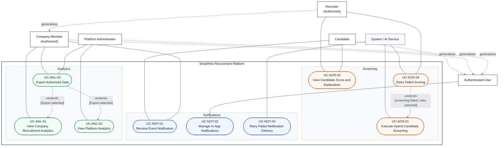

# Consolidated Use-Case Specification

> **Status:** Implemented and synchronized with the five domain specifications and use-case diagrams.
>
> This file is the consolidated report-facing specification. The authoritative domain files remain in ./specification/. Prototype evidence is embedded directly in each use-case section; the coverage files are indexes and QA appendices.

## Shared Modeling Rules

- Report diagrams use a consistent light background and dark text.
- Use «include» only for mandatory reusable behavior.
- Use «extend» only for optional or conditional behavior at an extension point; it is not used to represent a normal workflow sequence.
- Actor generalization arrows point from the specialized actor to the parent actor.
- A related use case or entry point is documented in prose when two independent user goals are connected but neither behavior is mandatory or conditionally inserted into the other.
- Prototype evidence is placed inside the corresponding use-case specification rather than in a separate standalone section.

## DGM-01 - Identity, Access, and Candidate Profile

See the split source: [01_Identity_Access_Profile.md](./specification/01_Identity_Access_Profile.md).

# DGM-01 - Specification of Identity, Access, and Profile

## Use-Case Specifications

*Performed by: Nguyen Gia Quoc Uy | Reviewed by: Group 9 | Edited by: Nguyen Gia Quoc Uy*
**Version:** V1.4 (25/07/2026) — Reconciled with PA3 implementation; added 2FA, owned-session management, and full account recovery
**Version History:**
- V1.1 (20/7/2026) - First initialization (UC1 --> 3)
- V1.2 (22/7/2026) - Second initialization (UC3 --> 7)
- V1.3 (23/7/2026) - Third initialization (UC7 --> 12)

# 1. UC-AUTH-01 — Register Account

## 1.1. Use-Case Information
| Field | Value |
|---|---|
| **Use-Case ID** | UC-AUTH-01 |
| **Use-Case Name** | Register Account |
| **Primary Actor** | Visitor |
| **Supporting Actor** | Email Delivery Service |
| **Priority** | High |
| **Trigger** | The visitor selects **Create account** |

## 1.2. Brief Description
This use case allows a visitor to create a standard SmartHire account by providing a full name, email address, and password. The system creates a pending account and sends an email-verification message.

## 1.3. Preconditions
1. The visitor does not have an active authenticated session.
2. The registration service and account database are available.
3. The visitor can access the supplied email address.

## 1.4. Basic Flow
1. The Visitor selects **Create account**.
2. The System displays the registration form.
3. The Visitor enters full name, email address, password, and password confirmation.
4. The System validates that the password contains at least one uppercase letter, one lowercase letter, one number, and one special character.
5. The Visitor accepts the Terms of Service and submits the form.
6. The System validates the submitted information.
7. The System verifies that the email address is not already associated with an account.
8. The System securely hashes the password.
9. The System creates an account with the PENDING_VERIFICATION status.
10. The System creates a single-use email-verification token.
11. The Email Delivery Service sends a verification message.
12. The System displays the verification-pending page.
13. Account activation continues through **UC-AUTH-02 — Verify Email Address**.

## 1.5. Alternative Flows

### 1.5.1. AF-01 — Required Information Is Missing
At Step 6, if a required field is missing:
1. The System highlights the missing fields.
2. The System preserves valid entered information.
3. The use case resumes at Step 3.

### 1.5.2. AF-02 — Email Format Is Invalid
At Step 5, if the email format is invalid:
1. The System displays an email-format-validation message.
2. The use case resumes at Step 3.

### 1.5.3. AF-03 — Password Does Not Satisfy the Rule
At Step 4, if the password does not match the rule:
1. The System displays the applicable password requirements.
2. The System clears the password fields.
3. The use case resumes at Step 3.

### 1.5.4. AF-04 — Password Confirmation Does Not Match
At Step 5, if the two password values do not match:
1. The System displays a password-mismatch message.
2. The use case resumes at Step 3.

### 1.5.5. AF-05 — Email Address Is Already Registered
At Step 6, if the email is already associated with an account:
1. The System displays a neutral response instructing the Visitor to check the email inbox or log in.
2. The System does not disclose detailed account status.
3. The use case ends without creating another account or the Visitor try another email which is not associated with any account.

### 1.5.6. AF-06 — Visitor Cancels Registration
Before Step 8, the Visitor may leave or cancel the form. The System does not create an account.

### 1.5.7. EF-01 — Email Delivery Fails
At Step 11, if the verification message cannot be delivered
1. The System retains the pending account.
2. The System records the failed delivery.
3. The System displays the verification-pending page with a resend option.
4. The use case ends.

### 1.5.8. EF-02 — Account Creation Fails
At Step 9, if the account cannot be saved:
1. The System does not report successful registration.
2. The System records the failure.
3. The System displays a general retry message.
4. The use case ends.

## 1.6. Postconditions
### 1.6.1. Success Postconditions
- A pending account exists.
- A verification token has been generated.
- A verification message has been sent or scheduled.
- No authenticated session has been established.

### 1.6.2 Failure Postconditions
- No incomplete active account is created.
- Password values are never stored or logged in plain text.

## 1.7. Special Requirements
- Passwords must be hashed using an approved adaptive password-hashing algorithm.
- The registration endpoint must enforce abuse-control limits.
- Verification tokens must be single-use, securely generated, and time-limited.
- Sensitive values must not appear in logs or URLs other than the required opaque token.

## Prototype Evidence

*Figure 1.1 — UC-AUTH-01 basic flow; the Visitor enters registration data.*

*Figure 1.2 — UC-AUTH-01 alternative-flow evidence; validation feedback is shown without creating an account.*

## Related Use Cases and Entry Points
### Email Verification
After the pending account is created, the Visitor may start UC-AUTH-02 to activate it. Email verification is a separate goal, not a mandatory sub-flow of registration.

---
# 2. UC-AUTH-02 — Verify Email Address

## 2.1. Use-Case Information
| Field | Value |
|---|---|
| **Use-Case ID** | UC-AUTH-02 |
| **Use-Case Name** | Verify Email Address |
| **Primary Actor** | Visitor |
| **Supporting Actor** | Email Delivery Service |
| **Priority** | High |
| **Trigger** | The Visitor opens an email-verification link. |

## 2.2. Brief Description
This use case confirms that the Visitor controls the registered email address and activates the corresponding pending account.

## 2.3. Preconditions
1. A pending account exists.
2. A verification token has been issued for the account

## 2.4. Basic Flow
1. The Visitor opens the verification link.
2. The System extracts the verification token.
3. The System validates the token’s signature, purpose, expiration time, and unused status.
4. The System finds the corresponding pending account.
5. The System marks the email address as verified.
6. The System changes the account status to ACTIVE.
7. The System invalidates the verification token.
8. The System records the verification event.
9. The System displays a verification-success page with a login action.

## 2.5. Alternative Flows

### 2.5.1. AF-01 — Verification Token Is Invalid
At Step 3, if the token is invalid, the System displays a neutral invalid-link message and offers a new verification-message request.

### 2.5.2. AF-02 — Verification Token Has Expired
At Step 3, if the token has expired, the System displays an expired-link message and offers a resend action.

### 2.5.3. AF-03 — Token Has Already Been Used
At Step 3, if the token has already been used, the System displays a neutral message indicating that the link is no longer valid.

### 2.5.4. AF-04 — Account Is Already Verified
At Step 4, if the account is already active, the System displays the verification-success page without changing the account.

### 2.5.5. AF-05 — Visitor Requests Another Verification Message
1. The Visitor submits the email address.
2. The System displays the same neutral response regardless of whether a matching account exists.
3. If an eligible pending account exists, the System invalidates previous verification tokens and sends a new token.

### 2.5.6. AF-06 — Resend Is Rate-Limited
If fewer than 60 seconds have passed since the previous request, or the hourly limit is exceeded, the System displays the remaining cooldown time.

### 2.5.7. EF-01 — Activation Cannot Be Saved
If Steps 5–7 cannot be committed atomically, the System rolls back the operation, records the failure, and displays a retry message.

## 2.6. Postconditions
- On success, the account is active and the email address is verified.
- The used verification token cannot be used again.
- On the failure, the account remains in its  previous consistent state.

## 2.7. Special Requirements
- Token validation must not expose internal token contents.
- Invalid-token attempts must be rate-limited.
- Account activation and token invalidation must be atomic.
- Resend responses must prevent account enumeration.

## Prototype Evidence

*Figure 2.1 — UC-AUTH-02 basic flow; the verification link activates the pending account.*

*Figure 2.2 — UC-AUTH-02 AF-06; resend is rate-limited with a visible cooldown.*

---
# 3. UC-AUTH-03 — Log In

## 3.1. Use-Case Information
| Field | Value |
|---|---|
| **Use-Case ID** | UC-AUTH-03 |
| **Use-Case Name** | Log In |
| **Primary Actor** | Visitor |
| **Supporting Actor** | None |
| **Priority** | High |
| **Trigger** | The Visitor submits the login form.|

## 3.2. Brief Description
This use case validates the primary email-and-password factor. It establishes a secure full session immediately only when the account does not require two-factor authentication; otherwise it creates a restricted, short-lived challenge completed by **UC-AUTH-09**.

## 3.3. Preconditions
1. The Visitor is not currently authenticated.
2. An active, verified account exists.

## 3.4. Basic Flow
1. The Visitor opens the login page.
2. The System displays the login form.
3. The Visitor enters an email address and password.
4. The Visitor submits the form.
5. The System validates the request format.
6. The System finds the account using the normalized email address.
7. The System verifies the password.
8. The System verifies that the account is active and permitted to log in.
9. The System determines whether two-factor authentication is enabled for the account.
10. If two-factor authentication is not enabled, the System creates a secure authenticated session and rotates its identifier.
11. The System records the successful login without recording credentials.
12. The System redirects the Authenticated User to the requested protected page or default dashboard.

## 3.5. Alternative Flows

### 3.5.1. AF-01 — Invalid Credentials
At Steps 6–7, if the account is not found or the password is incorrect:
1. The System records the failed attempt.
2. The System displays the same neutral invalid-credentials message.
3. The use case resumes at Step 3.

### 3.5.2. AF-02 — Email Is Not Verified
At Step 8, if the account is pending verification, the System displays a verification-required message with a resend option.

### 3.5.3. AF-03 —  Account Is Temporarily Locked
At Step 8, if the account is temporarily locked, the System displays a neutral temporary-restriction message.

### 3.5.4. AF-04 — Account Is Suspended or Disabled
At Step 8, the System denies access and provides the permitted support or appeal instruction.

### 3.5.5. AF-05 — Visitor Selects Forgot Password
At Step 2, the use case invokes **UC-AUTH-05 — Reset Forgotten Password**.

### 3.5.6. AF-06 — Valid Session Already Exists
If a valid session exists, the System redirects the user to the requested page without creating another session.

### 3.5.7. AF-07 — Login Rate Limit Is Exceeded
If the account or source exceeds the configured limit, the System rejects the attempt and displays a retry-later message.

### 3.5.8. EF-01 — Authentication Service Is Unavailable
The System does not establish a session and displays a temporary-unavailability message.

### 3.5.9. AF-08 — Two-Factor Authentication Is Enabled
At Step 9, if two-factor authentication is enabled:
1. The System creates only a restricted, short-lived pre-authentication challenge.
2. The System does not create a full authenticated session and does not authorize protected resources.
3. The System redirects the Visitor to **UC-AUTH-09 — Complete Two-Factor Verification**.
4. Login completes only after the TOTP or backup-code challenge succeeds.

### 3.5.10. AF-09 — Full Account Recovery Is Required
If the Visitor has lost the password, TOTP access, and every backup code, the Visitor may initiate **UC-AUTH-11 — Recover Account After Loss of All Factors**. The System does not disable 2FA through ordinary login support or ordinary password reset.

## 3.6. Postconditions
- On success without 2FA, a valid authenticated session exists.
- When 2FA is enabled, only a restricted challenge exists until **UC-AUTH-09** succeeds.
- On failure, no session is created.
- Login success or failure is recorded without logging the password.

## 3.7. Special Requirements
- Login errors must not reveal whether an account exists.
- Five failed attempts per account or 20 attempts per IP address within 15 minutes trigger the configured cooldown.
- Session identifiers must be regenerated after authentication.
- Authentication cookies must be secure and inaccessible to client-side scripts.

## Prototype Evidence

*Figure 3.1 — UC-AUTH-03 basic flow; the Visitor submits primary credentials.*

*Figure 3.2 — UC-AUTH-03 postcondition; a successful login redirects to the protected workspace.*

## 3.8. Related Use Cases and Entry Points
- **Forgot Password:** At the login form, the Visitor may start **UC-AUTH-05 — Reset Forgotten Password**.
- **Two-Factor Challenge:** When 2FA is enabled, **UC-AUTH-09 — Complete Two-Factor Verification** is inserted at the explicit extension point after primary credentials are validated and before a full session is created.
- **Loss of All Factors:** A Visitor who cannot use the password, TOTP, or any backup code may start **UC-AUTH-11 — Recover Account After Loss of All Factors**.
- **Protected Page Authentication:** When **UC-AUTH-07 — Access Protected Account Page** finds no valid session, it directs the person to this login goal. The page-access goal is not modeled as an extension of login.

---

# 4. UC-AUTH-04 — Log Out and End Session

## 4.1. Use-Case Information
| Field | Value |
|---|---|
| **Use-Case ID** | UC-AUTH-04 |
| **Use-Case Name** | Log Out and End Session |
| **Primary Actor** | Authenticated User |
| **Supporting Actor** | None |
| **Priority** | High |
| **Trigger** | The Authenticated User selects **Log Out**|

## 4.2. Brief Description
This use case securely terminates the current authenticated session.

## 4.3. Preconditions
- The user has or recently had an authenticated session

## 4.4. Basic Flow
1. The Authenticated User opens the account menu.
2. The System displays the available account actions.
3. The Authenticated User selects **Log out**.
4. The System identifies the current session.
5. The System revokes the server-side session or refresh credential.
6. The System clears the authentication cookies.
7. The System records the logout event.
8. The System redirects the Visitor to the public home or login page.

## 4.5. Alternative Flows

### 4.5.1. AF-01 — Session Has Already Expired
The System clears any remaining local authentication data and redirects the Visitor to the login page.

### 4.5.2. EF-01 — Server-Side Revocation Fails
1. The System still clears local authentication cookies.
2. The System records or queues the revocation failure.
3. The System redirects the Visitor to the public page.
4. The System does not prevent the local logout from completing.

## 4.6. Postconditions
- The current browser no longer has usable authentication credentials.
- Protected pages require authentication again.

## 4.7. Special Requirements
- Logout must be idempotent.
- Failure to write an audit record must not prevent session invalidation.
- Cached protected content must not remain available after logout.

## Prototype Evidence

*Figure 4.1 — UC-AUTH-04 basic flow; the current session has ended and protected content is no longer displayed.*

---

# 5. UC-AUTH-05 — Reset Forgotten Password

## 5.1. Use-Case Information
| Field | Value |
|---|---|
| **Use-Case ID** | UC-AUTH-05 |
| **Use-Case Name** | Reset Forgotten Password |
| **Primary Actor** | Visitor |
| **Supporting Actor** | Email Delivery Service |
| **Priority** | High |
| **Trigger** | The Visitor selects **Forgot password**.|

## 5.2. Brief Description
This use case allows a Visitor who has forgotten the password to establish a new password through a time-limited email reset link. It is not the lower-assurance full-account-recovery procedure and does not disable an existing TOTP factor or unused backup codes.

## 5.3. Preconditions
- The Visitor is not required to be authenticated.
- The Visitor can access the registered email inbox.

## 5.4. Basic Flow
1. The Visitor selects Forgot password.
2. The System displays the password-recovery form.
3. The Visitor enters an email address.
4. The System accepts the request and displays a neutral response.
5. The System finds an eligible account without revealing the result.
6. The System creates a single-use password-reset token.
7. The Email Delivery Service sends the password-reset message.
8. The Visitor opens the reset link.
9. The System validates the reset token.
10. The System displays the new-password form.
11. The Visitor enters and confirms a new password.
12. The System validates the new password.
13. The System securely updates the password.
14. The System invalidates the reset token and existing account sessions.
15. The System invalidates outstanding authentication challenges and queues one password-change security notification.
16. The System preserves enabled TOTP and every unused backup code.
17. The System displays a password-reset-success page and requires a normal login; it does not create a session automatically.

## 5.5. Alternative Flows

### 5.5.1. AF-01 — Email Is Invalid or Not Registered
The System displays the same neutral response as Step 4 and does not disclose whether an account exists.

### 5.5.2. AF-02 — Reset Token Is Invalid, Expired, or Used
At Step 9, the System displays an invalid-or-expired-link page with an option to request another message.

### 5.5.3. AF-03 — Password Does Not Satisfy Policy
At Step 12, the System displays the applicable password requirements and resumes at Step 11.

### 5.5.4. AF-04 — Password Confirmation Does Not Match
The System displays a mismatch message and resumes at Step 11.

### 5.5.5. AF-05 — New Password Matches Current Password
The System asks the Visitor to choose a different password.

### 5.5.6. EF-01 — Email Delivery Fails
The System retains the neutral public response, records the delivery failure, and does not reveal the account status.

### 5.5.7. EF-02 — Password Update Fails
The System preserves the old password, keeps the reset operation consistent, and displays a retry message.

## 5.6. Postconditions
- On success, the password is replaced and previous sessions are invalidated.
- Existing TOTP configuration and unused backup codes remain enabled.
- No authenticated session is created automatically.
- The used reset token cannot be reused.
- On failure, the existing password remains valid unless the update was committed successfully.

## 5.7. Special Requirements
- Public recovery responses must prevent account enumeration.
- Reset tokens must be single-use and time-limited.
- Reset links must use HTTPS.
- Recovery requests must be rate-limited and audited.
- A normal password reset must preserve TOTP and unused backup codes; loss of every factor is handled only by **UC-AUTH-11**.

## Prototype Evidence

*Figure 5.1 — UC-AUTH-05 basic flow; the Visitor requests a normal password reset.*

*Figure 5.2 — UC-AUTH-05 completion state; the new password is set without creating a session automatically.*

---

# 6. UC-AUTH-06 — Change Password

## 6.1. Use-Case Information
| Field | Value |
|---|---|
| **Use-Case ID** | UC-AUTH-06 |
| **Use-Case Name** | Change Password |
| **Primary Actor** | Authenticated User |
| **Supporting Actor** | None |
| **Priority** | High |
| **Trigger** | The Authenticated User selects **Change password**.|

## 6.2. Brief Description
This use case allows an Authenticated User to replace the current account password.

## 6.3. Preconditions
1. The user has a valid authenticated session.
2. The account uses password-based authentication.

## 6.4. Basic Flow
1. The Authenticated User opens account security settings.
2. The System displays the change-password form.
3. The Authenticated User enters the current password.
4. The Authenticated User enters and confirms a new password.
5. The System verifies the current password.
6. The System validates the new password and confirmation.
7. The System securely hashes and stores the new password.
8. The System invalidates other active account sessions.
9. The System records the password-change event.
10. The System displays a success confirmation.

## 6.5. Alternative Flows

### 6.5.1. AF-01 — Current Password Is Incorrect
The System displays a neutral error and resumes at Step 3.

### 6.5.2. AF-02 — New Password Violates Policy
The System displays the applicable requirements and resumes at Step 4.

### 6.5.3. AF-03 — Password Confirmation Does Not Match
The System displays a mismatch message and resumes at Step 4.

### 6.5.4. AF-04 — New Password Equals Current Password
The System requires the user to choose a different password.

### 6.5.5. AF-05 — User Cancels the Change
Before Step 7, the user cancels. The existing password remains unchanged.

### 6.5.6. AF-06 — Session Has Expired
The System redirects the user to login and preserves no password values.

### 6.5.7. EF-01 — Password Update Fails
The System keeps the existing password, records the failure, and displays a retry message.

## 6.6. Postconditions
- On success, the new password is active
- Other active sessions are invalidated.
- On failure, the existing password remains unchanged.

## 6.7. Special Requirements
- Password values must never be logged.
- The current password must be reverified before the change.
- The update and session invalidation must be performed consistently.

## Prototype Evidence

*Figure 6.1 — UC-AUTH-06 basic flow; the authenticated user submits a password change.*

*Figure 6.2 — UC-AUTH-06 alternative-flow evidence; invalid password input is rejected.*

---

# 7. UC-AUTH-07 — Access Protected Account Page

## 7.1. Use-Case Information
| Field | Value |
|---|---|
| **Use-Case ID** | UC-AUTH-07 |
| **Use-Case Name** | Access Protected Account Page |
| **Primary Actor** | Authenticated User |
| **Supporting Actor** | None |
| **Priority** | High |
| **Trigger** | A person requests a protected account page.|

## 7.2. Brief Description
This use case verifies the requester's session and authorization before displaying a protected account page.

## 7.3. Preconditions
- The requested route is classified as protected

## 7.4. Basic Flow

1. The Authenticated User requests a protected account page.
2. The System reads the authentication credential.
3. The System validates the session.
4. The System loads the account and applicable authorization context.
5. The System verifies that the account is active.
6. The System verifies that the user is authorized to access the requested resource.
7. The System displays the protected page.

## 7.5. Alternative Flows

### 7.5.1. AF-01 — No Authenticated Session Exists
The System invokes UC-AUTH-03 — Log In and retains the requested destination.

### 7.5.2. AF-02 — Session Has Expired
The System clears invalid authentication data and redirects the person to login.

### 7.5.3. AF-03 — User Lacks Permission
The System denies access and displays an access-denied page.

### 7.5.4. AF-04 — Account Is Suspended
The System terminates the session and displays the permitted support or appeal information.

### 7.5.5. AF-05 — Requested Resource Does Not Exist
The System displays a not-found page without exposing unauthorized resource information.

### 7.5.6. EF-01 — Authorization Service Is Unavailable
The System denies access by default and displays a temporary-error page.

## 7.6. Postconditions
- On success, the authorized page is displayed.
- On failure, protected data is not disclosed.

## 7.7. Special Requirements
- Authorization must be checked server-side.
- The system must deny access by default when authorization cannot be determined.
- Resource existence must not be disclosed to unauthorized users.

## Prototype Evidence

*Figure 7.1 — UC-AUTH-07 alternative-flow evidence; an unauthenticated or unauthorized request is denied safely.*

*Figure 7.2 — UC-AUTH-07 basic-flow evidence; the protected dashboard is shown after authorization succeeds.*

---

# 8. UC-ACC-01 — Manage Account Information

## 8.1. Use-Case Information
| Field | Value |
|---|---|
| **Use-Case ID** | UC-ACC-01 |
| **Use-Case Name** | Manage Account Information |
| **Primary Actor** | Authenticated User |
| **Supporting Actor** | None |
| **Priority** | High |
| **Trigger** | The user opens account-information settings.|

## 8.2. Brief Description
This use case allows an Authenticated User to view and update general account information.

## 8.3. Preconditions
1. The user has a valid authenticated session
2. The account is active

## 8.4. Basic Flow
1. The Authenticated User opens account settings.
2. The System displays the current account information.
3. The Authenticated User selects **Edit**.
4. The System displays editable fields.
5. The Authenticated User updates the full name, phone number, or other permitted information.
6. The Authenticated User submits the changes.
7. The System validates the submitted information.
8. The System verifies that the record has not been modified by another request.
9. The System saves the changes.
10. The System records the account-update event.
11. The System displays the updated information and a success message.

## 8.5. Alternative Flows

### 8.5.1. AF-01 — Submitted Information Is Invalid
The System identifies invalid fields, preserves valid input, and resumes at Step 5.

### 8.5.2. AF-02 — User Changes the Email Address
The System records the new email as pending, preserves the current verified email, and initiates email verification.

### 8.5.3. AF-03 — New Email Is Already Registered
The System displays a neutral unavailable-email message and resumes at Step 5.

### 8.5.4. AF-04 — User Cancels Editing
The System discards unsaved changes and displays the previously stored information.

### 8.5.5. AF-05 — Concurrent Update Is Detected
The System informs the user that the information has changed, reloads the current version, and asks the user to review the update again.

### 8.5.6. AF-06 — Session Has Expired
The System redirects the user to login without saving the changes.

### 8.5.7. EF-01 — Save Operation Fails
The System preserves the previous account information and displays a retry message.

## 8.6. Postconditions
- On success, valid account information is updated.
- On cancellation or failure, stored information remains unchanged.
- An email change does not become verified until verification succeeds.

## 8.7. Special Requirements
- Only explicitly editable fields may be changed.
- Sensitive changes must be audited.
- Concurrent updates must not silently overwrite newer information.

## 8.8. Related Use Cases and Entry Points
- **Verify Changed Email Address:** Email verification may be started when the user changes the account email address.

## Prototype Evidence

*Figure 8.1 — UC-ACC-01 basic flow; current account information is displayed.*

*Figure 8.2 — UC-ACC-01 editing state; permitted account information can be updated.*

---

# 9. UC-ACC-02 — Manage Account Preferences

## 9.1. Use-Case Information
| Field | Value |
|---|---|
| **Use-Case ID** | UC-ACC-02 |
| **Use-Case Name** | Manage Account Preferences |
| **Primary Actor** | Authenticated User |
| **Supporting Actor** | None |
| **Priority** | High |
| **Trigger** | The user opens account preferences. |

## 9.2. Brief Description
This use case allows an Authenticated User to configure supported account, language, privacy, communication, and notification preferences.

## 9.3. Preconditions
- The user has a valid authenticated session.

## 9.4. Basic Flow
1. The Authenticated User opens account preferences.
2. The System displays the current preference values.
3. The Authenticated User changes one or more preferences.
4. The Authenticated User selects **Save changes**.
5. The System validates the selected values.
6. The System saves the preferences.
7. The System applies preferences that take effect immediately.
8. The System displays a success confirmation.

## 9.5. Alternative Flows

### 9.5.1. AF-01 — Unsupported Preference Value
The System identifies the unsupported value and restores the nearest valid option.

### 9.5.2. AF-02 — User Restores Default Preferences
The System displays the default values, requests confirmation, and saves them after confirmation.

### 9.5.3. AF-03 — User Cancels Changes
The System discards unsaved changes and restores the stored values.

### 9.5.4. AF-04 — Concurrent Update Is Detected
The System reloads the latest preference values and asks the user to reapply the changes.

### 9.5.5. AF-05 — Session Has Expired
The System redirects the user to login without saving changes.

### 9.5.6. EF-01 — Preferences Cannot Be Saved
The System retains the previous values and displays a retry message.

## 9.6. Postconditions
- On success, validated preferences are stored.
- On failure or cancellation, previous preferences remain active.

## 9.7. Special Requirements
- Mandatory security notifications cannot be disabled.
- Preference changes must apply consistently across supported devices.
- Privacy-related preferences must comply with applicable policy.

## Prototype Evidence

*Figure 9.1 — UC-ACC-02 basic flow; the authenticated user manages account preferences.*

*Figure 9.2 — UC-ACC-02 AF-02; the user can review and confirm restoration of default values.*

---

# 10. UC-PROF-01 — Manage Candidate Profile

## 10.1. Use-Case Information
| Field | Value |
|---|---|
| **Use-Case ID** | UC-PROF-01 |
| **Use-Case Name** | Manage Candidate Profile |
| **Primary Actor** | Candidate |
| **Supporting Actor** | None |
| **Priority** | High |
| **Trigger** | The Candidate opens the candidate profile. |

## 10.2. Brief Description
This use case allows a Candidate to create, view, and update professional profile information used for job applications and candidate screening.

## 10.3. Preconditions
1. The Candidate has a valid authenticated session.
2. The account is permitted to use candidate features.

## 10.4. Basic Flow
1.  Candidate opens **My Profile**.
2. The System displays the current candidate profile and completion status.
3. The Candidate selects **Edit profile**.
4. The System displays editable profile sections.
5. The Candidate updates personal summary, location, skills, work experience, education, or other supported information.
6. The Candidate submits the changes.
7. The System validates the submitted profile information.
8. The System checks for concurrent modifications.
9. The System saves the profile changes.
10. The System recalculates the profile-completion status.
11. The System displays the updated profile and success confirmation.

## 10.5. Alternative Flows

### 10.5.1. AF-01 — Candidate Creates the First Profile
If no profile exists, the System displays an empty profile form and creates the profile after valid submission.

### 10.5.2. AF-02 — Required Information Is Missing
The System highlights the incomplete sections and resumes at Step 5.

### 10.5.3. AF-03 — Experience or Education Dates Are Invalid
The System identifies the invalid date range and resumes at Step 5.

### 10.5.4. AF-04 — Candidate Uploads a CV
At Step 4, the Candidate may invoke **UC-PROF-02 — Upload and Parse CV**.

### 10.5.5. AF-05 — Candidate Cancels Editing
The System discards unsaved changes and displays the stored profile.

### 10.5.6. AF-06 — Concurrent Modification Is Detected
The System displays the latest profile version and asks the Candidate to review the changes again.

### 10.5.7. AF-07 — Session Has Expired
The System redirects the Candidate to login without saving unsaved information.

### 10.5.8. EF-01 — Profile Cannot Be Saved
The System retains the previous profile and displays a retry message.

## 10.6. Postconditions
- On success, the candidate profile contains the validated changes.
- Profile completion is recalculated.
- On cancellation or failure, the previous profile remains unchanged.

## 10.7. Special Requirements
- Only the Candidate and explicitly authorized platform functions may access private profile data.
- Profile fields must enforce documented length and format limits.
- Profile changes relevant to screening should be versioned or audited.

## 10.8. Related Use Cases and Entry Points
- **Upload CV:** At the profile-editing page, the Candidate may start **UC-PROF-02 — Upload and Parse CV**.

## Prototype Evidence

*Figure 10.1 — UC-PROF-01 basic flow; the Candidate views profile information and completion status.*

*Figure 10.2 — UC-PROF-01 editing state; profile fields are available for update.*

---

# 11. UC-PROF-02 — Upload and Parse CV

## 11.1. Use-Case Information
| Field | Value |
|---|---|
| **Use-Case ID** | UC-PROF-02 |
| **Use-Case Name** | Upload and Parse CV |
| **Primary Actor** | Candidate |
| **Supporting Actor** | CV Parsing Service |
| **Priority** | High |
| **Trigger** | The Candidate selects **Upload CV** |

## 11.2. Brief Description
This use case allows a Candidate to upload a supported CV document and have structured profile information extracted from it.

## 11.3. Preconditions
1. The Candidate has a valid authenticated session.
2. The Candidate may access candidate-profile functions.
3. The CV Parsing Service is configured.

## 11.4. Basic Flow
1. The Candidate selects Upload CV.
2. The System displays file requirements and the upload control.
3. The Candidate selects a supported CV file.
4. The System validates the file name, type, size, and content signature.
5. The System scans the file for unsafe content.
6. The Candidate confirms the upload.
7. The System stores the file in protected storage.
8. The System sends the file for parsing.
9. The CV Parsing Service extracts supported candidate information.
10. The System receives and stores the parsing result with confidence information.
11. The System invokes **UC-PROF-03 — Review and Confirm Parsed CV**.

## 11.5. Alternative Flows

### 11.5.1. AF-01 — Unsupported File Type
The System rejects the file and displays the supported formats.

### 11.5.2. AF-02 — File Exceeds the Size Limit
The System rejects the file and displays the maximum permitted size.

### 11.5.3. AF-03 — File Is Empty, Corrupted, or Password-Protected
The System rejects the file and asks the Candidate to select another document.

### 11.5.4. AF-04 — Unsafe Content Is Detected
The System rejects and quarantines the file, records the event, and does not send it for parsing.

### 11.5.5. AF-05 — Candidate Cancels the Upload
Before Step 7, the Candidate cancels and no file is stored.

### 11.5.6. AF-06 — Duplicate File Is Selected
The System warns that the same file was previously uploaded and allows the Candidate to replace or cancel it.

### 11.5.7. AF-07 — Parsing Confidence Is Low
The System completes parsing but marks uncertain fields for manual review in UC-PROF-03.

### 11.5.8. EF-01 — CV Parsing Service Is Unavailable
The System records the failed parsing job and displays retry and manual-entry options.

### 11.5.9. EF-02 — Upload or Storage Fails
The System does not report a successful upload and displays a retry message.

## 11.6. Postconditions
- On success, the protected CV and its parsing result are available for review.
- Parsed information is not treated as confirmed profile data until **UC-PROF-03** succeeds.

## 11.7. Special Requirements
- Supported formats and maximum file size must be documented.
- File validation must use content signatures, not only extensions.
- CV files must be encrypted in transit and protected at rest.
- The file must not be publicly addressable.
- Parsing failures must be retryable without producing duplicate confirmed data.

## 11.8. Related Use Cases and Entry Points
- **Review Parsed Information:** After successful parsing, the Candidate may start **UC-PROF-03 — Review and Confirm Parsed CV**. Review is a separate user-controlled goal; parsed data remains unconfirmed until that goal succeeds.

## Prototype Evidence

*Figure 11.1 — UC-PROF-02 basic flow; the Candidate selects a supported CV file.*

*Figure 11.2 — UC-PROF-02 processing state; the CV Parsing Service is processing the upload.*

*Figure 11.3 — UC-PROF-02 EF-01; a parsing-service failure is shown without confirming profile data.*

---

# 12. UC-PROF-03 — Review and Confirm Parsed CV

## 12.1. Use-Case Information
| Field | Value |
|---|---|
| **Use-Case ID** | UC-PROF-03 |
| **Use-Case Name** | Review and Confirm Parsed CV |
| **Primary Actor** | Candidate |
| **Supporting Actor** | None |
| **Priority** | High |
| **Trigger** | CV parsing completes successfully. |

## 12.2. Brief Description
This use case allows the Candidate to review, correct, and confirm information extracted from an uploaded CV before it updates the candidate profile.

## 12.3. Preconditions
1. The Candidate has a valid authenticated session.
2. A parsing result exists and belongs to the Candidate.
3. The parsing result has not been confirmed or discarded.

## 12.4. Basic Flow
1. The System displays the parsed CV information.
2. The System identifies fields with low parsing confidence.
3. The Candidate reviews personal information, skills, education, and work experience.
4. The Candidate corrects inaccurate or incomplete values.
5. The Candidate selects how confirmed information should be merged with the existing profile.
6. The Candidate selects **Confirm and update profile**.
7. The System validates the reviewed information.
8. The System checks that the candidate profile has not been modified concurrently.
9. The System saves the confirmed information to the candidate profile.
10. The System marks the parsing result as confirmed.
11. The System recalculates profile completion.
12. The System displays the updated candidate profile.

## 12.5. Alternative Flows
### 12.5.1. AF-01 — Required Parsed Information Is Missing
The System identifies missing required fields and asks the Candidate to complete them.

### 12.5.2. AF-02 — Candidate Removes an Incorrect Parsed Entry
The Candidate removes the entry, and the System excludes it from the confirmed profile update.

### 12.5.3. AF-03 — Candidate Keeps Existing Profile Information
When a conflict exists, the Candidate selects the stored profile value instead of the parsed value.

### 12.5.4. AF-04 — Candidate Replaces Existing Information
When a conflict exists, the Candidate selects the parsed value to replace the stored value.

### 12.5.5. AF-05 — Candidate Discards the Parsing Result
The System requests confirmation, marks the result as discarded, and leaves the candidate profile unchanged.

### 12.5.6. AF-06 — Candidate Returns Later
The System saves the parsing result as an unconfirmed draft and displays it when the Candidate returns.

### 12.5.7. AF-07 — Candidate Profile Changed Concurrently
The System displays the latest profile values and requires the Candidate to resolve conflicts again.

### 12.5.8. EF-01 — Confirmed Information Cannot Be Saved
The System keeps the parsing result unconfirmed, preserves the previous profile, and displays a retry message.

## 12.6. Postconditions
- On success, confirmed parsed information is merged into the candidate profile.
- The parsing result is marked as confirmed.
- On discard, the candidate profile remains unchanged.
- On failure, no partial profile merge is reported as successful.

## 12.7. Special Requirements
- Parsed data must never be treated as verified solely because it was produced by the parsing service.
- Low-confidence fields must be visually distinguishable.
- Confirmation and profile update must be performed atomically.
- Only the owning Candidate may review the parsing result.

## Prototype Evidence

*Figure 12.1 — UC-PROF-03 basic flow; parsed information is reviewed before it becomes confirmed profile data.*

*Figure 12.2 — UC-PROF-03 AF-01; low-confidence fields require Candidate attention.*

*Figure 12.3 — UC-PROF-03 postcondition; confirmed values are saved to the candidate profile.*

---

# 13. UC-AUTH-08 — Enable and Manage Two-Factor Authentication

## 13.1. Use-Case Information
| Field | Value |
|---|---|
| **Use-Case ID** | UC-AUTH-08 |
| **Use-Case Name** | Enable and Manage Two-Factor Authentication |
| **Primary Actor** | Authenticated User |
| **Supporting Actor** | RFC 6238-compatible authenticator application |
| **Priority** | High |
| **Trigger** | The Authenticated User opens **Profile > Security** to enable or manage two-factor authentication. |

## 13.2. Brief Description
This use case allows an Authenticated User to enroll a TOTP authenticator, receive one-time backup codes, regenerate the backup-code set, or disable two-factor authentication. Every high-impact action requires renewed proof and is auditable.

## 13.3. Preconditions
1. The user has an active, verified account and a valid full authenticated session.
2. The user can provide the current password when recent-authentication proof is required.
3. TOTP enrollment and management are available through the authoritative authentication service.

## 13.4. Basic Flow — Enable TOTP
1. The Authenticated User opens **Profile > Security**.
2. The System validates the full session and authoritative account state before rendering the protected page.
3. The System shows that 2FA is disabled and offers **Enable two-factor authentication**.
4. The Authenticated User selects the enable action.
5. The System requests the current password as renewed proof.
6. The Authenticated User submits the current password.
7. The System validates the password and creates a protected pending enrollment with a unique TOTP secret.
8. The System displays a QR code and manual setup key over the protected interaction.
9. The Authenticated User adds the secret to a compatible authenticator application.
10. The Authenticated User submits the current six-digit TOTP code.
11. The System validates the code within the documented time window.
12. The System enables 2FA transactionally and generates a finite one-time backup-code set.
13. The System displays plaintext backup codes once and instructs the user to store them safely.
14. The System rotates or revalidates the affected session when required by the authentication provider.
15. The System records the successful enrollment without storing the password, TOTP code, plaintext secret, or plaintext backup codes in the audit event.
16. The System returns to **Profile > Security** with a clear `2FA enabled` status.

## 13.5. Alternative and Error Flows

### 13.5.1. AF-01 — Two-Factor Authentication Is Already Enabled
At Step 3, if 2FA is already enabled, the System must not start another enrollment or replace the existing TOTP secret. It displays the actions to regenerate backup codes or disable 2FA.

### 13.5.2. AF-02 — Current Password Is Incorrect
At Step 7, the System rejects the renewed proof, records a non-sensitive failure, applies the configured attempt limit, and leaves the 2FA state unchanged.

### 13.5.3. AF-03 — Initial TOTP Code Is Invalid, Malformed, or Outside the Accepted Window
At Step 11, the System displays a generic verification failure, leaves 2FA disabled, does not issue backup codes, and permits another attempt within the configured limit.

### 13.5.4. AF-04 — Regenerate Backup Codes
1. An Authenticated User with 2FA enabled selects **Regenerate backup codes**.
2. The System requires the current password and a valid TOTP code as renewed proof.
3. After successful proof, the System invalidates every previous backup code before activating the replacement set.
4. The System displays the replacement plaintext codes once and audits the regeneration without recording them.

### 13.5.5. AF-05 — Disable Two-Factor Authentication
1. An Authenticated User with 2FA enabled selects **Disable two-factor authentication**.
2. The System requests explicit confirmation, the current password, and a valid TOTP code unless an approved full-recovery procedure authorizes the action.
3. After successful proof, the System invalidates the TOTP secret and every backup code, rotates or revalidates affected sessions, and audits the disablement.

### 13.5.6. AF-06 — User Cancels a Security Change
Before a change is committed, the user may cancel. The System discards the pending action and does not change the authoritative 2FA state.

### 13.5.7. AF-07 — Session Is Missing, Expired, or Revoked
The System does not render or process the security action and redirects safely to Login without exposing factor state.

### 13.5.8. AF-08 — Attempt Limit Is Exceeded
The System temporarily rejects further password or TOTP attempts, displays a retry-later message, and audits the limited event without recording submitted secrets.

### 13.5.9. EF-01 — Enrollment or Management Update Fails
The System reports no success, keeps the prior authoritative 2FA state, and either rolls back the single-provider operation or retains a fail-closed retry state. No partial backup-code set becomes valid.

## 13.6. Postconditions
- On successful enrollment, TOTP is enabled and exactly one current backup-code set is active.
- On successful regeneration, all older backup codes are unusable and the replacement codes are displayed only once.
- On successful disablement, the previous TOTP secret and every backup code are unusable.
- On failure or cancellation, the previously committed 2FA state remains authoritative.
- Every attempted security-state change produces an audit outcome without secret material.

## 13.7. Special Requirements
- TOTP must be RFC 6238-compatible, use six-digit codes and a 30-second time step, and apply only the documented limited clock-skew tolerance.
- TOTP secrets must be unique per account, protected at rest, and never logged or returned after the approved setup interaction.
- Plaintext backup codes must be shown only during their generation response and stored only as secure representations.
- Sensitive actions must require renewed proof and server-side CSRF protection.
- Opening the Security page while 2FA is enabled must never silently start enrollment or replace the stored secret.
- Password, TOTP, backup-code, and session-replacement values must not appear in audit events, URLs, analytics, or client persistence.

## 13.8. Prototype Evidence

*Figure 13.1 — UC-AUTH-08 basic and alternative states; the security page shows enrollment, proof, backup-code management, and disablement states.*

---

# 14. UC-AUTH-09 — Complete Two-Factor Verification

## 14.1. Use-Case Information
| Field | Value |
|---|---|
| **Use-Case ID** | UC-AUTH-09 |
| **Use-Case Name** | Complete Two-Factor Verification |
| **Primary Actor** | Visitor |
| **Supporting Actor** | RFC 6238-compatible authenticator application |
| **Priority** | High |
| **Trigger** | Correct primary credentials are submitted for an active account with 2FA enabled. |

## 14.2. Brief Description
This use case is the conditional second-factor stage associated with **UC-AUTH-03 — Log In** when 2FA is enabled. The Visitor completes a restricted pre-authentication challenge with a valid TOTP or an unused backup code before the System creates a full authenticated session.

## 14.3. Preconditions
1. Primary email-and-password validation succeeded.
2. The account is active, verified, and has 2FA enabled.
3. A restricted, short-lived, single-account challenge exists and has not expired or been consumed.
4. No full authenticated session has been created from the primary factor alone.

## 14.4. Basic Flow — TOTP
1. The System redirects the Visitor from Login to the two-factor verification page.
2. The System places focus on the authenticator-code control and does not expose account or factor secrets.
3. The Visitor obtains the current six-digit code from a compatible authenticator application.
4. The Visitor enters the code and selects **Verify**.
5. The System validates the restricted challenge and account state.
6. The System validates the TOTP within the accepted time window and prevents replay for the completed challenge.
7. The System consumes the restricted challenge.
8. The System creates the sole full authenticated session and rotates its identifier.
9. The System audits second-factor success without recording the submitted code.
10. The System redirects the Authenticated User to the approved protected destination or `/dashboard`.

## 14.5. Alternative and Error Flows

### 14.5.1. AF-01 — Use an Unused Backup Code
1. At Step 3, the Visitor selects **Backup code**.
2. The Visitor enters one unused backup code.
3. The System validates and atomically consumes the code.
4. The flow resumes at Step 7. The used backup code can never succeed again.

### 14.5.2. AF-02 — TOTP Is Invalid, Malformed, or Outside the Accepted Window
The System displays a generic failure, creates no full session, keeps only an otherwise valid restricted challenge, and records the failed event without the submitted code.

### 14.5.3. AF-03 — Backup Code Is Invalid or Already Used
The System displays the same generic factor failure, creates no full session, and does not reveal whether the submitted value was previously valid.

### 14.5.4. AF-04 — Challenge Is Missing, Expired, Consumed, or for Another Account
The System rejects the attempt, creates no session, clears unusable provisional state, and directs the Visitor to restart Login.

### 14.5.5. AF-05 — Attempt Limit Is Exceeded
The System rejects further attempts for the configured cooldown, creates no session, and displays a retry-later response.

### 14.5.6. AF-06 — Account State Changes During the Challenge
If the account becomes Pending Verification, Suspended, Deleted, or subject to pending full recovery, the System invalidates the challenge and denies full authentication.

### 14.5.7. AF-07 — Visitor Lost Every Authentication Factor
The Visitor may navigate to **UC-AUTH-11 — Recover Account After Loss of All Factors**. The System does not automatically disable 2FA or accept email OTP as a replacement second factor.

### 14.5.8. EF-01 — Authentication Service Is Unavailable
The System creates no full session, reports a temporary failure, and preserves no client-visible secret or reusable authorization result.

## 14.6. Postconditions
- On success, the restricted challenge is consumed and exactly one full authenticated session is established.
- A successfully used backup code is permanently consumed.
- On failure, protected resources remain inaccessible and no full session exists.
- Successful and failed factor outcomes are auditable without submitted codes.

## 14.7. Special Requirements
- Primary password success must never authorize a protected resource while 2FA is required.
- The challenge must be short-lived, single-account, single-use, and incapable of acting as a browser session.
- Factor failures must be generic and rate-limited.
- A backup code must have one atomic winner under concurrent use.
- The page must support keyboard focus, password-manager-safe field purposes, and approved internal navigation only.

## 14.8. Prototype Evidence

*Figure 14.1 — UC-AUTH-09 basic and alternative states; authenticator and backup-code verification are shown before the Dashboard redirect.*

---

# 15. UC-AUTH-10 — Review and Revoke Active Sessions

## 15.1. Use-Case Information
| Field | Value |
|---|---|
| **Use-Case ID** | UC-AUTH-10 |
| **Use-Case Name** | Review and Revoke Active Sessions |
| **Primary Actor** | Authenticated User |
| **Supporting Actor** | None |
| **Priority** | High |
| **Trigger** | The Authenticated User opens **Profile > Sessions**. |

## 15.2. Brief Description
This use case allows an Authenticated User to review sanitized metadata for owned active sessions, identify the current session, and revoke another owned session without ending the current one.

## 15.3. Preconditions
1. The user has a valid full authenticated session.
2. The account is active.
3. Session ownership and revocation are enforced by the authoritative server-side session store.

## 15.4. Basic Flow — Revoke Another Session
1. The Authenticated User opens **Profile > Sessions**.
2. The System validates the current session and account state before rendering the page.
3. The System lists only active sessions owned by the account.
4. For each session, the System displays non-secret device/browser information, creation or last-active time, approximate location when lawfully available, and a clear current-session marker.
5. The Authenticated User identifies an unrecognized session other than the current session.
6. The Authenticated User selects **Revoke** for that session.
7. The System asks for confirmation without exposing the raw session identifier.
8. The Authenticated User confirms the action.
9. The System verifies ownership again and atomically revokes the selected session.
10. The System records the actor, target reference, result, time, and non-sensitive context.
11. The System refreshes the list, keeps the current session active, and displays a success message.
12. The revoked session is rejected on its next request.

## 15.5. Alternative and Error Flows

### 15.5.1. AF-01 — Only the Current Session Exists
The System displays the current session and explains that there are no other devices to revoke. Current-session termination remains available through **UC-AUTH-04 — Log Out and End Session**.

### 15.5.2. AF-02 — User Attempts to Revoke the Current Session
The System directs the user to the authoritative Logout action or requires explicit confirmation that the current browser will be signed out. It does not present the action as revocation of another device.

### 15.5.3. AF-03 — Target Session Already Expired or Was Revoked Concurrently
The System treats the result idempotently, refreshes the list, and reports that the session is no longer active.

### 15.5.4. AF-04 — Session Limit Is Reached During New Login
When creating a sixth session, the System automatically revokes the least recently active older session, excludes the newly created session, and audits the automatic revocation. The refreshed list contains at most five active sessions.

### 15.5.5. AF-05 — Current Session Is Missing, Expired, or Revoked
The System does not display owned-session data and redirects safely to Login.

### 15.5.6. AF-06 — User Cancels Revocation
The System closes the confirmation interaction and leaves all sessions unchanged.

### 15.5.7. EF-01 — Revocation Fails
The System does not claim success, keeps the target session visible until authoritative state confirms revocation, and records or queues the failure where possible.

## 15.6. Postconditions
- On successful selected revocation, the target session can no longer access protected resources.
- Revoking another session does not end the current session.
- No session belonging to another account is disclosed or modified.
- On cancellation or failure, no unconfirmed revocation is reported as successful.

## 15.7. Special Requirements
- Raw session tokens, raw database identifiers, full IP addresses, cookies, and authentication credentials must never be displayed.
- Idle timeout, absolute timeout, ownership, account state, and revocation must be enforced server-side.
- The account may have at most five active sessions; the sixth login revokes the least recently active older session.
- Revocation and rejected reuse must be auditable using non-sensitive references.
- The Sessions page must clearly distinguish the current session and remain keyboard accessible.

## 15.8. Prototype Evidence

*Figure 15.1 — UC-AUTH-10 basic and alternative states; the current session, other sessions, and revocation flow are represented.*

---

# 16. UC-AUTH-11 — Recover Account After Loss of All Factors

## 16.1. Use-Case Information
| Field | Value |
|---|---|
| **Use-Case ID** | UC-AUTH-11 |
| **Use-Case Name** | Recover Account After Loss of All Factors |
| **Primary Actor** | Visitor |
| **Supporting Actor** | Email Delivery Service |
| **Priority** | High |
| **Trigger** | The Visitor states that the password, TOTP access, and every backup code are unavailable. |

## 16.2. Brief Description
This is a separate, lower-assurance account-recovery workflow for an eligible user who has lost every authentication factor. Verified email starts a 24-hour security hold. Existing sessions and challenges are revoked, login remains blocked while recovery is pending, and completion changes the password and disables old 2FA only after the hold. The workflow never creates an automatic session.

## 16.3. Preconditions
1. The Visitor is not required to have a valid authenticated session.
2. The Visitor can access the verified email address associated with the account.
3. The account is active, verified, 2FA-enabled, and eligible for full recovery.
4. The account is not already Deleted or otherwise ineligible under the approved recovery policy.

## 16.4. Basic Flow
1. The Visitor opens the full account-recovery page.
2. The System explains that the workflow is intended only for loss of the password, TOTP access, and every backup code, and that email-only recovery has lower assurance.
3. The Visitor enters the registered email address and submits the request.
4. The System validates the email format and evaluates account eligibility.
5. The System creates HMAC-digested, single-use confirmation and cancellation proof records without storing plaintext proofs.
6. The Email Delivery Service sends the verified-email confirmation and security notice.
7. The System displays instructions to check the email account.
8. The Visitor opens the single-use confirmation link.
9. The System validates and consumes the confirmation proof.
10. The System starts exactly one 24-hour security hold and marks full recovery as pending.
11. The System revokes existing sessions and authentication challenges and blocks password and second-factor login while recovery is pending.
12. The System sends hold-start and cancellation instructions and records durable audit and notification outcomes.
13. After the hold ends, the Visitor opens the single-use completion link.
14. The System validates the completion proof, hold status, account state, and recovery ownership.
15. The Visitor enters and confirms a new password satisfying policy.
16. The System claims the recovery completion exactly once and securely updates the password.
17. The System invalidates the old TOTP secret and every old backup code only at this completion step.
18. The System confirms that sessions and challenges remain revoked, consumes remaining recovery proofs, and finalizes the operation.
19. The System queues a completion notification and records the final audit result without secrets.
20. The System displays recovery success and directs the Visitor to normal Login. It does not create a full session or provisional challenge automatically.

## 16.5. Alternative and Error Flows

### 16.5.1. AF-01 — Email Format Is Invalid
At Step 4, the System displays a format-validation message and does not create recovery proofs.

### 16.5.2. AF-02 — Account Is Unknown or Ineligible
The System returns the documented account-not-found or ineligible outcome, queues no recovery email, and records only the non-sensitive request result allowed by policy.

### 16.5.3. AF-03 — Confirmation Proof Is Invalid, Expired, or Already Used
At Step 9, the System rejects the link, starts no new hold, changes no factor, and offers a safe route to restart the request when permitted.

### 16.5.4. AF-04 — Confirmation Is Submitted Concurrently
Exactly one request starts the hold. Every concurrent or replayed confirmation receives a non-success outcome and creates no duplicate hold, notification, or audit completion.

### 16.5.5. AF-05 — Login Attempt During the Security Hold
The System returns the approved blocked outcome and creates neither a full session nor a provisional challenge.

### 16.5.6. AF-06 — Visitor Cancels Pending Recovery
1. Before completion, the Visitor opens the single-use cancellation link.
2. The System validates and atomically consumes the cancellation proof.
3. The System marks recovery cancelled, invalidates remaining recovery proofs, queues a notification, and audits the result.
4. A reused or concurrent cancellation proof fails without changing state again.

### 16.5.7. AF-07 — Completion Is Attempted Before the Hold Ends
The System rejects the attempt, preserves the pending hold and credentials, and displays the remaining wait policy without exposing secret proof data.

### 16.5.8. AF-08 — Completion Proof Is Invalid, Expired, Used, or Superseded
The System rejects completion, does not change the password or 2FA state, and does not create a session.

### 16.5.9. AF-09 — New Password Violates Policy or Confirmation Does Not Match
The System displays the applicable validation message and allows correction while the valid completion operation remains safely controlled.

### 16.5.10. AF-10 — Recovery Was Cancelled or Already Completed
The System reports the terminal status, performs no repeated credential or factor change, and directs the Visitor to the appropriate safe next action.

### 16.5.11. EF-01 — Email Delivery Fails Before an Eligible Request Is Issued
The System does not claim that instructions were delivered, retains only policy-approved retry state, and records the provider failure without credentials or plaintext proofs.

### 16.5.12. EF-02 — Mandatory Recovery Step Fails
The System does not report success. It retains a durable fail-closed operation that can resume idempotently, keeps login blocked when cleanup is incomplete, and finalizes only after password update, factor disablement, session/challenge revocation, notification enqueue, and final audit completion are confirmed.

## 16.6. Postconditions
- On confirmed request, one 24-hour hold exists, prior sessions and challenges are revoked, and login is blocked.
- On cancellation, recovery proofs are invalidated and credentials remain unchanged.
- On successful completion, the password is replaced and old TOTP and backup codes are disabled exactly once.
- No recovery path creates an authenticated session automatically.
- On incomplete mandatory cleanup, access remains fail closed until the durable operation converges.

## 16.7. Special Requirements
- Full account recovery must remain separate from ordinary forgotten-password reset.
- Every confirmation, cancellation, and completion proof must be HMAC-digested, time-limited, single-use, and absent from logs and persistent plaintext storage.
- The 24-hour hold must be server-enforced and must not depend on browser time.
- Support personnel must not bypass the hold or disable TOTP without the approved workflow.
- Audit records and notifications must be durable and idempotent and must exclude passwords, TOTP values, backup codes, cookies, raw session identifiers, and plaintext proofs.
- The interface must clearly state that verified-email-only recovery is lower assurance.

## 16.8. Prototype Evidence

*Figure 16.1 — UC-AUTH-11 basic and alternative states; request, security hold, cancellation, completion, and fail-closed recovery outcomes are represented.*

## DGM-02 - Candidate Job Journey

See the split source: [02_Candidate_Job_Journey.md](./specification/02_Candidate_Job_Journey.md).

# DGM-02 - Specification of Candidate Job Journey

## Use-Case Specifications

*Performed by: Nguyen Gia Quoc Uy | Reviewed by: Group 9 | Edited by: Nguyen Gia Quoc Uy*
**Version:** V1.1 (24/07/2026) — First initialization
**Version History:**

# 1. UC-JOB-01 — Browse, Search, and Filter Jobs

## 1.1. Use-Case Information
| Field | Value |
|---|---|
| **Use-Case ID** | UC-JOB-01 |
| **Use-Case Name** | Browse, Search, and Filter Jobs |
| **Primary Actor** | Visitor/Authenticated User |
| **Supporting Actor** | None |
| **Priority** | High |
| **Trigger** | The actor opens the job-discovery page. |

## 1.2. Brief Description
This use case allows a Visitor or Authenticated User to discover active job postings by browsing the default listing, entering search terms, applying filters, selecting sorting options, and navigating through result pages.

## 1.3. Preconditions
1. The public job-discovery function is available.
2. At least zero active job postings may exist.
3. Authentication is not required for public job discovery.

## 1.4. Basic Flow
1. The Actor opens the job-discovery page.
2. The System displays the search field, available filters, sorting options, and a default list of active job postings.
3. The Actor enters one or more search terms.
4. The Actor selects applicable filters, such as location, job type, experience level, working arrangement, salary range, or posting date.
5. The Actor selects a sorting option.
6. The Actor submits the search criteria.
7. The System validates and normalizes the search criteria.
8. The System searches only publicly visible and active job postings.
9. The System applies the selected filters and sorting option.
10. The System displays the matching job postings and total result information.
11. The Actor reviews the displayed results.
12. The Actor may select a job and start **UC-JOB-02 — View Job Details**.

## 1.5. Alternative Flows

### 1.5.1. AF-01 — No Search Term Is Entered
At Step 3, if the Actor leaves the search field empty:
1. The System treats the request as a browse operation.
2. The System applies any selected filters.
3. The use case resumes at Step 8.

### 1.5.2. AF-02 — Search or Filter Value Is Invalid
At Step 7, if a value is invalid:
1. The System identifies the invalid value.
2. The System preserves the remaining valid criteria.
3. The use case resumes at Step 3 or Step 4.

### 1.5.3. AF-03 — No Job Matches the Criteria
At Step 10, if no active posting matches:
1. The System displays an empty-result state.
2. The System suggests removing or changing filters.
3. The Actor may modify the criteria.
4. The use case resumes at Step 3.

### 1.5.4. AF-04 — Actor Clears Search Criteria
1.  The Actor selects Clear all.
2. The System removes the search term and selected filters.
3. The System displays the default active-job listing.
4. The use case resumes at Step 2.

### 1.5.5. AF-05 — Actor Requests Another Result Page
1. The Actor selects another page or requests more results.
2. The System preserves the current search, filter, and sorting criteria.
3. The System retrieves the requested result set.
4. The System displays the additional results.
5. The use case resumes at Step 11.

### 1.5.6. AF-06 — Previously Displayed Job Becomes Unavailable
If a job changes status while the results are displayed:
1. The System removes the job from new active results or labels it unavailable.
2. The System does not allow a new application to the unavailable posting.
3. The remaining search results stay available.

### 1.5.7. EF-01 — Search Service or Database Is Unavailable
At Step 8:
1. The System does not display incomplete results as complete.
2. The System displays a temporary-error state with a retry action.
3. The System records the failure.
4. The use case ends or resumes at Step 6 after retry.

## 1.6. Postconditions
### Success Postconditions
- Matching active job postings are displayed.
- Search criteria remain available during the current discovery session.

### Failure Postconditions
- No private or inactive job information is disclosed.
- No account or job data is modified.

## 1.7. Special Requirements
- Search criteria must be safely validated and encoded.
- Results should be returned within two seconds under normal supported load.
- Search results must support pagination or controlled incremental loading.
- Filters and sorting must be keyboard accessible.
- Public results must not include internal moderation or recruiter-only fields.

## Prototype Evidence

*Figure 1.1 — UC-JOB-01 basic flow; public job discovery, search, and filtering are represented.*

## 1.8. Related Use Cases and Entry Points
- **Job Selected:** At Step 12, selecting a job starts **UC-JOB-02 — View Job Details**. This is a separate navigation goal.

---

# 2. UC-JOB-02 — View Job Details

## 2.1. Use-Case Information
| Field | Value |
|---|---|
| **Use-Case ID** | UC-JOB-02 |
| **Use-Case Name** | View Job Details |
| **Primary Actor** | Visitor/Authenticated User |
| **Supporting Actor** | None |
| **Priority** | High |
| **Trigger** | The Actor selects a job posting from a job list or opens a public job link. |

## 2.2. Brief Description
This use case allows the Actor to view the complete public information of a selected job posting and the actions currently available for that posting.

## 2.3. Preconditions
1. A job-posting identifier or public link has been supplied.
2. The posting exists or previously existed.
3. Authentication is not required for public job details.

## 2.4. Basic Flow
1. The Actor selects a job posting or opens its public link.
2. The System receives the job-posting identifier.
3. The System retrieves the posting and its public company information.
4. The System verifies that the posting is publicly visible.
5. The System determines the current posting status.
6. The System displays the job title, company, location, working arrangement, employment type, salary information when available, description, responsibilities, requirements, benefits, and application deadline.
7. The System displays the actions available to the Actor based on authentication, role, posting status, and previous interactions.
8. The Actor reviews the job information.

## 2.5. Alternative Flows

### 2.5.1. AF-01 — Job Is Closed or Expired
At Step 5:
1. The System displays the available public job information.
2. The System labels the posting as closed or expired.
3. The System disables the application action.
4. Saving, removing, or sharing remains available when permitted.

### 2.5.2. AF-02 — Job Was Removed or Is Not Public
At Step 4:
1. The System displays a neutral unavailable-job page.
2. The System does not disclose moderation or removal details.
3. The use case ends.

### 2.5.3. AF-03 — Actor Has Already Applied
At Step 7, if the Candidate previously applied:
1. The System replaces the application action with View application.
2. The Candidate may continue through **UC-APP-02 — Track Job Applications**.

### 2.5.4. AF-04 — Job Is Already Saved
At Step 7, the System displays **Remove from saved jobs** instead of **Save job**.

### 2.5.5. AF-05 — Visitor Selects a Protected Action
If a Visitor selects Save, Report, or Apply:
1. The System displays the login page.
2. The System preserves the selected job as the return destination.
3. After successful login, the System returns the user to the job-detail page.
4. The requested action may continue if authorization requirements are satisfied.

### 2.5.6. AF-06 — Company Public Information Is Limited
The System displays only the company information approved for public visibility and omits unavailable private fields.

### 2.5.7. EF-01 — Job Details Cannot Be Loaded
1. The System displays a temporary-error state.
2. The System provides Retry and Back to jobs actions.
3. The System records the failure.
4. The use case ends or resumes at Step 1 after retry.

## 2.6. Postconditions
- The selected job’s permitted public information is displayed.
- No job, account, saved-job, report, or application record is modified.

## 2.7. Special Requirements
- Public details must not expose private company or recruiter data.
- Removed and unauthorized postings must use a neutral unavailable response.
- The job-detail page should load within two seconds under normal supported load.
- The canonical public URL must be stable and safe to share.
- The page must clearly distinguish active, closed, expired, and unavailable states.

## Prototype Evidence

*Figure 2.1 — UC-JOB-02 basic flow; public job details and available actions are displayed.*

## 2.8. Related Use Cases and Entry Points
- **Save or Remove Job**: The Actor may invoke **UC-JOB-03**.
- **Share Job**: The Actor may invoke **UC-JOB-04**.
- **Report Job Posting**: An Authenticated User may invoke **UC-JOB-05**.
- **Apply for Job**: An eligible Candidate may invoke **UC-APP-01**.

---

# 3. UC-JOB-03 — Save or Remove Job

## 3.1. Use-Case Information
| Field | Value |
|---|---|
| **Use-Case ID** | UC-JOB-03 |
| **Use-Case Name** | Save or Remove Job |
| **Primary Actor** | Authenticated User |
| **Supporting Actor** | None |
| **Priority** | Medium |
| **Trigger** | The Authenticated User selects the save control for a job. |

## 3.2. Brief Description
This use case allows an Authenticated User to save a job for later review or remove a previously saved job from the saved-job collection.

## 3.3 Preconditions
1. The user has a valid authenticated session.
2. A valid job-posting identifier has been provided.
3. The user is authorized to manage the account’s saved jobs.

## 3.4 Basic Flow
1. The Authenticated User views a job card or job-detail page.
2. The System displays the job as not currently saved.
3. The Authenticated User selects Save job.
4. The System validates the authenticated session.
5. The System verifies that the job exists and may be saved.
6. The System checks whether a saved-job relationship already exists.
7. The System creates the saved-job relationship.
8. The System updates the save control to Saved or Remove from saved jobs.
9. The System displays a brief success confirmation.

## 3.5. Alternative Flows

### 3.5.1. AF-01 — Remove a Saved Job
At Step 2, if the job is already saved:
1. The System displays Remove from saved jobs.
2. The Authenticated User selects the remove action.
3. The System requests confirmation when required.
4. The Authenticated User confirms removal.
5. The System removes the saved-job relationship.
6. The System updates the control to Save job.
7. The System displays a removal confirmation.

### 3.5.2. AF-02 — Job Is Already Saved
At Step 6, if the saved-job relationship already exists:
1. The System does not create a duplicate record.
2. The System displays the job as saved.
3. The use case ends successfully.

### 3.5.3. AF-03 — Job Has Already Been Removed from Saved Jobs
During AF-01, if the relationship no longer exists:
1. The System treats the removal as successfully completed.
2. The System displays the job as not saved.

### 3.5.4. AF-04 — Session Has Expired
At Step 4:
- The System does not change the saved-job collection.
- The System redirects the user to login.
- The System preserves the selected job as the return destination.

### 3.5.5. AF-05 — Job Becomes Unavailable
At Step 5:
- The System may allow the unavailable job to remain in the saved collection for historical reference.
- The System labels the job unavailable.
- The System prevents actions that are no longer permitted.

### 3.5.6. AF-06 — User Cancels Removal
During AF-01, if the user cancels confirmation, the saved-job relationship remains unchanged.

### 3.5.7. AF-07 — Concurrent Save or Remove Request
The System performs the requested operation idempotently and displays the final stored state.

### 3.5.8. EF-01 — Saved-Job Update Fails
1. The System retains the previous save state.
2. The System displays an error and retry action.
3. The System records the failure.
4. The use case ends.

## 3.6. Postconditions
- **Save Success**: One saved-job relationship exists between the account and job.
- **Remove Success**: No saved-job relationship exists between the account and job.
- **Failure**: The previous saved-job state remains unchanged.

## 3.7. Special Requirements
- The account-job pair must be unique.
- Save and removal operations must be idempotent.
- Authorization must be checked server-side.
- The UI must not display success before the stored state is confirmed.
- Concurrent requests must not create duplicate saved-job records.

## Prototype Evidence

*Figure 3.1 — UC-JOB-03 basic and alternative states; the authenticated user can save or remove a job.*

## 3.8. Related Use Cases and Entry Points
- **Remove Saved Job**: The remove path may be initiated from the job-detail page or saved-job list.

---

# 4. UC-JOB-04 — Share Job

## 4.1. Use-Case Information
| Field | Value |
|---|---|
| **Use-Case ID** | UC-JOB-04 |
| **Use-Case Name** | Share Job |
| **Primary Actor** | Visitor/Authenticated User |
| **Supporting Actor** | External Sharing Application |
| **Priority** | Medium |
| **Trigger** | The Actor selects **Share job**. |

## 4.2. Brief Description
This use case allows an Actor to copy or distribute a public job-posting link through a supported external sharing destination.

## 4.3. Preconditions
1. A public job-posting link is available.
2. The Actor may view the posting.
3. Authentication is not required.

## 4.4. Basic Flow
1. The Actor views an active public job posting.
2. The Actor selects Share job.
3. The System creates or retrieves the canonical public job URL.
4. The System displays the supported sharing actions.
5. The Actor selects an External Sharing Application.
6. The System passes the job title and canonical URL to the selected application.
7. The External Sharing Application displays its sharing interface.
8. The Actor completes the share operation.
9. Control returns to the SmartHire job-detail page.

## 4.5. Alternative Flows

### 4.5.1. AF-01 — Actor Copies the Job Link
At Step 5:
1. The Actor selects Copy link.
2. The System copies the canonical URL.
3. The System displays a copy-success confirmation.
4. The use case ends.

### 4.5.2. AF-02 — Native Sharing Is Unsupported
1. The System does not display unsupported sharing destinations.
2. The System provides the Copy link action.
3. The use case continues through AF-01.

### 4.5.3. AF-03 — Actor Cancels Sharing
At Step 7, the Actor closes the external sharing interface. No SmartHire data is modified.

### 4.5.4. AF-04 — Job Becomes Unavailable
At Step 3:
1. The System displays a neutral unavailable-job message.
2. The System does not generate a new public sharing action.
3. The use case ends.

### 4.5.5. EF-01 — Clipboard or External Application Fails
1. The System displays a share-failure message.
2. The System preserves the job-detail page.
3. The Actor may retry or manually copy the visible link.

## 4.6. Postconditions
- On success, a public job URL has been copied or passed to an external application.
- No saved-job, application, or report record is modified.

## 4.7. Special Requirements
- Shared URLs must not contain session credentials or private tracking data.
- The URL must reference only publicly visible job information.
- Sharing must not imply that the external application is endorsed by SmartHire.
- The Actor must remain in control of the final external sharing action.

## Prototype Evidence

*Figure 4.1 — UC-JOB-04 basic flow; the actor chooses an external sharing destination or copies the public link.*

---

# 5. UC-JOB-05 — Report Job Posting

## 5.1. Use-Case Information
| Field | Value |
|---|---|
| **Use-Case ID** | UC-JOB-05 |
| **Use-Case Name** | Report Job Posting |
| **Primary Actor** | Authenticated User |
| **Supporting Actor** | None |
| **Priority** | Medium |
| **Trigger** | The Authenticated User selects **Report job**. |

## 5.2. Brief Description
This use case allows an Authenticated User to report a job posting that appears fraudulent, misleading, duplicated, inappropriate, discriminatory, or otherwise in violation of platform policy.

## 5.3. Preconditions
1. The user has a valid authenticated session.
2. A job-posting identifier is available.
3. The user is permitted to submit reports.

## 5.4. Basic Flow
1. The Authenticated User views a job posting.
2. The Authenticated User selects Report job.
3. The System displays the report form and supported report reasons.
4. The Authenticated User selects a report reason.
5. The Authenticated User enters additional details when required.
6. The Authenticated User reviews the report.
7. The Authenticated User submits the report.
8. The System validates the report.
9. The System verifies that the user has not submitted an unresolved duplicate report for the same job and reason.
10. The System creates a report with the PENDING_REVIEW status.
11. The System records the submission event.
12. The System displays a neutral report-submission confirmation.

## 5.5. Alternative Flows

### 5.5.1. AF-01 — Required Report Reason Is Missing
At Step 8:
1. The System highlights the report-reason field.
2. The System preserves the entered details.
3. The use case resumes at Step 4.

### 5.5.2. AF-02 — Additional Details Are Required
1. If the selected reason requires an explanation:
2. The System requires additional details.
3. The use case resumes at Step 5.

### 5.5.3. AF-03 — Duplicate Report Exists
At Step 9:
1. The System does not create another unresolved duplicate report.
2. The System displays a neutral message indicating that the concern has already been received.
3. The use case ends.

### 5.5.4. AF-04 — User Cancels the Report
Before Step 10:
1. The System requests confirmation when the form contains information.
2. The user confirms cancellation.
3. The System discards the unsaved report.
4. The use case ends.

### 5.5.5. AF-05 — Session Has Expired
1. The System does not create the report.
2. The System redirects the user to login.
3. The System may retain the job as the return destination.

### 5.5.6. AF-06 — Reporting Rate Limit Is Exceeded
1. The System rejects the report temporarily.
2. The System displays a retry-later message.
3. The System records the abuse-control event.
4. The use case ends.

### 5.5.7. AF-07 — Job Has Already Been Removed
1. The System displays that the job is no longer publicly available.
2. The System may retain the supplied report information for moderation context when permitted.
3. The System does not expose the internal removal reason.

### 5.5.8. EF-01 — Report Cannot Be Saved
1. The System does not display a successful-submission message.
2. The System preserves the entered report data when safe.
3. The System displays a retry action.
4. The use case ends.

## 5.6. Postconditions

### 5.6.1. Success Postconditions
- One report exists with the PENDING_REVIEW status.
- The report is available to authorized moderators.
- The reporter’s identity is not disclosed publicly.

### 5.6.2. Failure Postconditions
- No incomplete report is recorded as successfully submitted.

### 5.7. Special Requirements
- The reporter’s identity and report contents must be restricted to authorized personnel.
- Report submission must not automatically remove a posting without an applicable enforcement rule.
- Report text must be validated and safely rendered.
- Abuse-control limits must be applied.
- Reporting actions must be audited.

## Prototype Evidence

*Figure 5.1 — UC-JOB-05 basic flow; the authenticated user selects a report reason and submits the report.*

---

# 6. UC-APP-01 — Apply for a Job

## 6.1. Use-Case Information
| Field | Value |
|---|---|
| **Use-Case ID** | UC-APP-01 |
| **Use-Case Name** | Apply for a Job |
| **Primary Actor** | Candidate |
| **Supporting Actor** | None |
| **Priority** | High |
| **Trigger** | The Candidate selects **Apply now** on an active job posting. |

## 6.2. Brief Description
This use case allows an authenticated Candidate to submit an application to an active job posting using confirmed candidate-profile information, a selected CV, and job-specific application answers.

## 6.3. Preconditions
1. The Candidate has a valid authenticated session.
2. The account is active and permitted to use candidate functions.
3. The job posting exists and accepts applications.
4. The Candidate has not already submitted an application that prevents reapplication.
5. Required candidate information and consent can be supplied.

## 6.4. Basic Flow
1. The Candidate views an active job posting.
2. The Candidate selects Apply now.
3. The System validates the Candidate’s session and authorization.
4. The System verifies that the job remains active and accepts applications.
5. The System verifies that the Candidate may apply.
6. The System loads the Candidate’s confirmed profile information and available CVs.
7. The System displays the application form, required job questions, selected profile information, CV selection, and optional cover-letter field.
8. The Candidate selects a CV.
9. The Candidate answers the required application questions.
10. The Candidate enters optional supported information.
11. The Candidate reviews the application information.
12. The Candidate accepts the required application consent.
13. The Candidate selects Submit application.
14. The System validates the complete application.
15. The System rechecks the job status and duplicate-application rule.
16. The System creates the application with the SUBMITTED status.
17. The System stores a submission snapshot of relevant candidate, CV, answer, and job information.
18. The System records the application-submission event.
19. The System schedules applicable notifications.
20. The System displays an application-submission confirmation.

## 6.5. Alternative Flows

### 6.5.1. AF-01 — Required Candidate Profile Is Incomplete
At Step 6:
1. The System identifies the missing profile information.
2. The System displays the missing items.
3. The Candidate may open UC-PROF-01 — Manage Candidate Profile.
4. After completing the profile, the Candidate may return to Step 2.

### 6.5.2. AF-02 — No Confirmed CV Is Available
At Step 6:
1. The System informs the Candidate that a CV is required.
2. The Candidate may invoke UC-PROF-02 — Upload and Parse CV.
3. The Candidate must complete UC-PROF-03 — Review and Confirm Parsed CV.
4. The Candidate may return to Step 6.

### 6.5.3. AF-03 — Required Application Answer Is Missing
At Step 14:
1. The System highlights the missing answer.
2. The System preserves other application information.
3. The use case resumes at Step 9.

### 6.5.4. AF-04 — Required Consent Is Not Accepted
At Step 14:
1. The System highlights the required consent.
2. The use case resumes at Step 12.

### 6.5.5. AF-05 — Candidate Has Already Applied
At Step 5 or Step 15:
1. The System does not create another application.
2. The System displays View application.
3. The Candidate may invoke UC-APP-02 — Track Job Applications.
4. The use case ends.

### 6.5.6. AF-06 — Job Closes Before Submission
At Step 15:
1. The System does not create the application.
2. The System labels the job as no longer accepting applications.
3. The System preserves no false success state.
4. The use case ends.

### 6.5.7. AF-07 — Candidate Cancels Before Submission
Before Step 16:
1. The System asks whether the Candidate wants to leave when entered information would be lost.
2. The Candidate confirms cancellation.
3. The System does not create an application.
4. The use case ends.

### 6.5.8. AF-08 — Candidate Changes the Selected CV
Before Step 13, the Candidate selects another confirmed CV, and the System updates the application preview.

### 6.5.9. AF-09 — Concurrent Duplicate Submission Occurs
At Step 16:
1. The System accepts only one application.
2. The System returns the existing successful application.
3. The System does not create a duplicate application.

### 6.5.10. AF-10 — Session Has Expired
1. The System does not submit the application.
2. The System redirects the Candidate to login.
3. Sensitive unsaved information is not exposed to another session.

### 6.5.11. EF-01 — Application Transaction Fails
1. The System rolls back partial application records.
2. The System does not display submission success.
3. The System displays a retry message.
4. The use case ends.

### 6.5.12. EF-02 — Notification Delivery Fails
At Step 19:
1. The submitted application remains valid.
2. The System records the failed notification delivery.
3. The notification may be retried through the notification service.
4. The System still displays the application-submission confirmation.

## 6.6. Postconditions

### 6.6.1. Success Postconditions
- Exactly one submitted application exists.
- An immutable or versioned submission snapshot exists.
- The application is visible in the Candidate’s application history.
- Applicable notification work has been created.

### 6.6.2. Failure Postconditions
- No partial application is reported as submitted.
- The Candidate may retry when the business rules still permit submission.

## 6.7. Special Requirements
- Application creation must be transactional and idempotent.
- Candidate and CV information must be protected from unauthorized access.
- Stored snapshots must preserve the information used at submission time.
- The System must recheck job availability immediately before committing.
- Notification failure must not roll back a successfully submitted application.
- The System must record the consent version accepted by the Candidate.

## Prototype Evidence

*Figure 6.1 — UC-APP-01 basic flow; the Candidate completes the application form.*

*Figure 6.2 — UC-APP-01 postcondition; successful submission is confirmed.*

---

# 7. UC-APP-02 — Track Job Applications

## 7.1. Use-Case Information
| Field | Value |
|---|---|
| **Use-Case ID** | UC-APP-02 |
| **Use-Case Name** | Track Job Applications |
| **Primary Actor** | Candidate |
| **Supporting Actor** | None |
| **Priority** | High |
| **Trigger** | The Candidate opens **My Applications**. |

## 7.2. Brief Description
This use case allows a Candidate to view submitted job applications, filter them by permitted status, and inspect the current recruitment stage and visible stage history.

## 7.3. Preconditions
1. The Candidate has a valid authenticated session.
2. The Candidate is authorized to access only the account’s applications.

## 7.4. Basic Flow
1. The Candidate opens My Applications.
2. The System validates the Candidate’s session.
3. The System retrieves applications owned by the Candidate.
4. The System displays each application’s job title, company, submission date, current status, and current visible recruitment stage.
5. The Candidate selects filters or sorting options when desired.
6. The System updates the displayed application list.
7. The Candidate selects an application.
8. The System verifies ownership of the selected application.
9. The System displays the application details, submitted information summary, current status, and Candidate-visible stage history.
10. The Candidate reviews the application information.

## 7.5. Alternative Flows

### 7.5.1. AF-01 — Candidate Has No Applications
At Step 3:
1. The System displays an empty-application state.
2. The System provides a Browse jobs action.
3. The use case ends or continues through UC-JOB-01.

### 7.5.2. AF-02 — No Application Matches the Selected Filter
The System displays an empty filtered result and provides a Clear filters action.

### 7.5.3. AF-03 — Related Job Is Closed or Removed
1. The System preserves the application history.
2. The System labels the related job as closed or unavailable.
3. The System prevents unsupported job actions.

### 7.5.4. AF-04 — Application Is No Longer Available
At Step 8:
1. The System displays a neutral unavailable-application message.
2. The System does not expose another Candidate’s application.
3. The use case ends.

### 7.5.5. AF-05 — Application Stage Changes During Viewing
1. The System displays the latest committed Candidate-visible stage.
2. The System refreshes the permitted stage history.
3. The Candidate may continue reviewing.

### 7.5.6. AF-06 — Session Has Expired
The System redirects the Candidate to login and does not display application information.

### 7.5.7. EF-01 — Application Data Cannot Be Loaded
1. The System displays a retry state.
2. The System does not display incomplete data as current.
3. The System records the failure.
4. The use case ends or resumes at Step 1 after retry.

## 7.6. Postconditions
- Candidate-owned application information has been displayed.
- No application status or stage is modified by this use case.

## 7.7. Special Requirements
- Ownership authorization must be checked server-side.
- Candidate-visible status must not expose private recruiter notes or internal screening information.
- Stage-history events must be ordered consistently.
- Removed job postings must not remove legitimate application-history records.
- Application lists should support pagination when required.

## Prototype Evidence

*Figure 7.1 — UC-APP-02 basic flow; the Candidate views submitted applications and their statuses.*

*Figure 7.2 — UC-APP-02 detail state; candidate-visible application information is shown without recruiter-only notes.*

---

# 8. UC-APP-03 — View Saved Jobs

## 8.1. Use-Case Information
| Field | Value |
|---|---|
| **Use-Case ID** | UC-APP-03 |
| **Use-Case Name** | View Saved Jobs |
| **Primary Actor** | Authenticated User |
| **Supporting Actor** | None |
| **Priority** | Medium |
| **Trigger** | The Authenticated User opens **Saved Jobs**. |

## 8.2. Brief Description
This use case allows an Authenticated User to view saved jobs, identify postings that are no longer available, open job details, and remove jobs from the saved collection.

## 8.3. Preconditions
1. The user has a valid authenticated session.
2. The user is authorized to access the account’s saved-job collection.

## 8.4. Basic Flow
1. The Authenticated User opens Saved Jobs.
2. The System validates the authenticated session.
3. The System retrieves saved-job relationships belonging to the account.
4. The System retrieves the permitted current status of each related job.
5. The System displays the saved-job list with job title, company, location, saved date, and availability status.
6. The Authenticated User reviews the saved jobs.
7. The Authenticated User selects an available saved job.
8. The Actor may start UC-JOB-02 — View Job Details.

## 8.5. Alternative Flows

### 8.5.1. AF-01 — No Saved Jobs Exist
At Step 3:
1. The System displays an empty-saved-jobs state.
2. The System provides a Browse jobs action.
3. The use case ends or continues through UC-JOB-01.

### 8.5.2. AF-02 — Saved Job Is Closed or Expired
The System displays the saved job with a closed or expired label and disables the application action.

### 8.5.3. AF-03 — Saved Job Was Removed
The System displays a neutral unavailable state when historical display is permitted or removes it from the active saved list according to policy.

### 8.5.4. AF-04 — User Removes a Saved Job
1. The Authenticated User selects Remove.
2. The User may start UC-JOB-03 — Save or Remove Job.
3. The System updates the saved-job list.

### 8.5.5. AF-05 — User Applies Filters or Sorting
1. The user selects supported availability filters or sorting.
2. The System updates the displayed saved-job list.
3. The use case resumes at Step 6.

### 8.5.6. AF-06 — Session Has Expired
The System redirects the user to login and does not display saved-job information.

### 8.5.7. EF-01 — Saved Jobs Cannot Be Loaded
1. The System displays a retry state.
2. The System records the failure.
3. The use case ends or resumes at Step 1 after retry.

## 8.6. Postconditions
- The user’s saved-job list has been displayed.
- If a removal was completed, the selected saved-job relationship no longer exists.
- Other saved jobs remain unchanged.

## 8.7. Special Requirements
- The user may access only the account’s saved jobs.
- Unavailable jobs must be clearly distinguished from active jobs.
- Job removal must be idempotent.
- Saved-job lists must not expose private job-posting data.

## Prototype Evidence

*Figure 8.1 — UC-APP-03 basic flow; the authenticated user views the saved-job collection.*

## 8.8. Related Use Cases and Entry Points
- **Saved Job Selected:** Selecting a saved job starts UC-JOB-02.
- **Remove Saved Job:** Removing a saved job starts UC-JOB-03.

---

# 9. UC-APP-04 — View Recommended Jobs

## 9.1. Use-Case Information
| Field | Value |
|---|---|
| **Use-Case ID** | UC-APP-04 |
| **Use-Case Name** | View Recommended Jobs |
| **Primary Actor** | Candidate |
| **Supporting Actor** | None |
| **Priority** | Medium |
| **Trigger** | The Candidate opens the recommended-jobs section. |

## 9.2. Brief Description
This use case allows a Candidate to view active job postings recommended using confirmed candidate-profile information, preferences, and other data permitted by platform policy.

## 9.3. Preconditions
1. The Candidate has a valid authenticated session.
2. The account is active.
3. Personalized recommendations are permitted by the Candidate’s current preferences.
4. The recommendation function can access permitted confirmed profile data.

## 9.4. Basic Flow
1. The Candidate opens Recommended Jobs.
2. The System validates the Candidate’s session.
3. The System retrieves permitted confirmed profile and preference information.
4. The System retrieves or generates relevant job recommendations.
5. The System removes jobs that are inactive, unavailable, or not publicly visible.
6. The System orders the remaining recommendations.
7. The System displays recommended jobs and supported relevance explanations.
8. The Candidate reviews the recommendations.
9. The Candidate selects a recommended job.
10. The Candidate may start UC-JOB-02 — View Job Details.

## 9.5. Alternative Flows

### 9.5.1. AF-01 — Candidate Profile Is Incomplete
At Step 3:
1. The System displays that recommendations may be limited.
2. The System identifies useful missing profile sections.
3. The Candidate may invoke UC-PROF-01 — Manage Candidate Profile.
4. Any available recommendations may still be displayed.

### 9.5.2. AF-02 — Personalized Recommendations Are Disabled
1. The System does not use disabled personalization data.
2. The System displays information about the disabled preference.
3. The Candidate may open UC-ACC-02 — Manage Account Preferences.
4. The use case ends or displays non-personalized jobs if supported.

### 9.5.3. AF-03 — No Suitable Recommendations Exist
1. The System displays an empty-recommendation state.
2. The System suggests completing the profile or browsing all jobs.
3. The Candidate may invoke UC-JOB-01.

### 9.5.4. AF-04 — Recommended Job Becomes Unavailable
1. The System removes the job from refreshed recommendations.
2. If the Candidate already selected it, the System displays the neutral unavailable-job state.

### 9.5.5. AF-05 — Candidate Refreshes Recommendations
1. The Candidate selects Refresh recommendations.
2. The System repeats Steps 3–7.
3. The Candidate reviews the refreshed list.

### 9.5.6. AF-06 — Session Has Expired
The System redirects the Candidate to login and does not display personalized recommendations.

### 9.5.7. EF-01 — Recommendation Function Is Unavailable
1. The System displays a temporary-unavailability state.
2. The System provides Browse jobs and Retry actions.
3. The System does not display stale recommendations as guaranteed current results.
4. The use case ends or resumes at Step 1 after retry.

## 9.6. Postconditions
- Active and permitted job recommendations have been displayed.
- No candidate-profile, job, saved-job, or application data is modified.

## 9.7. Special Requirements
- Recommendation generation must not use prohibited or protected personal characteristics.
- Only permitted, confirmed profile information may be used.
- The Candidate must be able to understand the general reason for a recommendation.
- Recommendations must exclude unavailable postings before display.
- Personalization preferences must be respected.
- Recommendation data must not be exposed to another user.

## Prototype Evidence

*Figure 9.1 — UC-APP-04 basic flow; the Candidate views personalized job recommendations.*

## 9.8. Related Use Cases and Entry Points
- **Recommendation Selected:** Selecting a recommendation starts UC-JOB-02 — View Job Details.

## DGM-03 - Recruiter Operations

See the split source: [03_Recruiter_Operations.md](./specification/03_Recruiter_Operations.md).

# DGM-03 - Use-Case Specification: Recruiter Operations

*Performed by: Ngô Quốc Tuấn | Reviewed by: Nguyễn Gia Quốc Uy | Edited by: Group 9*
**Version:** V1.3 (06/08/2026) — UML relationships, flow wording, and prototype placement revised

## 1. Scope and Diagram

The Mermaid source is maintained in [diagram_03.md](./diagrams/diagram_03.md). Recruiter, HR Manager, and Company Owner generalize Company Member. The posting, screening, and pipeline use cases are separate goals; navigation between them is recorded as Related Use Cases and Entry Points.

## 2. Actor and Traceability Summary

| Actor | Type | Responsibility |
|---|---|---|
| Company Member | Parent human actor | Authenticated company-scoped account. |
| Recruiter | Specialized human actor | Creates postings, reviews applicants, and updates recruitment stages. |
| HR Manager | Specialized human actor | Performs recruiter operations with the permitted HR scope. |
| Company Owner | Specialized human actor | Manages company-level posting visibility and views pipeline information. |
| System / AI Service | Supporting system actor | Executes asynchronous candidate screening. |

| Use Case ID | Use Case Name | Primary Actor(s) | Prototype Evidence |
|---|---|---|---|
| UC-POST-01 | Create and Manage Job Draft | Recruiter, HR Manager | Draft form and validation state |
| UC-POST-02 | Preview and Submit Job Posting | Recruiter, HR Manager | Preview and duplicate-title warning |
| UC-POST-03 | Manage Job-Posting Lifecycle | Recruiter, HR Manager, Company Owner | Actions menu and status-filter states |
| UC-POST-04 | View Company Job Postings | Recruiter, HR Manager, Company Owner | Company posting list |
| UC-SCR-01 | Execute Hybrid Candidate Screening | System / AI Service | Processing and failed-scoring states |
| UC-SCR-03 | Review and Rank Applicants | Recruiter, HR Manager | Ranked candidates and decision states |
| UC-PIPE-01 | View Recruitment Pipeline Kanban Board | Recruiter, HR Manager, Company Owner | Editable and owner read-only boards |
| UC-PIPE-02 | Update Candidate Recruitment Stage | Recruiter, HR Manager | Drag state and success state |
| UC-PIPE-03 | View Application Stage History | Recruiter, HR Manager, Company Owner | Stage-history timeline |

## 3. Use-Case Specifications

### 3.1. UC-POST-01 — Create and Manage Job Draft

#### Use-Case Information

| Field | Value |
|---|---|
| Use-Case ID | UC-POST-01 |
| Primary Actor | Recruiter or HR Manager |
| Supporting Actor | None |
| Trigger | The actor selects **Create job posting** or opens an existing draft. |

#### Brief Description

The actor creates, edits, or deletes a job-posting draft before submitting it for review.

#### Preconditions

1. The actor has an active authenticated session.
2. The actor has Recruiter or HR Manager permissions for the company.

#### Basic Flow

1. The actor opens the job-posting workspace.
2. The System displays a new form or the selected existing draft.
3. The actor enters or edits the title, department, location, description, requirements, salary range, and application settings.
4. The System validates the fields and displays the current draft state.
5. The actor selects **Save draft**.
6. The System stores the validated draft with status `Draft` and records the update time.
7. The System displays a confirmation and keeps the draft available for later actions.

#### Alternative and Error Flows

- **AF-01 — Invalid Input:** The System highlights invalid fields, preserves valid input, and returns the actor to the editing state.
- **AF-02 — Reopen Existing Draft:** The actor selects a saved draft and continues editing it.
- **AF-03 — Delete Draft:** The actor selects **Delete**, confirms the action, and the System removes the unpublished draft.
- **EF-01 — Save Fails:** The System does not display success, preserves the last authoritative draft, and shows a retry message.

#### Postconditions

- A valid draft is stored with status `Draft`, or an explicitly confirmed deletion is recorded.
- No posting is visible to candidates until a later submission and moderation process succeeds.

#### Prototype Evidence

*Figure 3.1 — UC-POST-01 basic-flow draft form; conceptual prototype evidence for entering and saving a `Draft` posting.*

*Figure 3.2 — UC-POST-01 AF-01; invalid fields remain visible while validation feedback is shown.*

#### Related Use Cases and Entry Points

After a draft is complete, the actor may start UC-POST-02 from the draft actions. This is a separate goal and not a mandatory sub-behavior of UC-POST-01.

### 3.2. UC-POST-02 — Preview and Submit Job Posting

#### Use-Case Information

| Field | Value |
|---|---|
| Use-Case ID | UC-POST-02 |
| Primary Actor | Recruiter or HR Manager |
| Supporting Actor | None |
| Trigger | The actor opens a saved draft and selects **Preview**. |

#### Brief Description

The actor previews a completed draft as candidates will see it and submits the posting for review.

#### Preconditions

1. A draft exists and is owned by the actor's company.
2. Required posting fields are complete.

#### Basic Flow

1. The actor opens a completed draft.
2. The System validates the draft and renders the candidate-facing preview.
3. The actor reviews the content and selects **Submit for approval**.
4. The System performs the final submission validation.
5. The System changes the posting status to `Pending Review` and records the submitting actor.
6. The System displays the submitted state.

#### Alternative and Error Flows

- **AF-01 — Required Field Missing:** The System identifies the missing field and returns the actor to the draft editor.
- **AF-02 — Duplicate Title Warning:** The System shows a warning about a similar posting; the actor may revise the title or explicitly continue if policy permits.
- **AF-03 — Actor Cancels Preview:** The actor returns to the draft without changing its status.
- **EF-01 — Submission Fails:** The System retains the `Draft` state and reports a retryable failure.

#### Postconditions

- On success, the posting is `Pending Review` and is available to the configured review process.
- On cancellation or failure, the last valid draft remains available.

#### Prototype Evidence

*Figure 3.3 — UC-POST-02 basic flow; preview and submission action for a completed draft.*

*Figure 3.4 — UC-POST-02 AF-02; duplicate-title warning is displayed before the actor decides whether to continue.*

#### Related Use Cases and Entry Points

UC-POST-02 starts from a draft created by UC-POST-01. A submitted posting may later be handled by UC-POST-03 or by the moderation use cases in DGM-04.

### 3.3. UC-POST-03 — Manage Job-Posting Lifecycle

#### Use-Case Information

| Field | Value |
|---|---|
| Use-Case ID | UC-POST-03 |
| Primary Actor | Recruiter, HR Manager, or Company Owner |
| Supporting Actor | None |
| Trigger | The actor opens the company's posting list and chooses a lifecycle action or filter. |

#### Brief Description

The actor views and manages permitted lifecycle actions for company postings, including publish, pause, close, or archive operations.

#### Preconditions

1. The actor is authenticated and has the required company permission.
2. The selected posting belongs to the active company context.

#### Basic Flow

1. The actor opens the company posting list.
2. The System displays postings and their statuses.
3. The actor opens the action menu for a posting.
4. The System displays only actions permitted for the current status and role.
5. The actor selects an action and confirms it when required.
6. The System validates the transition, updates the status, records the actor and reason, and refreshes the list.

#### Alternative and Error Flows

- **AF-01 — Filter by Status:** The actor selects `Draft`, `Pending Review`, `Published`, `Paused`, or `Closed`; the System shows matching postings.
- **AF-02 — Close or Archive:** The actor confirms that a staffed, expired, or no-longer-needed posting should be closed or archived.
- **AF-03 — Transition Not Allowed:** The System explains why the requested status transition is unavailable and leaves the posting unchanged.
- **EF-01 — Update Fails:** The System keeps the authoritative status and displays a retry message.

#### Postconditions

The posting status and audit record accurately reflect the permitted lifecycle action, or no state changes on failure.

#### Prototype Evidence

*Figure 3.5 — UC-POST-03 basic flow; lifecycle action menu for a posting.*

*Figure 3.6 — UC-POST-03 AF-01/state; the list is filtered to `Published` postings. The Draft, Pending Review, Paused, and Closed screenshots represent the corresponding states.*

#### Related Use Cases and Entry Points

The actor may open UC-POST-04 to view the company list. A posting in `Pending Review` may be handled by the moderation process in DGM-04.

### 3.4. UC-POST-04 — View Company Job Postings

#### Use-Case Information

| Field | Value |
|---|---|
| Use-Case ID | UC-POST-04 |
| Primary Actor | Recruiter, HR Manager, or Company Owner |
| Supporting Actor | None |
| Trigger | The actor opens **Company job postings**. |

#### Brief Description

The actor views the company's job-posting list and current statuses.

#### Preconditions

1. The actor has an active authenticated session.
2. The actor belongs to the selected company context.

#### Basic Flow

1. The actor opens the company posting list.
2. The System verifies the company scope.
3. The System retrieves the company's postings.
4. The System displays each posting with its status and permitted actions.

#### Alternative and Error Flows

- **AF-01 — No Postings:** The System displays an empty state and a permitted create-posting action.
- **AF-02 — Filter Requested:** The actor filters the list by status and the System refreshes the results.
- **EF-01 — List Cannot Be Loaded:** The System shows a retry message without presenting stale data as current.

#### Postconditions

The actor has a read-only view of the current company posting list and may start a related posting action.

#### Prototype Evidence

*Figure 3.7 — UC-POST-04 basic flow; company postings with their current statuses.*

#### Related Use Cases and Entry Points

The actor may start UC-POST-01, UC-POST-02, or UC-POST-03 from an appropriate row action; each remains a separate goal.

### 3.5. UC-SCR-01 — Execute Hybrid Candidate Screening

#### Use-Case Information

| Field | Value |
|---|---|
| Use-Case ID | UC-SCR-01 |
| Primary Actor | System / AI Service |
| Supporting Actor | AI Service |
| Trigger | A valid candidate application is submitted and normalized CV data is available. |

#### Brief Description

The System asynchronously calculates a deterministic and semantic screening result. The complete service specification and cross-domain evidence are maintained in DGM-05; this section records the recruiter-facing state.

#### Preconditions

1. A valid application has been submitted.
2. Required job and candidate data are available.

#### Basic Flow

1. The System detects the submitted application.
2. The System changes screening status to `Processing`.
3. The System calculates deterministic matches.
4. The AI Service calculates semantic evaluation and returns an explanation.
5. The System stores the blended score and changes status to `Completed`.

#### Alternative and Error Flows

- **EF-01 — Screening Fails:** The System changes status to `Failed`, records a retryable error, and does not expose a partial score as final.

#### Postconditions

The application has a completed score or a durable `Failed` state. UC-SCR-03 can be started only when a usable result exists.

#### Prototype Evidence

*Figure 3.8 — UC-SCR-01 basic-flow processing state; the full screening-service evidence is also documented in DGM-05.*

*Figure 3.9 — UC-SCR-01 EF-01; a failed result is clearly separated from a completed score.*

#### Related Use Cases and Entry Points

After a completed result is available, the recruiter may start UC-SCR-03. The screening process is asynchronous and is not a mandatory sub-step of opening the ranked list.

### 3.6. UC-SCR-03 — Review and Rank Applicants

#### Use-Case Information

| Field | Value |
|---|---|
| Use-Case ID | UC-SCR-03 |
| Primary Actor | Recruiter or HR Manager |
| Supporting Actor | None |
| Trigger | The actor opens the ranked-applicant view for a job posting. |

#### Brief Description

The actor reviews candidates whose screening results are already available and may record a recruitment decision.

#### Preconditions

1. A completed screening result is available for the selected application.
2. The actor has permission to view the company's applicants.

#### Basic Flow

1. The actor opens the ranked-applicant view.
2. The System retrieves completed scores and permitted candidate summaries.
3. The System sorts candidates by the configured ranking.
4. The actor reviews the score, permitted explanation, and candidate summary.
5. The actor may select an applicant action.
6. The System records the decision or ranking adjustment.

#### Alternative and Error Flows

- **AF-01 — Result Not Ready:** The System shows a `Processing` or `Failed` status and does not display an incomplete result as final.
- **AF-02 — Manual Override:** The actor changes the ranking or advances a candidate, and the System records the actor and reason when required.
- **AF-03 — Reject Candidate:** The actor records a rejection reason and the System updates the candidate's recruitment state.
- **EF-01 — Results Cannot Be Loaded:** The System shows a retry message and retains the last authoritative ranking.

#### Postconditions

The actor has reviewed the available applicants and any manual decision is auditable. The resulting application may be handled by the pipeline use cases.

#### Prototype Evidence

*Figure 3.10 — UC-SCR-03 basic flow; candidates are listed in ranked order.*

*Figure 3.11 — UC-SCR-03 state; results are ready for review.*

*Figure 3.12 — UC-SCR-03 AF-02; the actor advances a candidate to the Offer stage. The Reject screenshot represents AF-03.*

#### Related Use Cases and Entry Points

UC-SCR-03 consumes a result produced by UC-SCR-01. A reviewed application may be opened in UC-PIPE-01 or updated with UC-PIPE-02.

### 3.7. UC-PIPE-01 — View Recruitment Pipeline Kanban Board

#### Use-Case Information

| Field | Value |
|---|---|
| Use-Case ID | UC-PIPE-01 |
| Primary Actor | Recruiter, HR Manager, or Company Owner |
| Supporting Actor | None |
| Trigger | The actor opens the recruitment pipeline for a selected job or company. |

#### Brief Description

The actor views applications grouped by recruitment stage on a Kanban board.

#### Preconditions

1. The actor is authenticated and has access to the company context.
2. The selected job or company has accessible applications.

#### Basic Flow

1. The actor opens the pipeline.
2. The System retrieves applications and their current stages.
3. The System displays stage columns and candidate cards.
4. The actor filters by job when needed.

#### Alternative and Error Flows

- **AF-01 — Company Owner View:** The System displays a read-only board and hides stage-changing controls.
- **AF-02 — Filter by Job:** The actor selects a job and the System refreshes the board.
- **EF-01 — Pipeline Cannot Be Loaded:** The System reports the failure and does not present an incomplete board as current.

#### Postconditions

The actor can see the current authorized pipeline state.

#### Prototype Evidence

*Figure 3.13 — UC-PIPE-01 basic flow; stage columns and candidate cards are visible.*

*Figure 3.14 — UC-PIPE-01 AF-01; Company Owner sees the board without stage-changing controls.*

#### Related Use Cases and Entry Points

The actor may start UC-PIPE-02 from an editable card or UC-PIPE-03 from an application's history action. These are separate goals.

### 3.8. UC-PIPE-02 — Update Candidate Recruitment Stage

#### Use-Case Information

| Field | Value |
|---|---|
| Use-Case ID | UC-PIPE-02 |
| Primary Actor | Recruiter or HR Manager |
| Supporting Actor | None |
| Trigger | The actor selects a candidate card and chooses a permitted destination stage. |

#### Brief Description

The actor changes an application's recruitment stage. The stage update and its history event are committed atomically.

#### Preconditions

1. The actor has permission to change the selected application's stage.
2. The application and target stage are still current.

#### Basic Flow

1. The actor selects a candidate card.
2. The actor drags the card or chooses **Change stage**.
3. The System validates the transition and any required reason.
4. The actor confirms the destination stage.
5. The System updates the stage and creates exactly one history event in the same transaction.
6. The System refreshes the board and confirms the change.

#### Alternative and Error Flows

- **AF-01 — Move to Rejected:** The System requests a rejection reason before committing the transition.
- **AF-02 — Stale Card:** The System detects a concurrent change, reloads the current application, and asks the actor to retry.
- **AF-03 — Actor Cancels:** The System restores the card to its original stage and creates no history event.
- **EF-01 — Transaction Fails:** The System rolls back both the stage update and its history event and displays a retry message.

#### Postconditions

On success, the new stage and exactly one corresponding history event are stored atomically. UC-PIPE-03 can later read that event; it is not executed as part of this use case.

#### Prototype Evidence

*Figure 3.15 — UC-PIPE-02 basic flow; the card is being moved to a new stage.*

*Figure 3.16 — UC-PIPE-02 postcondition evidence; the stage update succeeds and the board confirms it.*

#### Related Use Cases and Entry Points

UC-PIPE-02 may be started from UC-PIPE-01. The resulting history data is available to UC-PIPE-03.

### 3.9. UC-PIPE-03 — View Application Stage History

#### Use-Case Information

| Field | Value |
|---|---|
| Use-Case ID | UC-PIPE-03 |
| Primary Actor | Recruiter, HR Manager, or Company Owner |
| Supporting Actor | None |
| Trigger | The actor opens **Stage history** for an application. |

#### Brief Description

The actor views the immutable timeline of stage changes for an application.

#### Preconditions

1. The actor can access the selected application.
2. The application history is available, including an empty history when no transition has occurred.

#### Basic Flow

1. The actor selects an application and opens **Stage history**.
2. The System verifies authorization and retrieves history records.
3. The System displays stage, transition time, actor, and permitted reason for each event in chronological order.
4. The actor reviews the timeline.

#### Alternative and Error Flows

- **AF-01 — No History Yet:** The System displays the current stage and an empty-history message.
- **AF-02 — History Is Paginated:** The actor requests another page and the System loads older records.
- **EF-01 — History Cannot Be Loaded:** The System shows a retry message and does not fabricate or reorder records.

#### Postconditions

The actor has a read-only view of the authorized application-stage history. No stage update is performed by this use case.

#### Prototype Evidence

*Figure 3.17 — UC-PIPE-03 basic flow; stage transitions are shown in chronological order.*

#### Related Use Cases and Entry Points

UC-PIPE-03 reads history events created by UC-PIPE-02. The actor may open it from UC-PIPE-01 or an application-detail view.

## 4. Relationship and Prototype Rules Applied

- The actor hierarchy is represented as Recruiter / HR Manager / Company Owner → Company Member.
- POST-01 → POST-02 → POST-03 is documented as a sequence of separate goals and entry points.
- Screening is asynchronous: UC-SCR-03 requires a completed result and does not start scoring implicitly.
- UC-PIPE-02 writes one stage event atomically; UC-PIPE-03 only reads that data.
- Each use case contains its own prototype evidence with a flow/state caption. The coverage file remains an index, and the HTML prototype is supplementary demo material.

## DGM-04 - Company Administration and Moderation

See the split source: [04_Administration_Moderation.md](./specification/04_Administration_Moderation.md).

# DGM-04 - Use-Case Specification: Company Administration and Moderation

*Performed by: Nguyễn Minh Khôi | Reviewed by: Nguyễn Gia Quốc Uy | Edited by: Group 9*
**Version:** V1.3 (06/08/2026) — Actor naming, relationship wording, and editorial pass revised

The Mermaid source is maintained in [diagram_04.md](./diagrams/diagram_04.md). Candidate, Company Member, and Platform Administrator generalize Authenticated User. Recruiter, HR Manager, and Company Owner generalize Company Member.

# UC-ORG-01 — Submit Company Verification Request

## Use-Case Information

| Field | Value |
|---|---|
| Use-Case ID | UC-ORG-01 |
| Primary Actor | Authenticated User |
| Supporting Actor | File Scanning Service; Platform Administrator |
| Trigger | The user requests company-scoped access. |

## Brief Description

This use case allows an **Authenticated User** to request company-scoped Recruiter access by either registering a new company (with business-license verification) or requesting membership in an existing company. The request is validated, screened for malicious files, and placed into the Administrator Review Queue. No recruitment permissions are granted until an Administrator completes verification (handled by **UC-ORG-03 — Review Company or Membership Request** use case).

## Actors

- Authenticated User.
- Platform Administrator.
- Company Owner.
- File Scanning Service.

## Preconditions

### The User Holds an Active Session
The User has successfully authenticated and holds an active, non-suspended account.

### No Existing Active Membership
The User does not already hold an active or Pending membership for the target company.

## Flow of Events

### Basic Flow — Register New Company

1. The use case begins when the authenticated User selects the option to request recruiter/company access.
2. The System prompts the User to search for an existing company by Company Name or Tax Identification Number.
3. The User enters search criteria and submits.
4. The System searches company records and determines that no matching company exists. *(If a match is found, see **UC-ORG-02 — Request to Join Existing Company**.)*
5. The System displays a new-company registration form requesting Company Name, Tax ID, and other required business details.
6. The User completes the form and uploads a business license document.
7. The System validates required fields, confirms the file is a supported format and within the allowed size before it is stored.
8. The System creates a Company Membership Request record with status `Pending`, designates the User as the prospective `OWNER`, associates the uploaded document, and places the request into the Administrator Review Queue. The submission is written to the backend audit log.
9. The System displays a confirmation to the User indicating the request has been submitted for review and that a notification will be sent once a decision is made.
10. The use case ends.

## Alternative Flows

### A1 — Invalid Document

At Basic Flow step 7, if the uploaded document fails validation or the malware scan:

1. The System rejects the file and displays a specific validation or safety error to the User; the file is not stored or queued for review.
2. The User may correct and re-upload the document.
3. The flow resumes at Basic Flow step 6.

### A2 — User Cancels Submission

At any point prior to final submission (Basic Flow step 8), the User may cancel the request.

1. The System discards all unsaved form data and any provisionally uploaded file.
2. The use case ends without creating a request record.

## Special Requirements

### Malware Scanning Before Visibility
Uploaded business license documents must complete a malware scan before becoming available to Administrators or any downstream process; failed scans must never persist the file.

### No Implicit Access Grant
A Tax ID match against an existing company must never automatically grant membership or data access; access is only created after both invitation/Company Owner approval (for existing companies) and Platform Administrator verification.

### Auditability
Every submission, and any subsequent approval, rejection, or role assignment resulting from it, must be recorded in the backend audit log with actor and timestamp.

### Tenant Isolation
Until the request is approved, the User must have no access to the target company's job postings, applicants, or other company-scoped data.

### Data Protection
The uploaded business document is sensitive business information and must be stored securely, transmitted over HTTPS, and restricted to Administrators for review purposes only.

## Postconditions

### Success End Condition
A Company Membership Request exists with status `Pending`, correctly associated with either a new unverified company record or an existing company and requested role, is visible in the Administrator Review Queue, and the User has received on-screen confirmation. The event is recorded in the audit log.

### Failure End Condition
No Company Membership Request record is created. The User has been informed of the specific reason (validation error, malware detection, or missing invitation/Company Owner approval), and their account and candidate profile remain unchanged.

## Related Use Cases and Entry Points

### Admin Verification Decision
After Basic Flow step 9, the request may be opened in **UC-ORG-03 — Review Company or Membership Request**. That is a separate administrator goal; it is not a workflow extension of this submission.

## Prototype Evidence

1.
   

2.
   

3.
   

4.
   

5.
   

6.
   

7.
   

# UC-ORG-02 — Request to Join Existing Company

## Use-Case Information

| Field | Value |
|---|---|
| Use-Case ID | UC-ORG-02 |
| Primary Actor | Authenticated User |
| Supporting Actor | Company Owner; Platform Administrator |
| Trigger | The user selects **Join an existing company**. |

## Brief Description

This use case allows an authenticated Candidate to request `HR_MANAGER` or `RECRUITER` permissions for a company that already exists in the system, by locating that company and submitting a membership request — either via a valid invitation code or by requesting approval from an existing Company Owner. The request does not grant any access on its own; it must pass Company Owner approval (or a valid invitation) and, subsequently, Platform Administrator verification before company-scoped permissions are activated.

## Actors

- Authenticated User
- Company Owner.
- Platform Administrator.

## Flow of Events

### Basic Flow

1. The use case begins when the authenticated User selects the option to join an existing company.
2. The System prompts the User to search for a company by Company Name or Tax Identification Number.
3. The User enters search criteria and submits.
4. The System returns matching, already-verified companies. *(If no match is found, see Alternative Flow A1.)*
5. The User selects the target company from the results.
6. The System displays a summary of the company and prompts the User to select the desired role (`HR_MANAGER` or `RECRUITER`) and, if held, enter an invitation code.
7. The User selects a role, optionally enters an invitation code, and submits the request.
8. The System validates the invitation code. *(If no code is provided, see Alternative Flow A2. If a code is provided but invalid or expired, see Exception Flow E2.)*
9. The System confirms the invitation is valid and associated with the target company and role.
10. The System creates a Company Membership Request with status `Pending`, linked to the User, target company, and requested role, and places it into the Administrator Review Queue. The submission is written to the backend audit log.
11. The System displays a confirmation to the User indicating the request has been submitted for review.
12. The use case ends.

## Alternative Flows

### A1 — No Matching Company Found

At Basic Flow step 4, if the search returns no matching, verified company:

1. The System informs the User that no matching company was found.
2. The System offers the User the option to register a new company instead (see **UC-ORG-01 — Submit Company Verification Request**).
3. The use case ends.

### A2 — No Invitation Code Provided (Company Owner Approval Path)

At Basic Flow step 8, if the User does not provide an invitation code:

1. The System creates a Company Membership Request with status `Awaiting Owner Approval`, linked to the User, target company, and requested role.
2. The System notifies the active Company Owner(s) of the target company that a membership request is awaiting review.
3. The Company Owner reviews the request and approves or rejects it.
4. If approved, the flow resumes at Basic Flow step 10, with the request now eligible for the Administrator Review Queue.
5. If rejected, see Exception Flow E1.

### A3 — User Cancels Submission

At any point prior to final submission (Basic Flow step 10 / A2 step 1), the User may cancel the request.

1. The System discards all unsaved form data.
2. The use case ends without creating a request record.

## Exception Flows

### E1 — Company Owner Rejects Request

If the target company's Company Owner rejects the request during A2:

1. The System updates the request status to `Rejected` and records the Company Owner's stated reason.
2. The System notifies the User of the rejection and reason.
3. The use case ends in failure. The User may submit a corrected request.

### E2 — Invalid or Expired Invitation Code

At Basic Flow step 8, if the entered invitation code is invalid, expired, or already consumed:

1. The System rejects the code and displays a specific error to the User.
2. The User may re-enter a code or proceed via Alternative Flow A2 (Company Owner Approval Path).
3. The flow resumes at Basic Flow step 7.

## Special Requirements

### Authorization Safeguard
A join request must never result in an active membership without either (a) a valid, unexpired invitation tied to the target company and role, or (b) explicit approval from an existing Company Owner of that company — in addition to final Platform Administrator verification. Neither the invitation nor the Company Owner approval alone is sufficient to grant access.

### No Access Prior to Approval
The User must have no access to the target company's job postings, applicants, evaluation notes, or analytics at any point before the request reaches an `Approved` state.

### Notification Timing
Owner-approval notifications and User-facing decision notifications must be enqueued within the platform's standard notification window (≤ 5 seconds after the triggering transaction is committed).

### Auditability
Every state transition of the request (submission, Company Owner approval/rejection, Platform Administrator approval/rejection) must be written to the backend audit log with actor and timestamp.

## Postconditions

### Success End Condition
A Company Membership Request exists linked to the User, the target company, and the requested role, in status `Pending` (invitation path) or `Awaiting Owner Approval` (no-invitation path), and the appropriate party (Platform Administrator or Company Owner) has been notified. The event is recorded in the audit log.

### Failure End Condition
No membership is granted; the request is either not created (cancelled, no match) or ends in status `Rejected` with a recorded reason communicated to the User.

## Related Use Cases and Entry Points

### Company Owner Review of Membership Request
At Alternative Flow A2, step 3, the Company Owner may start a separate membership-review action to approve or reject the pending join request.

### Admin Verification Decision
After Basic Flow step 10, an eligible request may be opened in **UC-ORG-03 — Review Company or Membership Request**.

## Prototype Evidence

1.
   

2.
   

3.
   

4.
   

5.
   

# UC-ORG-03 — Review Company or Membership Request

## Use-Case Information

| Field | Value |
|---|---|
| Use-Case ID | UC-ORG-03 |
| Primary Actor | Platform Administrator |
| Supporting Actor | File Scanning Service |
| Trigger | The administrator opens the company-verification queue. |

## Brief Description

This use case allows a Platform Administrator to review a Pending Company Membership Request — either a new-company registration with an uploaded business license or a join-request for an existing company that has already passed invitation validation or Company Owner approval — and issue a final Approve or Reject decision.

## Actors
- Platform Administrator
- Authenticated User

## Preconditions

### Request Awaiting Verification
A Company Membership Request exists in the Administrator Review Queue with status `Pending`, and (for existing-company requests) has already cleared invitation validation or Company Owner approval per UC-ORG-02.

## Flow of Events

### Basic Flow — Approve Request

1. The use case begins when the Administrator opens the Company Verification Queue.
2. The System displays all `Pending` requests, showing request type (New Company / Join Existing Company), requesting user, target company, and submission date.
3. The Administrator selects a request to review.
4. The System displays the full request details, including the securely stored business license document (for new-company requests) or the target company and requested role (for join requests).
5. The Administrator reviews the submission for legitimacy against platform Content Moderation guidelines.
6. The Administrator selects "Approve."
7. For a **new-company request**: the System creates a `Company` record with status `Verified` and a `CompanyMembership` record for the Requesting User with role `OWNER` and status `Active`.
8. For a **join-existing-company request**: the System creates a `CompanyMembership` record for the Requesting User with the requested role (`HR_MANAGER`/`RECRUITER`) and status `Active`, linked to the existing company.
9. The System records the decision (Administrator, timestamp, outcome) to the audit log.
10. The System notifies the requesting User by email and in-app alert that access has been granted.
11. The use case ends.

## Alternative Flows

### A1 — Reject Request

At Basic Flow step 6, if the Administrator rejects the request:

1. The Administrator enters a required rejection reason.
2. The System sets the request status to `Rejected` and records the reason.
3. The System logs the decision to the audit log.
4. The System notifies the requesting User by email and in-app alert with the reason, noting that a corrected request may be resubmitted.
5. No `Company` or `CompanyMembership` record is created or modified.
6. The use case ends.

## Exception Flows

### E1 — Suspicious or Fraudulent Submission

At Basic Flow step 5, if the Administrator suspects a fraudulent business license or repeated abusive submissions:

1. The Administrator rejects the request per A1.
2. The Administrator may additionally proceed to **UC-USER-02 — Apply Account Enforcement Action** against the Requesting User.

## Special Requirements

### Restricted Document Access
Business license documents must be viewable only by Administrators performing verification.

### Auditability
Every approval and rejection decision must be recorded in the backend audit log.

### Notification Timing
Outcome notifications must be enqueued within 5 seconds of the decision being committed.

## Postconditions

### Success End Condition
The `Company` (if new) is `Verified` and/or a `CompanyMembership` is `Active`; the Requesting User has Recruiter Dashboard access scoped to that company; the decision is logged; the user is notified.

### Failure End Condition
The request is `Rejected`; no company or membership record is created or altered; the user is notified with the reason.

## Prototype Evidence

1.
   

2.
   

3.
   

4.
   

5.
   

---

# UC-ORG-04 — Manage Company Memberships and Roles

## Use-Case Information

| Field | Value |
|---|---|
| Use-Case ID | UC-ORG-04 |
| Primary Actor | Company Owner |
| Supporting Actor | Company Member |
| Trigger | The Company Owner opens company membership settings. |

## Brief Description

This use case allows a Company Owner to view existing company members, invite new members by email with an assigned role, change an existing member's role, and remove a member — all scoped to the owner's own company, without affecting the removed or reassigned member's underlying candidate identity.

## Actors
- Company Owner
- Company Member

## Preconditions

### Active Company Owner Membership
The User holds an `Active` `CompanyMembership` with role `OWNER` for the company being managed.

## Flow of Events

### Basic Flow — Invite New Member

1. The use case begins when the Company Owner navigates to Company Membership Management.
2. The System displays current members with name, role, and status.
3. The Company Owner selects "Invite Member."
4. The System prompts for the invitee's email and the role to assign (`HR_MANAGER` or `RECRUITER`).
5. The Company Owner submits the invitation.
6. The System generates a unique, time-limited invitation code linked to the company and role.
7. The System sends an invitation email to the specified address.
8. The System logs the invitation issuance to the audit log.
9. The use case ends.

## Alternative Flows

### A1 — Change an Existing Member's Role

1. The Company Owner selects an `Active` member and chooses a new role (`HR_MANAGER` or `RECRUITER`).
2. The System confirms the Company Owner is not attempting to reassign their own `OWNER` role through this action *(ownership transfer is handled by UC-ORG-05)*.
3. The System updates the `CompanyMembership` role.
4. The System logs the change (old role, new role, actor, timestamp) to the audit log.
5. The System notifies the affected member.
6. The flow resumes at Basic Flow step 2.

### A2 — Remove a Member

1. The Company Owner selects an existing member and chooses "Remove from Company."
2. The System requests confirmation.
3. The Company Owner confirms.
4. The System sets the `CompanyMembership` status to `Removed`, immediately revoking the member's access to company data.
5. The System logs the removal to the audit log and notifies the removed member.
6. The flow resumes at Basic Flow step 2.

## Special Requirements

### Owner-Only Authorization
Only members with an `Active` `OWNER` membership for the company may perform these actions.

### Immediate Revocation
Removal must immediately and transactionally revoke the affected member's access — no caching delay.

### Auditability
Invitations, role changes, and removals must all be logged.

## Postconditions

### Success End Condition
The company's membership list reflects the invitation, role change, or removal; affected users are notified; the audit log is updated.

## Prototype Evidence

1.
   

2.
   

3.
   

4.
   

---

# UC-ORG-05 — Manage Membership Lifecycle

## Use-Case Information

| Field | Value |
|---|---|
| Use-Case ID | UC-ORG-05 |
| Primary Actor | Company Owner, Company Member, or Platform Administrator |
| Supporting Actor | None |
| Trigger | The actor opens a membership action. |

## Brief Description

This use case covers the post-approval lifecycle events that change a `CompanyMembership`'s state outside of routine role management: a member voluntarily leaving a company, an Administrator revoking a membership, a Company Owner transferring ownership, and full company deactivation (which cascades to unpublish job postings and disable all memberships).

## Actors
- Company Member
- Platform Administrator
- Company Owner

## Preconditions

### Existing Active Membership
The company and the relevant `CompanyMembership` record(s) exist with status `Active`.

## Flow of Events

### Basic Flow — Member Voluntarily Leaves Company

1. The use case begins when an authenticated Company Member selects "Leave Company."
2. The System displays a warning that access will be immediately revoked.
3. The Member confirms.
4. The System checks whether the Member is the sole `OWNER`. *(If so, see Exception Flow E1.)*
5. The System sets the `CompanyMembership` status to `Left`, immediately revoking access.
6. The System logs the event to the audit log.
7. The System notifies the company's remaining Company Owner(s), if any.
8. The use case ends.

## Alternative Flows

### A1 — Administrator Revokes Membership

1. The Administrator locates the target membership via **UC-USER-01 — Search and View User Accounts**.
2. The Administrator selects "Revoke Membership" and enters a reason.
3. The System sets the `CompanyMembership` status to `Revoked`, immediately disabling access.
4. The System logs the revocation (actor, reason, timestamp) to the audit log.
5. The System notifies the affected user and the company's Company Owner(s).
6. The use case ends.

### A2 — Company Owner Transfers Ownership

1. The current Company Owner selects "Transfer Ownership" and selects an existing `Active` member (`HR_MANAGER` or `RECRUITER`) as the new role `OWNER`.
2. The System requests confirmation.
3. The current Company Owner confirms.
4. The System atomically updates the current Company Owner's role to `HR_MANAGER` and the selected member's role to `OWNER`.
5. The System logs the transfer to the audit log.
6. The System notifies both users.
7. The use case ends.

### A3 — Company Deactivation

1. An Administrator selects "Deactivate Company" and enters a reason.
2. The System requests confirmation.
3. The Administrator confirms.
4. The System sets all of the company's `Active` job postings to `Closed` and disables all `CompanyMemberships` for the company.
5. The System logs the deactivation to the audit log.
6. The System notifies all affected members.
7. The use case ends.

## Exception Flows

### E1 — Sole Owner Cannot Leave

At Basic Flow step 4, if the Member is the company's only `OWNER`:

1. The System blocks the departure and instructs the User to transfer ownership (A2) or deactivate the company first.
2. The use case ends without change.

## Special Requirements

### Atomicity
Ownership transfer must be a single atomic transaction — the system must never have zero or two OWNERs mid-operation.

### Cascading Deactivation
Company deactivation must unpublish all job postings and disable all memberships consistently with the Job Post Lifecycle.

### Auditability and Timing
All lifecycle transitions must be logged and trigger notifications within 5 seconds.

## Postconditions

### Success End Condition
The membership or company reflects the new lifecycle state (`Left`, `Revoked`, ownership transferred, or `Deactivated`), dependent job postings are updated accordingly, and the audit trail is complete.

## Prototype Evidence

1.
   

2.
   

3.
   

4.
   

5.
   

6.
   

7.
   

8.
   

---

# UC-USER-01 — Search and View User Accounts

## Use-Case Information

| Field | Value |
|---|---|
| Use-Case ID | UC-USER-01 |
| Primary Actor | Platform Administrator |
| Supporting Actor | None |
| Trigger | The administrator opens the User Account Directory. |

## Brief Description

This use case allows a Platform Administrator to search, filter, and view details of registered Candidate and Recruiter accounts, including their company memberships and account status, as the entry point for account enforcement actions.

## Actors
- Platform
- Administrator

## Preconditions

### Administrator Session
The Administrator holds an active platform `ADMIN` role and an authenticated session.

## Flow of Events

### Basic Flow

1. The use case begins when the Administrator navigates to the User Account Directory.
2. The System displays a paginated list of registered accounts, showing name, email, platform role, account status, and company memberships.
3. The Administrator enters search or filter criteria (e.g., name, email, status, company).
4. The System returns filtered, paginated results.
5. The Administrator selects a specific account.
6. The System displays the full account profile, including registration date, verification status, company memberships/roles, and recent audit history.
7. The use case ends.

## Alternative Flows

### A1 — No Matching Results

At Basic Flow step 4, if no accounts match the criteria:

1. The System displays an empty-state message.
2. The Administrator may adjust criteria and resume at step 3.

## Special Requirements

### Performance
Search and filter results should meet the dashboard-navigation performance target (≤ 2 seconds).

### Access Restriction
The User Account Directory is accessible only to users holding the platform `ADMIN` role.

## Postconditions

### Success End Condition
This is a read-only use case; no system state changes. The Administrator has obtained the information needed for further action, such as **UC-USER-02 — Apply Account Enforcement Action**.

## Related Use Cases and Entry Points

### Apply Account Enforcement Action
After the target account is identified, the administrator may start **UC-USER-02 — Apply Account Enforcement Action**.

## Prototype Evidence

   

---

# UC-USER-02 — Apply Account Enforcement Action

## Use-Case Information

| Field | Value |
|---|---|
| Use-Case ID | UC-USER-02 |
| Primary Actor | Platform Administrator |
| Supporting Actor | None |
| Trigger | The administrator selects an enforcement action for an identified account. |

## Brief Description

This use case allows a Platform Administrator to suspend a user account that violates platform policy, or reactivate a previously suspended account, with all actions recorded for audit and accountability.

## Actors
- Platform Administrator
- Authenticated User

## Preconditions

### Target Account Identified
The Administrator has located the target account, typically via UC-USER-01.

## Flow of Events

### Basic Flow — Suspend Account

1. The use case begins when the Administrator, viewing a user account, selects "Suspend Account."
2. The System prompts for a required suspension reason.
3. The Administrator enters the reason and confirms.
4. The System sets the account status to `Suspended` and immediately invalidates the user's active session tokens.
5. The System blocks effective access through any of the user's company memberships while suspended, without altering the underlying membership records.
6. The System logs the suspension (Administrator, reason, timestamp) to the audit log.
7. The System notifies the affected user of the suspension and reason.
8. The use case ends.

## Alternative Flows

### A1 — Reactivate Account

1. The Administrator selects a `Suspended` account and chooses "Reactivate Account."
2. The System requests confirmation and optional notes.
3. The Administrator confirms.
4. The System sets the account status to `Active`, restoring normal access.
5. The System logs the reactivation to the audit log.
6. The System notifies the user of the reactivation.
7. The use case ends.

## Exception Flows

### E1 — Attempt to Suspend Own Administrator Account

1. The System detects the target account is the acting Administrator's own account and blocks the action.
2. The System displays an error explaining that self-suspension is not permitted.
3. The use case ends without change.

## Special Requirements

### Immediate Session Invalidation
Suspension must immediately invalidate active JWT-based sessions for the affected user.

### Auditability
Both suspension and reactivation must be logged.

### Notification Timing
Notifications must be enqueued within 5 seconds of the action being committed.

## Postconditions

### Success End Condition
The account status is updated (`Suspended` or `Active`); sessions are invalidated on suspension; the audit log is updated; the user is notified.

### Failure End Condition
No state change occurs; an error is displayed to the Administrator.

## Prototype Evidence

   

---

# UC-MOD-01 — Review Submitted Job Posting

## Use-Case Information

| Field | Value |
|---|---|
| Use-Case ID | UC-MOD-01 |
| Primary Actor | Platform Administrator |
| Supporting Actor | None |
| Trigger | The administrator opens the job-posting moderation queue. |

## Brief Description

This use case allows a Platform Administrator to inspect a job posting submitted for moderation before it becomes publicly visible, checking its content against platform Content Moderation guidelines in preparation for an approve/reject/revision decision.

## Actors
- **Administrator** (primary)

## Preconditions

### Posting Awaiting Review
A job posting exists with status `Pending`, having been submitted for review by a company-authorized recruiter.

## Flow of Events

### Basic Flow

1. The use case begins when the Administrator opens the Job Posting Moderation Queue.
2. The System displays all `Pending` postings, sorted by submission date, showing job title, company, recruiter, and submission date.
3. The Administrator selects a posting to review.
4. The System displays the full posting: title, description, requirements, salary, and company information.
5. The Administrator reviews the content for spam, fraud, discriminatory language, MLM/illegal-activity indicators, and completeness, per platform Content Moderation guidelines.
6. The Administrator proceeds to record a decision. *(Continues in **UC-MOD-02 — Approve, Reject, or Request Revision**.)*
7. The use case ends.

## Alternative Flows

### A1 — Flag for Escalated Review

At Basic Flow step 5, if the Administrator is uncertain and wants a second opinion:

1. The Administrator marks the posting for escalation and adds an internal note visible only to Administrators.
2. The System keeps the posting status as `Pending`.
3. The use case ends.

## Special Requirements

### Public Invisibility
The posting must remain invisible on the public Job Board and unsearchable while `Pending`.

### Performance
The moderation queue should meet the dashboard-navigation performance target.

## Postconditions

### Success End Condition
The Administrator has reviewed the posting content; the posting status is unchanged (`Pending`) pending a decision, or is flagged for escalated review.

## Related Use Cases and Entry Points

### Approve, Reject, or Request Revision
After the posting has been reviewed, the administrator may start **UC-MOD-02 — Approve, Reject, or Request Revision**.

## Prototype Evidence

   

---

# UC-MOD-02 — Approve, Reject, or Request Revision

## Use-Case Information

| Field | Value |
|---|---|
| Use-Case ID | UC-MOD-02 |
| Primary Actor | Platform Administrator |
| Supporting Actor | None |
| Trigger | The administrator selects a reviewed posting and records a decision. |

## Brief Description

This use case allows a Platform Administrator to finalize a moderation decision on a `Pending` job posting — approving it for publication, rejecting it with feedback, or requesting specific revisions — following the Job Post Lifecycle.

## Actors
- Administrator
- Recruiter

## Preconditions

### Posting Reviewed
The job posting has status `Pending` and has typically been reviewed via UC-MOD-01.

## Flow of Events

### Basic Flow — Approve

1. The use case begins when the Administrator, having reviewed a `Pending` posting, selects "Approve."
2. The System sets the posting status to `Active`, publishes it to the public Job Board, and makes it searchable.
3. The System logs the approval (Administrator, timestamp) to the audit log.
4. The System notifies the Recruiter that the posting is live.
5. The use case ends.

## Alternative Flows

### A1 — Reject with Feedback

1. The Administrator selects "Reject."
2. The System requires the Administrator to enter a rejection reason.
3. The Administrator submits the reason.
4. The System sets the posting status back to `Draft` and records the rejection reason.
5. The System logs the decision to the audit log.
6. The System sends an automated email and in-app notification to the Recruiter explaining the rejection.
7. The use case ends.

### A2 — Request Revision

1. The Administrator selects "Request Revision" and enters specific requested changes.
2. The System returns the posting to `Draft` status with the Administrator's notes attached.
3. The System logs the request and notifies the Recruiter of the required changes.
4. The use case ends. The Recruiter must edit and resubmit the posting (Job Posting Management) to re-enter the `Pending` queue.

## Special Requirements

### Recorded Reasons
Rejection and revision requests must include a recorded reason.

### Lifecycle Conformance
Status transitions must strictly follow the Job Post Lifecycle: `Draft → Pending → Active → Closed`, with rejection returning `Pending → Draft`.

### Auditability and Timing
All decisions must be logged and notifications enqueued within 5 seconds.

## Postconditions

### Success End Condition (Approve)
The posting is `Active`, published, and searchable; the Recruiter is notified.

### Success End Condition (Reject/Revision)
The posting returns to `Draft` with recorded feedback; it remains unpublished; the Recruiter is notified.

## Prototype Evidence

1.
   

2.
   

3.
   

4.
   

---

# UC-MOD-03 — Investigate Job Report

## Use-Case Information

| Field | Value |
|---|---|
| Use-Case ID | UC-MOD-03 |
| Primary Actor | Platform Administrator |
| Supporting Actor | None |
| Trigger | The administrator opens an unresolved job report. |

## Brief Description

This use case allows a Platform Administrator to review spam/abuse reports filed against a job posting, determine whether the posting violates platform policy, and either take the posting down immediately or dismiss the report as unfounded.

## Actors
- Platform Administrator
- Recruiter
- Candidate(s)

## Preconditions

### Open Report Exists
At least one Spam/Abuse report exists in `Open` status against the job posting.

## Flow of Events

### Basic Flow — Take Down Posting

1. The use case begins when the Administrator opens the Reported Job Postings queue.
2. The System displays postings with open reports, showing report count, reasons, and posting status.
3. The Administrator selects a reported posting to investigate.
4. The System displays the full posting content along with all associated report entries (reason category, comments, timestamps).
5. The Administrator reviews the posting and reports against platform Content Moderation guidelines.
6. The Administrator determines the report is valid.
7. The Administrator selects "Take Down Posting."
8. The System immediately sets the posting status to `Closed` and unpublishes it from the Job Board and search results.
9. The System logs the takedown decision, associated report IDs, and reason to the audit log.
10. The System notifies the Recruiter/company of the takedown and the policy-violation reason.
11. The System marks the associated reports as `Resolved`.
12. The use case ends.

## Alternative Flows

### A1 — Dismiss Report as Invalid

At Basic Flow step 6, if the Administrator determines the report is unfounded:

1. The Administrator selects "Dismiss Report" and enters a brief resolution note.
2. The System marks the report(s) `Resolved – Dismissed` without changing the posting status.
3. The System logs the dismissal to the audit log.
4. The use case ends.

### A2 — Escalate to Account Enforcement

At Basic Flow step 6, if the violation warrants action against the responsible recruiter or company (e.g., repeated violations):

1. The Administrator proceeds to **UC-USER-02 — Apply Account Enforcement Action** in addition to taking down the posting.
2. The flow resumes at Basic Flow step 8.

## Special Requirements

### Immediate Unpublication
A takedown must immediately remove the posting from all public views and search results.

### Auditability and Timing
All report-handling decisions must be logged, and Recruiter notifications enqueued within 5 seconds.

## Postconditions

### Success End Condition (Take Down)
The posting is `Closed`/unpublished; associated reports are `Resolved`; the Recruiter is notified; the audit log is updated.

### Success End Condition (Dismiss)
Reports are marked `Resolved – Dismissed`; the posting status is unchanged.

## Related Use Cases and Entry Points

### Apply Account Enforcement Action
At Alternative Flow A2, the administrator may start **UC-USER-02 — Apply Account Enforcement Action** for the responsible account.

## Prototype Evidence

1.
   

2.
   

3.
   

4.
   

5.
   

## DGM-05 - Services and Analytics

See the split source: [05_Services_Analytics.md](./specification/05_Services_Analytics.md).

# DGM-05 - Use-Case Specification: Supporting Services and Analytics

*Performed by: Lưu Chí Hải | Reviewed by: Nguyễn Gia Quốc Uy | Edited by: Lưu Chí Hải*

**Version:** V1.3 (06/08/2026) — Actor hierarchy, conditional relationships, and editorial pass revised

## 1. Use-Case Diagram

*Below is the static render of the diagram for PDF. The Mermaid source is included below for reference.*

## 2. Mermaid Source Code

The arrows labelled `generalizes` point from each specialized actor to its parent. UC-SCR-04 is a conditional retry at the failed-result extension point. UC-NOT-03 is a separate automated recovery process. UC-ANL-03 is optional export only when the actor selects **Export**.

## 3. Traceability Summary

| Use Case ID | Use Case Name | Actor(s) | Covered Requirements |
| :--- | :--- | :--- | :--- |
| UC-SCR-01 | Execute Hybrid Candidate Screening | System / AI Service | FR-SCR-01 to FR-SCR-08 |
| UC-SCR-02 | View Candidate Score and Explanation | Recruiter, Candidate | FR-SCR-08, FR-SCR-09, FR-SCR-11, FR-SCR-13 |
| UC-SCR-04 | Retry Failed Scoring | Authorized Recruiter, System | FR-SCR-12 |
| UC-NOT-01 | Receive Event Notification | Candidate, Company Member | FR-NOT-01 to FR-NOT-03 |
| UC-NOT-02 | Manage In-App Notifications | Authenticated User | FR-NOT-04 to FR-NOT-06 |
| UC-NOT-03 | Retry Failed Notification Delivery | System | FR-NOT-07, FR-NOT-08 |
| UC-ANL-01 | View Company Recruitment Analytics | Authorized Company Member | FR-ANL-01, FR-ANL-02, FR-ANL-04, FR-ANL-07 |
| UC-ANL-02 | View Platform Analytics | Platform Administrator | FR-ANL-03, FR-ANL-04, FR-ANL-07 |
| UC-ANL-03 | Export Authorized Data | Authorized User (Company Member or Platform Administrator) | FR-ANL-05 to FR-ANL-07 |

---

## 4. Use Case Specifications

### 4.1. UC-SCR-01: Execute Hybrid Candidate Screening

*   **Use-case ID:** UC-SCR-01
*   **Use-case Name:** Execute Hybrid Candidate Screening
*   **Actor(s):** System / AI Service
*   **Description:** The system automatically initiates and executes a hybrid evaluation process (deterministic matching and AI semantic evaluation) asynchronously after a candidate successfully submits a job application.
*   **Preconditions:** A valid job application has been successfully submitted and normalized CV data is available.
*   **Basic Flow:**
    1.  **System** detects a newly submitted application.
    2.  **System** updates the screening status to `Processing`.
    3.  **System** calculates the deterministic matching score based on structured requirements.
    4.  **System** triggers the **AI Service** to perform semantic evaluation on the candidate's CV.
    5.  **AI Service** returns the AI score and a human-readable explanation.
    6.  **System** calculates the final blended score and classification (High/Moderate/Low Match).
    7.  **System** updates the application screening status to `Completed`.
*   **Alternative Flows:**
    *   **AF-01: AI Scoring Failure (at Step 5):**
        1.  If the **AI Service** fails to respond or returns an error, the **System** sets the screening status to `Failed`.
        2.  **System** logs the error for a manual retry (via UC-SCR-04).
*   **Postconditions:** The application has a finalized hybrid score or is marked as failed.
*   **Special Requirements:** Processing time should ideally not exceed 30 seconds to maintain real-time responsiveness for recruiters viewing newly submitted applications.

**Prototype Evidence:**
*   Basic Flow (Processing): 
*   Basic Flow (Completed): 
*   AF-01 (Failed): 

---

### 4.2. UC-SCR-02: View Candidate Score and Explanation

*   **Use-case ID:** UC-SCR-02
*   **Use-case Name:** View Candidate Score and Explanation
*   **Actor(s):** Recruiter (Authorized), Candidate
*   **Description:** Allows an authorized recruiter to view the full screening score and AI-generated explanation, while allowing the candidate to view limited, non-confidential screening progress. Candidate views must never expose confidential scores or recruiter-only explanations.
*   **Preconditions:** The actor is authenticated. For the recruiter view, a completed screening result exists; the candidate view may show `Processing` or `Completed` status.
*   **Basic Flow (Recruiter View):**
    1.  **Recruiter** navigates to the application detail view for a specific candidate.
    2.  **System** verifies company ownership and permissions.
    3.  **System** retrieves and displays the detailed hybrid score, gauge chart, and AI explanation (Strengths/Watch-outs).
*   **Alternative Flows:**
    *   **AF-01: Candidate View (at Step 2):**
        1.  If the actor is the **Candidate**, the **System** hides the detailed score ring and AI notes.
        2.  **System** displays a general, candidate-friendly status (e.g., "Your application is being evaluated").
*   **Postconditions:** The actor views the score details corresponding to their role permissions.
*   **Special Requirements:** None.

**Related Use Cases and Entry Points:** UC-SCR-01 starts asynchronously after application submission. UC-SCR-04 may be started when a recruiter sees a failed result.

**Prototype Evidence:**
*   Basic Flow (Recruiter): 
*   AF-01 (Candidate View): 

---

### 4.3. UC-SCR-04: Retry Failed Scoring

*   **Use-case ID:** UC-SCR-04
*   **Use-case Name:** Retry Failed Scoring
*   **Actor(s):** Recruiter (Authorized), System
*   **Description:** Allows a recruiter or the System to retry the hybrid scoring process for an application that previously encountered an AI service failure, without changing the application's overall recruitment stage.
*   **Preconditions:** The application has a screening status of `Failed`.
*   **Basic Flow:**
    1.  **Recruiter** views an application with a failed scoring status and clicks "Retry AI Scoring".
    2.  **System** confirms the action and changes the status back to `Processing`.
    3.  **System** re-triggers UC-SCR-01.
    4.  **System** displays a progress toast notification to the user.
*   **Alternative Flows:**
    *   **AF-01: Retry Fails Again (at Step 3):**
        1.  If the system fails again, it reverts the status to `Failed` and notifies the recruiter.
*   **Postconditions:** The screening process is successfully restarted, or the application remains in the authoritative `Failed` state after another failure.
*   **Special Requirements:** None.

**Related Use Cases and Entry Points:** This is an optional recovery action at the `Failed` screening-result state; it is not a mandatory step in viewing a score.

**Prototype Evidence:**
*   Basic Flow (Error visible): 
*   Basic Flow (Retry in progress): 

---

### 4.4. UC-NOT-01: Receive Event Notification

*   **Use-case ID:** UC-NOT-01
*   **Use-case Name:** Receive Event Notification
*   **Actor(s):** Candidate, Company Member (Authorized)
*   **Description:** Delivers system-generated in-app notifications to relevant actors when recruitment, verification, or account events occur.
*   **Preconditions:** A trigger event has occurred (e.g., application stage change, moderation decision).
*   **Basic Flow:**
    1.  **System** generates a notification payload based on the event.
    2.  **System** delivers an in-app alert (e.g., toast notification or dropdown update) to the active session of the recipient.
    3.  **Actor** views the newly surfaced alert indicator on their interface.
*   **Alternative Flows:** None.
*   **Postconditions:** The notification is delivered and added to the user's unread list.
*   **Special Requirements:** In-app notifications must be delivered to active user sessions in near real-time (e.g., via WebSocket). Email delivery is outside the scope of this UC and is handled by the platform's notification infrastructure.

**Related Use Cases and Entry Points:** A failed external delivery attempt may start UC-NOT-03 as a separate system process.

**Prototype Evidence:**
*   Basic Flow (Dropdown Alert): 
*   Basic Flow (Toast Alert): 

---

### 4.5. UC-NOT-02: Manage In-App Notifications

*   **Use-case ID:** UC-NOT-02
*   **Use-case Name:** Manage In-App Notifications
*   **Actor(s):** Authenticated User
*   **Description:** Allows users to view their notification list, distinguish between read and unread items, and mark notifications as read.
*   **Preconditions:** The user is logged in.
*   **Basic Flow:**
    1.  **Authenticated User** navigates to the Notifications tab.
    2.  **System** retrieves the user's notification history.
    3.  **System** displays the list, highlighting unread notifications with a visual indicator.
    4.  **User** clicks "Mark all as read".
    5.  **System** updates the status of all notifications to read and removes the visual indicators.
*   **Alternative Flows:**
    *   **AF-01: Empty State (at Step 2):**
        1.  If the user has no notifications, the **System** displays an empty state message ("You're all caught up!").
*   **Postconditions:** The notification statuses are updated in the database.
*   **Special Requirements:** None.

**Related Use Cases and Entry Points:** UC-NOT-02 may be opened from the notification indicator displayed by UC-NOT-01.

**Prototype Evidence:**
*   Basic Flow (List with Unread status): 
*   AF-01 (Empty State): 

---

### 4.6. UC-NOT-03: Retry Failed Notification Delivery

*   **Use-case ID:** UC-NOT-03
*   **Use-case Name:** Retry Failed Notification Delivery
*   **Actor(s):** System
*   **Description:** The system automatically logs failed external notification attempts (e.g., email delivery failures) and retries them according to a configured schedule.
*   **Preconditions:** A notification delivery attempt has failed.
*   **Basic Flow:**
    1.  **System** detects a failed delivery attempt to an external channel.
    2.  **System** logs the failure and increments the retry counter.
    3.  **System** pauses for the configured delay, then re-attempts delivery.
    4.  **System** updates aggregate analytics regarding delivery success/failure rates.
*   **Alternative Flows:** None (internal system process).
*   **Postconditions:** The notification is either delivered successfully or logged as permanently failed after max retries.
*   **Special Requirements:** Retry mechanism should implement exponential backoff to avoid overloading external email services.

**Related Use Cases and Entry Points:** UC-NOT-03 is started by a delivery failure and is not a sub-step of the recipient's notification view.

**Prototype Evidence:**
*   Basic Flow (System recording failure metrics): 

---

### 4.7. UC-ANL-01: View Company Recruitment Analytics

*   **Use-case ID:** UC-ANL-01
*   **Use-case Name:** View Company Recruitment Analytics
*   **Actor(s):** Company Member (Authorized)
*   **Description:** Allows an authorized company member to view aggregated recruitment metrics (e.g., time-to-hire, source of hire, hiring funnel) scoped strictly to their active company.
*   **Preconditions:** The user is authenticated and holds the required company-scoped permissions.
*   **Basic Flow:**
    1.  **Company Member** navigates to the Company Analytics dashboard.
    2.  **System** validates the user's company membership role.
    3.  **System** retrieves aggregated recruitment data for the active company context.
    4.  **System** renders the metrics, charts (donut, funnel), and trends on the dashboard.
*   **Alternative Flows:**
    *   **AF-01: Insufficient Data (at Step 3):**
        1.  If there is not enough historical data to generate meaningful analytics, the **System** displays a "Not enough data" empty state.
    *   **AF-02: Permission Denied (at Step 2):**
        1.  If the user lacks the required role, the **System** disables analytical features and denies access to restricted actions.
*   **Postconditions:** The user views the dashboard populated with their company's data.
*   **Special Requirements:** None.

**Related Use Cases and Entry Points:** The actor may start UC-ANL-03 by selecting **Export** from the dashboard.

**Prototype Evidence:**
*   Basic Flow (Dashboard with data): 
*   AF-01 (No Data): 
*   AF-02 (Unauthorized): 

---

### 4.8. UC-ANL-02: View Platform Analytics

*   **Use-case ID:** UC-ANL-02
*   **Use-case Name:** View Platform Analytics
*   **Actor(s):** Platform Administrator
*   **Description:** Allows a Platform Administrator to view global, platform-wide metrics including active companies, total AI screenings, system uptime, and aggregate revenue.
*   **Preconditions:** The user is authenticated as a Platform Administrator.
*   **Basic Flow:**
    1.  **Platform Administrator** navigates to the Admin Dashboard.
    2.  **System** verifies the administrator role.
    3.  **System** aggregates global platform data.
    4.  **System** displays traffic line charts, success/failure rate donuts, and top-level metric cards.
*   **Alternative Flows:**
    *   **AF-01: System Anomaly Detected (at Step 4):**
        1.  If the **System** detects abnormal failure rates (e.g., AI Scoring service disruption), it renders a high-priority warning banner at the top of the dashboard.
*   **Postconditions:** The administrator receives a comprehensive view of platform health and statistics.
*   **Special Requirements:** None.

**Related Use Cases and Entry Points:** The administrator may start UC-ANL-03 by selecting **Export** from the dashboard.

**Prototype Evidence:**
*   Basic Flow (Admin Dashboard): 
*   AF-01 (Warning Banner): 

---

### 4.9. UC-ANL-03: Export Authorized Data

*   **Use-case ID:** UC-ANL-03
*   **Use-case Name:** Export Authorized Data
*   **Actor(s):** Authorized User (Company Member or Platform Administrator)
*   **Description:** Allows a user with the appropriate permissions to export filtered recruitment analytics or platform data into external formats (CSV or PDF).
*   **Preconditions:** The user is viewing an analytics dashboard and has export privileges.
*   **Basic Flow:**
    1.  **Authorized User (Company Member or Platform Administrator)** clicks the "Export Data" button on the dashboard.
    2.  **System** displays a dropdown menu with available format options (CSV, PDF).
    3.  **User** selects a format (e.g., CSV).
    4.  **System** compiles the authorized data payload and triggers the file download.
    5.  **System** displays a success toast notification.
*   **Alternative Flows:**
    *   **AF-01: Permission Denied (at Step 1):**
        1.  If the **System** determines the user lacks export privileges for the current context, the "Export Data" button is disabled and blocked from interaction.
*   **Postconditions:** A file containing the requested data is downloaded to the user's device.
*   **Special Requirements:** Exported documents (especially PDF) must adhere to the system's data privacy policies, ensuring sensitive PII is masked if the user's role requires it.

**Related Use Cases and Entry Points:** UC-ANL-03 is optional and starts only after the actor explicitly selects **Export** from UC-ANL-01 or UC-ANL-02.

**Prototype Evidence:**
*   Basic Flow (Format Menu): 
*   AF-01 (Disabled Button): 
