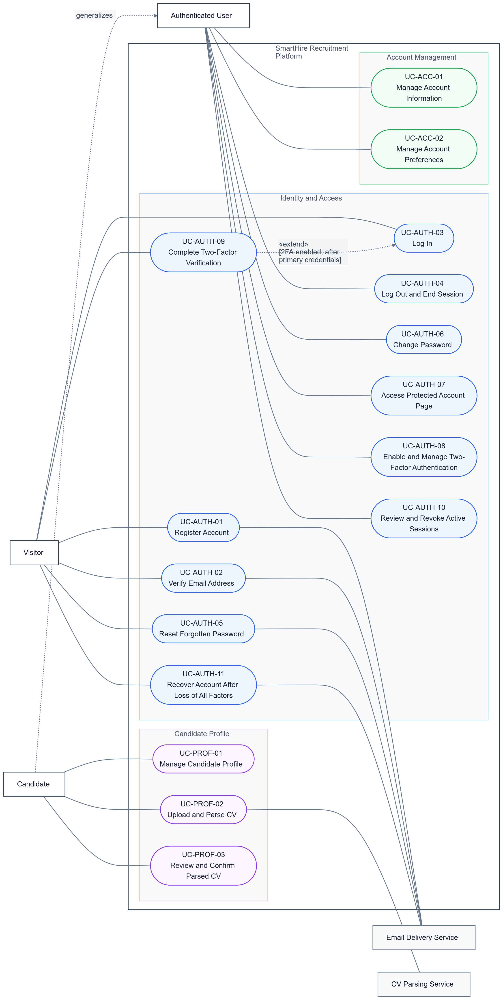
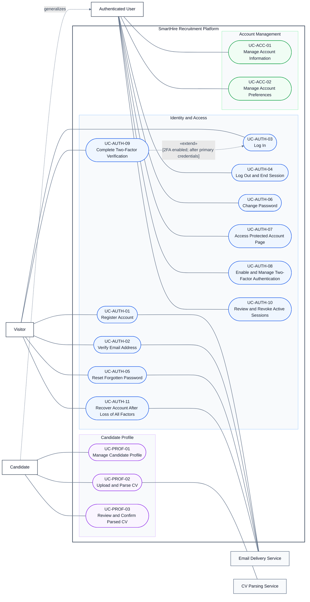
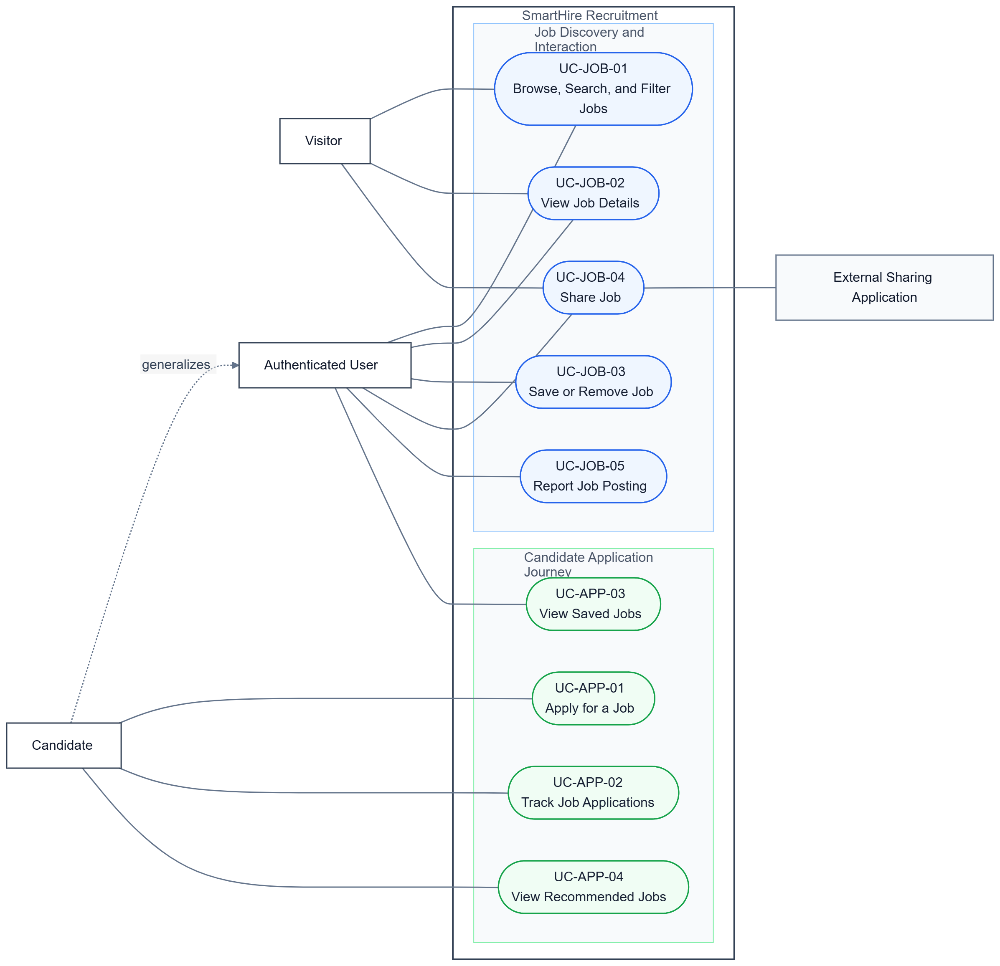
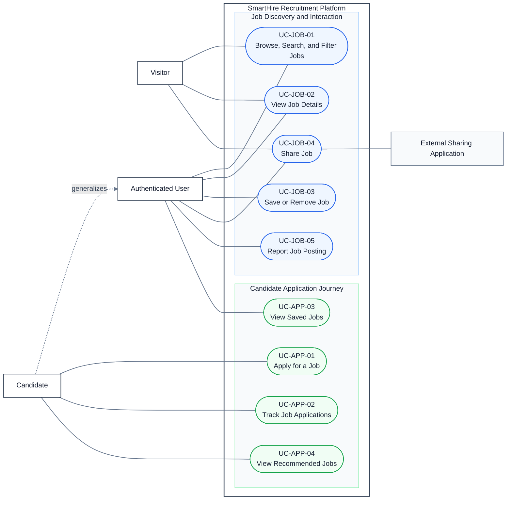
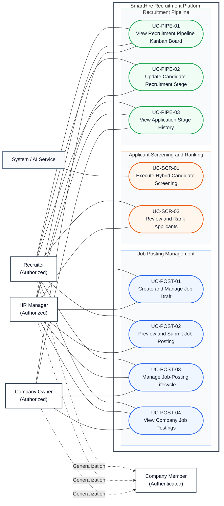
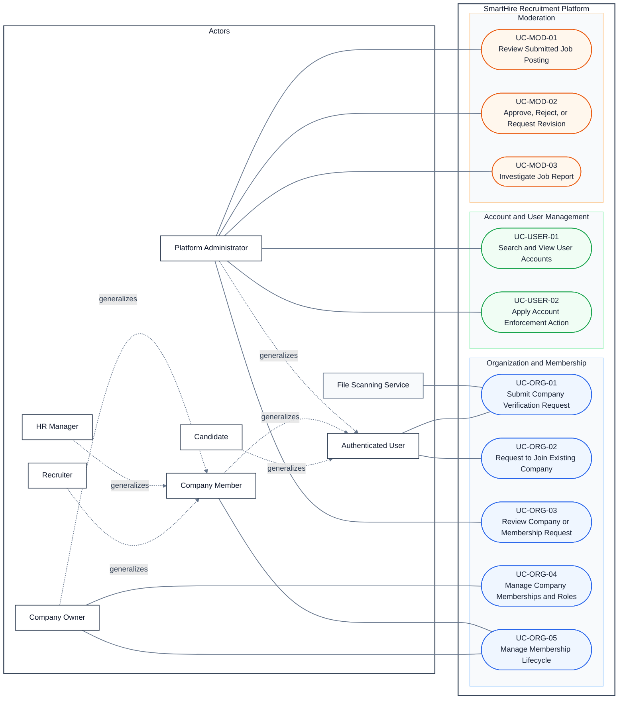
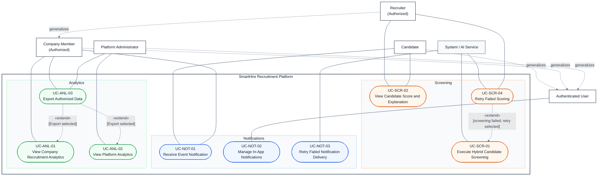

# SmartHire Use-Case Model

*Version: V1.3 (06/08/2026)*
*Scope: five use-case diagrams and their shared modeling conventions*

## 1. Modeling Conventions

The five diagrams use the same light report theme so that screenshots and exported pages have a white background and readable dark text. Actor generalization always points from the specialized actor to the parent actor. A use-case `«include»` is used only when the included behavior is mandatory and reused in the base use case. A use-case `«extend»` is used only for a conditional or optional behavior with an explicit condition and extension point. Navigation between screens and business workflow steps is documented as Related Use Cases and Entry Points in the specifications.

The Mermaid source for each model is also maintained in `diagrams/diagram_01.md` through `diagrams/diagram_05.md`. The blocks below are synchronized copies for the report model.

## 2. DGM-01 — Identity, Access, and Profile

Registration and email verification, password recovery and login, profile editing and CV upload, and CV parsing and review are separate user goals. Their sequencing is documented in the DGM-01 specification rather than with workflow arrows.

## 3. DGM-02 — Candidate Job Journey

Selecting a result, applying, saving, sharing, and reporting are independent goals. Their entry points are documented in the DGM-02 specification.

## 4. DGM-03 — Recruiter Operations

Recruiter, HR Manager, and Company Owner generalize Company Member. UC-PIPE-02 writes the stage change and its history event in one transaction; UC-PIPE-03 is a read-only history query. Posting actions and pipeline navigation are Related Use Cases, not workflow relationships.

## 5. DGM-04 — Company Administration and Moderation

Candidate, Company Member, and Platform Administrator generalize Authenticated User. Recruiter, HR Manager, and Company Owner generalize Company Member. Account review and enforcement, and posting review and decision, are Related Use Cases rather than workflow extensions.

## 6. DGM-05 — Supporting Services and Analytics

UC-SCR-04 is a conditional exception after a failed screening result. UC-NOT-03 is an automated delivery-recovery process related to UC-NOT-01, not an extension of it. UC-ANL-03 is optional export from either analytics view. Candidate and Recruiter views in UC-SCR-02 expose only the data permitted for that actor.

## 7. Cross-Diagram Relationship Index

| Decision | Current representation |
|---|---|
| Actor generalization | Specialized actor → parent actor, using a dashed labeled arrow. |
| DGM-01 two-factor challenge | `UC-AUTH-09 «extend» UC-AUTH-03` only when 2FA is enabled and after primary credentials are validated. |
| DGM-03 posting workflow | UC-POST-01, UC-POST-02, and UC-POST-03 are related goals; no workflow `«extend»`. |
| DGM-03 screening | UC-SCR-03 uses an existing screening result as a precondition; no `«include»` from review to screening. |
| DGM-03 pipeline history | UC-PIPE-02 records one history event atomically; UC-PIPE-03 reads history; no `«include»`. |
| DGM-04 administration | Account review/enforcement and posting review/decision are related goals; no workflow `«extend»`. |
| DGM-05 screening retry | `UC-SCR-04 «extend» UC-SCR-01` only at the failed-result extension point. |
| DGM-05 notification retry | UC-NOT-03 is a separate system recovery process related to UC-NOT-01. |
| DGM-05 analytics export | `UC-ANL-03 «extend» UC-ANL-01/02` only when the actor explicitly selects Export. |
