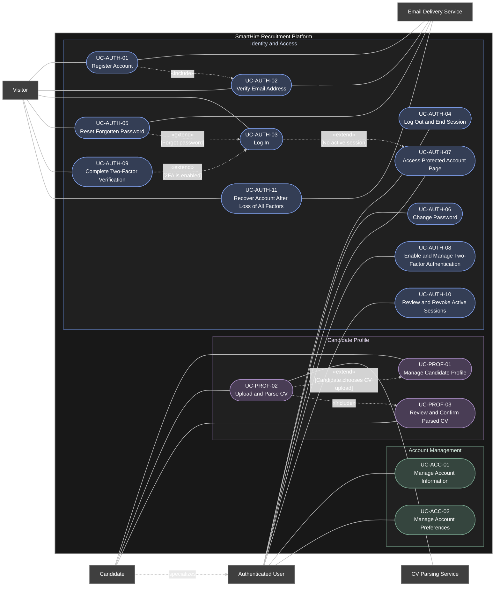
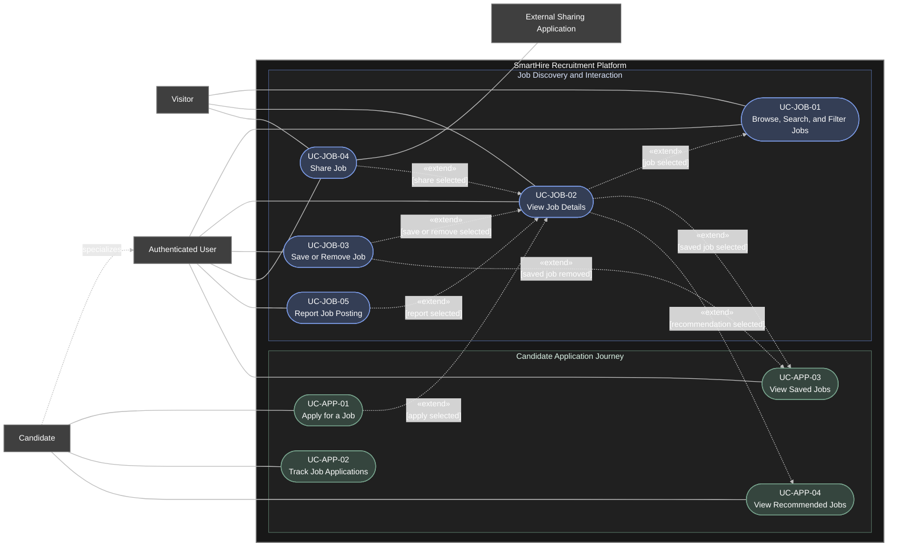
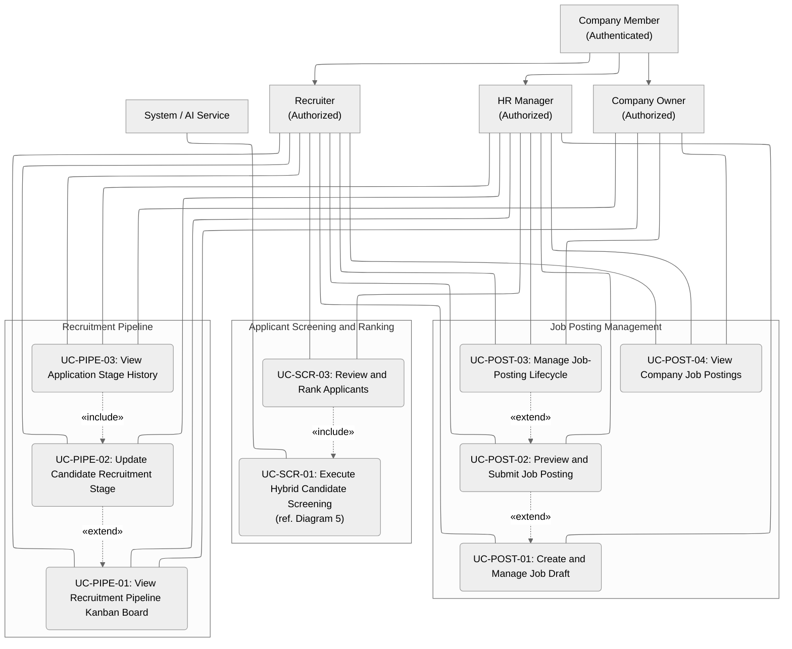
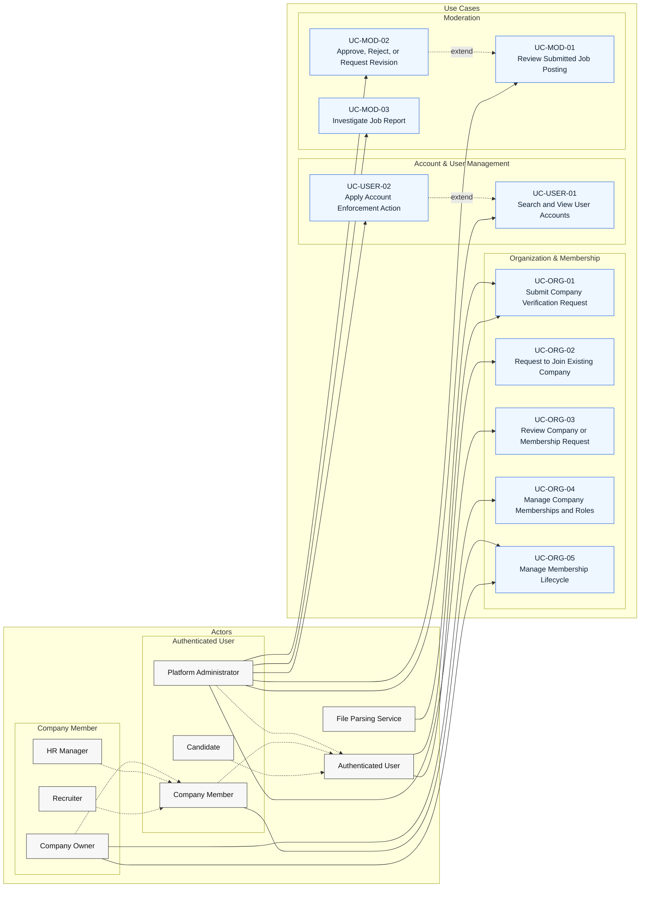
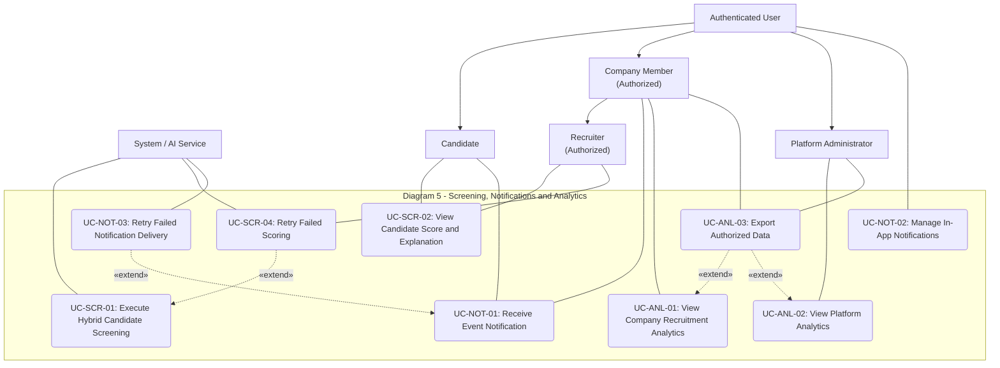

# Summary Use-Case Model for PA3 - Group 9

| Document Metadata | Value |
|---|---|
| Group | 9 |
| Document Owner | Nguyễn Gia Quốc Uy (Student ID: 24127261) |
| Reviewers | Nguyễn Quốc Thành, Ngô Quốc Tuấn, Lưu Chí Hải, Nguyễn Minh Khôi |
| Last Updated | 2026-07-25 |

## 1. Diagram 1 - Identity, Access, and Profile
**Author of this Part:** Nguyễn Gia Quốc Uy   
**Student ID:** 24127261

## 2. Diagram 2 - Candidate Job Journey
**Author of this Part:** Nguyễn Gia Quốc Uy   
**Student ID:** 24127261

## 3. Diagram 3 - Recruiter Operations
**Author of this Part:** Ngô Quốc Tuấn   
**Student ID:** 24127581

## 4. Diagram 4 - Company Management and Platform Administration
**Author of this Part:** Nguyễn Minh Khôi   
**Student ID:** 24127066

## 5. Diagram 5 - Supporting Services and Analytics

**Author of this Part:** Lưu Chí Hải   
**Student ID:** 24127030

