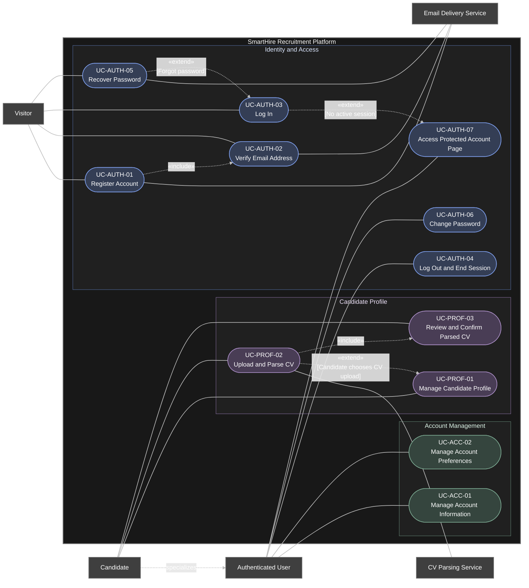

# DGM-01 — Identity, Access, and Profile

*Performed by: Nguyen Gia Quoc Uy | Reviewed by: Group 9 | Edited by: Nguyen Gia Quoc Uy*
**Version:** V1.1 (20/7/2026) - First initialization

## 1. Purpose

This use-case diagram describe the identity, authentication, account-management, and candidate-profile functions of the SmartHire platform.

A visitor may register an account, verify an email address, log in, or recover a password. After authentication, a registered user may access protected account pages and manage account information or preferences. A candidate inherits the capabilities of a registered user and may additionally manage a candidate profile and CV information.

## 2. Actor-Naming Convention
Actors are named using singular role-based nouns rather than personal names, implementation components, or vague labels.

- Human actors are named according to their role when interacting with the system.
- External-system actors are named according to the service they provide.
- A specialized actor inherits all use cases associated with its parent actor.

## 3. Use case Diagram

## 4. Actor Summary
| Actor ID | Actor Name | Actor Type | Description |
|---|---|---|---|
| ACT-01 | Visitor | Primary human actor | A person who has not established an authenticated session. The visitor may register, verify an email address, log in, or initiate password recovery. |
| ACT-02 | Authenticated User | Primary human actor | A person who owns a SmartHire account. The registered user may authenticate, end a session, access protected account pages, and manage account information and preferences.
| ACT-03 | Candidate | Specialized primary human actor | An authenticated user who uses candidate-specific functions. A candidate inherits the capabilities of Authenticated User and may additionally manage a candidate profile and CV information. |
| ACT-04 | Email Delivery Service | Supporting external-system actor | An external service responsible for delivering account-verification and password-recovery messages requested by the SmartHire Platform. | 
| ACT-05 | CV-Parsing Service | Supporting external-system actor | An external service responsible for extracting structured candidate information from an uploaded CV. | 

## 5. Actor Generalization
| Specialized Actor | Parent Actor | Meaning | 
|---|---|---|
| Candidate | Authenticated User | A candidate acting through an authenticated session inherits all functions available to an authenticated user. Candidate-specific capabilities are added to the underlying user account rather than replacing it. |

##  6. Use-Case Summary
| Use Case ID | Use Case | Primary Actor | Supporting Actor | Main Objective | 
|---|---|---|---|---|
| UC-AUTH-01 | Register Account | Visitor | Email Delivery Service | Create a pending standard account and send an email-verification message to the supplied email address. | 
| UC-AUTH-02 | Verify Email Address | Visitor | Email Delivery Service | Confirm ownership of the registered email address and activate the pending account. | 
| UC-AUTH-03 | Login | Visitor | — | Authenticate a registered account holder and establish a valid user session. | 
| UC-AUTH-04 | LogOut and End Session | Authenticated User | — | End the current session and invalidate the corresponding authentication credentials. | 
| UC-AUTH-05 | Recover Password | Visitor | Email Delivery Service | Request a password-recovery message and securely establish a new password. | 
| UC-AUTH-06 | Change Password | Authenticated User | — | Replace the current password while the user has a valid authenticated session. | 
| UC-AUTH-07 | Access Protected Account Page | Authenticated User | — | Allow an authenticated user to access a protected account page. |   
| UC-ACC-01 | Manage Account Information | Authenticated User | — | View and update general account information, such as name and contact information. |
| UC-ACC-02 | Manage Account Preference | Authenticated User | — | Create, view, and update candidate-profile information. |
| UC-PROF-01 | Manage Candidate Profile | Candidate | — | Create, view, and update candidate-profile information |
| UC-PROF-02 | Upload and Parse CV | Candidate | CV Parsing Service | Upload a CV and extract structured candidate information from the uploaded document. |
| UC-PROF-03 | Review and Confirm Parsed CV | Candidate | — | Review, correct, and confirm information extracted from an uploaded CV before it is saved to the candidate profile. |

## 7. Use-Case Relationship Summary
| Source | Relationship | Target | Condition and Meaning | 
|---|---|---|---|
| UC-AUTH-01 — Register Account | «include» | UC-AUTH-02 — Verify Email Address | Email verification is required to complete account activation. Registration first creates a pending account and sends a verification message. |
| UC-AUTH-05 — Recover Password | «extend» | UC-AUTH-03 — Log In | Password recovery is initiated from the login process when the visitor cannot log in because the password has been forgotten. | 
| UC-AUTH-03 — Log In | «extend» | UC-AUTH-07 — Access Protected Account Page | Login behavior is invoked when a person attempts to access a protected account page without a valid authenticated session. | 
| UC-PROF-02 — Upload and Parse CV | «extend» | UC-PROF-01 — Manage Candidate Profile | CV upload is an optional method for creating or updating candidate-profile information. The candidate may also enter profile information manually.
| UC-PROF-02 — Upload and Parse CV | «include» | UC-PROF-03 — Review and Confirm Parsed CV | Successfully parsed CV information must be reviewed and confirmed before it is saved as confirmed candidate-profile data. | 