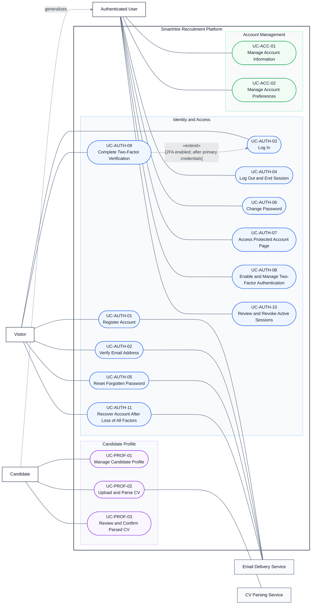

# DGM-01 — Identity, Access, and Profile

*Performed by: Nguyễn Gia Quốc Uy | Reviewed by: Nguyễn Minh Khôi | Edited by: Nguyễn Minh Khôi*  
**Version:** V1.4 (2026-08-26) — PA5 Final Document Synchronization Review

### Revision History

| Version | Date | Author/Editor | Summary | Status |
|---|---|---|---|---|
| 1.3 | 2026-08-06 | Nguyễn Gia Quốc Uy | UML relationships and report theme revised. | Baseline |
| 1.4 | 2026-08-26 | Nguyễn Minh Khôi (Reviewer) | PA5 Document Synchronization review: Reconciled 16 use cases against Features 001, 002, 004, 005; noted Feature 001 verification pending status and Feature 027 as out-of-scope pending release decision. | Approved |

## 1. Purpose

*Performed by: Nguyễn Gia Quốc Uy | Reviewed by: Nguyễn Minh Khôi | Edited by: Nguyễn Minh Khôi*

This use-case diagram describes the identity, authentication, account-security, account-management, and candidate-profile functions of the SmartHire platform.

A Visitor may register an account, verify an email address, log in, reset a forgotten password, complete a required two-factor challenge, or start the separately controlled full-account-recovery process after losing every authentication factor. After authentication, an Authenticated User may access protected account pages, manage two-factor authentication, review and revoke active sessions, and manage account information or preferences. A Candidate inherits the capabilities of an Authenticated User and may additionally manage a candidate profile and CV information.

### 1.1. PA5 Implementation Status

- `UC-AUTH-01` through `UC-AUTH-11` (Feature 001) are implemented; verification pending formal retest of AUTH-06 and AUTH-08.
- `UC-ACC-01`, `UC-ACC-02`, and `UC-PROF-01` (Feature 002) are implemented and verified.
- `UC-PROF-02` and `UC-PROF-03` (Features 004 & 005) are implemented with asynchronous extraction, OCR engine integration, and draft review.
- Feature 027 (Candidate Profile Discovery) remains outside the 26-feature baseline as pending release decision.
- A normal forgotten-password reset preserves enabled TOTP and unused backup codes. Full account recovery is a separately controlled, lower-assurance workflow for loss of the password, TOTP access, and every backup code.

## 2. Actor-Naming Convention

Actors are named using singular, role-based nouns rather than personal names, implementation components, or vague labels.

- Human actors are named according to their role when interacting with the system.
- External-system actors are named according to the service they provide.
- A specialized actor inherits all use cases associated with its parent actor.

## 3. Use-Case Diagram

## 4. Actor Summary

| Actor ID | Actor Name | Actor Type | Description |
|---|---|---|---|
| ACT-01 | Visitor | Primary human actor | A person who has not established a full authenticated session. The Visitor may register, verify an email address, log in, reset a forgotten password, complete a provisional two-factor challenge, or initiate full account recovery. |
| ACT-02 | Authenticated User | Primary human actor | A person who owns a SmartHire account and has a valid full session. The Authenticated User may end the current session, review and revoke other sessions, access protected account pages, manage two-factor authentication, and manage account information and preferences. |
| ACT-03 | Candidate | Specialized primary human actor | An authenticated user who uses candidate-specific functions. A Candidate inherits the capabilities of Authenticated User and may additionally manage a candidate profile and CV information. |
| ACT-04 | Email Delivery Service | Supporting external-system actor | An external service responsible for delivering account-verification and password-recovery messages requested by the SmartHire Platform. |
| ACT-05 | CV Parsing Service | Supporting external-system actor | An external service responsible for extracting structured candidate information from an uploaded CV. |

## 5. Actor Generalization

| Specialized Actor | Parent Actor | Meaning |
|---|---|---|
| Candidate | Authenticated User | A candidate acting through an authenticated session inherits all functions available to an authenticated user. Candidate-specific capabilities are added to the underlying user account rather than replacing it. |

## 6. Use-Case Summary

| Use Case ID | Use Case | Primary Actor | Supporting Actor | Main Objective |
|---|---|---|---|---|
| UC-AUTH-01 | Register Account | Visitor | Email Delivery Service | Create a pending standard account and send an email-verification message to the supplied email address. |
| UC-AUTH-02 | Verify Email Address | Visitor | Email Delivery Service | Confirm ownership of the registered email address and activate the pending account. |
| UC-AUTH-03 | Log In | Visitor | — | Authenticate a registered account holder and establish a valid user session. |
| UC-AUTH-04 | Log Out and End Session | Authenticated User | — | End the current session and invalidate the corresponding authentication credentials. |
| UC-AUTH-05 | Reset Forgotten Password | Visitor | Email Delivery Service | Request a normal password-reset message and establish a new password without disabling existing TOTP or unused backup codes. |
| UC-AUTH-06 | Change Password | Authenticated User | — | Replace the current password while the user has a valid authenticated session. |
| UC-AUTH-07 | Access Protected Account Page | Authenticated User | — | Allow an authenticated user to access a protected account page. |
| UC-AUTH-08 | Enable and Manage Two-Factor Authentication | Authenticated User | RFC 6238-compatible authenticator application | Enroll TOTP, receive one-time backup codes, regenerate backup codes, or disable 2FA after renewed security proof. |
| UC-AUTH-09 | Complete Two-Factor Verification | Visitor | RFC 6238-compatible authenticator application | Complete a restricted login challenge with a valid TOTP or unused backup code before a full session is created. |
| UC-AUTH-10 | Review and Revoke Active Sessions | Authenticated User | — | View sanitized owned-session metadata, identify the current session, and revoke another owned session. |
| UC-AUTH-11 | Recover Account After Loss of All Factors | Visitor | Email Delivery Service | Use verified email, a security hold, and single-use proofs to recover an account after losing the password, TOTP access, and every backup code. |
| UC-ACC-01 | Manage Account Information | Authenticated User | — | View and update general account information, such as name and contact information. |
| UC-ACC-02 | Manage Account Preferences | Authenticated User | — | View and update account-level preferences, such as notification and personalization settings. |
| UC-PROF-01 | Manage Candidate Profile | Candidate | — | Create, view, and update candidate-profile information. |
| UC-PROF-02 | Upload and Parse CV | Candidate | CV Parsing Service | Upload a CV and extract structured candidate information from the uploaded document. |
| UC-PROF-03 | Review and Confirm Parsed CV | Candidate | — | Review, correct, and confirm information extracted from an uploaded CV before it is saved to the candidate profile. |

## 7. Use-Case Relationship Summary

| Source | Relationship | Target | Condition and Meaning |
|---|---|---|---|
| UC-AUTH-09 — Complete Two-Factor Verification | «extend» | UC-AUTH-03 — Log In | When 2FA is enabled, the second-factor challenge is inserted after primary credentials are validated and before a full session is created. The extension point and condition are explicit. |

Registration and email verification, password recovery and login, profile editing and CV upload, and CV parsing and review are separate user goals. Their sequencing is documented in preconditions, postconditions, and Related Use Cases rather than with `«include»` or `«extend»` arrows.
