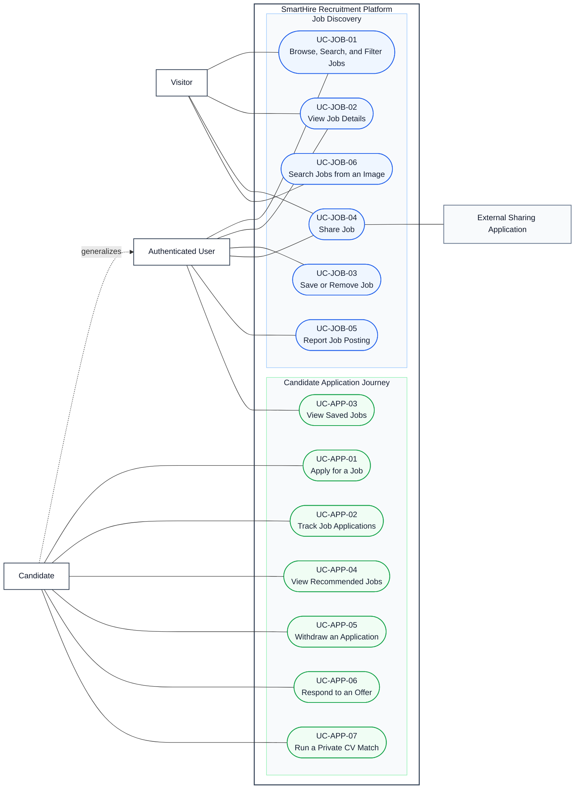

# DGM-02 — Candidate Job Journey

*Performed by: Lưu Chí Hải | Reviewed by: Nguyễn Gia Quốc Uy | Edited by: Lưu Chí Hải*

**Version:** V1.5 (2026-08-26) — synchronized with Features 003, 005, and 020; PA5 screenshot evidence remains pending for UC-JOB-06 and UC-APP-05–07

## 1. Purpose and scope

This diagram covers public job discovery and the authenticated Candidate journey from search through application tracking. It includes image-assisted search, application withdrawal, offer response, and private pre-application CV matching only where corresponding UI, routes, services, persistence, and tests exist. Feature 005 remains **In progress** because the PA5 live OCR cases linked to `BUG-IMG-02` are still open.

Identity/profile/CV management is in DGM-01; recruiter review and pipeline control are in DGM-03; communication is in DGM-05.

## 2. Use-Case Diagram

## 3. Actor and use-case summary

| Actor | Meaning |
|---|---|
| Visitor | Unauthenticated person using public job discovery. |
| Authenticated User | Account holder who may save/report jobs and view saved jobs. |
| Candidate | Authenticated User using candidate-only application and private-match functions. |
| External Sharing Application | Optional destination used to distribute a public job URL. |

| Use Case ID | Name | Feature | Implementation status |
|---|---|---:|---|
| UC-JOB-01 | Browse, Search, and Filter Jobs | F003 | Implemented and verified |
| UC-JOB-02 | View Job Details | F003 | Implemented and verified |
| UC-JOB-03 | Save or Remove Job | F003 | Implemented and verified |
| UC-JOB-04 | Share Job | F003 | Implemented and verified |
| UC-JOB-05 | Report Job Posting | F003 | Implemented and verified |
| UC-JOB-06 | Search Jobs from an Image | F005 | In progress — live OCR failure remains open |
| UC-APP-01 | Apply for a Job | F020 | Implemented; verification pending |
| UC-APP-02 | Track Job Applications | F020 | Implemented; verification pending |
| UC-APP-03 | View Saved Jobs | F003 | Implemented and verified |
| UC-APP-04 | View Recommended Jobs | F003 | Implemented and verified |
| UC-APP-05 | Withdraw an Application | F020 | Implemented; verification pending |
| UC-APP-06 | Respond to an Offer | F020 | Implemented; verification pending |
| UC-APP-07 | Run a Private CV Match | F020 | Implemented; verification pending |

## 4. Relationship decisions

- Selecting a result, saving, reporting, applying, withdrawing, responding to an offer, or running a private match are independent user goals, so navigation between them is not modeled as `«include»` or `«extend»`.
- Candidate generalizes Authenticated User. Visitor is a session state, not the parent of Authenticated User.
- Image interpretation may use deterministic fallback after OCR/AI failure; the diagram does not claim that the unresolved live OCR path is verified.

## 5. Repository evidence

- UI: `web/src/app/jobs/`, `web/src/app/jobs/applied/`, `web/src/app/(workspace)/cv-match-check/`, and the corresponding frontend feature directories.
- APIs/services: `web/src/app/api/jobs/image-searches/`, `web/src/app/api/candidate/applications/`, `web/src/app/api/candidate/private-cv-matches/`, `web/src/backend/candidate-applications/`, `web/src/backend/private-cv-match/`, and `web/src/backend/services/image-search/`.
- Data: `JobApplication`, `ApplicationStageEvent`, image-search, private-match, saved-job, and reporting records in `web/prisma/schema.prisma`.
- Verification: candidate-application, private-match, image-search, and job-discovery tests under `web/tests/`; PA5 manual result in `docs/testing/PA5_Testing.md`.

## 6. Revision history

| Version | Date | Editor | Exact change | Review |
|---|---|---|---|---|
| V1.3 | 2026-08-06 | Nguyễn Gia Quốc Uy | Revised UML relationships and report theme. | Group 9 |
| V1.4 | 2026-08-26 | Lưu Chí Hải | Added evidence-backed image search, withdrawal, offer-response, and private-match use cases; recorded F005 failure status and domain boundaries. | Pending Nguyễn Minh Khôi |
| V1.5 | 2026-08-26 | Lưu Chí Hải | Recorded that no matching existing prototype/UI screenshots cover UC-JOB-06 or UC-APP-05–07; specification evidence remains pending. | Pending Nguyễn Minh Khôi |
