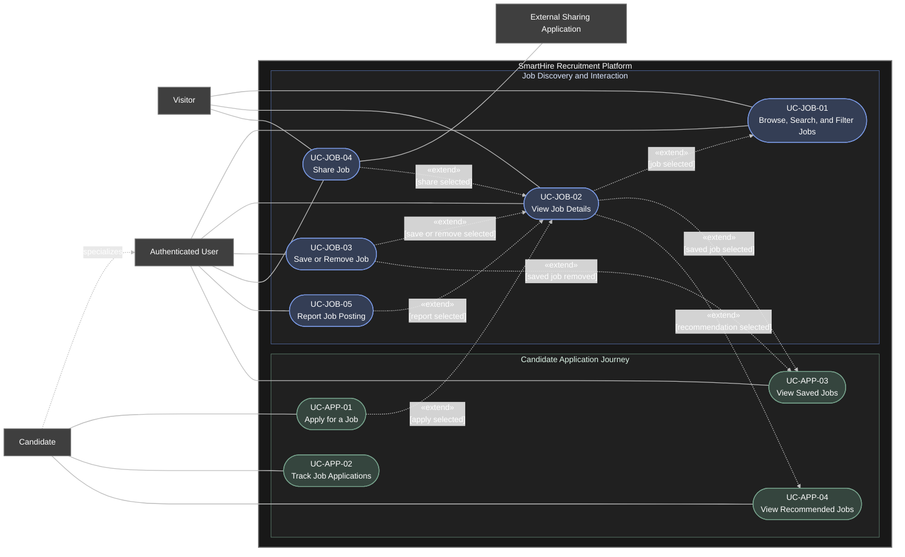

# DGM-02 — Candidate Job Journey

*Performed by: Nguyen Gia Quoc Uy | Reviewed by: Group 9 | Edited by: Nguyen Gia Quoc Uy*

## 1. Purpose
This use-case diagram describes how visitors, authenticated users, and candidates discover job opportunities and interact with job postings on the SmartHire Recruitment Platform.

Public users may browse, search, filter, view, and share job postings. After authentication, users may save jobs and report inappropriate postings. Candidates may additionally apply for jobs, track submitted applications, and view personalized job recommendations.

## 2. Scope
DGM-02 covers the following functional areas:
- Job discovery and searching.
- Job-posting details.
- Saved jobs.
- Job sharing and reporting.
- Job application submission.
- Application tracking.
- Personalized job recommendations.

Account registration, login, candidate-profile management, recruiter operations, and job-posting moderation are specified in other diagrams.

## 3. Actor-Naming Convention
Actors are named using singular, role-based nouns.
- Human actors are named according to their role or authentication state.
- External-system actors are named according to the service they provide.
- **Candidate** specializes **Authenticated User** and therefore inherits the parent actor's job-discovery capabilities.
- Personal names, development-team roles, and implementation components are not modeled as actors.

## 4. Use case Diagram

## 5. Actor Summary
| Actor ID | Actor Name | Actor Type | Description |
|---|---|---|---|
| ACT-01 | Visitor | Primary human actor | A person who does not currently have an authenticated session. A Visitor may discover, view, and share publicly available job postings. |
| ACT-02 | Authenticated User | Primary human actor | A registered account holder with a valid session. An Authenticated User inherits public job-discovery capabilities and may save jobs, remove saved jobs, report postings, and view saved jobs. |
| ACT-03 | Candidate | Specialized primary human actor | An Authenticated User who uses candidate-specific functions. A Candidate may apply for jobs, track submitted applications, and view personalized job recommendations. |
| ACT-04 | External Sharing Application | Supporting external-system actor | An external email, messaging, social-network, or operating-system sharing application used to distribute a job-posting link. |

## 6. Actor Generalization
| Specialized Actor | Parent Actor | Meaning | 
|---|---|---|
| Candidate | Authenticated User | A Candidate inherits all job-discovery and saved-job capabilities available to an Authenticated User and additionally receives application and recommendation capabilities. |

The **Visitor** actor is not the parent of **Authenticated User**. It represents the state in which a person interacts with publicly available functions without an authenticated session.

## 7. Use-Case Summary
| Use Case ID | Use Case | Primary Actor | Supporting Actor | Main Objective | 
|---|---|---|---|---|
| UC-JOB-01 | Browse, Search, and Filter Jobs | Visitor/Authenticated User | — | Discover active job postings by browsing listings, entering search terms, and applying supported filters or sorting options. | 
| UC-JOB-02 | View Job Details | Visitor/Authenticated User | — | View the complete public information of a selected active job posting. | 
| UC-JOB-03 | Save or Remove Job | Authenticated User | — | Add a job posting to the user’s saved-job collection or remove it from that collection. | 
| UC-JOB-04 | Share Job | Visitor/Authenticated User | External Sharing Application | Copy or distribute a public job-posting link through a supported sharing destination. | 
| UC-JOB-05 | Report Job Posting | Authenticated User | — | Submit a report when a job posting appears fraudulent, misleading, inappropriate, duplicated, or otherwise in violation of platform policy. | 
| UC-APP-01 | Apply for a Job | Candidate | — | Submit a candidate application to an active job posting using confirmed profile and application information. | 
| UC-APP-02 | Track Job Applications | Candidate | — | View submitted applications and their current recruitment stages or statuses. | 
| UC-APP-03 | View Saved Jobs | Authenticated User | — | View the authenticated user’s saved-job collection and continue interacting with saved postings. |
| UC-APP-04 | View Recommended Jobs | Candidate | — | View job postings recommended using the Candidate’s confirmed profile and permitted platform data. | 

## 8. Use-Case Relationship Summary
| Source | Relationship | Target | Condition and Meaning | 
|---|---|---|---|
| UC-JOB-02 — View Job Details | «extend» | UC-JOB-01 — Browse, Search, and Filter Jobs | Job details are displayed when the actor selects a job from the discovery results. |
| UC-JOB-03 — Save or Remove Job | «extend» | UC-JOB-02 — View Job Details | An Authenticated User may save or remove the currently displayed job. | 
| UC-JOB-04 — Share Job | «extend» | UC-JOB-02 — View Job Details | The actor may share the currently displayed public job posting. | 
| UC-JOB-05 — Report Job Posting | «extend» | UC-JOB-02 — View Job Details | An Authenticated User may report the currently displayed posting when a policy concern exists. |
| UC-APP-01 — Apply for a Job | «extend» | UC-JOB-02 — View Job Details | An eligible Candidate may begin an application from an active job-detail page. |
| UC-JOB-02 — View Job Details | «extend» | UC-APP-03 — View Saved Jobs | Job details are displayed when the user selects a posting from the saved-job list. | 
| UC-JOB-03 — Save or Remove Job | «extend» | UC-APP-03 — View Saved Jobs | The user may remove a posting directly from the saved-job list. | 
| UC-JOB-02 — View Job Details | «extend» | UC-APP-04 — View Recommended Jobs | 

Job details are displayed when the Candidate selects a recommended posting.