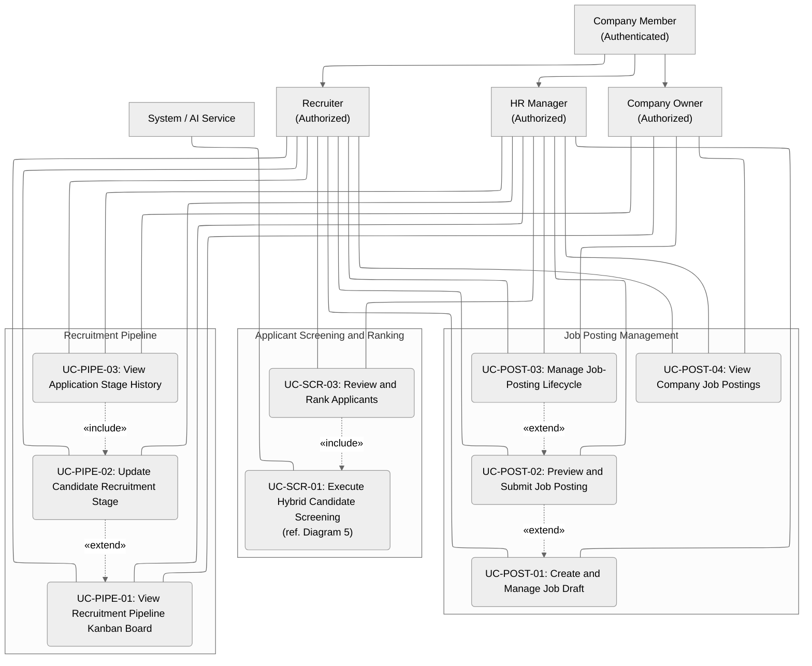

```mermaid
---
config:
  theme: neutral
  flowchart:
    defaultRenderer: elk
---
flowchart TB
    %% Actors
    ai["System / AI Service"]
    cm["Company Member\n(Authenticated)"]
    rec["Recruiter\n(Authorized)"]
    hrm["HR Manager\n(Authorized)"]
    own["Company Owner\n(Authorized)"]

    %% Actor Generalization
    cm --> rec
    cm --> hrm
    cm --> own

    %% ================= DOMAIN 1 =================
    subgraph subGraph0["Job Posting Management"]
        direction TB
        UC_POST_01("UC-POST-01: Create and Manage Job Draft")
        UC_POST_02("UC-POST-02: Preview and Submit Job Posting")
        UC_POST_03("UC-POST-03: Manage Job-Posting Lifecycle")
        UC_POST_04("UC-POST-04: View Company Job Postings")
    end

    %% ================= DOMAIN 2 =================
    subgraph subGraph1["Applicant Screening and Ranking"]
        direction TB
        UC_SCR_01("UC-SCR-01: Execute Hybrid Candidate Screening\n(ref. Diagram 5)")
        UC_SCR_03("UC-SCR-03: Review and Rank Applicants")
    end

    %% ================= DOMAIN 3 =================
    subgraph subGraph2["Recruitment Pipeline"]
        direction TB
        UC_PIPE_01("UC-PIPE-01: View Recruitment Pipeline Kanban Board")
        UC_PIPE_02("UC-PIPE-02: Update Candidate Recruitment Stage")
        UC_PIPE_03("UC-PIPE-03: View Application Stage History")
    end

    %% Actor to Use Case Relationships
    rec --- UC_POST_01
    rec --- UC_POST_02
    rec --- UC_POST_03
    rec --- UC_POST_04

    hrm --- UC_POST_01
    hrm --- UC_POST_02
    hrm --- UC_POST_03
    hrm --- UC_POST_04

    own --- UC_POST_03
    own --- UC_POST_04

    ai --- UC_SCR_01

    rec --- UC_SCR_03
    hrm --- UC_SCR_03

    rec --- UC_PIPE_01
    rec --- UC_PIPE_02
    rec --- UC_PIPE_03

    hrm --- UC_PIPE_01
    hrm --- UC_PIPE_02
    hrm --- UC_PIPE_03

    own --- UC_PIPE_01
    own --- UC_PIPE_03

    %% Use Case to Use Case Relationships
    UC_POST_02 -. "«extend»" .-> UC_POST_01
    UC_POST_03 -. "«extend»" .-> UC_POST_02

    UC_SCR_03 -. "«include»" .-> UC_SCR_01

    UC_PIPE_02 -. "«extend»" .-> UC_PIPE_01
    UC_PIPE_03 -. "«include»" .-> UC_PIPE_02
```