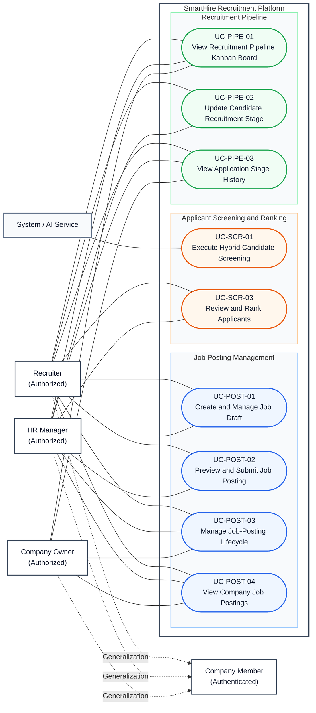

# DGM-03 — Recruiter Operations

*Performed by: Group 9 | Reviewed by: Group 9 | Edited by: Group 9*
**Version:** V1.3 (06/08/2026) — UML relationships and report theme revised

## 1. Use-Case Diagram

## 2. Relationship Decisions

- Recruiter, HR Manager, and Company Owner generalize Company Member; the arrow points from each specialized actor to its parent.
- UC-POST-01, UC-POST-02, and UC-POST-03 are separate posting goals connected through Related Use Cases and entry conditions, not `«extend»` workflow arrows.
- UC-PIPE-02 writes the stage change and its history event in one transaction. UC-PIPE-03 is a read-only history query and does not include UC-PIPE-02.
- UC-SCR-03 requires an available screening result as a precondition. The screening process is started by the application workflow and is not an `«include»` of applicant review.
