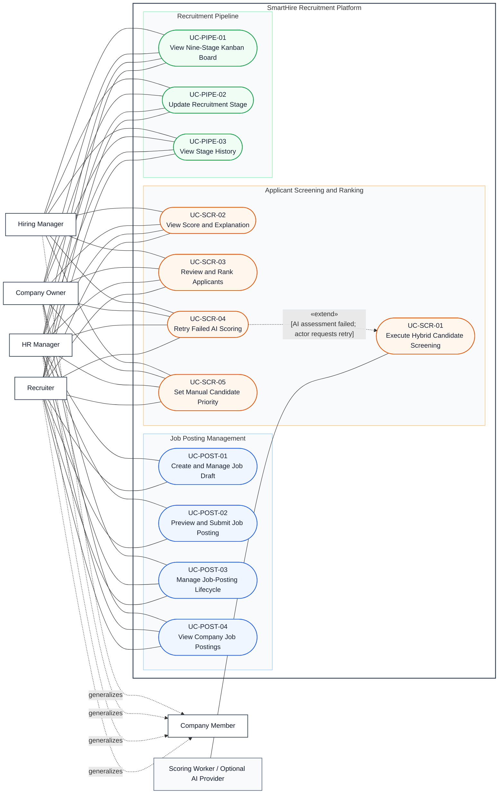

# DGM-03 — Recruiter Operations

*Performed by: Lưu Chí Hải | Reviewed by: Nguyễn Gia Quốc Uy | Edited by: Lưu Chí Hải*

**Version:** V1.5 (2026-08-26) — synchronized with Features 007, 012, 015, and 021; manual-priority screenshot evidence remains pending

## 1. Purpose and scope

This diagram covers company-scoped job-post management, applicant screening/ranking, human priority override, and the nine-stage recruitment Kanban pipeline. AI scoring is advisory: it never hires, rejects, or advances an application. Application-scoped messaging is owned by DGM-05.

## 2. Use-Case Diagram

## 3. Authorization and relationship decisions

- Repository authorization permits active company memberships with `OWNER`, `HR_MANAGER`, `RECRUITER`, or `HIRING_MANAGER` to manage the recruitment pipeline. Owner is therefore not modeled as read-only in DGM-03.
- Owner read-only behavior is limited to recruitment-message oversight in DGM-05.
- Scoring execution is asynchronous. Deterministic results remain usable when the optional AI assessment fails; retry is a conditional extension and cannot change a recruitment stage by itself.
- Manual priority is a human override of ordering, not an override that fabricates an AI score or makes an automatic hiring decision.
- A stage update and its `ApplicationStageEvent` are committed transactionally. Version conflicts and invalid transitions return an error and require a refresh; no false success is shown.

## 4. Use-case summary and evidence

| Use Case IDs | Features | Primary evidence |
|---|---:|---|
| UC-POST-01–04 | F007 | `web/src/app/recruiter/job-postings/`, `/api/recruiter/job-postings/`, job-post services and tests |
| UC-SCR-01–05 | F012, F015 | `web/src/backend/scoring/`, recruiter candidate UI/routes, scoring tests |
| UC-PIPE-01–03 | F021 | `web/src/app/recruiter/pipeline/`, recruitment-pipeline services/routes/tests, `ApplicationStageEvent` schema |

Features 007, 012, and 015 are **Implemented; verification pending**; F021 is **Implemented and verified** in the final inventory. The existence of automated test source is supporting evidence, not by itself a completed final verification.

## 5. Revision history

| Version | Date | Editor | Exact change | Review |
|---|---|---|---|---|
| V1.3 | 2026-08-06 | Group 9 | Revised UML relationships and prototype presentation. | Group 9 |
| V1.4 | 2026-08-26 | Lưu Chí Hải | Added score explanation, AI retry, human priority, Hiring Manager, nine-stage and conflict semantics; corrected Owner pipeline authority and separated recruitment messaging. | Pending Nguyễn Minh Khôi |
| V1.5 | 2026-08-26 | Lưu Chí Hải | Linked existing score-explanation and retry prototypes and recorded missing UC-SCR-05 manual-priority screenshot evidence. | Pending Nguyễn Minh Khôi |
