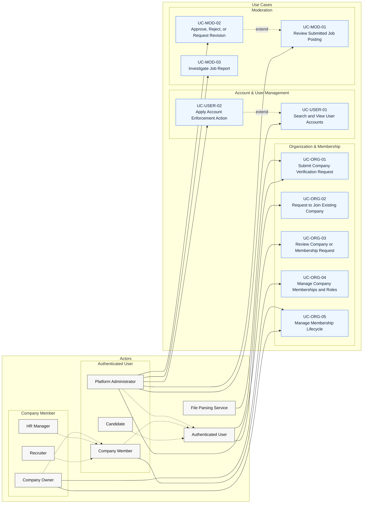

```mermaid
flowchart LR
    subgraph Actors["Actors"]
        direction TB
        AU["Authenticated User"]

        subgraph AUHierarchy["Authenticated User"]
            direction TB
            Candidate["Candidate"]
            CompanyMember["Company Member"]
            PlatformAdmin["Platform Administrator"]
        end

        subgraph CMHierarchy["Company Member"]
            direction TB
            Recruiter["Recruiter"]
            HRManager["HR Manager"]
            CompanyOwner["Company Owner"]
        end

        FileParser["File Parsing Service"]
    end

    subgraph UseCases["Use Cases"]
        direction TB

        subgraph OrgUC["Organization & Membership"]
            direction TB
            UC_ORG_01["UC-ORG-01<br/>Submit Company Verification Request"]
            UC_ORG_02["UC-ORG-02<br/>Request to Join Existing Company"]
            UC_ORG_03["UC-ORG-03<br/>Review Company or Membership Request"]
            UC_ORG_04["UC-ORG-04<br/>Manage Company Memberships and Roles"]
            UC_ORG_05["UC-ORG-05<br/>Manage Membership Lifecycle"]
        end

        subgraph AccountUC["Account & User Management"]
            direction TB
            UC_USER_01["UC-USER-01<br/>Search and View User Accounts"]
            UC_USER_02["UC-USER-02<br/>Apply Account Enforcement Action"]
        end

        subgraph ModUC["Moderation"]
            direction TB
            UC_MOD_01["UC-MOD-01<br/>Review Submitted Job Posting"]
            UC_MOD_02["UC-MOD-02<br/>Approve, Reject, or Request Revision"]
            UC_MOD_03["UC-MOD-03<br/>Investigate Job Report"]
        end
    end

    AU --> UC_ORG_01
    AU --> UC_ORG_02
    CompanyOwner --> UC_ORG_04
    CompanyOwner --> UC_ORG_05
    CompanyMember --> UC_ORG_05
    PlatformAdmin --> UC_ORG_03
    PlatformAdmin --> UC_USER_01
    PlatformAdmin --> UC_USER_02
    PlatformAdmin --> UC_MOD_01
    PlatformAdmin --> UC_MOD_02
    PlatformAdmin --> UC_MOD_03
    FileParser --> UC_ORG_01

    Candidate -.-> AU
    CompanyMember -.-> AU
    PlatformAdmin -.-> AU
    Recruiter -.-> CompanyMember
    HRManager -.-> CompanyMember
    CompanyOwner -.-> CompanyMember

    UC_USER_02 -.->|extend| UC_USER_01
    UC_MOD_02 -.->|extend| UC_MOD_01

    classDef actor fill:#f7f7f7,stroke:#444,stroke-width:1px,color:#111;
    classDef usecase fill:#eef6ff,stroke:#2d6cdf,stroke-width:1px,color:#123;

    class AU,Candidate,CompanyMember,PlatformAdmin,Recruiter,HRManager,CompanyOwner,FileParser actor;
    class UC_ORG_01,UC_ORG_02,UC_ORG_03,UC_ORG_04,UC_ORG_05,UC_USER_01,UC_USER_02,UC_MOD_01,UC_MOD_02,UC_MOD_03 usecase;
```

