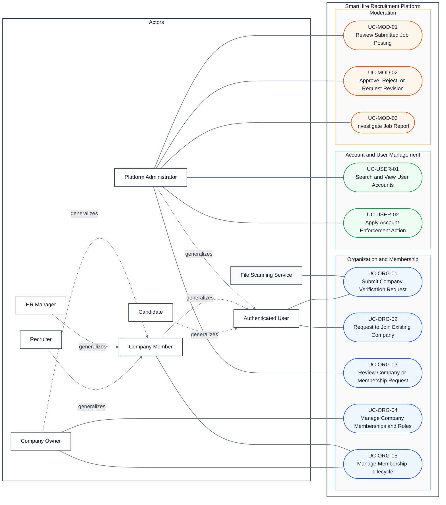

# DGM-04 — Company Administration and Moderation

*Performed by: Group 9 | Reviewed by: Group 9 | Edited by: Group 9*
**Version:** V1.3 (06/08/2026) — UML relationships and report theme revised

## 1. Use-Case Diagram

## 2. Relationship Decisions

- Candidate, Company Member, and Platform Administrator generalize Authenticated User. Recruiter, HR Manager, and Company Owner generalize Company Member.
- UC-USER-01 identifies an account; UC-USER-02 is a separate enforcement goal that may be started after the target account has been selected.
- UC-MOD-01 reviews a posting; UC-MOD-02 records the moderation decision as a related goal after review. Neither pair is modeled as a workflow `«extend»`.
- File Scanning Service is a supporting service for company-verification evidence. A user or other notification recipient is not modeled as an actor unless that party directly interacts with the use case.
