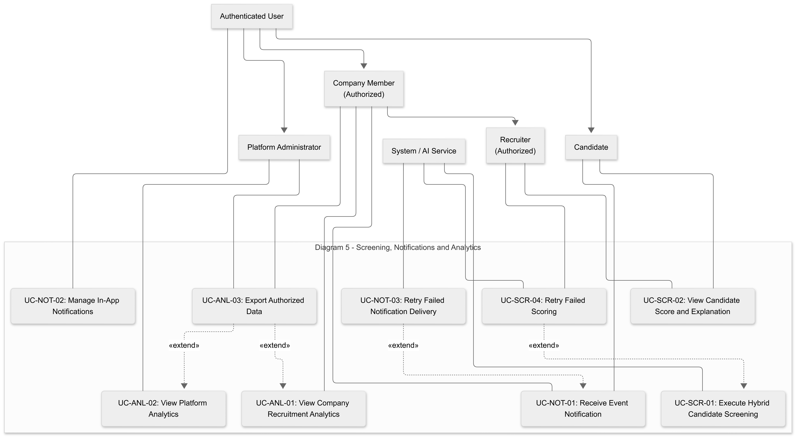

## 1. Use Case Diagram

*Performed by: Lưu Chí Hải | Reviewed by: Nguyễn Gia Quốc Uy | Edited by: Lưu Chí Hải*

*Below is the static render of the Diagram for PDF. The Mermaid source code is attached underneath for reference.*



## 2. Mermaid Source Code

*Performed by: Lưu Chí Hải | Reviewed by: Nguyễn Gia Quốc Uy | Edited by: Lưu Chí Hải*

```text
---
config:
  theme: neutral
  flowchart:
    defaultRenderer: elk
---
flowchart TB
    %% Actors
    sys["System / AI Service"]
    auth_user["Authenticated User"]
    cand["Candidate"]
    cm["Company Member\n(Authorized)"]
    rec["Recruiter\n(Authorized)"]
    admin["Platform Administrator"]

    %% Actor Generalization
    auth_user --> cand
    auth_user --> cm
    auth_user --> admin
    cm --> rec

    %% System Boundary
    subgraph subGraph0["Diagram 5 - Screening, Notifications and Analytics"]
        direction TB
        UC_SCR_01("UC-SCR-01: Execute Hybrid Candidate Screening")
        UC_SCR_02("UC-SCR-02: View Candidate Score and Explanation")
        UC_SCR_04("UC-SCR-04: Retry Failed Scoring")
        UC_NOT_01("UC-NOT-01: Receive Event Notification")
        UC_NOT_02("UC-NOT-02: Manage In-App Notifications")
        UC_NOT_03("UC-NOT-03: Retry Failed Notification Delivery")
        UC_ANL_01("UC-ANL-01: View Company Recruitment Analytics")
        UC_ANL_02("UC-ANL-02: View Platform Analytics")
        UC_ANL_03("UC-ANL-03: Export Authorized Data")
    end

    %% Actor to Use Case Relationships
    sys --- UC_SCR_01
    sys --- UC_SCR_04
    sys --- UC_NOT_03
    
    rec --- UC_SCR_02
    rec --- UC_SCR_04
    
    cand --- UC_SCR_02
    cand --- UC_NOT_01
    
    cm --- UC_NOT_01
    cm --- UC_ANL_01
    cm --- UC_ANL_03
    
    auth_user --- UC_NOT_02
    
    admin --- UC_ANL_02
    admin --- UC_ANL_03

    %% Use Case to Use Case Relationships (Extend)
    UC_SCR_04 -. "«extend»" .-> UC_SCR_01
    UC_NOT_03 -. "«extend»" .-> UC_NOT_01
    UC_ANL_03 -. "«extend»" .-> UC_ANL_01
    UC_ANL_03 -. "«extend»" .-> UC_ANL_02
```