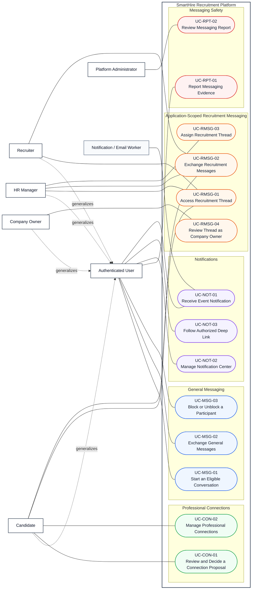

# DGM-05 — Communications and Engagement

*Performed by: Lưu Chí Hải | Reviewed by: Nguyễn Gia Quốc Uy | Edited by: Lưu Chí Hải*

**Version:** V1.5 (2026-08-26) — refactored for Features 008, 011, 013, 016, 019, and 025; only UC-NOT-01–02 currently have matching prototype screenshots

## 1. Purpose and boundary

DGM-05 covers professional connections, general realtime messaging, application-scoped recruitment messaging, messaging reports, notifications, and authorized notification destinations. It no longer owns scoring or analytics: scoring is in DGM-03 and analytics/platform administration is in Khôi-owned DGM-06. DGM-06 files now exist, but their final integration remains pending Hải's review findings and Khôi's corrections.

General messaging and recruitment messaging are separate data models and protocols. General messaging uses Socket.IO plus authoritative REST refetch. Recruitment threads are application/company scoped and use REST; Company Owner has read-only oversight only in that recruitment-thread context.

## 2. Use-Case Diagram

## 3. Traceability and final status

| Domain | Use Cases | Feature | Final status |
|---|---|---:|---|
| General messaging | UC-MSG-01–03 | F008 | Implemented and verified |
| Professional connections | UC-CON-01–02 | F011 | Implemented and verified |
| Messaging reports | UC-RPT-01–02 | F013 | Implemented and verified |
| Notification delivery/center | UC-NOT-01–02 | F016 | Implemented and verified |
| Notification destinations | UC-NOT-03 | F019 | In progress |
| Recruitment messaging | UC-RMSG-01–04 | F025 | In progress |

## 4. Relationship and authorization decisions

- Consent to a professional connection is not automatically a message action; an accepted connection is one implemented eligibility source for UC-MSG-01.
- General messaging may also be eligible through an authorized application context, but it remains distinct from the accountable recruitment thread for that application.
- Candidate and assigned Recruiter/HR Manager may write in an open recruitment thread. HR Manager may assign eligible staff. Owner has audited read-only oversight. Other authorized staff may be read-only observers where the service returns that access kind.
- Notification links are resolved through server-side destination authorization. Missing, expired, or unauthorized context falls back neutrally to `/notifications`; no protected destination data is disclosed.
- Reporting is conditional, but represented as an independent user goal rather than using `«extend»` merely to show a UI entry point.

## 5. Repository evidence

- UI/routes: `web/src/app/(workspace)/messages/`, `connections/`, `notifications/`, `web/src/app/jobs/applied/[applicationId]/messages/`, `web/src/app/recruiter/messages/`, and admin messaging-report resources.
- Services/APIs: `web/src/backend/messaging/`, `connections/`, `notifications/`, `recruitment-messaging/`, `/api/messaging`, `/api/connections`, `/api/notifications`, `/api/recruitment-threads`, and admin report routes.
- Data: messaging, connection, notification, recruitment-thread/message, report/review, outbox, and retention records in `web/prisma/schema.prisma`.
- Tests: focused messaging, connections, reports, notifications, destination-resolver, and recruitment-messaging tests under `web/tests/`.

## 6. Revision history

| Version | Date | Editor | Exact change | Review |
|---|---|---|---|---|
| V1.3 | 2026-08-06 | Lưu Chí Hải | Revised prior supporting-services UML. | Nguyễn Gia Quốc Uy |
| V1.4 | 2026-08-26 | Lưu Chí Hải | Replaced mixed scoring/analytics scope with evidence-backed connections, general messaging, recruitment messaging, reports, notifications, and deep-link authorization. | Nguyễn Minh Khôi |
| V1.5 | 2026-08-26 | Lưu Chí Hải | Linked valid UC-NOT-01–02 prototypes and recorded pending screenshot evidence for the remaining communication use cases in the split specification. | Nguyễn Minh Khôi |
