# DGM-05 — Supporting Services and Analytics

*Performed by: Lưu Chí Hải | Reviewed by: Nguyễn Gia Quốc Uy | Edited by: Lưu Chí Hải*
**Version:** V1.3 (06/08/2026) — UML relationships and report theme revised

## 1. Use-Case Diagram

```mermaid
flowchart TB
    sys["System / AI Service"]
    auth_user["Authenticated User"]
    cand["Candidate"]
    cm["Company Member<br/>(Authorized)"]
    rec["Recruiter<br/>(Authorized)"]
    admin["Platform Administrator"]

    subgraph SYSTEM["SmartHire Recruitment Platform"]
        direction TB
        subgraph SCREENING["Screening"]
            direction TB
            UC_SCR_01(["UC-SCR-01<br/>Execute Hybrid Candidate Screening"])
            UC_SCR_02(["UC-SCR-02<br/>View Candidate Score and Explanation"])
            UC_SCR_04(["UC-SCR-04<br/>Retry Failed Scoring"])
        end
        subgraph NOTIFICATIONS["Notifications"]
            direction TB
            UC_NOT_01(["UC-NOT-01<br/>Receive Event Notification"])
            UC_NOT_02(["UC-NOT-02<br/>Manage In-App Notifications"])
            UC_NOT_03(["UC-NOT-03<br/>Retry Failed Notification Delivery"])
        end
        subgraph ANALYTICS["Analytics"]
            direction TB
            UC_ANL_01(["UC-ANL-01<br/>View Company Recruitment Analytics"])
            UC_ANL_02(["UC-ANL-02<br/>View Platform Analytics"])
            UC_ANL_03(["UC-ANL-03<br/>Export Authorized Data"])
        end
    end

    %% Generalization points from specialized actors to their parents.
    cand -. "generalizes" .-> auth_user
    cm -. "generalizes" .-> auth_user
    admin -. "generalizes" .-> auth_user
    rec -. "generalizes" .-> cm

    sys --- UC_SCR_01
    sys --- UC_SCR_04
    sys --- UC_NOT_03

    rec --- UC_SCR_02
    rec --- UC_SCR_04
    cand --- UC_SCR_02
    cand --- UC_NOT_01
    cm --- UC_NOT_01
    cm --- UC_ANL_01
    cm --- UC_ANL_03
    auth_user --- UC_NOT_02
    admin --- UC_ANL_02
    admin --- UC_ANL_03

    %% True conditional/optional extensions only.
    UC_SCR_04 -. "«extend»<br/>[screening failed; retry selected]" .-> UC_SCR_01
    UC_ANL_03 -. "«extend»<br/>[Export selected]" .-> UC_ANL_01
    UC_ANL_03 -. "«extend»<br/>[Export selected]" .-> UC_ANL_02

    %% UC-NOT-03 is a system recovery process, not an extension of
    %% the recipient's Receive Event Notification goal.

    classDef primaryActor fill:#ffffff,stroke:#334155,stroke-width:1.5px,color:#0f172a;
    classDef supportingActor fill:#f8fafc,stroke:#64748b,stroke-width:1.5px,color:#0f172a;
    classDef screeningCase fill:#fff7ed,stroke:#ea580c,stroke-width:1.5px,color:#172033;
    classDef notificationCase fill:#eff6ff,stroke:#2563eb,stroke-width:1.5px,color:#172033;
    classDef analyticsCase fill:#f0fdf4,stroke:#16a34a,stroke-width:1.5px,color:#172033;

    class auth_user,cand,cm,rec,admin primaryActor;
    class sys supportingActor;
    class UC_SCR_01,UC_SCR_02,UC_SCR_04 screeningCase;
    class UC_NOT_01,UC_NOT_02,UC_NOT_03 notificationCase;
    class UC_ANL_01,UC_ANL_02,UC_ANL_03 analyticsCase;

    style SYSTEM fill:#ffffff,stroke:#334155,stroke-width:2px,color:#0f172a
    style SCREENING fill:#f8fafc,stroke:#fdba74,stroke-width:1px,color:#172033
    style NOTIFICATIONS fill:#f8fafc,stroke:#93c5fd,stroke-width:1px,color:#172033
    style ANALYTICS fill:#f8fafc,stroke:#86efac,stroke-width:1px,color:#172033
    linkStyle default stroke:#64748b,stroke-width:1.5px,color:#334155
```

## 2. Relationship Decisions

- Candidate, Company Member, and Platform Administrator generalize Authenticated User; Recruiter generalizes Company Member.
- UC-SCR-04 is a conditional exception after a failed screening result. The extension point is the failed-result state and the condition is `[screening failed; retry selected]`.
- UC-NOT-03 is an automated delivery-recovery process and is related to UC-NOT-01; it is not an extension of a recipient's notification-receiving goal.
- UC-ANL-03 is optional export from either analytics view, so each retained `«extend»` has the explicit condition `[Export selected]`.
- Candidate and Recruiter views in UC-SCR-02 expose only the data permitted for that actor. Candidate views must not reveal confidential recruiter scoring explanations.
