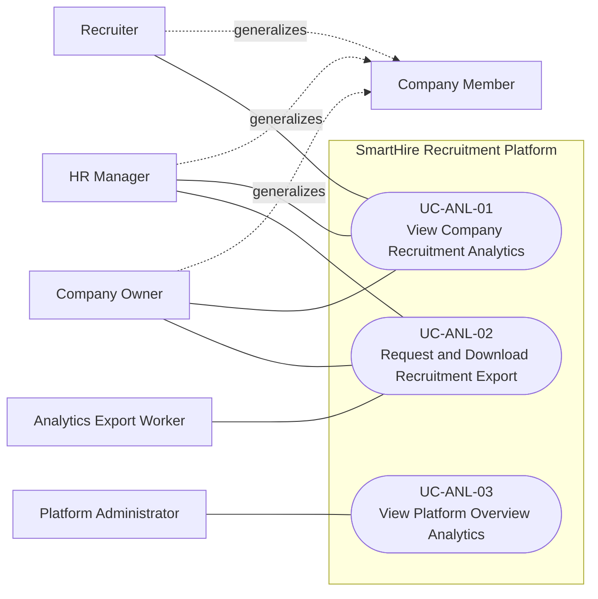

# DGM-06 — Analytics, Export, and Platform Administration

*Performed by: Nguyễn Minh Khôi | Reviewed by: Lưu Chí Hải | Edited by: Nguyễn Minh Khôi, Lưu Chí Hải*

## Scope and evidence

- Company analytics and exports are company-scoped. The export worker is an executable logical worker; it is not a separately provisioned Compose service.
- Platform overview is rendered through the React Admin console and `/api/admin/analytics/overview`, not a standalone `/admin-console/analytics` Next.js page.
- The repository does not provide a general searchable audit-log viewer; it is intentionally not modeled as a final UI use case.
- Feature 027 is outside this diagram.

## Revision History

| Version | Date | Exact change | Performed by | Reviewed by |
|---|---|---|---|---|
| 1.1 | 2026-08-26 | Removed unsupported audit-log UI and qualified platform analytics and export-worker deployment. | Nguyễn Minh Khôi, Lưu Chí Hải | Lưu Chí Hải |
