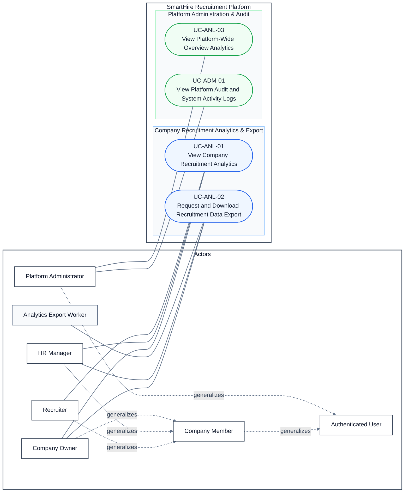

# DGM-06 — Analytics, Export, and Platform Administration

*Performed by: Nguyễn Minh Khôi | Reviewed by: Lưu Chí Hải | Edited by: Nguyễn Minh Khôi*  
**Version:** V1.0 (2026-08-26) — Created for PA5 Final Document Synchronization

### Revision History

| Version | Date | Author/Editor | Summary | Status |
|---|---|---|---|---|
| 1.0 | 2026-08-26 | Nguyễn Minh Khôi | Created dedicated DGM-06 for company recruitment analytics, Excel/CSV export, platform overview metrics, and administrative audit logging (Features 006, 009, 022). | Approved |

## 1. Use-Case Diagram

*Performed by: Nguyễn Minh Khôi | Reviewed by: Lưu Chí Hải | Edited by: Nguyễn Minh Khôi*

## 2. Relationship Decisions

*Performed by: Nguyễn Minh Khôi | Reviewed by: Lưu Chí Hải | Edited by: Nguyễn Minh Khôi*

- `UC-ANL-01` and `UC-ANL-02` are strictly company-scoped. Only authorized company members (`Company Owner`, `HR Manager`, and `Recruiter` for analytics; `Company Owner` and `HR Manager` for data export) may access company metrics and applicant export data.
- `UC-ANL-03` and `UC-ADM-01` are platform-wide and strictly restricted to `Platform Administrator`.
- `Analytics Export Worker` serves as a background supporting service that claims export tasks and writes generated Excel/CSV files to ephemeral storage.
