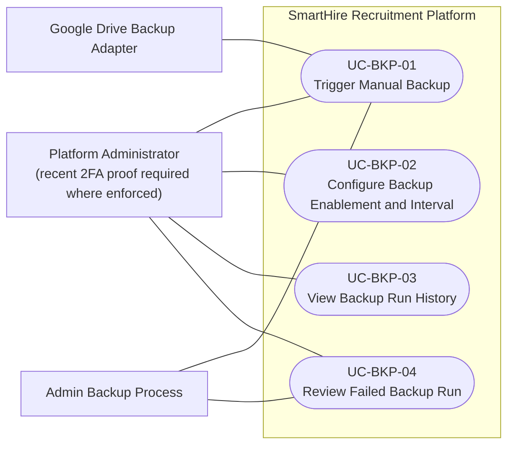

# DGM-07 — Administrator Data Backup

*Performed by: Nguyễn Minh Khôi | Reviewed by: Lưu Chí Hải | Edited by: Nguyễn Minh Khôi, Lưu Chí Hải*

## Scope and evidence

- The implemented admin backup UI is a resource within `/admin-console`, not separate backup/settings/history pages.
- Recent administrator step-up proof is 15 minutes where required.
- Configuration evidence is limited to `enabled` and `intervalSeconds`; no cron/daily/weekly, retention, destination, or notification-recipient setting is claimed.
- Current run states are `QUEUED`, `LEASED`, `SUCCEEDED`, and `FAILED`. The service uploads an encrypted result through the Google Drive adapter and records Drive metadata; no persistent local-backup store or restore UI is claimed.

## Revision History

| Version | Date | Exact change | Performed by | Reviewed by |
|---|---|---|---|---|
| 1.1 | 2026-08-26 | Corrected routes, step-up duration, configuration and run-status claims; retained the no-restore boundary. | Nguyễn Minh Khôi, Lưu Chí Hải | Lưu Chí Hải |
