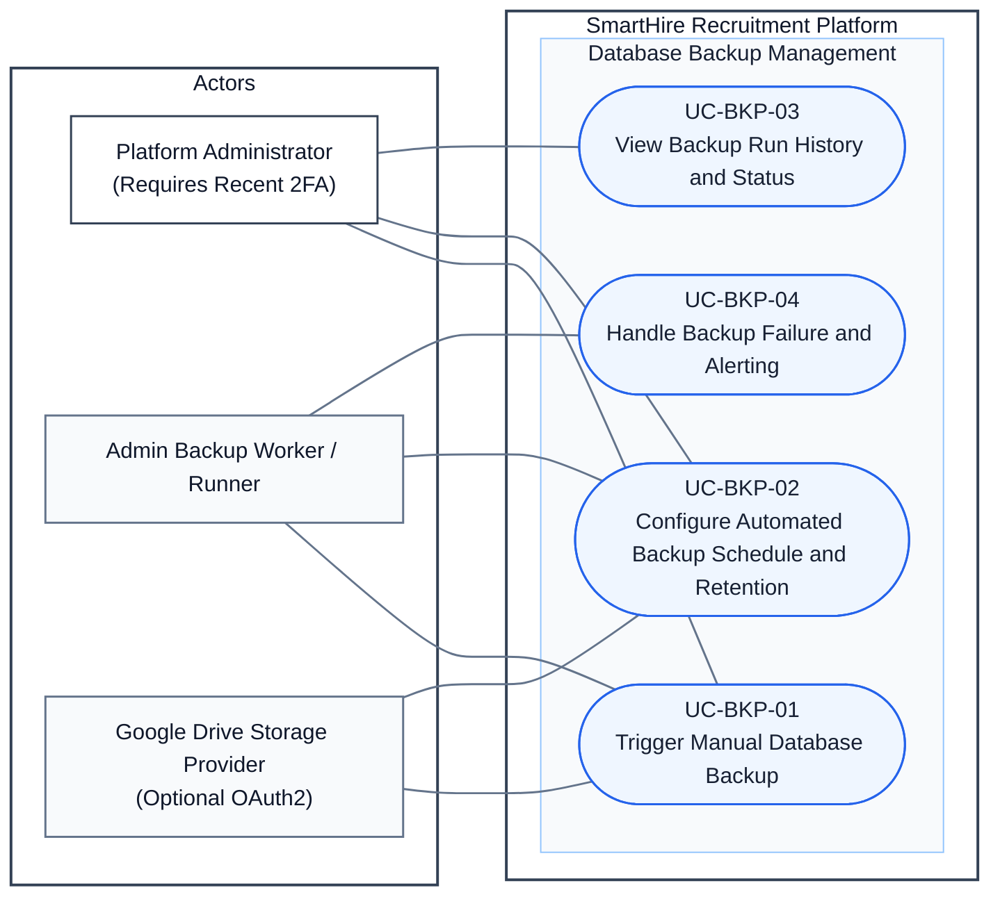

# DGM-07 — Administrator Data Backup

*Performed by: Nguyễn Minh Khôi | Reviewed by: Lưu Chí Hải | Edited by: Nguyễn Minh Khôi*  
**Version:** V1.0 (2026-08-26) — Created for PA5 Final Document Synchronization

### Revision History

| Version | Date | Author/Editor | Summary | Status |
|---|---|---|---|---|
| 1.0 | 2026-08-26 | Nguyễn Minh Khôi | Created dedicated DGM-07 for privileged database backup, scheduled runs, history logging, and step-up 2FA (Feature 026). Explicitly noted absence of in-app restore UI. | Approved |

## 1. Use-Case Diagram

*Performed by: Nguyễn Minh Khôi | Reviewed by: Lưu Chí Hải | Edited by: Nguyễn Minh Khôi*

## 2. Relationship Decisions

*Performed by: Nguyễn Minh Khôi | Reviewed by: Lưu Chí Hải | Edited by: Nguyễn Minh Khôi*

- `Platform Administrator` must satisfy a **Step-Up 2FA requirement** (recent 2FA verification within 10 minutes) before initiating a manual backup or modifying automated schedule settings.
- `UC-BKP-01`, `UC-BKP-02`, `UC-BKP-03`, and `UC-BKP-04` encompass the entire administrative backup domain.
- **Explicit Scope Boundary:** There is **no in-app database restore UI**. Database restoration is an out-of-band disaster-recovery operation executed directly by authorized DBAs via PostgreSQL CLI tools to protect data integrity and prevent destructive overwrites.
