# DGM-01 — Specification of Identity, Access, and Profile

## Use-Case Specifications

*Performed by: Nguyễn Gia Quốc Uy | Reviewed by: Nguyễn Minh Khôi | Edited by: Nguyễn Minh Khôi*  
**Version:** V1.5 (2026-08-26) — PA5 Final Document Synchronization Review

### Revision History

| Version | Date | Author/Editor | Summary | Status |
|---|---|---|---|---|
| 1.4 | 2026-07-25 | Nguyễn Gia Quốc Uy | Reconciled with PA3 implementation; added 2FA, owned-session management, and full account recovery. | Baseline |
| 1.5 | 2026-08-26 | Nguyễn Minh Khôi (Reviewer) | PA5 Document Synchronization review: Verified 16 use cases (UC-AUTH-01–11, UC-ACC-01–02, UC-PROF-01–03) against Features 001, 002, 004, 005. Reconciled verification notes and step-up auth requirements. | Approved |

# 1. UC-AUTH-01 — Register Account

*Performed by: Nguyễn Gia Quốc Uy | Reviewed by: Nguyễn Minh Khôi | Edited by: Nguyễn Minh Khôi*

## 1.1. Use-Case Information
| Field | Value |
|---|---|
| **Use-Case ID** | UC-AUTH-01 |
| **Use-Case Name** | Register Account |
| **Primary Actor** | Visitor |
| **Supporting Actor** | Email Delivery Service |
| **Priority** | High |
| **Trigger** | The visitor selects **Create account** |

## 1.2. Brief Description
This use case allows a visitor to create a standard SmartHire account by providing a full name, email address, and password. The system creates a pending account and sends an email-verification message.

## 1.3. Preconditions
1. The visitor does not have an active authenticated session.
2. The registration service and account database are available.
3. The visitor can access the supplied email address.

## 1.4. Basic Flow
1. The Visitor selects **Create account**.
2. The System displays the registration form.
3. The Visitor enters full name, email address, password, and password confirmation.
4. The System validates that the password contains at least one uppercase letter, one lowercase letter, one number, and one special character.
5. The Visitor accepts the Terms of Service and submits the form.
6. The System validates the submitted information.
7. The System verifies that the email address is not already associated with an account.
8. The System securely hashes the password.
9. The System creates an account with the PENDING_VERIFICATION status.
10. The System creates a single-use email-verification token.
11. The Email Delivery Service sends a verification message.
12. The System displays the verification-pending page.
13. Account activation continues through **UC-AUTH-02 — Verify Email Address**.

## 1.5. Alternative Flows

### 1.5.1. AF-01 — Required Information Is Missing
At Step 6, if a required field is missing:
1. The System highlights the missing fields.
2. The System preserves valid entered information.
3. The use case resumes at Step 3.

### 1.5.2. AF-02 — Email Format Is Invalid
At Step 5, if the email format is invalid:
1. The System displays an email-format-validation message.
2. The use case resumes at Step 3.

### 1.5.3. AF-03 — Password Does Not Satisfy the Rule
At Step 4, if the password does not match the rule:
1. The System displays the applicable password requirements.
2. The System clears the password fields.
3. The use case resumes at Step 3.

### 1.5.4. AF-04 — Password Confirmation Does Not Match
At Step 5, if the two password values do not match:
1. The System displays a password-mismatch message.
2. The use case resumes at Step 3.

### 1.5.5. AF-05 — Email Address Is Already Registered
At Step 6, if the email is already associated with an account:
1. The System displays a neutral response instructing the Visitor to check the email inbox or log in.
2. The System does not disclose detailed account status.
3. The use case ends without creating another account or the Visitor try another email which is not associated with any account.

### 1.5.6. AF-06 — Visitor Cancels Registration
Before Step 8, the Visitor may leave or cancel the form. The System does not create an account.

### 1.5.7. EF-01 — Email Delivery Fails
At Step 11, if the verification message cannot be delivered
1. The System retains the pending account.
2. The System records the failed delivery.
3. The System displays the verification-pending page with a resend option.
4. The use case ends.

### 1.5.8. EF-02 — Account Creation Fails
At Step 9, if the account cannot be saved:
1. The System does not report successful registration.
2. The System records the failure.
3. The System displays a general retry message.
4. The use case ends.

## 1.6. Postconditions
### 1.6.1. Success Postconditions
- A pending account exists.
- A verification token has been generated.
- A verification message has been sent or scheduled.
- No authenticated session has been established.

### 1.6.2 Failure Postconditions
- No incomplete active account is created.
- Password values are never stored or logged in plain text.

## 1.7. Special Requirements
- Passwords must be hashed using an approved adaptive password-hashing algorithm.
- The registration endpoint must enforce abuse-control limits.
- Verification tokens must be single-use, securely generated, and time-limited.
- Sensitive values must not appear in logs or URLs other than the required opaque token.

## Prototype Evidence

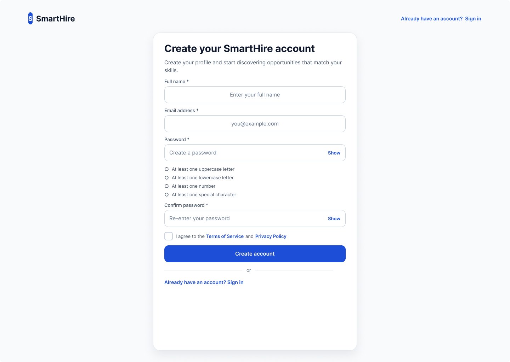

*Figure 1.1 — UC-AUTH-01 basic flow; the Visitor enters registration data.*

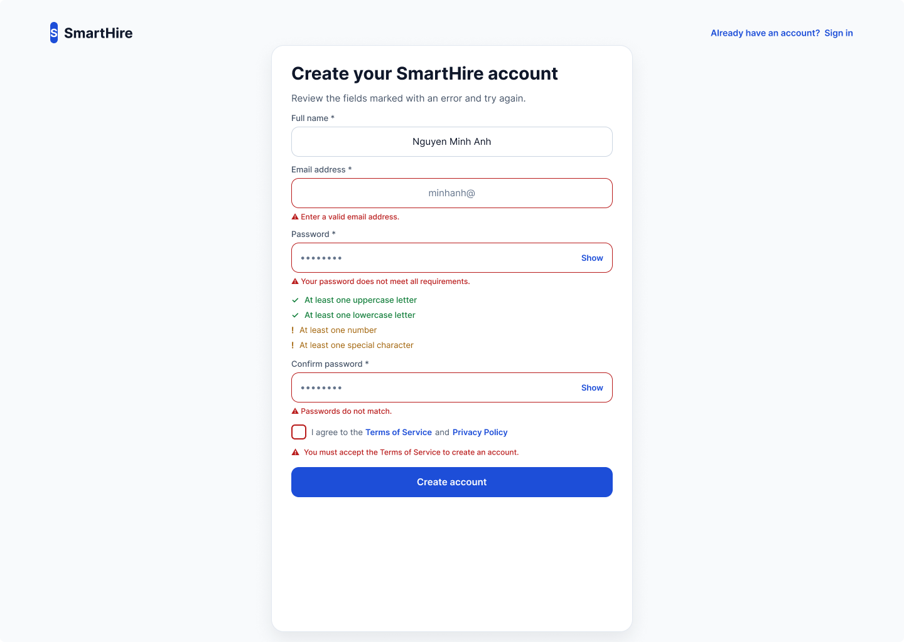

*Figure 1.2 — UC-AUTH-01 alternative-flow evidence; validation feedback is shown without creating an account.*

## Related Use Cases and Entry Points
### Email Verification
After the pending account is created, the Visitor may start UC-AUTH-02 to activate it. Email verification is a separate goal, not a mandatory sub-flow of registration.

---
# 2. UC-AUTH-02 — Verify Email Address

## 2.1. Use-Case Information
| Field | Value |
|---|---|
| **Use-Case ID** | UC-AUTH-02 |
| **Use-Case Name** | Verify Email Address |
| **Primary Actor** | Visitor |
| **Supporting Actor** | Email Delivery Service |
| **Priority** | High |
| **Trigger** | The Visitor opens an email-verification link. |

## 2.2. Brief Description
This use case confirms that the Visitor controls the registered email address and activates the corresponding pending account.

## 2.3. Preconditions
1. A pending account exists.
2. A verification token has been issued for the account

## 2.4. Basic Flow
1. The Visitor opens the verification link.
2. The System extracts the verification token.
3. The System validates the token’s signature, purpose, expiration time, and unused status.
4. The System finds the corresponding pending account.
5. The System marks the email address as verified.
6. The System changes the account status to ACTIVE.
7. The System invalidates the verification token.
8. The System records the verification event.
9. The System displays a verification-success page with a login action.

## 2.5. Alternative Flows

### 2.5.1. AF-01 — Verification Token Is Invalid
At Step 3, if the token is invalid, the System displays a neutral invalid-link message and offers a new verification-message request.

### 2.5.2. AF-02 — Verification Token Has Expired
At Step 3, if the token has expired, the System displays an expired-link message and offers a resend action.

### 2.5.3. AF-03 — Token Has Already Been Used
At Step 3, if the token has already been used, the System displays a neutral message indicating that the link is no longer valid.

### 2.5.4. AF-04 — Account Is Already Verified
At Step 4, if the account is already active, the System displays the verification-success page without changing the account.

### 2.5.5. AF-05 — Visitor Requests Another Verification Message
1. The Visitor submits the email address.
2. The System displays the same neutral response regardless of whether a matching account exists.
3. If an eligible pending account exists, the System invalidates previous verification tokens and sends a new token.

### 2.5.6. AF-06 — Resend Is Rate-Limited
If fewer than 60 seconds have passed since the previous request, or the hourly limit is exceeded, the System displays the remaining cooldown time.

### 2.5.7. EF-01 — Activation Cannot Be Saved
If Steps 5–7 cannot be committed atomically, the System rolls back the operation, records the failure, and displays a retry message.

## 2.6. Postconditions
- On success, the account is active and the email address is verified.
- The used verification token cannot be used again.
- On the failure, the account remains in its  previous consistent state.

## 2.7. Special Requirements
- Token validation must not expose internal token contents.
- Invalid-token attempts must be rate-limited.
- Account activation and token invalidation must be atomic.
- Resend responses must prevent account enumeration.

## Prototype Evidence

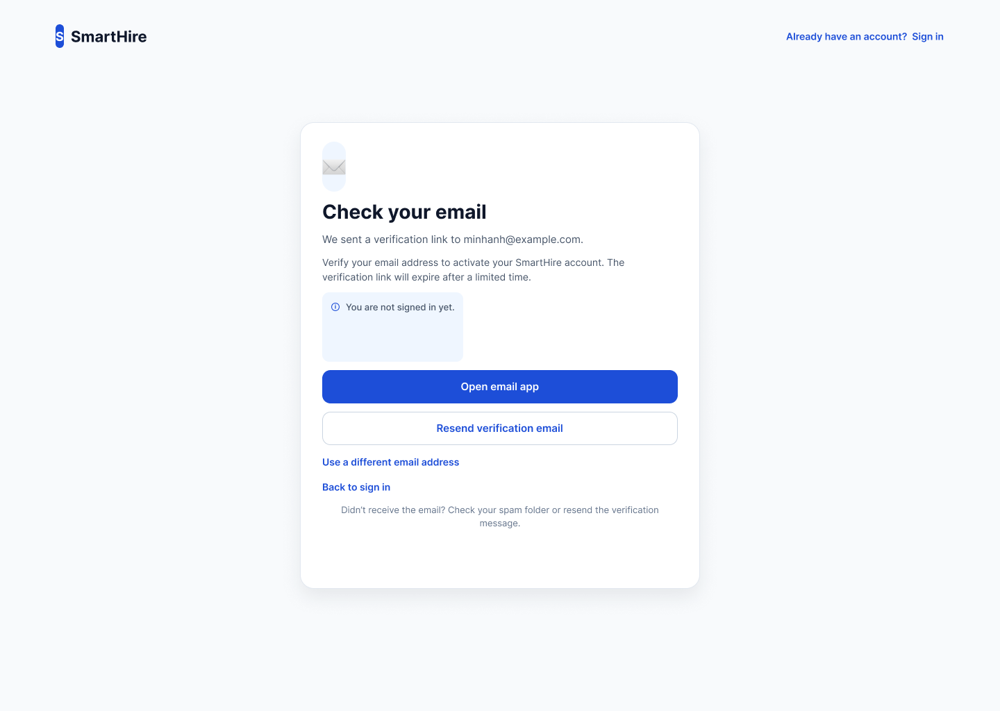

*Figure 2.1 — UC-AUTH-02 basic flow; the verification link activates the pending account.*

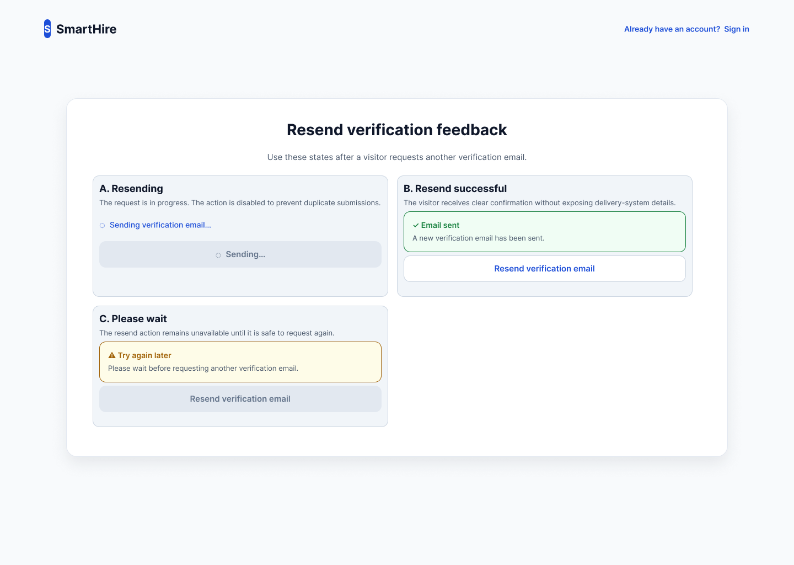

*Figure 2.2 — UC-AUTH-02 AF-06; resend is rate-limited with a visible cooldown.*

---
# 3. UC-AUTH-03 — Log In

## 3.1. Use-Case Information
| Field | Value |
|---|---|
| **Use-Case ID** | UC-AUTH-03 |
| **Use-Case Name** | Log In |
| **Primary Actor** | Visitor |
| **Supporting Actor** | None |
| **Priority** | High |
| **Trigger** | The Visitor submits the login form.|

## 3.2. Brief Description
This use case validates the primary email-and-password factor. It establishes a secure full session immediately only when the account does not require two-factor authentication; otherwise it creates a restricted, short-lived challenge completed by **UC-AUTH-09**.

## 3.3. Preconditions
1. The Visitor is not currently authenticated.
2. An active, verified account exists.

## 3.4. Basic Flow
1. The Visitor opens the login page.
2. The System displays the login form.
3. The Visitor enters an email address and password.
4. The Visitor submits the form.
5. The System validates the request format.
6. The System finds the account using the normalized email address.
7. The System verifies the password.
8. The System verifies that the account is active and permitted to log in.
9. The System determines whether two-factor authentication is enabled for the account.
10. If two-factor authentication is not enabled, the System creates a secure authenticated session and rotates its identifier.
11. The System records the successful login without recording credentials.
12. The System redirects the Authenticated User to the requested protected page or default dashboard.

## 3.5. Alternative Flows

### 3.5.1. AF-01 — Invalid Credentials
At Steps 6–7, if the account is not found or the password is incorrect:
1. The System records the failed attempt.
2. The System displays the same neutral invalid-credentials message.
3. The use case resumes at Step 3.

### 3.5.2. AF-02 — Email Is Not Verified
At Step 8, if the account is pending verification, the System displays a verification-required message with a resend option.

### 3.5.3. AF-03 —  Account Is Temporarily Locked
At Step 8, if the account is temporarily locked, the System displays a neutral temporary-restriction message.

### 3.5.4. AF-04 — Account Is Suspended or Disabled
At Step 8, the System denies access and provides the permitted support or appeal instruction.

### 3.5.5. AF-05 — Visitor Selects Forgot Password
At Step 2, the use case invokes **UC-AUTH-05 — Reset Forgotten Password**.

### 3.5.6. AF-06 — Valid Session Already Exists
If a valid session exists, the System redirects the user to the requested page without creating another session.

### 3.5.7. AF-07 — Login Rate Limit Is Exceeded
If the account or source exceeds the configured limit, the System rejects the attempt and displays a retry-later message.

### 3.5.8. EF-01 — Authentication Service Is Unavailable
The System does not establish a session and displays a temporary-unavailability message.

### 3.5.9. AF-08 — Two-Factor Authentication Is Enabled
At Step 9, if two-factor authentication is enabled:
1. The System creates only a restricted, short-lived pre-authentication challenge.
2. The System does not create a full authenticated session and does not authorize protected resources.
3. The System redirects the Visitor to **UC-AUTH-09 — Complete Two-Factor Verification**.
4. Login completes only after the TOTP or backup-code challenge succeeds.

### 3.5.10. AF-09 — Full Account Recovery Is Required
If the Visitor has lost the password, TOTP access, and every backup code, the Visitor may initiate **UC-AUTH-11 — Recover Account After Loss of All Factors**. The System does not disable 2FA through ordinary login support or ordinary password reset.

## 3.6. Postconditions
- On success without 2FA, a valid authenticated session exists.
- When 2FA is enabled, only a restricted challenge exists until **UC-AUTH-09** succeeds.
- On failure, no session is created.
- Login success or failure is recorded without logging the password.

## 3.7. Special Requirements
- Login errors must not reveal whether an account exists.
- Five failed attempts per account or 20 attempts per IP address within 15 minutes trigger the configured cooldown.
- Session identifiers must be regenerated after authentication.
- Authentication cookies must be secure and inaccessible to client-side scripts.

## Prototype Evidence

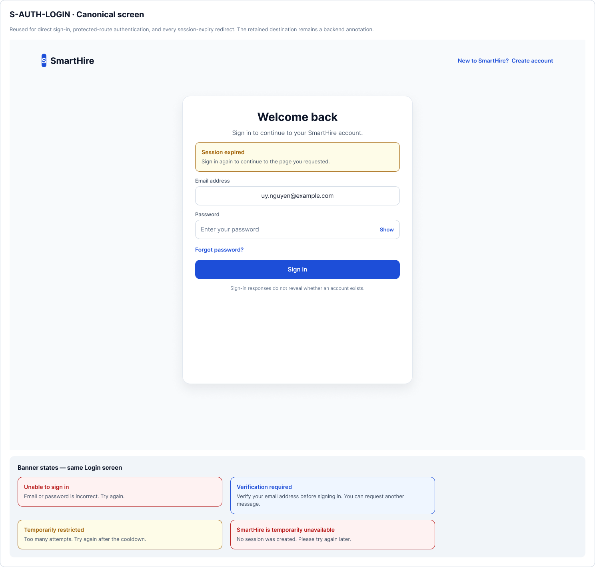

*Figure 3.1 — UC-AUTH-03 basic flow; the Visitor submits primary credentials.*

*Figure 3.2 — UC-AUTH-03 postcondition; a successful login redirects to the protected workspace.*

## 3.8. Related Use Cases and Entry Points
- **Forgot Password:** At the login form, the Visitor may start **UC-AUTH-05 — Reset Forgotten Password**.
- **Two-Factor Challenge:** When 2FA is enabled, **UC-AUTH-09 — Complete Two-Factor Verification** is inserted at the explicit extension point after primary credentials are validated and before a full session is created.
- **Loss of All Factors:** A Visitor who cannot use the password, TOTP, or any backup code may start **UC-AUTH-11 — Recover Account After Loss of All Factors**.
- **Protected Page Authentication:** When **UC-AUTH-07 — Access Protected Account Page** finds no valid session, it directs the person to this login goal. The page-access goal is not modeled as an extension of login.

---

# 4. UC-AUTH-04 — Log Out and End Session

## 4.1. Use-Case Information
| Field | Value |
|---|---|
| **Use-Case ID** | UC-AUTH-04 |
| **Use-Case Name** | Log Out and End Session |
| **Primary Actor** | Authenticated User |
| **Supporting Actor** | None |
| **Priority** | High |
| **Trigger** | The Authenticated User selects **Log Out**|

## 4.2. Brief Description
This use case securely terminates the current authenticated session.

## 4.3. Preconditions
- The user has or recently had an authenticated session

## 4.4. Basic Flow
1. The Authenticated User opens the account menu.
2. The System displays the available account actions.
3. The Authenticated User selects **Log out**.
4. The System identifies the current session.
5. The System revokes the server-side session or refresh credential.
6. The System clears the authentication cookies.
7. The System records the logout event.
8. The System redirects the Visitor to the public home or login page.

## 4.5. Alternative Flows

### 4.5.1. AF-01 — Session Has Already Expired
The System clears any remaining local authentication data and redirects the Visitor to the login page.

### 4.5.2. EF-01 — Server-Side Revocation Fails
1. The System still clears local authentication cookies.
2. The System records or queues the revocation failure.
3. The System redirects the Visitor to the public page.
4. The System does not prevent the local logout from completing.

## 4.6. Postconditions
- The current browser no longer has usable authentication credentials.
- Protected pages require authentication again.

## 4.7. Special Requirements
- Logout must be idempotent.
- Failure to write an audit record must not prevent session invalidation.
- Cached protected content must not remain available after logout.

## Prototype Evidence

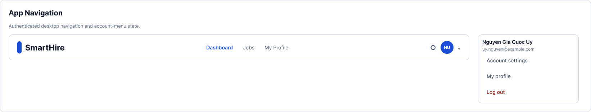

*Figure 4.1 — UC-AUTH-04 basic flow; the current session has ended and protected content is no longer displayed.*

---

# 5. UC-AUTH-05 — Reset Forgotten Password

## 5.1. Use-Case Information
| Field | Value |
|---|---|
| **Use-Case ID** | UC-AUTH-05 |
| **Use-Case Name** | Reset Forgotten Password |
| **Primary Actor** | Visitor |
| **Supporting Actor** | Email Delivery Service |
| **Priority** | High |
| **Trigger** | The Visitor selects **Forgot password**.|

## 5.2. Brief Description
This use case allows a Visitor who has forgotten the password to establish a new password through a time-limited email reset link. It is not the lower-assurance full-account-recovery procedure and does not disable an existing TOTP factor or unused backup codes.

## 5.3. Preconditions
- The Visitor is not required to be authenticated.
- The Visitor can access the registered email inbox.

## 5.4. Basic Flow
1. The Visitor selects Forgot password.
2. The System displays the password-recovery form.
3. The Visitor enters an email address.
4. The System accepts the request and displays a neutral response.
5. The System finds an eligible account without revealing the result.
6. The System creates a single-use password-reset token.
7. The Email Delivery Service sends the password-reset message.
8. The Visitor opens the reset link.
9. The System validates the reset token.
10. The System displays the new-password form.
11. The Visitor enters and confirms a new password.
12. The System validates the new password.
13. The System securely updates the password.
14. The System invalidates the reset token and existing account sessions.
15. The System invalidates outstanding authentication challenges and queues one password-change security notification.
16. The System preserves enabled TOTP and every unused backup code.
17. The System displays a password-reset-success page and requires a normal login; it does not create a session automatically.

## 5.5. Alternative Flows

### 5.5.1. AF-01 — Email Is Invalid or Not Registered
The System displays the same neutral response as Step 4 and does not disclose whether an account exists.

### 5.5.2. AF-02 — Reset Token Is Invalid, Expired, or Used
At Step 9, the System displays an invalid-or-expired-link page with an option to request another message.

### 5.5.3. AF-03 — Password Does Not Satisfy Policy
At Step 12, the System displays the applicable password requirements and resumes at Step 11.

### 5.5.4. AF-04 — Password Confirmation Does Not Match
The System displays a mismatch message and resumes at Step 11.

### 5.5.5. AF-05 — New Password Matches Current Password
The System asks the Visitor to choose a different password.

### 5.5.6. EF-01 — Email Delivery Fails
The System retains the neutral public response, records the delivery failure, and does not reveal the account status.

### 5.5.7. EF-02 — Password Update Fails
The System preserves the old password, keeps the reset operation consistent, and displays a retry message.

## 5.6. Postconditions
- On success, the password is replaced and previous sessions are invalidated.
- Existing TOTP configuration and unused backup codes remain enabled.
- No authenticated session is created automatically.
- The used reset token cannot be reused.
- On failure, the existing password remains valid unless the update was committed successfully.

## 5.7. Special Requirements
- Public recovery responses must prevent account enumeration.
- Reset tokens must be single-use and time-limited.
- Reset links must use HTTPS.
- Recovery requests must be rate-limited and audited.
- A normal password reset must preserve TOTP and unused backup codes; loss of every factor is handled only by **UC-AUTH-11**.

## Prototype Evidence

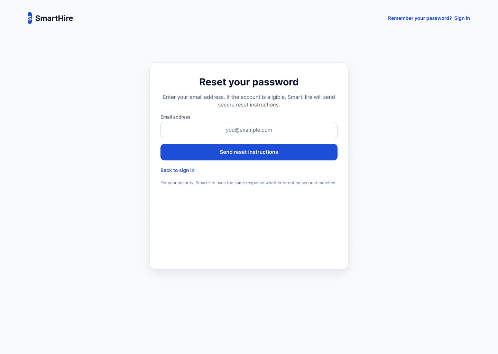

*Figure 5.1 — UC-AUTH-05 basic flow; the Visitor requests a normal password reset.*

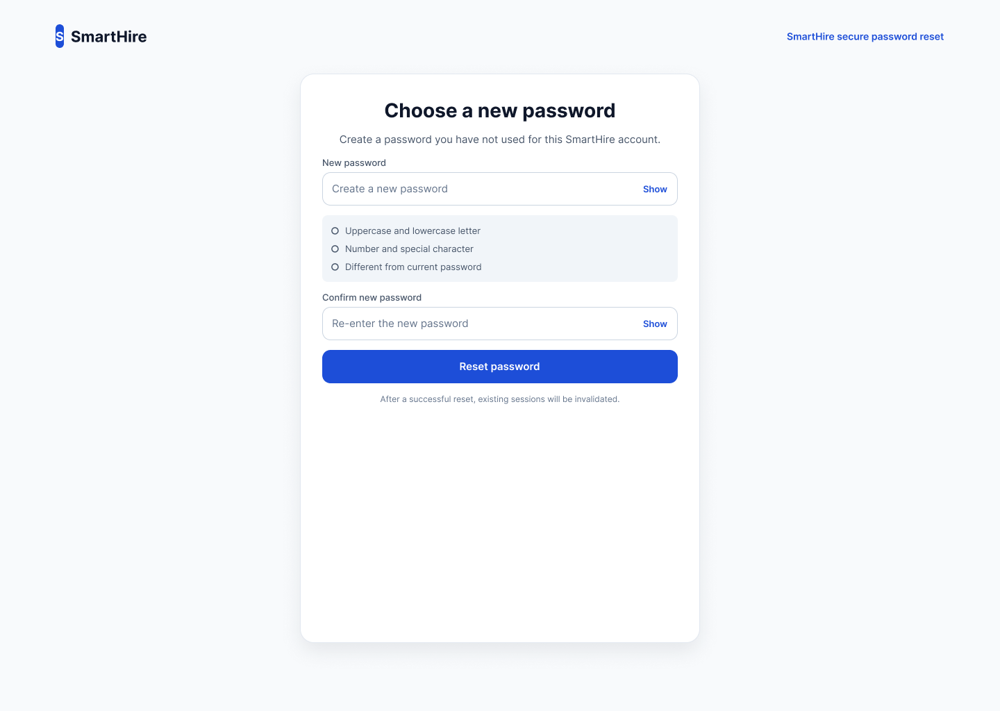

*Figure 5.2 — UC-AUTH-05 completion state; the new password is set without creating a session automatically.*

---

# 6. UC-AUTH-06 — Change Password

## 6.1. Use-Case Information
| Field | Value |
|---|---|
| **Use-Case ID** | UC-AUTH-06 |
| **Use-Case Name** | Change Password |
| **Primary Actor** | Authenticated User |
| **Supporting Actor** | None |
| **Priority** | High |
| **Trigger** | The Authenticated User selects **Change password**.|

## 6.2. Brief Description
This use case allows an Authenticated User to replace the current account password.

## 6.3. Preconditions
1. The user has a valid authenticated session.
2. The account uses password-based authentication.

## 6.4. Basic Flow
1. The Authenticated User opens account security settings.
2. The System displays the change-password form.
3. The Authenticated User enters the current password.
4. The Authenticated User enters and confirms a new password.
5. The System verifies the current password.
6. The System validates the new password and confirmation.
7. The System securely hashes and stores the new password.
8. The System invalidates other active account sessions.
9. The System records the password-change event.
10. The System displays a success confirmation.

## 6.5. Alternative Flows

### 6.5.1. AF-01 — Current Password Is Incorrect
The System displays a neutral error and resumes at Step 3.

### 6.5.2. AF-02 — New Password Violates Policy
The System displays the applicable requirements and resumes at Step 4.

### 6.5.3. AF-03 — Password Confirmation Does Not Match
The System displays a mismatch message and resumes at Step 4.

### 6.5.4. AF-04 — New Password Equals Current Password
The System requires the user to choose a different password.

### 6.5.5. AF-05 — User Cancels the Change
Before Step 7, the user cancels. The existing password remains unchanged.

### 6.5.6. AF-06 — Session Has Expired
The System redirects the user to login and preserves no password values.

### 6.5.7. EF-01 — Password Update Fails
The System keeps the existing password, records the failure, and displays a retry message.

## 6.6. Postconditions
- On success, the new password is active
- Other active sessions are invalidated.
- On failure, the existing password remains unchanged.

## 6.7. Special Requirements
- Password values must never be logged.
- The current password must be reverified before the change.
- The update and session invalidation must be performed consistently.

## Prototype Evidence

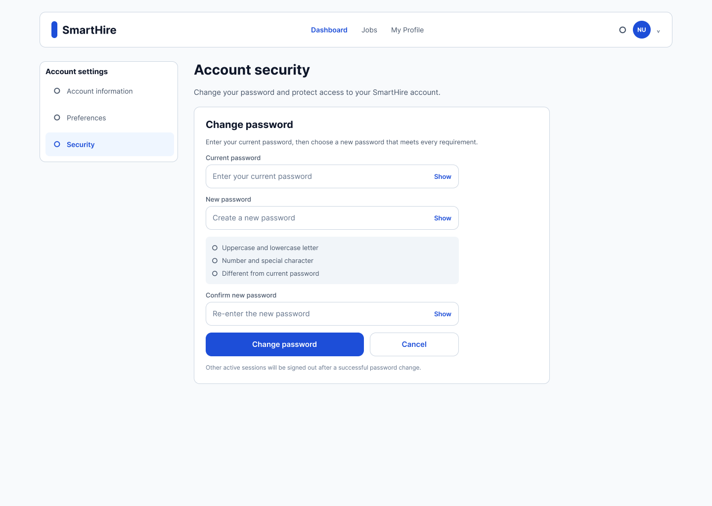

*Figure 6.1 — UC-AUTH-06 basic flow; the authenticated user submits a password change.*

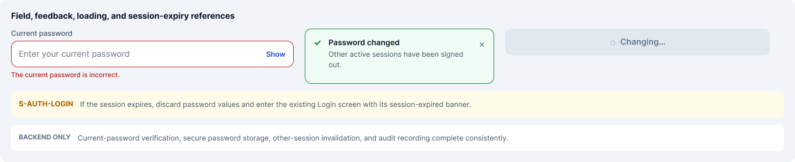

*Figure 6.2 — UC-AUTH-06 alternative-flow evidence; invalid password input is rejected.*

---

# 7. UC-AUTH-07 — Access Protected Account Page

## 7.1. Use-Case Information
| Field | Value |
|---|---|
| **Use-Case ID** | UC-AUTH-07 |
| **Use-Case Name** | Access Protected Account Page |
| **Primary Actor** | Authenticated User |
| **Supporting Actor** | None |
| **Priority** | High |
| **Trigger** | A person requests a protected account page.|

## 7.2. Brief Description
This use case verifies the requester's session and authorization before displaying a protected account page.

## 7.3. Preconditions
- The requested route is classified as protected

## 7.4. Basic Flow

1. The Authenticated User requests a protected account page.
2. The System reads the authentication credential.
3. The System validates the session.
4. The System loads the account and applicable authorization context.
5. The System verifies that the account is active.
6. The System verifies that the user is authorized to access the requested resource.
7. The System displays the protected page.

## 7.5. Alternative Flows

### 7.5.1. AF-01 — No Authenticated Session Exists
The System invokes UC-AUTH-03 — Log In and retains the requested destination.

### 7.5.2. AF-02 — Session Has Expired
The System clears invalid authentication data and redirects the person to login.

### 7.5.3. AF-03 — User Lacks Permission
The System denies access and displays an access-denied page.

### 7.5.4. AF-04 — Account Is Suspended
The System terminates the session and displays the permitted support or appeal information.

### 7.5.5. AF-05 — Requested Resource Does Not Exist
The System displays a not-found page without exposing unauthorized resource information.

### 7.5.6. EF-01 — Authorization Service Is Unavailable
The System denies access by default and displays a temporary-error page.

## 7.6. Postconditions
- On success, the authorized page is displayed.
- On failure, protected data is not disclosed.

## 7.7. Special Requirements
- Authorization must be checked server-side.
- The system must deny access by default when authorization cannot be determined.
- Resource existence must not be disclosed to unauthorized users.

## Prototype Evidence

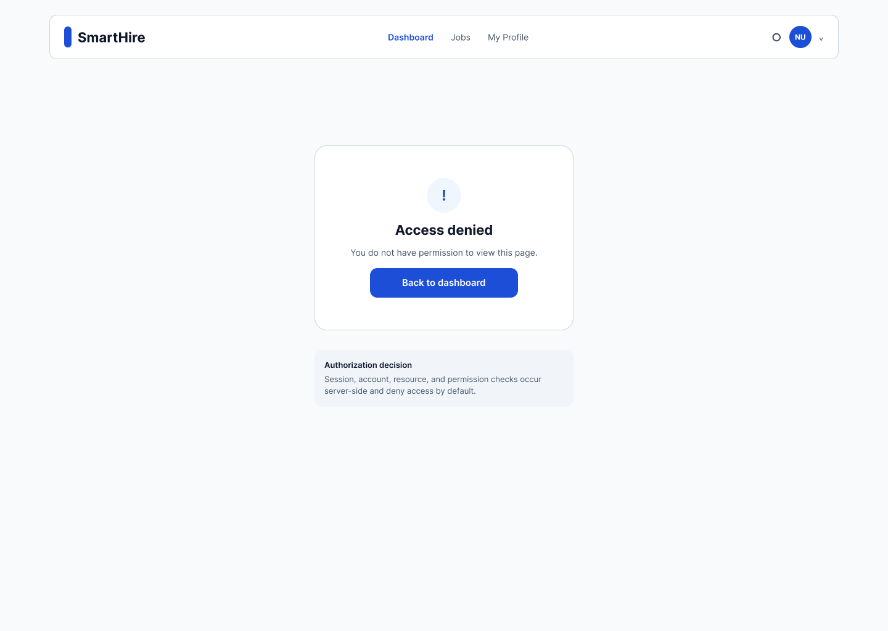

*Figure 7.1 — UC-AUTH-07 alternative-flow evidence; an unauthenticated or unauthorized request is denied safely.*

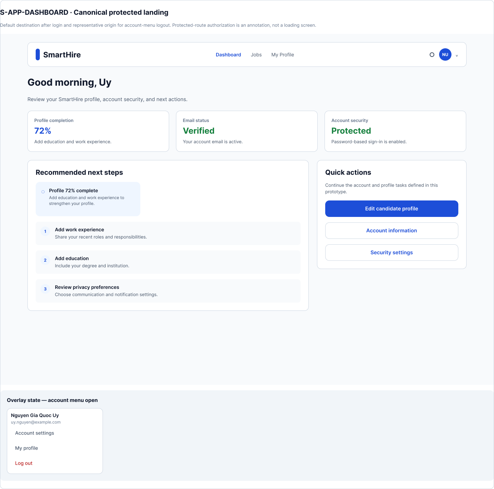

*Figure 7.2 — UC-AUTH-07 basic-flow evidence; the protected dashboard is shown after authorization succeeds.*

---

# 8. UC-ACC-01 — Manage Account Information

## 8.1. Use-Case Information
| Field | Value |
|---|---|
| **Use-Case ID** | UC-ACC-01 |
| **Use-Case Name** | Manage Account Information |
| **Primary Actor** | Authenticated User |
| **Supporting Actor** | None |
| **Priority** | High |
| **Trigger** | The user opens account-information settings.|

## 8.2. Brief Description
This use case allows an Authenticated User to view and update general account information.

## 8.3. Preconditions
1. The user has a valid authenticated session
2. The account is active

## 8.4. Basic Flow
1. The Authenticated User opens account settings.
2. The System displays the current account information.
3. The Authenticated User selects **Edit**.
4. The System displays editable fields.
5. The Authenticated User updates the full name, phone number, or other permitted information.
6. The Authenticated User submits the changes.
7. The System validates the submitted information.
8. The System verifies that the record has not been modified by another request.
9. The System saves the changes.
10. The System records the account-update event.
11. The System displays the updated information and a success message.

## 8.5. Alternative Flows

### 8.5.1. AF-01 — Submitted Information Is Invalid
The System identifies invalid fields, preserves valid input, and resumes at Step 5.

### 8.5.2. AF-02 — User Changes the Email Address
The System records the new email as pending, preserves the current verified email, and initiates email verification.

### 8.5.3. AF-03 — New Email Is Already Registered
The System displays a neutral unavailable-email message and resumes at Step 5.

### 8.5.4. AF-04 — User Cancels Editing
The System discards unsaved changes and displays the previously stored information.

### 8.5.5. AF-05 — Concurrent Update Is Detected
The System informs the user that the information has changed, reloads the current version, and asks the user to review the update again.

### 8.5.6. AF-06 — Session Has Expired
The System redirects the user to login without saving the changes.

### 8.5.7. EF-01 — Save Operation Fails
The System preserves the previous account information and displays a retry message.

## 8.6. Postconditions
- On success, valid account information is updated.
- On cancellation or failure, stored information remains unchanged.
- An email change does not become verified until verification succeeds.

## 8.7. Special Requirements
- Only explicitly editable fields may be changed.
- Sensitive changes must be audited.
- Concurrent updates must not silently overwrite newer information.

## 8.8. Related Use Cases and Entry Points
- **Verify Changed Email Address:** Email verification may be started when the user changes the account email address.

## Prototype Evidence

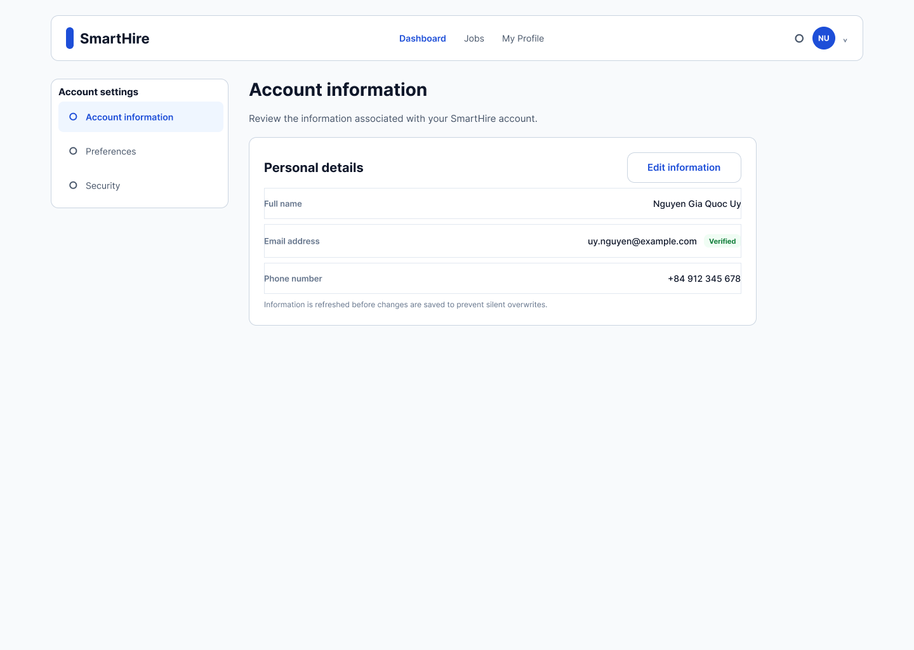

*Figure 8.1 — UC-ACC-01 basic flow; current account information is displayed.*

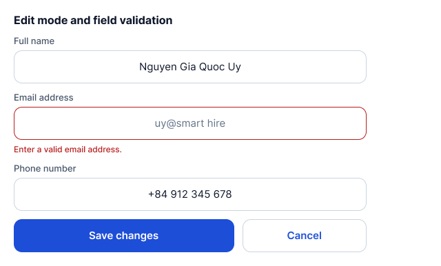

*Figure 8.2 — UC-ACC-01 editing state; permitted account information can be updated.*

---

# 9. UC-ACC-02 — Manage Account Preferences

## 9.1. Use-Case Information
| Field | Value |
|---|---|
| **Use-Case ID** | UC-ACC-02 |
| **Use-Case Name** | Manage Account Preferences |
| **Primary Actor** | Authenticated User |
| **Supporting Actor** | None |
| **Priority** | High |
| **Trigger** | The user opens account preferences. |

## 9.2. Brief Description
This use case allows an Authenticated User to configure supported account, language, privacy, communication, and notification preferences.

## 9.3. Preconditions
- The user has a valid authenticated session.

## 9.4. Basic Flow
1. The Authenticated User opens account preferences.
2. The System displays the current preference values.
3. The Authenticated User changes one or more preferences.
4. The Authenticated User selects **Save changes**.
5. The System validates the selected values.
6. The System saves the preferences.
7. The System applies preferences that take effect immediately.
8. The System displays a success confirmation.

## 9.5. Alternative Flows

### 9.5.1. AF-01 — Unsupported Preference Value
The System identifies the unsupported value and restores the nearest valid option.

### 9.5.2. AF-02 — User Restores Default Preferences
The System displays the default values, requests confirmation, and saves them after confirmation.

### 9.5.3. AF-03 — User Cancels Changes
The System discards unsaved changes and restores the stored values.

### 9.5.4. AF-04 — Concurrent Update Is Detected
The System reloads the latest preference values and asks the user to reapply the changes.

### 9.5.5. AF-05 — Session Has Expired
The System redirects the user to login without saving changes.

### 9.5.6. EF-01 — Preferences Cannot Be Saved
The System retains the previous values and displays a retry message.

## 9.6. Postconditions
- On success, validated preferences are stored.
- On failure or cancellation, previous preferences remain active.

## 9.7. Special Requirements
- Mandatory security notifications cannot be disabled.
- Preference changes must apply consistently across supported devices.
- Privacy-related preferences must comply with applicable policy.

## Prototype Evidence

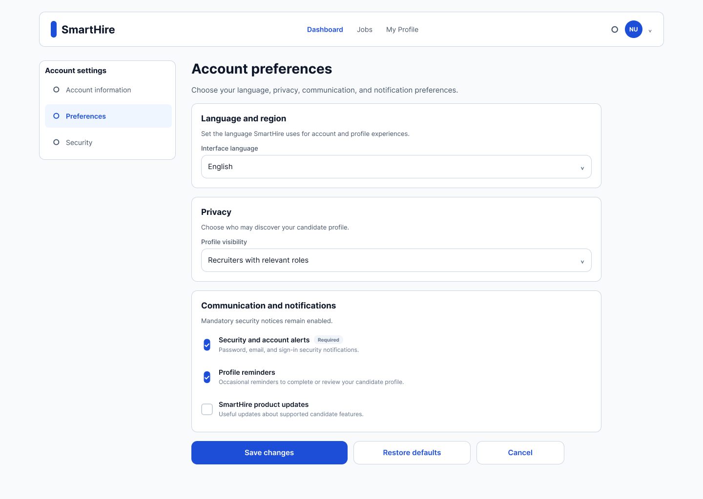

*Figure 9.1 — UC-ACC-02 basic flow; the authenticated user manages account preferences.*

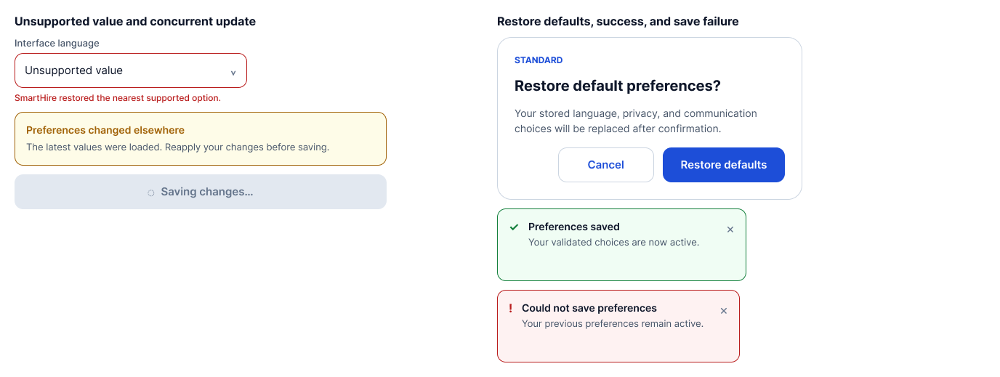

*Figure 9.2 — UC-ACC-02 AF-02; the user can review and confirm restoration of default values.*

---

# 10. UC-PROF-01 — Manage Candidate Profile

## 10.1. Use-Case Information
| Field | Value |
|---|---|
| **Use-Case ID** | UC-PROF-01 |
| **Use-Case Name** | Manage Candidate Profile |
| **Primary Actor** | Candidate |
| **Supporting Actor** | None |
| **Priority** | High |
| **Trigger** | The Candidate opens the candidate profile. |

## 10.2. Brief Description
This use case allows a Candidate to create, view, and update professional profile information used for job applications and candidate screening.

## 10.3. Preconditions
1. The Candidate has a valid authenticated session.
2. The account is permitted to use candidate features.

## 10.4. Basic Flow
1.  Candidate opens **My Profile**.
2. The System displays the current candidate profile and completion status.
3. The Candidate selects **Edit profile**.
4. The System displays editable profile sections.
5. The Candidate updates personal summary, location, skills, work experience, education, or other supported information.
6. The Candidate submits the changes.
7. The System validates the submitted profile information.
8. The System checks for concurrent modifications.
9. The System saves the profile changes.
10. The System recalculates the profile-completion status.
11. The System displays the updated profile and success confirmation.

## 10.5. Alternative Flows

### 10.5.1. AF-01 — Candidate Creates the First Profile
If no profile exists, the System displays an empty profile form and creates the profile after valid submission.

### 10.5.2. AF-02 — Required Information Is Missing
The System highlights the incomplete sections and resumes at Step 5.

### 10.5.3. AF-03 — Experience or Education Dates Are Invalid
The System identifies the invalid date range and resumes at Step 5.

### 10.5.4. AF-04 — Candidate Uploads a CV
At Step 4, the Candidate may invoke **UC-PROF-02 — Upload and Parse CV**.

### 10.5.5. AF-05 — Candidate Cancels Editing
The System discards unsaved changes and displays the stored profile.

### 10.5.6. AF-06 — Concurrent Modification Is Detected
The System displays the latest profile version and asks the Candidate to review the changes again.

### 10.5.7. AF-07 — Session Has Expired
The System redirects the Candidate to login without saving unsaved information.

### 10.5.8. EF-01 — Profile Cannot Be Saved
The System retains the previous profile and displays a retry message.

## 10.6. Postconditions
- On success, the candidate profile contains the validated changes.
- Profile completion is recalculated.
- On cancellation or failure, the previous profile remains unchanged.

## 10.7. Special Requirements
- Only the Candidate and explicitly authorized platform functions may access private profile data.
- Profile fields must enforce documented length and format limits.
- Profile changes relevant to screening should be versioned or audited.

## 10.8. Related Use Cases and Entry Points
- **Upload CV:** At the profile-editing page, the Candidate may start **UC-PROF-02 — Upload and Parse CV**.

## Prototype Evidence

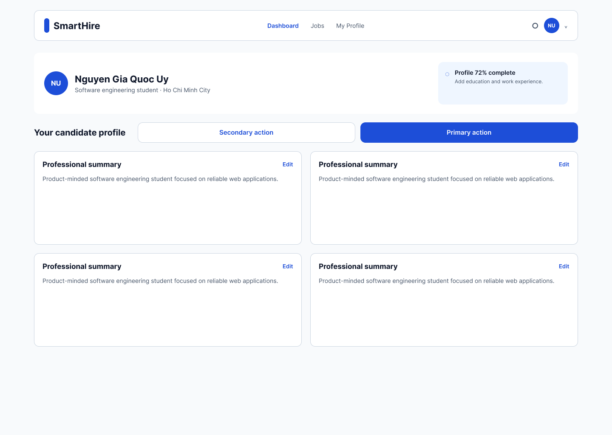

*Figure 10.1 — UC-PROF-01 basic flow; the Candidate views profile information and completion status.*

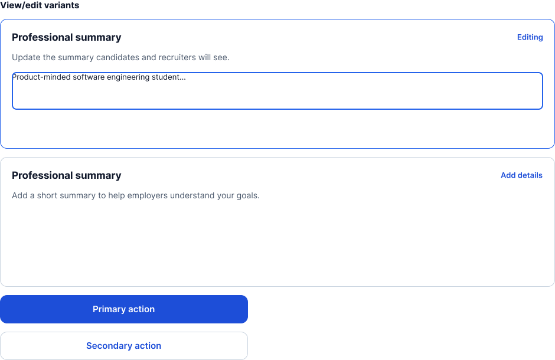

*Figure 10.2 — UC-PROF-01 editing state; profile fields are available for update.*

---

# 11. UC-PROF-02 — Upload and Parse CV

## 11.1. Use-Case Information
| Field | Value |
|---|---|
| **Use-Case ID** | UC-PROF-02 |
| **Use-Case Name** | Upload and Parse CV |
| **Primary Actor** | Candidate |
| **Supporting Actor** | CV Parsing Service |
| **Priority** | High |
| **Trigger** | The Candidate selects **Upload CV** |

## 11.2. Brief Description
This use case allows a Candidate to upload a supported CV document and have structured profile information extracted from it.

## 11.3. Preconditions
1. The Candidate has a valid authenticated session.
2. The Candidate may access candidate-profile functions.
3. The CV Parsing Service is configured.

## 11.4. Basic Flow
1. The Candidate selects Upload CV.
2. The System displays file requirements and the upload control.
3. The Candidate selects a supported CV file.
4. The System validates the file name, type, size, and content signature.
5. The System scans the file for unsafe content.
6. The Candidate confirms the upload.
7. The System stores the file in protected storage.
8. The System sends the file for parsing.
9. The CV Parsing Service extracts supported candidate information.
10. The System receives and stores the parsing result with confidence information.
11. The System invokes **UC-PROF-03 — Review and Confirm Parsed CV**.

## 11.5. Alternative Flows

### 11.5.1. AF-01 — Unsupported File Type
The System rejects the file and displays the supported formats.

### 11.5.2. AF-02 — File Exceeds the Size Limit
The System rejects the file and displays the maximum permitted size.

### 11.5.3. AF-03 — File Is Empty, Corrupted, or Password-Protected
The System rejects the file and asks the Candidate to select another document.

### 11.5.4. AF-04 — Unsafe Content Is Detected
The System rejects and quarantines the file, records the event, and does not send it for parsing.

### 11.5.5. AF-05 — Candidate Cancels the Upload
Before Step 7, the Candidate cancels and no file is stored.

### 11.5.6. AF-06 — Duplicate File Is Selected
The System warns that the same file was previously uploaded and allows the Candidate to replace or cancel it.

### 11.5.7. AF-07 — Parsing Confidence Is Low
The System completes parsing but marks uncertain fields for manual review in UC-PROF-03.

### 11.5.8. EF-01 — CV Parsing Service Is Unavailable
The System records the failed parsing job and displays retry and manual-entry options.

### 11.5.9. EF-02 — Upload or Storage Fails
The System does not report a successful upload and displays a retry message.

## 11.6. Postconditions
- On success, the protected CV and its parsing result are available for review.
- Parsed information is not treated as confirmed profile data until **UC-PROF-03** succeeds.

## 11.7. Special Requirements
- Supported formats and maximum file size must be documented.
- File validation must use content signatures, not only extensions.
- CV files must be encrypted in transit and protected at rest.
- The file must not be publicly addressable.
- Parsing failures must be retryable without producing duplicate confirmed data.

## 11.8. Related Use Cases and Entry Points
- **Review Parsed Information:** After successful parsing, the Candidate may start **UC-PROF-03 — Review and Confirm Parsed CV**. Review is a separate user-controlled goal; parsed data remains unconfirmed until that goal succeeds.

## Prototype Evidence

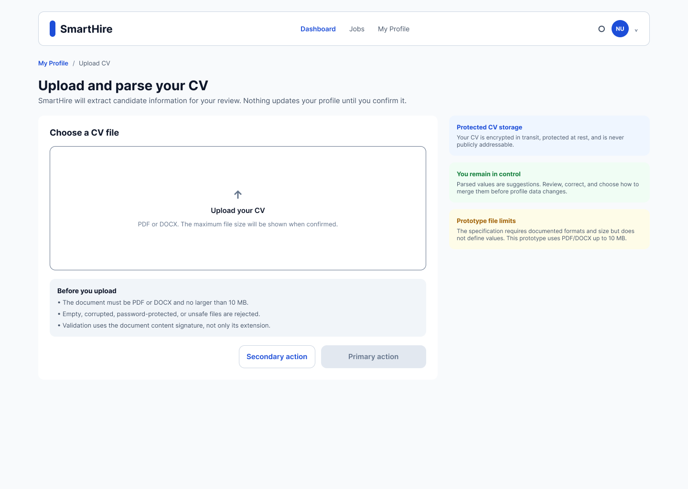

*Figure 11.1 — UC-PROF-02 basic flow; the Candidate selects a supported CV file.*

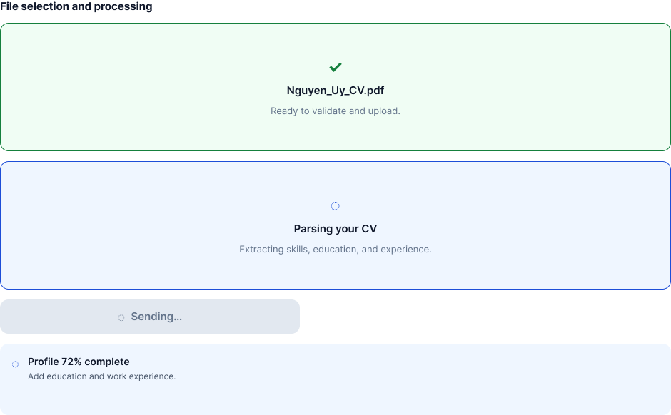

*Figure 11.2 — UC-PROF-02 processing state; the CV Parsing Service is processing the upload.*

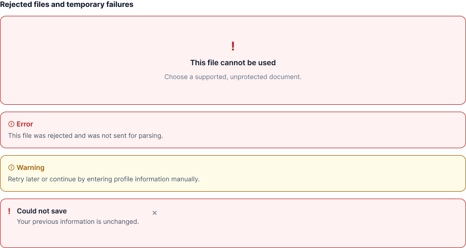

*Figure 11.3 — UC-PROF-02 EF-01; a parsing-service failure is shown without confirming profile data.*

---

# 12. UC-PROF-03 — Review and Confirm Parsed CV

## 12.1. Use-Case Information
| Field | Value |
|---|---|
| **Use-Case ID** | UC-PROF-03 |
| **Use-Case Name** | Review and Confirm Parsed CV |
| **Primary Actor** | Candidate |
| **Supporting Actor** | None |
| **Priority** | High |
| **Trigger** | CV parsing completes successfully. |

## 12.2. Brief Description
This use case allows the Candidate to review, correct, and confirm information extracted from an uploaded CV before it updates the candidate profile.

## 12.3. Preconditions
1. The Candidate has a valid authenticated session.
2. A parsing result exists and belongs to the Candidate.
3. The parsing result has not been confirmed or discarded.

## 12.4. Basic Flow
1. The System displays the parsed CV information.
2. The System identifies fields with low parsing confidence.
3. The Candidate reviews personal information, skills, education, and work experience.
4. The Candidate corrects inaccurate or incomplete values.
5. The Candidate selects how confirmed information should be merged with the existing profile.
6. The Candidate selects **Confirm and update profile**.
7. The System validates the reviewed information.
8. The System checks that the candidate profile has not been modified concurrently.
9. The System saves the confirmed information to the candidate profile.
10. The System marks the parsing result as confirmed.
11. The System recalculates profile completion.
12. The System displays the updated candidate profile.

## 12.5. Alternative Flows
### 12.5.1. AF-01 — Required Parsed Information Is Missing
The System identifies missing required fields and asks the Candidate to complete them.

### 12.5.2. AF-02 — Candidate Removes an Incorrect Parsed Entry
The Candidate removes the entry, and the System excludes it from the confirmed profile update.

### 12.5.3. AF-03 — Candidate Keeps Existing Profile Information
When a conflict exists, the Candidate selects the stored profile value instead of the parsed value.

### 12.5.4. AF-04 — Candidate Replaces Existing Information
When a conflict exists, the Candidate selects the parsed value to replace the stored value.

### 12.5.5. AF-05 — Candidate Discards the Parsing Result
The System requests confirmation, marks the result as discarded, and leaves the candidate profile unchanged.

### 12.5.6. AF-06 — Candidate Returns Later
The System saves the parsing result as an unconfirmed draft and displays it when the Candidate returns.

### 12.5.7. AF-07 — Candidate Profile Changed Concurrently
The System displays the latest profile values and requires the Candidate to resolve conflicts again.

### 12.5.8. EF-01 — Confirmed Information Cannot Be Saved
The System keeps the parsing result unconfirmed, preserves the previous profile, and displays a retry message.

## 12.6. Postconditions
- On success, confirmed parsed information is merged into the candidate profile.
- The parsing result is marked as confirmed.
- On discard, the candidate profile remains unchanged.
- On failure, no partial profile merge is reported as successful.

## 12.7. Special Requirements
- Parsed data must never be treated as verified solely because it was produced by the parsing service.
- Low-confidence fields must be visually distinguishable.
- Confirmation and profile update must be performed atomically.
- Only the owning Candidate may review the parsing result.

## Prototype Evidence

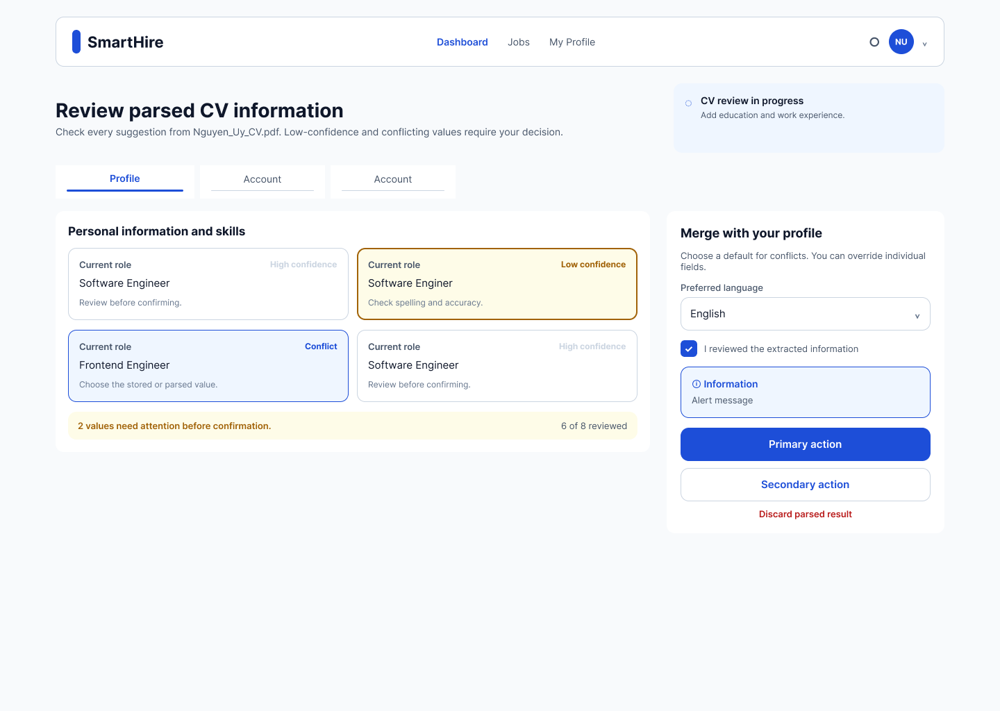

*Figure 12.1 — UC-PROF-03 basic flow; parsed information is reviewed before it becomes confirmed profile data.*

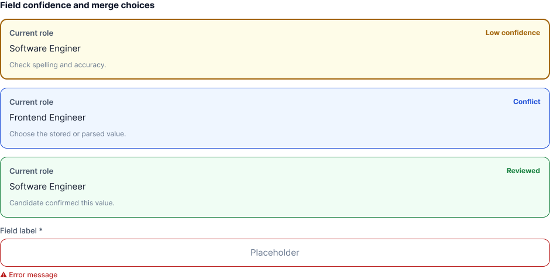

*Figure 12.2 — UC-PROF-03 AF-01; low-confidence fields require Candidate attention.*

*Figure 12.3 — UC-PROF-03 postcondition; confirmed values are saved to the candidate profile.*

---

# 13. UC-AUTH-08 — Enable and Manage Two-Factor Authentication

## 13.1. Use-Case Information
| Field | Value |
|---|---|
| **Use-Case ID** | UC-AUTH-08 |
| **Use-Case Name** | Enable and Manage Two-Factor Authentication |
| **Primary Actor** | Authenticated User |
| **Supporting Actor** | RFC 6238-compatible authenticator application |
| **Priority** | High |
| **Trigger** | The Authenticated User opens **Profile > Security** to enable or manage two-factor authentication. |

## 13.2. Brief Description
This use case allows an Authenticated User to enroll a TOTP authenticator, receive one-time backup codes, regenerate the backup-code set, or disable two-factor authentication. Every high-impact action requires renewed proof and is auditable.

## 13.3. Preconditions
1. The user has an active, verified account and a valid full authenticated session.
2. The user can provide the current password when recent-authentication proof is required.
3. TOTP enrollment and management are available through the authoritative authentication service.

## 13.4. Basic Flow — Enable TOTP
1. The Authenticated User opens **Profile > Security**.
2. The System validates the full session and authoritative account state before rendering the protected page.
3. The System shows that 2FA is disabled and offers **Enable two-factor authentication**.
4. The Authenticated User selects the enable action.
5. The System requests the current password as renewed proof.
6. The Authenticated User submits the current password.
7. The System validates the password and creates a protected pending enrollment with a unique TOTP secret.
8. The System displays a QR code and manual setup key over the protected interaction.
9. The Authenticated User adds the secret to a compatible authenticator application.
10. The Authenticated User submits the current six-digit TOTP code.
11. The System validates the code within the documented time window.
12. The System enables 2FA transactionally and generates a finite one-time backup-code set.
13. The System displays plaintext backup codes once and instructs the user to store them safely.
14. The System rotates or revalidates the affected session when required by the authentication provider.
15. The System records the successful enrollment without storing the password, TOTP code, plaintext secret, or plaintext backup codes in the audit event.
16. The System returns to **Profile > Security** with a clear `2FA enabled` status.

## 13.5. Alternative and Error Flows

### 13.5.1. AF-01 — Two-Factor Authentication Is Already Enabled
At Step 3, if 2FA is already enabled, the System must not start another enrollment or replace the existing TOTP secret. It displays the actions to regenerate backup codes or disable 2FA.

### 13.5.2. AF-02 — Current Password Is Incorrect
At Step 7, the System rejects the renewed proof, records a non-sensitive failure, applies the configured attempt limit, and leaves the 2FA state unchanged.

### 13.5.3. AF-03 — Initial TOTP Code Is Invalid, Malformed, or Outside the Accepted Window
At Step 11, the System displays a generic verification failure, leaves 2FA disabled, does not issue backup codes, and permits another attempt within the configured limit.

### 13.5.4. AF-04 — Regenerate Backup Codes
1. An Authenticated User with 2FA enabled selects **Regenerate backup codes**.
2. The System requires the current password and a valid TOTP code as renewed proof.
3. After successful proof, the System invalidates every previous backup code before activating the replacement set.
4. The System displays the replacement plaintext codes once and audits the regeneration without recording them.

### 13.5.5. AF-05 — Disable Two-Factor Authentication
1. An Authenticated User with 2FA enabled selects **Disable two-factor authentication**.
2. The System requests explicit confirmation, the current password, and a valid TOTP code unless an approved full-recovery procedure authorizes the action.
3. After successful proof, the System invalidates the TOTP secret and every backup code, rotates or revalidates affected sessions, and audits the disablement.

### 13.5.6. AF-06 — User Cancels a Security Change
Before a change is committed, the user may cancel. The System discards the pending action and does not change the authoritative 2FA state.

### 13.5.7. AF-07 — Session Is Missing, Expired, or Revoked
The System does not render or process the security action and redirects safely to Login without exposing factor state.

### 13.5.8. AF-08 — Attempt Limit Is Exceeded
The System temporarily rejects further password or TOTP attempts, displays a retry-later message, and audits the limited event without recording submitted secrets.

### 13.5.9. EF-01 — Enrollment or Management Update Fails
The System reports no success, keeps the prior authoritative 2FA state, and either rolls back the single-provider operation or retains a fail-closed retry state. No partial backup-code set becomes valid.

## 13.6. Postconditions
- On successful enrollment, TOTP is enabled and exactly one current backup-code set is active.
- On successful regeneration, all older backup codes are unusable and the replacement codes are displayed only once.
- On successful disablement, the previous TOTP secret and every backup code are unusable.
- On failure or cancellation, the previously committed 2FA state remains authoritative.
- Every attempted security-state change produces an audit outcome without secret material.

## 13.7. Special Requirements
- TOTP must be RFC 6238-compatible, use six-digit codes and a 30-second time step, and apply only the documented limited clock-skew tolerance.
- TOTP secrets must be unique per account, protected at rest, and never logged or returned after the approved setup interaction.
- Plaintext backup codes must be shown only during their generation response and stored only as secure representations.
- Sensitive actions must require renewed proof and server-side CSRF protection.
- Opening the Security page while 2FA is enabled must never silently start enrollment or replace the stored secret.
- Password, TOTP, backup-code, and session-replacement values must not appear in audit events, URLs, analytics, or client persistence.

## 13.8. Prototype Evidence

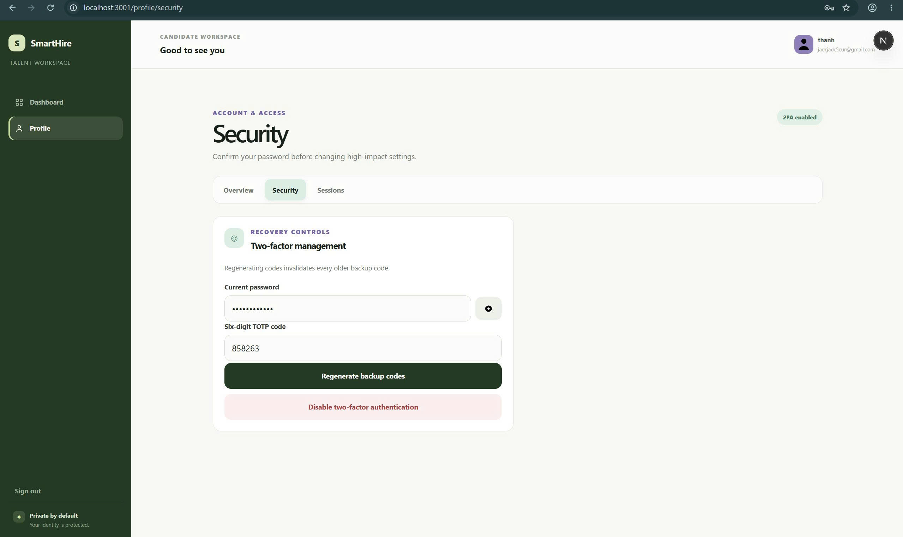

*Figure 13.1 — UC-AUTH-08 basic and alternative states; the security page shows enrollment, proof, backup-code management, and disablement states.*

---

# 14. UC-AUTH-09 — Complete Two-Factor Verification

## 14.1. Use-Case Information
| Field | Value |
|---|---|
| **Use-Case ID** | UC-AUTH-09 |
| **Use-Case Name** | Complete Two-Factor Verification |
| **Primary Actor** | Visitor |
| **Supporting Actor** | RFC 6238-compatible authenticator application |
| **Priority** | High |
| **Trigger** | Correct primary credentials are submitted for an active account with 2FA enabled. |

## 14.2. Brief Description
This use case is the conditional second-factor stage associated with **UC-AUTH-03 — Log In** when 2FA is enabled. The Visitor completes a restricted pre-authentication challenge with a valid TOTP or an unused backup code before the System creates a full authenticated session.

## 14.3. Preconditions
1. Primary email-and-password validation succeeded.
2. The account is active, verified, and has 2FA enabled.
3. A restricted, short-lived, single-account challenge exists and has not expired or been consumed.
4. No full authenticated session has been created from the primary factor alone.

## 14.4. Basic Flow — TOTP
1. The System redirects the Visitor from Login to the two-factor verification page.
2. The System places focus on the authenticator-code control and does not expose account or factor secrets.
3. The Visitor obtains the current six-digit code from a compatible authenticator application.
4. The Visitor enters the code and selects **Verify**.
5. The System validates the restricted challenge and account state.
6. The System validates the TOTP within the accepted time window and prevents replay for the completed challenge.
7. The System consumes the restricted challenge.
8. The System creates the sole full authenticated session and rotates its identifier.
9. The System audits second-factor success without recording the submitted code.
10. The System redirects the Authenticated User to the approved protected destination or `/dashboard`.

## 14.5. Alternative and Error Flows

### 14.5.1. AF-01 — Use an Unused Backup Code
1. At Step 3, the Visitor selects **Backup code**.
2. The Visitor enters one unused backup code.
3. The System validates and atomically consumes the code.
4. The flow resumes at Step 7. The used backup code can never succeed again.

### 14.5.2. AF-02 — TOTP Is Invalid, Malformed, or Outside the Accepted Window
The System displays a generic failure, creates no full session, keeps only an otherwise valid restricted challenge, and records the failed event without the submitted code.

### 14.5.3. AF-03 — Backup Code Is Invalid or Already Used
The System displays the same generic factor failure, creates no full session, and does not reveal whether the submitted value was previously valid.

### 14.5.4. AF-04 — Challenge Is Missing, Expired, Consumed, or for Another Account
The System rejects the attempt, creates no session, clears unusable provisional state, and directs the Visitor to restart Login.

### 14.5.5. AF-05 — Attempt Limit Is Exceeded
The System rejects further attempts for the configured cooldown, creates no session, and displays a retry-later response.

### 14.5.6. AF-06 — Account State Changes During the Challenge
If the account becomes Pending Verification, Suspended, Deleted, or subject to pending full recovery, the System invalidates the challenge and denies full authentication.

### 14.5.7. AF-07 — Visitor Lost Every Authentication Factor
The Visitor may navigate to **UC-AUTH-11 — Recover Account After Loss of All Factors**. The System does not automatically disable 2FA or accept email OTP as a replacement second factor.

### 14.5.8. EF-01 — Authentication Service Is Unavailable
The System creates no full session, reports a temporary failure, and preserves no client-visible secret or reusable authorization result.

## 14.6. Postconditions
- On success, the restricted challenge is consumed and exactly one full authenticated session is established.
- A successfully used backup code is permanently consumed.
- On failure, protected resources remain inaccessible and no full session exists.
- Successful and failed factor outcomes are auditable without submitted codes.

## 14.7. Special Requirements
- Primary password success must never authorize a protected resource while 2FA is required.
- The challenge must be short-lived, single-account, single-use, and incapable of acting as a browser session.
- Factor failures must be generic and rate-limited.
- A backup code must have one atomic winner under concurrent use.
- The page must support keyboard focus, password-manager-safe field purposes, and approved internal navigation only.

## 14.8. Prototype Evidence

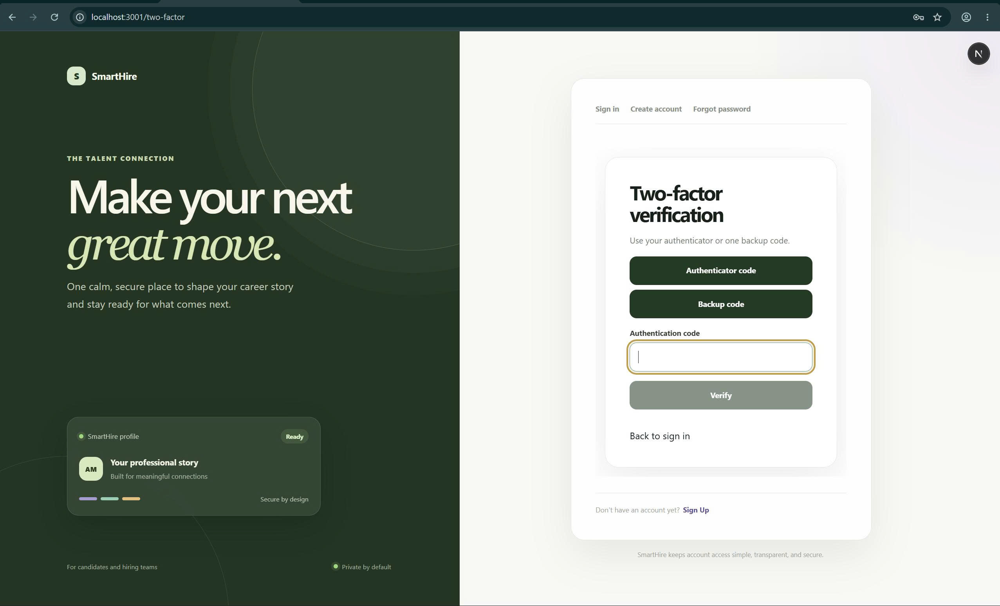

*Figure 14.1 — UC-AUTH-09 basic and alternative states; authenticator and backup-code verification are shown before the Dashboard redirect.*

---

# 15. UC-AUTH-10 — Review and Revoke Active Sessions

## 15.1. Use-Case Information
| Field | Value |
|---|---|
| **Use-Case ID** | UC-AUTH-10 |
| **Use-Case Name** | Review and Revoke Active Sessions |
| **Primary Actor** | Authenticated User |
| **Supporting Actor** | None |
| **Priority** | High |
| **Trigger** | The Authenticated User opens **Profile > Sessions**. |

## 15.2. Brief Description
This use case allows an Authenticated User to review sanitized metadata for owned active sessions, identify the current session, and revoke another owned session without ending the current one.

## 15.3. Preconditions
1. The user has a valid full authenticated session.
2. The account is active.
3. Session ownership and revocation are enforced by the authoritative server-side session store.

## 15.4. Basic Flow — Revoke Another Session
1. The Authenticated User opens **Profile > Sessions**.
2. The System validates the current session and account state before rendering the page.
3. The System lists only active sessions owned by the account.
4. For each session, the System displays non-secret device/browser information, creation or last-active time, approximate location when lawfully available, and a clear current-session marker.
5. The Authenticated User identifies an unrecognized session other than the current session.
6. The Authenticated User selects **Revoke** for that session.
7. The System asks for confirmation without exposing the raw session identifier.
8. The Authenticated User confirms the action.
9. The System verifies ownership again and atomically revokes the selected session.
10. The System records the actor, target reference, result, time, and non-sensitive context.
11. The System refreshes the list, keeps the current session active, and displays a success message.
12. The revoked session is rejected on its next request.

## 15.5. Alternative and Error Flows

### 15.5.1. AF-01 — Only the Current Session Exists
The System displays the current session and explains that there are no other devices to revoke. Current-session termination remains available through **UC-AUTH-04 — Log Out and End Session**.

### 15.5.2. AF-02 — User Attempts to Revoke the Current Session
The System directs the user to the authoritative Logout action or requires explicit confirmation that the current browser will be signed out. It does not present the action as revocation of another device.

### 15.5.3. AF-03 — Target Session Already Expired or Was Revoked Concurrently
The System treats the result idempotently, refreshes the list, and reports that the session is no longer active.

### 15.5.4. AF-04 — Session Limit Is Reached During New Login
When creating a sixth session, the System automatically revokes the least recently active older session, excludes the newly created session, and audits the automatic revocation. The refreshed list contains at most five active sessions.

### 15.5.5. AF-05 — Current Session Is Missing, Expired, or Revoked
The System does not display owned-session data and redirects safely to Login.

### 15.5.6. AF-06 — User Cancels Revocation
The System closes the confirmation interaction and leaves all sessions unchanged.

### 15.5.7. EF-01 — Revocation Fails
The System does not claim success, keeps the target session visible until authoritative state confirms revocation, and records or queues the failure where possible.

## 15.6. Postconditions
- On successful selected revocation, the target session can no longer access protected resources.
- Revoking another session does not end the current session.
- No session belonging to another account is disclosed or modified.
- On cancellation or failure, no unconfirmed revocation is reported as successful.

## 15.7. Special Requirements
- Raw session tokens, raw database identifiers, full IP addresses, cookies, and authentication credentials must never be displayed.
- Idle timeout, absolute timeout, ownership, account state, and revocation must be enforced server-side.
- The account may have at most five active sessions; the sixth login revokes the least recently active older session.
- Revocation and rejected reuse must be auditable using non-sensitive references.
- The Sessions page must clearly distinguish the current session and remain keyboard accessible.

## 15.8. Prototype Evidence

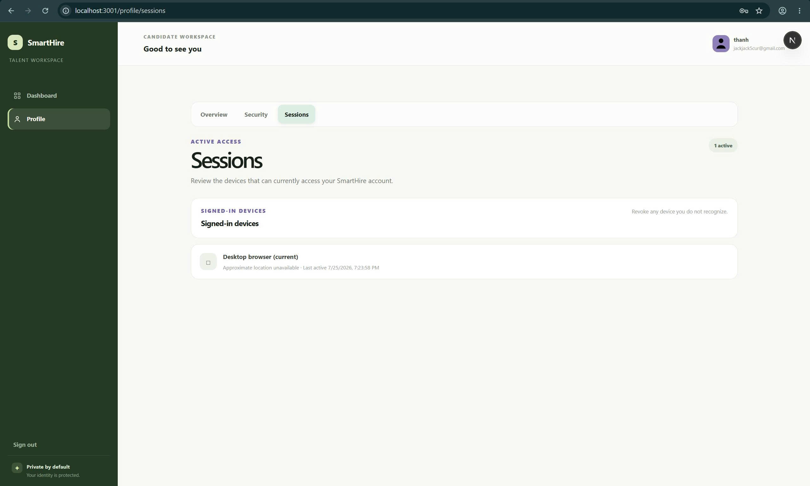

*Figure 15.1 — UC-AUTH-10 basic and alternative states; the current session, other sessions, and revocation flow are represented.*

---

# 16. UC-AUTH-11 — Recover Account After Loss of All Factors

## 16.1. Use-Case Information
| Field | Value |
|---|---|
| **Use-Case ID** | UC-AUTH-11 |
| **Use-Case Name** | Recover Account After Loss of All Factors |
| **Primary Actor** | Visitor |
| **Supporting Actor** | Email Delivery Service |
| **Priority** | High |
| **Trigger** | The Visitor states that the password, TOTP access, and every backup code are unavailable. |

## 16.2. Brief Description
This is a separate, lower-assurance account-recovery workflow for an eligible user who has lost every authentication factor. Verified email starts a 24-hour security hold. Existing sessions and challenges are revoked, login remains blocked while recovery is pending, and completion changes the password and disables old 2FA only after the hold. The workflow never creates an automatic session.

## 16.3. Preconditions
1. The Visitor is not required to have a valid authenticated session.
2. The Visitor can access the verified email address associated with the account.
3. The account is active, verified, 2FA-enabled, and eligible for full recovery.
4. The account is not already Deleted or otherwise ineligible under the approved recovery policy.

## 16.4. Basic Flow
1. The Visitor opens the full account-recovery page.
2. The System explains that the workflow is intended only for loss of the password, TOTP access, and every backup code, and that email-only recovery has lower assurance.
3. The Visitor enters the registered email address and submits the request.
4. The System validates the email format and evaluates account eligibility.
5. The System creates HMAC-digested, single-use confirmation and cancellation proof records without storing plaintext proofs.
6. The Email Delivery Service sends the verified-email confirmation and security notice.
7. The System displays instructions to check the email account.
8. The Visitor opens the single-use confirmation link.
9. The System validates and consumes the confirmation proof.
10. The System starts exactly one 24-hour security hold and marks full recovery as pending.
11. The System revokes existing sessions and authentication challenges and blocks password and second-factor login while recovery is pending.
12. The System sends hold-start and cancellation instructions and records durable audit and notification outcomes.
13. After the hold ends, the Visitor opens the single-use completion link.
14. The System validates the completion proof, hold status, account state, and recovery ownership.
15. The Visitor enters and confirms a new password satisfying policy.
16. The System claims the recovery completion exactly once and securely updates the password.
17. The System invalidates the old TOTP secret and every old backup code only at this completion step.
18. The System confirms that sessions and challenges remain revoked, consumes remaining recovery proofs, and finalizes the operation.
19. The System queues a completion notification and records the final audit result without secrets.
20. The System displays recovery success and directs the Visitor to normal Login. It does not create a full session or provisional challenge automatically.

## 16.5. Alternative and Error Flows

### 16.5.1. AF-01 — Email Format Is Invalid
At Step 4, the System displays a format-validation message and does not create recovery proofs.

### 16.5.2. AF-02 — Account Is Unknown or Ineligible
The System returns the documented account-not-found or ineligible outcome, queues no recovery email, and records only the non-sensitive request result allowed by policy.

### 16.5.3. AF-03 — Confirmation Proof Is Invalid, Expired, or Already Used
At Step 9, the System rejects the link, starts no new hold, changes no factor, and offers a safe route to restart the request when permitted.

### 16.5.4. AF-04 — Confirmation Is Submitted Concurrently
Exactly one request starts the hold. Every concurrent or replayed confirmation receives a non-success outcome and creates no duplicate hold, notification, or audit completion.

### 16.5.5. AF-05 — Login Attempt During the Security Hold
The System returns the approved blocked outcome and creates neither a full session nor a provisional challenge.

### 16.5.6. AF-06 — Visitor Cancels Pending Recovery
1. Before completion, the Visitor opens the single-use cancellation link.
2. The System validates and atomically consumes the cancellation proof.
3. The System marks recovery cancelled, invalidates remaining recovery proofs, queues a notification, and audits the result.
4. A reused or concurrent cancellation proof fails without changing state again.

### 16.5.7. AF-07 — Completion Is Attempted Before the Hold Ends
The System rejects the attempt, preserves the pending hold and credentials, and displays the remaining wait policy without exposing secret proof data.

### 16.5.8. AF-08 — Completion Proof Is Invalid, Expired, Used, or Superseded
The System rejects completion, does not change the password or 2FA state, and does not create a session.

### 16.5.9. AF-09 — New Password Violates Policy or Confirmation Does Not Match
The System displays the applicable validation message and allows correction while the valid completion operation remains safely controlled.

### 16.5.10. AF-10 — Recovery Was Cancelled or Already Completed
The System reports the terminal status, performs no repeated credential or factor change, and directs the Visitor to the appropriate safe next action.

### 16.5.11. EF-01 — Email Delivery Fails Before an Eligible Request Is Issued
The System does not claim that instructions were delivered, retains only policy-approved retry state, and records the provider failure without credentials or plaintext proofs.

### 16.5.12. EF-02 — Mandatory Recovery Step Fails
The System does not report success. It retains a durable fail-closed operation that can resume idempotently, keeps login blocked when cleanup is incomplete, and finalizes only after password update, factor disablement, session/challenge revocation, notification enqueue, and final audit completion are confirmed.

## 16.6. Postconditions
- On confirmed request, one 24-hour hold exists, prior sessions and challenges are revoked, and login is blocked.
- On cancellation, recovery proofs are invalidated and credentials remain unchanged.
- On successful completion, the password is replaced and old TOTP and backup codes are disabled exactly once.
- No recovery path creates an authenticated session automatically.
- On incomplete mandatory cleanup, access remains fail closed until the durable operation converges.

## 16.7. Special Requirements
- Full account recovery must remain separate from ordinary forgotten-password reset.
- Every confirmation, cancellation, and completion proof must be HMAC-digested, time-limited, single-use, and absent from logs and persistent plaintext storage.
- The 24-hour hold must be server-enforced and must not depend on browser time.
- Support personnel must not bypass the hold or disable TOTP without the approved workflow.
- Audit records and notifications must be durable and idempotent and must exclude passwords, TOTP values, backup codes, cookies, raw session identifiers, and plaintext proofs.
- The interface must clearly state that verified-email-only recovery is lower assurance.

## 16.8. Prototype Evidence

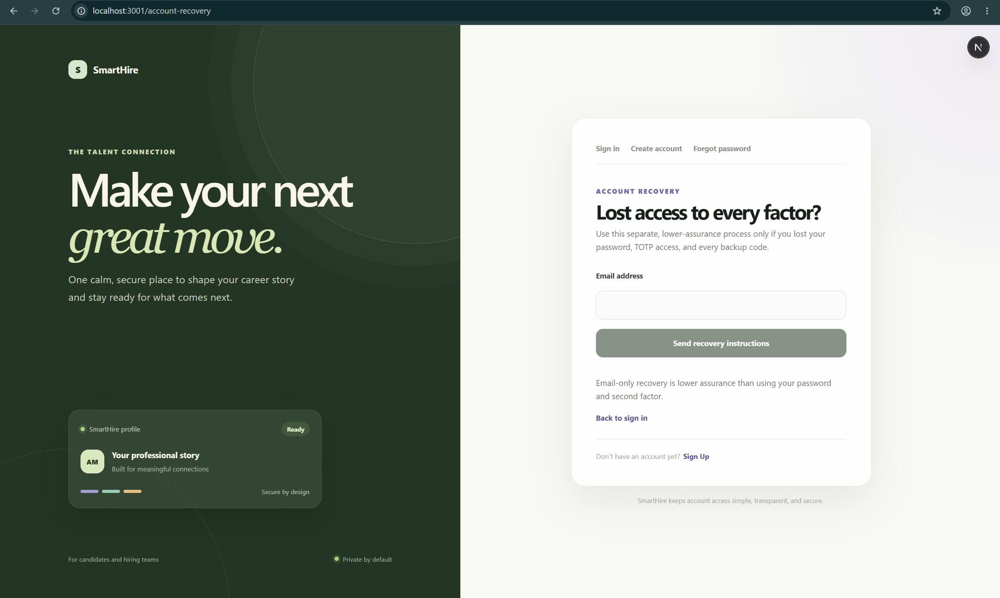

*Figure 16.1 — UC-AUTH-11 basic and alternative states; request, security hold, cancellation, completion, and fail-closed recovery outcomes are represented.*
