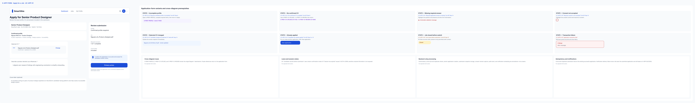
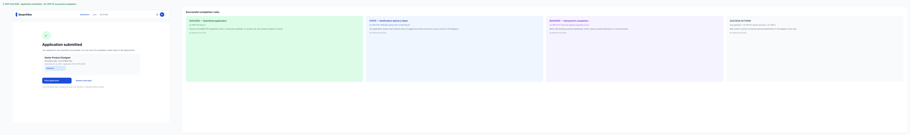
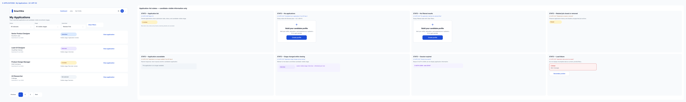
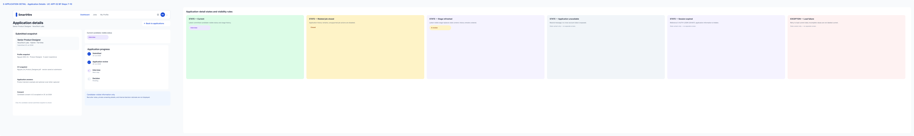
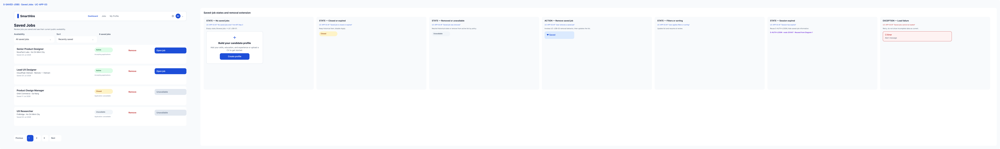
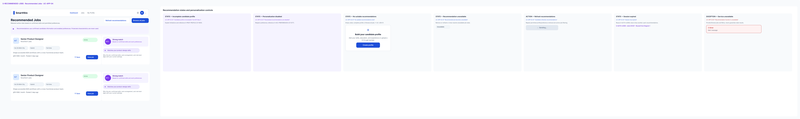
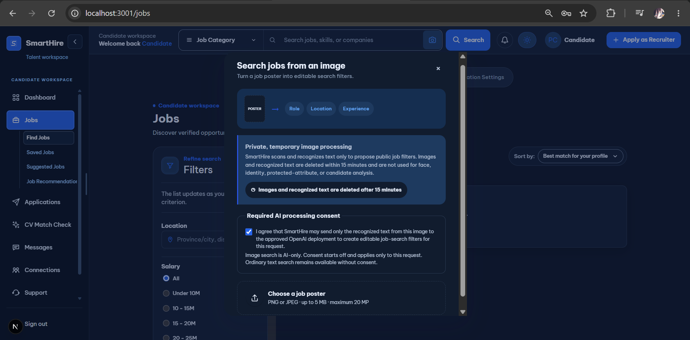
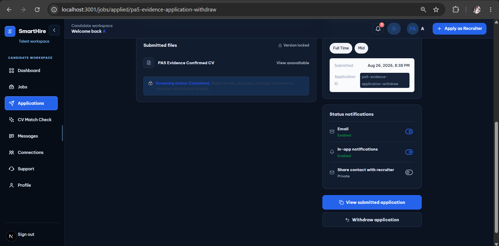
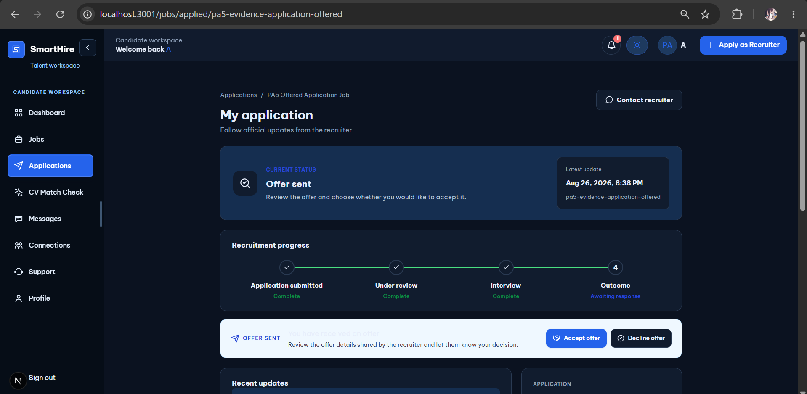
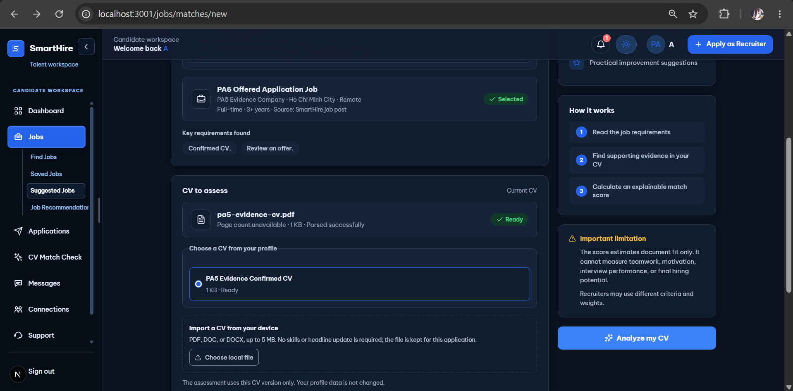

# DGM-02 — Specification of Candidate Job Journey

## Use-Case Specifications

*Performed by: Nguyễn Gia Quốc Uy and Lưu Chí Hải | Reviewed by: Nguyễn Gia Quốc Uy | Edited by: Lưu Chí Hải*

**Version:** V1.2 (2026-08-26) — synchronized with Features 003, 005, and 020

**Verification note:** Feature 005 is **In progress** because PA5 live cases IMG-02–IMG-06 remain failed under open `BUG-IMG-02`. Feature 003 is **Implemented and verified**. Feature 020 is **Implemented; verification pending**: PA5 APP cases passed, but the final inventory still requires consolidated feature verification beyond the existence of source/tests.

# 1. UC-JOB-01 — Browse, Search, and Filter Jobs

## 1.1. Use-Case Information
| Field | Value |
|---|---|
| **Use-Case ID** | UC-JOB-01 |
| **Use-Case Name** | Browse, Search, and Filter Jobs |
| **Primary Actor** | Visitor/Authenticated User |
| **Supporting Actor** | None |
| **Priority** | High |
| **Trigger** | The actor opens the job-discovery page. |

## 1.2. Brief Description
This use case allows a Visitor or Authenticated User to discover active job postings by browsing the default listing, entering search terms, applying filters, selecting sorting options, and navigating through result pages.

## 1.3. Preconditions
1. The public job-discovery function is available.
2. At least zero active job postings may exist.
3. Authentication is not required for public job discovery.

## 1.4. Basic Flow
1. The Actor opens the job-discovery page.
2. The System displays the search field, available filters, sorting options, and a default list of active job postings.
3. The Actor enters one or more search terms.
4. The Actor selects applicable filters, such as location, job type, experience level, working arrangement, salary range, or posting date.
5. The Actor selects a sorting option.
6. The Actor submits the search criteria.
7. The System validates and normalizes the search criteria.
8. The System searches only publicly visible and active job postings.
9. The System applies the selected filters and sorting option.
10. The System displays the matching job postings and total result information.
11. The Actor reviews the displayed results.
12. The Actor may select a job and start **UC-JOB-02 — View Job Details**.

## 1.5. Alternative Flows

### 1.5.1. AF-01 — No Search Term Is Entered
At Step 3, if the Actor leaves the search field empty:
1. The System treats the request as a browse operation.
2. The System applies any selected filters.
3. The use case resumes at Step 8.

### 1.5.2. AF-02 — Search or Filter Value Is Invalid
At Step 7, if a value is invalid:
1. The System identifies the invalid value.
2. The System preserves the remaining valid criteria.
3. The use case resumes at Step 3 or Step 4.

### 1.5.3. AF-03 — No Job Matches the Criteria
At Step 10, if no active posting matches:
1. The System displays an empty-result state.
2. The System suggests removing or changing filters.
3. The Actor may modify the criteria.
4. The use case resumes at Step 3.

### 1.5.4. AF-04 — Actor Clears Search Criteria
1.  The Actor selects Clear all.
2. The System removes the search term and selected filters.
3. The System displays the default active-job listing.
4. The use case resumes at Step 2.

### 1.5.5. AF-05 — Actor Requests Another Result Page
1. The Actor selects another page or requests more results.
2. The System preserves the current search, filter, and sorting criteria.
3. The System retrieves the requested result set.
4. The System displays the additional results.
5. The use case resumes at Step 11.

### 1.5.6. AF-06 — Previously Displayed Job Becomes Unavailable
If a job changes status while the results are displayed:
1. The System removes the job from new active results or labels it unavailable.
2. The System does not allow a new application to the unavailable posting.
3. The remaining search results stay available.

### 1.5.7. EF-01 — Search Service or Database Is Unavailable
At Step 8:
1. The System does not display incomplete results as complete.
2. The System displays a temporary-error state with a retry action.
3. The System records the failure.
4. The use case ends or resumes at Step 6 after retry.

## 1.6. Postconditions
### Success Postconditions
- Matching active job postings are displayed.
- Search criteria remain available during the current discovery session.

### Failure Postconditions
- No private or inactive job information is disclosed.
- No account or job data is modified.

## 1.7. Special Requirements
- Search criteria must be safely validated and encoded.
- Results should be returned within two seconds under normal supported load.
- Search results must support pagination or controlled incremental loading.
- Filters and sorting must be keyboard accessible.
- Public results must not include internal moderation or recruiter-only fields.

## Prototype Evidence

*Figure 1.1 — UC-JOB-01 basic flow; public job discovery, search, and filtering are represented.*

## 1.8. Related Use Cases and Entry Points
- **Job Selected:** At Step 12, selecting a job starts **UC-JOB-02 — View Job Details**. This is a separate navigation goal.

---

# 2. UC-JOB-02 — View Job Details

## 2.1. Use-Case Information
| Field | Value |
|---|---|
| **Use-Case ID** | UC-JOB-02 |
| **Use-Case Name** | View Job Details |
| **Primary Actor** | Visitor/Authenticated User |
| **Supporting Actor** | None |
| **Priority** | High |
| **Trigger** | The Actor selects a job posting from a job list or opens a public job link. |

## 2.2. Brief Description
This use case allows the Actor to view the complete public information of a selected job posting and the actions currently available for that posting.

## 2.3. Preconditions
1. A job-posting identifier or public link has been supplied.
2. The posting exists or previously existed.
3. Authentication is not required for public job details.

## 2.4. Basic Flow
1. The Actor selects a job posting or opens its public link.
2. The System receives the job-posting identifier.
3. The System retrieves the posting and its public company information.
4. The System verifies that the posting is publicly visible.
5. The System determines the current posting status.
6. The System displays the job title, company, location, working arrangement, employment type, salary information when available, description, responsibilities, requirements, benefits, and application deadline.
7. The System displays the actions available to the Actor based on authentication, role, posting status, and previous interactions.
8. The Actor reviews the job information.

## 2.5. Alternative Flows

### 2.5.1. AF-01 — Job Is Closed or Expired
At Step 5:
1. The System displays the available public job information.
2. The System labels the posting as closed or expired.
3. The System disables the application action.
4. Saving, removing, or sharing remains available when permitted.

### 2.5.2. AF-02 — Job Was Removed or Is Not Public
At Step 4:
1. The System displays a neutral unavailable-job page.
2. The System does not disclose moderation or removal details.
3. The use case ends.

### 2.5.3. AF-03 — Actor Has Already Applied
At Step 7, if the Candidate previously applied:
1. The System replaces the application action with View application.
2. The Candidate may continue through **UC-APP-02 — Track Job Applications**.

### 2.5.4. AF-04 — Job Is Already Saved
At Step 7, the System displays **Remove from saved jobs** instead of **Save job**.

### 2.5.5. AF-05 — Visitor Selects a Protected Action
If a Visitor selects Save, Report, or Apply:
1. The System displays the login page.
2. The System preserves the selected job as the return destination.
3. After successful login, the System returns the user to the job-detail page.
4. The requested action may continue if authorization requirements are satisfied.

### 2.5.6. AF-06 — Company Public Information Is Limited
The System displays only the company information approved for public visibility and omits unavailable private fields.

### 2.5.7. EF-01 — Job Details Cannot Be Loaded
1. The System displays a temporary-error state.
2. The System provides Retry and Back to jobs actions.
3. The System records the failure.
4. The use case ends or resumes at Step 1 after retry.

## 2.6. Postconditions
- The selected job’s permitted public information is displayed.
- No job, account, saved-job, report, or application record is modified.

## 2.7. Special Requirements
- Public details must not expose private company or recruiter data.
- Removed and unauthorized postings must use a neutral unavailable response.
- The job-detail page should load within two seconds under normal supported load.
- The canonical public URL must be stable and safe to share.
- The page must clearly distinguish active, closed, expired, and unavailable states.

## Prototype Evidence

*Figure 2.1 — UC-JOB-02 basic flow; public job details and available actions are displayed.*

## 2.8. Related Use Cases and Entry Points
- **Save or Remove Job**: The Actor may invoke **UC-JOB-03**.
- **Share Job**: The Actor may invoke **UC-JOB-04**.
- **Report Job Posting**: An Authenticated User may invoke **UC-JOB-05**.
- **Apply for Job**: An eligible Candidate may invoke **UC-APP-01**.

---

# 3. UC-JOB-03 — Save or Remove Job

## 3.1. Use-Case Information
| Field | Value |
|---|---|
| **Use-Case ID** | UC-JOB-03 |
| **Use-Case Name** | Save or Remove Job |
| **Primary Actor** | Authenticated User |
| **Supporting Actor** | None |
| **Priority** | Medium |
| **Trigger** | The Authenticated User selects the save control for a job. |

## 3.2. Brief Description
This use case allows an Authenticated User to save a job for later review or remove a previously saved job from the saved-job collection.

## 3.3 Preconditions
1. The user has a valid authenticated session.
2. A valid job-posting identifier has been provided.
3. The user is authorized to manage the account’s saved jobs.

## 3.4 Basic Flow
1. The Authenticated User views a job card or job-detail page.
2. The System displays the job as not currently saved.
3. The Authenticated User selects Save job.
4. The System validates the authenticated session.
5. The System verifies that the job exists and may be saved.
6. The System checks whether a saved-job relationship already exists.
7. The System creates the saved-job relationship.
8. The System updates the save control to Saved or Remove from saved jobs.
9. The System displays a brief success confirmation.

## 3.5. Alternative Flows

### 3.5.1. AF-01 — Remove a Saved Job
At Step 2, if the job is already saved:
1. The System displays Remove from saved jobs.
2. The Authenticated User selects the remove action.
3. The System requests confirmation when required.
4. The Authenticated User confirms removal.
5. The System removes the saved-job relationship.
6. The System updates the control to Save job.
7. The System displays a removal confirmation.

### 3.5.2. AF-02 — Job Is Already Saved
At Step 6, if the saved-job relationship already exists:
1. The System does not create a duplicate record.
2. The System displays the job as saved.
3. The use case ends successfully.

### 3.5.3. AF-03 — Job Has Already Been Removed from Saved Jobs
During AF-01, if the relationship no longer exists:
1. The System treats the removal as successfully completed.
2. The System displays the job as not saved.

### 3.5.4. AF-04 — Session Has Expired
At Step 4:
- The System does not change the saved-job collection.
- The System redirects the user to login.
- The System preserves the selected job as the return destination.

### 3.5.5. AF-05 — Job Becomes Unavailable
At Step 5:
- The System may allow the unavailable job to remain in the saved collection for historical reference.
- The System labels the job unavailable.
- The System prevents actions that are no longer permitted.

### 3.5.6. AF-06 — User Cancels Removal
During AF-01, if the user cancels confirmation, the saved-job relationship remains unchanged.

### 3.5.7. AF-07 — Concurrent Save or Remove Request
The System performs the requested operation idempotently and displays the final stored state.

### 3.5.8. EF-01 — Saved-Job Update Fails
1. The System retains the previous save state.
2. The System displays an error and retry action.
3. The System records the failure.
4. The use case ends.

## 3.6. Postconditions
- **Save Success**: One saved-job relationship exists between the account and job.
- **Remove Success**: No saved-job relationship exists between the account and job.
- **Failure**: The previous saved-job state remains unchanged.

## 3.7. Special Requirements
- The account-job pair must be unique.
- Save and removal operations must be idempotent.
- Authorization must be checked server-side.
- The UI must not display success before the stored state is confirmed.
- Concurrent requests must not create duplicate saved-job records.

## Prototype Evidence

*Figure 3.1 — UC-JOB-03 basic and alternative states; the authenticated user can save or remove a job.*

## 3.8. Related Use Cases and Entry Points
- **Remove Saved Job**: The remove path may be initiated from the job-detail page or saved-job list.

---

# 4. UC-JOB-04 — Share Job

## 4.1. Use-Case Information
| Field | Value |
|---|---|
| **Use-Case ID** | UC-JOB-04 |
| **Use-Case Name** | Share Job |
| **Primary Actor** | Visitor/Authenticated User |
| **Supporting Actor** | External Sharing Application |
| **Priority** | Medium |
| **Trigger** | The Actor selects **Share job**. |

## 4.2. Brief Description
This use case allows an Actor to copy or distribute a public job-posting link through a supported external sharing destination.

## 4.3. Preconditions
1. A public job-posting link is available.
2. The Actor may view the posting.
3. Authentication is not required.

## 4.4. Basic Flow
1. The Actor views an active public job posting.
2. The Actor selects Share job.
3. The System creates or retrieves the canonical public job URL.
4. The System displays the supported sharing actions.
5. The Actor selects an External Sharing Application.
6. The System passes the job title and canonical URL to the selected application.
7. The External Sharing Application displays its sharing interface.
8. The Actor completes the share operation.
9. Control returns to the SmartHire job-detail page.

## 4.5. Alternative Flows

### 4.5.1. AF-01 — Actor Copies the Job Link
At Step 5:
1. The Actor selects Copy link.
2. The System copies the canonical URL.
3. The System displays a copy-success confirmation.
4. The use case ends.

### 4.5.2. AF-02 — Native Sharing Is Unsupported
1. The System does not display unsupported sharing destinations.
2. The System provides the Copy link action.
3. The use case continues through AF-01.

### 4.5.3. AF-03 — Actor Cancels Sharing
At Step 7, the Actor closes the external sharing interface. No SmartHire data is modified.

### 4.5.4. AF-04 — Job Becomes Unavailable
At Step 3:
1. The System displays a neutral unavailable-job message.
2. The System does not generate a new public sharing action.
3. The use case ends.

### 4.5.5. EF-01 — Clipboard or External Application Fails
1. The System displays a share-failure message.
2. The System preserves the job-detail page.
3. The Actor may retry or manually copy the visible link.

## 4.6. Postconditions
- On success, a public job URL has been copied or passed to an external application.
- No saved-job, application, or report record is modified.

## 4.7. Special Requirements
- Shared URLs must not contain session credentials or private tracking data.
- The URL must reference only publicly visible job information.
- Sharing must not imply that the external application is endorsed by SmartHire.
- The Actor must remain in control of the final external sharing action.

## Prototype Evidence

*Figure 4.1 — UC-JOB-04 basic flow; the actor chooses an external sharing destination or copies the public link.*

---

# 5. UC-JOB-05 — Report Job Posting

## 5.1. Use-Case Information
| Field | Value |
|---|---|
| **Use-Case ID** | UC-JOB-05 |
| **Use-Case Name** | Report Job Posting |
| **Primary Actor** | Authenticated User |
| **Supporting Actor** | None |
| **Priority** | Medium |
| **Trigger** | The Authenticated User selects **Report job**. |

## 5.2. Brief Description
This use case allows an Authenticated User to report a job posting that appears fraudulent, misleading, duplicated, inappropriate, discriminatory, or otherwise in violation of platform policy.

## 5.3. Preconditions
1. The user has a valid authenticated session.
2. A job-posting identifier is available.
3. The user is permitted to submit reports.

## 5.4. Basic Flow
1. The Authenticated User views a job posting.
2. The Authenticated User selects Report job.
3. The System displays the report form and supported report reasons.
4. The Authenticated User selects a report reason.
5. The Authenticated User enters additional details when required.
6. The Authenticated User reviews the report.
7. The Authenticated User submits the report.
8. The System validates the report.
9. The System verifies that the user has not submitted an unresolved duplicate report for the same job and reason.
10. The System creates a report with the PENDING_REVIEW status.
11. The System records the submission event.
12. The System displays a neutral report-submission confirmation.

## 5.5. Alternative Flows

### 5.5.1. AF-01 — Required Report Reason Is Missing
At Step 8:
1. The System highlights the report-reason field.
2. The System preserves the entered details.
3. The use case resumes at Step 4.

### 5.5.2. AF-02 — Additional Details Are Required
1. If the selected reason requires an explanation:
2. The System requires additional details.
3. The use case resumes at Step 5.

### 5.5.3. AF-03 — Duplicate Report Exists
At Step 9:
1. The System does not create another unresolved duplicate report.
2. The System displays a neutral message indicating that the concern has already been received.
3. The use case ends.

### 5.5.4. AF-04 — User Cancels the Report
Before Step 10:
1. The System requests confirmation when the form contains information.
2. The user confirms cancellation.
3. The System discards the unsaved report.
4. The use case ends.

### 5.5.5. AF-05 — Session Has Expired
1. The System does not create the report.
2. The System redirects the user to login.
3. The System may retain the job as the return destination.

### 5.5.6. AF-06 — Reporting Rate Limit Is Exceeded
1. The System rejects the report temporarily.
2. The System displays a retry-later message.
3. The System records the abuse-control event.
4. The use case ends.

### 5.5.7. AF-07 — Job Has Already Been Removed
1. The System displays that the job is no longer publicly available.
2. The System may retain the supplied report information for moderation context when permitted.
3. The System does not expose the internal removal reason.

### 5.5.8. EF-01 — Report Cannot Be Saved
1. The System does not display a successful-submission message.
2. The System preserves the entered report data when safe.
3. The System displays a retry action.
4. The use case ends.

## 5.6. Postconditions

### 5.6.1. Success Postconditions
- One report exists with the PENDING_REVIEW status.
- The report is available to authorized moderators.
- The reporter’s identity is not disclosed publicly.

### 5.6.2. Failure Postconditions
- No incomplete report is recorded as successfully submitted.

### 5.7. Special Requirements
- The reporter’s identity and report contents must be restricted to authorized personnel.
- Report submission must not automatically remove a posting without an applicable enforcement rule.
- Report text must be validated and safely rendered.
- Abuse-control limits must be applied.
- Reporting actions must be audited.

## Prototype Evidence

*Figure 5.1 — UC-JOB-05 basic flow; the authenticated user selects a report reason and submits the report.*

---

# 6. UC-APP-01 — Apply for a Job

## 6.1. Use-Case Information
| Field | Value |
|---|---|
| **Use-Case ID** | UC-APP-01 |
| **Use-Case Name** | Apply for a Job |
| **Primary Actor** | Candidate |
| **Supporting Actor** | None |
| **Priority** | High |
| **Trigger** | The Candidate selects **Apply now** on an active job posting. |

## 6.2. Brief Description
This use case allows an authenticated Candidate to submit an application to an active job posting using confirmed candidate-profile information, a selected CV, and job-specific application answers.

## 6.3. Preconditions
1. The Candidate has a valid authenticated session.
2. The account is active and permitted to use candidate functions.
3. The job posting exists and accepts applications.
4. The Candidate has not already submitted an application that prevents reapplication.
5. Required candidate information and consent can be supplied.

## 6.4. Basic Flow
1. The Candidate views an active job posting.
2. The Candidate selects Apply now.
3. The System validates the Candidate’s session and authorization.
4. The System verifies that the job remains active and accepts applications.
5. The System verifies that the Candidate may apply.
6. The System loads the Candidate’s confirmed profile information and available CVs.
7. The System displays the application form, required job questions, selected profile information, CV selection, and optional cover-letter field.
8. The Candidate selects a CV.
9. The Candidate answers the required application questions.
10. The Candidate enters optional supported information.
11. The Candidate reviews the application information.
12. The Candidate accepts the required application consent.
13. The Candidate selects Submit application.
14. The System validates the complete application.
15. The System rechecks the job status and duplicate-application rule.
16. The System creates the application with the SUBMITTED status.
17. The System stores a submission snapshot of relevant candidate, CV, answer, and job information.
18. The System records the application-submission event.
19. The System schedules applicable notifications.
20. The System displays an application-submission confirmation.

## 6.5. Alternative Flows

### 6.5.1. AF-01 — Required Candidate Profile Is Incomplete
At Step 6:
1. The System identifies the missing profile information.
2. The System displays the missing items.
3. The Candidate may open UC-PROF-01 — Manage Candidate Profile.
4. After completing the profile, the Candidate may return to Step 2.

### 6.5.2. AF-02 — No Confirmed CV Is Available
At Step 6:
1. The System informs the Candidate that a CV is required.
2. The Candidate may invoke UC-PROF-02 — Upload and Parse CV.
3. The Candidate must complete UC-PROF-03 — Review and Confirm Parsed CV.
4. The Candidate may return to Step 6.

### 6.5.3. AF-03 — Required Application Answer Is Missing
At Step 14:
1. The System highlights the missing answer.
2. The System preserves other application information.
3. The use case resumes at Step 9.

### 6.5.4. AF-04 — Required Consent Is Not Accepted
At Step 14:
1. The System highlights the required consent.
2. The use case resumes at Step 12.

### 6.5.5. AF-05 — Candidate Has Already Applied
At Step 5 or Step 15:
1. The System does not create another application.
2. The System displays View application.
3. The Candidate may invoke UC-APP-02 — Track Job Applications.
4. The use case ends.

### 6.5.6. AF-06 — Job Closes Before Submission
At Step 15:
1. The System does not create the application.
2. The System labels the job as no longer accepting applications.
3. The System preserves no false success state.
4. The use case ends.

### 6.5.7. AF-07 — Candidate Cancels Before Submission
Before Step 16:
1. The System asks whether the Candidate wants to leave when entered information would be lost.
2. The Candidate confirms cancellation.
3. The System does not create an application.
4. The use case ends.

### 6.5.8. AF-08 — Candidate Changes the Selected CV
Before Step 13, the Candidate selects another confirmed CV, and the System updates the application preview.

### 6.5.9. AF-09 — Concurrent Duplicate Submission Occurs
At Step 16:
1. The System accepts only one application.
2. The System returns the existing successful application.
3. The System does not create a duplicate application.

### 6.5.10. AF-10 — Session Has Expired
1. The System does not submit the application.
2. The System redirects the Candidate to login.
3. Sensitive unsaved information is not exposed to another session.

### 6.5.11. EF-01 — Application Transaction Fails
1. The System rolls back partial application records.
2. The System does not display submission success.
3. The System displays a retry message.
4. The use case ends.

### 6.5.12. EF-02 — Notification Delivery Fails
At Step 19:
1. The submitted application remains valid.
2. The System records the failed notification delivery.
3. The notification may be retried through the notification service.
4. The System still displays the application-submission confirmation.

## 6.6. Postconditions

### 6.6.1. Success Postconditions
- Exactly one submitted application exists.
- An immutable or versioned submission snapshot exists.
- The application is visible in the Candidate’s application history.
- Applicable notification work has been created.

### 6.6.2. Failure Postconditions
- No partial application is reported as submitted.
- The Candidate may retry when the business rules still permit submission.

## 6.7. Special Requirements
- Application creation must be transactional and idempotent.
- Candidate and CV information must be protected from unauthorized access.
- Stored snapshots must preserve the information used at submission time.
- The System must recheck job availability immediately before committing.
- Notification failure must not roll back a successfully submitted application.
- The System must record the consent version accepted by the Candidate.

## Prototype Evidence

*Figure 6.1 — UC-APP-01 basic flow; the Candidate completes the application form.*

*Figure 6.2 — UC-APP-01 postcondition; successful submission is confirmed.*

---

# 7. UC-APP-02 — Track Job Applications

## 7.1. Use-Case Information
| Field | Value |
|---|---|
| **Use-Case ID** | UC-APP-02 |
| **Use-Case Name** | Track Job Applications |
| **Primary Actor** | Candidate |
| **Supporting Actor** | None |
| **Priority** | High |
| **Trigger** | The Candidate opens **My Applications**. |

## 7.2. Brief Description
This use case allows a Candidate to view submitted job applications, filter them by permitted status, and inspect the current recruitment stage and visible stage history.

## 7.3. Preconditions
1. The Candidate has a valid authenticated session.
2. The Candidate is authorized to access only the account’s applications.

## 7.4. Basic Flow
1. The Candidate opens My Applications.
2. The System validates the Candidate’s session.
3. The System retrieves applications owned by the Candidate.
4. The System displays each application’s job title, company, submission date, current status, and current visible recruitment stage.
5. The Candidate selects filters or sorting options when desired.
6. The System updates the displayed application list.
7. The Candidate selects an application.
8. The System verifies ownership of the selected application.
9. The System displays the application details, submitted information summary, current status, and Candidate-visible stage history.
10. The Candidate reviews the application information.

## 7.5. Alternative Flows

### 7.5.1. AF-01 — Candidate Has No Applications
At Step 3:
1. The System displays an empty-application state.
2. The System provides a Browse jobs action.
3. The use case ends or continues through UC-JOB-01.

### 7.5.2. AF-02 — No Application Matches the Selected Filter
The System displays an empty filtered result and provides a Clear filters action.

### 7.5.3. AF-03 — Related Job Is Closed or Removed
1. The System preserves the application history.
2. The System labels the related job as closed or unavailable.
3. The System prevents unsupported job actions.

### 7.5.4. AF-04 — Application Is No Longer Available
At Step 8:
1. The System displays a neutral unavailable-application message.
2. The System does not expose another Candidate’s application.
3. The use case ends.

### 7.5.5. AF-05 — Application Stage Changes During Viewing
1. The System displays the latest committed Candidate-visible stage.
2. The System refreshes the permitted stage history.
3. The Candidate may continue reviewing.

### 7.5.6. AF-06 — Session Has Expired
The System redirects the Candidate to login and does not display application information.

### 7.5.7. EF-01 — Application Data Cannot Be Loaded
1. The System displays a retry state.
2. The System does not display incomplete data as current.
3. The System records the failure.
4. The use case ends or resumes at Step 1 after retry.

## 7.6. Postconditions
- Candidate-owned application information has been displayed.
- No application status or stage is modified by this use case.

## 7.7. Special Requirements
- Ownership authorization must be checked server-side.
- Candidate-visible status must not expose private recruiter notes or internal screening information.
- Stage-history events must be ordered consistently.
- Removed job postings must not remove legitimate application-history records.
- Application lists should support pagination when required.

## Prototype Evidence

*Figure 7.1 — UC-APP-02 basic flow; the Candidate views submitted applications and their statuses.*

*Figure 7.2 — UC-APP-02 detail state; candidate-visible application information is shown without recruiter-only notes.*

---

# 8. UC-APP-03 — View Saved Jobs

## 8.1. Use-Case Information
| Field | Value |
|---|---|
| **Use-Case ID** | UC-APP-03 |
| **Use-Case Name** | View Saved Jobs |
| **Primary Actor** | Authenticated User |
| **Supporting Actor** | None |
| **Priority** | Medium |
| **Trigger** | The Authenticated User opens **Saved Jobs**. |

## 8.2. Brief Description
This use case allows an Authenticated User to view saved jobs, identify postings that are no longer available, open job details, and remove jobs from the saved collection.

## 8.3. Preconditions
1. The user has a valid authenticated session.
2. The user is authorized to access the account’s saved-job collection.

## 8.4. Basic Flow
1. The Authenticated User opens Saved Jobs.
2. The System validates the authenticated session.
3. The System retrieves saved-job relationships belonging to the account.
4. The System retrieves the permitted current status of each related job.
5. The System displays the saved-job list with job title, company, location, saved date, and availability status.
6. The Authenticated User reviews the saved jobs.
7. The Authenticated User selects an available saved job.
8. The Actor may start UC-JOB-02 — View Job Details.

## 8.5. Alternative Flows

### 8.5.1. AF-01 — No Saved Jobs Exist
At Step 3:
1. The System displays an empty-saved-jobs state.
2. The System provides a Browse jobs action.
3. The use case ends or continues through UC-JOB-01.

### 8.5.2. AF-02 — Saved Job Is Closed or Expired
The System displays the saved job with a closed or expired label and disables the application action.

### 8.5.3. AF-03 — Saved Job Was Removed
The System displays a neutral unavailable state when historical display is permitted or removes it from the active saved list according to policy.

### 8.5.4. AF-04 — User Removes a Saved Job
1. The Authenticated User selects Remove.
2. The User may start UC-JOB-03 — Save or Remove Job.
3. The System updates the saved-job list.

### 8.5.5. AF-05 — User Applies Filters or Sorting
1. The user selects supported availability filters or sorting.
2. The System updates the displayed saved-job list.
3. The use case resumes at Step 6.

### 8.5.6. AF-06 — Session Has Expired
The System redirects the user to login and does not display saved-job information.

### 8.5.7. EF-01 — Saved Jobs Cannot Be Loaded
1. The System displays a retry state.
2. The System records the failure.
3. The use case ends or resumes at Step 1 after retry.

## 8.6. Postconditions
- The user’s saved-job list has been displayed.
- If a removal was completed, the selected saved-job relationship no longer exists.
- Other saved jobs remain unchanged.

## 8.7. Special Requirements
- The user may access only the account’s saved jobs.
- Unavailable jobs must be clearly distinguished from active jobs.
- Job removal must be idempotent.
- Saved-job lists must not expose private job-posting data.

## Prototype Evidence

*Figure 8.1 — UC-APP-03 basic flow; the authenticated user views the saved-job collection.*

## 8.8. Related Use Cases and Entry Points
- **Saved Job Selected:** Selecting a saved job starts UC-JOB-02.
- **Remove Saved Job:** Removing a saved job starts UC-JOB-03.

---

# 9. UC-APP-04 — View Recommended Jobs

## 9.1. Use-Case Information
| Field | Value |
|---|---|
| **Use-Case ID** | UC-APP-04 |
| **Use-Case Name** | View Recommended Jobs |
| **Primary Actor** | Candidate |
| **Supporting Actor** | None |
| **Priority** | Medium |
| **Trigger** | The Candidate opens the recommended-jobs section. |

## 9.2. Brief Description
This use case allows a Candidate to view active job postings recommended using confirmed candidate-profile information, preferences, and other data permitted by platform policy.

## 9.3. Preconditions
1. The Candidate has a valid authenticated session.
2. The account is active.
3. Personalized recommendations are permitted by the Candidate’s current preferences.
4. The recommendation function can access permitted confirmed profile data.

## 9.4. Basic Flow
1. The Candidate opens Recommended Jobs.
2. The System validates the Candidate’s session.
3. The System retrieves permitted confirmed profile and preference information.
4. The System retrieves or generates relevant job recommendations.
5. The System removes jobs that are inactive, unavailable, or not publicly visible.
6. The System orders the remaining recommendations.
7. The System displays recommended jobs and supported relevance explanations.
8. The Candidate reviews the recommendations.
9. The Candidate selects a recommended job.
10. The Candidate may start UC-JOB-02 — View Job Details.

## 9.5. Alternative Flows

### 9.5.1. AF-01 — Candidate Profile Is Incomplete
At Step 3:
1. The System displays that recommendations may be limited.
2. The System identifies useful missing profile sections.
3. The Candidate may invoke UC-PROF-01 — Manage Candidate Profile.
4. Any available recommendations may still be displayed.

### 9.5.2. AF-02 — Personalized Recommendations Are Disabled
1. The System does not use disabled personalization data.
2. The System displays information about the disabled preference.
3. The Candidate may open UC-ACC-02 — Manage Account Preferences.
4. The use case ends or displays non-personalized jobs if supported.

### 9.5.3. AF-03 — No Suitable Recommendations Exist
1. The System displays an empty-recommendation state.
2. The System suggests completing the profile or browsing all jobs.
3. The Candidate may invoke UC-JOB-01.

### 9.5.4. AF-04 — Recommended Job Becomes Unavailable
1. The System removes the job from refreshed recommendations.
2. If the Candidate already selected it, the System displays the neutral unavailable-job state.

### 9.5.5. AF-05 — Candidate Refreshes Recommendations
1. The Candidate selects Refresh recommendations.
2. The System repeats Steps 3–7.
3. The Candidate reviews the refreshed list.

### 9.5.6. AF-06 — Session Has Expired
The System redirects the Candidate to login and does not display personalized recommendations.

### 9.5.7. EF-01 — Recommendation Function Is Unavailable
1. The System displays a temporary-unavailability state.
2. The System provides Browse jobs and Retry actions.
3. The System does not display stale recommendations as guaranteed current results.
4. The use case ends or resumes at Step 1 after retry.

## 9.6. Postconditions
- Active and permitted job recommendations have been displayed.
- No candidate-profile, job, saved-job, or application data is modified.

## 9.7. Special Requirements
- Recommendation generation must not use prohibited or protected personal characteristics.
- Only permitted, confirmed profile information may be used.
- The Candidate must be able to understand the general reason for a recommendation.
- Recommendations must exclude unavailable postings before display.
- Personalization preferences must be respected.
- Recommendation data must not be exposed to another user.

## Prototype Evidence

*Figure 9.1 — UC-APP-04 basic flow; the Candidate views personalized job recommendations.*

## 9.8. Related Use Cases and Entry Points
- **Recommendation Selected:** Selecting a recommendation starts UC-JOB-02 — View Job Details.

# 10. UC-JOB-06 — Search Jobs from an Image

## 10.1. Use-Case Information

| Field | Value |
|---|---|
| **Use-Case ID** | UC-JOB-06 |
| **Primary Actor** | Visitor or Authenticated User |
| **Supporting Actor** | Malware scanner; OCR worker; optional AI intent provider |
| **Feature / Status** | F005 / In progress |
| **Trigger** | The actor selects image-assisted search and supplies a supported image. |

## 10.2. Brief Description

The actor asks SmartHire to derive bounded job-search criteria from an image. The server validates, scans, stores privately, decodes, and performs OCR before applying deterministic or consent-gated AI interpretation. The image is never treated as biometric identity evidence.

## 10.3. Preconditions

1. The image-search admission check permits a new request.
2. The file satisfies the configured size and media-type constraints.
3. External interpretation is used only after the recorded consent/purpose gate succeeds.

## 10.4. Basic Flow

1. The actor opens the image-search control on the job-discovery page.
2. The System reserves a private query and returns upload instructions.
3. The actor uploads the image content.
4. The System verifies request ownership, type, structure, size, malware status, and decodability.
5. The worker extracts OCR evidence and derives a bounded search intent.
6. The System displays proposed criteria rather than silently applying them.
7. The actor confirms or edits the criteria.
8. The System consumes the one-time result and runs UC-JOB-01 with the confirmed criteria.

## 10.5. Alternative and Error Flows

- **AF-01 — AI unavailable or not consented:** The System uses deterministic interpretation from approved OCR evidence when possible; it does not upload the image to the AI provider.
- **AF-02 — Actor cancels:** The System cancels the query and schedules private artifacts for cleanup.
- **EF-01 — Unsafe or invalid file:** The System rejects the content before interpretation and exposes only a safe error.
- **EF-02 — OCR unavailable:** The System shows a recoverable failure/cancel state and does not claim that search criteria were extracted. This is the unresolved PA5 path recorded by `BUG-IMG-02`.
- **EF-03 — Query expired or already consumed:** The System rejects reuse and requires a new query.
- **EF-04 — Unauthorized query:** The System returns a neutral authorization/not-found response without exposing another user's image or result.

## 10.6. Postconditions

- **Success:** Confirmed, bounded criteria are passed to job search and the private query result is consumed.
- **Failure:** No unsupported criteria are applied; retained artifacts follow cleanup policy.

## 10.7. Special Requirements and Evidence

- Uploaded images and OCR evidence remain private and purpose-scoped.
- The UI must provide keyboard-accessible upload, progress, cancellation, failure, and retry states.
- Evidence: `web/src/frontend/features/jobs/image-search/`, `web/src/app/api/jobs/image-searches/`, `web/src/backend/image-search/`, `web/src/backend/services/image-search/`, image-search schema records, and image-search tests under `web/tests/`.

### Prototype/UI Screenshot Evidence

### Real UI Evidence

*Figure — Real SmartHire image-search dialog showing the job-poster upload control and required AI-processing consent before a search request. It does not prove an OCR result or retry outcome.*

## 10.8. Related Use Cases and Entry Points

Successful confirmation starts UC-JOB-01. Image search does not include or bypass application submission.

# 11. UC-APP-05 — Withdraw an Application

## 11.1. Use-Case Information

| Field | Value |
|---|---|
| **Use-Case ID** | UC-APP-05 |
| **Primary Actor** | Candidate |
| **Feature / Status** | F020 / Implemented; verification pending |
| **Trigger** | The Candidate selects **Withdraw application** from an owned application. |

## 11.2. Brief Description

The Candidate withdraws an eligible application. Withdrawal is recorded as a candidate outcome and public update; it does not rewrite the canonical nine-stage recruitment history.

## 11.3. Preconditions

1. The Candidate is authenticated and owns the application.
2. The application is in a state where withdrawal is permitted.

## 11.4. Basic Flow

1. The Candidate opens application detail from UC-APP-02.
2. The System verifies ownership and presents the withdrawal action.
3. The Candidate confirms withdrawal.
4. The System applies the command idempotently and records the withdrawal outcome/update.
5. The System shows the updated read-only application state.

## 11.5. Alternative and Error Flows

- **AF-01 — Repeated command:** The System returns the authoritative already-withdrawn result without duplicating history.
- **EF-01 — Ineligible state:** The System rejects the command and explains that the application can no longer be withdrawn.
- **EF-02 — Ownership/session failure:** The System returns a neutral error and exposes no application data.
- **EF-03 — Persistence conflict:** No false success is shown; the Candidate refreshes the authoritative state.

## 11.6. Postconditions

- **Success:** The application records `CANDIDATE_WITHDRAWN` and cannot continue as an active candidate workflow.
- **Failure:** Application state is unchanged.

## 11.7. Special Requirements and Evidence

The action requires CSRF protection, ownership validation, idempotency, and auditable state. Evidence: `web/src/backend/candidate-applications/application-withdrawal-service.ts`, the candidate application route/UI, schema withdrawal outcome, workflow contract tests, and PA5 APP results.

### Prototype/UI Screenshot Evidence

### Real UI Evidence

*Figure — Real owned application detail showing the **Withdraw application** action for the disposable PA5 candidate application. The screenshot records the available action, not a completed withdrawal.*

# 12. UC-APP-06 — Respond to an Offer

## 12.1. Use-Case Information

| Field | Value |
|---|---|
| **Use-Case ID** | UC-APP-06 |
| **Primary Actor** | Candidate |
| **Feature / Status** | F020 / Implemented; verification pending |
| **Trigger** | The Candidate accepts or declines an offer on an owned application. |

## 12.2. Brief Description

The Candidate records an offer response only when the application is in the offered state. Accepting and declining are explicit human decisions; no AI service responds on the Candidate's behalf.

## 12.3. Preconditions

1. The Candidate owns the application and has a valid session.
2. The current authoritative recruitment stage is `OFFERED`.

## 12.4. Basic Flow

1. The Candidate opens the offer action from application detail.
2. The System verifies ownership, current stage, and command validity.
3. The Candidate chooses and confirms a response.
4. The System records the response transactionally and creates the corresponding public/history state.
5. The System shows the resulting application state.

## 12.5. Alternative and Error Flows

- **AF-01 — Decline:** The System records the candidate response and transitions to `OFFER_DECLINED` according to the domain policy.
- **AF-02 — Repeated identical response:** The System returns the authoritative result without duplicating the transition.
- **EF-01 — Application no longer offered:** The System rejects the stale command and asks the Candidate to refresh.
- **EF-02 — Unauthorized application:** The System exposes no details and makes no change.
- **EF-03 — Conflicting response:** The System rejects the second incompatible response.

## 12.6. Postconditions

The accepted or declined response is recorded once with an auditable stage/update event, or the application remains unchanged after failure.

## 12.7. Special Requirements and Evidence

The command must be ownership-scoped, CSRF-protected, idempotent, and concurrency-safe. Evidence: `web/src/backend/candidate-applications/candidate-offer-response-service.ts`, `/api/candidate/applications/[applicationId]/offer-response`, application UI/schema, workflow contracts, and PA5 APP results.

### Prototype/UI Screenshot Evidence

### Real UI Evidence

*Figure — Real offered application detail showing the **Accept offer** and **Decline offer** controls while the outcome awaits the Candidate's response.*

# 13. UC-APP-07 — Run a Private CV Match

## 13.1. Use-Case Information

| Field | Value |
|---|---|
| **Use-Case ID** | UC-APP-07 |
| **Primary Actor** | Candidate |
| **Supporting Actor** | Private-match worker; optional AI provider |
| **Feature / Status** | F020 / Implemented; verification pending |
| **Trigger** | The Candidate selects a private CV and job for a pre-application match check. |

## 13.2. Brief Description

The Candidate privately compares an owned reusable CV with an active job before applying. Deterministic scoring remains available when the optional AI assessment is unavailable; the result is private and does not create an application.

## 13.3. Preconditions

1. The Candidate owns a confirmed reusable CV.
2. The selected job is visible and eligible for matching.
3. The Candidate is authenticated and within request limits.

## 13.4. Basic Flow

1. The Candidate opens the private-match workspace or a job entry point.
2. The System lists only the Candidate's eligible CVs and permitted jobs.
3. The Candidate selects a CV/job pair and starts the check.
4. The System validates ownership, snapshots permitted inputs, and queues the work.
5. The worker computes deterministic evidence and, when allowed, an advisory AI assessment.
6. The Candidate polls and views the private result, explanation, and provider status.
7. The Candidate may continue to UC-APP-01 but must still submit an application explicitly.

## 13.5. Alternative and Error Flows

- **AF-01 — AI unavailable:** The result displays deterministic evidence and the AI-unavailable state without failing the whole match.
- **AF-02 — Retry AI:** The Candidate requests the implemented AI retry for a failed eligible assessment.
- **EF-01 — CV/job unavailable:** The System rejects the request without leaking private artifacts.
- **EF-02 — Cross-account access:** The System returns a neutral error and records no result for the requester.
- **EF-03 — Worker failure:** The System shows a safe retryable or terminal status; it does not fabricate a score.

## 13.6. Postconditions

- **Success:** A private result is available only to its owning Candidate and retained according to policy.
- **Failure:** No application is created and no private CV content is exposed.

## 13.7. Special Requirements and Evidence

CV text and match output are candidate-private; optional AI use remains advisory and purpose-gated. Evidence: `web/src/app/(workspace)/cv-match-check/`, `web/src/app/api/candidate/private-cv-matches/`, `web/src/backend/private-cv-match/`, Prisma private-match records, and private-match security/unit/frontend tests.

### Prototype/UI Screenshot Evidence

### Real UI Evidence

*Figure — Real private CV-match workspace showing the selected active job, confirmed reusable CV, privacy limitation, and **Analyze my CV** control. It does not claim that a match result has completed.*

## 14. Revision History

| Version | Date | Editor | Exact change | Review |
|---|---|---|---|---|
| V1.1 | 2026-07-24 | Nguyễn Gia Quốc Uy | Initial Candidate Job Journey specifications. | Group 9 |
| V1.2 | 2026-08-26 | Lưu Chí Hải | Added complete specifications for image-assisted search, withdrawal, offer response, and private CV match; recorded repository evidence and the unresolved F005 failure. | Pending Nguyễn Minh Khôi |
| V1.3 | 2026-08-26 | Lưu Chí Hải | Audited prototype coverage for the PA5 use cases and recorded that matching UI screenshot evidence remains pending for UC-JOB-06 and UC-APP-05–07. | Pending Nguyễn Minh Khôi |
