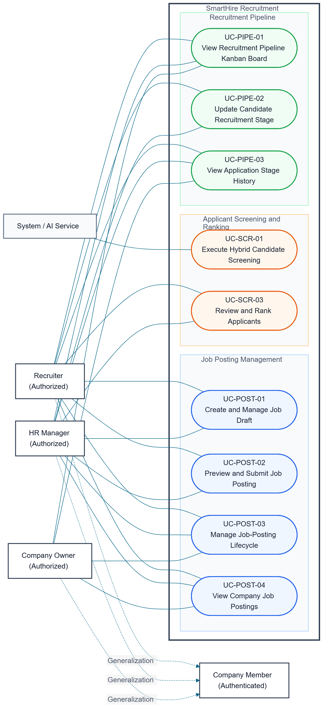

# DGM-03 — Use-Case Specification: Recruiter Operations

*Performed by: Ngô Quốc Tuấn | Reviewed by: Nguyễn Gia Quốc Uy | Edited by: Group 9*
**Version:** V1.3 (06/08/2026) — UML relationships, flow wording, and prototype placement revised

## 1. Scope and Diagram

The Mermaid source is maintained in [diagram_03.md](../diagrams/diagram_03.md). Recruiter, HR Manager, and Company Owner generalize Company Member. The posting, screening, and pipeline use cases are separate goals; navigation between them is recorded as Related Use Cases and Entry Points.

## 2. Actor and Traceability Summary

| Actor | Type | Responsibility |
|---|---|---|
| Company Member | Parent human actor | Authenticated company-scoped account. |
| Recruiter | Specialized human actor | Creates postings, reviews applicants, and updates recruitment stages. |
| HR Manager | Specialized human actor | Performs recruiter operations with the permitted HR scope. |
| Company Owner | Specialized human actor | Manages company-level posting visibility and views pipeline information. |
| System / AI Service | Supporting system actor | Executes asynchronous candidate screening. |

| Use Case ID | Use Case Name | Primary Actor(s) | Prototype Evidence |
|---|---|---|---|
| UC-POST-01 | Create and Manage Job Draft | Recruiter, HR Manager | Draft form and validation state |
| UC-POST-02 | Preview and Submit Job Posting | Recruiter, HR Manager | Preview and duplicate-title warning |
| UC-POST-03 | Manage Job-Posting Lifecycle | Recruiter, HR Manager, Company Owner | Actions menu and status-filter states |
| UC-POST-04 | View Company Job Postings | Recruiter, HR Manager, Company Owner | Company posting list |
| UC-SCR-01 | Execute Hybrid Candidate Screening | System / AI Service | Processing and failed-scoring states |
| UC-SCR-03 | Review and Rank Applicants | Recruiter, HR Manager | Ranked candidates and decision states |
| UC-PIPE-01 | View Recruitment Pipeline Kanban Board | Recruiter, HR Manager, Company Owner | Editable and owner read-only boards |
| UC-PIPE-02 | Update Candidate Recruitment Stage | Recruiter, HR Manager | Drag state and success state |
| UC-PIPE-03 | View Application Stage History | Recruiter, HR Manager, Company Owner | Stage-history timeline |

## 3. Use-Case Specifications

### 3.1. UC-POST-01 — Create and Manage Job Draft

#### Use-Case Information

| Field | Value |
|---|---|
| Use-Case ID | UC-POST-01 |
| Primary Actor | Recruiter or HR Manager |
| Supporting Actor | None |
| Trigger | The actor selects **Create job posting** or opens an existing draft. |

#### Brief Description

The actor creates, edits, or deletes a job-posting draft before submitting it for review.

#### Preconditions

1. The actor has an active authenticated session.
2. The actor has Recruiter or HR Manager permissions for the company.

#### Basic Flow

1. The actor opens the job-posting workspace.
2. The System displays a new form or the selected existing draft.
3. The actor enters or edits the title, department, location, description, requirements, salary range, and application settings.
4. The System validates the fields and displays the current draft state.
5. The actor selects **Save draft**.
6. The System stores the validated draft with status `Draft` and records the update time.
7. The System displays a confirmation and keeps the draft available for later actions.

#### Alternative and Error Flows

- **AF-01 — Invalid Input:** The System highlights invalid fields, preserves valid input, and returns the actor to the editing state.
- **AF-02 — Reopen Existing Draft:** The actor selects a saved draft and continues editing it.
- **AF-03 — Delete Draft:** The actor selects **Delete**, confirms the action, and the System removes the unpublished draft.
- **EF-01 — Save Fails:** The System does not display success, preserves the last authoritative draft, and shows a retry message.

#### Postconditions

- A valid draft is stored with status `Draft`, or an explicitly confirmed deletion is recorded.
- No posting is visible to candidates until a later submission and moderation process succeeds.

#### Prototype Evidence

*Figure 3.1 — UC-POST-01 basic-flow draft form; conceptual prototype evidence for entering and saving a `Draft` posting.*

*Figure 3.2 — UC-POST-01 AF-01; invalid fields remain visible while validation feedback is shown.*

#### Related Use Cases and Entry Points

After a draft is complete, the actor may start UC-POST-02 from the draft actions. This is a separate goal and not a mandatory sub-behavior of UC-POST-01.

### 3.2. UC-POST-02 — Preview and Submit Job Posting

#### Use-Case Information

| Field | Value |
|---|---|
| Use-Case ID | UC-POST-02 |
| Primary Actor | Recruiter or HR Manager |
| Supporting Actor | None |
| Trigger | The actor opens a saved draft and selects **Preview**. |

#### Brief Description

The actor previews a completed draft as candidates will see it and submits the posting for review.

#### Preconditions

1. A draft exists and is owned by the actor's company.
2. Required posting fields are complete.

#### Basic Flow

1. The actor opens a completed draft.
2. The System validates the draft and renders the candidate-facing preview.
3. The actor reviews the content and selects **Submit for approval**.
4. The System performs the final submission validation.
5. The System changes the posting status to `Pending Review` and records the submitting actor.
6. The System displays the submitted state.

#### Alternative and Error Flows

- **AF-01 — Required Field Missing:** The System identifies the missing field and returns the actor to the draft editor.
- **AF-02 — Duplicate Title Warning:** The System shows a warning about a similar posting; the actor may revise the title or explicitly continue if policy permits.
- **AF-03 — Actor Cancels Preview:** The actor returns to the draft without changing its status.
- **EF-01 — Submission Fails:** The System retains the `Draft` state and reports a retryable failure.

#### Postconditions

- On success, the posting is `Pending Review` and is available to the configured review process.
- On cancellation or failure, the last valid draft remains available.

#### Prototype Evidence

*Figure 3.3 — UC-POST-02 basic flow; preview and submission action for a completed draft.*

*Figure 3.4 — UC-POST-02 AF-02; duplicate-title warning is displayed before the actor decides whether to continue.*

#### Related Use Cases and Entry Points

UC-POST-02 starts from a draft created by UC-POST-01. A submitted posting may later be handled by UC-POST-03 or by the moderation use cases in DGM-04.

### 3.3. UC-POST-03 — Manage Job-Posting Lifecycle

#### Use-Case Information

| Field | Value |
|---|---|
| Use-Case ID | UC-POST-03 |
| Primary Actor | Recruiter, HR Manager, or Company Owner |
| Supporting Actor | None |
| Trigger | The actor opens the company's posting list and chooses a lifecycle action or filter. |

#### Brief Description

The actor views and manages permitted lifecycle actions for company postings, including publish, pause, close, or archive operations.

#### Preconditions

1. The actor is authenticated and has the required company permission.
2. The selected posting belongs to the active company context.

#### Basic Flow

1. The actor opens the company posting list.
2. The System displays postings and their statuses.
3. The actor opens the action menu for a posting.
4. The System displays only actions permitted for the current status and role.
5. The actor selects an action and confirms it when required.
6. The System validates the transition, updates the status, records the actor and reason, and refreshes the list.

#### Alternative and Error Flows

- **AF-01 — Filter by Status:** The actor selects `Draft`, `Pending Review`, `Published`, `Paused`, or `Closed`; the System shows matching postings.
- **AF-02 — Close or Archive:** The actor confirms that a staffed, expired, or no-longer-needed posting should be closed or archived.
- **AF-03 — Transition Not Allowed:** The System explains why the requested status transition is unavailable and leaves the posting unchanged.
- **EF-01 — Update Fails:** The System keeps the authoritative status and displays a retry message.

#### Postconditions

The posting status and audit record accurately reflect the permitted lifecycle action, or no state changes on failure.

#### Prototype Evidence

*Figure 3.5 — UC-POST-03 basic flow; lifecycle action menu for a posting.*

*Figure 3.6 — UC-POST-03 AF-01/state; the list is filtered to `Published` postings. The Draft, Pending Review, Paused, and Closed screenshots represent the corresponding states.*

#### Related Use Cases and Entry Points

The actor may open UC-POST-04 to view the company list. A posting in `Pending Review` may be handled by the moderation process in DGM-04.

### 3.4. UC-POST-04 — View Company Job Postings

#### Use-Case Information

| Field | Value |
|---|---|
| Use-Case ID | UC-POST-04 |
| Primary Actor | Recruiter, HR Manager, or Company Owner |
| Supporting Actor | None |
| Trigger | The actor opens **Company job postings**. |

#### Brief Description

The actor views the company's job-posting list and current statuses.

#### Preconditions

1. The actor has an active authenticated session.
2. The actor belongs to the selected company context.

#### Basic Flow

1. The actor opens the company posting list.
2. The System verifies the company scope.
3. The System retrieves the company's postings.
4. The System displays each posting with its status and permitted actions.

#### Alternative and Error Flows

- **AF-01 — No Postings:** The System displays an empty state and a permitted create-posting action.
- **AF-02 — Filter Requested:** The actor filters the list by status and the System refreshes the results.
- **EF-01 — List Cannot Be Loaded:** The System shows a retry message without presenting stale data as current.

#### Postconditions

The actor has a read-only view of the current company posting list and may start a related posting action.

#### Prototype Evidence

*Figure 3.7 — UC-POST-04 basic flow; company postings with their current statuses.*

#### Related Use Cases and Entry Points

The actor may start UC-POST-01, UC-POST-02, or UC-POST-03 from an appropriate row action; each remains a separate goal.

### 3.5. UC-SCR-01 — Execute Hybrid Candidate Screening

#### Use-Case Information

| Field | Value |
|---|---|
| Use-Case ID | UC-SCR-01 |
| Primary Actor | System / AI Service |
| Supporting Actor | AI Service |
| Trigger | A valid candidate application is submitted and normalized CV data is available. |

#### Brief Description

The System asynchronously calculates a deterministic and semantic screening result. The complete service specification and cross-domain evidence are maintained in DGM-05; this section records the recruiter-facing state.

#### Preconditions

1. A valid application has been submitted.
2. Required job and candidate data are available.

#### Basic Flow

1. The System detects the submitted application.
2. The System changes screening status to `Processing`.
3. The System calculates deterministic matches.
4. The AI Service calculates semantic evaluation and returns an explanation.
5. The System stores the blended score and changes status to `Completed`.

#### Alternative and Error Flows

- **EF-01 — Screening Fails:** The System changes status to `Failed`, records a retryable error, and does not expose a partial score as final.

#### Postconditions

The application has a completed score or a durable `Failed` state. UC-SCR-03 can be started only when a usable result exists.

#### Prototype Evidence

*Figure 3.8 — UC-SCR-01 basic-flow processing state; the full screening-service evidence is also documented in DGM-05.*

*Figure 3.9 — UC-SCR-01 EF-01; a failed result is clearly separated from a completed score.*

#### Related Use Cases and Entry Points

After a completed result is available, the recruiter may start UC-SCR-03. The screening process is asynchronous and is not a mandatory sub-step of opening the ranked list.

### 3.6. UC-SCR-03 — Review and Rank Applicants

#### Use-Case Information

| Field | Value |
|---|---|
| Use-Case ID | UC-SCR-03 |
| Primary Actor | Recruiter or HR Manager |
| Supporting Actor | None |
| Trigger | The actor opens the ranked-applicant view for a job posting. |

#### Brief Description

The actor reviews candidates whose screening results are already available and may record a recruitment decision.

#### Preconditions

1. A completed screening result is available for the selected application.
2. The actor has permission to view the company's applicants.

#### Basic Flow

1. The actor opens the ranked-applicant view.
2. The System retrieves completed scores and permitted candidate summaries.
3. The System sorts candidates by the configured ranking.
4. The actor reviews the score, permitted explanation, and candidate summary.
5. The actor may select an applicant action.
6. The System records the decision or ranking adjustment.

#### Alternative and Error Flows

- **AF-01 — Result Not Ready:** The System shows a `Processing` or `Failed` status and does not display an incomplete result as final.
- **AF-02 — Manual Override:** The actor changes the ranking or advances a candidate, and the System records the actor and reason when required.
- **AF-03 — Reject Candidate:** The actor records a rejection reason and the System updates the candidate's recruitment state.
- **EF-01 — Results Cannot Be Loaded:** The System shows a retry message and retains the last authoritative ranking.

#### Postconditions

The actor has reviewed the available applicants and any manual decision is auditable. The resulting application may be handled by the pipeline use cases.

#### Prototype Evidence

*Figure 3.10 — UC-SCR-03 basic flow; candidates are listed in ranked order.*

*Figure 3.11 — UC-SCR-03 state; results are ready for review.*

*Figure 3.12 — UC-SCR-03 AF-02; the actor advances a candidate to the Offer stage. The Reject screenshot represents AF-03.*

#### Related Use Cases and Entry Points

UC-SCR-03 consumes a result produced by UC-SCR-01. A reviewed application may be opened in UC-PIPE-01 or updated with UC-PIPE-02.

### 3.7. UC-PIPE-01 — View Recruitment Pipeline Kanban Board

#### Use-Case Information

| Field | Value |
|---|---|
| Use-Case ID | UC-PIPE-01 |
| Primary Actor | Recruiter, HR Manager, or Company Owner |
| Supporting Actor | None |
| Trigger | The actor opens the recruitment pipeline for a selected job or company. |

#### Brief Description

The actor views applications grouped by recruitment stage on a Kanban board.

#### Preconditions

1. The actor is authenticated and has access to the company context.
2. The selected job or company has accessible applications.

#### Basic Flow

1. The actor opens the pipeline.
2. The System retrieves applications and their current stages.
3. The System displays stage columns and candidate cards.
4. The actor filters by job when needed.

#### Alternative and Error Flows

- **AF-01 — Company Owner View:** The System displays a read-only board and hides stage-changing controls.
- **AF-02 — Filter by Job:** The actor selects a job and the System refreshes the board.
- **EF-01 — Pipeline Cannot Be Loaded:** The System reports the failure and does not present an incomplete board as current.

#### Postconditions

The actor can see the current authorized pipeline state.

#### Prototype Evidence

*Figure 3.13 — UC-PIPE-01 basic flow; stage columns and candidate cards are visible.*

*Figure 3.14 — UC-PIPE-01 AF-01; Company Owner sees the board without stage-changing controls.*

#### Related Use Cases and Entry Points

The actor may start UC-PIPE-02 from an editable card or UC-PIPE-03 from an application's history action. These are separate goals.

### 3.8. UC-PIPE-02 — Update Candidate Recruitment Stage

#### Use-Case Information

| Field | Value |
|---|---|
| Use-Case ID | UC-PIPE-02 |
| Primary Actor | Recruiter or HR Manager |
| Supporting Actor | None |
| Trigger | The actor selects a candidate card and chooses a permitted destination stage. |

#### Brief Description

The actor changes an application's recruitment stage. The stage update and its history event are committed atomically.

#### Preconditions

1. The actor has permission to change the selected application's stage.
2. The application and target stage are still current.

#### Basic Flow

1. The actor selects a candidate card.
2. The actor drags the card or chooses **Change stage**.
3. The System validates the transition and any required reason.
4. The actor confirms the destination stage.
5. The System updates the stage and creates exactly one history event in the same transaction.
6. The System refreshes the board and confirms the change.

#### Alternative and Error Flows

- **AF-01 — Move to Rejected:** The System requests a rejection reason before committing the transition.
- **AF-02 — Stale Card:** The System detects a concurrent change, reloads the current application, and asks the actor to retry.
- **AF-03 — Actor Cancels:** The System restores the card to its original stage and creates no history event.
- **EF-01 — Transaction Fails:** The System rolls back both the stage update and its history event and displays a retry message.

#### Postconditions

On success, the new stage and exactly one corresponding history event are stored atomically. UC-PIPE-03 can later read that event; it is not executed as part of this use case.

#### Prototype Evidence

*Figure 3.15 — UC-PIPE-02 basic flow; the card is being moved to a new stage.*

*Figure 3.16 — UC-PIPE-02 postcondition evidence; the stage update succeeds and the board confirms it.*

#### Related Use Cases and Entry Points

UC-PIPE-02 may be started from UC-PIPE-01. The resulting history data is available to UC-PIPE-03.

### 3.9. UC-PIPE-03 — View Application Stage History

#### Use-Case Information

| Field | Value |
|---|---|
| Use-Case ID | UC-PIPE-03 |
| Primary Actor | Recruiter, HR Manager, or Company Owner |
| Supporting Actor | None |
| Trigger | The actor opens **Stage history** for an application. |

#### Brief Description

The actor views the immutable timeline of stage changes for an application.

#### Preconditions

1. The actor can access the selected application.
2. The application history is available, including an empty history when no transition has occurred.

#### Basic Flow

1. The actor selects an application and opens **Stage history**.
2. The System verifies authorization and retrieves history records.
3. The System displays stage, transition time, actor, and permitted reason for each event in chronological order.
4. The actor reviews the timeline.

#### Alternative and Error Flows

- **AF-01 — No History Yet:** The System displays the current stage and an empty-history message.
- **AF-02 — History Is Paginated:** The actor requests another page and the System loads older records.
- **EF-01 — History Cannot Be Loaded:** The System shows a retry message and does not fabricate or reorder records.

#### Postconditions

The actor has a read-only view of the authorized application-stage history. No stage update is performed by this use case.

#### Prototype Evidence

*Figure 3.17 — UC-PIPE-03 basic flow; stage transitions are shown in chronological order.*

#### Related Use Cases and Entry Points

UC-PIPE-03 reads history events created by UC-PIPE-02. The actor may open it from UC-PIPE-01 or an application-detail view.

## 4. Relationship and Prototype Rules Applied

- The actor hierarchy is represented as Recruiter / HR Manager / Company Owner → Company Member.
- POST-01 → POST-02 → POST-03 is documented as a sequence of separate goals and entry points.
- Screening is asynchronous: UC-SCR-03 requires a completed result and does not start scoring implicitly.
- UC-PIPE-02 writes one stage event atomically; UC-PIPE-03 only reads that data.
- Each use case contains its own prototype evidence with a flow/state caption. The coverage file remains an index, and the HTML prototype is supplementary demo material.
