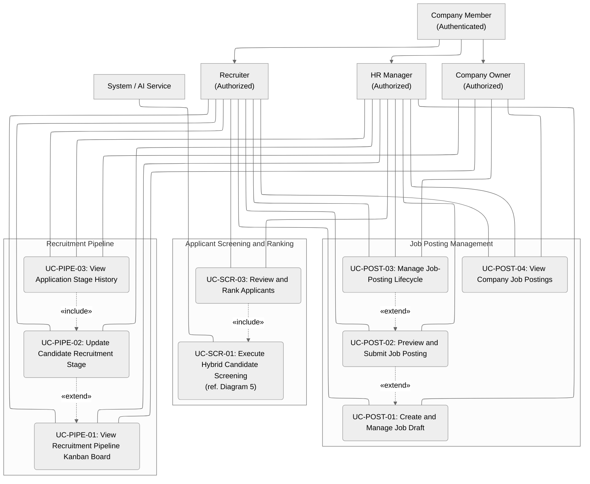

# Use Case Specification – Diagram 3 (Recruiter Operations)

**Domains covered:** Job Posting Management · Applicant Screening & Ranking · Recruitment Pipeline

---
# Student Information

**Student Name:** Ngô Quốc Tuấn  
**Student ID:** 24127581  
**Group:** 09   
**Class:** 24C11   
**Course/Project:** Software Engineering   
**Review:** Nguyễn Gia Quốc Uy
---

## Use Case Diagram

### Summary Table (Use Case ↔ Requirement Traceability Anchor)

> This table is the primary junction between **Part C (Use Case Diagram)** and the **Traceability Matrix**. Each row links a Use Case ID to the actor(s) allowed to trigger it and the Functional Requirement(s) it realizes.

| Use Case ID | Use Case Name | Actor(s) | Covered Requirements |
| :--- | :--- | :--- | :--- |
| UC-POST-01 | Create and Manage Job Draft | Recruiter, HR Manager | FR-POST-01, FR-POST-02 |
| UC-POST-02 | Preview and Submit Job Posting | Recruiter, HR Manager | FR-POST-03, FR-POST-04 |
| UC-POST-03 | Manage Job-Posting Lifecycle | Recruiter, HR Manager, Company Owner | FR-POST-05, FR-POST-06 |
| UC-POST-04 | View Company Job Postings | Recruiter, HR Manager, Company Owner | FR-POST-07 |
| UC-SCR-01 *(ref. Diagram 5)* | Execute Hybrid Candidate Screening | System / AI Service | FR-SCR-01 |
| UC-SCR-03 | Review and Rank Applicants | Recruiter, HR Manager | FR-SCR-02, FR-SCR-03 |
| UC-PIPE-01 | View Recruitment Pipeline Kanban Board | Recruiter, HR Manager, Company Owner | FR-PIPE-01 |
| UC-PIPE-02 | Update Candidate Recruitment Stage | Recruiter, HR Manager | FR-PIPE-02 |
| UC-PIPE-03 | View Application Stage History | Recruiter, HR Manager, Company Owner | FR-PIPE-03 |

---

## Part D – Use Case Specification & Prototype Evidence

> **Note on writing style:**
> - The **Basic Flow** describes only the single successful path (no error handling), with actor and system steps alternating.
> - Each **Alternative Flow** is derived by challenging every Basic Flow step against: missing/invalid input, duplicate data, insufficient permission, deleted/closed resource, expired token, external service failure, actor cancellation, concurrent update, and database save failure.

---

### Domain 1: Job Posting Management

*Figure 1 — Domain overview: the Job Draft base screen, the shell reused across UC-POST-01 to UC-POST-04. Each use case below has its own specific screen(s) placed directly under its "Screens" subsection.*

#### UC-POST-01: Create and Manage Job Draft

| Field | Description |
| :--- | :--- |
| **Actors** | Recruiter (Authorized), HR Manager (Authorized) |
| **Precondition** | The user is logged in and holds the `Recruiter` or `HR Manager` role within the company. |
| **Postcondition** | The draft is saved with a `Draft` status, ready for UC-POST-02. |

**Basic Flow**

| Step | Actor | System |
| :---: | :--- | :--- |
| 1 | Recruiter opens "Create Job Posting" and fills in job information (title, department, location, description, etc.). | — |
| 2 | — | System validates the form fields in real time. |
| 3 | Recruiter clicks "Save as Draft." | — |
| 4 | — | System persists the posting with status `Draft` and displays it in the postings list. |

**Alternative Flows**

| ID | Trigger Condition | Flow |
| :--- | :--- | :--- |
| AF-1 | Required field is missing or data format is invalid | System blocks the save action, outlines the invalid field(s) in red, and displays a validation message. Recruiter corrects the data and retries. |
| AF-2 | Recruiter reopens a previously saved draft | System loads the saved draft data into the form for continued editing. |
| AF-3 | Recruiter deletes an unpublished draft | System prompts a confirmation dialog before permanently deleting the draft. |
| AF-4 | Database save fails (e.g., connection timeout) | System displays an error toast and keeps the form data intact so the recruiter can retry without data loss. |

**Prototype Evidence**

| Specification Flow | Filename | State / Reuse |
| :--- | :--- | :--- |
| BF: Create a job posting draft | `UC_POST_01_Create_Job_Draft.png` | Job draft base screen, new-entry form, `Draft` badge |
| AF-1: Invalid input data | `UC_POST_01_Validate_Error.png` | (Reuse `UC_POST_01_Create_Job_Draft.png`) + red-outlined invalid field & validation message |

**Screens**

*BF — Job draft base screen with the new-entry form and `Draft` badge.*

*AF-1 — Same form with a red-outlined invalid field and validation message.*

---

#### UC-POST-02: Preview and Submit Job Posting

| Field | Description |
| :--- | :--- |
| **Actors** | Recruiter (Authorized), HR Manager (Authorized) |
| **Relationship** | «extend» UC-POST-01 (extends from the draft-saving step) |
| **Precondition** | A job posting exists with status `Draft`. |
| **Postcondition** | The posting's status changes to `Pending Review`, awaiting processing in UC-POST-03. |

**Basic Flow**

| Step | Actor | System |
| :---: | :--- | :--- |
| 1 | Recruiter opens a `Draft` posting and clicks "Preview." | — |
| 2 | — | System renders the posting exactly as candidates will see it. |
| 3 | Recruiter reviews the content and clicks "Submit for approval." | — |
| 4 | — | System validates required fields and changes the status to `Pending Review`. |

**Alternative Flows**

| ID | Trigger Condition | Flow |
| :--- | :--- | :--- |
| AF-1 | A required field is missing (e.g., salary range, application deadline) | System blocks the submission and displays an inline error listing the missing fields. |
| AF-2 | Posting title duplicates an existing posting title in the same company | System displays a warning banner on the preview screen, allowing the recruiter to proceed or rename the title. |
| AF-3 | Recruiter cancels before submitting | System returns to the draft screen without changing the posting's status. |
| AF-4 | Recruiter's session/token expires during submission | System redirects to the login screen; unsaved preview state is discarded. |

**Prototype Evidence**

| Specification Flow | Filename | State / Reuse |
| :--- | :--- | :--- |
| BF: Preview & submit for approval | `UC_POST_02_Preview_And_Submit.png` | Preview base screen + "Submit for approval" button |
| AF-2: Duplicate job posting title warning | `UC_POST_02_Preview_Duplicate_Title_Warning.png` | (Reuse the Preview screen) + banner warning of a title duplicate |

**Screens**

*BF — Candidate-facing preview with the "Submit for approval" button.*

*AF-2 — Same preview screen with a duplicate-title warning banner.*

---

#### UC-POST-03: Manage Job-Posting Lifecycle

| Field | Description |
| :--- | :--- |
| **Actors** | Recruiter, HR Manager, Company Owner (all Authorized) |
| **Relationship** | «extend» UC-POST-02 |
| **Precondition** | A posting exists with status `Pending Review`, `Published`, or `Paused`. |
| **Postcondition** | The posting's status accurately reflects its current lifecycle state (`Draft` / `Pending Review` / `Published` / `Archived` / `Rejected`). |

**Basic Flow**

| Step | Actor | System |
| :---: | :--- | :--- |
| 1 | HR Manager/Owner opens the postings list and filters by `Pending Review`. | System displays matching postings. |
| 2 | User opens the actions menu (⋮) on a posting. | — |
| 3 | User selects "Approve." | — |
| 4 | — | System changes the posting's status to `Published`. |

**Alternative Flows**

| ID | Trigger Condition | Flow |
| :--- | :--- | :--- |
| AF-1 | User selects "Reject" instead of "Approve" | System requires a rejection reason, then reverts the posting to `Draft` status. |
| AF-2 | User selects "Close/Archive" on a fully staffed or expired posting | System changes the posting's status to `Archived`. |
| AF-3 | User does not have the required role (e.g., a plain Recruiter attempting Owner-only action) | System hides or disables the restricted action and shows a permission-denied message if attempted directly. |
| AF-4 | Two managers act on the same posting concurrently | System detects the stale state on the second submit and prompts the user to refresh before retrying. |

**Prototype Evidence**

| Specification Flow | Filename | State / Reuse |
| :--- | :--- | :--- |
| BF: Open the actions menu (approve/reject/close/pause) | `UC_POST_03_Actions_Menu.png` | List row + actions menu (⋮) on a posting |
| State: List filtered by `Draft` | `UC_POST_03_Filter_List_Draft.png` | Postings list + `Draft` filter selected |
| State: List filtered by `Pending Review` | `UC_POST_03_Filter_List_Pending_Review.png` | Postings list + `Pending Review` filter selected |
| State: List filtered by `Published` | `UC_POST_03_Filter_List_Published.png` | Postings list + `Published` filter selected |
| State: List filtered by `Paused` | `UC_POST_03_Filter_List_Paused.png` | Postings list + `Paused` filter selected |
| State: List filtered by `Closed` | `UC_POST_03_Filter_List_Closed.png` | Postings list + `Closed` filter selected |

**Screens**

*BF — Posting list row with the actions menu (⋮) open (approve/reject/close/pause).*

*State — List filtered by `Draft` status.*

*State — List filtered by `Pending Review` status.*

*State — List filtered by `Published` status.*

*State — List filtered by `Paused` status.*

*State — List filtered by `Closed` status.*

---

#### UC-POST-04: View Company Job Postings

| Field | Description |
| :--- | :--- |
| **Actors** | Recruiter, HR Manager, Company Owner |
| **Precondition** | The user belongs to the company. |
| **Postcondition** | The list accurately reflects the current status of every posting in the company. |

**Basic Flow**

| Step | Actor | System |
| :---: | :--- | :--- |
| 1 | User navigates to "Job Postings." | — |
| 2 | — | System fetches and displays the full list of postings with status badges. |

**Alternative Flows**

| ID | Trigger Condition | Flow |
| :--- | :--- | :--- |
| AF-1 | Company has no job postings yet | System displays an empty state with a call-to-action to create a new posting. |
| AF-2 | List-fetch fails (external/database error) | System displays a retry prompt instead of a blank list. |

**Prototype Evidence**

| Specification Flow | Filename | State / Reuse |
| :--- | :--- | :--- |
| BF: View the company's job postings list | `UC_POST_04_View_Company_Job_Postings.png` | Full list, unfiltered, multiple statuses interleaved |

**Screens**

*BF — Full, unfiltered postings list with multiple statuses interleaved.*

---

### Domain 2: Applicant Screening & Ranking

*Figure 2 — Domain overview: the Screening/Evaluation base screen showing the AI scoring state (UC-SCR-01), extended into the ranked-candidates view for UC-SCR-03. Specific screens per flow are placed under each use case's "Screens" subsection.*

#### UC-SCR-01: Execute Hybrid Candidate Screening *(ref. Diagram 5)*

> This use case belongs to the scope of **Diagram 5 (Supporting Services and Analytics)**. It is included by UC-SCR-03. Only its interface touchpoints relevant to the Recruiter's workflow are summarized here; the full flow and screenshots (`UI_01_*`) are documented in the Diagram 5 specification.

| Field | Description |
| :--- | :--- |
| **Actors** | System / AI Service |
| **Precondition** | An applicant has submitted a résumé against a `Published` job posting. |
| **Postcondition** | A screening score is generated for the candidate and made available to UC-SCR-03. |

**Prototype Evidence (referenced, owned by Diagram 5)**

| Specification Flow | Filename | State / Reuse |
| :--- | :--- | :--- |
| BF: The AI system is scoring | `UC_SCR_01_AI_Scanning.png` | Evaluation base screen + loading/scanning indicator |
| AF: Scoring failed | `UC_SCR_01_Scoring_Failed.png` | Evaluation base screen + scoring-failure message |

**Screens**

*BF — Evaluation base screen with the loading/scanning indicator.*

*AF — Evaluation base screen with the scoring-failure message.*

---

#### UC-SCR-03: Review and Rank Applicants

| Field | Description |
| :--- | :--- |
| **Actors** | Recruiter (Authorized), HR Manager (Authorized) |
| **Relationship** | «include» UC-SCR-01: Execute Hybrid Candidate Screening (ref. Diagram 5) |
| **Precondition** | UC-SCR-01 has executed successfully and returned a score for the candidate. |
| **Postcondition** | The ranked list (whether overridden or not) is used as input for the Recruitment Pipeline. |

**Basic Flow**

| Step | Actor | System |
| :---: | :--- | :--- |
| 1 | Recruiter opens the "Candidates" tab for a job posting. | — |
| 2 | — | System includes UC-SCR-01 to retrieve AI scores, then displays candidates sorted by score (descending) with a résumé summary. |
| 3 | Recruiter reviews the ranked list. | — |

**Alternative Flows**

| ID | Trigger Condition | Flow |
| :--- | :--- | :--- |
| AF-1 | Recruiter disagrees with the AI-suggested order | Recruiter manually re-prioritizes a candidate; system saves the manual override and marks the entry as "manually ranked." |
| AF-2 | Recruiter advances a top candidate directly to the Offer stage | System moves the candidate's pipeline stage to `Offer` and logs the transition (feeds UC-PIPE-03). |
| AF-3 | Recruiter rejects a candidate from the ranked list | System requires a rejection reason and moves the candidate to `Rejected`. |
| AF-4 | UC-SCR-01 has not yet returned a score for a candidate | System shows the candidate in a "Pending screening" state instead of a numeric rank. |

**Prototype Evidence**

| Specification Flow | Filename | State / Reuse |
| :--- | :--- | :--- |
| BF: List of ranked candidates | `UC_SCR_03_Ranked_Candidates.png` | Candidate list sorted by AI score in descending order |
| State: Results ready to review | `UC_SCR_03_Ready.png` | (Reuse `UC_SCR_03_Ranked_Candidates.png`) + "Ready to review" badge |
| AF-2: Move a candidate to the Offer stage | `UC_SCR_03_Advanced_To_Offer.png` | Rank row + "Advance to Offer" action |
| AF-3: Reject a candidate | `UC_SCR_03_Reject.png` | Rank row + "Reject" action |

**Screens**

*BF — Candidate list sorted by AI score, descending, with résumé summary.*

*State — Ranked list with the "Ready to review" badge.*

*AF-2 — Rank row with the "Advance to Offer" action.*

*AF-3 — Rank row with the "Reject" action.*

---

### Domain 3: Recruitment Pipeline

*Figure 3 — Domain overview: the Kanban board base screen shared across UC-PIPE-01 (view), UC-PIPE-02 (drag-and-drop update), and the entry point into UC-PIPE-03 (stage history). Specific screens per flow are placed under each use case's "Screens" subsection.*

#### UC-PIPE-01: View Recruitment Pipeline Kanban Board

| Field | Description |
| :--- | :--- |
| **Actors** | Recruiter, HR Manager, Company Owner |
| **Precondition** | At least one candidate has an active application. |
| **Postcondition** | The board accurately reflects the current stage of every active candidate for the selected posting(s). |

**Basic Flow**

| Step | Actor | System |
| :---: | :--- | :--- |
| 1 | User navigates to "Pipeline." | — |
| 2 | — | System displays stage columns (Applied → Screening → Interview → Offer → Hired) with candidate cards. |

**Alternative Flows**

| ID | Trigger Condition | Flow |
| :--- | :--- | :--- |
| AF-1 | User filters the board by a specific job posting | System re-renders the board scoped to that posting only. |
| AF-2 | Actor is a Company Owner | System displays the board in read-only mode, hiding drag-and-drop actions. |

**Prototype Evidence**

| Specification Flow | Filename | State / Reuse |
| :--- | :--- | :--- |
| BF: Kanban board by stage | `UC_PIPE_01_Kanban_Board.png` | All stage columns shown, with full action permissions |
| AF-2: Company Owner viewing in read-only mode | `UC_PIPE_01_Kanban_Board_Owner_View_Only.png` | (Reuse `UC_PIPE_01_Kanban_Board.png`) + drag-and-drop actions hidden |

**Screens**

*BF — All stage columns (Applied → Screening → Interview → Offer → Hired) with full action permissions.*

*AF-2 — Same board with drag-and-drop actions hidden for the Company Owner.*

---

#### UC-PIPE-02: Update Candidate Recruitment Stage

| Field | Description |
| :--- | :--- |
| **Actors** | Recruiter (Authorized), HR Manager (Authorized) |
| **Relationship** | «extend» UC-PIPE-01 |
| **Precondition** | The candidate's card is visible on the kanban board. |
| **Postcondition** | The new stage is saved, and a history record is created (input for UC-PIPE-03). |

**Basic Flow**

| Step | Actor | System |
| :---: | :--- | :--- |
| 1 | Recruiter drags a candidate's card from the current column to the next stage column. | — |
| 2 | — | System validates the transition and updates the candidate's stage. |
| 3 | — | System logs the change and displays a confirmation toast. |

**Alternative Flows**

| ID | Trigger Condition | Flow |
| :--- | :--- | :--- |
| AF-1 | Recruiter drops the card onto the `Rejected` column | System requires a rejection reason before confirming the move. |
| AF-2 | Recruiter cancels the drag mid-action (drops back on the original column) | System discards the action; no stage change or history record is created. |
| AF-3 | Two recruiters move the same card at the same time | System applies the first successful update and notifies the second user that the card has already moved, refreshing their board. |
| AF-4 | Database save of the stage change fails | System reverts the card to its original column and displays an error toast. |

**Prototype Evidence**

| Specification Flow | Filename | State / Reuse |
| :--- | :--- | :--- |
| BF: Drag and drop a candidate's card to another column | `UC_PIPE_02_Drag_And_Drop_Card.png` | Candidate card shown mid-drag (dragging state) |
| BF: Confirm the stage update | `UC_PIPE_02_Move_Stage.png` | Toast/confirmation message that the stage change succeeded |

**Screens**

*BF — Candidate card shown mid-drag toward the next stage column.*

*BF — Toast/confirmation message that the stage change succeeded.*

---

#### UC-PIPE-03: View Application Stage History

| Field | Description |
| :--- | :--- |
| **Actors** | Recruiter, HR Manager, Company Owner |
| **Relationship** | «include» UC-PIPE-02 (each stage update creates a history record) |
| **Precondition** | At least one stage transition has occurred for the selected application. |
| **Postcondition** | The full, ordered history of stage transitions is visible for the selected application. |

**Basic Flow**

| Step | Actor | System |
| :---: | :--- | :--- |
| 1 | User opens a candidate's application and selects "History." | — |
| 2 | — | System displays a chronological timeline: stage, transition time, and the actor who performed the update. |

**Alternative Flows**

| ID | Trigger Condition | Flow |
| :--- | :--- | :--- |
| AF-1 | No stage transitions have occurred yet | System displays an empty timeline with the application's initial `Applied` state only. |

**Prototype Evidence**

| Specification Flow | Filename | State / Reuse |
| :--- | :--- | :--- |
| BF: Application history log | `UC_PIPE_03_Stage_History.png` | Timeline of stage changes in chronological order |

**Screens**

*BF — Chronological timeline of stage changes, transition time, and the acting user.*

---

## Traceability Summary (per Domain)

| Domain | Use Cases | Evidence Files | Reused Base Screens |
| :--- | :--- | :--- | :--- |
| Job Posting Management | UC-POST-01 → 04 | 11 | 2 (Draft form, Preview shell) |
| Applicant Screening & Ranking | UC-SCR-03 (incl. UC-SCR-01 ref.) | 6 | 1 (Ranked candidates list) |
| Recruitment Pipeline | UC-PIPE-01 → 03 | 5 | 1 (Kanban board) |