# DGM-04 — Use-Case Specification: Company Administration and Moderation

*Performed by: Nguyễn Minh Khôi | Reviewed by: Nguyễn Gia Quốc Uy | Edited by: Group 9*
**Version:** V1.3 (06/08/2026) — Actor naming, relationship wording, and editorial pass revised

The Mermaid source is maintained in [diagram_04.md](../diagrams/diagram_04.md). Candidate, Company Member, and Platform Administrator generalize Authenticated User. Recruiter, HR Manager, and Company Owner generalize Company Member.

# UC-ORG-01 — Submit Company Verification Request

## Use-Case Information

| Field | Value |
|---|---|
| Use-Case ID | UC-ORG-01 |
| Primary Actor | Authenticated User |
| Supporting Actor | File Scanning Service; Platform Administrator |
| Trigger | The user requests company-scoped access. |

## Brief Description

This use case allows an **Authenticated User** to request company-scoped Recruiter access by either registering a new company (with business-license verification) or requesting membership in an existing company. The request is validated, screened for malicious files, and placed into the Administrator Review Queue. No recruitment permissions are granted until an Administrator completes verification (handled by **UC-ORG-03 — Review Company or Membership Request** use case).

## Actors

- Authenticated User.
- Platform Administrator.
- Company Owner.
- File Scanning Service.

## Preconditions

### The User Holds an Active Session
The User has successfully authenticated and holds an active, non-suspended account.

### No Existing Active Membership
The User does not already hold an active or Pending membership for the target company.

## Flow of Events

### Basic Flow — Register New Company

1. The use case begins when the authenticated User selects the option to request recruiter/company access.
2. The System prompts the User to search for an existing company by Company Name or Tax Identification Number.
3. The User enters search criteria and submits.
4. The System searches company records and determines that no matching company exists. *(If a match is found, see **UC-ORG-02 — Request to Join Existing Company**.)*
5. The System displays a new-company registration form requesting Company Name, Tax ID, and other required business details.
6. The User completes the form and uploads a business license document.
7. The System validates required fields, confirms the file is a supported format and within the allowed size before it is stored.
8. The System creates a Company Membership Request record with status `Pending`, designates the User as the prospective `OWNER`, associates the uploaded document, and places the request into the Administrator Review Queue. The submission is written to the backend audit log.
9. The System displays a confirmation to the User indicating the request has been submitted for review and that a notification will be sent once a decision is made.
10. The use case ends.

## Alternative Flows

### A1 — Invalid Document

At Basic Flow step 7, if the uploaded document fails validation or the malware scan:

1. The System rejects the file and displays a specific validation or safety error to the User; the file is not stored or queued for review.
2. The User may correct and re-upload the document.
3. The flow resumes at Basic Flow step 6.

### A2 — User Cancels Submission

At any point prior to final submission (Basic Flow step 8), the User may cancel the request.

1. The System discards all unsaved form data and any provisionally uploaded file.
2. The use case ends without creating a request record.

## Special Requirements

### Malware Scanning Before Visibility
Uploaded business license documents must complete a malware scan before becoming available to Administrators or any downstream process; failed scans must never persist the file.

### No Implicit Access Grant
A Tax ID match against an existing company must never automatically grant membership or data access; access is only created after both invitation/Company Owner approval (for existing companies) and Platform Administrator verification.

### Auditability
Every submission, and any subsequent approval, rejection, or role assignment resulting from it, must be recorded in the backend audit log with actor and timestamp.

### Tenant Isolation
Until the request is approved, the User must have no access to the target company's job postings, applicants, or other company-scoped data.

### Data Protection
The uploaded business document is sensitive business information and must be stored securely, transmitted over HTTPS, and restricted to Administrators for review purposes only.

## Postconditions

### Success End Condition
A Company Membership Request exists with status `Pending`, correctly associated with either a new unverified company record or an existing company and requested role, is visible in the Administrator Review Queue, and the User has received on-screen confirmation. The event is recorded in the audit log.

### Failure End Condition
No Company Membership Request record is created. The User has been informed of the specific reason (validation error, malware detection, or missing invitation/Company Owner approval), and their account and candidate profile remain unchanged.

## Related Use Cases and Entry Points

### Admin Verification Decision
After Basic Flow step 9, the request may be opened in **UC-ORG-03 — Review Company or Membership Request**. That is a separate administrator goal; it is not a workflow extension of this submission.

## Prototype Evidence

1.
   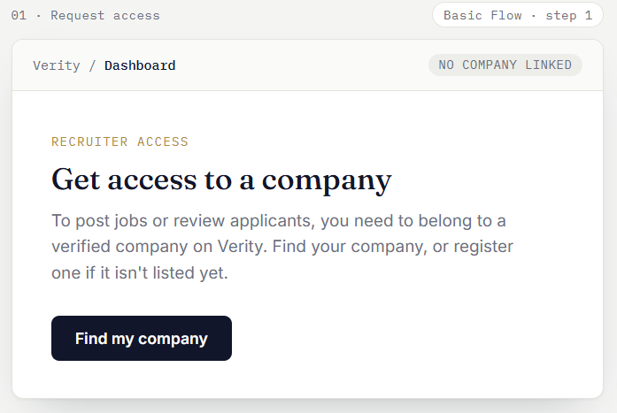

2.
   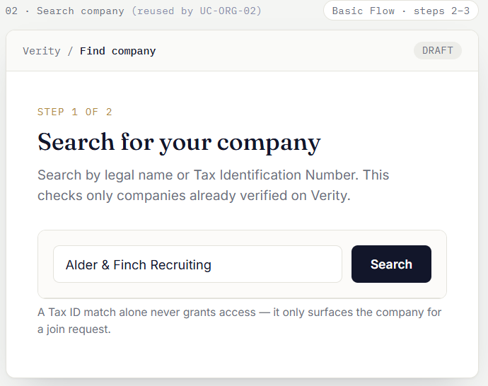

3.
   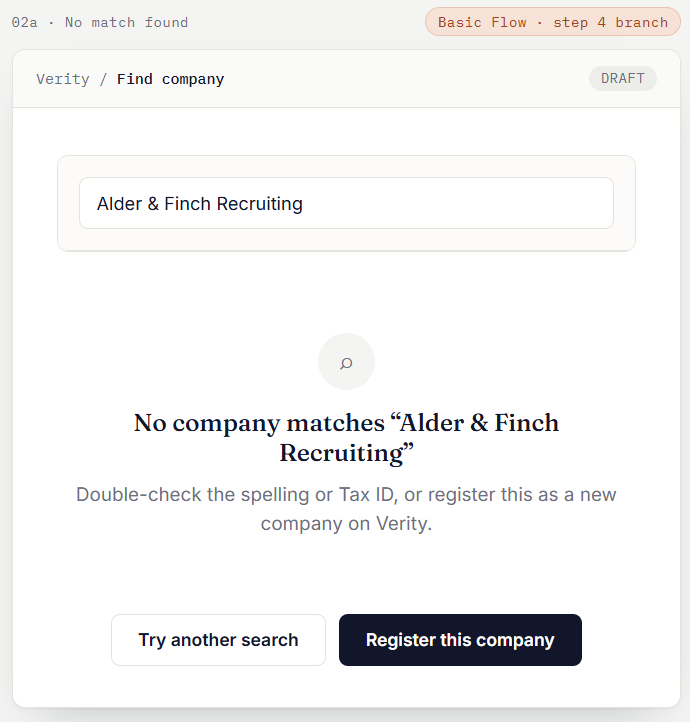

4.
   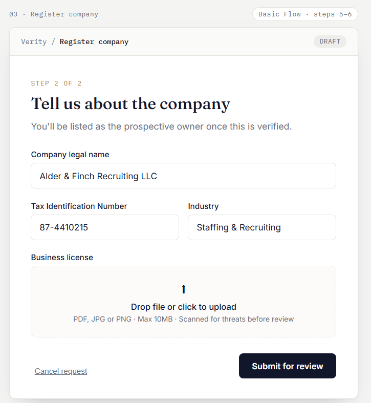

5.
   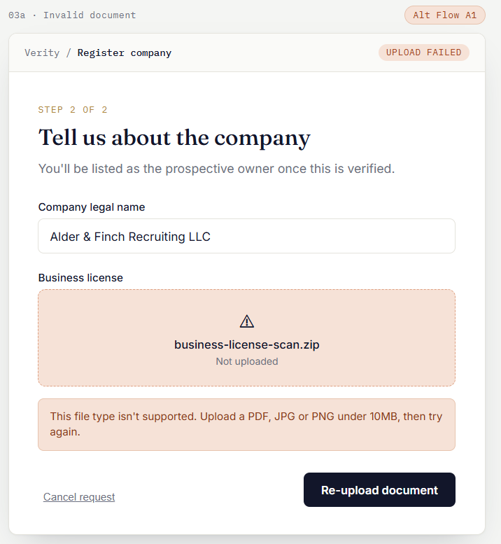

6.
   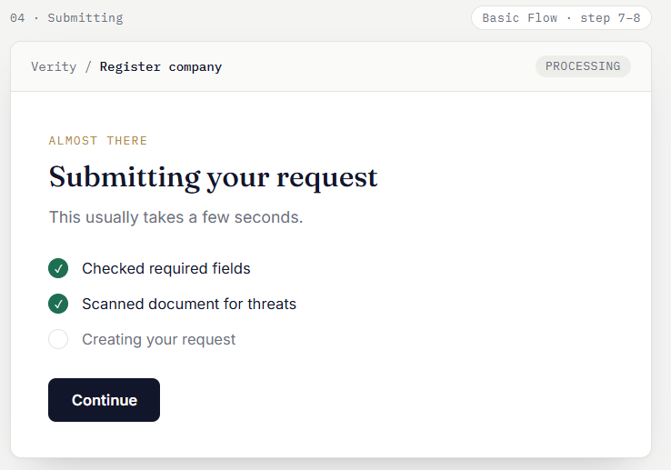

7.
   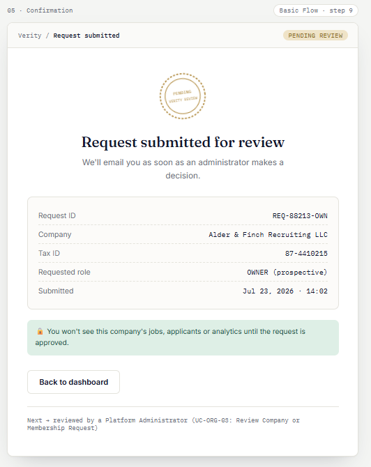

# UC-ORG-02 — Request to Join Existing Company

## Use-Case Information

| Field | Value |
|---|---|
| Use-Case ID | UC-ORG-02 |
| Primary Actor | Authenticated User |
| Supporting Actor | Company Owner; Platform Administrator |
| Trigger | The user selects **Join an existing company**. |

## Brief Description

This use case allows an authenticated Candidate to request `HR_MANAGER` or `RECRUITER` permissions for a company that already exists in the system, by locating that company and submitting a membership request — either via a valid invitation code or by requesting approval from an existing Company Owner. The request does not grant any access on its own; it must pass Company Owner approval (or a valid invitation) and, subsequently, Platform Administrator verification before company-scoped permissions are activated.

## Actors

- Authenticated User
- Company Owner.
- Platform Administrator.

## Flow of Events

### Basic Flow

1. The use case begins when the authenticated User selects the option to join an existing company.
2. The System prompts the User to search for a company by Company Name or Tax Identification Number.
3. The User enters search criteria and submits.
4. The System returns matching, already-verified companies. *(If no match is found, see Alternative Flow A1.)*
5. The User selects the target company from the results.
6. The System displays a summary of the company and prompts the User to select the desired role (`HR_MANAGER` or `RECRUITER`) and, if held, enter an invitation code.
7. The User selects a role, optionally enters an invitation code, and submits the request.
8. The System validates the invitation code. *(If no code is provided, see Alternative Flow A2. If a code is provided but invalid or expired, see Exception Flow E2.)*
9. The System confirms the invitation is valid and associated with the target company and role.
10. The System creates a Company Membership Request with status `Pending`, linked to the User, target company, and requested role, and places it into the Administrator Review Queue. The submission is written to the backend audit log.
11. The System displays a confirmation to the User indicating the request has been submitted for review.
12. The use case ends.

## Alternative Flows

### A1 — No Matching Company Found

At Basic Flow step 4, if the search returns no matching, verified company:

1. The System informs the User that no matching company was found.
2. The System offers the User the option to register a new company instead (see **UC-ORG-01 — Submit Company Verification Request**).
3. The use case ends.

### A2 — No Invitation Code Provided (Company Owner Approval Path)

At Basic Flow step 8, if the User does not provide an invitation code:

1. The System creates a Company Membership Request with status `Awaiting Owner Approval`, linked to the User, target company, and requested role.
2. The System notifies the active Company Owner(s) of the target company that a membership request is awaiting review.
3. The Company Owner reviews the request and approves or rejects it.
4. If approved, the flow resumes at Basic Flow step 10, with the request now eligible for the Administrator Review Queue.
5. If rejected, see Exception Flow E1.

### A3 — User Cancels Submission

At any point prior to final submission (Basic Flow step 10 / A2 step 1), the User may cancel the request.

1. The System discards all unsaved form data.
2. The use case ends without creating a request record.

## Exception Flows

### E1 — Company Owner Rejects Request

If the target company's Company Owner rejects the request during A2:

1. The System updates the request status to `Rejected` and records the Company Owner's stated reason.
2. The System notifies the User of the rejection and reason.
3. The use case ends in failure. The User may submit a corrected request.

### E2 — Invalid or Expired Invitation Code

At Basic Flow step 8, if the entered invitation code is invalid, expired, or already consumed:

1. The System rejects the code and displays a specific error to the User.
2. The User may re-enter a code or proceed via Alternative Flow A2 (Company Owner Approval Path).
3. The flow resumes at Basic Flow step 7.

## Special Requirements

### Authorization Safeguard
A join request must never result in an active membership without either (a) a valid, unexpired invitation tied to the target company and role, or (b) explicit approval from an existing Company Owner of that company — in addition to final Platform Administrator verification. Neither the invitation nor the Company Owner approval alone is sufficient to grant access.

### No Access Prior to Approval
The User must have no access to the target company's job postings, applicants, evaluation notes, or analytics at any point before the request reaches an `Approved` state.

### Notification Timing
Owner-approval notifications and User-facing decision notifications must be enqueued within the platform's standard notification window (≤ 5 seconds after the triggering transaction is committed).

### Auditability
Every state transition of the request (submission, Company Owner approval/rejection, Platform Administrator approval/rejection) must be written to the backend audit log with actor and timestamp.

## Postconditions

### Success End Condition
A Company Membership Request exists linked to the User, the target company, and the requested role, in status `Pending` (invitation path) or `Awaiting Owner Approval` (no-invitation path), and the appropriate party (Platform Administrator or Company Owner) has been notified. The event is recorded in the audit log.

### Failure End Condition
No membership is granted; the request is either not created (cancelled, no match) or ends in status `Rejected` with a recorded reason communicated to the User.

## Related Use Cases and Entry Points

### Company Owner Review of Membership Request
At Alternative Flow A2, step 3, the Company Owner may start a separate membership-review action to approve or reject the pending join request.

### Admin Verification Decision
After Basic Flow step 10, an eligible request may be opened in **UC-ORG-03 — Review Company or Membership Request**.

## Prototype Evidence

1.
   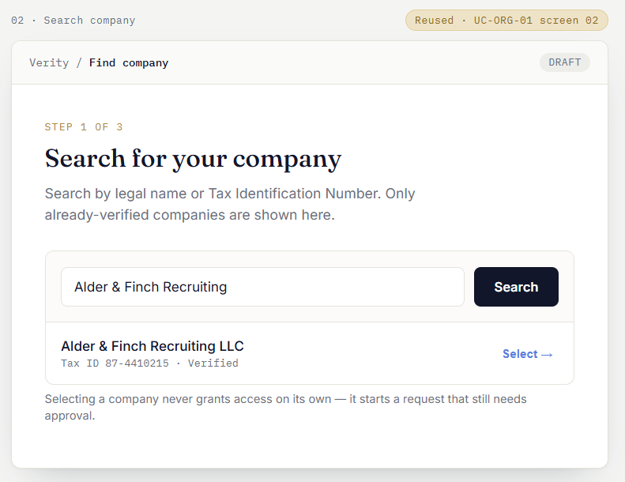

2.
   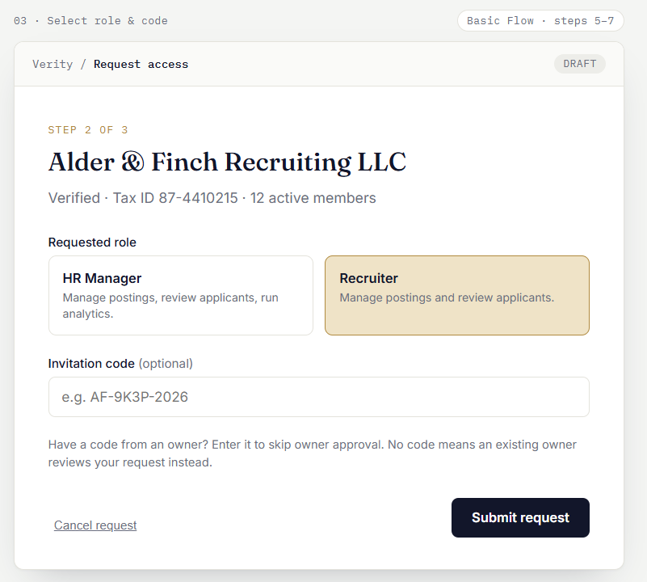

3.
   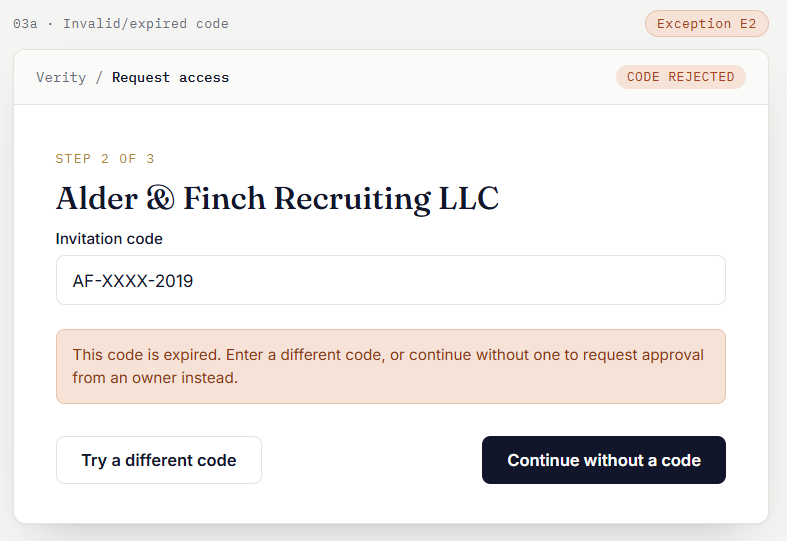

4.
   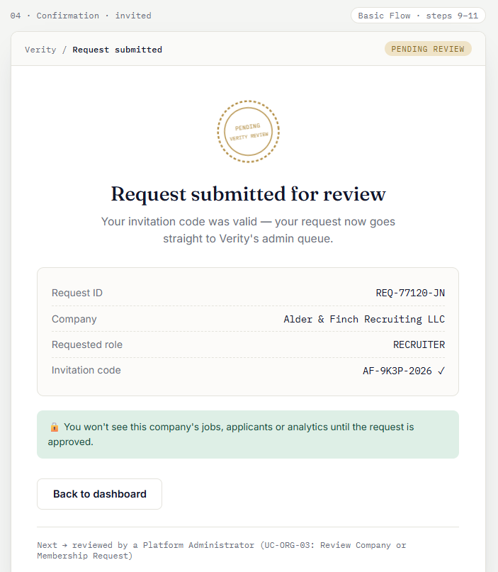

5.
   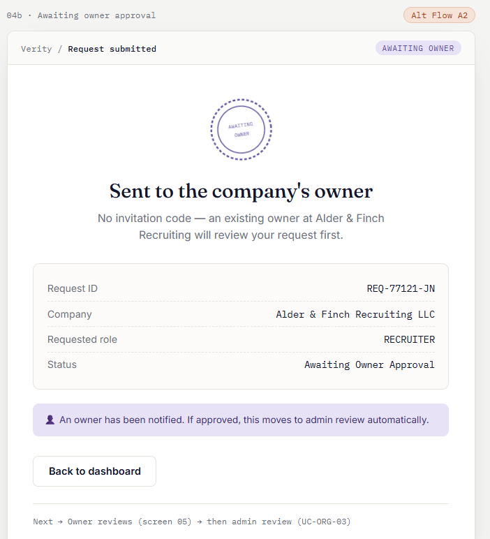

# UC-ORG-03 — Review Company or Membership Request

## Use-Case Information

| Field | Value |
|---|---|
| Use-Case ID | UC-ORG-03 |
| Primary Actor | Platform Administrator |
| Supporting Actor | File Scanning Service |
| Trigger | The administrator opens the company-verification queue. |

## Brief Description

This use case allows a Platform Administrator to review a Pending Company Membership Request — either a new-company registration with an uploaded business license or a join-request for an existing company that has already passed invitation validation or Company Owner approval — and issue a final Approve or Reject decision.

## Actors
- Platform Administrator
- Authenticated User

## Preconditions

### Request Awaiting Verification
A Company Membership Request exists in the Administrator Review Queue with status `Pending`, and (for existing-company requests) has already cleared invitation validation or Company Owner approval per UC-ORG-02.

## Flow of Events

### Basic Flow — Approve Request

1. The use case begins when the Administrator opens the Company Verification Queue.
2. The System displays all `Pending` requests, showing request type (New Company / Join Existing Company), requesting user, target company, and submission date.
3. The Administrator selects a request to review.
4. The System displays the full request details, including the securely stored business license document (for new-company requests) or the target company and requested role (for join requests).
5. The Administrator reviews the submission for legitimacy against platform Content Moderation guidelines.
6. The Administrator selects "Approve."
7. For a **new-company request**: the System creates a `Company` record with status `Verified` and a `CompanyMembership` record for the Requesting User with role `OWNER` and status `Active`.
8. For a **join-existing-company request**: the System creates a `CompanyMembership` record for the Requesting User with the requested role (`HR_MANAGER`/`RECRUITER`) and status `Active`, linked to the existing company.
9. The System records the decision (Administrator, timestamp, outcome) to the audit log.
10. The System notifies the requesting User by email and in-app alert that access has been granted.
11. The use case ends.

## Alternative Flows

### A1 — Reject Request

At Basic Flow step 6, if the Administrator rejects the request:

1. The Administrator enters a required rejection reason.
2. The System sets the request status to `Rejected` and records the reason.
3. The System logs the decision to the audit log.
4. The System notifies the requesting User by email and in-app alert with the reason, noting that a corrected request may be resubmitted.
5. No `Company` or `CompanyMembership` record is created or modified.
6. The use case ends.

## Exception Flows

### E1 — Suspicious or Fraudulent Submission

At Basic Flow step 5, if the Administrator suspects a fraudulent business license or repeated abusive submissions:

1. The Administrator rejects the request per A1.
2. The Administrator may additionally proceed to **UC-USER-02 — Apply Account Enforcement Action** against the Requesting User.

## Special Requirements

### Restricted Document Access
Business license documents must be viewable only by Administrators performing verification.

### Auditability
Every approval and rejection decision must be recorded in the backend audit log.

### Notification Timing
Outcome notifications must be enqueued within 5 seconds of the decision being committed.

## Postconditions

### Success End Condition
The `Company` (if new) is `Verified` and/or a `CompanyMembership` is `Active`; the Requesting User has Recruiter Dashboard access scoped to that company; the decision is logged; the user is notified.

### Failure End Condition
The request is `Rejected`; no company or membership record is created or altered; the user is notified with the reason.

## Prototype Evidence

1.
   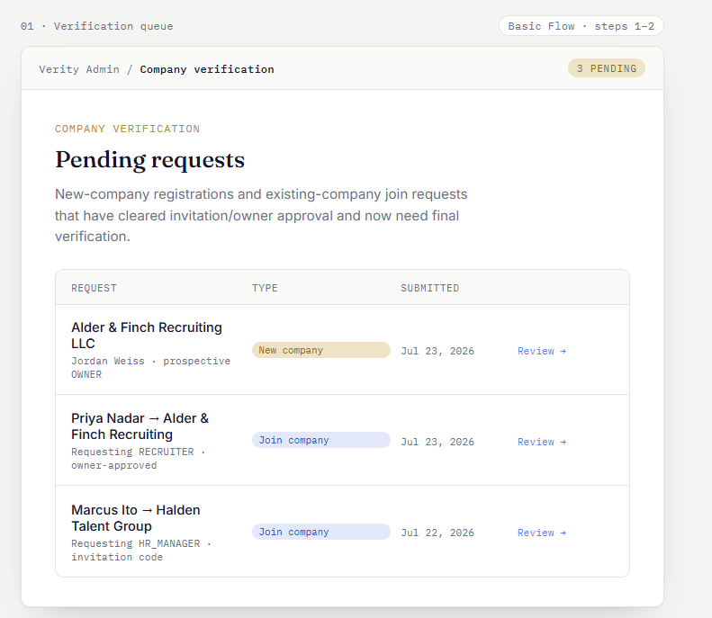

2.
   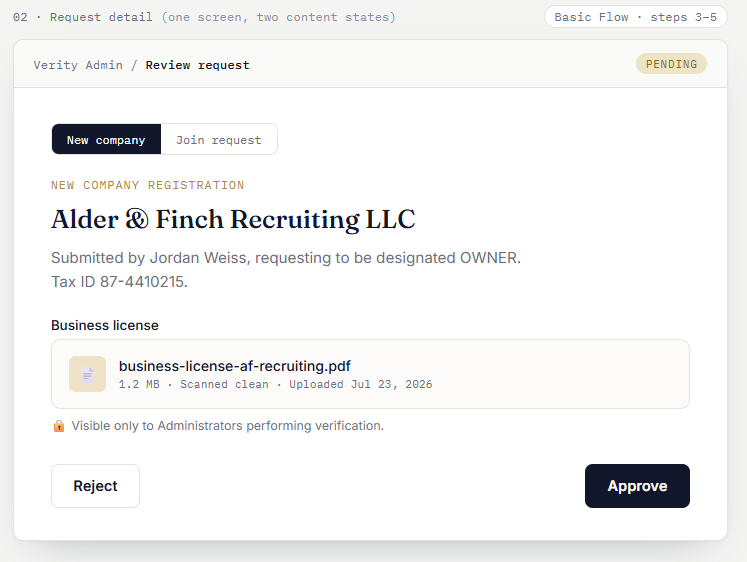

3.
   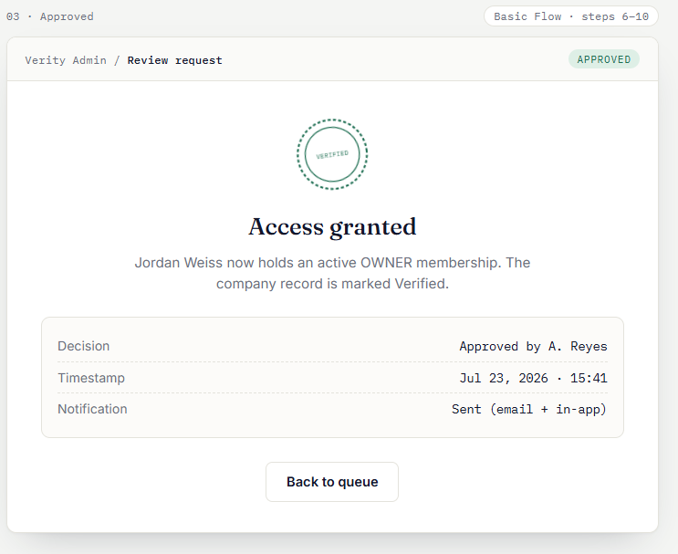

4.
   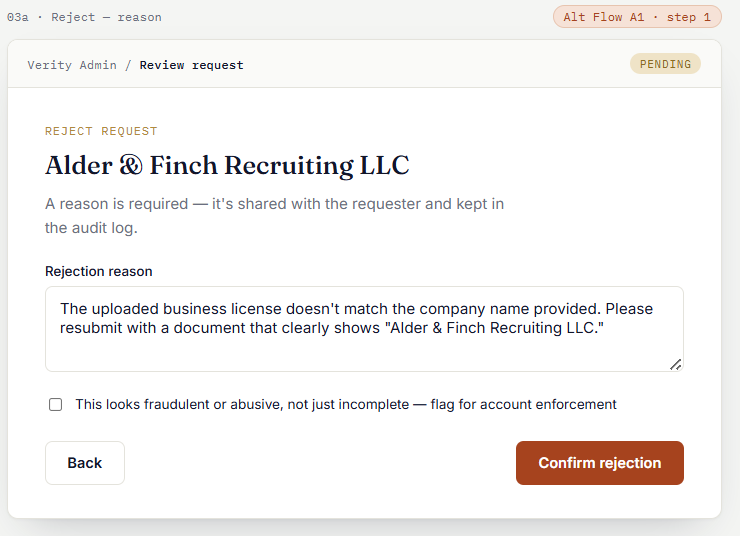

5.
   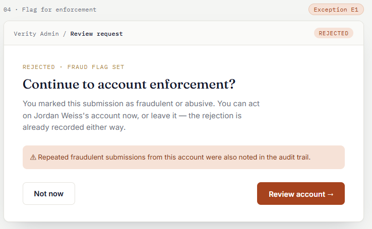

---

# UC-ORG-04 — Manage Company Memberships and Roles

## Use-Case Information

| Field | Value |
|---|---|
| Use-Case ID | UC-ORG-04 |
| Primary Actor | Company Owner |
| Supporting Actor | Company Member |
| Trigger | The Company Owner opens company membership settings. |

## Brief Description

This use case allows a Company Owner to view existing company members, invite new members by email with an assigned role, change an existing member's role, and remove a member — all scoped to the owner's own company, without affecting the removed or reassigned member's underlying candidate identity.

## Actors
- Company Owner
- Company Member

## Preconditions

### Active Company Owner Membership
The User holds an `Active` `CompanyMembership` with role `OWNER` for the company being managed.

## Flow of Events

### Basic Flow — Invite New Member

1. The use case begins when the Company Owner navigates to Company Membership Management.
2. The System displays current members with name, role, and status.
3. The Company Owner selects "Invite Member."
4. The System prompts for the invitee's email and the role to assign (`HR_MANAGER` or `RECRUITER`).
5. The Company Owner submits the invitation.
6. The System generates a unique, time-limited invitation code linked to the company and role.
7. The System sends an invitation email to the specified address.
8. The System logs the invitation issuance to the audit log.
9. The use case ends.

## Alternative Flows

### A1 — Change an Existing Member's Role

1. The Company Owner selects an `Active` member and chooses a new role (`HR_MANAGER` or `RECRUITER`).
2. The System confirms the Company Owner is not attempting to reassign their own `OWNER` role through this action *(ownership transfer is handled by UC-ORG-05)*.
3. The System updates the `CompanyMembership` role.
4. The System logs the change (old role, new role, actor, timestamp) to the audit log.
5. The System notifies the affected member.
6. The flow resumes at Basic Flow step 2.

### A2 — Remove a Member

1. The Company Owner selects an existing member and chooses "Remove from Company."
2. The System requests confirmation.
3. The Company Owner confirms.
4. The System sets the `CompanyMembership` status to `Removed`, immediately revoking the member's access to company data.
5. The System logs the removal to the audit log and notifies the removed member.
6. The flow resumes at Basic Flow step 2.

## Special Requirements

### Owner-Only Authorization
Only members with an `Active` `OWNER` membership for the company may perform these actions.

### Immediate Revocation
Removal must immediately and transactionally revoke the affected member's access — no caching delay.

### Auditability
Invitations, role changes, and removals must all be logged.

## Postconditions

### Success End Condition
The company's membership list reflects the invitation, role change, or removal; affected users are notified; the audit log is updated.

## Prototype Evidence

1.
   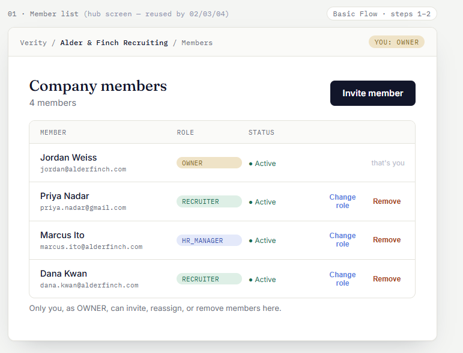

2.
   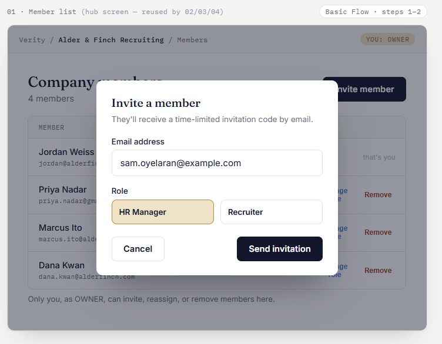

3.
   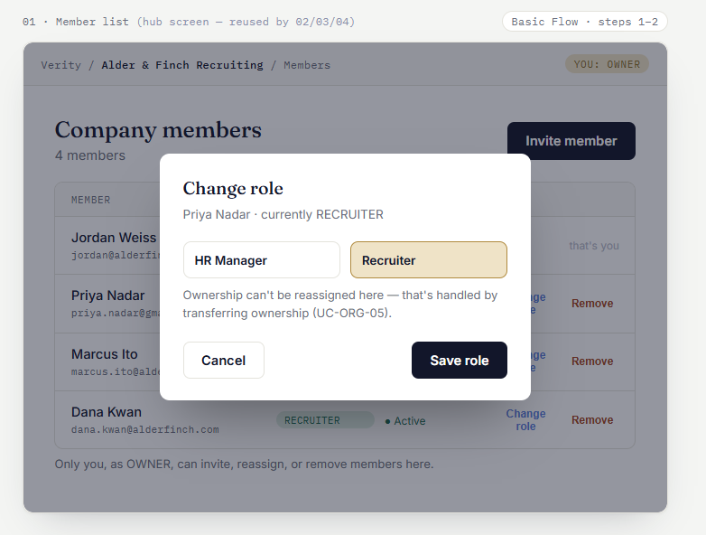

4.
   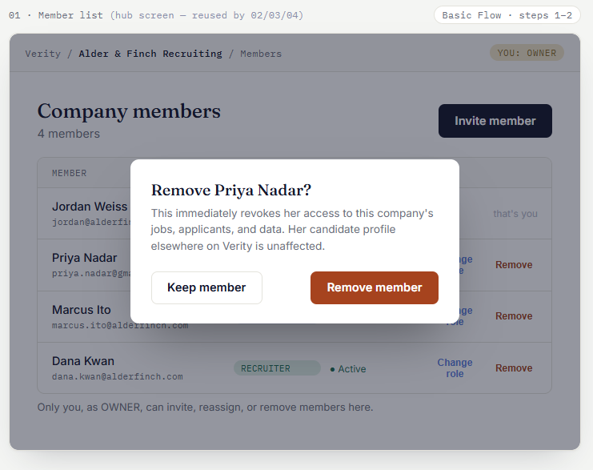

---

# UC-ORG-05 — Manage Membership Lifecycle

## Use-Case Information

| Field | Value |
|---|---|
| Use-Case ID | UC-ORG-05 |
| Primary Actor | Company Owner, Company Member, or Platform Administrator |
| Supporting Actor | None |
| Trigger | The actor opens a membership action. |

## Brief Description

This use case covers the post-approval lifecycle events that change a `CompanyMembership`'s state outside of routine role management: a member voluntarily leaving a company, an Administrator revoking a membership, a Company Owner transferring ownership, and full company deactivation (which cascades to unpublish job postings and disable all memberships).

## Actors
- Company Member
- Platform Administrator
- Company Owner

## Preconditions

### Existing Active Membership
The company and the relevant `CompanyMembership` record(s) exist with status `Active`.

## Flow of Events

### Basic Flow — Member Voluntarily Leaves Company

1. The use case begins when an authenticated Company Member selects "Leave Company."
2. The System displays a warning that access will be immediately revoked.
3. The Member confirms.
4. The System checks whether the Member is the sole `OWNER`. *(If so, see Exception Flow E1.)*
5. The System sets the `CompanyMembership` status to `Left`, immediately revoking access.
6. The System logs the event to the audit log.
7. The System notifies the company's remaining Company Owner(s), if any.
8. The use case ends.

## Alternative Flows

### A1 — Administrator Revokes Membership

1. The Administrator locates the target membership via **UC-USER-01 — Search and View User Accounts**.
2. The Administrator selects "Revoke Membership" and enters a reason.
3. The System sets the `CompanyMembership` status to `Revoked`, immediately disabling access.
4. The System logs the revocation (actor, reason, timestamp) to the audit log.
5. The System notifies the affected user and the company's Company Owner(s).
6. The use case ends.

### A2 — Company Owner Transfers Ownership

1. The current Company Owner selects "Transfer Ownership" and selects an existing `Active` member (`HR_MANAGER` or `RECRUITER`) as the new role `OWNER`.
2. The System requests confirmation.
3. The current Company Owner confirms.
4. The System atomically updates the current Company Owner's role to `HR_MANAGER` and the selected member's role to `OWNER`.
5. The System logs the transfer to the audit log.
6. The System notifies both users.
7. The use case ends.

### A3 — Company Deactivation

1. An Administrator selects "Deactivate Company" and enters a reason.
2. The System requests confirmation.
3. The Administrator confirms.
4. The System sets all of the company's `Active` job postings to `Closed` and disables all `CompanyMemberships` for the company.
5. The System logs the deactivation to the audit log.
6. The System notifies all affected members.
7. The use case ends.

## Exception Flows

### E1 — Sole Owner Cannot Leave

At Basic Flow step 4, if the Member is the company's only `OWNER`:

1. The System blocks the departure and instructs the User to transfer ownership (A2) or deactivate the company first.
2. The use case ends without change.

## Special Requirements

### Atomicity
Ownership transfer must be a single atomic transaction — the system must never have zero or two OWNERs mid-operation.

### Cascading Deactivation
Company deactivation must unpublish all job postings and disable all memberships consistently with the Job Post Lifecycle.

### Auditability and Timing
All lifecycle transitions must be logged and trigger notifications within 5 seconds.

## Postconditions

### Success End Condition
The membership or company reflects the new lifecycle state (`Left`, `Revoked`, ownership transferred, or `Deactivated`), dependent job postings are updated accordingly, and the audit trail is complete.

## Prototype Evidence

1.
   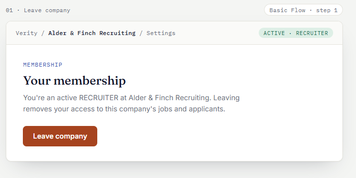

2.
   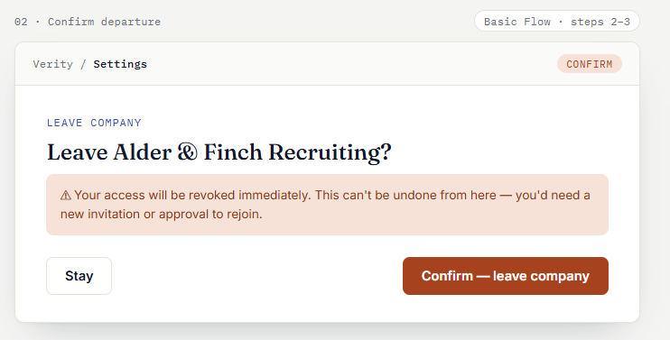

3.
   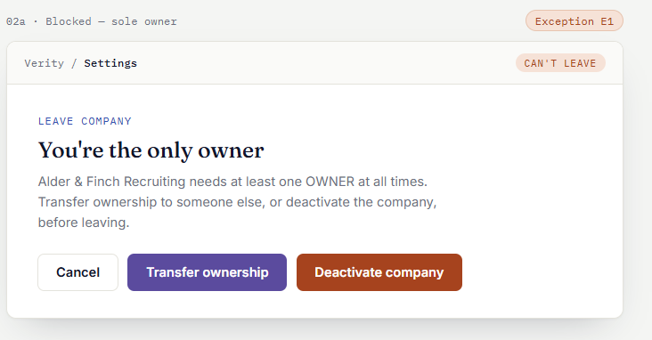

4.
   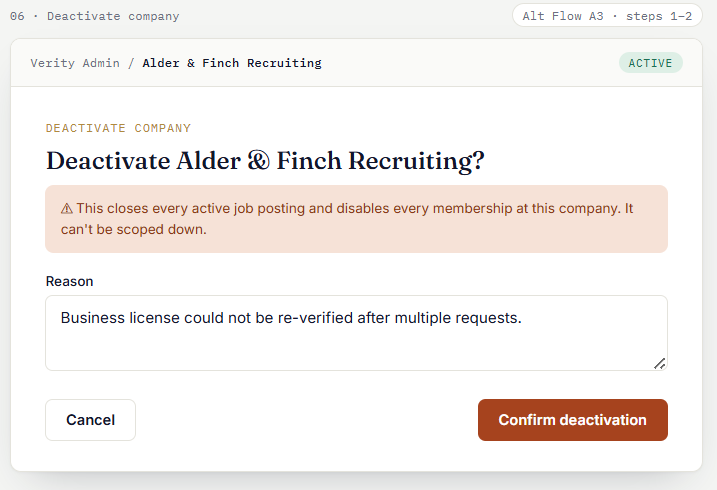

5.
   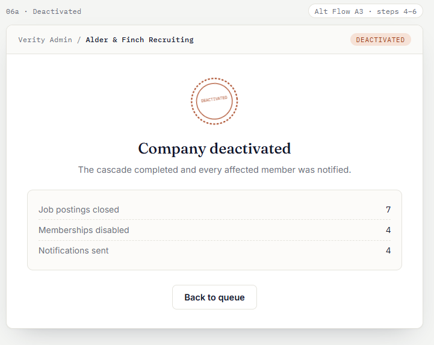

6.
   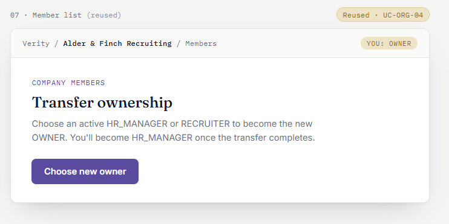

7.
   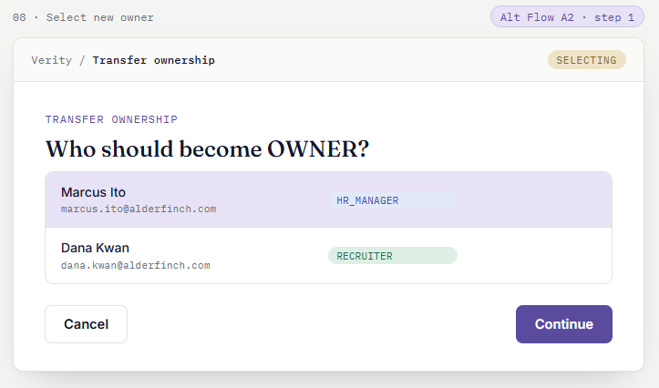

8.
   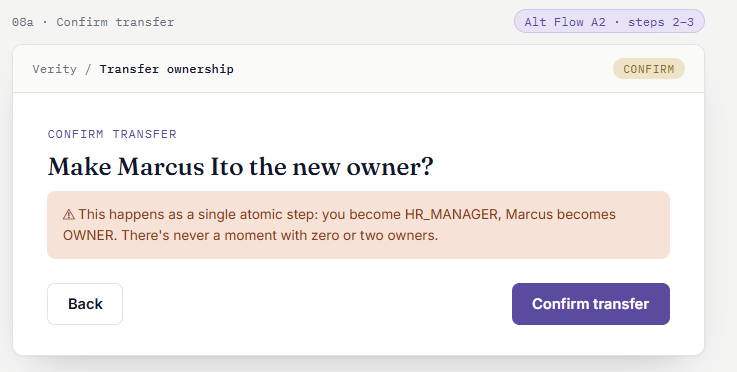

---

# UC-USER-01 — Search and View User Accounts

## Use-Case Information

| Field | Value |
|---|---|
| Use-Case ID | UC-USER-01 |
| Primary Actor | Platform Administrator |
| Supporting Actor | None |
| Trigger | The administrator opens the User Account Directory. |

## Brief Description

This use case allows a Platform Administrator to search, filter, and view details of registered Candidate and Recruiter accounts, including their company memberships and account status, as the entry point for account enforcement actions.

## Actors
- Platform
- Administrator

## Preconditions

### Administrator Session
The Administrator holds an active platform `ADMIN` role and an authenticated session.

## Flow of Events

### Basic Flow

1. The use case begins when the Administrator navigates to the User Account Directory.
2. The System displays a paginated list of registered accounts, showing name, email, platform role, account status, and company memberships.
3. The Administrator enters search or filter criteria (e.g., name, email, status, company).
4. The System returns filtered, paginated results.
5. The Administrator selects a specific account.
6. The System displays the full account profile, including registration date, verification status, company memberships/roles, and recent audit history.
7. The use case ends.

## Alternative Flows

### A1 — No Matching Results

At Basic Flow step 4, if no accounts match the criteria:

1. The System displays an empty-state message.
2. The Administrator may adjust criteria and resume at step 3.

## Special Requirements

### Performance
Search and filter results should meet the dashboard-navigation performance target (≤ 2 seconds).

### Access Restriction
The User Account Directory is accessible only to users holding the platform `ADMIN` role.

## Postconditions

### Success End Condition
This is a read-only use case; no system state changes. The Administrator has obtained the information needed for further action, such as **UC-USER-02 — Apply Account Enforcement Action**.

## Related Use Cases and Entry Points

### Apply Account Enforcement Action
After the target account is identified, the administrator may start **UC-USER-02 — Apply Account Enforcement Action**.

## Prototype Evidence

   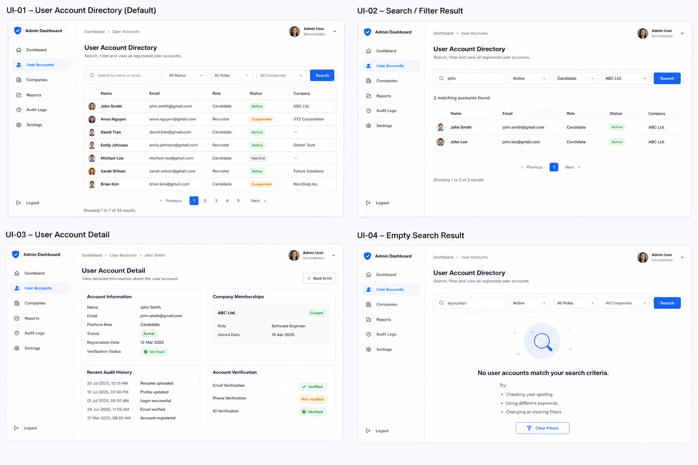

---

# UC-USER-02 — Apply Account Enforcement Action

## Use-Case Information

| Field | Value |
|---|---|
| Use-Case ID | UC-USER-02 |
| Primary Actor | Platform Administrator |
| Supporting Actor | None |
| Trigger | The administrator selects an enforcement action for an identified account. |

## Brief Description

This use case allows a Platform Administrator to suspend a user account that violates platform policy, or reactivate a previously suspended account, with all actions recorded for audit and accountability.

## Actors
- Platform Administrator
- Authenticated User

## Preconditions

### Target Account Identified
The Administrator has located the target account, typically via UC-USER-01.

## Flow of Events

### Basic Flow — Suspend Account

1. The use case begins when the Administrator, viewing a user account, selects "Suspend Account."
2. The System prompts for a required suspension reason.
3. The Administrator enters the reason and confirms.
4. The System sets the account status to `Suspended` and immediately invalidates the user's active session tokens.
5. The System blocks effective access through any of the user's company memberships while suspended, without altering the underlying membership records.
6. The System logs the suspension (Administrator, reason, timestamp) to the audit log.
7. The System notifies the affected user of the suspension and reason.
8. The use case ends.

## Alternative Flows

### A1 — Reactivate Account

1. The Administrator selects a `Suspended` account and chooses "Reactivate Account."
2. The System requests confirmation and optional notes.
3. The Administrator confirms.
4. The System sets the account status to `Active`, restoring normal access.
5. The System logs the reactivation to the audit log.
6. The System notifies the user of the reactivation.
7. The use case ends.

## Exception Flows

### E1 — Attempt to Suspend Own Administrator Account

1. The System detects the target account is the acting Administrator's own account and blocks the action.
2. The System displays an error explaining that self-suspension is not permitted.
3. The use case ends without change.

## Special Requirements

### Immediate Session Invalidation
Suspension must immediately invalidate active JWT-based sessions for the affected user.

### Auditability
Both suspension and reactivation must be logged.

### Notification Timing
Notifications must be enqueued within 5 seconds of the action being committed.

## Postconditions

### Success End Condition
The account status is updated (`Suspended` or `Active`); sessions are invalidated on suspension; the audit log is updated; the user is notified.

### Failure End Condition
No state change occurs; an error is displayed to the Administrator.

## Prototype Evidence

   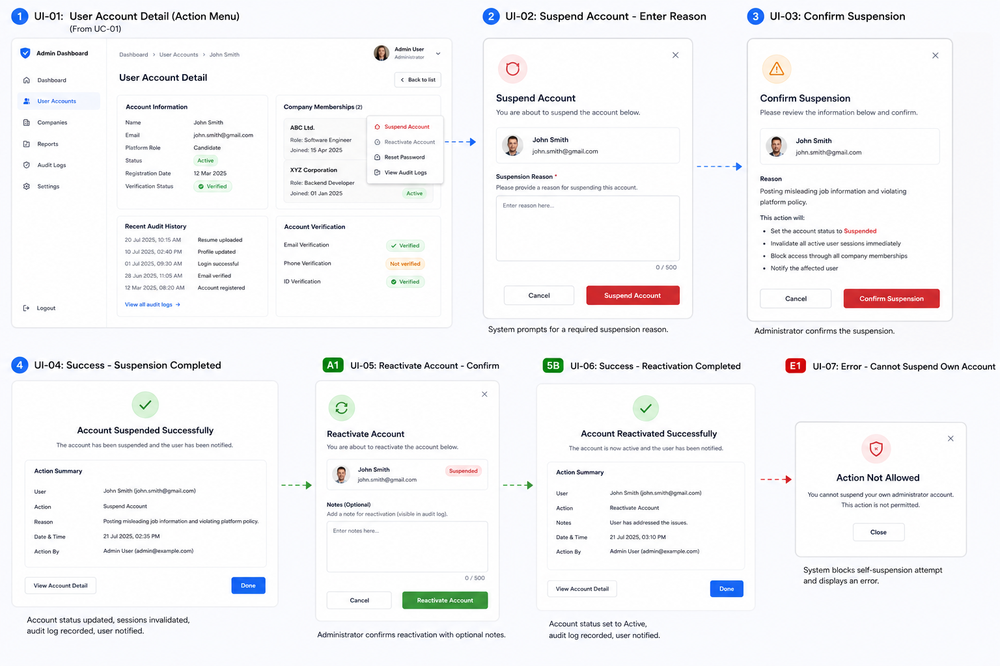

---

# UC-MOD-01 — Review Submitted Job Posting

## Use-Case Information

| Field | Value |
|---|---|
| Use-Case ID | UC-MOD-01 |
| Primary Actor | Platform Administrator |
| Supporting Actor | None |
| Trigger | The administrator opens the job-posting moderation queue. |

## Brief Description

This use case allows a Platform Administrator to inspect a job posting submitted for moderation before it becomes publicly visible, checking its content against platform Content Moderation guidelines in preparation for an approve/reject/revision decision.

## Actors
- **Administrator** (primary)

## Preconditions

### Posting Awaiting Review
A job posting exists with status `Pending`, having been submitted for review by a company-authorized recruiter.

## Flow of Events

### Basic Flow

1. The use case begins when the Administrator opens the Job Posting Moderation Queue.
2. The System displays all `Pending` postings, sorted by submission date, showing job title, company, recruiter, and submission date.
3. The Administrator selects a posting to review.
4. The System displays the full posting: title, description, requirements, salary, and company information.
5. The Administrator reviews the content for spam, fraud, discriminatory language, MLM/illegal-activity indicators, and completeness, per platform Content Moderation guidelines.
6. The Administrator proceeds to record a decision. *(Continues in **UC-MOD-02 — Approve, Reject, or Request Revision**.)*
7. The use case ends.

## Alternative Flows

### A1 — Flag for Escalated Review

At Basic Flow step 5, if the Administrator is uncertain and wants a second opinion:

1. The Administrator marks the posting for escalation and adds an internal note visible only to Administrators.
2. The System keeps the posting status as `Pending`.
3. The use case ends.

## Special Requirements

### Public Invisibility
The posting must remain invisible on the public Job Board and unsearchable while `Pending`.

### Performance
The moderation queue should meet the dashboard-navigation performance target.

## Postconditions

### Success End Condition
The Administrator has reviewed the posting content; the posting status is unchanged (`Pending`) pending a decision, or is flagged for escalated review.

## Related Use Cases and Entry Points

### Approve, Reject, or Request Revision
After the posting has been reviewed, the administrator may start **UC-MOD-02 — Approve, Reject, or Request Revision**.

## Prototype Evidence

   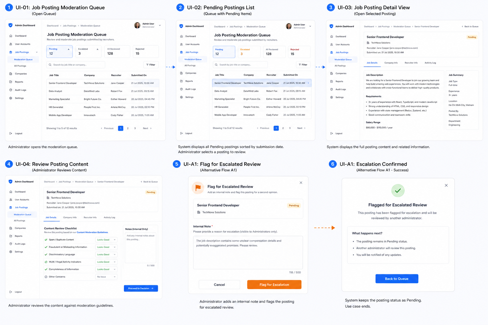

---

# UC-MOD-02 — Approve, Reject, or Request Revision

## Use-Case Information

| Field | Value |
|---|---|
| Use-Case ID | UC-MOD-02 |
| Primary Actor | Platform Administrator |
| Supporting Actor | None |
| Trigger | The administrator selects a reviewed posting and records a decision. |

## Brief Description

This use case allows a Platform Administrator to finalize a moderation decision on a `Pending` job posting — approving it for publication, rejecting it with feedback, or requesting specific revisions — following the Job Post Lifecycle.

## Actors
- Administrator
- Recruiter

## Preconditions

### Posting Reviewed
The job posting has status `Pending` and has typically been reviewed via UC-MOD-01.

## Flow of Events

### Basic Flow — Approve

1. The use case begins when the Administrator, having reviewed a `Pending` posting, selects "Approve."
2. The System sets the posting status to `Active`, publishes it to the public Job Board, and makes it searchable.
3. The System logs the approval (Administrator, timestamp) to the audit log.
4. The System notifies the Recruiter that the posting is live.
5. The use case ends.

## Alternative Flows

### A1 — Reject with Feedback

1. The Administrator selects "Reject."
2. The System requires the Administrator to enter a rejection reason.
3. The Administrator submits the reason.
4. The System sets the posting status back to `Draft` and records the rejection reason.
5. The System logs the decision to the audit log.
6. The System sends an automated email and in-app notification to the Recruiter explaining the rejection.
7. The use case ends.

### A2 — Request Revision

1. The Administrator selects "Request Revision" and enters specific requested changes.
2. The System returns the posting to `Draft` status with the Administrator's notes attached.
3. The System logs the request and notifies the Recruiter of the required changes.
4. The use case ends. The Recruiter must edit and resubmit the posting (Job Posting Management) to re-enter the `Pending` queue.

## Special Requirements

### Recorded Reasons
Rejection and revision requests must include a recorded reason.

### Lifecycle Conformance
Status transitions must strictly follow the Job Post Lifecycle: `Draft → Pending → Active → Closed`, with rejection returning `Pending → Draft`.

### Auditability and Timing
All decisions must be logged and notifications enqueued within 5 seconds.

## Postconditions

### Success End Condition (Approve)
The posting is `Active`, published, and searchable; the Recruiter is notified.

### Success End Condition (Reject/Revision)
The posting returns to `Draft` with recorded feedback; it remains unpublished; the Recruiter is notified.

## Prototype Evidence

1.
   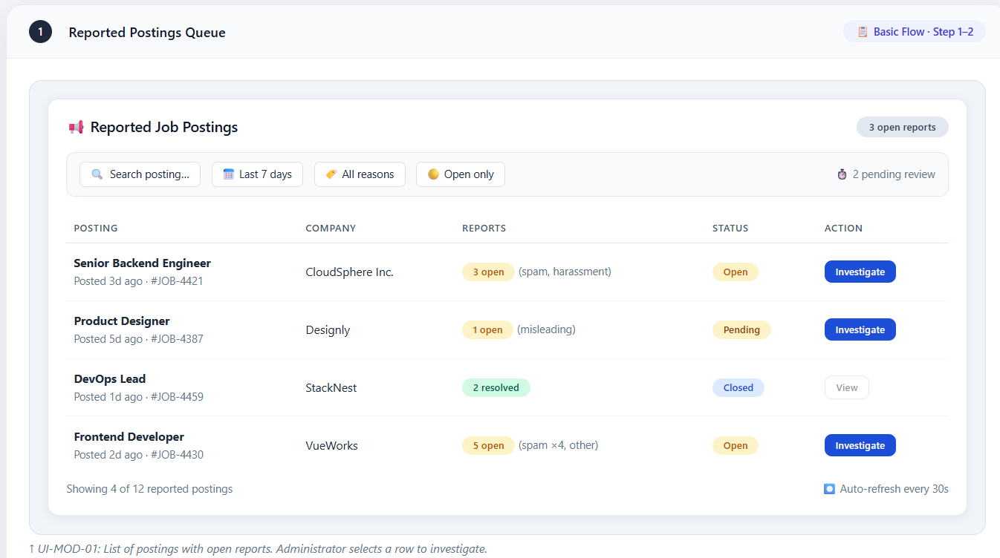

2.
   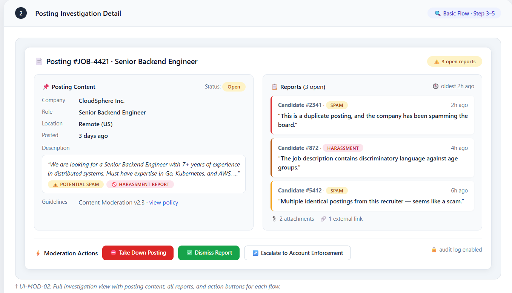

3.
   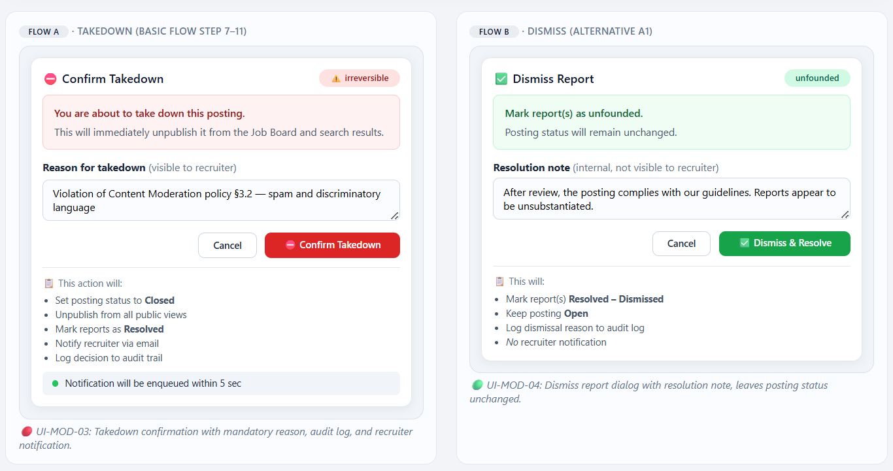

4.
   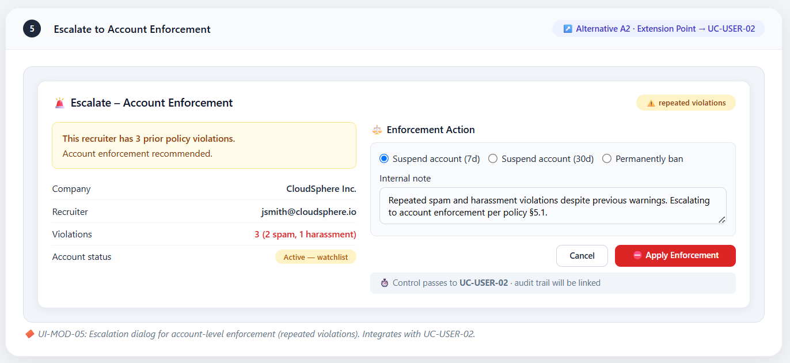

---

# UC-MOD-03 — Investigate Job Report

## Use-Case Information

| Field | Value |
|---|---|
| Use-Case ID | UC-MOD-03 |
| Primary Actor | Platform Administrator |
| Supporting Actor | None |
| Trigger | The administrator opens an unresolved job report. |

## Brief Description

This use case allows a Platform Administrator to review spam/abuse reports filed against a job posting, determine whether the posting violates platform policy, and either take the posting down immediately or dismiss the report as unfounded.

## Actors
- Platform Administrator
- Recruiter
- Candidate(s)

## Preconditions

### Open Report Exists
At least one Spam/Abuse report exists in `Open` status against the job posting.

## Flow of Events

### Basic Flow — Take Down Posting

1. The use case begins when the Administrator opens the Reported Job Postings queue.
2. The System displays postings with open reports, showing report count, reasons, and posting status.
3. The Administrator selects a reported posting to investigate.
4. The System displays the full posting content along with all associated report entries (reason category, comments, timestamps).
5. The Administrator reviews the posting and reports against platform Content Moderation guidelines.
6. The Administrator determines the report is valid.
7. The Administrator selects "Take Down Posting."
8. The System immediately sets the posting status to `Closed` and unpublishes it from the Job Board and search results.
9. The System logs the takedown decision, associated report IDs, and reason to the audit log.
10. The System notifies the Recruiter/company of the takedown and the policy-violation reason.
11. The System marks the associated reports as `Resolved`.
12. The use case ends.

## Alternative Flows

### A1 — Dismiss Report as Invalid

At Basic Flow step 6, if the Administrator determines the report is unfounded:

1. The Administrator selects "Dismiss Report" and enters a brief resolution note.
2. The System marks the report(s) `Resolved – Dismissed` without changing the posting status.
3. The System logs the dismissal to the audit log.
4. The use case ends.

### A2 — Escalate to Account Enforcement

At Basic Flow step 6, if the violation warrants action against the responsible recruiter or company (e.g., repeated violations):

1. The Administrator proceeds to **UC-USER-02 — Apply Account Enforcement Action** in addition to taking down the posting.
2. The flow resumes at Basic Flow step 8.

## Special Requirements

### Immediate Unpublication
A takedown must immediately remove the posting from all public views and search results.

### Auditability and Timing
All report-handling decisions must be logged, and Recruiter notifications enqueued within 5 seconds.

## Postconditions

### Success End Condition (Take Down)
The posting is `Closed`/unpublished; associated reports are `Resolved`; the Recruiter is notified; the audit log is updated.

### Success End Condition (Dismiss)
Reports are marked `Resolved – Dismissed`; the posting status is unchanged.

## Related Use Cases and Entry Points

### Apply Account Enforcement Action
At Alternative Flow A2, the administrator may start **UC-USER-02 — Apply Account Enforcement Action** for the responsible account.

## Prototype Evidence

1.
   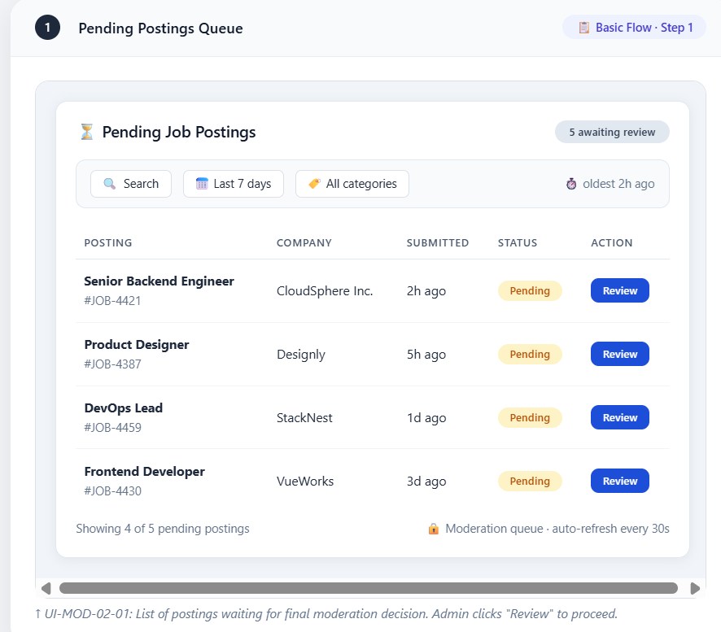

2.
   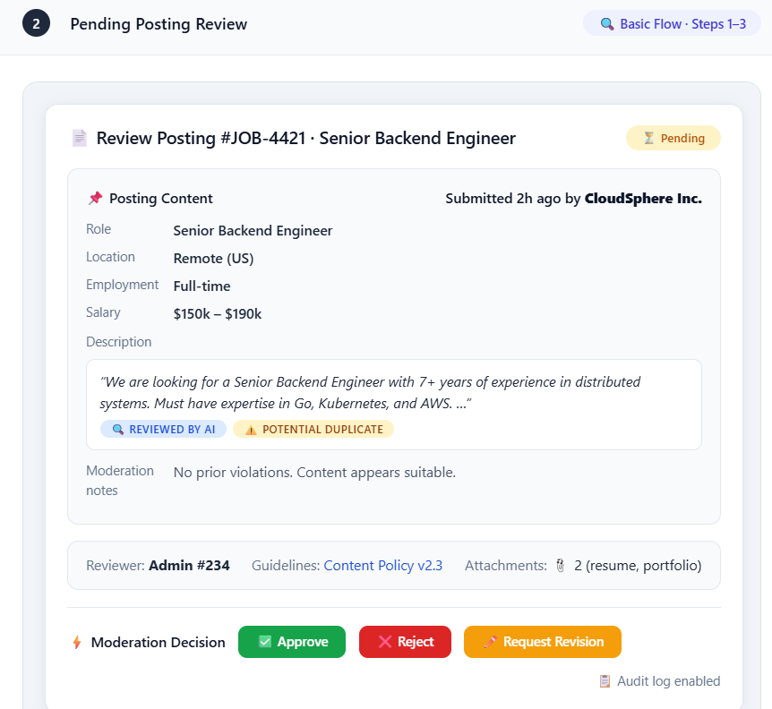

3.
   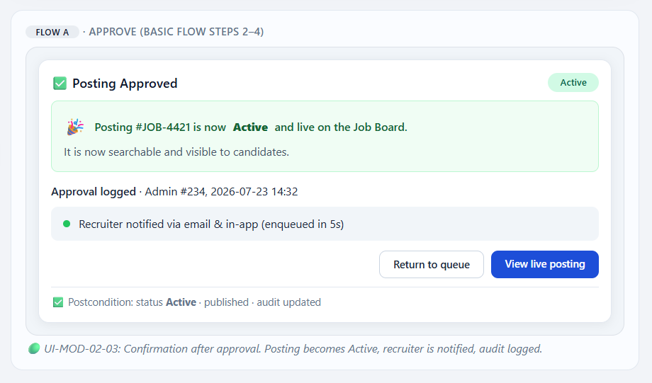

4.
   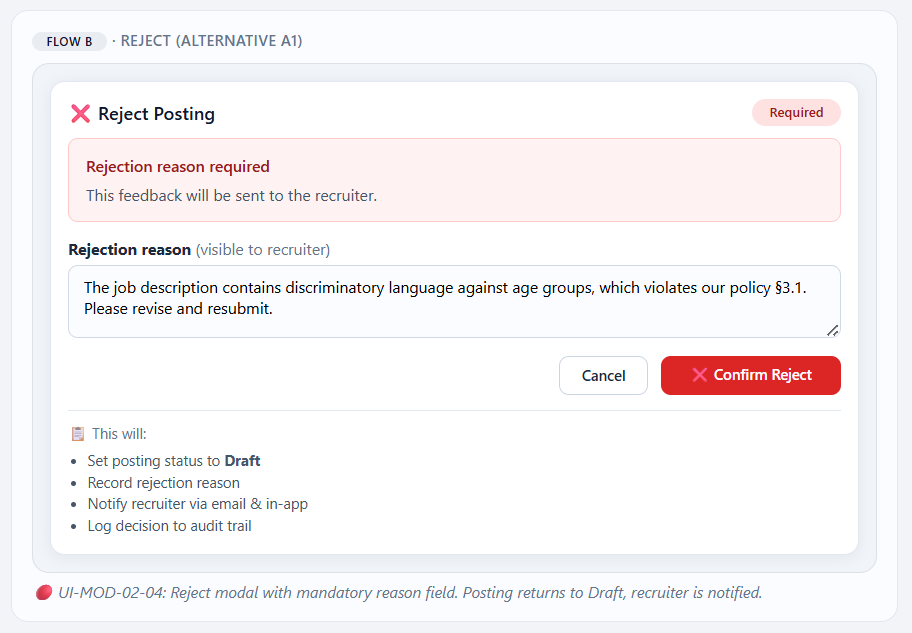

5.
   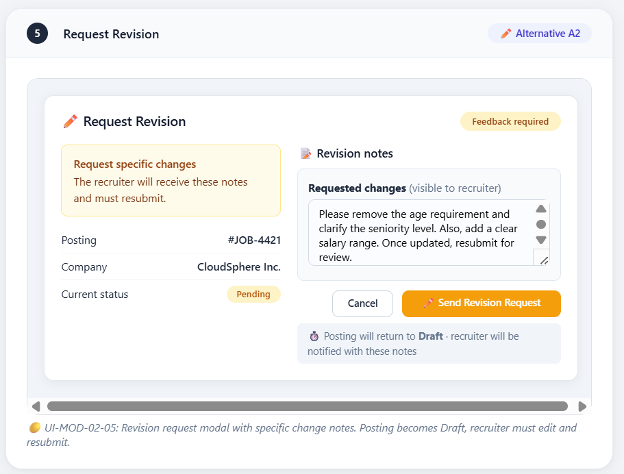
