# DGM-05 — Use-Case Specification: Supporting Services and Analytics

*Performed by: Lưu Chí Hải | Reviewed by: Nguyễn Gia Quốc Uy | Edited by: Lưu Chí Hải*

**Version:** V1.3 (06/08/2026) — Actor hierarchy, conditional relationships, and editorial pass revised

## 1. Use-Case Diagram

*Below is the static render of the diagram for PDF. The Mermaid source is included below for reference.*

## 2. Mermaid Source Code

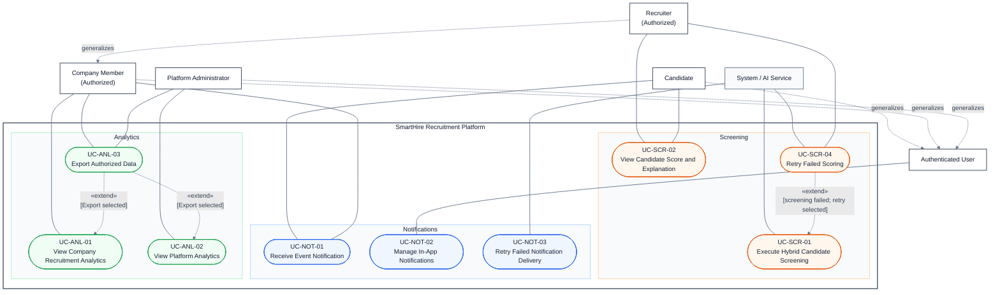

The arrows labelled `generalizes` point from each specialized actor to its parent. UC-SCR-04 is a conditional retry at the failed-result extension point. UC-NOT-03 is a separate automated recovery process. UC-ANL-03 is optional export only when the actor selects **Export**.

## 3. Traceability Summary

| Use Case ID | Use Case Name | Actor(s) | Covered Requirements |
| :--- | :--- | :--- | :--- |
| UC-SCR-01 | Execute Hybrid Candidate Screening | System / AI Service | FR-SCR-01 to FR-SCR-08 |
| UC-SCR-02 | View Candidate Score and Explanation | Recruiter, Candidate | FR-SCR-08, FR-SCR-09, FR-SCR-11, FR-SCR-13 |
| UC-SCR-04 | Retry Failed Scoring | Authorized Recruiter, System | FR-SCR-12 |
| UC-NOT-01 | Receive Event Notification | Candidate, Company Member | FR-NOT-01 to FR-NOT-03 |
| UC-NOT-02 | Manage In-App Notifications | Authenticated User | FR-NOT-04 to FR-NOT-06 |
| UC-NOT-03 | Retry Failed Notification Delivery | System | FR-NOT-07, FR-NOT-08 |
| UC-ANL-01 | View Company Recruitment Analytics | Authorized Company Member | FR-ANL-01, FR-ANL-02, FR-ANL-04, FR-ANL-07 |
| UC-ANL-02 | View Platform Analytics | Platform Administrator | FR-ANL-03, FR-ANL-04, FR-ANL-07 |
| UC-ANL-03 | Export Authorized Data | Authorized User (Company Member or Platform Administrator) | FR-ANL-05 to FR-ANL-07 |

---

## 4. Use Case Specifications

### 4.1. UC-SCR-01: Execute Hybrid Candidate Screening

*   **Use-case ID:** UC-SCR-01
*   **Use-case Name:** Execute Hybrid Candidate Screening
*   **Actor(s):** System / AI Service
*   **Description:** The system automatically initiates and executes a hybrid evaluation process (deterministic matching and AI semantic evaluation) asynchronously after a candidate successfully submits a job application.
*   **Preconditions:** A valid job application has been successfully submitted and normalized CV data is available.
*   **Basic Flow:**
    1.  **System** detects a newly submitted application.
    2.  **System** updates the screening status to `Processing`.
    3.  **System** calculates the deterministic matching score based on structured requirements.
    4.  **System** triggers the **AI Service** to perform semantic evaluation on the candidate's CV.
    5.  **AI Service** returns the AI score and a human-readable explanation.
    6.  **System** calculates the final blended score and classification (High/Moderate/Low Match).
    7.  **System** updates the application screening status to `Completed`.
*   **Alternative Flows:**
    *   **AF-01: AI Scoring Failure (at Step 5):**
        1.  If the **AI Service** fails to respond or returns an error, the **System** sets the screening status to `Failed`.
        2.  **System** logs the error for a manual retry (via UC-SCR-04).
*   **Postconditions:** The application has a finalized hybrid score or is marked as failed.
*   **Special Requirements:** Processing time should ideally not exceed 30 seconds to maintain real-time responsiveness for recruiters viewing newly submitted applications.

**Prototype Evidence:**
*   Basic Flow (Processing): 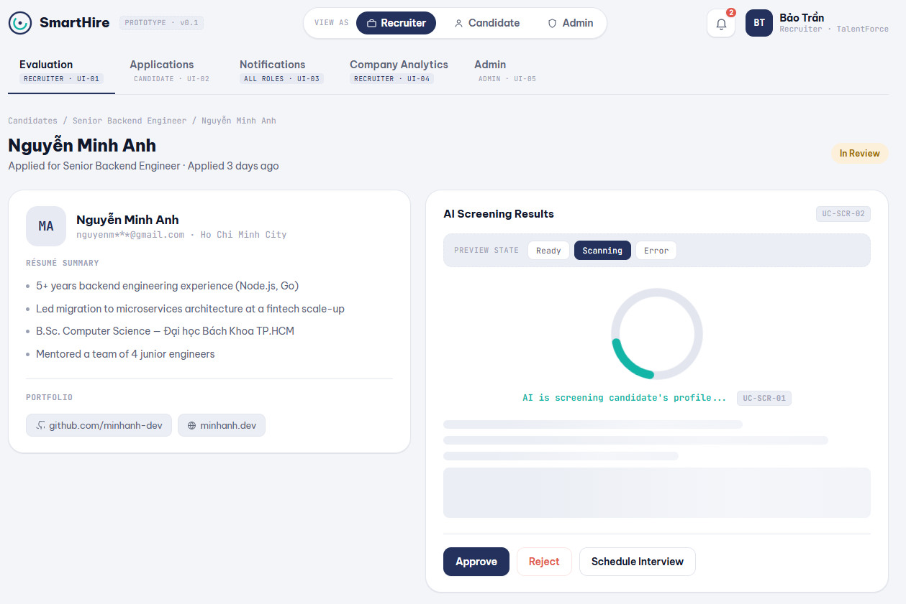
*   Basic Flow (Completed): 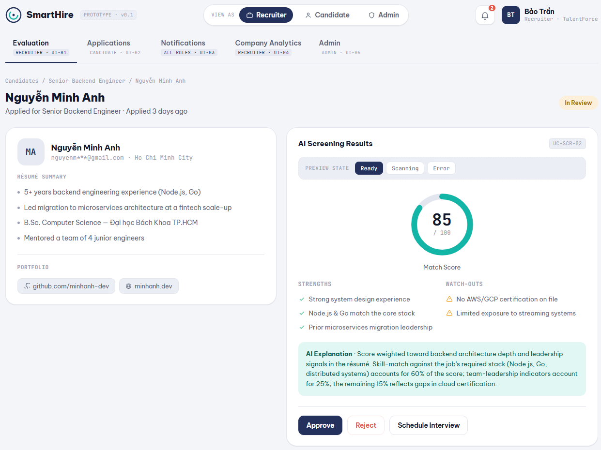
*   AF-01 (Failed): 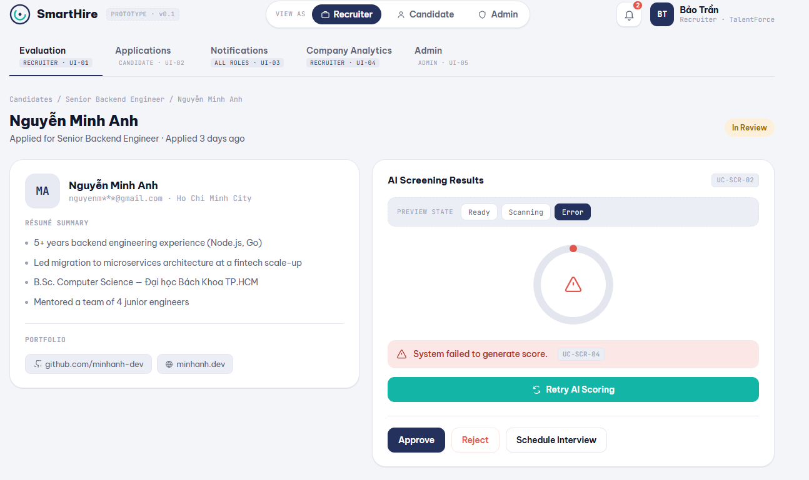

---

### 4.2. UC-SCR-02: View Candidate Score and Explanation

*   **Use-case ID:** UC-SCR-02
*   **Use-case Name:** View Candidate Score and Explanation
*   **Actor(s):** Recruiter (Authorized), Candidate
*   **Description:** Allows an authorized recruiter to view the full screening score and AI-generated explanation, while allowing the candidate to view limited, non-confidential screening progress. Candidate views must never expose confidential scores or recruiter-only explanations.
*   **Preconditions:** The actor is authenticated. For the recruiter view, a completed screening result exists; the candidate view may show `Processing` or `Completed` status.
*   **Basic Flow (Recruiter View):**
    1.  **Recruiter** navigates to the application detail view for a specific candidate.
    2.  **System** verifies company ownership and permissions.
    3.  **System** retrieves and displays the detailed hybrid score, gauge chart, and AI explanation (Strengths/Watch-outs).
*   **Alternative Flows:**
    *   **AF-01: Candidate View (at Step 2):**
        1.  If the actor is the **Candidate**, the **System** hides the detailed score ring and AI notes.
        2.  **System** displays a general, candidate-friendly status (e.g., "Your application is being evaluated").
*   **Postconditions:** The actor views the score details corresponding to their role permissions.
*   **Special Requirements:** None.

**Related Use Cases and Entry Points:** UC-SCR-01 starts asynchronously after application submission. UC-SCR-04 may be started when a recruiter sees a failed result.

**Prototype Evidence:**
*   Basic Flow (Recruiter): 
*   AF-01 (Candidate View): 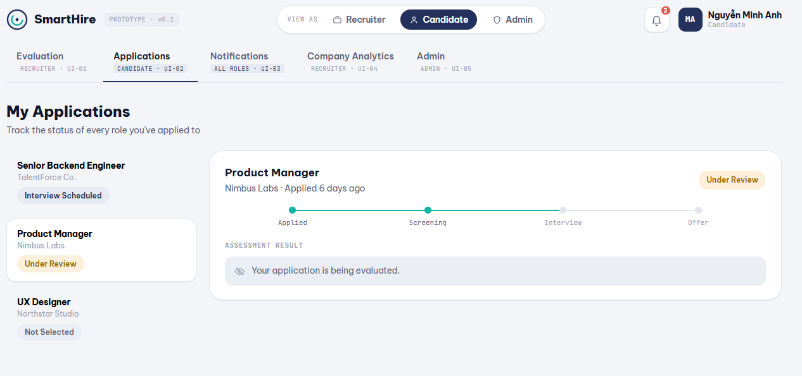

---

### 4.3. UC-SCR-04: Retry Failed Scoring

*   **Use-case ID:** UC-SCR-04
*   **Use-case Name:** Retry Failed Scoring
*   **Actor(s):** Recruiter (Authorized), System
*   **Description:** Allows a recruiter or the System to retry the hybrid scoring process for an application that previously encountered an AI service failure, without changing the application's overall recruitment stage.
*   **Preconditions:** The application has a screening status of `Failed`.
*   **Basic Flow:**
    1.  **Recruiter** views an application with a failed scoring status and clicks "Retry AI Scoring".
    2.  **System** confirms the action and changes the status back to `Processing`.
    3.  **System** re-triggers UC-SCR-01.
    4.  **System** displays a progress toast notification to the user.
*   **Alternative Flows:**
    *   **AF-01: Retry Fails Again (at Step 3):**
        1.  If the system fails again, it reverts the status to `Failed` and notifies the recruiter.
*   **Postconditions:** The screening process is successfully restarted, or the application remains in the authoritative `Failed` state after another failure.
*   **Special Requirements:** None.

**Related Use Cases and Entry Points:** This is an optional recovery action at the `Failed` screening-result state; it is not a mandatory step in viewing a score.

**Prototype Evidence:**
*   Basic Flow (Error visible): 
*   Basic Flow (Retry in progress): 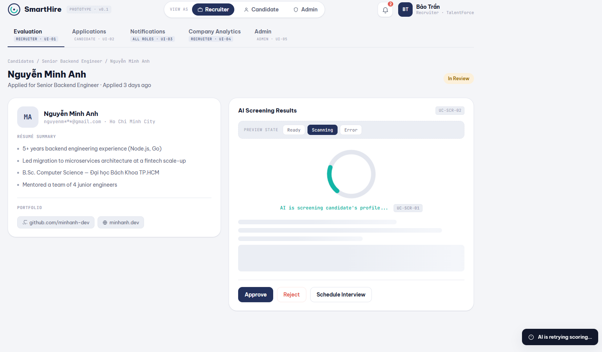

---

### 4.4. UC-NOT-01: Receive Event Notification

*   **Use-case ID:** UC-NOT-01
*   **Use-case Name:** Receive Event Notification
*   **Actor(s):** Candidate, Company Member (Authorized)
*   **Description:** Delivers system-generated in-app notifications to relevant actors when recruitment, verification, or account events occur.
*   **Preconditions:** A trigger event has occurred (e.g., application stage change, moderation decision).
*   **Basic Flow:**
    1.  **System** generates a notification payload based on the event.
    2.  **System** delivers an in-app alert (e.g., toast notification or dropdown update) to the active session of the recipient.
    3.  **Actor** views the newly surfaced alert indicator on their interface.
*   **Alternative Flows:** None.
*   **Postconditions:** The notification is delivered and added to the user's unread list.
*   **Special Requirements:** In-app notifications must be delivered to active user sessions in near real-time (e.g., via WebSocket). Email delivery is outside the scope of this UC and is handled by the platform's notification infrastructure.

**Related Use Cases and Entry Points:** A failed external delivery attempt may start UC-NOT-03 as a separate system process.

**Prototype Evidence:**
*   Basic Flow (Dropdown Alert): 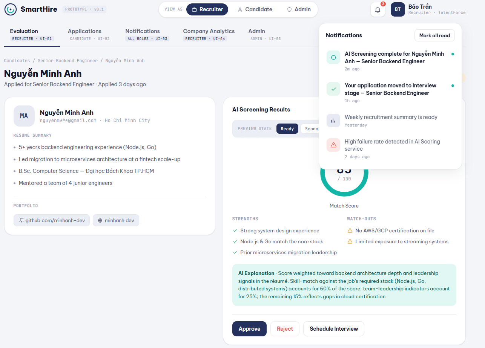
*   Basic Flow (Toast Alert): 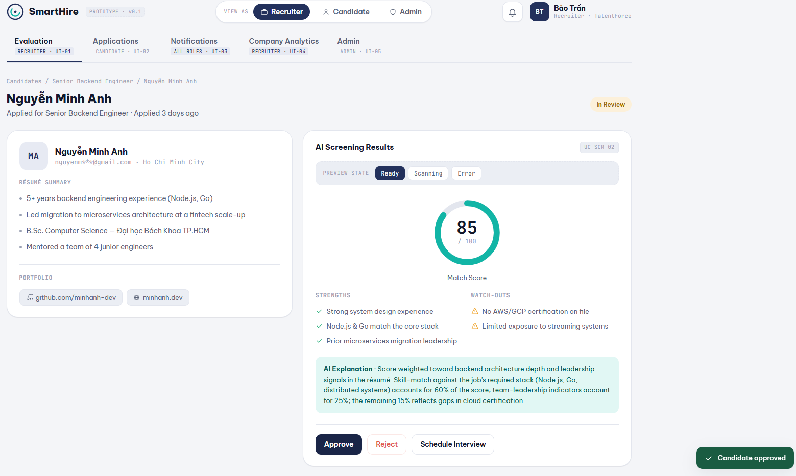

---

### 4.5. UC-NOT-02: Manage In-App Notifications

*   **Use-case ID:** UC-NOT-02
*   **Use-case Name:** Manage In-App Notifications
*   **Actor(s):** Authenticated User
*   **Description:** Allows users to view their notification list, distinguish between read and unread items, and mark notifications as read.
*   **Preconditions:** The user is logged in.
*   **Basic Flow:**
    1.  **Authenticated User** navigates to the Notifications tab.
    2.  **System** retrieves the user's notification history.
    3.  **System** displays the list, highlighting unread notifications with a visual indicator.
    4.  **User** clicks "Mark all as read".
    5.  **System** updates the status of all notifications to read and removes the visual indicators.
*   **Alternative Flows:**
    *   **AF-01: Empty State (at Step 2):**
        1.  If the user has no notifications, the **System** displays an empty state message ("You're all caught up!").
*   **Postconditions:** The notification statuses are updated in the database.
*   **Special Requirements:** None.

**Related Use Cases and Entry Points:** UC-NOT-02 may be opened from the notification indicator displayed by UC-NOT-01.

**Prototype Evidence:**
*   Basic Flow (List with Unread status): 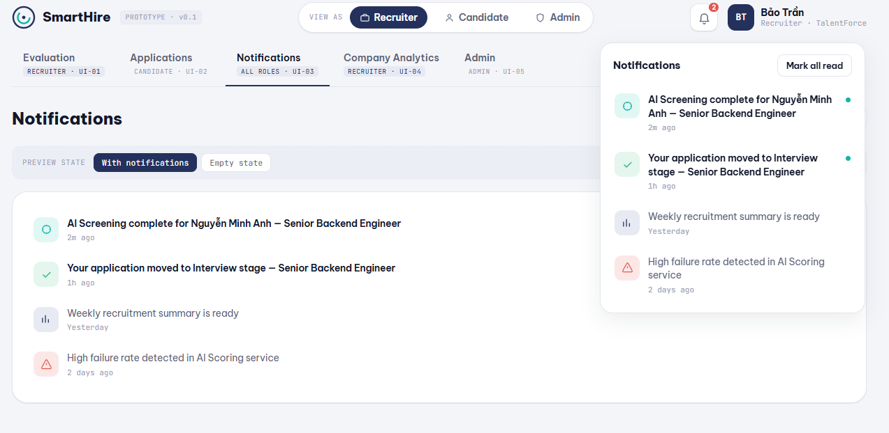
*   AF-01 (Empty State): 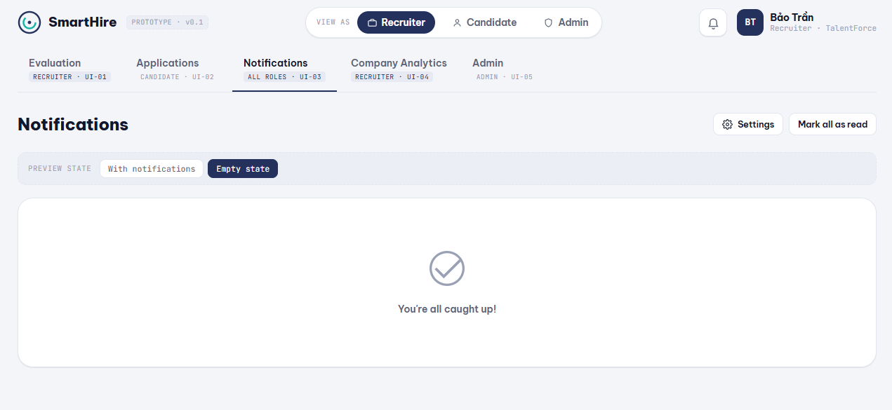

---

### 4.6. UC-NOT-03: Retry Failed Notification Delivery

*   **Use-case ID:** UC-NOT-03
*   **Use-case Name:** Retry Failed Notification Delivery
*   **Actor(s):** System
*   **Description:** The system automatically logs failed external notification attempts (e.g., email delivery failures) and retries them according to a configured schedule.
*   **Preconditions:** A notification delivery attempt has failed.
*   **Basic Flow:**
    1.  **System** detects a failed delivery attempt to an external channel.
    2.  **System** logs the failure and increments the retry counter.
    3.  **System** pauses for the configured delay, then re-attempts delivery.
    4.  **System** updates aggregate analytics regarding delivery success/failure rates.
*   **Alternative Flows:** None (internal system process).
*   **Postconditions:** The notification is either delivered successfully or logged as permanently failed after max retries.
*   **Special Requirements:** Retry mechanism should implement exponential backoff to avoid overloading external email services.

**Related Use Cases and Entry Points:** UC-NOT-03 is started by a delivery failure and is not a sub-step of the recipient's notification view.

**Prototype Evidence:**
*   Basic Flow (System recording failure metrics): 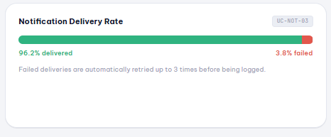

---

### 4.7. UC-ANL-01: View Company Recruitment Analytics

*   **Use-case ID:** UC-ANL-01
*   **Use-case Name:** View Company Recruitment Analytics
*   **Actor(s):** Company Member (Authorized)
*   **Description:** Allows an authorized company member to view aggregated recruitment metrics (e.g., time-to-hire, source of hire, hiring funnel) scoped strictly to their active company.
*   **Preconditions:** The user is authenticated and holds the required company-scoped permissions.
*   **Basic Flow:**
    1.  **Company Member** navigates to the Company Analytics dashboard.
    2.  **System** validates the user's company membership role.
    3.  **System** retrieves aggregated recruitment data for the active company context.
    4.  **System** renders the metrics, charts (donut, funnel), and trends on the dashboard.
*   **Alternative Flows:**
    *   **AF-01: Insufficient Data (at Step 3):**
        1.  If there is not enough historical data to generate meaningful analytics, the **System** displays a "Not enough data" empty state.
    *   **AF-02: Permission Denied (at Step 2):**
        1.  If the user lacks the required role, the **System** disables analytical features and denies access to restricted actions.
*   **Postconditions:** The user views the dashboard populated with their company's data.
*   **Special Requirements:** None.

**Related Use Cases and Entry Points:** The actor may start UC-ANL-03 by selecting **Export** from the dashboard.

**Prototype Evidence:**
*   Basic Flow (Dashboard with data): 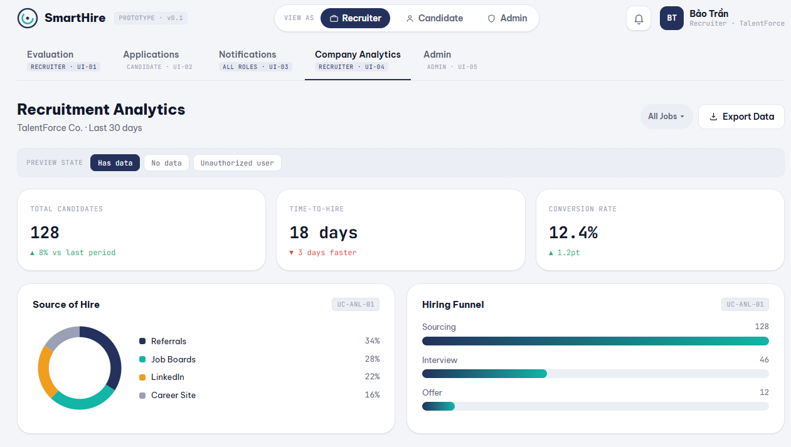
*   AF-01 (No Data): 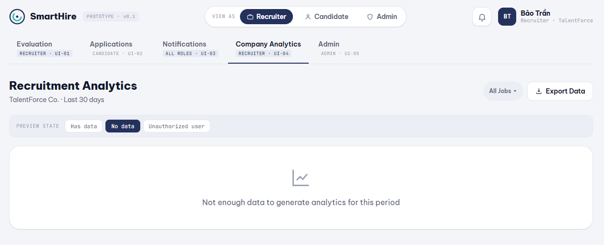
*   AF-02 (Unauthorized): 

---

### 4.8. UC-ANL-02: View Platform Analytics

*   **Use-case ID:** UC-ANL-02
*   **Use-case Name:** View Platform Analytics
*   **Actor(s):** Platform Administrator
*   **Description:** Allows a Platform Administrator to view global, platform-wide metrics including active companies, total AI screenings, system uptime, and aggregate revenue.
*   **Preconditions:** The user is authenticated as a Platform Administrator.
*   **Basic Flow:**
    1.  **Platform Administrator** navigates to the Admin Dashboard.
    2.  **System** verifies the administrator role.
    3.  **System** aggregates global platform data.
    4.  **System** displays traffic line charts, success/failure rate donuts, and top-level metric cards.
*   **Alternative Flows:**
    *   **AF-01: System Anomaly Detected (at Step 4):**
        1.  If the **System** detects abnormal failure rates (e.g., AI Scoring service disruption), it renders a high-priority warning banner at the top of the dashboard.
*   **Postconditions:** The administrator receives a comprehensive view of platform health and statistics.
*   **Special Requirements:** None.

**Related Use Cases and Entry Points:** The administrator may start UC-ANL-03 by selecting **Export** from the dashboard.

**Prototype Evidence:**
*   Basic Flow (Admin Dashboard): 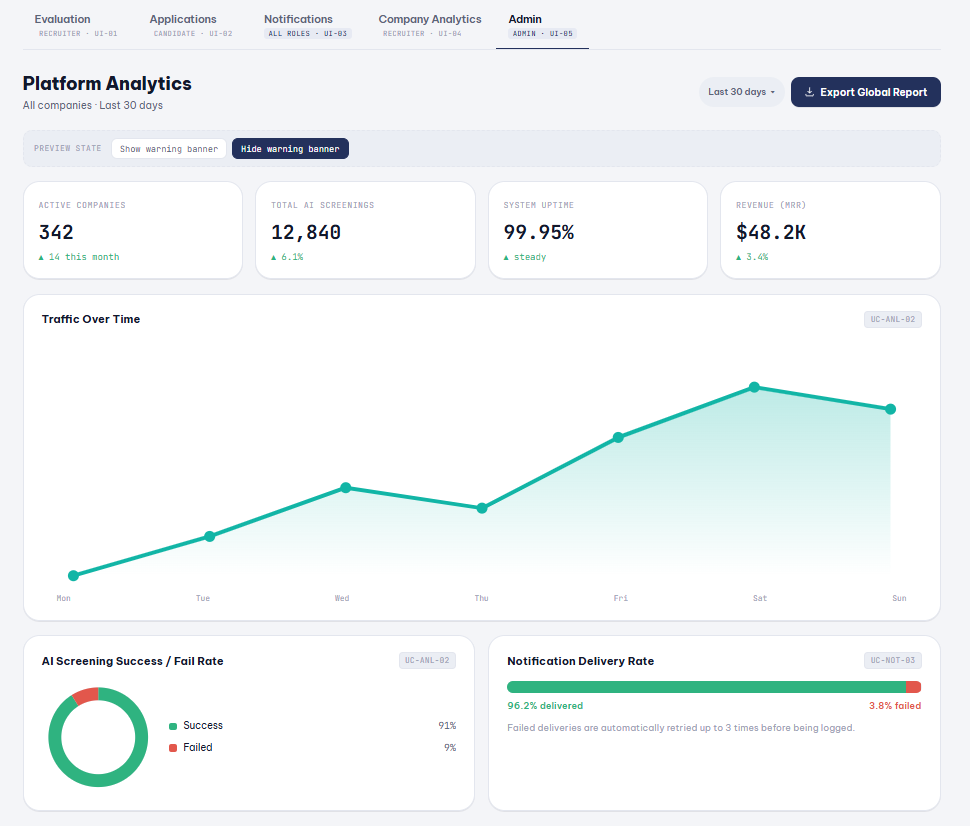
*   AF-01 (Warning Banner): 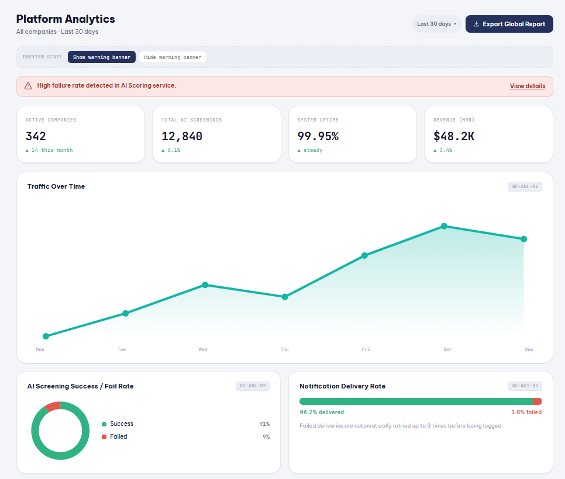

---

### 4.9. UC-ANL-03: Export Authorized Data

*   **Use-case ID:** UC-ANL-03
*   **Use-case Name:** Export Authorized Data
*   **Actor(s):** Authorized User (Company Member or Platform Administrator)
*   **Description:** Allows a user with the appropriate permissions to export filtered recruitment analytics or platform data into external formats (CSV or PDF).
*   **Preconditions:** The user is viewing an analytics dashboard and has export privileges.
*   **Basic Flow:**
    1.  **Authorized User (Company Member or Platform Administrator)** clicks the "Export Data" button on the dashboard.
    2.  **System** displays a dropdown menu with available format options (CSV, PDF).
    3.  **User** selects a format (e.g., CSV).
    4.  **System** compiles the authorized data payload and triggers the file download.
    5.  **System** displays a success toast notification.
*   **Alternative Flows:**
    *   **AF-01: Permission Denied (at Step 1):**
        1.  If the **System** determines the user lacks export privileges for the current context, the "Export Data" button is disabled and blocked from interaction.
*   **Postconditions:** A file containing the requested data is downloaded to the user's device.
*   **Special Requirements:** Exported documents (especially PDF) must adhere to the system's data privacy policies, ensuring sensitive PII is masked if the user's role requires it.

**Related Use Cases and Entry Points:** UC-ANL-03 is optional and starts only after the actor explicitly selects **Export** from UC-ANL-01 or UC-ANL-02.

**Prototype Evidence:**
*   Basic Flow (Format Menu): 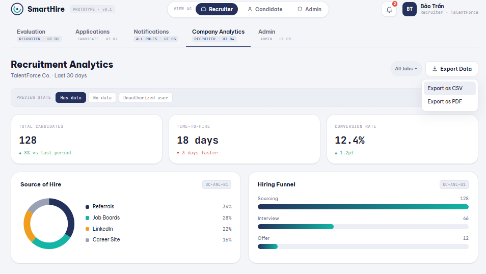
*   AF-01 (Disabled Button): 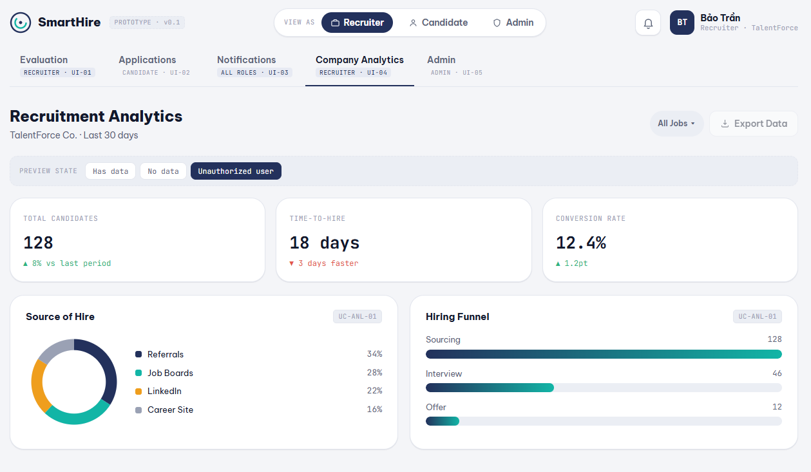
