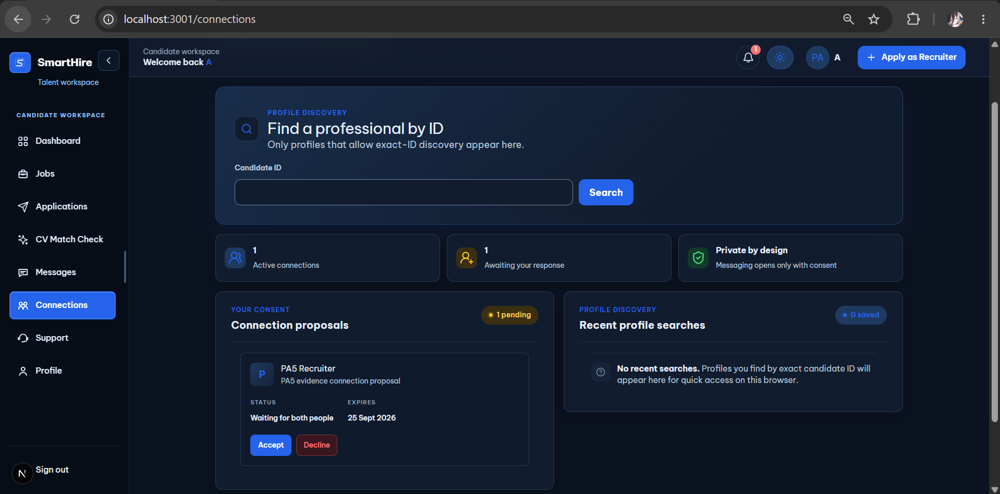
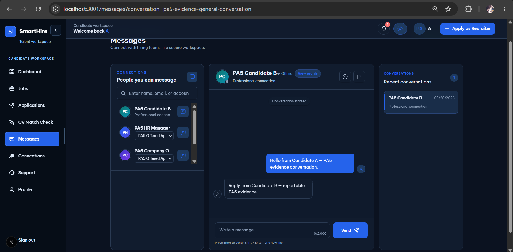
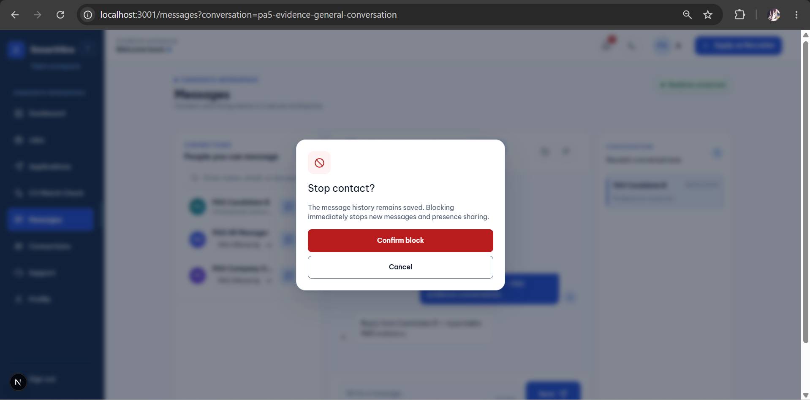
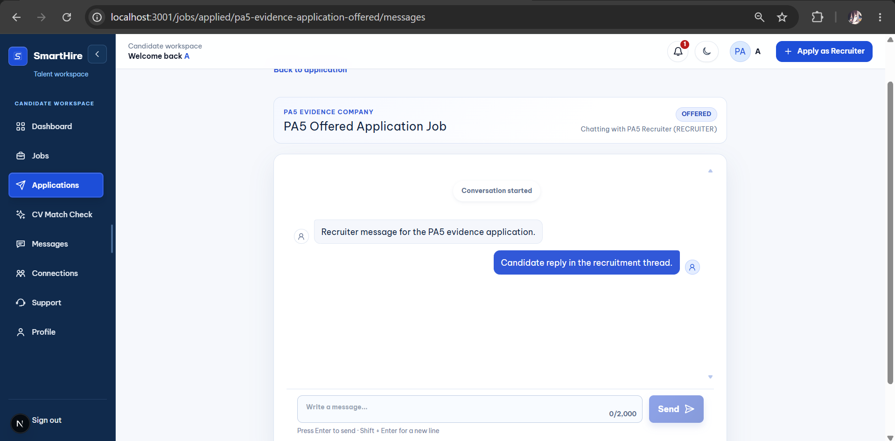
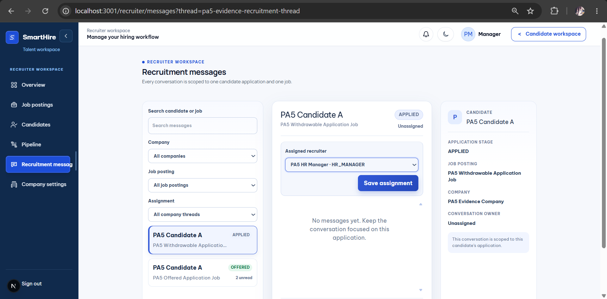
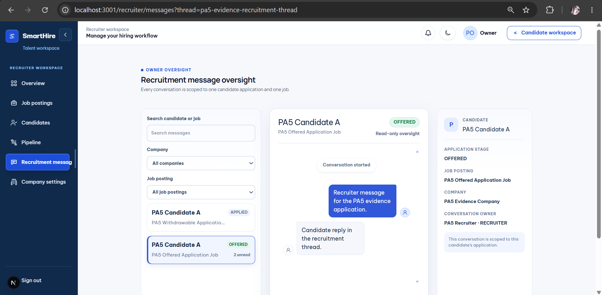
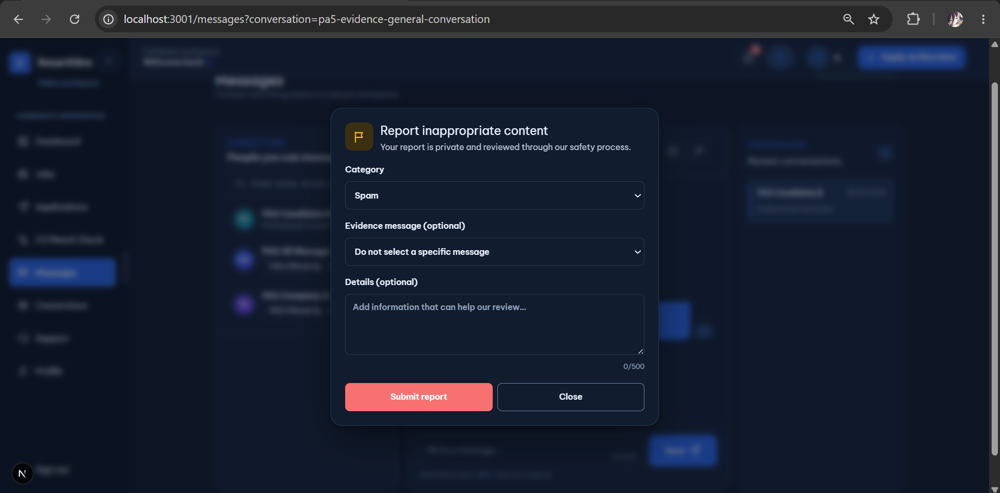
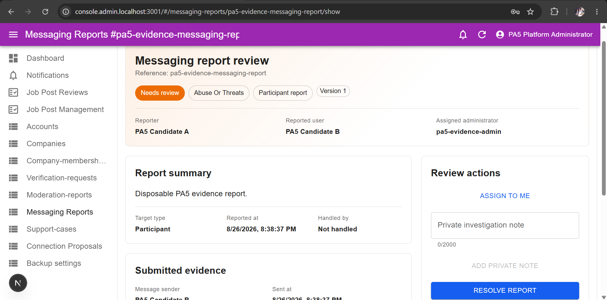
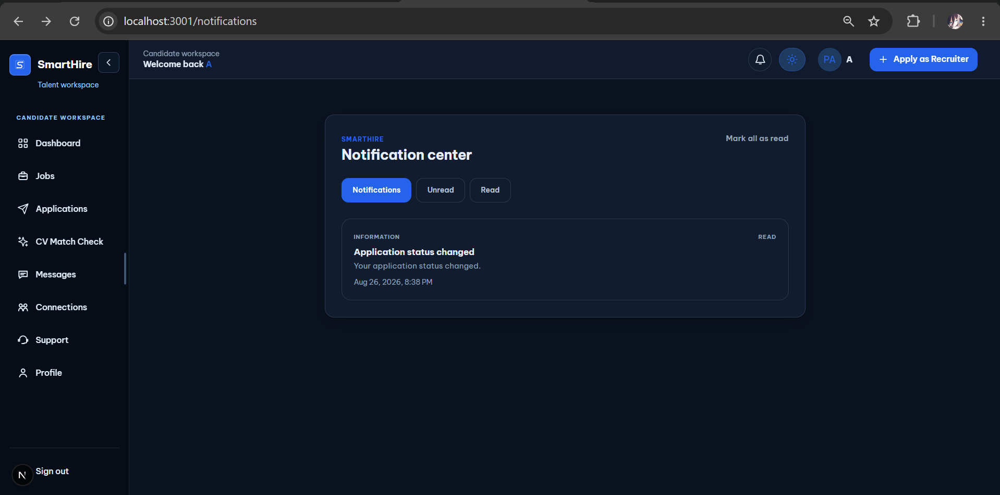
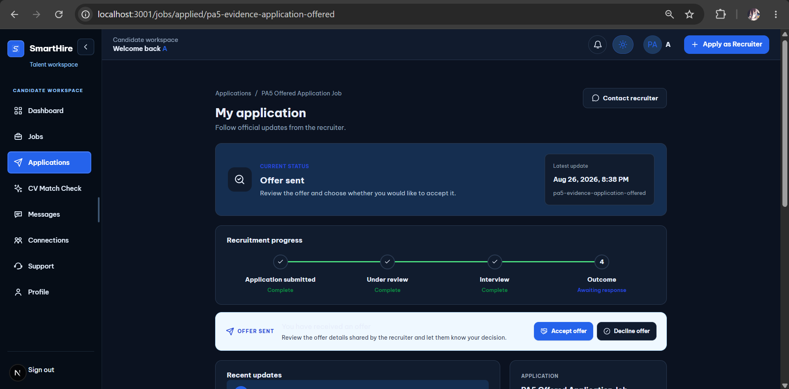

# DGM-05 — Use-Case Specification: Communications and Engagement

_Performed by: Lưu Chí Hải | Reviewed by: Pending Nguyễn Minh Khôi | Edited by: Lưu Chí Hải_

**Version:** V1.5 (2026-08-26)

## 1. Scope and common requirements

This specification corresponds to [diagram_05.md](../diagrams/diagram_05.md). Scoring moved to DGM-03; analytics/platform administration moved to Khôi-owned DGM-06. The filename is retained to preserve existing repository links.

All use cases require neutral authorization errors, tenant/application isolation where applicable, CSRF protection for browser mutations, bounded input, no secrets in client payloads, and auditable moderation/privileged actions. General messaging is realtime through Socket.IO with authoritative REST recovery; recruitment messaging uses REST and explicit refetch. F019 and F025 remain **In progress**.

## 2. Actor summary

| Actor                       | Responsibility in this domain                                                    |
| --------------------------- | -------------------------------------------------------------------------------- |
| Authenticated User          | Uses eligible general messaging and personal notifications.                      |
| Candidate                   | Decides connection proposals and participates in an eligible application thread. |
| Recruiter                   | Participates in an assigned/open recruitment thread for the company.             |
| HR Manager                  | Participates in and assigns company recruitment threads.                         |
| Company Owner               | Reads company recruitment threads for audited oversight; cannot send.            |
| Platform Administrator      | Reviews messaging reports with protected notes/actions.                          |
| Notification / Email Worker | Delivers queued events with retry/idempotency policy.                            |

## 3. Professional Connections

### 3.1. UC-CON-01 — Review and Decide a Connection Proposal

**Actors/description:** A Candidate reviews a proposal addressed to the account and explicitly accepts or declines it.

**Preconditions:** Authenticated recipient; proposal is visible, pending, unexpired, and within its authority version.

**Basic flow:** (1) Open `/connections`; (2) System returns recipient-scoped proposals; (3) Candidate reviews bounded profile/context; (4) chooses accept/decline; (5) System validates consent and version; (6) records decision/history and refreshes projection.

**Alternative/error flows:** Expired, revoked, already-decided, stale, or unauthorized proposals return the authoritative/neutral state; repeated commands do not duplicate a connection.

**Postconditions:** One consent decision is durably recorded; only acceptance creates/maintains connection eligibility.

**Special requirements/evidence:** Proposal details and history are participant/admin scoped. Evidence: connections UI/API/services, professional-connection schema models, consent lifecycle/security/E2E tests. Feature F011 is **Implemented and verified**.

### Real UI Evidence

*Figure — Real Connections workspace showing a pending proposal with **Accept** and **Decline** controls.*

### 3.2. UC-CON-02 — Manage Professional Connections

**Actors/description:** A Candidate lists accepted connections and disconnects when desired.

**Preconditions:** Authenticated participant in each returned connection.

**Basic flow:** (1) Open connections workspace; (2) System lists only the user's connections; (3) Candidate reviews a connection; (4) optionally confirms disconnect; (5) System records the transition and invalidates affected messaging eligibility.

**Alternative/error flows:** Empty list displays safely; repeated disconnect is idempotent; cross-user IDs and stale versions are rejected.

**Postconditions:** Connection remains active or is disconnected with consent/history preserved.

**Special requirements/evidence:** Disconnect must promptly invalidate connection-derived authority. Evidence: `connection-service.ts`, authority invalidation service, routes/schema, security/integration/frontend tests.

**Prototype/UI screenshot evidence:** **Prototype/UI screenshot evidence pending.** The current Candidate Connections UI exposes only the accepted-connection count; it does not render an accepted-connections list, connection-management action, or disconnect control. The repository contains no genuine prototype showing those controls. Do not treat the count-only Connections screenshot as evidence for this use case.

## 4. General Messaging

### 4.1. UC-MSG-01 — Start an Eligible Conversation

**Actors/description:** An Authenticated User starts a one-to-one text conversation with a participant returned by the eligibility service.

**Preconditions:** Valid session; professional-connection or permitted application eligibility; neither user blocks the other; no archived authority state.

**Basic flow:** (1) Open `/messages`; (2) search eligible participants; (3) select one/context; (4) System revalidates both IDs and eligibility; (5) creates or returns the unique conversation; (6) opens detail.

**Alternative/error flows:** No eligible participants shows an empty state; block/disconnect/application changes invalidate authority; concurrent create returns the unique existing conversation; arbitrary IDs are rejected neutrally.

**Postconditions:** One authorized conversation exists or no data changes.

**Special requirements/evidence:** No group chat or arbitrary attachments. Evidence: messaging eligibility/open-conversation services, messaging routes/schema, eligibility/security/integration/frontend tests. F008 is **Implemented and verified**.

### Real UI Evidence

*Figure — Real Messages workspace listing an eligible professional connection and its opened conversation.*

### 4.2. UC-MSG-02 — Exchange General Messages

**Actors/description:** Two authorized conversation participants exchange bounded text and manage read state.

**Preconditions:** Actor is a participant; conversation remains eligible and unblocked.

**Basic flow:** (1) Open conversation; (2) REST loads ordered history; (3) actor sends text with client operation ID; (4) server rechecks authority/rate limits, stores one sequenced message, and publishes Socket.IO event; (5) clients reconcile via REST and mark read.

**Alternative/error flows:** Duplicate operation returns one message; reconnect triggers authoritative refetch; blocked/ineligible/archived conversation becomes non-writable; invalid/oversized text is rejected.

**Postconditions:** Message and read sequence are durable, ordered, and visible only to participants.

**Special requirements/evidence:** Socket events are hints, not the authority; retention/deletion policy applies. Evidence: send/history/read services, `/api/messaging`, `web/server.ts` gateway, schema, contract/integration/E2E/performance tests.

### Real UI Evidence

*Figure — Real professional-connection conversation showing exchanged messages and the enabled message composer. It does not prove delivery/reconnect behavior.*

### 4.3. UC-MSG-03 — Block or Unblock a Participant

**Actors/description:** An Authenticated User blocks or unblocks another eligible participant.

**Preconditions:** Valid session; target is not the actor; current block state is authoritative.

**Basic flow:** (1) Actor opens safety controls; (2) confirms block/unblock; (3) System validates request and records/removes directed block; (4) messaging authority is invalidated; (5) UI refreshes.

**Alternative/error flows:** Repeated command is idempotent; unauthorized/arbitrary target or storage failure produces no false success.

**Postconditions:** Directed block state and message-send eligibility agree. Existing history remains protected by retention policy.

**Special requirements/evidence:** Blocking must take effect for REST and Socket writes. Evidence: block/unblock services, authority enforcement, block schema, safety/security/integration/frontend tests.

### Real UI Evidence

*Figure — Real SmartHire Messages workspace showing the **Stop contact?** confirmation dialog and the **Confirm block** action for an existing professional-connection conversation. The capture shows the proposed block action, not completion of the state change.*

## 5. Application-Scoped Recruitment Messaging

### 5.1. UC-RMSG-01 — Access Recruitment Thread

**Actors/description:** A Candidate, assigned Recruiter/HR Manager, permitted staff observer, or Company Owner opens the single thread bound to an application.

**Preconditions:** Candidate owns the application, or actor has active membership in its company with service-recognized access; thread/application exists.

**Basic flow:** (1) Open candidate application message page or recruiter inbox; (2) System authorizes candidate/company/application/assignment; (3) returns thread, bounded participants, state, history, and access kind; (4) UI shows writable or read-only controls accordingly.

**Alternative/error flows:** Candidate cannot access before the implemented staff-assignment condition; cross-company/cross-application ID is neutral; terminal/read-only thread hides composer; unassigned eligible staff may be observer-only.

**Postconditions:** Authorized thread is displayed without changing assignment/messages.

**Special requirements/evidence:** General `MessagingConversation` is not substituted for `RecruitmentThread`. Evidence: recruitment-messaging service/routes/UI/schema and contract tests. F025 is **In progress**.

### Real UI Evidence

*Figure — Real Candidate application-scoped thread showing the offered application context and authorized recruiter counterpart.*

### 5.2. UC-RMSG-02 — Exchange Recruitment Messages

**Actors/description:** The Candidate and authorized assigned Recruiter/HR Manager exchange text in an open application thread.

**Preconditions:** UC-RMSG-01 yields writable Candidate or assignee access; thread is `OPEN`.

**Basic flow:** (1) Load REST history; (2) actor submits bounded text/client operation ID; (3) System rechecks access/state; (4) stores one sequenced message and updates read/last-message projection; (5) UI refetches.

**Alternative/error flows:** Duplicate operation is idempotent; Owner/staff observer receives `READ_ONLY`; terminal thread rejects send; stale assignment or inactive membership invalidates staff write; failed write shows no false message.

**Postconditions:** One ordered message is stored or state remains unchanged.

**Special requirements/evidence:** Recruitment messaging is REST-only in current architecture and tenant/application isolated. Evidence: recruitment-message routes/service/schema/UI and contract tests.

### Real UI Evidence

*Figure — Real open recruitment thread showing recruiter and Candidate messages with the writable composer.*

### 5.3. UC-RMSG-03 — Assign Recruitment Thread

**Actors/description:** An HR Manager assigns an eligible active Recruiter/HR Manager membership to a company recruitment thread.

**Preconditions:** Actor has HR Manager authority in the thread company; target membership is active, company-matched, and in an allowed staff role.

**Basic flow:** (1) HR Manager opens thread assignment; (2) System lists eligible memberships; (3) actor selects assignee; (4) System validates scope/version and updates assignment; (5) audit/notification projections are updated.

**Alternative/error flows:** Invalid role/company/inactive member is rejected; concurrent reassignment returns conflict/current state; repeated assignment is idempotent.

**Postconditions:** Exactly one accountable assignee is recorded or prior assignment remains.

**Special requirements/evidence:** Owner oversight does not imply assignment authority. Evidence: recruitment-messaging assignment methods/routes, `assignedMembershipId` schema, authorization/contract tests.

### Real UI Evidence

*Figure — Real SmartHire HR Manager recruitment-messaging workspace showing the company thread, **Assigned recruiter** selector, and **Save assignment** action. The capture shows the assignment control without changing the existing assignee.*

### 5.4. UC-RMSG-04 — Review Thread as Company Owner

**Actors/description:** A Company Owner reads recruitment-thread content for an application in the owned company without becoming a participant.

**Preconditions:** Active Owner membership in the thread company; requested thread/application is company-scoped.

**Basic flow:** (1) Owner opens oversight list/detail; (2) System validates Owner/company scope; (3) records the implemented oversight audit; (4) displays history and assignment metadata with no composer.

**Alternative/error flows:** Cross-company/inactive membership is denied neutrally; missing thread returns neutral not-found; send/assignment/read-state mutations return `READ_ONLY`.

**Postconditions:** Oversight view is audited; no message, assignment, or participant read state changes.

**Special requirements/evidence:** Owner is read-only only here, not on DGM-03 pipeline operations. Evidence: recruiter oversight routes and `recruitment-messaging-service.ts` Owner branches/tests.

### Real UI Evidence

*Figure — Real Company Owner oversight view showing recruitment history and application context labelled **Read-only oversight**, with no composer.*

## 6. Messaging Safety

### 6.1. UC-RPT-01 — Report Messaging Evidence

**Actors/description:** A message/thread participant reports permitted general or recruitment-message evidence with a bounded reason.

**Preconditions:** Actor can access the referenced conversation/thread/message; evidence is eligible and not already consumed contrary to policy.

**Basic flow:** (1) Open report action; (2) select reason/add bounded detail; (3) System rechecks participant access; (4) snapshots permitted evidence and creates report; (5) returns safe confirmation.

**Alternative/error flows:** Invalid/cross-context evidence is denied; duplicate/conflicting submission does not create uncontrolled reports; persistence failure displays no false confirmation.

**Postconditions:** A participant-scoped report is queued for admin review or nothing changes.

**Special requirements/evidence:** Report evidence is immutable/bounded; admin private notes are never exposed to reporter. Evidence: messaging report services/routes/schema, contract/integration/security/UI tests. F013 is **Implemented and verified**.

### Real UI Evidence

*Figure — Real report dialog showing the category, optional evidence-message selector, bounded detail field, and explicit submit control.*

### 6.2. UC-RPT-02 — Review Messaging Report

**Actors/description:** A Platform Administrator reviews a messaging report, evidence, history, and protected notes and records an allowed disposition.

**Preconditions:** Active administrator grant/designated session; recent step-up where required; report exists.

**Basic flow:** (1) Open admin report resource; (2) System enforces admin boundary and returns bounded evidence/history; (3) administrator records note/action; (4) System validates expected version; (5) stores review event/audit and refreshes state.

**Alternative/error flows:** Stale version conflicts; absent step-up returns `STEP_UP_REQUIRED`; denied access is audited; unsupported action is rejected.

**Postconditions:** Review event is auditable and reporter-facing data excludes private notes.

**Special requirements/evidence:** Admin authority is platform scoped, not company membership. Evidence: admin report review service/routes/UI, report review/private-note schema, security/contract/integration/frontend tests.

### Real UI Evidence

*Figure — Real Platform Administrator messaging-report review showing pending state, participants, submitted evidence, and protected review-action panel.*

## 7. Notifications

### 7.1. UC-NOT-01 — Receive Event Notification

**Actors/description:** An eligible recipient receives an in-app notification and, for configured events, transactional email.

**Preconditions:** An implemented domain event identifies an eligible recipient and bounded payload.

**Basic flow:** (1) Domain service records event/outbox work transactionally; (2) worker claims work; (3) renders bounded template; (4) stores/fans out in-app record and attempts configured email; (5) records delivery status/idempotency.

**Alternative/error flows:** Email/provider failure is retried without rolling back business data; duplicate event key does not duplicate delivery; invalid recipient/context is suppressed safely.

**Postconditions:** Notification is durably available/attempted once or failure state is retained for retry.

**Special requirements/evidence:** Payloads exclude sensitive CV/message data; local capture is not an external provider. Evidence: notification/email services/workers/outbox/schema and notification tests. F016 is **Implemented and verified**.

**Prototype/UI screenshot evidence:** [Notification dropdown alert](../prototypes/DGM-05-Services-Analytics/UI_03_Dropdown_Alert.png) — existing prototype showing event notifications arriving in the user-visible notification dropdown.

### 7.2. UC-NOT-02 — Manage Notification Center

**Actors/description:** An Authenticated User lists personal notifications and marks one/context/all as read.

**Preconditions:** Valid session.

**Basic flow:** (1) Open `/notifications`; (2) System returns recipient-scoped paginated notifications and unread count; (3) actor opens or marks items read; (4) System performs idempotent recipient-scoped mutation; (5) badge/list converge.

**Alternative/error flows:** Empty inbox is valid; concurrent tabs converge to server state; cross-user IDs are denied neutrally; transient failure preserves unread state and offers retry.

**Postconditions:** Recipient read state is updated or unchanged after failure.

**Special requirements/evidence:** Keyboard/screen-reader access and bounded pagination are required. Evidence: notification UI/routes/service/repository/schema, accessibility/frontend/contract/integration/performance tests.

**Prototype/UI screenshot evidence:** [Notification Center with unread state](../prototypes/DGM-05-Services-Analytics/UI_03_List_Unread.png) — existing prototype showing the notification list, unread indicators, and mark-all-read control.

### 7.3. UC-NOT-03 — Follow Authorized Deep Link

**Actors/description:** A notification recipient follows a destination only after current context authorization is resolved.

**Preconditions:** Valid session; notification belongs to recipient; payload contains a supported bounded context reference.

**Basic flow:** (1) Actor opens notification; (2) System rechecks recipient ownership and context; (3) destination resolver computes the permitted route; (4) notification read state is reconciled; (5) UI navigates to the authorized target.

**Alternative/error flows:** Missing, expired, deleted, cross-company, reassigned, or unauthorized context resolves neutrally to `/notifications`; login may be required before resolution; no protected title/content is leaked in the fallback.

**Postconditions:** Actor reaches a currently authorized target or the safe notification center.

**Special requirements/evidence:** Authorization is evaluated at click time, not trusted from a stored URL. Evidence: `notification-destination-resolver.ts`, notification context-read routes/UI/tests. F019 remains **In progress** because final focused verification is incomplete.

### Real UI Evidence

*Figure — Real Notification Center showing the Candidate's application-status notification before navigation.*

*Figure — Real owned offered-application destination reached from the notification's supported application context. These images do not demonstrate the unauthorized/expired fallback.*

## 8. Traceability and Revision History

| Feature | Use Cases     | Status                   |
| ------: | ------------- | ------------------------ |
|    F008 | UC-MSG-01–03  | Implemented and verified |
|    F011 | UC-CON-01–02  | Implemented and verified |
|    F013 | UC-RPT-01–02  | Implemented and verified |
|    F016 | UC-NOT-01–02  | Implemented and verified |
|    F019 | UC-NOT-03     | In progress              |
|    F025 | UC-RMSG-01–04 | In progress              |

| Version | Date       | Editor      | Exact change                                                                                                                                                                            | Review                   |
| ------- | ---------- | ----------- | --------------------------------------------------------------------------------------------------------------------------------------------------------------------------------------- | ------------------------ |
| V1.3    | 2026-08-06 | Lưu Chí Hải | Revised prior supporting-services/analytics specification.                                                                                                                              | Nguyễn Gia Quốc Uy       |
| V1.4    | 2026-08-26 | Lưu Chí Hải | Replaced mixed scope with complete evidence-based communication, safety, notification, and recruitment-thread specifications; moved scoring/analytics to their correct logical domains. | Pending Nguyễn Minh Khôi |
| V1.5    | 2026-08-26 | Lưu Chí Hải | Linked valid notification prototypes for UC-NOT-01–02 and explicitly recorded missing screenshot evidence for the remaining PA5 communication use cases. | Pending Nguyễn Minh Khôi |
