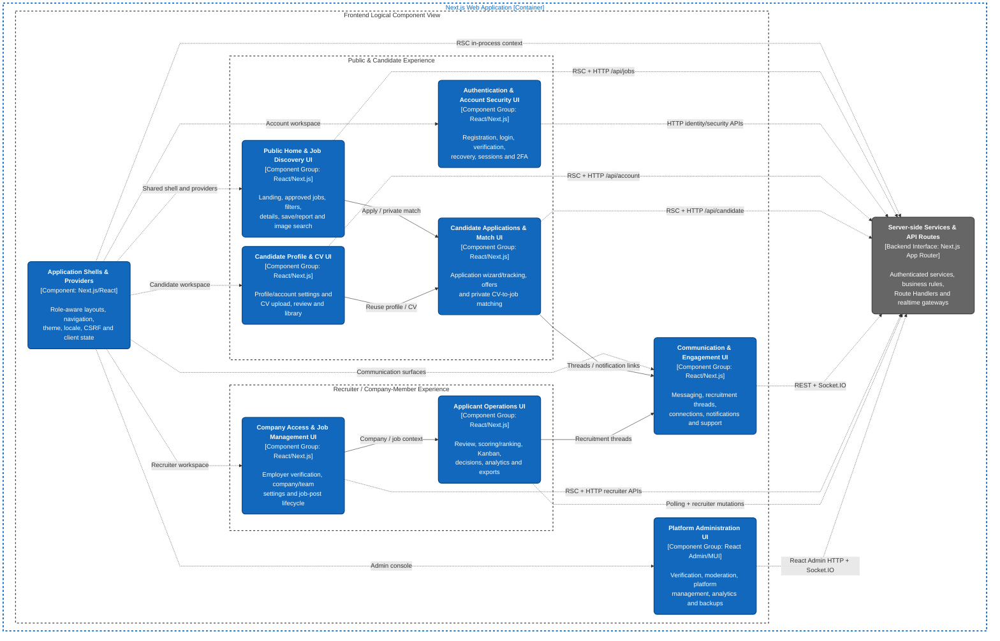

# C4 Level 3 Component Diagram — Frontend Logical View

_Performed by: Lưu Chí Hải | Reviewed by: Nguyễn Gia Quốc Uy, Nguyễn Quốc Thành | Edited by: Lưu Chí Hải_

**Version:** 1.2 (2026-08-26) — PA5 implementation synchronization; review Nguyễn Minh Khôi

**Architecture scope:** Major frontend components of the final implemented SmartHire product, covering public, candidate, recruiter/company-member, communication, and platform-administration experiences.

**Release boundary:** The view covers final Features 001–026. Feature 027 remains **Late Feature / Release Decision Pending** and is intentionally not added to this final-release component baseline.

**C4 modeling note:** The current structure, `web/next.config.ts`, `web/server.ts`, and the tracked root `compose.yaml` support one logical `Next.js Web Application` plus separately executable workers/infrastructure. The frontend and backend diagrams are logical Level 3 views of the web application, not separately deployed frontend and API services. `Server-side Services & API Routes` is shown only as the in-process backend interface used by the frontend; its internal decomposition remains in the Backend Component Diagram. The Compose manifest currently defines PostgreSQL, ClamAV, CV, OCR, image-search, and admin-worker services; it does not define a web or email-worker service, so this diagram does not infer their final demo process topology.

## Component Descriptions

_Performed by: Lưu Chí Hải | Reviewed by: Nguyễn Gia Quốc Uy, Nguyễn Quốc Thành | Edited by: Lưu Chí Hải_

**1. Application Shells & Providers**

- **Main source:** `web/src/app/layout.tsx`, `web/src/app/(workspace)/layout.tsx`, `web/src/app/recruiter/layout.tsx`, `web/src/frontend/features/dashboard/components/workspace-shell.tsx`, `web/src/frontend/features/admin/layout/admin-layout.tsx`, and `web/src/frontend/providers/`.
- **Responsibility and workflows:** Establishes the root theme and global feedback surface, authenticated candidate/recruiter shells, workspace-mode navigation, locale, account/recruiter header status, CSRF context, TanStack Query provider, and the administration layout. It routes users among candidate, recruiter, notification, messaging, support, and administration areas without turning those areas into separate deployable applications.
- **Backend interaction:** React Server Component layouts call `getWorkspaceContext()` in process to validate the session and project display-safe account/company-access state. Client providers then supply CSRF proof and cached client state to browser components.

**2. Public Home & Job Discovery UI**

- **Main source:** `web/src/app/page.tsx`, `web/src/app/jobs/page.tsx`, `web/src/app/jobs/[slug]/page.tsx`, `web/src/frontend/features/home/`, `web/src/frontend/features/jobs/`, and `web/src/frontend/features/jobs/image-search/`.
- **Responsibility and workflows:** Renders the landing experience, approved job catalogue, live search/filter/pagination, job details, saved-job and report actions, preferences/rule-based suggestions, and consent-aware image-assisted search. It leads authenticated candidates into application or private-match workflows.
- **Backend interaction:** The initial home, search, and detail models are loaded by React Server Components through `getHomePageContext()` and `JobDiscoveryService` as in-process TypeScript calls. Interactive search uses `GET /api/jobs`; saved/report actions use `/api/saved-jobs/{jobId}` and `/api/jobs/{jobId}/reports`; image-search components reserve, upload, poll, consume, consent, and cancel through `/api/jobs/image-searches/...`.

**3. Authentication & Account Security UI**

- **Main source:** `web/src/app/(auth)/`, `web/src/frontend/features/authentication/`, `web/src/app/(workspace)/settings/`, and the security/session components under `web/src/frontend/features/profile/`.
- **Responsibility and workflows:** Supports account registration, email verification, password login, two-factor challenge, forgotten-password reset, full account recovery, password changes, TOTP enrollment/disablement, backup-code regeneration, and session listing/revocation.
- **Backend interaction:** Client components send HTTP requests to implemented Route Handlers under `/api/identity/...`, `/api/auth/[...all]`, `/api/account/password/change`, and the session/two-factor subroutes. The frontend stores no bearer token in browser storage; authentication is carried by the server-managed cookie session and CSRF proof.

**4. Candidate Profile & CV UI**

- **Main source:** `web/src/app/(workspace)/profile/`, `web/src/frontend/features/profile/`, and `web/src/frontend/features/cv-import/`.
- **Responsibility and workflows:** Manages professional profile sections, avatar, account name/email, preferences, notification settings, and the candidate CV library. The CV workspace uploads PDF/DOCX files, shows malware/extraction/OCR processing state, records external-processing consent, supports retry/cancel, lets the Candidate reconcile extracted fields, and confirms reusable CV versions.
- **Backend interaction:** Profile pages load through `GetProfileAggregateService`, `AccountIdentityService`, `AccountPreferencesService`, and CV projection/library services in process. Browser edits use `/api/account/profile`, `/api/account/identity`, `/api/account/preferences`, `/api/account/cv-imports/...`, `/api/account/cv-drafts/...`, and `/api/account/candidate-cvs/...`; long-running imports are polled through their status Route Handler.

**5. Candidate Applications & Match UI**

- **Main source:** `web/src/app/jobs/[slug]/apply/`, `web/src/app/jobs/applied/`, `web/src/app/(workspace)/cv-match-check/`, `web/src/frontend/features/candidate-applications/`, and `web/src/frontend/features/private-cv-match/`.
- **Responsibility and workflows:** Provides the multi-step application draft and submission flow, CV and cover-letter selection, processing/retry state, application list and detailed stage history, notification preferences, withdrawal and offer response, plus private pre-application CV-to-job match checks with deterministic/AI status and explanations.
- **Backend interaction:** Server pages call `ApplicationDraftService`, `CandidateApplicationTrackingService`, and candidate CV services directly. Client orchestration uses `/api/candidate/application-drafts`, `/api/candidate/applications/...`, `/api/candidate/private-cv-matches/...`, and the public application endpoints under `/api/jobs/{jobId}/...`; asynchronous application/scoring or private-match progress is polled.

**6. Communication & Engagement UI**

- **Main source:** `web/src/app/(workspace)/messages/`, `web/src/app/(workspace)/notifications/`, `web/src/app/(workspace)/connections/`, `web/src/app/(workspace)/support/`, `web/src/app/jobs/applied/[applicationId]/messages/`, `web/src/app/recruiter/messages/`, and the `messaging/`, `recruitment-messaging/`, `notifications/`, `connections/`, and `support/` directories under `web/src/frontend/features/`.
- **Responsibility and workflows:** Provides eligible-participant messaging, blocking/reporting and read state, application-specific candidate/recruiter threads and assignment/owner oversight, professional connection proposals, deep-linked in-app notifications, and requester support conversations.
- **Backend interaction:** Initial messaging and connection contexts can be loaded in process. REST Route Handlers under `/api/messaging`, `/api/recruitment-threads`, `/api/notifications`, `/api/connections`, and `/api/support` provide authoritative queries and mutations. Socket.IO clients use the same web application at the `/chat` transport path with `/chat`, `/connections`, and `/support` namespaces over WebSocket for general-message delivery and connection/support invalidation; HTTP refetch remains authoritative after reconnect. Application-specific recruitment threads use REST and explicit refetch after writes, not Socket.IO.

**7. Company Access & Job Management UI**

- **Main source:** `web/src/app/(workspace)/dashboard/employer-verification/page.tsx`, `web/src/frontend/features/employer-verification/`, `web/src/app/recruiter/company-settings/`, `web/src/app/recruiter/company-invitation/`, `web/src/app/recruiter/job-postings/`, and `web/src/frontend/features/recruiter-workspace/`.
- **Responsibility and workflows:** Guides a user through tax-ID lookup, company-email proof, protected business-evidence submission, status/correction/resubmission, and entry into the recruiter workspace. Approved company members manage company details and job drafts/previews/review submission; Owners manage team invitations and membership roles. Recruiter access remains bound to an active company membership.
- **Backend interaction:** Recruiter pages load company/job data through `readRecruiterCompanySettings()`, `readRecruiterJobManagementData()`, and `CompanyTeamService` in process after `getWorkspaceContext()`. Client commands use `/api/employer-verifications/...`, `/api/recruiter/company`, `/api/recruiter/company/team/...`, and `/api/recruiter/job-postings/...`.

**8. Applicant Operations UI**

- **Main source:** `web/src/app/recruiter/candidates/`, `web/src/app/recruiter/pipeline/`, `web/src/app/recruiter/analytics/`, `web/src/frontend/features/recruiter-applications/`, and `web/src/frontend/features/recruitment-analytics/`.
- **Responsibility and workflows:** Lets authorized company members browse submitted applicants, safely preview/download application documents, inspect automatic and optional AI assessment details, rank/shortlist/prioritize candidates, retry or rescore processing, make interview/rejection decisions, and move applications through a drag-and-drop Kanban pipeline. It also displays qualified views, applications, conversion/funnel performance, and creates downloadable CSV/Excel exports.
- **Backend interaction:** Server pages resolve authenticated managed-job context in process. Browser hooks query and mutate company-scoped routes under `/api/recruiter/jobs/...`, `/api/recruiter/applications/...`, and `/api/recruiter/analytics/...`. Kanban moves use CSRF-protected, idempotent `PATCH` requests with expected stage versions; ranking, scoring summaries, pipelines, analytics, and export status use client polling where necessary.

**9. Platform Administration UI**

- **Main source:** `web/src/app/(admin-console)/admin-console/page.tsx` and `web/src/frontend/features/admin/`.
- **Responsibility and workflows:** A React Admin/Material UI console provides designated-session login and two-factor step-up, platform dashboard and growth analytics, notification handling, account/company/membership lifecycle controls, employer-verification evidence review and decisions, job-post review and enforcement, general moderation and messaging-report review, professional-connection proposal management, support-case handling, and encrypted backup settings/history with manual or scheduled runs.
- **Backend interaction:** `admin-app.tsx` composes resources through `auth-provider.ts` and `data-provider.ts`. Browser requests use `/api/admin/...`; the support and professional-connection resources subscribe to the `/support` and `/connections` Socket.IO namespaces for invalidation. Sensitive mutations and backup reads/writes surface `STEP_UP_REQUIRED` when the recent two-factor proof is stale. The console does not call repositories directly.

**10. Server-side Services & API Routes (backend interface)**

- **Main source:** `web/src/backend/`, `web/src/app/api/`, and `web/server.ts`.
- **Responsibility:** Represents only the server-side interface visible to this frontend view: authenticated business services called by Server Components, Next.js Route Handlers called by the browser, and same-process Socket.IO gateways. Database access, workers, provider adapters, storage, OCR, and other backend internals are deliberately not duplicated in this frontend Level 3 diagram.
- **Communication model:** React Server Components execute server-only TypeScript services in process and pass serialized display data to React. Client Components use same-origin HTTP/HTTPS requests for queries, mutations, uploads, and polling, plus authenticated `ws`/`wss` Socket.IO transport for realtime events. A repository-wide search finds no `"use server"` directives, so the document does not claim that Server Actions are used.

## Frontend Technology Summary

The implemented frontend uses **Next.js 16.3**, **React 19**, and **TypeScript 5.9** with App Router Server and Client Components. **Tailwind CSS 4** is imported by `web/src/app/globals.css` and works alongside project CSS modules/tokens. Interactive forms and contracts use **React Hook Form** and **Zod** where applicable; **TanStack Query** manages client caching, polling, mutations, and invalidation; **Socket.IO Client** provides realtime transport; **dnd-kit** powers the recruitment pipeline; and the administration console uses **React Admin 5** with **Material UI 7**.

## Frontend Evidence and Revision History

_Performed by: Lưu Chí Hải | Reviewed by: Nguyễn Gia Quốc Uy, Nguyễn Quốc Thành | Edited by: Lưu Chí Hải_

| Component group | Final feature coverage | Repository evidence |
|---|---|---|
| Public/Candidate | F001–F005, F010, F020 | `web/src/app/(auth)/`, `web/src/app/jobs/`, `web/src/app/(workspace)/profile/`, `cv-match-check/`, candidate frontend features |
| Recruiter/Company | F007, F012, F015, F021–F024 | `web/src/app/recruiter/`, recruiter application/pipeline/analytics/company frontend features |
| Communication | F008, F011, F013, F016, F019, F025 | message/connection/notification/recruitment-message pages and frontend feature directories |
| Platform Admin | F006, F009, F013–F014, F016–F018, F022, F026 | `web/src/app/(admin-console)/admin-console/page.tsx`, `web/src/frontend/features/admin/` |

| Version | Date | Editor | Exact change | Review |
|---|---|---|---|---|
| 1.1 | 2026-08-06 | Lưu Chí Hải | Prior frontend logical component consolidation. | Nguyễn Gia Quốc Uy, Nguyễn Quốc Thành |
| 1.2 | 2026-08-26 | Lưu Chí Hải | Reverified final route/component groups, protocols and 001–026 coverage; distinguished REST from Socket.IO; qualified the tracked Compose services without inventing web/email demo topology; excluded Feature 027. | Nguyễn Minh Khôi |
