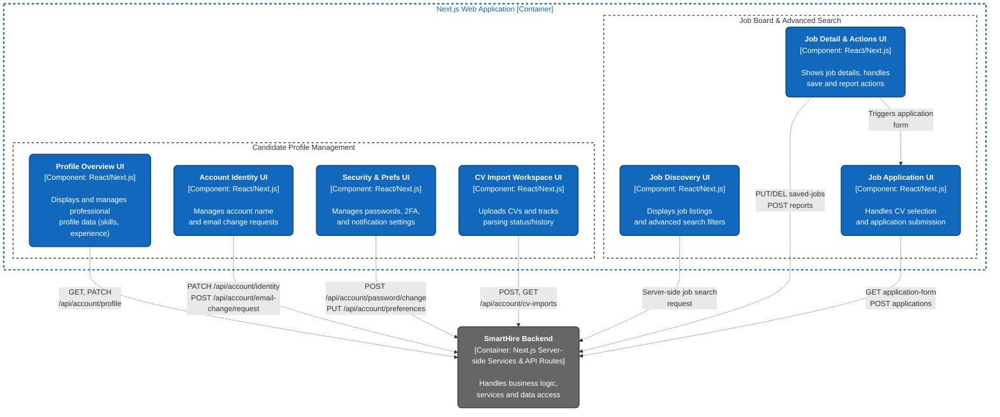

### 1. C4 Level 3 - Frontend Component Diagram

*Performed by: Lưu Chí Hải | Reviewed by: Nguyễn Gia Quốc Uy | Edited by: Lưu Chí Hải*

### 2. System Component Description

*Performed by: Lưu Chí Hải | Reviewed by: Nguyễn Gia Quốc Uy | Edited by: Lưu Chí Hải*

**Group 1: Candidate Profile Management**

* **Profile Overview UI (`profile-overview.tsx`)**
* **Responsibilities:** Displays the candidate's profile dashboard, including personal information, skills, experience, education, and social links.
* **Backend Interaction:** Fetches initial data via server-side `GetProfileAggregateService`. Client-side interactions send requests to `GET /api/account/profile` and `PATCH /api/account/profile` to save section updates.

* **Account Identity UI (`profile-account-view.tsx`)**
* **Responsibilities:** Provides forms for users to view and update their account name and request email changes.
* **Backend Interaction:** Submits updates to `PATCH /api/account/identity` and initiates email changes via `POST /api/account/email-change/request`.

* **Security & Preferences UI (`profile-security-view.tsx`, `profile-preferences-view.tsx`)**
* **Responsibilities:** Wraps the security and preference settings, allowing users to change passwords, manage 2FA (TOTP), and update notification/timezone preferences.
* **Backend Interaction:** Sends requests to `POST /api/account/password/change`, `/api/identity/two-factor/...` for security, and `PUT /api/account/preferences` for user settings.

* **CV Import Workspace UI (`cv-import-workspace.tsx`)**
* **Responsibilities:** Provides the workspace for uploading CV documents (PDF/DOCX), viewing import history, and polling the real-time status of the CV parsing process.
* **Backend Interaction:** Uploads files to `POST /api/account/cv-imports` and polls status/actions using `GET /api/account/cv-imports/{uploadId}` (including endpoints for retries and consent).

**Group 2: Job Board & Advanced Search**

* **Job Discovery UI (`job-search-form.tsx`)**
* **Responsibilities:** Renders the main job search page, including advanced filtering forms (keyword, location, salary, skills) and displays the list of job cards.
* **Backend Interaction:** Performs server-side queries via `JobDiscoveryService.search(...)`.

* **Job Detail & Actions UI (`job-detail.tsx`, `save-job-action.tsx`, `report-job-dialog.tsx`)**
* **Responsibilities:** Displays comprehensive job details, company information, requirements, and benefits. It also houses interactive actions to save, report, or apply for the job.
* **Backend Interaction:** Fetches data via `JobDiscoveryService.detail(...)`. Saves jobs using `PUT/DELETE /api/saved-jobs/{jobId}` and submits reports via `POST /api/jobs/{jobId}/reports`.

* **Job Application UI (`job-application-form.tsx`)**
* **Responsibilities:** Renders the application submission form, allowing candidates to select an imported CV, answer job-specific questions, and write a cover letter.
* **Backend Interaction:** Retrieves the form template via `GET /api/jobs/{jobId}/application-form` and submits the final application to `POST /api/jobs/{jobId}/applications`.