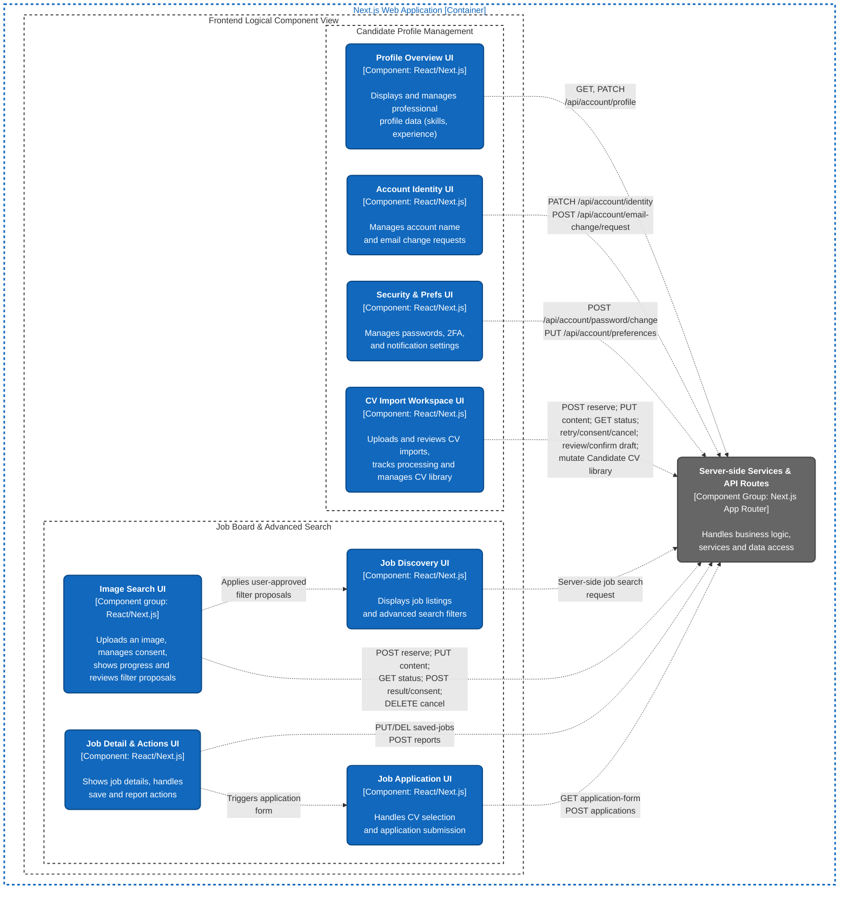

# C4 Level 3 Component Diagram — Frontend Logical View

_Performed by: Lưu Chí Hải | Reviewed by: Nguyễn Gia Quốc Uy, Nguyễn Quốc Thành | Edited by: Lưu Chí Hải_

**Architecture scope:** Frontend components that represent the implemented Features 001–005 baseline, with emphasis on candidate profile/CV workflows, deterministic job discovery, image-assisted search, and application submission.

**C4 modeling note:** Level 2 contains one deployable `Next.js Web Application`. This diagram is the **frontend logical component view** of that container. `Server-side Services & API Routes` is shown only as the in-container backend interface used by frontend components; its internal decomposition is documented separately in the Backend Component Diagram.

## Component Descriptions

_Performed by: Lưu Chí Hải | Reviewed by: Nguyễn Gia Quốc Uy, Nguyễn Quốc Thành | Edited by: Lưu Chí Hải_

**Group 1: Candidate Profile Management**

- **Profile Overview UI (`profile-overview.tsx`)**

- **Responsibilities:** Displays the candidate's profile dashboard, including personal information, skills, experience, education, and social links.

- **Backend Interaction:** Fetches initial data via server-side `GetProfileAggregateService`. Client-side interactions send requests to `GET /api/account/profile` and `PATCH /api/account/profile` to save section updates.

- **Account Identity UI (`profile-account-view.tsx`)**

- **Responsibilities:** Provides forms for users to view and update their account name and request email changes.

- **Backend Interaction:** Submits updates to `PATCH /api/account/identity` and initiates email changes via `POST /api/account/email-change/request`.

- **Security & Preferences UI (`profile-security-view.tsx`, `profile-preferences-view.tsx`)**

- **Responsibilities:** Wraps the security and preference settings, allowing users to change passwords, manage 2FA (TOTP), and update notification/timezone preferences.

- **Backend Interaction:** Sends requests to `POST /api/account/password/change`, `/api/identity/two-factor/...` for security, and `PUT /api/account/preferences` for user settings.

- **CV Import Workspace UI (`cv-import-workspace.tsx`)**

- **Responsibilities:** Provides the workspace for uploading PDF/DOCX CVs, tracking import progress and history, reviewing and editing extracted CV data, confirming the import, and managing confirmed Candidate CV entries.

- **Backend Interaction:** Reserves an import with metadata through `POST /api/account/cv-imports`, then uploads the raw file through `PUT` to the returned `/api/account/cv-imports/{uploadId}/content` URL. It retrieves processing status with `GET /api/account/cv-imports/{uploadId}`; requests retries and manages consent through the import subresources; cancels an import with `DELETE`; retrieves and edits review data through `/api/account/cv-drafts/{draftId}`; confirms through `/api/account/cv-drafts/{draftId}/confirm`; and updates or removes confirmed Candidate CV library entries through `/api/account/candidate-cvs/{cvId}`.

**Group 2: Job Board & Advanced Search**

- **Job Discovery UI (`job-search-form.tsx`)**

- **Responsibilities:** Renders the main job search page, including advanced filtering forms (keyword, location, salary, skills) and displays the list of job cards.

- **Backend Interaction:** Performs server-side queries via `JobDiscoveryService.search(...)`.

- **Image Search UI (`global-image-search.tsx`, `use-image-search.ts`)**

- **Responsibilities:** Coordinates image selection, privacy notice and consent, upload progress, processing status, recovery states, and review of evidence-bound search-filter proposals. Proposed filters are not applied until the user accepts them; ordinary deterministic job search remains authoritative.

- **Backend Interaction:** Reserves a query through `POST /api/jobs/image-searches`, uploads the image through `PUT /api/jobs/image-searches/{queryId}/content`, polls `GET /api/jobs/image-searches/{queryId}`, consumes the result through `POST /api/jobs/image-searches/{queryId}/result`, updates or revokes consent through `POST /api/jobs/image-searches/{queryId}/consent`, and cancels through `DELETE /api/jobs/image-searches/{queryId}`. The client orchestration is implemented in `web/src/frontend/features/jobs/image-search/client/use-image-search.ts` and `image-search-api.ts`.

- **Job Detail & Actions UI (`job-detail.tsx`, `save-job-action.tsx`, `report-job-dialog.tsx`)**

- **Responsibilities:** Displays comprehensive job details, company information, requirements, and benefits. It also houses interactive actions to save, report, or apply for the job.

- **Backend Interaction:** Fetches data via `JobDiscoveryService.detail(...)`. Saves jobs using `PUT/DELETE /api/saved-jobs/{jobId}` and submits reports via `POST /api/jobs/{jobId}/reports`.

- **Job Application UI (`job-application-form.tsx`)**

- **Responsibilities:** Renders the application submission form, allowing candidates to select an imported CV, answer job-specific questions, and write a cover letter.

- **Backend Interaction:** Retrieves the form template via `GET /api/jobs/{jobId}/application-form` and submits the final application to `POST /api/jobs/{jobId}/applications`.
