# C4 Level 3 Component Diagram — Backend

**Performed by:** Nguyễn Minh Khôi 
**Student ID:** 24127066 
**Reviewed by:** Nguyễn Gia Quốc Uy 
**Edited by:** Nguyễn Minh Khôi

**Architecture scope:** Backend and worker components that implement Features 001–005.

**C4 modeling note:** The frontend and backend are not separate deployable containers. Level 3A is the **backend logical component view** of the same `Next.js Web Application` shown at Level 2. The `App Router and React UI` component is included only to show the in-container ingress relationship; its internal UI components are documented in the Frontend Component Diagram. Level 3B separately decomposes the CV Worker, Image Search Worker, and OCR Engine containers.

## Level 3A — Web Application Components

```mermaid
%%{init: {"flowchart": {"curve": "linear", "nodeSpacing": 60, "rankSpacing": 90}}}%%
graph TD
    User["User\n[Person]\nGuest or candidate"]

    subgraph NextWeb["Next.js Web Application\n[Container] — web/"]
      direction TB

      Presentation["App Router and React UI\nNext.js Pages, Server/Client Components"]
      RouteHandlers["Route Handlers\nNext.js App Router"]
      RequestSecurity["Request Security Boundary\nBetter Auth session, CSRF/origin,\ncapability, Zod"]

      IdentityServices["Identity & Account Services\nRegistration, login, 2FA,\nrecovery, session, preferences"]
      ProfileServices["Candidate Profile Services\nRead and update Profile aggregate"]
      JobServices["Job Discovery Services\nDeterministic search, save,\napply and report job"]
      CvServices["CV Import Services\nAdmission, consent, upload,\nreview, retry, confirmation"]
      ImageServices["Image Search Services\nAdmission, capability, status,\nconsent, consume, merge criteria"]

      AuthGateway["Better Auth Gateway\nOwns browser session\nand authentication operations"]
      Repositories["Prisma Repositories\nTransaction, query, row lock,\nlease and projection"]
      RepositorySupport["Service-located Policies & Helpers\nJob policy/types/normalization, CV errors,\nprofile validation and CandidateCv projection"]
      StorageAdapters["Private Storage Adapters\nSelect filesystem or S3, enforce\nencryption/integrity contract"]
      SharedContracts["Shared Contracts\nZod and TypeScript — schemas\nshared across server/client/worker"]
    end

    subgraph DataStores["Data Stores"]
        PostgreSQL[("PostgreSQL\nContainer\nPostgreSQL 16 — business\ndata and durable work")]
        CVLocalStorage[("Local CV Artifact Store\nContainer\nEncrypted filesystem — default")]
        SearchLocalStorage[("Local Search Artifact Store\nContainer\nEncrypted filesystem — default")]
    end

    AWSStorage["AWS S3/KMS\nExternal — optional\nBackend implemented, requires\nexternal infrastructure/config"]

    User -->|"HTTPS"| Presentation
    Presentation -->|"HTTPS / JSON / raw stream —\nsend command/query from client"| RouteHandlers
    Presentation -->|"Server-rendered query"| IdentityServices
    Presentation -->|"Server-rendered query"| ProfileServices
    Presentation -->|"Server-rendered query"| JobServices

    RouteHandlers -->|"Forward preliminarily parsed request"| RequestSecurity
    RequestSecurity -->|"Delegate identity/account use case"| IdentityServices
    RequestSecurity -->|"Delegate Profile use case"| ProfileServices
    RequestSecurity -->|"Delegate job use case"| JobServices
    RequestSecurity -->|"Delegate CV use case"| CvServices
    RequestSecurity -->|"Delegate image-search use case"| ImageServices

    IdentityServices -->|"Authentication and session management"| AuthGateway
    IdentityServices -->|"Read/write account, token, audit"| Repositories
    ProfileServices -->|"Read/write Profile aggregate"| Repositories
    JobServices -->|"Query jobs and write user\nstate"| Repositories
    CvServices -->|"Write lifecycle, consent,\nand work item"| Repositories
    ImageServices -->|"Write lifecycle, rate limit,\nand capability HMAC"| Repositories
    Repositories -.->|"Current source dependency:\nimport/call selected policies, errors,\nvalidation and projection helper"| RepositorySupport
    CvServices -->|"Store/read CV artifact"| StorageAdapters
    ImageServices -->|"Store/read search artifact"| StorageAdapters

    RouteHandlers -->|"Validate transport schema"| SharedContracts
    IdentityServices -->|"Validate use-case data"| SharedContracts
    ProfileServices -->|"Validate use-case data"| SharedContracts
    JobServices -->|"Validate search contract"| SharedContracts
    CvServices -->|"Validate CV contract"| SharedContracts
    ImageServices -->|"Validate image-search contract"| SharedContracts
    RepositorySupport -->|"Use shared schemas/types\nwhere applicable"| SharedContracts

    AuthGateway -->|"PostgreSQL wire protocol via Prisma —\nread/write auth-owned tables"| PostgreSQL
    Repositories -->|"PostgreSQL wire protocol via Prisma —\nquery and transaction"| PostgreSQL
    StorageAdapters -->|"Filesystem API —\nwhen CV uses filesystem"| CVLocalStorage
    StorageAdapters -->|"Filesystem API — when image\nsearch uses filesystem"| SearchLocalStorage
    StorageAdapters -.->|"AWS S3 API / HTTPS —\nwhen adapter is s3"| AWSStorage

    classDef container fill:#f8fafc,stroke:#475569,stroke-width:1.2px,color:#0f172a;
    classDef person fill:#eef2ff,stroke:#1d4ed8,stroke-width:1.2px,color:#1e3a8a;
    classDef external fill:#fff7e6,stroke:#8a5a00,stroke-width:1.2px,color:#0f172a,stroke-dasharray: 5 5;
    class PostgreSQL,CVLocalStorage,SearchLocalStorage container;
    class User person;
    class AWSStorage external;
```

### Component descriptions — 3A

#### User (guest / candidate)

- **Responsibilities:** Interact with App Router/React UI via browser.
- **Relationships:** Calls `App Router and React UI` over HTTPS.

#### App Router and React UI

- **Responsibilities:** Render pages, maintain interactive state in the browser, send commands/queries to Route Handlers, and perform server-rendered queries directly to Identity, Profile, and Job services for SSR/RSC portions.
- **Technology:** Next.js Pages, Server/Client Components.
- **Relationships:** Calls `Route Handlers`, `Identity & Account Services`, `Candidate Profile Services`, `Job Discovery Services`.

#### Route Handlers

- **Responsibilities:** Parse requests/responses, use `no-store`, forward preliminarily parsed requests to `Request Security Boundary`; validate transport schemas via `Shared Contracts`.
- **Technology:** Next.js App Router.
- **Relationships:** Calls `Request Security Boundary` and `Shared Contracts`. **Does not** call Prisma/provider directly.

#### Request Security Boundary

- **Responsibilities:** Authenticate session/ownership (Better Auth session), check CSRF/origin, capability, and validate input using Zod before delegating to the appropriate application service. This is the mandatory boundary between transport layer and business logic.
- **Technology:** Better Auth session, CSRF/origin check, capability, Zod.
- **Relationships:** Receives requests from `Route Handlers`; delegates use cases to `Identity & Account Services`, `Candidate Profile Services`, `Job Discovery Services`, `CV Import Services`, `Image Search Services`.

#### Identity & Account Services

- **Responsibilities:** Registration, login, 2FA, recovery, session, and preferences.
- **Technology:** TypeScript.
- **Relationships:** Uses `Better Auth Gateway` for authentication/session management, reads/writes via `Prisma Repositories`, validates use-case data via `Shared Contracts`.

#### Candidate Profile Services

- **Responsibilities:** Read and update Profile aggregate.
- **Technology:** TypeScript.
- **Relationships:** Reads/writes via `Prisma Repositories`, validates via `Shared Contracts`.

#### Job Discovery Services

- **Responsibilities:** Deterministic search, save, apply, and report job.
- **Technology:** TypeScript.
- **Relationships:** Queries/writes user state via `Prisma Repositories`, validates search contract via `Shared Contracts`.

#### CV Import Services

- **Responsibilities:** Admission, consent, upload, review, retry, and confirmation for CV import flow.
- **Technology:** TypeScript.
- **Relationships:** Writes lifecycle/consent/work item via `Prisma Repositories`, stores/reads artifact via `Private Storage Adapters`, validates CV contract via `Shared Contracts`.

#### Image Search Services

- **Responsibilities:** Admission, capability, status, consent, consume, and merge job search criteria from images.
- **Technology:** TypeScript.
- **Relationships:** Writes lifecycle/rate limit/capability HMAC via `Prisma Repositories`, stores/reads search artifact via `Private Storage Adapters`, validates image-search contract via `Shared Contracts`.

#### Better Auth Gateway

- **Responsibilities:** Owns browser session and authentication operations.
- **Technology:** Better Auth.
- **Relationships:** Called by `Identity & Account Services`; **reads/writes directly** to tables owned by Better Auth in PostgreSQL via Prisma (does not go through `Prisma Repositories`).

#### Prisma Repositories

- **Responsibilities:** Transaction, query, row lock, lease, and projection shared across all domains (identity, profile, job, CV, image-search).
- **Technology:** Prisma 7.
- **Relationships:** Called by Identity/Profile/Job/CV/Image services and queries/transactions directly on `PostgreSQL` via Prisma. In the current source, several repository implementations also import selected modules located under `web/src/backend/services/`, represented by `Service-located Policies & Helpers`; therefore the physical source dependency is not a strictly one-way Service → Repository dependency.

#### Service-located Policies & Helpers

- **Responsibilities:** Represent policy, type, normalization, error, validation, and projection helpers that repository implementations currently reuse. Examples include job application policy/search normalization, CV HTTP errors, profile validation, and the `CandidateCv` projection helper used by Apply.
- **Technology:** TypeScript modules currently located under `web/src/backend/services/jobs/`, `services/cv-import/`, and `services/profile/`.
- **Relationships:** Imported or called by selected `Prisma Repositories`; may use `Shared Contracts`. This component documents the current implementation rather than claiming an ideal strict-layer dependency. Moving these cross-layer helpers to a shared domain/application-support boundary would require a separate source-code refactor.

#### Private Storage Adapters

- **Responsibilities:** Select filesystem or S3 and enforce encryption/integrity contract for CV and search artifacts.
- **Technology:** TypeScript ports/adapters.
- **Relationships:** Called by `CV Import Services` and `Image Search Services`; reads/writes `Local CV Artifact Store` and `Local Search Artifact Store` via Filesystem API when using filesystem adapter (default); reads/writes `AWS S3/KMS` via AWS S3 API/HTTPS only when adapter is `s3` (not yet provisioned in the repository).

#### Shared Contracts

- **Responsibilities:** Provide Zod schemas shared across server, client, and worker for validating use-case/transport data.
- **Technology:** Zod, TypeScript.
- **Relationships:** Called by `Route Handlers` and all application services for validation.

#### PostgreSQL

- **Responsibilities:** Store business data and durable work (outbox, CV import jobs, image-search jobs).
- **Relationships:** Accessed by `Better Auth Gateway` and `Prisma Repositories` via Prisma.

#### Local CV Artifact Store / Local Search Artifact Store

- **Responsibilities:** Store CV / search artifacts when storage adapter is filesystem (default).
- **Relationships:** Accessed by `Private Storage Adapters` via Filesystem API.

#### AWS S3/KMS — optional

- **Responsibilities:** Alternative backend storage implemented at adapter level but not yet provisioned in the repository.
- **Relationships:** Called by `Private Storage Adapters` only when adapter is configured as `s3`.

## Level 3B — Worker and OCR Engine Components

```mermaid
%%{init: {"flowchart": {"curve": "linear", "nodeSpacing": 60, "rankSpacing": 90}}}%%
graph TD
    subgraph CVWorkerBoundary["CV Worker\n[Container]"]
        direction TB
        CvRuntime["Worker Runtime & Lease Controller\nNode.js — claim durable work,\ndeadline, retry, supervision"]
        CvScan["CV Scan Stage\nClamAV adapter — fail-closed scan\nbefore extraction"]
        CvExtract["Hybrid Extraction\nPDF.js, Mammoth, yauzl, Canvas, Sharp\n— native-first, create OCR units"]
        CvParse["CV Parser\nDeterministic or OpenAI adapter\n— create draft with provenance/warning"]
        CvCleanup["CV Cleanup & Reconciliation\nNode.js — delete expired temp/artifact,\nfix orphan states"]
    end

    subgraph ImageWorkerBoundary["Image Search Worker\n[Container]"]
        direction TB
        ImageRuntime["Worker Runtime & Lease Controller\nNode.js — claim stage, hold\nimmutable deletion deadline"]
        ImageScanDecode["Scan & Decode\nClamAV and Sharp — scan, check\nformat/pixel, normalize sRGB PNG"]
        ImageOcrStage["OCR Stage\nOcrEngine port — send PNG,\ncheck strict OCR result"]
        ImageInterpret["Intent Interpretation\nOpenAI adapter, selection policy —\ngenerate criteria suggestions, check evidence/schema"]
        ImageCleanup["Search Cleanup & Reconciliation\nNode.js — physically delete artifact\nwithin 15-minute deadline"]
    end

    subgraph OCRBoundary["OCR Engine\n[Container]"]
        direction TB
        OcrApi["Private Recognition API\nFastAPI on Unix socket —\nhealth check, request limits,\npurpose/deadline validation"]
        OcrRuntime["Paddle OCR ONNX Runtime\nPaddleOCR, ONNX Runtime CPU —\ndetection, recognition, geometry, confidence"]
        ModelVerifier["Model Manifest Verifier\nSHA-256 manifest — block incorrect\nor tampered models, prevent runtime download"]
    end

    PostgreSQL[("PostgreSQL\nWork state, lease, consent,\naudit, deletion evidence")]
    CVLocalStorage[("Local CV Artifact Store\nCV source/derivative — filesystem")]
    SearchLocalStorage[("Local Search Artifact Store\nEphemeral artifact — filesystem")]
    ClamAV["Malware Scanner\nContainer — Private Unix socket"]
    AWSStorage["AWS S3/KMS\nExternal — optional, implemented"]
    OpenAI["OpenAI Responses API\nExternal — optional, consent-gated"]
    ClamAVUpdates["ClamAV Definition Service\nExternal — signature source for freshclam"]

    CvRuntime -->|"PostgreSQL wire protocol via Prisma —\nclaim/update CV work and lease"| PostgreSQL
    CvRuntime -->|"Orchestrate scan"| CvScan
    CvRuntime -->|"Orchestrate extraction"| CvExtract
    CvRuntime -->|"Orchestrate parsing"| CvParse
    CvRuntime -->|"Orchestrate cleanup/reconciliation"| CvCleanup

    CvScan -->|"Unix socket — scan CV"| ClamAV
    CvScan -->|"Read encrypted source\nwhen using filesystem"| CVLocalStorage
    CvScan -.->|"AWS S3 API / HTTPS —\nwhen adapter is s3"| AWSStorage
    CvExtract -->|"Read source and write segment\nwhen using filesystem"| CVLocalStorage
    CvExtract -.->|"AWS S3 API / HTTPS —\nwhen adapter is s3"| AWSStorage
    CvExtract -->|"Unix socket / HTTP —\neligible OCR units"| OcrApi
    CvParse -->|"Read segment and write draft\nwhen using filesystem"| CVLocalStorage
    CvParse -.->|"AWS S3 API / HTTPS —\nwhen adapter is s3"| AWSStorage
    CvParse -.->|"HTTPS — send text\nwhen permitted"| OpenAI
    CvCleanup -->|"Claim cleanup\nand write evidence"| PostgreSQL
    CvCleanup -->|"Delete artifact\nwhen using filesystem"| CVLocalStorage
    CvCleanup -.->|"AWS S3 API / HTTPS —\nwhen adapter is s3"| AWSStorage

    ImageRuntime -->|"PostgreSQL wire protocol via Prisma —\nclaim/update image-search stage"| PostgreSQL
    ImageRuntime -->|"Orchestrate scan/decode"| ImageScanDecode
    ImageRuntime -->|"Orchestrate OCR"| ImageOcrStage
    ImageRuntime -->|"Orchestrate interpretation"| ImageInterpret
    ImageRuntime -->|"Orchestrate cleanup/reconciliation"| ImageCleanup

    ImageScanDecode -->|"Unix socket — scan image"| ClamAV
    ImageScanDecode -->|"Read source, write normalized\nPNG when using filesystem"| SearchLocalStorage
    ImageScanDecode -.->|"AWS S3 API / HTTPS —\nwhen adapter is s3"| AWSStorage
    ImageOcrStage -->|"Read normalized PNG\nwhen using filesystem"| SearchLocalStorage
    ImageOcrStage -.->|"AWS S3 API / HTTPS —\nwhen adapter is s3"| AWSStorage
    ImageOcrStage -->|"Unix socket / HTTP —\nrecognize text"| OcrApi
    ImageInterpret -->|"Read OCR text, write\ncandidate intent (filesystem)"| SearchLocalStorage
    ImageInterpret -.->|"AWS S3 API / HTTPS —\nwhen adapter is s3"| AWSStorage
    ImageInterpret -.->|"HTTPS — send OCR text\nwhen consent/policy permits"| OpenAI
    ImageCleanup -->|"Claim cleanup, write\ndeletion evidence"| PostgreSQL
    ImageCleanup -->|"Delete content artifact\nwhen using filesystem"| SearchLocalStorage
    ImageCleanup -.->|"AWS S3 API / HTTPS —\nwhen adapter is s3"| AWSStorage

    ClamAV -.->|"HTTPS — update signatures\nusing freshclam"| ClamAVUpdates

    OcrApi -->|"Check manifest\nand expected digest"| ModelVerifier
    OcrApi -->|"Call recognition"| OcrRuntime
    OcrRuntime -->|"Check ONNX artifact\nbefore warm-up"| ModelVerifier

    classDef container fill:#f8fafc,stroke:#475569,stroke-width:1.2px,color:#0f172a;
    classDef external fill:#fff7e6,stroke:#8a5a00,stroke-width:1.2px,color:#0f172a,stroke-dasharray: 5 5;
    class PostgreSQL,CVLocalStorage,SearchLocalStorage,ClamAV container;
    class AWSStorage,OpenAI,ClamAVUpdates external;
```

### Component descriptions — 3B

#### Worker Runtime & Lease Controller (CV Worker / Image Search Worker)

- **Responsibilities:** Claim durable work from PostgreSQL, hold lease/deadline, retry, supervision, and orchestrate internal stages.
- **Technology:** Node.js.
- **Relationships:** Claims/updates work via Prisma on `PostgreSQL`; orchestrates child stages within the same container.

#### CV Scan Stage

- **Responsibilities:** Perform fail-closed malware scan on CV documents before extraction.
- **Technology:** ClamAV adapter.
- **Relationships:** Calls `Malware Scanner` via Unix socket; reads encrypted source from `Local CV Artifact Store` (filesystem, default) or `AWS S3/KMS` when adapter is `s3`.

#### Hybrid Extraction

- **Responsibilities:** Native-first extraction (PDF.js, Mammoth, yauzl, Canvas, Sharp); create OCR units for content requiring OCR.
- **Relationships:** Reads source/writes segments to `Local CV Artifact Store` (or optional S3); calls `OCR Engine` via Unix socket/HTTP for eligible OCR units.

#### CV Parser

- **Responsibilities:** Create draft with provenance and warnings from extracted content.
- **Technology:** Deterministic adapter (default) or OpenAI adapter (optional, requires permission).
- **Relationships:** Reads segments/writes drafts to `Local CV Artifact Store`; calls `OpenAI Responses API` via HTTPS only when permitted.

#### CV Cleanup & Reconciliation

- **Responsibilities:** Delete expired artifacts/temp files, fix orphan states.
- **Relationships:** Claims cleanup and writes evidence to `PostgreSQL`; deletes artifacts from `Local CV Artifact Store` (or optional S3).

#### Scan & Decode (Image Search Worker)

- **Responsibilities:** Scan images before decoding, check format/pixel, normalize to sRGB PNG.
- **Technology:** ClamAV, Sharp.
- **Relationships:** Calls `Malware Scanner`; reads source/writes normalized PNG to `Local Search Artifact Store` (or optional S3).

#### OCR Stage (Image Search Worker)

- **Responsibilities:** Send normalized PNG to OCR Engine and enforce strict OCR result checking.
- **Relationships:** Reads normalized PNG from `Local Search Artifact Store`; calls `OCR Engine` via Unix socket/HTTP.

#### Intent Interpretation

- **Responsibilities:** Generate job search criteria suggestions from OCR text, check evidence and schema.
- **Technology:** OpenAI adapter, selection policy.
- **Relationships:** Reads OCR text/writes candidate intent to `Local Search Artifact Store`; calls `OpenAI Responses API` via HTTPS only when consent/policy permits.

#### Search Cleanup & Reconciliation

- **Responsibilities:** Physically delete artifacts within a 15-minute deadline.
- **Relationships:** Claims cleanup, writes deletion evidence to `PostgreSQL`; deletes content artifacts from `Local Search Artifact Store` (or optional S3).

#### Private Recognition API

- **Responsibilities:** Health check, request limits, purpose and deadline validation for OCR requests.
- **Technology:** FastAPI on Unix socket.
- **Relationships:** Receives requests from `Hybrid Extraction` (CV Worker) and `OCR Stage` (Image Search Worker); checks manifest via `Model Manifest Verifier`; calls `Paddle OCR ONNX Runtime`.

#### Paddle OCR ONNX Runtime

- **Responsibilities:** Detection, recognition, geometry, confidence on normalized images.
- **Technology:** PaddleOCR, ONNX Runtime CPU.
- **Relationships:** Called by `Private Recognition API`; verifies ONNX artifacts via `Model Manifest Verifier` before warm-up.

#### Model Manifest Verifier

- **Responsibilities:** Block incorrect or tampered models using SHA-256 manifest; prevent runtime downloads.
- **Relationships:** Called by `Private Recognition API` and `Paddle OCR ONNX Runtime` to validate models before use.

#### Malware Scanner

- **Responsibilities:** Scan files/images via Unix socket for both workers.
- **Relationships:** Called by `CV Scan Stage` and `Scan & Decode`; updates signatures from `ClamAV Definition Service` via HTTPS (`freshclam`).
