# C4 Level 3 Component Diagram — Backend

*Performed by: Nguyễn Minh Khôi | Reviewed by: Lưu Chí Hải | Edited by: Nguyễn Minh Khôi*  
**Version:** V1.4 (2026-08-26) — PA5 Final Document Synchronization Baseline

### Revision History

| Version | Date | Author/Editor | Summary | Status |
|---|---|---|---|---|
| 1.3 | 2026-08-06 | Nguyễn Minh Khôi | Backend components for core PA4 baseline. | Baseline |
| 1.4 | 2026-08-26 | Nguyễn Minh Khôi | Refactored backend services to reflect full 26-feature baseline: Realtime Socket.IO Messaging, Recruitment Threads, Hybrid Scoring, 9-stage Kanban Pipeline, Analytics & Background Export Worker, Company Administration/Team Lifecycle, Admin Backup Service (no restore UI), and Step-Up 2FA. | Approved |

**Architecture scope:** Backend domain services, API route handlers, persistence layer, background workers, and external adapters implementing the complete SmartHire 26-feature baseline.

**C4 modeling note:** The frontend and backend are logical tiers of the same `Next.js Web Application` container. Level 3A decomposes the web application's **server-side services, route handlers, and real-time Socket.IO gateway**. Level 3B separately decomposes all background workers: **Email Worker, CV Worker, Image Search Worker, Admin Worker, Analytics Export Worker, Admin Backup Runner, and OCR Engine**.

---

## Level 3A — Web Application Backend Components

```mermaid
%%{init: {"flowchart": {"curve": "linear", "nodeSpacing": 50, "rankSpacing": 80}}}%%
graph TD
    User["Candidate / Visitor\n[Person]"]
    RecruiterActor["Recruiter / HR / Owner\n[Person]\nCompany Member"]
    AdminActor["Platform Administrator\n[Person]\nRecent 2FA"]

    subgraph NextWeb["Next.js Web Application [Container] — web/"]
      direction TB

      subgraph IngressLayer["Ingress & Real-Time Gateway"]
        AppRouter["App Router Server Components\n(SSR / RSC Queries)"]
        RouteHandlers["Route Handlers\n(Next.js App Router HTTP APIs)"]
        SocketServer["Socket.IO Real-Time Gateway\n(/chat — custom server in server.ts)"]
      end

      RequestSecurity["Request Security Boundary\nBetter Auth Session, Step-Up 2FA, CSRF, Tenant Guard, Zod"]

      subgraph DomainServices["Modular Domain Services — web/src/backend/"]
        direction TB

        IdentityServices["Identity & Account Services\nAuth, 2FA, password reset, session revoke"]
        ProfileServices["Candidate Profile Services\nProfile aggregate, experience, skills, preferences"]
        CvServices["CV Intake Services\nUpload admission, scan check, parse review, draft"]
        ImageServices["Image Search Services\nAdmission, scan check, OCR criteria merge"]
        JobServices["Job Discovery & Management\nSearch, save, apply, post creation, revisions"]
        PipelineServices["Recruitment Pipeline & Kanban\n9-stage state machine, transitions, history"]
        ScoringServices["Candidate Scoring & Hybrid Ranking\nDeterministic rules, AI advisory, explanation, override"]
        MessagingServices["Messaging Services\n1:1 Direct Chat, Recruitment Threads, Reports"]
        NotificationServices["Notification & Outbox Services\nIn-app alerts, transactional email outbox, deep links"]
        CompanyServices["Company & Team Governance\nSettings overview, member invitations, role lifecycle"]
        VerificationServices["Business Verification Services\nRegistry lookup, evidence upload, admin review"]
        AnalyticsServices["Recruitment Analytics Services\nCompany metrics, funnels, export job dispatch"]
        BackupServices["Admin Backup Services\nPrivileged backup trigger, schedule, run history"]
        AdminServices["Platform Admin Services\nUser management, moderation, audit log query"]
      end

      subgraph InfrastructureLayer["Shared Backend Infrastructure"]
        AuthGateway["Better Auth Gateway\nBrowser cookies & auth tables"]
        Persistence["Persistence Layer / Prisma Data Access\nRepository pattern & Prisma transactions"]
        StorageAdapters["Private Storage Adapters\nFilesystem AES-256-GCM / optional S3"]
        SharedContracts["Shared Contracts\nZod schemas & TypeScript types"]
      end
    end

    subgraph DataStores["Data Stores"]
        PostgreSQL[("PostgreSQL\nPostgreSQL 16")]
        CVLocalStorage[("Local CV Store\nEncrypted FS")]
        SearchLocalStorage[("Local Search Store\nEncrypted FS")]
        AdminEvidence[("Local Evidence Store\nEncrypted FS")]
        ExportStorage[("Local Export Store\nExcel/CSV FS")]
        BackupStorage[("Local Backup Store\nEncrypted pg_dumps")]
    end

    subgraph ExternalServices["External Adapters"]
        BusinessRegistry["VietQR Business Registry\nOptional lookup"]
        GoogleDrive["Google Drive Storage\nOptional OAuth2"]
    end

    User -->|"HTTP(S)"| AppRouter
    User -->|"HTTP(S) API"| RouteHandlers
    User -->|"ws/wss (/chat)"| SocketServer

    RecruiterActor -->|"HTTP(S) API"| RouteHandlers
    RecruiterActor -->|"ws/wss (/chat)"| SocketServer

    AdminActor -->|"HTTP(S) API (Step-Up 2FA)"| RouteHandlers

    RouteHandlers -->|"Validate actor, tenant & step-up context"| RequestSecurity
    SocketServer -->|"Validate auth & conversation membership"| RequestSecurity

    RequestSecurity -->|"Dispatch"| DomainServices

    AppRouter -->|"In-process query"| IdentityServices
    AppRouter -->|"In-process query"| ProfileServices
    AppRouter -->|"In-process query"| JobServices

    IdentityServices --> AuthGateway
    IdentityServices --> Persistence
    ProfileServices --> Persistence
    CvServices --> Persistence
    CvServices --> StorageAdapters
    ImageServices --> Persistence
    ImageServices --> StorageAdapters
    JobServices --> Persistence
    PipelineServices --> Persistence
    PipelineServices --> NotificationServices
    ScoringServices --> Persistence
    MessagingServices --> Persistence
    MessagingServices --> SocketServer
    NotificationServices --> Persistence
    CompanyServices --> Persistence
    VerificationServices --> Persistence
    VerificationServices --> StorageAdapters
    VerificationServices -.-> BusinessRegistry
    AnalyticsServices --> Persistence
    AnalyticsServices --> ExportStorage
    BackupServices --> Persistence
    BackupServices --> BackupStorage
    BackupServices -.-> GoogleDrive
    AdminServices --> Persistence

    DomainServices --> SharedContracts
    Persistence --> PostgreSQL
    AuthGateway --> PostgreSQL

    classDef container fill:#f8fafc,stroke:#475569,stroke-width:1.2px,color:#0f172a;
    classDef person fill:#eef2ff,stroke:#1d4ed8,stroke-width:1.2px,color:#1e3a8a;
    classDef external fill:#fff7e6,stroke:#8a5a00,stroke-width:1.2px,color:#0f172a,stroke-dasharray: 5 5;
    class PostgreSQL,CVLocalStorage,SearchLocalStorage,AdminEvidence,ExportStorage,BackupStorage container;
    class User,RecruiterActor,AdminActor person;
    class BusinessRegistry,GoogleDrive external;
```

### Component descriptions — 3A

*Performed by: Nguyễn Minh Khôi | Reviewed by: Lưu Chí Hải | Edited by: Nguyễn Minh Khôi*

#### 1. Ingress & Real-Time Gateway Layer
- **App Router Server Components:** Performs server-side rendering (SSR/RSC) and directly invokes read queries on Identity, Profile, and Job domain services in-process.
- **Route Handlers:** Next.js App Router HTTP endpoints (`/api/*`). Handles incoming JSON/multipart requests, delegates security validation to Request Security Boundary, and routes commands to appropriate domain services.
- **Socket.IO Real-Time Gateway:** Custom server (`web/server.ts`) listening on `/chat`. Manages general-message delivery and related realtime invalidation; application-scoped recruitment threads use REST/refetch rather than Socket.IO traffic.

#### 2. Request Security Boundary
- **Responsibilities:** Validates Better Auth session cookies, verifies multi-tenant company membership, enforces **Step-Up 2FA (recent authentication within 15 minutes)** for privileged admin operations (backup, global security), validates CSRF/origin headers, and parses input payloads via Zod contracts.

#### 3. Domain Services Layer
- **Identity & Account Services:** Account registration, email verification tokens, password change/recovery, TOTP 2FA setup, and multi-device session revocation.
- **Candidate Profile Services:** Manages candidate profile aggregate, work experience, education, skills, and privacy preferences.
- **CV Intake Services:** CV upload admission, coordinate fail-closed malware scan, text extraction, parsing review, and profile draft confirmation.
- **Image Search Services:** Search image upload admission, normalize to PNG, OCR processing, and query suggestion merge with auto-cleanup.
- **Job Discovery & Management Services:** Public job search/filtering, candidate save/apply actions, and company recruiter job posting lifecycle (Draft, Pending, Active, Closed).
- **Recruitment Pipeline & Kanban Services:** 9-stage pipeline state machine (`Applied`, `Viewed`, `Shortlisted`, `Interviewing`, `Offered`, `Hired`, `Offer Declined`, `Rejected`, `Waitlisted`), drag-and-drop transitions, stage change history, and automated candidate status alerts.
- **Candidate Scoring & Hybrid Ranking Services:** Hybrid applicant evaluation — deterministic keyword/experience rules combined with AI-assisted advisory scoring, transparent explanations, score retry, and human recruiter score override.
- **Messaging Services:** Manages 1:1 direct messaging between candidates and company recruiters, application-scoped recruitment messaging threads with Owner read-only oversight, and message abuse reporting.
- **Notification & Outbox Services:** In-app notification center, deep-link routing authorization, and transactional `EmailOutbox` record creation.
- **Company & Team Governance Services:** Company profile/overview management, member invitation lifecycle (invite, accept, decline, revoke), role management (`OWNER`, `HR_MANAGER`, `RECRUITER`), and last-owner safety constraint enforcement.
- **Business Verification Services:** Recruiter verification preparation, optional VietQR registry lookups, company email domain validation, and business license review.
- **Recruitment Analytics Services:** Computes pipeline funnel conversion, stage velocity, and dispatches background export jobs.
- **Admin Backup Services:** Handles privileged manual backup triggers (with step-up 2FA), automated schedule settings, run history queries, and Google Drive OAuth2 upload; explicitly excludes restore UI.
- **Platform Admin Services:** Cross-tenant platform administration, user account management, job posting moderation queues, and immutable audit log exploration.

---

## Level 3B — Worker and OCR Engine Components

```mermaid
%%{init: {"flowchart": {"curve": "linear", "nodeSpacing": 50, "rankSpacing": 80}}}%%
graph TD
    subgraph CVWorkerBoundary["CV Worker [Container]"]
        direction TB
        CvRuntime["Worker Runtime & Lease Controller\nNode.js — claim durable work, retry"]
        CvScan["CV Scan Stage\nClamAV adapter — fail-closed scan"]
        CvExtract["Hybrid Extraction Stage\nPDF.js, Mammoth, Sharp — text & OCR units"]
        CvParse["CV Parser Stage\nDeterministic / optional OpenAI draft generator"]
        CvCleanup["CV Cleanup & Reconciliation\nPurge expired artifacts & temp files"]
    end

    subgraph ImageWorkerBoundary["Image Search Worker [Container]"]
        direction TB
        ImageRuntime["Worker Runtime & Lease Controller\nNode.js — claim image search jobs"]
        ImageScan["Malware Scan Stage\nClamAV fail-closed scan before decode"]
        ImageDecode["Decode & Normalize Stage\nSharp — format validation, sRGB PNG"]
        ImageOcrStage["OCR Stage\nSend PNG to OCR Engine over Unix socket"]
        ImageInterpret["Intent Interpretation\nOpenAI adapter — filter criteria suggestions"]
        ImageCleanup["Search Cleanup Stage\nPhysically delete image within 15-min deadline"]
    end

    subgraph OCRBoundary["OCR Engine [Container]"]
        direction TB
        OcrApi["Private Recognition API\nFastAPI on Unix socket — health, purpose limits"]
        OcrRuntime["Paddle OCR ONNX Runtime\nPaddleOCR CPU — text, geometry, confidence"]
        OcrStartup["Startup & Model Integrity\nVerify model digests (SHA-256) and warm pipeline"]
    end

    subgraph AdminWorkerBoundary["Admin Worker [Container]"]
        direction TB
        AdminRuntime["Admin Loop Scheduler\nNode.js — periodic lifecycle loops"]
        AdminVerification["Evidence Safety & Deadlines\nClamAV scan verification licenses"]
        AdminNotifications["Notification Retention\nPurge expired in-app alerts, reconcile outbox"]
        AdminJobPost["Job Archival Loop\nAuto-archive expired job postings"]
    end

    subgraph ExportWorkerBoundary["Analytics Export Worker [Container]"]
        direction TB
        ExportRuntime["Export Worker Controller\nNode.js — claim ExportRequest jobs"]
        ExportGenerator["ExcelJS / CSV Stream Generator\nCompany-scoped applicant data export"]
    end

    subgraph BackupWorkerBoundary["Admin Backup Process [Container]"]
        direction TB
        BackupRunner["Backup Runner Controller\nNode.js — scheduled & on-demand triggers"]
        DumpExtractor["pg_dump CLI & AES-256-GCM Encryptor\nExtract schema/data, compress & encrypt"]
        CloudUploader["Google Drive OAuth2 Uploader\nOptional encrypted upload to cloud folder"]
    end

    PostgreSQL[("PostgreSQL\nLease, work queue, data")]
    ClamAV["Malware Scanner\nClamAV Unix socket"]
    Storage["Local Artifact Stores\nEncrypted filesystem"]
    GoogleDrive["Google Drive Storage\nOAuth2 API"]
    OpenAI["OpenAI Responses API\nOptional, consent-gated"]

    CvRuntime --> PostgreSQL
    CvRuntime --> CvScan --> ClamAV
    CvScan --> Storage
    CvExtract --> Storage
    CvExtract --> OcrApi
    CvParse --> Storage
    CvParse -.-> OpenAI
    CvCleanup --> PostgreSQL
    CvCleanup --> Storage

    ImageRuntime --> PostgreSQL
    ImageRuntime --> ImageScan --> ClamAV
    ImageScan --> Storage
    ImageDecode --> Storage
    ImageOcrStage --> Storage
    ImageOcrStage --> OcrApi
    ImageInterpret --> Storage
    ImageInterpret -.-> OpenAI
    ImageCleanup --> PostgreSQL
    ImageCleanup --> Storage

    OcrStartup --> OcrRuntime
    OcrApi --> OcrRuntime

    AdminRuntime --> PostgreSQL
    AdminVerification --> ClamAV
    AdminVerification --> Storage
    AdminNotifications --> PostgreSQL
    AdminJobPost --> PostgreSQL

    ExportRuntime --> PostgreSQL
    ExportRuntime --> ExportGenerator --> Storage

    BackupRunner --> PostgreSQL
    BackupRunner --> DumpExtractor --> Storage
    DumpExtractor --> PostgreSQL
    DumpExtractor -.-> CloudUploader --> GoogleDrive

    classDef container fill:#f8fafc,stroke:#475569,stroke-width:1.2px,color:#0f172a;
    classDef external fill:#fff7e6,stroke:#8a5a00,stroke-width:1.2px,color:#0f172a,stroke-dasharray: 5 5;
    class PostgreSQL,ClamAV,Storage container;
    class GoogleDrive,OpenAI external;
```

### Component descriptions — 3B

*Performed by: Nguyễn Minh Khôi | Reviewed by: Lưu Chí Hải | Edited by: Nguyễn Minh Khôi*

#### 1. Background Workers
- **CV Worker:** Executes asynchronous CV parsing pipeline (ClamAV malware scan, text extraction, OCR engine invocation, draft generation, and retention cleanup).
- **Image Search Worker:** Processes job search images (fail-closed scan, Sharp normalization, OCR text recognition, search intent interpretation, and strict 15-minute auto-deletion).
- **OCR Engine:** Standalone containerized service running Python 3.12 FastAPI and PaddleOCR with ONNX Runtime CPU over a private Unix socket.
- **Admin Worker:** Background loop scheduler for verification evidence safety scans, in-app notification retention pruning, support ticket lifecycle, and automated job post expiration archival.
- **Analytics Export Worker:** Background worker claiming `ExportRequest` jobs to asynchronously generate large Excel (.xlsx) and CSV datasets using ExcelJS without blocking web server threads.
- **Admin Backup Process:** Privileged backup runner executing `pg_dump`, gzip compression, AES-256-GCM encryption, and Google Drive adapter upload with recorded Drive metadata; no restore UI. It is an executable logical process, not a current separate Compose service.
