**Author:** Nguyễn Minh Khôi<br>
**Student ID:** 24127066<br>
**Reviewer:** Nguyễn Gia Quốc Uy
# C4 Level 3 Component Diagram — Backend

```mermaid
%%{init: {"flowchart": {"curve": "linear", "nodeSpacing": 60, "rankSpacing": 90}}}%%
graph TD
    subgraph UILayer["<b>User Interface / App Router Pages</b>"]
        ProfileOverviewPage["<b>Profile Overview Page</b>\n/profile"]
        AccountIdentityPage["<b>Account Identity Page</b>\n/account"]
        PreferencesPage["<b>Preferences Page</b>\n/preferences"]
        SecurityPage["<b>Security Page</b>\n/security"]
        CvImportWorkspacePage["<b>CV Import Workspace Page</b>\n/cv-imports"]
        CvImportStatusPage["<b>CV Import Status Page</b>\n/cv-imports/{uploadId}"]
        JobSearchPage["<b>Job Search Page</b>\n/jobs"]
        JobDetailPage["<b>Job Detail Page</b>\n/jobs/{jobId}"]
        JobApplicationForm["<b>Job Application Form</b>\n/jobs/{jobId}/apply"]
        SaveJobAction["<b>Save Job Action</b>"]
        ReportJobDialog["<b>Report Job Dialog</b>"]
    end

    subgraph IdentityDomain["<b>Identity / Authentication</b>"]
        subgraph IdentityRoutes["<b>Route Handlers</b>"]
            AuthRoutes["<b>Identity Route Handlers</b>\nNext.js App Router \nLogin, register, verify, reset, recovery, TOTP"]
        end

        subgraph IdentityServices["<b>Services</b>"]
            LoginWithPasswordService["<b>LoginWithPasswordService</b>\nAuthenticates and issues sessions"]
            RegisterAccountService["<b>RegisterAccountService</b>\nCreates accounts and verification state"]
            VerifyEmailService["<b>VerifyEmailService</b>\nConsumes verification tokens"]
            ResendVerificationService["<b>ResendVerificationService</b>\nQueues verification email"]
        end

        subgraph IdentityRepos["<b>Repositories</b>"]
            IdentityRepo["<b>Identity Repositories</b>\nPrisma repository layer\nStores users, sessions, recovery, and outbox state"]
        end
    end

    subgraph ProfileDomain["<b>Candidate Profile</b>"]
        subgraph ProfileRoutes["<b>Route Handlers</b>"]
            ProfileRoutesNode["<b>Account/Profile Route Handlers</b>\nNext.js App Router \nProfile CRUD, preferences, TOTP, CV import status"]
        end

        subgraph ProfileServices["<b>Services</b>"]
            GetProfileAggregateService["<b>GetProfileAggregateService</b>\nAggregates profile overview data"]
            ProfileService["<b>Profile Service</b>\nAggregates profile data and preferences"]
            AccountIdentityService["<b>AccountIdentityService</b>\nLoads account identity and email state"]
            AccountPreferencesService["<b>AccountPreferencesService</b>\nLoads preferences, timezone, and notifications"]
        end

        subgraph ProfileRepos["<b>Repositories</b>"]
            ProfileRepo["<b>Profile Repositories</b>\nPrisma repository layer\nPersists profile, skills, and account data"]
        end
    end

    subgraph CVDomain["<b>CV Processing</b>"]
        subgraph CVRoutes["<b>Route Handlers</b>"]
            CVRoutesNode["<b>CV Import Route Handlers</b>\nNext.js App Router \nUploads, consent, retries, review actions"]
        end

        subgraph CVServices["<b>Services</b>"]
            CreateCvImportService["<b>CreateCvImportService</b>\nReserves uploads and creates import work"]
            CvConsentService["<b>CvConsentService</b>\nManages external parsing consent and retention"]
            ReceiveCvContentService["<b>ReceiveCvContentService</b>\nStores CV bytes and reservation state"]
        end

        subgraph CVRepos["<b>Repositories</b>"]
            CVRepo["<b>CV Repositories</b>\nPrisma repository layer\nTracks uploads, drafts, retries, and consent"]
        end
    end

    subgraph JobDomain["<b>Job Discovery / Applications</b>"]
        subgraph JobRoutes["<b>Route Handlers</b>"]
            JobRoutesNode["<b>Job Route Handlers</b>\nNext.js App Router \nJob search, applications, saved jobs, reports"]
        end

        subgraph JobServices["<b>Services</b>"]
            JobDiscoveryService["<b>JobDiscoveryService</b>\nSearches and projects jobs"]
            JobApplicationService["<b>JobApplicationService</b>\nManages job applications and forms"]
            SavedJobService["<b>SavedJobService</b>\nHandles saved and removed jobs"]
            JobReportService["<b>JobReportService</b>\nHandles job report submissions"]
        end

        subgraph JobRepos["<b>Repositories</b>"]
            JobRepo["<b>Job Repositories</b>\nPrisma repository layer\nStores jobs, applications, saved items, and reports"]
        end
    end

    subgraph BackgroundWorkers["<b>Background workers</b>"]
        EmailWorker["<b>Email Worker</b>\nPolls EmailOutbox and delivers email"]
        CVWorker["<b>CV Worker</b>\nProcesses CV imports, scanning, parsing, and cleanup"]
    end

    subgraph SharedInfra["<b>Shared Infrastructure</b>"]
        AuditInfra["<b>Audit Logging</b>\nRecords security and domain events"]
        RateLimitInfra["<b>Rate Limiting</b>\nProtects auth and request flows"]
        EmailInfra["<b>Email / Notification Infra</b>\nSelects capture/SMTP/Resend adapters"]
        AuthGateway["<b>Better Auth Gateway</b>\nHandles session and auth integration"]
    end

    subgraph DataLayer["<b>Data Stores</b>"]
        PrismaLayer["<b>Prisma Client</b>\nProvides typed database access"]
        Postgres["<b>PostgreSQL</b>\nPostgreSQL 16\nStores application state"]
        FileStorage["<b>File Storage</b>\nLocal/S3-backed storage\nStores uploaded CV artifacts"]
    end

    subgraph ExternalServices["<b>External Services</b>"]
        MailProvider["<b>Email Provider</b>\nSMTP/Resend\nExternal delivery service"]
        AIProvider["<b>AI Provider</b>\nOpenAI API\nParses CV content"]
        ObjectStore["<b>Object Storage</b>\nS3-compatible\nStores CV artifacts"]
        ClamAVScanner["<b>ClamAV Scanner</b>\nPrivate local scanner\nScans uploaded files"]
    end

    ProfileOverviewPage -->|"Loads profile overview"| GetProfileAggregateService
    AccountIdentityPage -->|"Loads account identity"| AccountIdentityService
    PreferencesPage -->|"Loads preferences"| AccountPreferencesService
    SecurityPage -->|"Uses security flows"| AuthRoutes

    ProfileOverviewPage -->|"GET/PATCH /api/account/profile"| ProfileRoutesNode
    AccountIdentityPage -->|"PATCH /api/account/identity<br/>POST /api/account/email-change/request"| ProfileRoutesNode
    PreferencesPage -->|"PATCH /api/account/preferences"| ProfileRoutesNode
    SecurityPage -->|"POST /api/account/password/change<br/>POST /api/identity/two-factor/..."| ProfileRoutesNode
    CvImportWorkspacePage -->|"GET/POST /api/account/cv-imports"| CVRoutesNode
    CvImportStatusPage -->|"GET /api/account/cv-imports/{uploadId}<br/>/retries<br/>/consent<br/>/confirm<br/>/cancel"| CVRoutesNode
    JobSearchPage -->|"Server-side /jobs search"| JobRoutesNode
    JobDetailPage -->|"GET /api/jobs/{jobId}/application-form"| JobRoutesNode
    JobApplicationForm -->|"POST /api/jobs/{jobId}/applications"| JobRoutesNode
    SaveJobAction -->|"PUT/DELETE /api/saved-jobs/{jobId}"| JobRoutesNode
    ReportJobDialog -->|"POST /api/jobs/{jobId}/reports"| JobRoutesNode

    JobSearchPage -->|"Searches jobs"| JobDiscoveryService
    JobDetailPage -->|"Loads job detail"| JobDiscoveryService
    JobApplicationForm -->|"Submits application"| JobApplicationService
    SaveJobAction -->|"Saves/removes job"| SavedJobService
    ReportJobDialog -->|"Reports job"| JobReportService

    AuthRoutes -->|"Calls<br/>[Function call]"| LoginWithPasswordService
    AuthRoutes -->|"Calls<br/>[Function call]"| RegisterAccountService
    AuthRoutes -->|"Calls<br/>[Function call]"| VerifyEmailService
    AuthRoutes -->|"Calls<br/>[Function call]"| ResendVerificationService
    LoginWithPasswordService -->|"Calls<br/>[Function call]"| IdentityRepo
    RegisterAccountService -->|"Calls<br/>[Function call]"| IdentityRepo
    VerifyEmailService -->|"Calls<br/>[Function call]"| IdentityRepo
    ResendVerificationService -->|"Calls<br/>[Function call]"| IdentityRepo
    LoginWithPasswordService -->|"Validates via<br/>[Function call]"| AuthGateway

    ProfileRoutesNode -->|"Calls<br/>[Function call]"| ProfileService
    ProfileService -->|"Queries<br/>[Function call]"| ProfileRepo

    CVRoutesNode -->|"Calls<br/>[Function call]"| CreateCvImportService
    CVRoutesNode -->|"Calls<br/>[Function call]"| CvConsentService
    CVRoutesNode -->|"Calls<br/>[Function call]"| ReceiveCvContentService
    CreateCvImportService -->|"Queries<br/>[Function call]"| CVRepo
    CvConsentService -->|"Queries<br/>[Function call]"| CVRepo
    ReceiveCvContentService -->|"Queries<br/>[Function call]"| CVRepo
    ReceiveCvContentService -->|"Stores files in<br/>[File API]"| FileStorage

    JobRoutesNode -->|"Calls<br/>[Function call]"| JobDiscoveryService
    JobRoutesNode -->|"Calls<br/>[Function call]"| JobApplicationService
    JobRoutesNode -->|"Calls<br/>[Function call]"| SavedJobService
    JobRoutesNode -->|"Calls<br/>[Function call]"| JobReportService
    JobDiscoveryService -->|"Queries<br/>[Function call]"| JobRepo
    JobApplicationService -->|"Queries<br/>[Function call]"| JobRepo
    SavedJobService -->|"Queries<br/>[Function call]"| JobRepo
    JobReportService -->|"Queries<br/>[Function call]"| JobRepo

    LoginWithPasswordService -->|"Records via<br/>[Function call]"| AuditInfra
    RegisterAccountService -->|"Records via<br/>[Function call]"| AuditInfra
    VerifyEmailService -->|"Records via<br/>[Function call]"| AuditInfra
    CreateCvImportService -->|"Records via<br/>[Function call]"| AuditInfra
    JobApplicationService -->|"Records via<br/>[Function call]"| AuditInfra

    IdentityRepo -->|"Queries<br/>[Prisma query]"| PrismaLayer
    ProfileRepo -->|"Queries<br/>[Prisma query]"| PrismaLayer
    CVRepo -->|"Queries<br/>[Prisma query]"| PrismaLayer
    JobRepo -->|"Queries<br/>[Prisma query]"| PrismaLayer
    PrismaLayer -->|"Executes<br/>[SQL]"| Postgres

    EmailWorker -->|"Claims outbox rows<br/>[Prisma query]"| PrismaLayer
    EmailWorker -->|"Delivers mail<br/>[SMTP/HTTPS]"| MailProvider

    CVWorker -->|"Reads/writes<br/>[SQL]"| PrismaLayer
    CVWorker -->|"Reads/writes<br/>[File API]"| FileStorage
    CVWorker -->|"Calls parsing API<br/>[HTTPS/REST]"| AIProvider
    CVWorker -->|"Scans files with<br/>[Local IPC]"| ClamAVScanner

    EmailInfra -->|"Sends mail<br/>[SMTP/HTTPS]"| MailProvider

    classDef whiteBox fill:#ffffff,stroke:#000000,stroke-width:1px,color:#000000;
    class ProfileOverviewPage,AccountIdentityPage,PreferencesPage,SecurityPage,CvImportWorkspacePage,CvImportStatusPage,JobSearchPage,JobDetailPage,JobApplicationForm,SaveJobAction,ReportJobDialog,AuthRoutes,LoginWithPasswordService,RegisterAccountService,VerifyEmailService,ResendVerificationService,IdentityRepo,ProfileRoutesNode,GetProfileAggregateService,ProfileService,AccountIdentityService,AccountPreferencesService,ProfileRepo,CVRoutesNode,CreateCvImportService,CvConsentService,ReceiveCvContentService,CVRepo,JobRoutesNode,JobDiscoveryService,JobApplicationService,SavedJobService,JobReportService,JobRepo,EmailWorker,CVWorker,AuditInfra,RateLimitInfra,EmailInfra,AuthGateway,PrismaLayer,Postgres,FileStorage,MailProvider,AIProvider,ObjectStore,ClamAVScanner whiteBox;
```



## Backend Component Description

The diagram shows SmartHire's backend as a set of domain-aligned components that handle identity, candidate profile management, CV processing, and job discovery/application workflows. Each API route handler is implemented in the Next.js App Router and delegates business logic to service classes, which in turn persist data through Prisma-backed repositories.

Key components:
- Identity: route handlers manage login, registration, email verification, password recovery, and MFA; services coordinate authentication, session issuance, and verification flows using the auth gateway and identity repositories.
- Candidate Profile: profile routes expose CRUD operations, preferences, CV import status, and account settings; the profile service aggregates profile state from repository data.
- CV Processing: CV import handlers accept uploads, consent decisions, and review actions; services reserve uploads, manage consent, store CV bytes, and track import state in the repository.
- Job Discovery / Applications: job routes support search, applications, saved jobs, and reports; services query and update job-related state while repositories keep job, application, saved item, and report records.
- Background workers: the Email Worker processes queued outbound messages from the shared database, while the CV Worker handles resume import processing, file scanning through ClamAV, parsing via the AI provider, and storage of parsed artifacts.
- Shared infrastructure: audit logging, rate limiting, email adapter selection, and authentication gateway components provide cross-cutting support across domains.
- Data layer: Prisma provides typed SQL access to PostgreSQL, and file storage manages CV artifacts locally or through S3-compatible storage.
```
