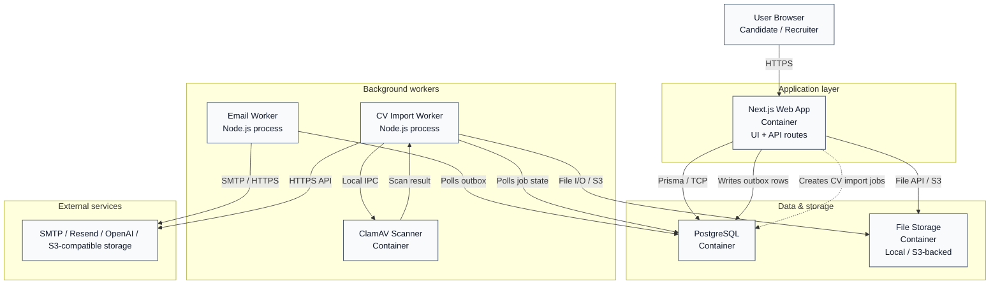

**Author:** Nguyễn Minh Khôi 
**Student ID:** 24127066 
**Reviewer:** Nguyễn Gia Quốc Uy
# C4 Level 2 Container Diagram — SmartHire

## Container descriptions

### 1. User Browser
- Responsibilities: Presents the SmartHire UI to candidates and recruiters, handles authenticated sessions, and submits requests for profile, job-board, and CV flows.
- Technology used: Modern web browser, HTTPS, optional progressive web interaction.
- Data provided: Login credentials, profile edits, job searches, CV uploads, application actions.
- Which container calls it?: It calls the Next.js web application over HTTPS.
- Communication protocol: HTTPS/HTTP(S) requests.

### 2. Next.js Web Application
- Responsibilities: Serves the React/Next.js UI and API routes, handles authentication, profile management, job-board operations, CV import requests, and writes transactional events such as email outbox records.
- Technology used: Next.js 16, React 19, TypeScript, Better Auth, Prisma, Tailwind CSS.
- Data provided: User sessions, profile data, job listings, applications, audit records, and CV metadata.
- Which container calls it?: The browser calls it; it also reads from PostgreSQL and file storage and creates background work through shared database state.
- Communication protocol: HTTPS for client traffic; Prisma over PostgreSQL TCP for data access; file-system/S3 SDK for storage.

### 3. PostgreSQL Database
- Responsibilities: Stores the system of record for users, authentication, profiles, jobs, applications, audit trails, and email outbox state.
- Technology used: PostgreSQL 16.12 with Prisma ORM.
- Data provided: Persistent application data and transactional state used by the web app and workers.
- Which container calls it?: The Next.js app, email worker, and CV worker all use it.
- Communication protocol: SQL over TCP/SSL (through Prisma client).

### 4. Email Worker
- Responsibilities: Processes transactional emails from the outbox, such as registration verification, password reset, and security notifications.
- Technology used: Node.js/TypeScript background process, Prisma, and SMTP/Resend adapters.
- Data provided: Email outbox rows, delivery attempts, retry metadata, and provider result state.
- Which container/process calls it?: The web application writes outbox rows in PostgreSQL, and the worker consumes them through shared database state.
- Communication protocol: Database polling via SQL/Prisma and SMTP or HTTPS API to external providers.

### 5. CV Import Worker
- Responsibilities: Handles asynchronous CV ingestion, malware scanning coordination, text extraction, optional OpenAI parsing, review consent, retry, and cleanup.
- Technology used: Node.js/TypeScript worker, Prisma, and ClamAV integration.
- Data provided: CV binaries, parser artifacts, review status, extracted text, consent state, and derived metadata.
- Which container calls it?: The web application creates CV import jobs in PostgreSQL; the worker polls that state and shared storage for processing.
- Communication protocol: Database polling via SQL/Prisma, shared storage access, same-host ClamAV IPC, and HTTPS API to external AI services.

### 6. ClamAV Scanner
- Responsibilities: Scans uploaded CV files for malware before they are accepted into the processing pipeline.
- Technology used: ClamAV 1.4 running in a container with a local socket interface.
- Data provided: Scan requests and scan results for uploaded files.
- Which container calls it?: The CV processing worker calls it.
- Communication protocol: ClamD protocol over a Unix domain socket (local IPC).

### 7. File Storage
- Responsibilities: Stores uploaded CV files and other private artifacts outside the relational database.
- Technology used: Local filesystem storage in development or S3-compatible object storage in production-like deployments.
- Data provided: Uploaded documents, extracted files, processing artifacts, and retention-controlled content.
- Which container calls it?: The web application writes uploads, and the CV import worker reads and updates them.
- Communication protocol: File-system API or S3-compatible SDK calls.

### 8. External Services
- Responsibilities: Provide email delivery, AI parsing, and object-storage capabilities when configured.
- Technology used: SMTP/Resend, OpenAI-compatible APIs, and S3-compatible storage services.
- Data provided: Delivery requests, AI parsing requests, and stored artifacts.
- Which container calls it?: The email worker and CV import worker call these services; the web app also relies on them indirectly for mail and AI-driven workflows.
- Communication protocol: SMTP for mail and HTTPS REST APIs for AI/object-storage integrations.

