# C4 Level 2 Container Diagram — SmartHire

**Performed by:** Nguyễn Minh Khôi 
**Student ID:** 24127066 
**Reviewed by:** Nguyễn Gia Quốc Uy 
**Edited by:** Nguyễn Minh Khôi

**Architecture scope:** Implemented SmartHire baseline, including the admin lifecycle worker that supports verification, moderation, notifications, support, connections, and job-post management. The diagram includes every deployable runtime and logical data store currently required by the implemented features.

```mermaid
flowchart TB
    Visitor["Visitor\n[Person]\nUnauthenticated"]
    Candidate["Candidate\n[Person]\nAuthenticated"]
    Recruiter["Recruiter / Company Member\n[Person]\nAuthenticated, membership-authorized"]

    Visitor -->|"HTTP(S) — browse/search jobs, view details,\nimage-assisted search, and register"| Web
    Candidate -->|"HTTP(S) — authenticate, manage profile/CV,\nsearch, apply, and track applications"| Web
    Recruiter -->|"HTTP(S) — update candidate application\nstages via implemented recruiter API"| Web

    subgraph SmartHire["SmartHire Platform"]
        direction TB

        subgraph AppLayer["Application layer"]
            Web["Next.js Web Application\nContainer\nNext.js 16, React 19, TypeScript\nServer-side services & API routes\n(Next.js App Router)"]
        end

        subgraph WorkerLayer["Background workers"]
            direction TB
            EmailWorker["Email Worker\nContainer\nNode.js / TypeScript"]
            CVWorker["CV Worker\nContainer\nNode.js / TypeScript"]
            ImageWorker["Image Search Worker\nContainer\nNode.js / TypeScript"]
            AdminWorker["Admin Worker\nContainer\nNode.js / TypeScript"]
        end

        subgraph ProcessingLayer["Processing services"]
            direction LR
            ClamAV["Malware Scanner\nContainer\nClamAV 1.4"]
            OCREngine["OCR Engine\nContainer\nPython 3.12, PaddleOCR, ONNX Runtime, FastAPI"]
        end

        subgraph DataLayer["Data & storage"]
            direction LR
            DB[("PostgreSQL\nContainer\nPostgreSQL 16")]
            MailCapture[("Local Mail Capture\nLogical data store\nFilesystem — default when\nEMAIL_ADAPTER=capture")]
            CVStorage[("Local CV Artifact Store\nLogical data store\nApplication-encrypted filesystem\n— default")]
            SearchStorage[("Local Search Artifact Store\nLogical data store\nAES-256-GCM filesystem\n— default")]
            AdminEvidence[("Local Admin Evidence Store\nLogical data store\nAES-256-GCM filesystem\n— default")]
        end
    end

    subgraph ExternalLayer["External services — optional unless noted"]
        EmailProvider["Email Provider\nSMTP / Resend\nOptional — only when EMAIL_ADAPTER is not capture"]
        AIProvider["OpenAI Responses API\nOptional — requires feature configuration,\nprivacy gate, and consent"]
        AWSStorage["AWS S3, KMS, IAM\nOptional — adapter implemented,\ninfrastructure not provisioned"]
        ClamAVUpdates["ClamAV Definition Service\nSignature source required by freshclam"]
        BusinessRegistry["VietQR Business Registry\nOptional — business verification lookup"]
    end

    Web -->|"PostgreSQL wire protocol via Prisma —\nread/write data, outbox, and durable work"| DB
    Web -->|"Filesystem API via storage adapter —\nwrite CV upload"| CVStorage
    Web -->|"Filesystem API via storage adapter —\nwrite search image"| SearchStorage
    Web -->|"Filesystem API via storage adapter —\nwrite/read verification evidence"| AdminEvidence
    Web -.->|"AWS S3 API / HTTPS —\nwhen storage adapter is s3"| AWSStorage
    Web -.->|"HTTPS — business registry lookup\nwhen provider is enabled"| BusinessRegistry

    EmailWorker -->|"PostgreSQL wire protocol via Prisma —\nclaim and update EmailOutbox"| DB
    EmailWorker -->|"Filesystem API —\nwrite email through capture adapter"| MailCapture
    EmailWorker -.->|"SMTP / HTTPS — send transactional\nemail when configured"| EmailProvider

    CVWorker -->|"PostgreSQL wire protocol via Prisma —\nclaim lease; update state, draft, and audit"| DB
    CVWorker -->|"Filesystem API via storage adapter —\nread/write/delete CV artifacts"| CVStorage
    CVWorker -.->|"AWS S3 API / HTTPS —\nwhen adapter is s3"| AWSStorage
    CVWorker -->|"ClamD protocol over private Unix socket —\nscan documents"| ClamAV
    CVWorker -->|"HTTP over private Unix socket —\nOCR PDF pages or DOCX images"| OCREngine
    CVWorker -.->|"HTTPS — parse CV when configuration,\nprivacy gate, and consent allow"| AIProvider

    ImageWorker -->|"PostgreSQL wire protocol via Prisma —\nclaim lease; update lifecycle and deletion evidence"| DB
    ImageWorker -->|"Filesystem API via storage adapter —\nread/write/delete search artifacts"| SearchStorage
    ImageWorker -.->|"AWS S3 API / HTTPS —\nwhen adapter is s3"| AWSStorage
    ImageWorker -->|"ClamD protocol over private Unix socket —\nscan image before decoding"| ClamAV
    ImageWorker -->|"HTTP over private Unix socket —\nrecognize normalized image"| OCREngine
    ImageWorker -.->|"HTTPS — interpret OCR text\ninto filter proposals when permitted"| AIProvider

    AdminWorker -->|"PostgreSQL wire protocol via Prisma —\nclaim work; update state, notifications,\nand retention evidence"| DB
    AdminWorker -->|"Filesystem API via storage adapter —\nread/delete verification evidence"| AdminEvidence
    AdminWorker -.->|"AWS S3 API / HTTPS —\nwhen adapter is s3"| AWSStorage
    AdminWorker -->|"ClamD protocol over private Unix socket —\nsafety-scan evidence"| ClamAV

    ClamAV -->|"HTTPS — update signatures\nthrough freshclam"| ClamAVUpdates

    classDef container fill:#f8fafc,stroke:#475569,stroke-width:1.2px,color:#0f172a;
    classDef person fill:#eef2ff,stroke:#1d4ed8,stroke-width:1.2px,color:#1e3a8a;
    classDef external fill:#fff7e6,stroke:#8a5a00,stroke-width:1.2px,color:#0f172a,stroke-dasharray: 5 5;
    class Web,EmailWorker,CVWorker,ImageWorker,AdminWorker,ClamAV,OCREngine,DB,MailCapture,CVStorage,SearchStorage,AdminEvidence container;
    class Visitor,Candidate,Recruiter person;
    class EmailProvider,AIProvider,AWSStorage,ClamAVUpdates,BusinessRegistry external;
```

## Container descriptions

### 1. Next.js Web Application

- Responsibilities: Serves both the React/Next.js frontend and the **server-side services & API routes** (Next.js App Router Route Handlers and backend services) in one deployable container; handles authentication, profile management, job-board operations, CV import admission, image-search admission, recruiter verification (business-registry lookup, evidence submission), and writes durable work (email outbox, CV-import, and image-search rows) into PostgreSQL.
- Technology used: Next.js 16, React 19, TypeScript, Better Auth, Prisma, Tailwind CSS.
- Data provided: User sessions, profile data, job listings, applications, audit records, CV import metadata, verification evidence and preparation state.
- Which container calls it?: `Visitor` and `Candidate` use the implemented browser-facing workflows. Membership-authorized `Recruiter / Company Member` actors call the narrowly scoped recruiter application-stage API over HTTP(S); this does not imply a complete recruiter frontend.
- Communication protocol: HTTP(S) for client traffic; PostgreSQL wire protocol using Prisma for database access; Filesystem API through the storage adapter by default; HTTPS to the VietQR business registry when the provider is enabled; AWS S3 API/HTTPS only when the adapter is switched to `s3` (not provisioned in this repository).

The separate Frontend and Backend Level 3 diagrams are two logical component views of this single deployable Next.js container.

### 2. Email Worker

- Responsibilities: Claims EmailOutbox rows written by the web app and sends transactional email (registration verification, password reset, security notifications) with retry.
- Technology used: Node.js/TypeScript background process, Prisma, capture/SMTP/Resend adapters.
- Data provided: Email outbox rows, delivery attempts, retry metadata, provider result state.
- Which container calls it?: Consumes shared database state written by the Web Application.
- Communication protocol: PostgreSQL wire protocol using Prisma for claiming outbox rows; Filesystem API to `Local Mail Capture` when `EMAIL_ADAPTER=capture` (the local default); SMTP/HTTPS to the external Email Provider only when a non-capture adapter is configured.

### 3. CV Worker

- Responsibilities: Processes asynchronous CV ingestion — malware scanning coordination, hybrid extraction, OCR for eligible content, optional AI-assisted parsing, cleanup and reconciliation.
- Technology used: Node.js/TypeScript worker, Prisma, ClamAV and OCR Engine adapters.
- Data provided: CV binaries, parser artifacts, review status, extracted text, consent state, derived metadata.
- Which container calls it?: Claims CV import jobs the Web Application writes into PostgreSQL.
- Communication protocol: PostgreSQL wire protocol using Prisma for lease claim/update; Filesystem API through the storage adapter by default (AWS S3 API/HTTPS only if `s3` is configured); ClamD protocol over a private Unix socket to the Malware Scanner; HTTP over a private Unix socket to the OCR Engine; HTTPS to OpenAI only when configuration, privacy gate, and consent allow.

### 4. Image Search Worker

- Responsibilities: Processes image-assisted job search — scans and decodes uploaded images, normalizes to PNG, requests OCR, interprets OCR text into search-filter suggestions, and performs cleanup with a strict deletion deadline.
- Technology used: Node.js/TypeScript worker, Prisma, ClamAV and OCR Engine adapters, OpenAI adapter for intent interpretation.
- Data provided: Normalized image artifacts, OCR text, interpreted search criteria, deletion evidence.
- Which container calls it?: Claims image-search work the Web Application writes into PostgreSQL.
- Communication protocol: PostgreSQL wire protocol using Prisma for lease claim/update; Filesystem API through the storage adapter by default (AWS S3 API/HTTPS only if `s3` is configured); ClamD protocol over a private Unix socket to the Malware Scanner; HTTP over a private Unix socket to the OCR Engine; HTTPS to OpenAI only when configuration, privacy gate, and consent allow.

### 5. Admin Worker

- Responsibilities: Runs the admin lifecycle loops — dashboard snapshot calculation, verification evidence safety scanning and deadlines, verification/business-registry preparation cleanup, security and verification notification reconciliation, in-app notification retention, evidence/rationale retention, support lifecycle, professional-connection proposal lifecycle, and job-post auto-archival.
- Technology used: Node.js/TypeScript worker, Prisma, ClamAV adapter, filesystem/S3 evidence storage adapters.
- Data provided: Dashboard snapshots, verification evidence states, notification and retention evidence, lifecycle transitions.
- Which container calls it?: Claims verification, notification, retention, and lifecycle work the Web Application and other flows write into PostgreSQL.
- Communication protocol: PostgreSQL wire protocol using Prisma for claiming/updating work; Filesystem API to the Local Admin Evidence Store by default (AWS S3 API/HTTPS only if `s3` is configured); ClamD protocol over a private Unix socket to the Malware Scanner for evidence safety checks.

### 6. OCR Engine

- Responsibilities: Receives normalized images from CV Worker and Image Search Worker and returns recognized text, geometry, and confidence.
- Technology used: Python 3.12, PaddleOCR, ONNX Runtime, FastAPI, exposed only over a private Unix socket.
- Data provided: Recognition results (text, geometry, confidence) for CV pages and search images.
- Which container calls it?: CV Worker and Image Search Worker.
- Communication protocol: HTTP over a private Unix socket.

### 7. Malware Scanner

- Responsibilities: Scans uploaded CV files, search images, and verification evidence for malware before they are accepted into the processing pipeline (fail-closed).
- Technology used: ClamAV 1.4 running in a container with a local socket interface; signatures refreshed via `freshclam` against the ClamAV Definition Service.
- Data provided: Scan requests and scan results.
- Which container calls it?: CV Worker, Image Search Worker, and Admin Worker.
- Communication protocol: ClamD protocol over a private Unix domain socket (local IPC); HTTPS to the external ClamAV Definition Service for signature updates.

### 8. PostgreSQL

- Responsibilities: System of record for users, authentication, profiles, jobs, applications, audit trails, email outbox, CV import and image-search work state, verification, notifications, support, connections, and job-post lifecycle state.
- Technology used: PostgreSQL 16 with Prisma ORM.
- Data provided: Persistent application data and durable-work/lease state used by the web app and all workers.
- Which container calls it?: Web Application, Email Worker, CV Worker, Image Search Worker, Admin Worker.
- Communication protocol: PostgreSQL wire protocol using Prisma as the client/ORM.

### 9. Local Mail Capture

- Responsibilities: Local default backend for outbound email — writes messages to a gitignored local path instead of sending them, used whenever `EMAIL_ADAPTER=capture`.
- Technology used: Filesystem.
- Data provided: Captured transactional email content for local inspection.
- Which container calls it?: Email Worker.
- Communication protocol: Filesystem API.

### 10. Local CV Artifact Store

- Responsibilities: Default storage for uploaded CV files and processing artifacts when the storage adapter is `filesystem`.
- Technology used: Application-encrypted filesystem.
- Data provided: Uploaded documents, extracted segments, drafts, and retention-controlled content.
- Which container calls it?: Web Application (writes uploads) and CV Worker (reads/writes/deletes artifacts).
- Communication protocol: Filesystem storage adapter.

### 11. Local Search Artifact Store

- Responsibilities: Default storage for image-search artifacts (source image, normalized PNG, OCR text, candidate intent) when the storage adapter is `filesystem`.
- Technology used: AES-256-GCM filesystem.
- Data provided: Ephemeral search artifacts subject to a strict deletion deadline.
- Which container calls it?: Web Application (writes uploads) and Image Search Worker (reads/writes/deletes artifacts).
- Communication protocol: Filesystem storage adapter.

### 12. Local Admin Evidence Store

- Responsibilities: Default storage for recruiter/company verification evidence (business license files) when the evidence storage adapter is `filesystem`.
- Technology used: AES-256-GCM application-encrypted filesystem (keyed from `ADMIN_EVIDENCE_KEY_V1` or a derived secret).
- Data provided: Encrypted business-license evidence files subject to a strict retention/delete deadline.
- Which container calls it?: Web Application (writes/reads verification evidence) and Admin Worker (reads and deletes evidence during safety/retention cycles).
- Communication protocol: Filesystem storage adapter.

### 13. External Services — optional unless noted

- **Email Provider (SMTP/Resend)** — optional; only called by Email Worker when `EMAIL_ADAPTER` is not `capture`. Protocol: SMTP/HTTPS.
- **OpenAI Responses API** — optional; only called by CV Worker and Image Search Worker when the corresponding feature flag, privacy gate, and user consent all allow it. Protocol: HTTPS.
- **AWS S3, KMS, IAM** — optional; storage/preflight adapters are implemented in code, but this repository does not provision any bucket, KMS key, or IAM role. Only used when the storage adapter is switched to `s3`. Protocol: AWS API/HTTPS.
- **ClamAV Definition Service** — not optional for the Malware Scanner to function correctly; `freshclam` needs it to keep malware signatures current. Protocol: HTTPS.
- **VietQR Business Registry** — optional; called by the Web Application over HTTPS only when the business-verification registry provider is enabled for company-lookup during recruiter verification. Protocol: HTTPS.
