# C4 Level 2 Container Diagram — SmartHire

*Performed by: Nguyễn Minh Khôi | Reviewed by: Lưu Chí Hải | Edited by: Nguyễn Minh Khôi*  
**Version:** V1.4 (2026-08-26) — PA5 Final Document Synchronization Baseline

### Revision History

| Version | Date | Author/Editor | Summary | Status |
|---|---|---|---|---|
| 1.3 | 2026-08-06 | Nguyễn Minh Khôi | Updated containers and logical stores for PA4 baseline. | Baseline |
| 1.4 | 2026-08-26 | Nguyễn Minh Khôi | Added Analytics Export Worker, Admin Backup Runner, Local Export/Backup stores, Socket.IO gateway, and Google Drive adapter. Reconciled container qualifications for PA5. | Approved |

**Architecture scope:** Implemented SmartHire 26-feature baseline, including background workers for email, CV parsing, image search, admin lifecycle, analytics export, and encrypted database backup.

```mermaid
flowchart TB
    Visitor["Visitor\n[Person]\nUnauthenticated"]
    Candidate["Candidate\n[Person]\nAuthenticated"]
    Recruiter["Recruiter / Company Member\n[Person]\nAuthenticated, membership-authorized"]
    PlatformAdmin["Platform Administrator\n[Person]\nAuthenticated, recent 2FA"]

    Visitor -->|"HTTP(S) — browse/search jobs, view details,\nimage-assisted search, and register"| Web
    Candidate -->|"HTTP(S) & ws/wss — profile, CV upload,\napply, track, Kanban, and realtime chat"| Web
    Recruiter -->|"HTTP(S) & ws/wss — job posts, candidate scoring,\npipeline Kanban, analytics, team, chat"| Web
    PlatformAdmin -->|"HTTP(S) — verification, moderation, user audit,\nand privileged database backup"| Web

    subgraph SmartHire["SmartHire Platform"]
        direction TB

        subgraph AppLayer["Application layer"]
            Web["Next.js Web Application\nContainer\nNext.js 16.3, React 19, TypeScript\nServer-side services, Route Handlers,\nand Socket.IO Gateway (/chat)"]
        end

        subgraph WorkerLayer["Background workers"]
            direction TB
            EmailWorker["Email Worker\nContainer\nNode.js / TypeScript"]
            CVWorker["CV Worker\nContainer\nNode.js / TypeScript"]
            ImageWorker["Image Search Worker\nContainer\nNode.js / TypeScript"]
            AdminWorker["Admin Worker\nContainer\nNode.js / TypeScript"]
            ExportWorker["Analytics Export Worker\nContainer\nNode.js / TypeScript (ExcelJS)"]
            BackupWorker["Admin Backup Process\nContainer\nNode.js / TypeScript (pg_dump)"]
        end

        subgraph ProcessingLayer["Processing services"]
            direction LR
            ClamAV["Malware Scanner\nContainer\nClamAV 1.4"]
            OCREngine["OCR Engine\nContainer\nPython 3.12, PaddleOCR, ONNX Runtime, FastAPI"]
        end

        subgraph DataLayer["Data & storage"]
            direction LR
            DB[("PostgreSQL\nContainer\nPostgreSQL 16")]
            MailCapture[("Local Mail Capture\nLogical data store\nFilesystem — default when\nEMAIL_ADAPTER=capture")]
            CVStorage[("Local CV Artifact Store\nLogical data store\nApplication-encrypted filesystem\n— default")]
            SearchStorage[("Local Search Artifact Store\nLogical data store\nAES-256-GCM filesystem\n— default")]
            AdminEvidence[("Local Admin Evidence Store\nLogical data store\nAES-256-GCM filesystem\n— default")]
            ExportStorage[("Local Export Store\nLogical data store\nFilesystem (Excel/CSV)")]
            BackupStorage[("Local Backup Store\nLogical data store\nAES-256-GCM encrypted dumps")]
        end
    end

    subgraph ExternalLayer["External services — optional unless noted"]
        EmailProvider["Email Provider\nSMTP / Resend\nOptional — when EMAIL_ADAPTER is not capture"]
        AIProvider["OpenAI Responses API\nOptional — requires feature configuration,\nprivacy gate, and consent"]
        AWSStorage["AWS S3, KMS, IAM\nOptional — adapter implemented,\ninfrastructure not provisioned"]
        ClamAVUpdates["ClamAV Definition Service\nSignature source required by freshclam"]
        BusinessRegistry["VietQR Business Registry\nOptional — business verification lookup"]
        GoogleDrive["Google Drive Storage\nOptional — encrypted backup upload via OAuth2"]
    end

    Web -->|"PostgreSQL wire protocol via Prisma —\nread/write data, outbox, and durable work"| DB
    Web -->|"Filesystem API via storage adapter —\nwrite CV upload"| CVStorage
    Web -->|"Filesystem API via storage adapter —\nwrite search image"| SearchStorage
    Web -->|"Filesystem API via storage adapter —\nwrite/read verification evidence"| AdminEvidence
    Web -->|"Filesystem API — stream generated export"| ExportStorage
    Web -.->|"AWS S3 API / HTTPS —\nwhen storage adapter is s3"| AWSStorage
    Web -.->|"HTTPS — business registry lookup\nwhen provider is enabled"| BusinessRegistry

    EmailWorker -->|"PostgreSQL wire protocol via Prisma —\nclaim and update EmailOutbox"| DB
    EmailWorker -->|"Filesystem API —\nwrite email through capture adapter"| MailCapture
    EmailWorker -.->|"SMTP / HTTPS — send transactional\nemail when configured"| EmailProvider

    CVWorker -->|"PostgreSQL wire protocol via Prisma —\nclaim lease; update state, draft, and audit"| DB
    CVWorker -->|"Filesystem API via storage adapter —\nread/write/delete CV artifacts"| CVStorage
    CVWorker -.->|"AWS S3 API / HTTPS —\nwhen adapter is s3"| AWSStorage
    CVWorker -->|"ClamD protocol over private Unix socket —\nscan documents"| ClamAV
    CVWorker -->|"HTTP over private Unix socket —\nOCR PDF pages or DOCX images"| OCREngine
    CVWorker -.->|"HTTPS — parse CV when configuration,\nprivacy gate, and consent allow"| AIProvider

    ImageWorker -->|"PostgreSQL wire protocol via Prisma —\nclaim lease; update lifecycle and deletion evidence"| DB
    ImageWorker -->|"Filesystem API via storage adapter —\nread/write/delete search artifacts"| SearchStorage
    ImageWorker -.->|"AWS S3 API / HTTPS —\nwhen adapter is s3"| AWSStorage
    ImageWorker -->|"ClamD protocol over private Unix socket —\nscan image before decoding"| ClamAV
    ImageWorker -->|"HTTP over private Unix socket —\nrecognize normalized image"| OCREngine
    ImageWorker -.->|"HTTPS — interpret OCR text\ninto filter proposals when permitted"| AIProvider

    AdminWorker -->|"PostgreSQL wire protocol via Prisma —\nclaim work; update state, notifications,\nand retention evidence"| DB
    AdminWorker -->|"Filesystem API via storage adapter —\nread/delete verification evidence"| AdminEvidence
    AdminWorker -.->|"AWS S3 API / HTTPS —\nwhen adapter is s3"| AWSStorage
    AdminWorker -->|"ClamD protocol over private Unix socket —\nsafety-scan evidence"| ClamAV

    ExportWorker -->|"PostgreSQL wire protocol via Prisma —\nclaim ExportRequest jobs"| DB
    ExportWorker -->|"Filesystem API — write Excel/CSV files"| ExportStorage

    BackupWorker -->|"PostgreSQL wire protocol / pg_dump —\nextract schema and data"| DB
    BackupWorker -->|"Filesystem API — write AES-256-GCM encrypted dumps"| BackupStorage
    BackupWorker -.->|"HTTPS / OAuth2 — upload encrypted dumps"| GoogleDrive

    ClamAV -->|"HTTPS — update signatures\nthrough freshclam"| ClamAVUpdates

    classDef container fill:#f8fafc,stroke:#475569,stroke-width:1.2px,color:#0f172a;
    classDef person fill:#eef2ff,stroke:#1d4ed8,stroke-width:1.2px,color:#1e3a8a;
    classDef external fill:#fff7e6,stroke:#8a5a00,stroke-width:1.2px,color:#0f172a,stroke-dasharray: 5 5;
    class Web,EmailWorker,CVWorker,ImageWorker,AdminWorker,ExportWorker,BackupWorker,ClamAV,OCREngine,DB,MailCapture,CVStorage,SearchStorage,AdminEvidence,ExportStorage,BackupStorage container;
    class Visitor,Candidate,Recruiter,PlatformAdmin person;
    class EmailProvider,AIProvider,AWSStorage,ClamAVUpdates,BusinessRegistry,GoogleDrive external;
```

## Container descriptions

*Performed by: Nguyễn Minh Khôi | Reviewed by: Lưu Chí Hải | Edited by: Nguyễn Minh Khôi*

### 1. Next.js Web Application

- **Responsibilities:** Serves the React/Next.js frontend, App Router Route Handlers, modular backend services, and real-time Socket.IO gateway (`/chat`); handles authentication, profile management, job discovery/applications, CV intake, image search admission, recruiter operations (postings, hybrid candidate scoring, 9-stage Kanban pipeline, team management, company settings), candidate connection proposals, general and recruitment messaging, in-app notifications, and admin console functions.
- **Technology used:** Next.js 16.3, React 19, TypeScript 5.9, Better Auth, Prisma 7.9, Socket.IO, Tailwind CSS 4, Radix UI.
- **Data provided:** User sessions, profile data, job listings, applications, scoring assessments, messaging conversations, audit records, verification evidence, and export download links.
- **Which container calls it?:** `Visitor`, `Candidate`, `Recruiter / Company Member`, and `Platform Administrator` over HTTP(S) and WebSocket (`ws/wss`).
- **Communication protocol:** HTTP(S) and WebSocket for client traffic; PostgreSQL wire protocol using Prisma for database access; Filesystem API through storage adapters; HTTPS to external providers when enabled.

### 2. Email Worker

- **Responsibilities:** Claims `EmailOutbox` records written by the web app and sends transactional email (verification, password recovery, invitations, notifications, and security alerts) with exponential retry.
- **Technology used:** Node.js/TypeScript background worker, Prisma, React Email, capture/SMTP/Resend adapters.
- **Data provided:** Email outbox status, delivery logs, retry attempts.
- **Which container calls it?:** Consumes shared database outbox state.
- **Communication protocol:** PostgreSQL wire protocol via Prisma; Filesystem API to `Local Mail Capture` when `EMAIL_ADAPTER=capture`; SMTP/HTTPS to external Email Provider when configured.

### 3. CV Worker

- **Responsibilities:** Handles asynchronous CV ingestion — fail-closed malware scan coordination via ClamAV, text extraction, OCR invocation, optional AI-assisted parsing, and draft reconciliation.
- **Technology used:** Node.js/TypeScript worker, Prisma, PDF.js, Mammoth, Sharp, ClamAV and OCR Engine adapters.
- **Data provided:** Extracted CV text, parsed profile sections, parser status, and audit records.
- **Which container calls it?:** Claims CV import jobs written by the Web Application into PostgreSQL.
- **Communication protocol:** PostgreSQL wire protocol; Filesystem API; ClamD protocol over private Unix socket; HTTP over private Unix socket to OCR Engine; HTTPS to OpenAI when configured and consented.

### 4. Image Search Worker

- **Responsibilities:** Ingests images for job search — scans and decodes images, normalizes to PNG, requests OCR, interprets search intent into filter suggestions, and enforces strict deletion deadlines.
- **Technology used:** Node.js/TypeScript worker, Prisma, Sharp, ClamAV and OCR Engine adapters, optional OpenAI adapter.
- **Data provided:** Normalized image artifacts, OCR text, structured filter suggestions.
- **Which container calls it?:** Claims image search work from PostgreSQL.
- **Communication protocol:** PostgreSQL wire protocol; Filesystem API; ClamD protocol over Unix socket; HTTP over Unix socket to OCR Engine; HTTPS to OpenAI when configured.

### 5. Admin Worker

- **Responsibilities:** Executes administrative lifecycle tasks — dashboard metric pre-computation, verification document safety scanning, notification retention cleanup, support ticket lifecycle, connection proposal expiry, and automated job posting archival.
- **Technology used:** Node.js/TypeScript worker, Prisma, ClamAV adapter.
- **Data provided:** Dashboard summaries, retention evidence, expired connection cleanup logs.
- **Which container calls it?:** Claims administrative work loops from PostgreSQL.
- **Communication protocol:** PostgreSQL wire protocol; Filesystem API; ClamD protocol over Unix socket.

### 6. Analytics Export Worker

- **Responsibilities:** Generates company-scoped recruitment data exports (candidate lists, application funnel histories, stage times) in Microsoft Excel (.xlsx) and CSV formats asynchronously.
- **Technology used:** Node.js/TypeScript worker, Prisma, ExcelJS.
- **Data provided:** Generated `.xlsx` and `.csv` files stored in `Local Export Store` with time-limited access tokens.
- **Which container calls it?:** Claims `ExportRequest` jobs from PostgreSQL.
- **Communication protocol:** PostgreSQL wire protocol via Prisma; Filesystem API to write export files.

### 7. Admin Backup Process

- **Responsibilities:** Executes manual and scheduled full database backups — triggers `pg_dump`, compresses output, encrypts stream using AES-256-GCM, stores dumps locally, and optionally uploads to Google Drive via OAuth2.
- **Technology used:** Node.js/TypeScript runner, PostgreSQL `pg_dump` CLI, AES-256-GCM crypto, Google Drive OAuth2 API.
- **Data provided:** Encrypted database backup artifacts, `BackupRun` logs, checksums, and durations.
- **Which container calls it?:** Triggered by Platform Administrator (with recent 2FA) or automated schedule loop.
- **Communication protocol:** PostgreSQL wire protocol / local process execution; Filesystem API; HTTPS to Google Drive API.
- **Restore Qualification:** Out-of-band administrative disaster recovery only; no in-app restore UI.

### 8. OCR Engine

- **Responsibilities:** Receives normalized images from CV Worker and Image Search Worker; returns recognized text, bounding boxes, and confidence scores.
- **Technology used:** Python 3.12, PaddleOCR, ONNX Runtime, FastAPI exposed only over a private Unix socket with read-only root.
- **Data provided:** Raw text and character geometry.
- **Which container calls it?:** CV Worker and Image Search Worker.
- **Communication protocol:** HTTP over a private Unix socket.

### 9. Malware Scanner

- **Responsibilities:** Scans uploaded CV files, search images, and business verification documents for malware before ingestion (fail-closed).
- **Technology used:** ClamAV 1.4 daemon; signatures updated via `freshclam`.
- **Data provided:** Malware scan status (`Clean`, `Infected`, `Error`).
- **Which container calls it?:** CV Worker, Image Search Worker, and Admin Worker.
- **Communication protocol:** ClamD protocol over private Unix socket; HTTPS to ClamAV Definition Service.

### 10. PostgreSQL

- **Responsibilities:** Authoritative relational database for all users, memberships, jobs, applications, scoring models, messaging, outbox, backup runs, and audit logs.
- **Technology used:** PostgreSQL 16 with Prisma ORM 7.9.
- **Data provided:** Persistent entities, relational tables, and transactional state.
- **Which container calls it?:** Web Application and all background workers.
- **Communication protocol:** PostgreSQL wire protocol.

### 11. Local Logical Data Stores

- **Local Mail Capture:** Captures transactional emails to filesystem when `EMAIL_ADAPTER=capture`.
- **Local CV Artifact Store:** AES-256 encrypted store for candidate CV uploads and parsed drafts.
- **Local Search Artifact Store:** AES-256-GCM ephemeral store for job search images with auto-deletion deadlines.
- **Local Admin Evidence Store:** Application-encrypted filesystem store for company verification business licenses.
- **Local Export Store:** Ephemeral store for generated recruitment Excel/CSV exports with expiration deadlines.
- **Local Backup Store:** Secure filesystem store for AES-256-GCM encrypted database dumps.

### 12. External Services (Optional / Qualified)

- **Email Provider (SMTP / Resend):** Optional external transactional email provider when `EMAIL_ADAPTER!=capture`.
- **OpenAI Responses API:** Optional AI provider for semantic scoring and image search interpretation; strictly advisory with deterministic fallback.
- **AWS S3, KMS, IAM:** Optional cloud storage adapter; code implemented, infrastructure unprovisioned in default demo.
- **ClamAV Definition Service:** Signature update source for `freshclam` over HTTPS.
- **VietQR Business Registry:** Optional lookup provider for Vietnamese enterprise tax/business verification.
- **Google Drive Storage Provider:** Optional cloud target for encrypted database backups via OAuth2.
