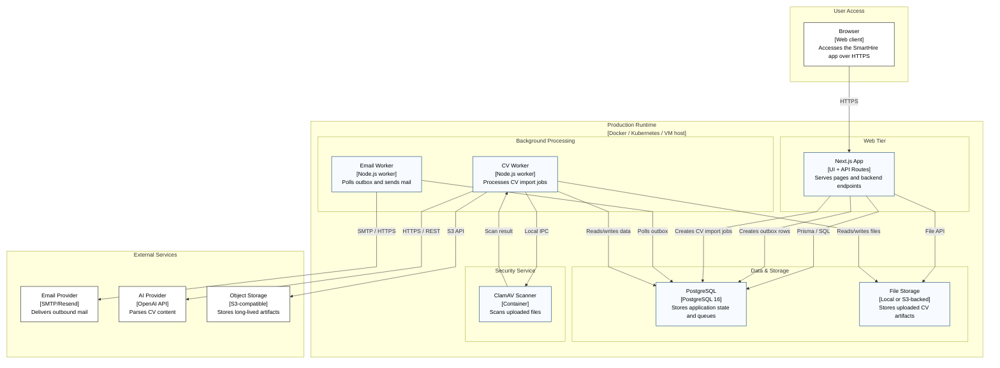

**Author:** Nguyễn Minh Khôi 
**Student ID:** 24127066 
**Reviewer:** Nguyễn Gia Quốc Uy
# C4 Level 1 Deployment Diagram — SmartHire

## Deployment Description

The deployment diagram shows SmartHire running as a web application plus background worker services on a shared runtime host or container platform. The Next.js application serves both the browser UI and the backend API routes, and it connects to PostgreSQL for transactional data and to file storage for uploaded CV assets.

Background processing is handled by separate worker services. The Email Worker polls the shared database outbox and sends messages through an external email provider. The CV Worker processes uploaded resumes by reading files from storage, scanning them through the ClamAV service, calling the external AI parsing provider, and storing parsed artifacts in object storage.

The external services in this deployment are:
- SMTP/Resend for outbound mail delivery
- OpenAI-compatible AI provider for CV parsing and content extraction
- S3-compatible object storage for long-lived CV artifacts

This deployment is suitable for a containerized environment such as Docker, Kubernetes, or a VM-based runtime host, with the browser as the user-facing entry point and the database, storage, and scanning services co-located on the same infrastructure.

